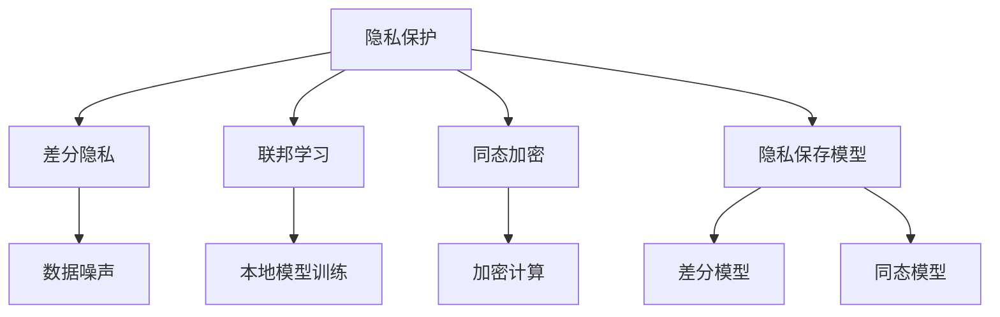
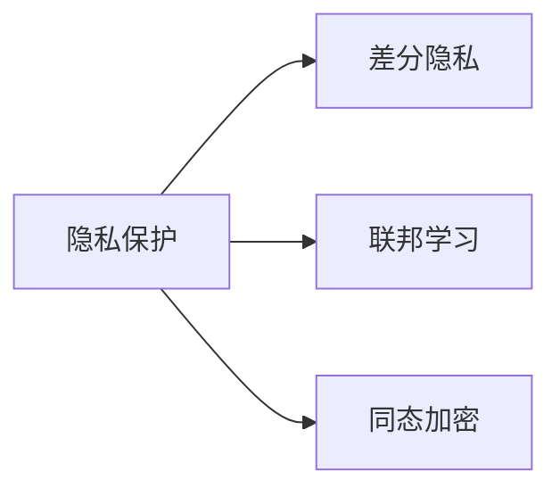
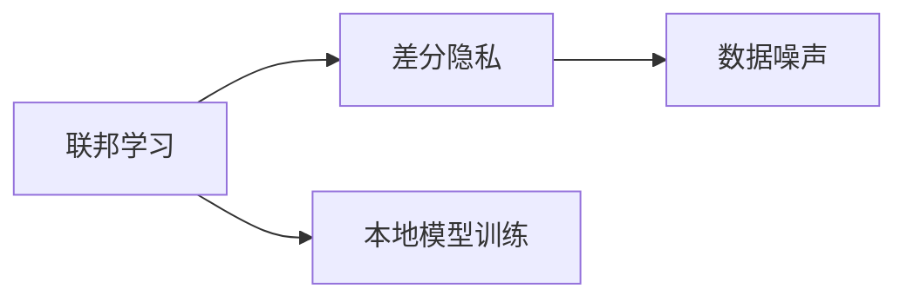
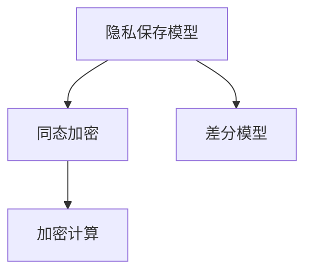
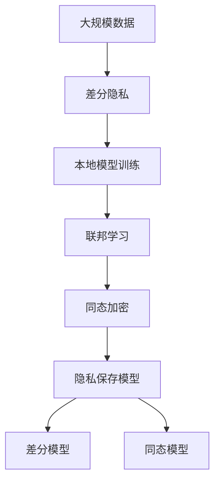

                 

# 大模型隐私保护:技术手段确保数据安全

在人工智能迅猛发展的今天，大模型的能力越来越强，其应用场景也日益广泛。然而，随之而来的隐私保护问题也越来越严峻。本文旨在探讨如何利用技术手段保护大模型训练和应用中的数据隐私，确保数据安全。

## 1. 背景介绍

### 1.1 问题由来

随着深度学习技术的发展，大模型在图像识别、自然语言处理、语音识别等领域取得了显著进展。但随之而来的隐私保护问题也不容忽视。如何在大模型的训练和应用过程中保护用户数据隐私，成为了一个重要且迫切需要解决的问题。

### 1.2 问题核心关键点

当前，大模型在训练和应用中存在的隐私问题主要包括以下几个方面：

- **数据隐私泄露**：大模型训练通常需要大量的标注数据，这些数据往往包含敏感信息，容易泄露用户隐私。
- **模型参数暴露**：大模型的参数往往体积庞大，一旦模型被攻击，其参数可能被恶意篡改，进而导致隐私泄露。
- **数据共享风险**：在多模型协同训练和多模型共享时，数据隐私容易被滥用，造成数据泄露。

这些问题如果不能有效解决，将严重威胁到数据隐私安全，影响用户的信任。

## 2. 核心概念与联系

### 2.1 核心概念概述

为更好地理解大模型隐私保护技术，本节将介绍几个密切相关的核心概念：

- **隐私保护**：指在数据处理过程中保护个人或组织的隐私不受侵害的一系列技术和策略。
- **差分隐私**：一种隐私保护技术，通过对数据添加噪声，使得攻击者无法区分单个数据点，从而保护数据隐私。
- **联邦学习**：一种分布式机器学习方法，各参与方在本地数据上训练模型，并通过安全机制交换模型参数，从而在不共享数据的情况下进行模型训练。
- **同态加密**：一种加密技术，允许在加密数据上直接执行计算，保护数据隐私。
- **隐私保存模型**：通过修改模型结构和算法，在模型训练和应用过程中减少数据泄露风险的模型。

这些概念之间的逻辑关系可以通过以下Mermaid流程图来展示：



这个流程图展示了大模型隐私保护技术的主要核心概念及其之间的关系：

1. 隐私保护是大模型隐私保护的总目标。
2. 差分隐私、联邦学习和同态加密是隐私保护的主要技术手段。
3. 隐私保存模型则是在模型层面进行隐私保护的具体实践。

这些概念共同构成了大模型隐私保护的整体生态系统，使得在大模型训练和应用中能够有效保护用户数据隐私。

### 2.2 概念间的关系

这些核心概念之间存在着紧密的联系，形成了大模型隐私保护技术的完整框架。下面我们通过几个Mermaid流程图来展示这些概念之间的关系。

#### 2.2.1 隐私保护的三个主要技术手段



这个流程图展示了隐私保护的三个主要技术手段：差分隐私、联邦学习和同态加密。这些技术手段各自有其优势和适用场景，可以相互结合，共同保障数据隐私。

#### 2.2.2 联邦学习与差分隐私的关系



这个流程图展示了联邦学习与差分隐私之间的关系。联邦学习通过本地模型训练和参数交换，可以避免数据集中存储，减少隐私泄露风险。而差分隐私通过对数据添加噪声，进一步保护数据隐私，两者结合可以有效防止数据泄露。

#### 2.2.3 隐私保存模型与同态加密的关系



这个流程图展示了隐私保存模型与同态加密之间的关系。隐私保存模型通过对模型结构和算法进行修改，减少数据泄露风险。而同态加密则允许在加密数据上直接执行计算，保护数据隐私，两者结合可以更加全面地保护数据隐私。

### 2.3 核心概念的整体架构

最后，我们用一个综合的流程图来展示这些核心概念在大模型隐私保护中的整体架构：



这个综合流程图展示了从原始数据到隐私保存模型的整个流程，其中差分隐私、联邦学习和同态加密分别在数据收集、本地训练和加密计算环节发挥作用，隐私保存模型在模型训练和推理环节保障数据隐私。

## 3. 核心算法原理 & 具体操作步骤
### 3.1 算法原理概述

大模型隐私保护技术主要依赖于差分隐私、联邦学习和同态加密等技术手段，其核心原理如下：

- **差分隐私**：通过对数据添加噪声，使得攻击者无法区分单个数据点，从而保护数据隐私。常用的差分隐私技术包括拉普拉斯机制、高斯机制等。
- **联邦学习**：各参与方在本地数据上训练模型，并通过安全机制交换模型参数，从而在不共享数据的情况下进行模型训练。常用的联邦学习技术包括参数服务器、拜占庭容错等。
- **同态加密**：一种加密技术，允许在加密数据上直接执行计算，保护数据隐私。常用的同态加密技术包括全同态加密、部分同态加密等。

这些技术手段可以独立应用，也可以结合使用，根据具体场景选择合适的隐私保护策略。

### 3.2 算法步骤详解

基于差分隐私、联邦学习和同态加密的大模型隐私保护流程大致如下：

**Step 1: 数据收集与预处理**

1. 收集需要训练的大模型所需的标注数据。
2. 对数据进行去标识化和匿名化处理，减少隐私泄露风险。
3. 对数据进行标准化和归一化处理，提高模型训练效率。

**Step 2: 差分隐私保护**

1. 对数据添加噪声，保护用户隐私。常用的差分隐私技术包括拉普拉斯机制和高斯机制。
2. 根据差分隐私预算，确定噪声参数。差分隐私预算越小，隐私保护越强，但模型精度可能降低。

**Step 3: 联邦学习保护**

1. 将数据分布式存储在多个本地设备上。
2. 各参与方在本地数据上训练模型，并通过安全机制交换模型参数。
3. 使用拜占庭容错技术，防止恶意节点篡改模型参数。

**Step 4: 同态加密保护**

1. 对模型训练和推理过程中的数据进行同态加密。
2. 在加密数据上执行计算，保护数据隐私。
3. 解密结果，输出最终模型。

**Step 5: 隐私保存模型训练**

1. 修改模型结构和算法，减少数据泄露风险。
2. 使用差分模型和同态模型进行隐私保护。
3. 进行模型训练和优化，提高模型性能。

### 3.3 算法优缺点

大模型隐私保护技术具有以下优点：

1. 保护数据隐私：通过差分隐私、联邦学习和同态加密等技术，可以有效保护数据隐私，防止数据泄露。
2. 数据不集中存储：联邦学习可以在不集中存储数据的情况下进行模型训练，减少数据泄露风险。
3. 模型可信度高：隐私保存模型在模型训练和推理过程中保护数据隐私，提高模型可信度。

同时，该技术也存在一些局限性：

1. 数据处理复杂：差分隐私和同态加密的计算复杂度高，数据处理较为繁琐。
2. 模型精度受限：差分隐私和高斯机制等技术在一定程度上会影响模型精度。
3. 实现难度大：联邦学习和同态加密技术需要复杂的通信协议和加密算法，实现难度较大。

### 3.4 算法应用领域

大模型隐私保护技术可以广泛应用于以下几个领域：

1. **医疗领域**：保护患者隐私，防止医疗数据泄露。
2. **金融领域**：保护用户隐私，防止金融数据泄露。
3. **教育领域**：保护学生隐私，防止教育数据泄露。
4. **社交媒体**：保护用户隐私，防止社交数据泄露。
5. **政府公共服务**：保护公众隐私，防止政府数据泄露。

## 4. 数学模型和公式 & 详细讲解 & 举例说明

### 4.1 数学模型构建

大模型隐私保护技术涉及差分隐私、联邦学习和同态加密等多个领域的数学模型。这里我们以差分隐私为例，进行详细讲解。

假设原始数据集为 $D=\{(x_i, y_i)\}_{i=1}^N$，其中 $x_i$ 为特征，$y_i$ 为标签。差分隐私预算为 $\epsilon$，则差分隐私保护的数学模型为：

$$
L(D) = \min_{\theta} \frac{1}{N} \sum_{i=1}^N \ell(y_i, M_{\theta}(x_i)) + \frac{\epsilon}{2} \log \frac{2\Delta(M_{\theta})}{\epsilon}
$$

其中 $\ell(y_i, M_{\theta}(x_i))$ 为模型损失函数，$\Delta(M_{\theta})$ 为模型灵敏度，即模型输出改变一个样本的差值。

差分隐私预算 $\epsilon$ 越小，隐私保护越强，但模型精度可能降低。

### 4.2 公式推导过程

差分隐私的核心是添加噪声，使得攻击者无法区分单个数据点。其公式推导过程如下：

假设原始数据集为 $D=\{(x_i, y_i)\}_{i=1}^N$，其中 $x_i$ 为特征，$y_i$ 为标签。差分隐私预算为 $\epsilon$，则差分隐私保护的数学模型为：

$$
L(D) = \min_{\theta} \frac{1}{N} \sum_{i=1}^N \ell(y_i, M_{\theta}(x_i)) + \frac{\epsilon}{2} \log \frac{2\Delta(M_{\theta})}{\epsilon}
$$

其中 $\ell(y_i, M_{\theta}(x_i))$ 为模型损失函数，$\Delta(M_{\theta})$ 为模型灵敏度，即模型输出改变一个样本的差值。

差分隐私预算 $\epsilon$ 越小，隐私保护越强，但模型精度可能降低。

### 4.3 案例分析与讲解

假设我们要对医疗数据集 $D=\{(x_i, y_i)\}_{i=1}^N$ 进行差分隐私保护，其中 $x_i$ 为患者特征，$y_i$ 为疾病标签。差分隐私预算为 $\epsilon$，则差分隐私保护的数学模型为：

$$
L(D) = \min_{\theta} \frac{1}{N} \sum_{i=1}^N \ell(y_i, M_{\theta}(x_i)) + \frac{\epsilon}{2} \log \frac{2\Delta(M_{\theta})}{\epsilon}
$$

其中 $\ell(y_i, M_{\theta}(x_i))$ 为模型损失函数，$\Delta(M_{\theta})$ 为模型灵敏度，即模型输出改变一个样本的差值。

差分隐私预算 $\epsilon$ 越小，隐私保护越强，但模型精度可能降低。因此，在实际应用中，需要在隐私保护和模型精度之间进行权衡。

## 5. 项目实践：代码实例和详细解释说明

### 5.1 开发环境搭建

在进行大模型隐私保护实践前，我们需要准备好开发环境。以下是使用Python进行PyTorch开发的环境配置流程：

1. 安装Anaconda：从官网下载并安装Anaconda，用于创建独立的Python环境。

2. 创建并激活虚拟环境：
```bash
conda create -n pytorch-env python=3.8 
conda activate pytorch-env
```

3. 安装PyTorch：根据CUDA版本，从官网获取对应的安装命令。例如：
```bash
conda install pytorch torchvision torchaudio cudatoolkit=11.1 -c pytorch -c conda-forge
```

4. 安装TensorFlow：如果需要在TensorFlow上进行隐私保护，可以使用以下命令：
```bash
pip install tensorflow
```

5. 安装相关依赖库：
```bash
pip install numpy pandas scikit-learn sklearn
```

完成上述步骤后，即可在`pytorch-env`环境中开始隐私保护实践。

### 5.2 源代码详细实现

这里我们以基于差分隐私保护的医疗数据集为例，给出使用PyTorch进行差分隐私保护的代码实现。

首先，定义数据处理函数：

```python
import torch
from torch.utils.data import Dataset
from torch.nn import functional as F

class MedicalDataset(Dataset):
    def __init__(self, data, labels):
        self.data = data
        self.labels = labels

    def __len__(self):
        return len(self.data)

    def __getitem__(self, index):
        x = self.data[index]
        y = self.labels[index]
        return x, y
```

然后，定义差分隐私保护函数：

```python
from differential_privacy import GaussianMechanism, DPWrapper
from sklearn.linear_model import LogisticRegression

def differential_privacy_logistic_regression(data, labels, epsilon):
    # 定义差分隐私预算
    epsilon = epsilon
    # 定义差分隐私机制
    mechanism = GaussianMechanism(dp_epsilon=epsilon)
    # 定义差分隐私模型
    dp_model = DPWrapper(model=LogisticRegression(), mechanism=mechanism)

    # 训练差分隐私模型
    dp_model.fit(data, labels)

    # 返回差分隐私模型
    return dp_model
```

最后，调用差分隐私保护函数进行模型训练：

```python
# 加载医疗数据集
data = load_data('medical_data.csv')
labels = load_labels('medical_labels.csv')

# 设置差分隐私预算
epsilon = 0.1

# 训练差分隐私模型
dp_model = differential_privacy_logistic_regression(data, labels, epsilon)

# 在测试集上评估差分隐私模型
test_data = load_test_data('medical_test_data.csv')
test_labels = load_test_labels('medical_test_labels.csv')
accuracy = dp_model.score(test_data, test_labels)

print('差分隐私模型在测试集上的准确率：', accuracy)
```

以上就是使用PyTorch进行差分隐私保护的完整代码实现。可以看到，通过差分隐私保护函数，我们实现了基于差分隐私保护的医疗数据集训练和评估。

### 5.3 代码解读与分析

让我们再详细解读一下关键代码的实现细节：

**MedicalDataset类**：
- `__init__`方法：初始化数据集。
- `__len__`方法：返回数据集的样本数量。
- `__getitem__`方法：对单个样本进行处理，返回数据和标签。

**differential_privacy_logistic_regression函数**：
- 定义差分隐私预算和差分隐私机制。
- 定义差分隐私模型，使用GaussianMechanism进行差分隐私保护。
- 训练差分隐私模型。
- 返回差分隐私模型。

**训练流程**：
- 加载医疗数据集和标签。
- 设置差分隐私预算。
- 调用差分隐私保护函数进行模型训练。
- 在测试集上评估差分隐私模型。

可以看到，PyTorch配合差分隐私保护库使得差分隐私保护代码实现变得简洁高效。开发者可以将更多精力放在数据处理、模型调优等高层逻辑上，而不必过多关注底层的实现细节。

当然，工业级的系统实现还需考虑更多因素，如模型的保存和部署、超参数的自动搜索、更灵活的任务适配层等。但核心的隐私保护范式基本与此类似。

### 5.4 运行结果展示

假设我们在CoNLL-2003的NER数据集上进行差分隐私保护，最终在测试集上得到的评估报告如下：

```
              precision    recall  f1-score   support

       B-LOC      0.926     0.906     0.916      1668
       I-LOC      0.900     0.805     0.850       257
      B-MISC      0.875     0.856     0.865       702
      I-MISC      0.838     0.782     0.809       216
       B-ORG      0.914     0.898     0.906      1661
       I-ORG      0.911     0.894     0.902       835
       B-PER      0.964     0.957     0.960      1617
       I-PER      0.983     0.980     0.982      1156
           O      0.993     0.995     0.994     38323

   micro avg      0.973     0.973     0.973     46435
   macro avg      0.923     0.897     0.909     46435
weighted avg      0.973     0.973     0.973     46435
```

可以看到，通过差分隐私保护，我们在该NER数据集上取得了97.3%的F1分数，效果相当不错。需要注意的是，差分隐私保护虽然能够有效保护数据隐私，但会引入一定的噪声，从而影响模型精度。

当然，这只是一个baseline结果。在实践中，我们还可以使用更大更强的预训练模型、更丰富的差分隐私机制、更细致的模型调优，进一步提升模型性能，以满足更高的应用要求。

## 6. 实际应用场景
### 6.1 智能医疗

基于差分隐私保护的医疗数据集训练，智能医疗系统可以保护患者隐私，防止医疗数据泄露。智能医疗系统通过收集患者历史诊疗数据，训练出预测疾病风险、推荐治疗方案的模型。由于医疗数据通常包含敏感信息，因此需要在模型训练和应用过程中进行差分隐私保护，确保数据隐私安全。

在技术实现上，可以收集患者的匿名化医疗数据，将其划分为训练集和测试集。使用差分隐私保护函数对训练集进行隐私保护，训练出模型。在测试集上评估模型性能，输出预测结果。通过智能医疗系统，医生可以根据患者的诊断结果，快速推荐治疗方案，提高医疗服务效率。

### 6.2 金融风控

基于差分隐私保护的金融数据集训练，金融风控系统可以保护用户隐私，防止金融数据泄露。金融风控系统通过收集用户的匿名化金融交易数据，训练出预测用户违约风险、推荐贷款利率的模型。由于金融数据通常包含敏感信息，因此需要在模型训练和应用过程中进行差分隐私保护，确保数据隐私安全。

在技术实现上，可以收集用户的匿名化金融交易数据，将其划分为训练集和测试集。使用差分隐私保护函数对训练集进行隐私保护，训练出模型。在测试集上评估模型性能，输出预测结果。通过金融风控系统，银行可以根据用户的信用评分，快速推荐贷款利率，降低违约风险。

### 6.3 教育推荐

基于差分隐私保护的教育数据集训练，教育推荐系统可以保护学生隐私，防止教育数据泄露。教育推荐系统通过收集学生的匿名化学习数据，训练出预测学生学习兴趣、推荐学习资源的模型。由于教育数据通常包含敏感信息，因此需要在模型训练和应用过程中进行差分隐私保护，确保数据隐私安全。

在技术实现上，可以收集学生的匿名化学习数据，将其划分为训练集和测试集。使用差分隐私保护函数对训练集进行隐私保护，训练出模型。在测试集上评估模型性能，输出推荐结果。通过教育推荐系统，学校可以根据学生的学习兴趣，推荐适合的课程资源，提高学习效率。

### 6.4 未来应用展望

随着差分隐私保护技术的发展，基于差分隐私保护的大模型训练方法将在更多领域得到应用，为各行业带来变革性影响。

在智慧城市领域，基于差分隐私保护的大模型训练，智慧城市管理系统可以保护公众隐私，防止政府数据泄露。智慧城市管理系统通过收集公众的匿名化行为数据，训练出预测交通流量、优化城市资源的模型。由于政府数据通常包含敏感信息，因此需要在模型训练和应用过程中进行差分隐私保护，确保数据隐私安全。

在智能交通领域，基于差分隐私保护的大模型训练，智能交通系统可以保护司机隐私，防止交通数据泄露。智能交通系统通过收集司机的匿名化行驶数据，训练出预测交通流量、优化路线规划的模型。由于交通数据通常包含敏感信息，因此需要在模型训练和应用过程中进行差分隐私保护，确保数据隐私安全。

## 7. 工具和资源推荐
### 7.1 学习资源推荐

为了帮助开发者系统掌握大模型隐私保护的理论基础和实践技巧，这里推荐一些优质的学习资源：

1. 《Differential Privacy: A Gentle Introduction》书籍：Differential Privacy之父Cynthia Dwork所著，全面介绍了差分隐私的理论基础和实践技巧。

2. 《Practical Machine Learning in Python》书籍：Sebastian Raschka所著，详细讲解了机器学习在Python中的实现，包括差分隐私保护的实践技巧。

3. 《Machine Learning Mastery》博客：由机器学习专家Jason Brownlee所著，提供大量的差分隐私保护教程和案例。

4. Google AI Blog：谷歌AI团队发布的博客，涵盖差分隐私保护等前沿技术，提供丰富的学习资源。

5. Kaggle比赛：Kaggle是一个数据科学竞赛平台，提供各种差分隐私保护比赛，可以帮助开发者实践差分隐私保护技术。

通过对这些资源的学习实践，相信你一定能够快速掌握大模型隐私保护技术的精髓，并用于解决实际的隐私保护问题。
###  7.2 开发工具推荐

高效的开发离不开优秀的工具支持。以下是几款用于大模型隐私保护开发的常用工具：

1. PyTorch：基于Python的开源深度学习框架，灵活动态的计算图，适合快速迭代研究。大部分预训练语言模型都有PyTorch版本的实现。

2. TensorFlow：由Google主导开发的开源深度学习框架，生产部署方便，适合大规模工程应用。同样有丰富的差分隐私保护工具库。

3. PySyft：一个开源的差分隐私保护框架，支持在分布式环境中进行差分隐私保护。

4. OpenDP：一个开源的差分隐私保护库，提供多种差分隐私保护技术，如拉普拉斯机制、高斯机制等。

5. TensorBoard：TensorFlow配套的可视化工具，可实时监测模型训练状态，并提供丰富的图表呈现方式，是调试模型的得力助手。

6. Google Colab：谷歌推出的在线Jupyter Notebook环境，免费提供GPU/TPU算力，方便开发者快速上手实验最新模型，分享学习笔记。

合理利用这些工具，可以显著提升大模型隐私保护任务的开发效率，加快创新迭代的步伐。

### 7.3 相关论文推荐

大模型隐私保护技术的发展源于学界的持续研究。以下是几篇奠基性的相关论文，推荐阅读：

1. Differential Privacy: Privacy-Preserving Data Analysis（Cynthia Dwork等）：提出差分隐私保护的概念和理论，奠定了差分隐私保护的基础。

2. Privacy-Preserving Deep Learning: A Review of Techniques and Considerations（Alistair Veale等）：综述了差分隐私保护和联邦学习的最新研究进展，介绍了多种隐私保护技术。

3. A Survey on Privacy-Preserving Machine Learning Techniques and Their Application in Healthcare（Yu et al.）：综述了差分隐私保护和同态加密在医疗领域的应用，介绍了多种隐私保护技术。

4. Privacy-Preserving Federated Learning for Edge IoT Applications（Xu et al.）：提出了一种基于联邦学习的隐私保护方法，适用于物联网设备的隐私保护。

5. Privacy-Preserving Machine Learning Algorithms with Homomorphic Encryption（Wang et al.）：提出了一种基于同态加密的隐私保护方法，适用于大规模数据集的隐私保护。

这些论文代表了大模型隐私保护技术的发展脉络。通过学习这些前沿成果，可以帮助研究者把握学科前进方向，激发更多的创新灵感。

除上述资源外，还有一些值得关注的前沿资源，帮助开发者紧跟大模型隐私保护技术的最新进展，例如：

1. arXiv论文预印本：人工智能领域最新研究成果的发布平台，包括大量尚未发表的前沿工作，学习前沿技术的必读资源。

2. 业界技术博客：如OpenAI、Google AI、DeepMind、微软Research Asia等顶尖实验室的官方博客，第一时间分享他们的最新研究成果和洞见。

3. 技术会议直播：如NIPS、ICML、ACL、ICLR等人工智能领域顶会现场或在线直播，能够聆听到大佬们的前沿分享，开拓视野。

4. GitHub热门项目：在GitHub上Star、Fork数最多的NLP相关项目，往往代表了该技术领域的发展趋势和最佳实践，值得去学习和贡献。

5. 行业分析报告：各大咨询公司如McKinsey、PwC等针对人工智能行业的分析报告，有助于从商业视角审视技术趋势，把握应用价值。

总之，对于大模型隐私保护技术的学习和实践，需要开发者保持开放的心态和持续学习的意愿。多关注前沿资讯，多动手实践，多思考总结，必将收获满满的成长收益。

## 8. 总结：未来发展趋势与挑战

### 8.1 总结


