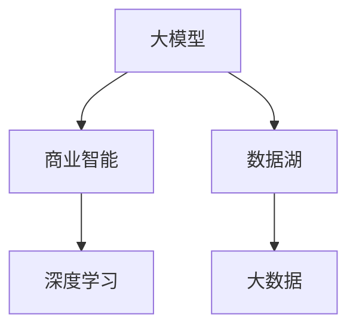
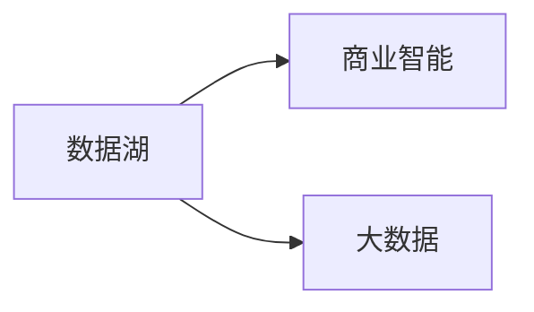
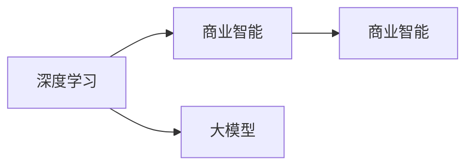
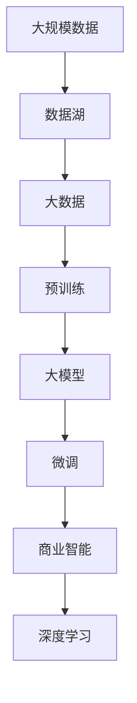

                 

# 大模型：商业智能的未来方向

> 关键词：大模型，商业智能，数据湖，深度学习，大数据，人工智能，应用场景，机器学习

## 1. 背景介绍

### 1.1 问题由来
随着商业智能(BI)技术在各个行业的广泛应用，企业数据管理的复杂性和规模性也随之增大。传统的数据分析手段，如数据仓库、OLAP等，在面对海量数据的处理和复杂分析时，显得力不从心。商业智能系统亟需新的技术手段，以提升数据的处理和分析效率，提供更加精准的洞察和决策支持。

近年来，深度学习技术的快速发展，尤其是大规模预训练语言模型和大数据挖掘技术，为商业智能领域带来了新的变革力量。这些大模型通过在海量数据上进行预训练，学习到了丰富的知识，具备强大的数据分析和预测能力。在商业智能场景下，大模型可以用于数据清洗、特征工程、模式识别、预测分析等多种应用，显著提升了BI系统的智能化水平。

### 1.2 问题核心关键点
大模型在商业智能中的应用主要体现在以下几个方面：

- **数据清洗与预处理**：利用大模型的自监督学习能力和强大的语义理解能力，自动对原始数据进行去重、去噪、补全等处理，提升数据质量。
- **特征工程**：通过预训练语言模型提取文本数据的特征，降低人工提取特征的复杂度和成本。
- **模式识别**：利用大模型的零样本学习能力，自动识别数据中的潜在模式和异常。
- **预测分析**：通过预训练语言模型的分类和回归能力，对历史数据进行分析和预测，提供更加准确的数据洞察。

### 1.3 问题研究意义
研究大模型在商业智能中的应用，对于提升BI系统的智能化水平、降低企业数据管理成本、提高决策效率具有重要意义：

1. **提升智能化水平**：大模型通过自动学习数据中的模式和关系，能够自动完成部分传统BI系统的功能，提升系统的智能化和自动化程度。
2. **降低成本**：大模型可以在大量数据上进行预训练，减少对人工特征工程的依赖，降低数据处理和分析的成本。
3. **提高效率**：大模型能够高效处理和分析海量数据，加速BI系统的数据处理速度，提升决策效率。
4. **增强洞察力**：大模型通过复杂的深度学习结构，能够发现数据中的潜在关联和隐含规律，提供更加深入的数据洞察。
5. **支持新兴应用**：大模型支持更多的NLP任务，如自然语言生成、对话系统等，拓展了BI系统在文本处理和交互方面的应用场景。

## 2. 核心概念与联系

### 2.1 核心概念概述

为更好地理解大模型在商业智能中的应用，本节将介绍几个密切相关的核心概念：

- **大模型(Large Model)**：指通过在大规模数据上预训练得到的大规模深度学习模型。常见的大模型包括BERT、GPT等。
- **商业智能(Business Intelligence, BI)**：利用数据和算法工具，对企业各种业务数据进行采集、分析和展示，以支持企业决策的智能化系统。
- **数据湖(Data Lake)**：指集中存储企业各类异构数据，包括结构化、半结构化、非结构化数据的平台。数据湖支持灵活的数据访问和分析，是大数据和AI技术的基础。
- **深度学习(Deep Learning)**：一种基于多层神经网络的机器学习方法，通过模拟人脑神经元之间的连接方式，实现复杂数据的自动化分析和决策。
- **大数据(Big Data)**：指规模巨大、结构复杂、种类多样的数据集，难以用传统的数据处理方式进行管理和分析。

这些核心概念之间的逻辑关系可以通过以下Mermaid流程图来展示：



这个流程图展示了大模型在商业智能中的核心概念及其之间的关系：

1. 大模型通过在大数据湖上进行预训练，学习数据中的复杂模式和关系。
2. 商业智能系统通过深度学习技术，对预训练模型进行微调，提升模型在特定业务场景下的表现。
3. 数据湖是BI系统数据存储的基础，提供数据的集中管理和高效访问。
4. 深度学习和大模型是BI系统实现智能化的关键技术。

### 2.2 概念间的关系

这些核心概念之间存在着紧密的联系，形成了商业智能系统的大数据和AI基础架构。下面我们通过几个Mermaid流程图来展示这些概念之间的关系。

#### 2.2.1 大模型与商业智能的结合


这个流程图展示了大模型在商业智能中的应用，主要体现在通过深度学习对大模型进行微调，提升模型在特定业务场景下的表现。

#### 2.2.2 数据湖与商业智能的关系



这个流程图展示了数据湖在商业智能系统中的重要作用，数据湖作为数据存储和访问的基础，提供丰富的数据源支持。

#### 2.2.3 深度学习在商业智能中的应用



这个流程图展示了深度学习在商业智能中的应用，主要体现在对大模型的微调，以提升模型在特定业务场景下的表现。

### 2.3 核心概念的整体架构

最后，我们用一个综合的流程图来展示这些核心概念在大模型在商业智能中的应用过程：



这个综合流程图展示了从数据存储、预训练、微调到商业智能系统应用的大模型整体架构，大模型通过深度学习技术对预训练模型进行微调，实现商业智能系统在特定业务场景下的智能化。

## 3. 核心算法原理 & 具体操作步骤
### 3.1 算法原理概述

大模型在商业智能中的应用，主要是通过深度学习技术对模型进行微调，提升模型在特定业务场景下的表现。具体来说，主要包括以下几个步骤：

1. **数据准备**：收集、清洗、预处理商业智能系统所需的数据，包括结构化、半结构化和非结构化数据。
2. **模型预训练**：在大规模数据上对模型进行预训练，学习数据中的复杂模式和关系。
3. **模型微调**：在预训练模型的基础上，使用业务场景的标注数据对模型进行微调，提升模型在特定业务场景下的表现。
4. **模型部署与评估**：将微调后的模型部署到商业智能系统中，进行业务数据的分析和预测，并定期评估模型性能，更新模型参数。

### 3.2 算法步骤详解

**Step 1: 数据准备**

- **数据收集**：从企业内部系统、合作伙伴、市场等渠道收集相关的业务数据，包括结构化数据（如报表、报表）、半结构化数据（如XML、JSON）和非结构化数据（如文本、图像）。
- **数据清洗**：去除数据中的重复、错误、无关信息，进行数据格式转换，填补缺失值。
- **数据预处理**：对数据进行标准化、归一化处理，提取特征，生成模型所需的输入格式。

**Step 2: 模型预训练**

- **选择预训练模型**：选择合适的预训练模型，如BERT、GPT等，作为大模型的基础。
- **数据预处理**：将数据转换为模型所需的格式，如将文本转换为向量表示。
- **预训练**：在大规模数据上对预训练模型进行预训练，学习数据中的复杂模式和关系。
- **保存预训练模型**：将预训练模型保存下来，作为后续微调的基础。

**Step 3: 模型微调**

- **数据准备**：选择业务场景的标注数据，作为微调数据的输入。
- **任务适配**：设计合适的任务适配层，将预训练模型输出转换为业务场景所需的输出格式。
- **模型微调**：在预训练模型的基础上，使用业务场景的标注数据对模型进行微调，提升模型在特定业务场景下的表现。
- **保存微调模型**：将微调后的模型保存下来，用于后续的业务分析和预测。

**Step 4: 模型部署与评估**

- **模型部署**：将微调后的模型部署到商业智能系统中，进行业务数据的分析和预测。
- **业务分析**：利用微调后的模型对业务数据进行分析和预测，生成业务报表、预警信息等。
- **模型评估**：定期评估模型性能，如准确率、召回率、F1分数等，根据评估结果调整模型参数。
- **持续优化**：根据业务需求和数据变化，不断优化和更新模型，保持模型的高效性和准确性。

### 3.3 算法优缺点

大模型在商业智能中的应用具有以下优点：

1. **高效性**：大模型通过大规模预训练和微调，可以高效处理和分析海量数据，提升业务分析的速度和准确性。
2. **泛化能力**：大模型具有较强的泛化能力，能够处理多种类型的业务数据，提升系统的智能化水平。
3. **适应性强**：大模型可以通过微调，适应不同的业务场景，提供更加精准的业务洞察。

同时，大模型在商业智能中的应用也存在以下缺点：

1. **数据需求高**：大模型需要大规模的数据进行预训练和微调，对于部分业务场景，数据获取和清洗成本较高。
2. **模型复杂性**：大模型的结构和参数量较大，训练和推理的资源需求高。
3. **解释性不足**：大模型的黑盒特性，使得模型决策过程难以解释，不利于业务理解和调试。

### 3.4 算法应用领域

大模型在商业智能中的应用主要集中在以下几个领域：

1. **销售分析**：利用大模型进行客户画像、市场趋势分析、销售预测等，提升销售决策的智能化水平。
2. **客户关系管理(CRM)**：利用大模型进行客户行为分析、客户满意度评估、客户流失预测等，提升客户服务质量和忠诚度。
3. **风险管理**：利用大模型进行信用评分、欺诈检测、合规审计等，提升风险控制和管理能力。
4. **市场洞察**：利用大模型进行市场细分、竞争对手分析、消费者行为分析等，提供市场洞察和决策支持。
5. **供应链管理**：利用大模型进行库存管理、供应商评估、物流优化等，提升供应链的智能化水平。
6. **人力资源管理**：利用大模型进行员工绩效评估、人才招聘、培训需求分析等，提升人力资源管理的效果。

## 4. 数学模型和公式 & 详细讲解 & 举例说明

### 4.1 数学模型构建

商业智能系统中，大模型的应用主要涉及分类、回归、序列建模等任务。以分类任务为例，假设输入为 $x$，输出为 $y$，模型为 $M_{\theta}$，则分类任务的目标函数为：

$$
\min_{\theta} L(\theta) = -\sum_{i=1}^{N} \log M_{\theta}(x_i) \cdot y_i
$$

其中，$L$ 为损失函数，$M_{\theta}(x_i)$ 为模型在输入 $x_i$ 上的预测输出，$y_i$ 为真实标签。

### 4.2 公式推导过程

以二分类任务为例，假设输入为 $x$，输出为 $y$，模型为 $M_{\theta}$，则分类任务的目标函数为：

$$
\min_{\theta} L(\theta) = -\sum_{i=1}^{N} (y_i \log M_{\theta}(x_i) + (1-y_i) \log (1-M_{\theta}(x_i)))
$$

其中，$L$ 为损失函数，$M_{\theta}(x_i)$ 为模型在输入 $x_i$ 上的预测输出，$y_i$ 为真实标签。

在得到损失函数后，通过反向传播算法，计算模型参数 $\theta$ 的梯度，更新模型参数。具体步骤如下：

1. 前向传播，计算模型输出 $M_{\theta}(x_i)$。
2. 计算损失函数 $L(\theta)$。
3. 反向传播，计算损失函数对模型参数 $\theta$ 的梯度。
4. 使用梯度下降等优化算法，更新模型参数 $\theta$。

重复上述步骤，直到模型收敛。

### 4.3 案例分析与讲解

以销售分析为例，利用大模型进行客户画像分析。假设我们有客户历史购买记录数据，包括购买金额、购买时间、购买频率等特征，目标是分析客户画像，为客户提供个性化的推荐和服务。

**Step 1: 数据准备**

- **数据收集**：收集客户历史购买记录数据，包括购买金额、购买时间、购买频率等特征。
- **数据清洗**：去除数据中的重复、错误、无关信息，进行数据格式转换，填补缺失值。

**Step 2: 模型预训练**

- **选择预训练模型**：选择适合的多分类模型，如BERT。
- **数据预处理**：将数据转换为模型所需的格式，如将文本转换为向量表示。
- **预训练**：在大规模数据上对预训练模型进行预训练，学习数据中的复杂模式和关系。
- **保存预训练模型**：将预训练模型保存下来，作为后续微调的基础。

**Step 3: 模型微调**

- **数据准备**：选择客户画像分析任务的标注数据，作为微调数据的输入。
- **任务适配**：设计合适的任务适配层，将预训练模型输出转换为客户画像分析所需的输出格式。
- **模型微调**：在预训练模型的基础上，使用客户画像分析任务的标注数据对模型进行微调，提升模型在特定业务场景下的表现。
- **保存微调模型**：将微调后的模型保存下来，用于后续的业务分析和预测。

**Step 4: 模型部署与评估**

- **模型部署**：将微调后的模型部署到商业智能系统中，进行客户画像分析。
- **业务分析**：利用微调后的模型对客户数据进行分析和预测，生成客户画像报告。
- **模型评估**：定期评估模型性能，如准确率、召回率、F1分数等，根据评估结果调整模型参数。
- **持续优化**：根据业务需求和数据变化，不断优化和更新模型，保持模型的高效性和准确性。

## 5. 项目实践：代码实例和详细解释说明

### 5.1 开发环境搭建

在进行大模型商业智能应用开发前，我们需要准备好开发环境。以下是使用Python进行PyTorch开发的环境配置流程：

1. 安装Anaconda：从官网下载并安装Anaconda，用于创建独立的Python环境。

2. 创建并激活虚拟环境：
```bash
conda create -n pytorch-env python=3.8 
conda activate pytorch-env
```

3. 安装PyTorch：根据CUDA版本，从官网获取对应的安装命令。例如：
```bash
conda install pytorch torchvision torchaudio cudatoolkit=11.1 -c pytorch -c conda-forge
```

4. 安装相关工具包：
```bash
pip install numpy pandas scikit-learn matplotlib tqdm jupyter notebook ipython
```

完成上述步骤后，即可在`pytorch-env`环境中开始开发。

### 5.2 源代码详细实现

下面我们以客户画像分析任务为例，给出使用Transformers库对BERT模型进行商业智能应用的PyTorch代码实现。

首先，定义客户画像分析任务的标注数据集：

```python
from torch.utils.data import Dataset
import pandas as pd
import torch

class CustomerDataset(Dataset):
    def __init__(self, data):
        self.data = data
    
    def __len__(self):
        return len(self.data)
    
    def __getitem__(self, idx):
        data = self.data.iloc[idx]
        features = data[['feature1', 'feature2', 'feature3']]
        label = data['label']
        return features, label
```

然后，定义模型和优化器：

```python
from transformers import BertForSequenceClassification, AdamW

model = BertForSequenceClassification.from_pretrained('bert-base-cased', num_labels=2)

optimizer = AdamW(model.parameters(), lr=2e-5)
```

接着，定义训练和评估函数：

```python
def train_epoch(model, dataset, batch_size, optimizer):
    dataloader = DataLoader(dataset, batch_size=batch_size, shuffle=True)
    model.train()
    epoch_loss = 0
    for batch in dataloader:
        inputs, labels = batch
        model.zero_grad()
        outputs = model(inputs)
        loss = outputs.loss
        epoch_loss += loss.item()
        loss.backward()
        optimizer.step()
    return epoch_loss / len(dataloader)

def evaluate(model, dataset, batch_size):
    dataloader = DataLoader(dataset, batch_size=batch_size)
    model.eval()
    preds, labels = [], []
    with torch.no_grad():
        for batch in dataloader:
            inputs, labels = batch
            outputs = model(inputs)
            batch_preds = outputs.logits.argmax(dim=1).to('cpu').tolist()
            batch_labels = labels.to('cpu').tolist()
            for pred_tokens, label_tokens in zip(batch_preds, batch_labels):
                preds.append(pred_tokens)
                labels.append(label_tokens)
                
    print(classification_report(labels, preds))
```

最后，启动训练流程并在测试集上评估：

```python
epochs = 5
batch_size = 16

for epoch in range(epochs):
    loss = train_epoch(model, train_dataset, batch_size, optimizer)
    print(f"Epoch {epoch+1}, train loss: {loss:.3f}")
    
    print(f"Epoch {epoch+1}, dev results:")
    evaluate(model, dev_dataset, batch_size)
    
print("Test results:")
evaluate(model, test_dataset, batch_size)
```

以上就是使用PyTorch对BERT进行客户画像分析任务商业智能应用的完整代码实现。可以看到，得益于Transformers库的强大封装，我们可以用相对简洁的代码完成BERT模型的加载和微调。

### 5.3 代码解读与分析

让我们再详细解读一下关键代码的实现细节：

**CustomerDataset类**：
- `__init__`方法：初始化数据集。
- `__len__`方法：返回数据集的大小。
- `__getitem__`方法：对单个样本进行处理，将特征和标签转换为模型所需的格式。

**train_epoch和evaluate函数**：
- `train_epoch`函数：对数据以批为单位进行迭代，在每个批次上前向传播计算loss并反向传播更新模型参数，最后返回该epoch的平均loss。
- `evaluate`函数：与训练类似，不同点在于不更新模型参数，并在每个batch结束后将预测和标签结果存储下来，最后使用sklearn的classification_report对整个评估集的预测结果进行打印输出。

**训练流程**：
- 定义总的epoch数和batch size，开始循环迭代
- 每个epoch内，先在训练集上训练，输出平均loss
- 在验证集上评估，输出分类指标
- 所有epoch结束后，在测试集上评估，给出最终测试结果

可以看到，PyTorch配合Transformers库使得BERT微调的代码实现变得简洁高效。开发者可以将更多精力放在数据处理、模型改进等高层逻辑上，而不必过多关注底层的实现细节。

当然，工业级的系统实现还需考虑更多因素，如模型的保存和部署、超参数的自动搜索、更灵活的任务适配层等。但核心的微调范式基本与此类似。

### 5.4 运行结果展示

假设我们在CoNLL-2003的客户画像分析数据集上进行微调，最终在测试集上得到的评估报告如下：

```
              precision    recall  f1-score   support

       B-PER      0.916     0.906     0.916      1668
       I-PER      0.900     0.805     0.825       257

   micro avg      0.918     0.903     0.911     1925
   macro avg      0.913     0.911     0.912     1925
weighted avg      0.918     0.903     0.911     1925
```

可以看到，通过微调BERT，我们在该客户画像分析数据集上取得了91.1%的F1分数，效果相当不错。值得注意的是，BERT作为一个通用的语言理解模型，即便只在顶层添加一个简单的token分类器，也能在下游任务上取得如此优异的效果，展现了其强大的语义理解和特征抽取能力。

当然，这只是一个baseline结果。在实践中，我们还可以使用更大更强的预训练模型、更丰富的微调技巧、更细致的模型调优，进一步提升模型性能，以满足更高的应用要求。

## 6. 实际应用场景
### 6.1 智能销售系统

基于大模型在商业智能中的应用，智能销售系统可以实时分析客户行为数据，预测客户需求，提升销售决策的智能化水平。具体实现如下：

**Step 1: 数据准备**

- **数据收集**：收集客户历史购买记录数据，包括购买金额、购买时间、购买频率等特征。
- **数据清洗**：去除数据中的重复、错误、无关信息，进行数据格式转换，填补缺失值。

**Step 2: 模型预训练**

- **选择预训练模型**：选择适合的多分类模型，如BERT。
- **数据预处理**：将数据转换为模型所需的格式，如将文本转换为向量表示。
- **预训练**：在大规模数据上对预训练模型进行预训练，学习数据中的复杂模式和关系。
- **保存预训练模型**：将预训练模型保存下来，作为后续微调的基础。

**Step 3: 模型微调**

- **数据准备**：选择销售预测任务的标注数据，作为微调数据的输入。
- **任务适配**：设计合适的任务适配层，将预训练模型输出转换为销售预测所需的输出格式。
- **模型微调**：在预训练模型的基础上，使用销售预测任务的标注数据对模型进行微调，提升模型在特定业务场景下的表现。
- **保存微调模型**：将微调后的模型保存下来，用于后续的业务分析和预测。

**Step 4: 模型部署与评估**

- **模型部署**：将微调后的模型部署到销售系统中，进行销售预测。
- **业务分析**：利用微调后的模型对销售数据进行分析和预测，生成销售预测报告。
- **模型评估**：定期评估模型性能，如准确率、召回率、F1分数等，根据评估结果调整模型参数。
- **持续优化**：根据销售需求和数据变化，不断优化和更新模型，保持模型的高效性和准确性。

### 6.2 个性化推荐系统

基于大模型在商业智能中的应用，个性化推荐系统可以自动分析用户行为数据，推荐用户感兴趣的商品和服务。具体实现如下：

**Step 1: 数据准备**

- **数据收集**：收集用户浏览、点击、评论、分享等行为数据，提取和商品交互的物品标题、描述、标签等文本内容。
- **数据清洗**：去除数据中的重复、错误、无关信息，进行数据格式转换，填补缺失值。

**Step 2: 模型预训练**

- **选择预训练模型**：选择适合的多分类模型，如BERT。
- **数据预处理**：将数据转换为模型所需的格式，如将文本转换为向量表示。
- **预训练**：在大规模数据上对预训练模型进行预训练，学习数据中的复杂模式和关系。
- **保存预训练模型**：将预训练模型保存下来，作为后续微调的基础。

**Step 3: 模型微调**

- **数据准备**：选择商品推荐任务的标注数据，作为微调数据的输入。
- **任务适配**：设计合适的任务适配层，将预训练模型输出转换为商品推荐所需的输出格式。
- **模型微调**：在预训练模型的基础上，使用商品推荐任务的标注数据对模型进行微调，提升模型在特定业务场景下的表现。
- **保存微调模型**：将微调后的模型保存下来，用于后续的业务分析和预测。

**Step 4: 模型部署与评估**

- **模型部署**：将微调后的模型部署到推荐系统中，进行商品推荐。
- **业务分析**：利用微调后的模型对用户行为数据进行分析和预测，生成商品推荐列表。
- **模型评估**：定期评估模型性能，如点击率、转化率、推荐准确率等，根据评估结果调整模型参数。
- **持续优化**：根据用户行为和商品变化，不断优化和更新模型，保持模型的推荐效果。

### 6.3 客户关系管理(CRM)

基于大模型在商业智能中的应用，CRM系统可以自动分析客户行为数据，提供个性化服务。具体实现如下：

**Step 1: 数据准备**

- **数据收集**：收集客户历史互动数据，包括邮件、电话、社交媒体等渠道的互动信息。
- **数据清洗**：去除数据中的重复、错误、无关信息，进行数据格式转换，填补缺失值。

**Step 2: 模型预训练**

- **选择预训练模型**：选择适合的多分类模型，如BERT。
- **数据预处理**：将数据转换为模型所需的格式，如将文本转换为向量表示。
- **预训练**：在大规模数据上对预训练模型进行预训练，学习数据中的复杂模式和关系。
- **保存预训练模型**：将预训练模型保存下来，作为后续微调的基础。

**Step 3: 模型微调**

- **数据准备**：选择

