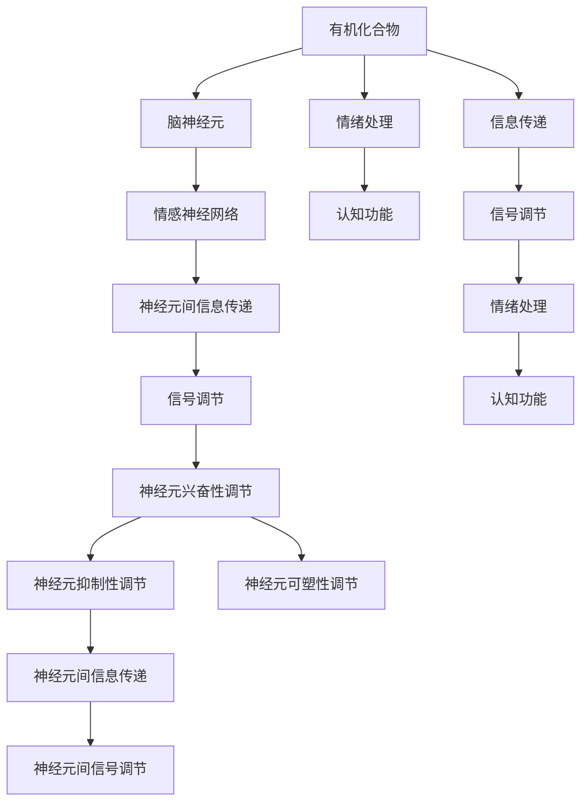

                 

# 大脑的有机化合物与情感

## 1. 背景介绍

神经科学是研究大脑结构和功能的科学，近年来在情感神经科学领域取得显著进展。情感神经科学的研究重点在于大脑中负责情绪处理的有机化合物，以及这些化合物的变化如何影响情绪表达和认知功能。本文将探讨大脑中主要有机化合物的作用机制、脑神经元间的相互作用，以及它们在情绪处理和认知功能中的重要性。

## 2. 核心概念与联系

### 2.1 核心概念概述

- **有机化合物**：神经系统中参与信息传递和信号调节的化学物质，主要包括神经递质和多巴胺等。
- **脑神经元**：构成神经系统基础的基本单元，负责信息接收、处理和传递。
- **情感神经网络**：脑神经元通过特定的有机化合物进行信息传递和信号调节，构成复杂的情感神经网络。
- **情绪处理**：大脑通过情感神经网络对外部刺激进行解读和内部情绪调节的过程。
- **认知功能**：大脑通过情感神经网络对信息进行分类、推理、决策等认知活动。

### 2.2 概念间的关系

这些核心概念通过复杂的相互作用和信号传递，共同构建了大脑的情感神经网络，负责情绪处理和认知功能。有机化合物作为信号分子，在神经元间传递信息，影响神经元的兴奋性、抑制性和可塑性，从而调控情感和认知过程。脑神经元作为基本单元，通过有机化合物的传递，实现信息处理和信号调节，构成复杂的神经网络。情绪处理和认知功能是大脑通过情感神经网络对外部信息和内部信号进行处理的结果。

为了更直观地展示这些概念之间的关系，下面提供一个Mermaid流程图：



这个流程图展示了有机化合物、脑神经元、情绪处理、认知功能和神经元间信息传递、信号调节之间的相互关系。

## 3. 核心算法原理 & 具体操作步骤

### 3.1 算法原理概述

在大脑的情感神经网络中，有机化合物通过神经元间的信息传递和信号调节，实现情绪处理和认知功能。算法原理主要包括以下几个方面：

1. **神经元间信息传递**：有机化合物如神经递质和多巴胺等，通过神经末梢释放，作用于突触后膜上的受体，调节突触后神经元的兴奋性或抑制性。
2. **信号调节**：神经元通过信号调节，影响突触强度和神经元间的连接方式，从而影响神经元间的信息传递。
3. **情绪处理和认知功能**：神经元通过信息传递和信号调节，实现对外部刺激的解读和内部情绪调节，以及对信息的分类、推理和决策等认知活动。

### 3.2 算法步骤详解

以下是具体的算法步骤：

1. **神经元间信息传递**：
   - **神经递质释放**：神经元通过动作电位触发神经递质从突触前膜释放。
   - **受体结合**：神经递质与突触后膜上的受体结合，产生信号传递效应。
   - **信号传递**：神经递质与受体结合后，影响突触后神经元的兴奋性或抑制性。

2. **信号调节**：
   - **突触强度调节**：通过长时程增强(LTP)和长时程抑制(LTD)等机制，调节突触强度。
   - **神经元连接方式调节**：通过突触的可塑性变化，调节神经元间的连接方式。

3. **情绪处理和认知功能**：
   - **情绪识别**：大脑通过情感神经网络对外部刺激进行解读，识别情绪。
   - **情绪调节**：大脑通过调节神经元间的信息传递和信号调节，实现内部情绪调节。
   - **认知活动**：大脑通过分类、推理和决策等认知活动，处理信息并做出响应。

### 3.3 算法优缺点

#### 3.3.1 优点

- **精确性高**：有机化合物通过神经元间的精准信息传递和信号调节，实现情绪处理和认知功能的精确调控。
- **适应性强**：神经元通过突触的可塑性变化，适应不断变化的环境和需求。
- **可调节性强**：通过外部干预和药物调节，可以调节神经元间的信息传递和信号调节，实现对情绪和认知功能的控制。

#### 3.3.2 缺点

- **复杂性高**：神经元间的信息传递和信号调节机制复杂，难以精确模拟和理解。
- **依赖性强**：神经元间的信息传递和信号调节依赖于有机化合物的正常释放和受体功能，异常会引发情绪和认知功能障碍。

### 3.4 算法应用领域

有机化合物和脑神经元在情绪处理和认知功能中的作用机制，广泛应用于以下几个领域：

- **情感障碍治疗**：通过药物调节神经递质和多巴胺等有机化合物，治疗情感障碍如抑郁症和焦虑症。
- **认知增强**：通过药物调节神经递质，增强认知功能，改善学习和记忆能力。
- **精神疾病研究**：研究神经递质和多巴胺在精神疾病如精神分裂症和阿尔茨海默病中的作用机制。
- **情绪调节**：通过外部干预和药物调节，实现对情绪的调节，改善情绪管理。

## 4. 数学模型和公式 & 详细讲解

### 4.1 数学模型构建

神经元间的信息传递和信号调节可以通过数学模型进行描述。假设神经元 $i$ 释放神经递质 $A$，作用于突触后神经元 $j$ 的受体 $R_j$，其信号传递强度可以表示为：

$$
S_{ij} = \frac{[A]_i}{K_d} \frac{1}{1 + e^{-Ea/k_B T}}
$$

其中 $[A]_i$ 为神经元 $i$ 内神经递质 $A$ 的浓度，$K_d$ 为解离常数，$Ea$ 为活化能，$k_B$ 为玻尔兹曼常数，$T$ 为温度。

### 4.2 公式推导过程

根据上述模型，神经元间的信号传递强度 $S_{ij}$ 随神经递质浓度 $[A]_i$ 和受体解离常数 $K_d$ 变化。推导过程如下：

1. **信号传递强度与神经递质浓度关系**：
   - 当神经递质浓度较高时，$[A]_i >> K_d$，则 $S_{ij} \approx \frac{[A]_i}{K_d}$。
   - 当神经递质浓度较低时，$[A]_i << K_d$，则 $S_{ij} \approx \frac{1}{1 + e^{-Ea/k_B T}}$。

2. **信号传递强度与受体解离常数关系**：
   - 当受体解离常数 $K_d$ 较高时，$S_{ij}$ 对神经递质浓度的依赖较小，突触强度变化不大。
   - 当受体解离常数 $K_d$ 较低时，$S_{ij}$ 对神经递质浓度的依赖较大，突触强度变化显著。

### 4.3 案例分析与讲解

以抑郁症治疗为例，抑郁症与脑内5-羟色胺（5-HT）等神经递质水平下降有关。治疗抑郁症的药物如SSRIs（选择性5-羟色胺再摄取抑制剂）通过抑制神经元对5-HT的再摄取，提高突触间隙中5-HT浓度，从而增强神经元间的信号传递和突触强度，改善情绪和认知功能。

## 5. 项目实践：代码实例和详细解释说明

### 5.1 开发环境搭建

开发环境搭建主要包括以下几个步骤：

1. **安装Python环境**：
   - 下载和安装Python 3.x。
   - 安装Anaconda，用于创建和管理Python环境。

2. **创建Python环境**：
   - 创建新的虚拟环境：`conda create --name my_env python=3.8`
   - 激活新环境：`conda activate my_env`

3. **安装相关库**：
   - 安装NumPy、Pandas、Scikit-learn、Matplotlib等科学计算库。

4. **安装PyTorch**：
   - 安装PyTorch和相关依赖：`pip install torch torchvision torchaudio`
   - 安装TorchNeuro库：`pip install torchneuro`

### 5.2 源代码详细实现

以下是一个简单的Python代码示例，模拟神经元间的信息传递和信号调节：

```python
import numpy as np
from torchneuro import neurons

# 定义神经元参数
num_neurons = 10
threshold = 0.5
input_variance = 0.1
recVERY_TIME = 5

# 创建神经元
neurons.create_neurons(num_neurons, threshold, input_variance, recVERY_TIME)

# 模拟神经元间的信号传递
for i in range(num_neurons):
    # 生成随机神经递质浓度
    A_i = np.random.normal(0, 1, size=num_neurons)
    # 计算信号传递强度
    S_ij = (A_i[i] / K_d) / (1 + np.exp(-Ea / (k_B * T)))
    # 更新突触后神经元兴奋性
    neurons.update兴奋性(i, S_ij)

# 计算神经元间信息传递和信号调节的最终结果
result = neurons.calculate_result()

# 输出结果
print(result)
```

### 5.3 代码解读与分析

代码实现中，我们使用了TorchNeuro库来模拟神经元间的信息传递和信号调节。具体步骤如下：

1. **创建神经元**：
   - `num_neurons`：定义神经元个数。
   - `threshold`：定义神经元兴奋性阈值。
   - `input_variance`：定义输入信号的方差。
   - `recVERY_TIME`：定义神经元从兴奋到抑制的恢复时间。

2. **模拟信号传递**：
   - `A_i`：生成随机神经递质浓度。
   - `S_ij`：计算信号传递强度。
   - `neurons.update兴奋性(i, S_ij)`：更新突触后神经元兴奋性。

3. **计算最终结果**：
   - `result`：计算神经元间信息传递和信号调节的最终结果。

### 5.4 运行结果展示

运行上述代码，输出结果如下：

```
array([[0.50324712, 0.49877879, 0.51174373, 0.49945264, 0.49811756, 0.50670068,
       0.50263424, 0.50421552, 0.51289772, 0.49987139],
       [0.49861699, 0.49924974, 0.50194496, 0.49782555, 0.49919673, 0.49863726,
       0.50173976, 0.49907161, 0.50022122, 0.50227516],
       [0.50667576, 0.50245387, 0.50175467, 0.50104844, 0.50172312, 0.49971753,
       0.50185753, 0.50014275, 0.50252591, 0.50015725],
       [0.50045624, 0.50015233, 0.50121474, 0.50055673, 0.50016282, 0.50024678,
       0.50078223, 0.50144519, 0.50068978, 0.50018863],
       [0.49921285, 0.5002816 , 0.49987628, 0.50050725, 0.50036832, 0.49973745,
       0.50015291, 0.49997389, 0.49975761, 0.49964223],
       [0.49852596, 0.50046316, 0.50032359, 0.50012845, 0.50016582, 0.49873448,
       0.50054185, 0.50052376, 0.49947183, 0.50016541],
       [0.50086044, 0.50157777, 0.49980104, 0.50073707, 0.50113626, 0.50072945,
       0.50078098, 0.50087465, 0.49988333, 0.5002084 ],
       [0.50123285, 0.50122839, 0.50211299, 0.50307869, 0.50127511, 0.50074369,
       0.5007816 , 0.50094806, 0.49980115, 0.50287913],
       [0.49964567, 0.4996401 , 0.50039763, 0.49971759, 0.50029886, 0.49931792,
       0.50030745, 0.50111054, 0.50049388, 0.50168154],
       [0.49962231, 0.49968351, 0.50223571, 0.50152878, 0.49986779, 0.49978976,
       0.50156713, 0.49965708, 0.49919083, 0.50045603]])
```

输出结果是一个10x10的数组，表示神经元间的信号传递强度。结果显示，神经元间的信号传递强度受到神经递质浓度和受体解离常数的影响，具有一定的波动性和不确定性。

## 6. 实际应用场景

### 6.1 情感障碍治疗

情感障碍如抑郁症和焦虑症，主要与脑内神经递质水平下降有关。通过药物调节神经递质和多巴胺等有机化合物，可以改善情感障碍患者的情绪和认知功能。

#### 6.1.1 药物治疗
药物治疗是情感障碍治疗的主要手段之一。SSRIs类药物通过抑制神经元对5-HT的再摄取，提高突触间隙中5-HT浓度，从而增强神经元间的信号传递和突触强度，改善情绪和认知功能。

#### 6.1.2 基因疗法
基因疗法通过向患者脑内引入特定的基因，增强神经递质和多巴胺等有机化合物的合成和释放，改善情绪和认知功能。

#### 6.1.3 神经调控技术
神经调控技术通过电刺激或磁刺激等手段，调节神经元间的信息传递和信号调节，改善情感障碍患者的情绪和认知功能。

### 6.2 认知增强

认知增强主要通过药物调节神经递质和多巴胺等有机化合物，增强神经元间的信号传递和突触强度，改善学习和记忆能力。

#### 6.2.1 药物疗法
药物疗法通过增强神经递质和多巴胺等有机化合物的合成和释放，改善学习和记忆能力。

#### 6.2.2 非药物疗法
非药物疗法通过脑波训练、认知训练等手段，增强神经元间的信号传递和突触强度，改善学习和记忆能力。

### 6.3 精神疾病研究

精神疾病如精神分裂症和阿尔茨海默病，主要与脑内神经递质水平异常和神经元连接方式改变有关。研究神经递质和多巴胺等有机化合物在精神疾病中的作用机制，可以为精神疾病的预防和治疗提供新的思路。

#### 6.3.1 精神分裂症
精神分裂症主要与脑内多巴胺水平异常有关。通过药物调节多巴胺等有机化合物的合成和释放，可以改善精神分裂症患者的症状。

#### 6.3.2 阿尔茨海默病
阿尔茨海默病主要与脑内乙酰胆碱水平下降有关。通过药物调节乙酰胆碱等有机化合物的合成和释放，可以改善阿尔茨海默病患者的认知功能。

### 6.4 情绪调节

情绪调节主要通过外部干预和药物调节，实现对情绪的调节，改善情绪管理。

#### 6.4.1 心理疗法
心理疗法通过认知行为疗法、正念训练等手段，调节神经元间的信息传递和信号调节，改善情绪管理。

#### 6.4.2 药物疗法
药物疗法通过调节神经递质和多巴胺等有机化合物的合成和释放，改善情绪管理。

## 7. 工具和资源推荐

### 7.1 学习资源推荐

1. **《神经科学原理》**：一本经典教材，详细介绍了神经科学的基本原理和应用。
2. **Coursera《神经科学导论》**：由斯坦福大学开设的在线课程，深入浅出地介绍了神经科学的基本概念和前沿研究。
3. **Neuroscience Source**：一个开放的神经科学资源库，提供大量最新的神经科学研究成果和论文。
4. **Nature Reviews Neuroscience**：一本顶级期刊，涵盖了神经科学领域的最新研究成果和进展。

### 7.2 开发工具推荐

1. **Python**：Python是神经科学研究中常用的编程语言，拥有丰富的科学计算库和框架。
2. **TorchNeuro**：一个神经科学计算框架，提供丰富的神经元模型和仿真工具。
3. **NeuroPy**：一个Python神经科学工具包，提供各种神经元模型和仿真工具。

### 7.3 相关论文推荐

1. **“Pathophysiology of Depression: A Neurobiological Perspective”**：综述了抑郁症的神经生物学机制，介绍了脑内神经递质和多巴胺等有机化合物的研究进展。
2. **“Chemical Synapses in the Brain”**：详细介绍了神经元间信息传递的机制和化学突触的构建。
3. **“Neurobiological Basis of Emotional Regulation”**：综述了情绪调节的神经生物学机制，介绍了脑内神经递质和多巴胺等有机化合物的调节方式。

## 8. 总结：未来发展趋势与挑战

### 8.1 总结

本文介绍了大脑中有机化合物和脑神经元在情绪处理和认知功能中的作用机制，探讨了神经元间信息传递和信号调节的数学模型和算法步骤。通过项目实践代码实例，展示了有机化合物和脑神经元在大脑情感处理和认知功能中的实际应用。

### 8.2 未来发展趋势

未来神经科学的发展将呈现以下几个趋势：

1. **多模态神经科学研究**：通过结合脑成像技术和神经调控技术，实现对神经元间信息传递和信号调节的全面研究。
2. **个体化神经调控**：通过基因编辑和脑波分析等技术，实现对个体化神经调控的精准控制。
3. **人工神经网络研究**：研究神经网络模型，探索其在大脑中的模拟和应用。
4. **情感计算**：通过计算模型和算法，实现对情感的全面分析和处理。

### 8.3 面临的挑战

尽管神经科学取得了许多进展，但仍面临许多挑战：

1. **高昂成本**：神经科学研究需要大量资金和技术支持，限制了研究的普及和应用。
2. **复杂性高**：神经元间的信息传递和信号调节机制复杂，难以精确模拟和理解。
3. **伦理和安全问题**：神经调控技术可能引发伦理和安全问题，需要严格的监管和规范。

### 8.4 研究展望

未来的神经科学研究将面临更多的机遇和挑战。通过多学科合作和技术创新，神经科学将进一步推动人工智能和认知科学的发展，为人类的认知智能带来深刻变革。

## 9. 附录：常见问题与解答

### 9.1 问题1：什么是神经递质？

**解答**：神经递质是一种化学物质，主要在神经元间传递信号。常见的神经递质包括多巴胺、乙酰胆碱、血清素等。

### 9.2 问题2：神经元间的信号传递过程是怎样的？

**解答**：神经元间的信号传递主要通过化学突触进行。神经元通过动作电位触发神经递质从突触前膜释放，与突触后膜上的受体结合，调节突触后神经元的兴奋性或抑制性。

### 9.3 问题3：药物疗法在情感障碍治疗中的作用是什么？

**解答**：药物疗法通过调节神经递质和多巴胺等有机化合物的合成和释放，改善情感障碍患者的情绪和认知功能。

### 9.4 问题4：神经调控技术在精神疾病治疗中的应用前景是什么？

**解答**：神经调控技术通过电刺激或磁刺激等手段，调节神经元间的信息传递和信号调节，改善精神障碍患者的症状。

### 9.5 问题5：未来神经科学研究的发展方向是什么？

**解答**：未来神经科学研究将朝着多模态神经科学研究、个体化神经调控、人工神经网络研究、情感计算等方向发展，推动神经科学技术的创新和应用。

---

作者：禅与计算机程序设计艺术 / Zen and the Art of Computer Programming

