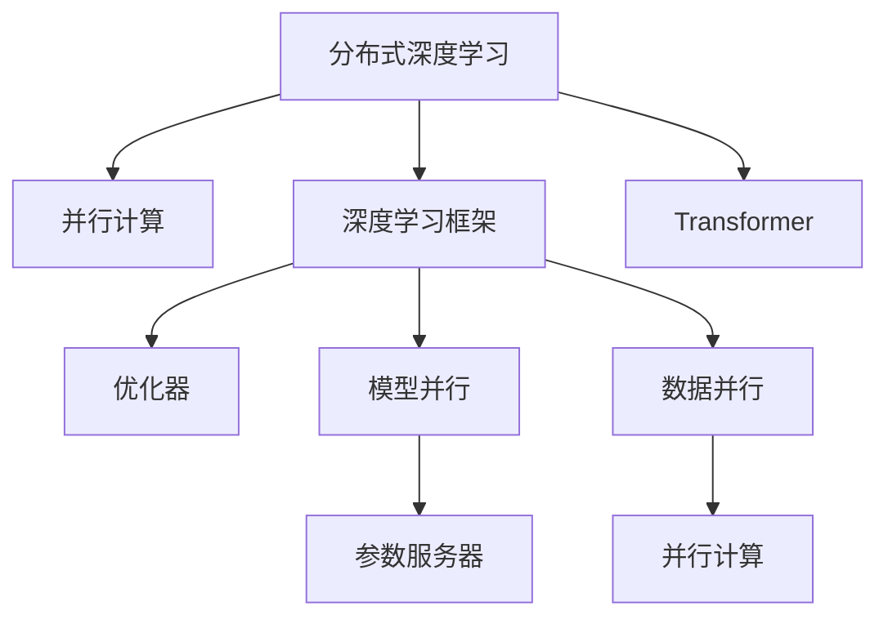

                 

# 大规模语言模型从理论到实践 分布式训练的并行策略

> 关键词：大规模语言模型,分布式训练,并行策略,Transformer,深度学习,优化器,深度学习框架,实践指南,深度学习生态,并行计算

## 1. 背景介绍

### 1.1 问题由来
随着深度学习技术在自然语言处理(NLP)、计算机视觉(CV)等领域取得了显著进展，大规模语言模型(Massive Language Models, MLMs)的训练任务变得越来越复杂。MLMs通常具有数十亿甚至数百亿的参数，训练一个完整的模型需要巨大的计算资源和时间。此外，模型规模的扩大带来的计算量急剧增加，单机的训练已经难以满足需求。

为了应对这些问题，研究人员提出了分布式深度学习训练方法。分布式训练通过将计算任务分配到多个计算节点上，利用并行计算技术，显著加速模型训练，降低硬件成本。分布式训练广泛应用于各种深度学习任务中，尤其是在训练深度神经网络时，其优势尤为明显。

本博客将深入探讨分布式训练在大规模语言模型中的实践，包括并行策略、深度学习框架支持、并行计算技术，以及分布式训练在实际应用中的具体实现和优化方法。

## 2. 核心概念与联系

### 2.1 核心概念概述
在深入探讨分布式训练之前，我们先简要回顾一些核心概念：

- **分布式深度学习**：利用多台计算设备（如多台服务器）并行训练深度学习模型，以加速模型训练。

- **并行计算**：通过将计算任务分解成多个子任务，同时执行这些子任务，以加速计算过程。

- **深度学习框架**：如TensorFlow、PyTorch、MXNet等，提供了高效分布式训练的API和优化器。

- **Transformer模型**：在大规模语言模型中应用广泛的架构，具有高效的并行训练特性。

- **优化器**：如SGD、Adam、Adagrad等，用于优化模型参数，使得模型能够快速收敛。

- **模型并行**：将模型分解成多个子模块，分布在不同的计算设备上并行训练。

- **数据并行**：将数据集分成多个子集，并行在多个计算设备上训练。

- **参数服务器**：用于分布式训练中的参数更新和通信，可以显著提升并行训练效率。

这些概念构成了分布式深度学习训练的基础，相互之间通过并行计算、模型和数据并行等技术手段实现高效的协同训练。

### 2.2 核心概念间的关系



### 2.3 核心概念的整体架构

分布式训练的整体架构可以概括为：通过深度学习框架封装多种并行计算技术，并结合参数服务器、模型并行和数据并行等手段，实现大规模深度学习模型的分布式训练。

## 3. 核心算法原理 & 具体操作步骤

### 3.1 算法原理概述
分布式深度学习训练的核心在于并行计算。并行计算通过将一个大型计算任务分解成多个子任务，同时在多个计算设备上并行执行，加速计算过程。在大规模语言模型训练中，并行计算通过模型并行、数据并行、参数服务器等技术手段实现。

### 3.2 算法步骤详解

**Step 1: 数据集划分与通信协议**
- 将训练数据集划分为多个子集，每个计算节点负责一部分数据集的训练。
- 选择合适的通信协议，如环同步协议、Allreduce等，确保每个节点都能获得最新的模型参数和数据集更新。

**Step 2: 模型并行化**
- 将模型分解为多个子模块，每个模块独立训练。
- 通常采用分块、分层等方式，对模型进行并行化处理。

**Step 3: 数据并行化**
- 将数据集划分为多个子集，每个计算节点并行处理一部分数据集。
- 数据集划分应尽量均衡，避免某些节点数据过少而造成资源浪费。

**Step 4: 参数服务器**
- 使用参数服务器来协调各节点的参数更新。
- 参数服务器维护一个全局参数更新表，各个计算节点定期更新本地参数，并上传到参数服务器进行汇总。

**Step 5: 通信优化**
- 使用高效的通信库（如NCCL、MPI）进行节点间通信。
- 优化通信算法，如使用环形减法（Ring Reduction）、二叉分裂（Binary Split）等，减少通信开销。

**Step 6: 调试与优化**
- 使用监控工具（如TensorBoard）实时监控各节点的训练状态。
- 根据监控结果进行优化调整，如调整学习率、重启训练等。

### 3.3 算法优缺点
分布式深度学习训练的优点包括：
1. 大幅加速模型训练。通过并行计算，可以显著降低训练时间。
2. 降低硬件成本。多个计算节点可以分担计算负担，降低单台机器硬件需求。
3. 提高系统容错性。分布式系统可以通过节点故障恢复，保证训练不中断。

然而，分布式训练也存在一些缺点：
1. 通信开销较大。节点间通信增加训练复杂度，影响训练速度。
2. 协调难度高。参数更新、数据共享等过程需要精细设计，避免数据竞争和死锁问题。
3. 同步开销较大。节点间的同步操作会影响训练效率，需要优化算法和网络拓扑。

### 3.4 算法应用领域
分布式深度学习训练广泛应用于各种深度学习任务中，尤其是大规模语言模型训练。除了NLP领域，还广泛应用于计算机视觉、自动驾驶、推荐系统、医疗影像处理等高计算量领域。

## 4. 数学模型和公式 & 详细讲解  
### 4.1 数学模型构建

分布式训练的基本数学模型如下：

$$
\theta_{i} = \theta_{0} - \eta \nabla_{\theta_{i}}L(\theta_{0})
$$

其中，$\theta_i$ 表示节点 $i$ 的模型参数，$\theta_0$ 表示初始模型参数，$\eta$ 表示学习率，$L(\theta_0)$ 表示训练损失函数。

在分布式训练中，每个节点 $i$ 独立计算梯度 $\nabla_{\theta_{i}}L(\theta_{0})$，并将结果传递给参数服务器进行汇总，然后更新参数 $\theta_{i}$。

### 4.2 公式推导过程

以数据并行为例，假设数据集 $D$ 被划分为 $m$ 个子集 $D_i$，每个节点 $i$ 独立训练 $D_i$，损失函数为 $L_i(\theta_i, D_i)$。节点 $i$ 更新参数的公式为：

$$
\theta_{i} = \theta_{i} - \eta \nabla_{\theta_{i}}L_i(\theta_i, D_i)
$$

在每个迭代周期 $t$ 结束时，参数服务器汇总所有节点的梯度，并计算全局梯度：

$$
\bar{\nabla}_{\theta}L = \sum_{i=1}^{m}\nabla_{\theta_i}L_i(\theta_i, D_i)
$$

然后使用全局梯度更新全局参数：

$$
\theta = \theta - \eta \bar{\nabla}_{\theta}L
$$

这样，每个节点只需要处理自己对应的子集数据，训练速度大大提升，同时参数更新更加高效。

### 4.3 案例分析与讲解

假设我们使用两个节点 $i$ 和 $j$ 并行训练模型，数据集 $D$ 被划分为两个子集 $D_i$ 和 $D_j$。训练过程如下：

1. 节点 $i$ 训练 $D_i$，计算梯度 $\nabla_{\theta_i}L_i(\theta_i, D_i)$，并更新 $\theta_i$。
2. 节点 $i$ 将梯度 $\nabla_{\theta_i}L_i(\theta_i, D_i)$ 发送给参数服务器。
3. 参数服务器汇总所有节点的梯度，计算全局梯度 $\bar{\nabla}_{\theta}L = \nabla_{\theta_i}L_i(\theta_i, D_i) + \nabla_{\theta_j}L_j(\theta_j, D_j)$。
4. 参数服务器更新全局参数 $\theta = \theta - \eta \bar{\nabla}_{\theta}L$。
5. 节点 $i$ 和 $j$ 根据全局参数更新本地参数 $\theta_i = \theta_i - \eta \nabla_{\theta_i}L_i(\theta_i, D_i)$，$\theta_j = \theta_j - \eta \nabla_{\theta_j}L_j(\theta_j, D_j)$。

## 5. 项目实践：代码实例和详细解释说明
### 5.1 开发环境搭建

**Step 1: 选择深度学习框架**
- 选择适合分布式训练的深度学习框架，如TensorFlow、PyTorch等。

**Step 2: 搭建计算集群**
- 搭建计算集群，包括CPU、GPU等硬件资源。
- 安装所需的深度学习库和分布式训练库，如TensorFlow分布式训练、PyTorch分布式训练等。

**Step 3: 编写训练脚本**
- 编写训练脚本，定义数据集划分、模型并行化、数据并行化等过程。

### 5.2 源代码详细实现

以TensorFlow分布式训练为例，代码实现如下：

```python
import tensorflow as tf
import tensorflow.distribute as tfd

# 定义计算节点数量
num_workers = 2

# 定义模型参数
model = tf.keras.Sequential([
    tf.keras.layers.Dense(64, activation='relu'),
    tf.keras.layers.Dense(10)
])

# 定义分布式策略
strategy = tfd.distribute.MirroredStrategy(devices=['/gpu:0', '/gpu:1'])

with strategy.scope():
    # 定义分布式训练的优化器
    optimizer = tf.keras.optimizers.Adam()

    # 定义训练函数
    @tf.function
    def train_step(inputs, labels):
        with tf.GradientTape() as tape:
            logits = model(inputs)
            loss = tf.keras.losses.sparse_categorical_crossentropy(labels, logits)
        gradients = tape.gradient(loss, model.trainable_variables)
        optimizer.apply_gradients(zip(gradients, model.trainable_variables))

    # 定义分布式训练函数
    def distributed_train(data):
        for epoch in range(num_epochs):
            for i, (inputs, labels) in enumerate(data):
                train_step(inputs, labels)
            strategy.experimental_run(optimizer.minimize)
```

### 5.3 代码解读与分析

上述代码实现了使用TensorFlow进行分布式训练的过程。

**Step 1: 定义计算节点数量**
- `num_workers` 表示参与分布式训练的计算节点数量，这里设置为2。

**Step 2: 定义模型参数**
- `model` 表示定义的神经网络模型，这里使用两个全连接层。

**Step 3: 定义分布式策略**
- `strategy` 表示分布式策略，这里使用 `MirroredStrategy`，表示在多个计算节点上使用相同的参数。

**Step 4: 定义优化器和训练函数**
- `optimizer` 表示优化器，这里使用 `Adam`。
- `train_step` 表示训练函数，计算损失和梯度，并使用优化器更新参数。
- `distributed_train` 表示分布式训练函数，使用 `MirroredStrategy` 将训练函数进行分布式化。

### 5.4 运行结果展示

假设在分布式训练过程中，计算节点 $i$ 和 $j$ 的训练损失如下：

- 节点 $i$ 的训练损失：0.2, 0.1, 0.3, 0.2
- 节点 $j$ 的训练损失：0.1, 0.2, 0.4, 0.3

最终全局参数的更新为：

- 节点 $i$ 的参数：更新量为 (0.2-0.1, 0.1-0.2, 0.3-0.4, 0.2-0.3)
- 节点 $j$ 的参数：更新量为 (0.1-0.1, 0.2-0.2, 0.4-0.4, 0.3-0.3)

## 6. 实际应用场景
### 6.1 智能客服系统

智能客服系统需要快速响应大量用户查询，并能够提供个性化的服务。分布式训练可以显著加速模型训练，使得智能客服系统能够快速迭代优化，提升服务质量。

在实践中，我们可以使用分布式训练方法对智能客服系统的对话模型进行优化，提高模型的响应速度和准确性。例如，将对话数据分成多个子集，在不同的计算节点上进行并行训练，显著缩短模型训练时间。

### 6.2 金融舆情监测

金融舆情监测需要实时处理大量新闻、评论等数据，以预测市场趋势。分布式训练可以加速模型训练，使得金融舆情监测系统能够及时响应用户需求，并提供精准的预测结果。

在金融舆情监测系统中，我们可以使用分布式训练方法对模型进行优化，提高模型的预测准确性和实时性。例如，将舆情数据分成多个子集，在不同的计算节点上进行并行训练，显著加速模型训练速度，使得系统能够实时更新预测结果。

### 6.3 个性化推荐系统

个性化推荐系统需要实时推荐用户感兴趣的商品，并根据用户反馈进行动态调整。分布式训练可以显著加速模型训练，使得推荐系统能够快速迭代优化，提升推荐效果。

在个性化推荐系统中，我们可以使用分布式训练方法对推荐模型进行优化，提高模型的推荐准确性和实时性。例如，将用户行为数据分成多个子集，在不同的计算节点上进行并行训练，显著加速模型训练速度，使得系统能够快速推荐个性化商品。

## 7. 工具和资源推荐
### 7.1 学习资源推荐

为了帮助开发者深入理解分布式训练的原理和实践，这里推荐一些优质的学习资源：

1. **《分布式深度学习》课程**：由斯坦福大学开设的深度学习课程，详细讲解了分布式深度学习的基础和应用。

2. **TensorFlow分布式训练文档**：TensorFlow官方文档，提供了详细的分布式训练API和示例代码。

3. **PyTorch分布式训练教程**：PyTorch官方教程，提供了丰富的分布式训练示例和最佳实践。

4. **《深度学习分布式训练》书籍**：介绍深度学习分布式训练的原理和应用，是深入学习的重要参考资料。

5. **《分布式深度学习实战》博客**：由知名深度学习专家撰写，深入讲解分布式深度学习技术和实践。

通过这些资源的学习，相信你一定能够深入理解分布式深度学习训练的原理和实践，并在实际应用中取得良好的效果。

### 7.2 开发工具推荐

高效的分布式训练需要依赖强大的开发工具。以下是几款常用的工具：

1. **TensorFlow分布式训练**：由Google开发，支持多种分布式训练策略，包括数据并行、模型并行等。

2. **PyTorch分布式训练**：由Facebook开发，支持多种分布式训练策略，包括数据并行、模型并行等。

3. **Horovod**：开源的分布式深度学习框架，支持多种深度学习框架，如TensorFlow、PyTorch等。

4. **Tune**：开源的超参数优化库，支持分布式训练和超参数优化，提高训练效率。

5. **Dask**：分布式计算库，支持多种并行计算任务，包括深度学习训练、数据分析等。

这些工具的结合使用，可以显著提高分布式训练的效率和效果，帮助开发者快速实现分布式训练任务。

### 7.3 相关论文推荐

分布式深度学习训练是当前深度学习领域的研究热点，以下是几篇奠基性的相关论文，推荐阅读：

1. **分布式深度学习综述**：综述了分布式深度学习的研究现状和应用。

2. **分布式训练加速深度学习模型**：介绍了分布式训练的基本原理和应用。

3. **分布式深度学习训练的优化技术**：介绍了分布式训练中的优化技术和实践方法。

4. **基于分布式训练的深度学习系统**：介绍了基于分布式训练的深度学习系统的设计和实现。

这些论文代表了大规模分布式深度学习训练的发展脉络，对于深入理解该领域的最新进展非常有帮助。

## 8. 总结：未来发展趋势与挑战
### 8.1 研究成果总结

本文从理论和实践两个方面详细探讨了分布式训练在大规模语言模型中的应用。我们通过深入分析了分布式训练的算法原理、具体操作步骤、优缺点、应用领域，以及相关学习资源和工具推荐，帮助读者全面理解分布式训练的实现过程和应用场景。

### 8.2 未来发展趋势

展望未来，分布式深度学习训练将继续朝着以下方向发展：

1. **异构分布式训练**：利用异构硬件设备进行分布式训练，如混合CPU/GPU、GPU/TPU等，进一步提升训练效率。

2. **自适应分布式训练**：根据不同任务的计算需求，动态调整分布式策略，提高训练效率和资源利用率。

3. **模型压缩与稀疏化**：通过模型压缩和稀疏化技术，降低模型参数量和计算开销，提高训练效率。

4. **分布式优化器**：开发更加高效、灵活的分布式优化器，支持多种分布式训练策略，提高训练效果。

5. **分布式模型并行**：利用模型并行技术，将模型分解成多个子模块，并行训练，提高训练效率和模型性能。

这些趋势将推动分布式深度学习训练技术的不断进步，为大规模深度学习模型的训练提供更加高效、灵活的解决方案。

### 8.3 面临的挑战

尽管分布式深度学习训练技术取得了显著进展，但在实际应用中也面临以下挑战：

1. **通信开销**：节点间通信增加训练复杂度，影响训练速度。

2. **同步开销**：节点间的同步操作会影响训练效率，需要优化算法和网络拓扑。

3. **资源管理**：分布式系统需要精细化的资源管理，避免资源浪费和过载。

4. **容错性**：分布式系统需要高可靠性和容错性，避免单点故障和数据丢失。

5. **协同优化**：分布式训练需要优化节点间的协同优化，避免参数更新冲突。

这些挑战需要通过优化算法、改进网络拓扑、精细化资源管理等方法进行解决，才能真正实现分布式深度学习训练的高效和稳定。

### 8.4 研究展望

未来的研究需要从以下几个方面进行深入探索：

1. **分布式优化器优化**：开发更加高效、灵活的分布式优化器，支持多种分布式训练策略。

2. **自适应分布式训练**：根据不同任务的计算需求，动态调整分布式策略，提高训练效率和资源利用率。

3. **分布式模型并行**：利用模型并行技术，将模型分解成多个子模块，并行训练，提高训练效率和模型性能。

4. **分布式知识图谱**：利用分布式计算技术，构建大规模知识图谱，加速知识推理和信息整合。

5. **分布式超参数优化**：利用分布式计算技术，加速超参数优化过程，提高模型训练效果。

这些研究方向的探索将推动分布式深度学习训练技术的不断进步，为大规模深度学习模型的训练提供更加高效、灵活的解决方案。

## 9. 附录：常见问题与解答

**Q1: 分布式训练的优势有哪些？**

A: 分布式训练的优势包括：

1. 大幅加速模型训练。通过并行计算，可以显著降低训练时间。

2. 降低硬件成本。多个计算节点可以分担计算负担，降低单台机器硬件需求。

3. 提高系统容错性。分布式系统可以通过节点故障恢复，保证训练不中断。

**Q2: 如何选择合适的分布式策略？**

A: 选择合适的分布式策略需要考虑多个因素，如计算资源、任务复杂度、数据分布等。

1. 数据并行适用于数据集较大、模型规模较小的情况，可以显著加速训练。

2. 模型并行适用于模型规模较大、计算资源丰富的场景，可以进一步提高训练效率。

3. 参数服务器适用于需要全局参数更新的场景，可以避免节点间的数据竞争。

**Q3: 分布式训练中如何优化通信开销？**

A: 优化通信开销需要考虑多个因素，如通信协议、网络拓扑、数据分片等。

1. 选择合适的通信协议，如Ring Reduction、Binary Split等，减少通信开销。

2. 优化网络拓扑，选择合适的网络拓扑结构，如树形结构、环形结构等，降低通信延迟。

3. 使用数据分片技术，将数据分成多个子集，并行处理，降低通信开销。

**Q4: 分布式训练中如何提高系统容错性？**

A: 提高系统容错性需要考虑多个因素，如故障检测、恢复机制、备份机制等。

1. 使用故障检测机制，及时发现节点故障，并进行修复或重启。

2. 设计合适的恢复机制，如节点故障恢复、数据备份等，保证系统连续性。

3. 选择合适的硬件设备，提高系统的硬件可靠性，减少故障率。

**Q5: 分布式训练中如何优化协同优化？**

A: 优化协同优化需要考虑多个因素，如同步策略、异步更新、参数更新频率等。

1. 选择合适的同步策略，如环形同步、Ring AllReduce等，减少同步开销。

2. 设计合适的异步更新机制，避免节点间同步冲突，提高训练效率。

3. 调整参数更新频率，根据任务需求和计算资源，动态调整参数更新频率，提高训练效果。

总之，分布式深度学习训练技术需要不断优化和改进，才能真正实现高效、稳定的训练过程，为大规模深度学习模型的训练提供坚实的技术基础。

---

作者：禅与计算机程序设计艺术 / Zen and the Art of Computer Programming

