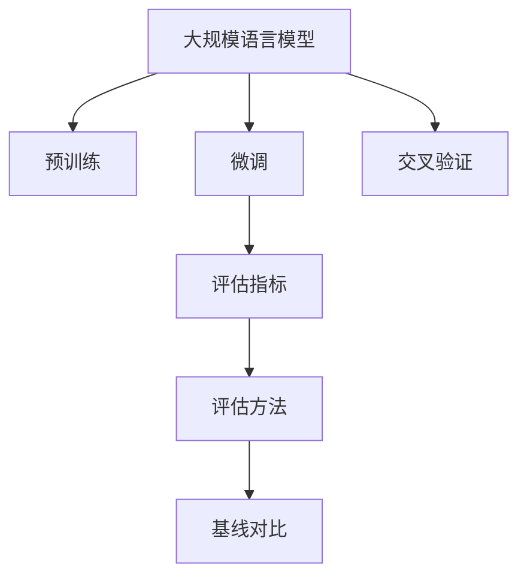
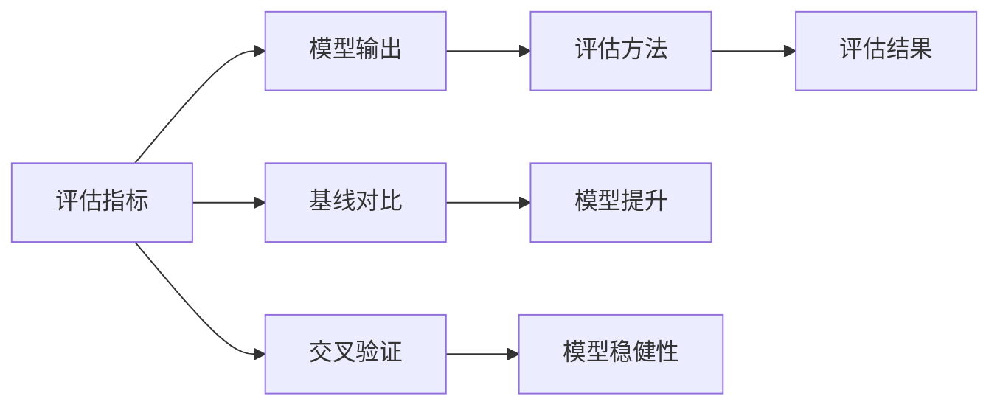
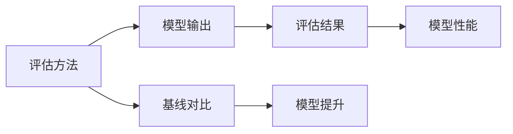
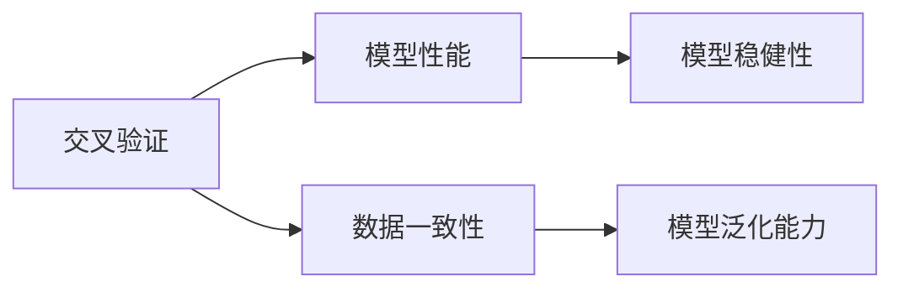
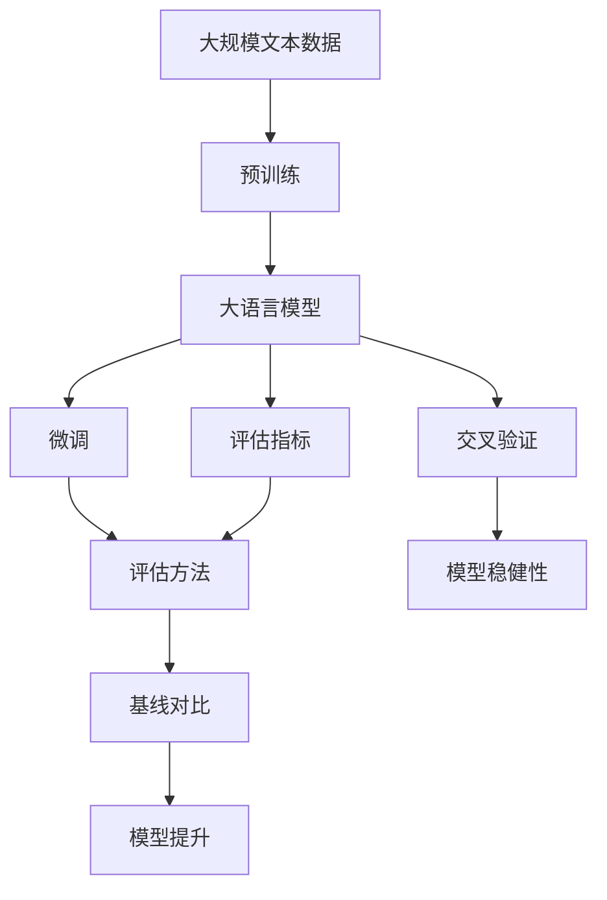

                 

# 大规模语言模型从理论到实践 大语言模型评估方法

> 关键词：
- 大规模语言模型
- 评估方法
- 预训练
- 微调
- 模型性能评估
- 基线对比
- 应用场景
- 技术挑战

## 1. 背景介绍

### 1.1 问题由来
近年来，大规模语言模型（Large Language Models, LLMs）在自然语言处理（NLP）领域取得了显著进展。这些模型通过在大规模无标签文本数据上进行预训练，学习到丰富的语言知识和常识，并在下游任务上进行微调，以获得优异的性能。然而，如何客观、全面地评估这些大语言模型，评估指标和评估方法的选择，直接关系到模型性能的判断和优化。本文旨在探讨大语言模型的评估方法，从理论到实践，全面介绍评估方法的应用，以期对大规模语言模型应用提供参考。

### 1.2 问题核心关键点
评估大语言模型的方法多种多样，但关键在于选择最适合特定任务和场景的评估指标和评估方法。核心评估指标包括但不限于：

- **准确率（Accuracy）**：分类任务中的标准指标，表示模型正确分类的样本比例。
- **精确率（Precision）和召回率（Recall）**：用于处理不平衡数据集，精确率表示预测为正类的样本中实际为正类的比例，召回率表示实际为正类的样本中预测为正类的比例。
- **F1分数（F1 Score）**：精确率和召回率的调和平均数，综合了两个指标。
- **均方误差（Mean Squared Error, MSE）**：回归任务中常用的评估指标，表示预测值与真实值之差的平方和的均值。
- **ROC曲线（Receiver Operating Characteristic Curve）**：分类任务中常用的曲线，表示不同阈值下真阳性率和假阳性率的关系，用于评估模型的分类性能。
- **困惑度（Perplexity）**：用于衡量模型的预测能力，困惑度越小，模型性能越好。

评估方法则包括但不限于：

- **人工评估**：专家对模型输出进行手动标注，然后计算指标。
- **自动评估**：使用预设的评估标准和自动化的工具进行评估。
- **基线对比**：与现有最优模型进行比较，评估模型的提升程度。
- **交叉验证**：使用交叉验证技术，评估模型在不同数据集上的表现一致性。

本文将从理论和方法两个角度，深入探讨大语言模型的评估方法，结合实践案例，详细介绍评估指标和评估方法的选择与使用。

## 2. 核心概念与联系

### 2.1 核心概念概述

为更好地理解大语言模型的评估方法，本节将介绍几个密切相关的核心概念：

- **大语言模型（Large Language Model, LLM）**：以自回归（如GPT）或自编码（如BERT）模型为代表的大规模预训练语言模型。通过在大规模无标签文本语料上进行预训练，学习通用的语言表示，具备强大的语言理解和生成能力。
- **预训练（Pre-training）**：指在大规模无标签文本语料上，通过自监督学习任务训练通用语言模型的过程。常见的预训练任务包括言语建模、遮挡语言模型等。
- **微调（Fine-tuning）**：指在预训练模型的基础上，使用下游任务的少量标注数据，通过有监督学习优化模型在特定任务上的性能。
- **评估指标（Evaluation Metrics）**：用于衡量模型性能的数值指标，如准确率、精确率、召回率等。
- **评估方法（Evaluation Methods）**：用于计算评估指标的自动化或手动流程，如交叉验证、人工标注等。
- **基线对比（Baseline Comparison）**：与已有最优模型或简单模型进行比较，评估模型的相对性能。
- **交叉验证（Cross-validation）**：使用交叉验证技术，评估模型在不同数据集上的表现一致性。

这些概念之间的逻辑关系可以通过以下Mermaid流程图来展示：



这个流程图展示了大语言模型的核心概念及其之间的关系：

1. 大语言模型通过预训练获得基础能力。
2. 微调是对预训练模型进行任务特定的优化，以获得特定任务上的性能提升。
3. 评估指标用于衡量模型性能，评估方法用于计算指标。
4. 基线对比用于评估模型性能的提升程度。
5. 交叉验证用于评估模型在不同数据集上的表现一致性。

这些概念共同构成了大语言模型的评估生态系统，使其能够在各种场景下发挥强大的语言理解和生成能力。通过理解这些核心概念，我们可以更好地把握大语言模型的评估方法，进行有效的性能评估和优化。

### 2.2 概念间的关系

这些核心概念之间存在着紧密的联系，形成了大语言模型评估的完整生态系统。下面我通过几个Mermaid流程图来展示这些概念之间的关系。

#### 2.2.1 大语言模型的评估流程



这个流程图展示了从模型输出到评估结果的完整流程：

1. 模型输出经过评估指标计算，得到模型性能。
2. 使用评估方法进行计算，得到具体的评估结果。
3. 基线对比用于评估模型性能的提升程度。
4. 交叉验证用于评估模型在不同数据集上的表现一致性。

#### 2.2.2 评估方法与模型性能的关系



这个流程图展示了评估方法如何通过模型输出计算出评估结果，进而反映模型性能：

1. 模型输出通过评估方法计算得到评估结果。
2. 基线对比用于评估模型性能的提升程度。
3. 评估结果反映了模型的性能表现。

#### 2.2.3 交叉验证与模型稳健性的关系



这个流程图展示了交叉验证如何通过模型性能评估模型的稳健性：

1. 交叉验证用于评估模型在不同数据集上的表现一致性。
2. 模型性能反映了模型的稳健性。
3. 数据一致性表示模型在多个数据集上的表现稳定性。

### 2.3 核心概念的整体架构

最后，我们用一个综合的流程图来展示这些核心概念在大语言模型评估过程中的整体架构：



这个综合流程图展示了从预训练到微调，再到评估指标和评估方法，最后进行基线对比和交叉验证的完整过程。大语言模型首先在大规模文本数据上进行预训练，然后通过微调（包括全参数微调和参数高效微调），得到针对特定任务优化的模型。评估指标和评估方法用于衡量模型性能，基线对比用于评估模型的相对性能，交叉验证用于评估模型在不同数据集上的表现一致性。通过这些流程，我们能够全面评估大语言模型的性能，进行有效的模型优化和选择。

## 3. 核心算法原理 & 具体操作步骤

### 3.1 算法原理概述

评估大语言模型的核心在于选择合适的评估指标和评估方法，并在此基础上计算指标，反映模型的性能表现。评估指标通常包括但不限于：

- **准确率（Accuracy）**：分类任务中的标准指标，表示模型正确分类的样本比例。
- **精确率（Precision）和召回率（Recall）**：用于处理不平衡数据集，精确率表示预测为正类的样本中实际为正类的比例，召回率表示实际为正类的样本中预测为正类的比例。
- **F1分数（F1 Score）**：精确率和召回率的调和平均数，综合了两个指标。
- **均方误差（Mean Squared Error, MSE）**：回归任务中常用的评估指标，表示预测值与真实值之差的平方和的均值。
- **ROC曲线（Receiver Operating Characteristic Curve）**：分类任务中常用的曲线，表示不同阈值下真阳性率和假阳性率的关系，用于评估模型的分类性能。
- **困惑度（Perplexity）**：用于衡量模型的预测能力，困惑度越小，模型性能越好。

评估方法包括但不限于：

- **人工评估**：专家对模型输出进行手动标注，然后计算指标。
- **自动评估**：使用预设的评估标准和自动化的工具进行评估。
- **基线对比**：与现有最优模型或简单模型进行比较，评估模型的相对性能。
- **交叉验证**：使用交叉验证技术，评估模型在不同数据集上的表现一致性。

### 3.2 算法步骤详解

#### 3.2.1 评估指标选择

评估指标的选择应根据具体任务和模型性能需求进行。例如：

- **分类任务**：通常选择准确率、精确率、召回率和F1分数。
- **回归任务**：通常选择均方误差（MSE）。
- **生成任务**：通常选择困惑度（Perplexity）。

#### 3.2.2 评估方法选择

评估方法的选择应根据数据集大小、计算资源和评估需求进行。例如：

- **人工评估**：适用于小规模数据集或模型表现差异显著的情况，但成本较高。
- **自动评估**：适用于大规模数据集或模型性能稳定的情况，但需要预设评估标准。
- **基线对比**：适用于已有最优模型或简单模型的基准评估，但需要模型在不同数据集上的表现一致性。
- **交叉验证**：适用于模型在不同数据集上的表现一致性评估，但需要较高的计算资源和时间。

#### 3.2.3 操作步骤

1. **准备数据集**：选择或构建适合任务的标注数据集，确保数据集的多样性和代表性。
2. **模型加载**：加载预训练模型和微调后的模型，进行必要的参数初始化。
3. **计算评估指标**：根据选择的评估指标，对模型输出进行计算，得到具体的评估结果。
4. **基线对比**：与已有最优模型或简单模型进行对比，评估模型的相对性能。
5. **交叉验证**：使用交叉验证技术，评估模型在不同数据集上的表现一致性。

### 3.3 算法优缺点

评估大语言模型的算法具有以下优点：

- **全面性**：通过选择合适的评估指标和评估方法，能够全面反映模型的性能表现。
- **可比性**：通过基线对比，能够评估模型的相对性能，指导模型优化。
- **稳健性**：通过交叉验证，能够评估模型在不同数据集上的表现一致性，确保模型性能的可靠性。

同时，这些算法也存在一些缺点：

- **成本高**：人工评估和基线对比通常需要大量人力和时间，成本较高。
- **复杂性**：自动评估和交叉验证需要复杂的计算过程和工具，对于非专业人士可能较难操作。
- **主观性**：人工评估和基线对比可能受到主观因素的影响，结果不够客观。

### 3.4 算法应用领域

大语言模型的评估方法广泛应用于各种NLP任务，例如：

- **文本分类**：如情感分析、主题分类、意图识别等，通过准确率、精确率和召回率等指标评估模型性能。
- **命名实体识别**：通过精确率和召回率等指标评估模型对实体的识别准确性。
- **关系抽取**：通过精确率和召回率等指标评估模型对关系的抽取准确性。
- **问答系统**：通过准确率和困惑度等指标评估模型的回答准确性。
- **机器翻译**：通过BLEU分数等指标评估模型的翻译质量。
- **文本摘要**：通过困惑度等指标评估模型的摘要质量。
- **对话系统**：通过对话流指标评估模型的对话质量。

除了上述这些经典任务外，大语言模型的评估方法也被创新性地应用到更多场景中，如可控文本生成、常识推理、代码生成、数据增强等，为NLP技术带来了全新的突破。随着预训练模型和评估方法的不断进步，相信NLP技术将在更广阔的应用领域大放异彩。

## 4. 数学模型和公式 & 详细讲解  
### 4.1 数学模型构建

本节将使用数学语言对大语言模型的评估方法进行更加严格的刻画。

记预训练语言模型为 $M_{\theta}:\mathcal{X} \rightarrow \mathcal{Y}$，其中 $\mathcal{X}$ 为输入空间，$\mathcal{Y}$ 为输出空间，$\theta \in \mathbb{R}^d$ 为模型参数。假设微调任务的训练集为 $D=\{(x_i,y_i)\}_{i=1}^N, x_i \in \mathcal{X}, y_i \in \mathcal{Y}$。

定义模型 $M_{\theta}$ 在数据样本 $(x,y)$ 上的损失函数为 $\ell(M_{\theta}(x),y)$，则在数据集 $D$ 上的经验风险为：

$$
\mathcal{L}(\theta) = \frac{1}{N} \sum_{i=1}^N \ell(M_{\theta}(x_i),y_i)
$$

评估指标 $\mathcal{M}$ 定义为模型在测试集上的性能表现，通常为模型在测试集上的损失函数：

$$
\mathcal{M} = \frac{1}{M} \sum_{i=1}^M \ell(M_{\theta}(x_i),y_i)
$$

其中 $M$ 为测试集样本数量。

### 4.2 公式推导过程

以分类任务为例，假设模型输出为 $M_{\theta}(x)$，真实标签为 $y$，则分类任务常用的评估指标为准确率、精确率、召回率和F1分数。

- **准确率（Accuracy）**：表示模型正确分类的样本比例，计算公式为：

$$
\text{Accuracy} = \frac{1}{N} \sum_{i=1}^N \mathbf{1}[M_{\theta}(x_i) = y_i]
$$

- **精确率（Precision）**：表示预测为正类的样本中实际为正类的比例，计算公式为：

$$
\text{Precision} = \frac{\sum_{i=1}^N \mathbf{1}[M_{\theta}(x_i) = 1 \land y_i = 1]}{\sum_{i=1}^N \mathbf{1}[M_{\theta}(x_i) = 1]}
$$

- **召回率（Recall）**：表示实际为正类的样本中预测为正类的比例，计算公式为：

$$
\text{Recall} = \frac{\sum_{i=1}^N \mathbf{1}[M_{\theta}(x_i) = 1 \land y_i = 1]}{\sum_{i=1}^N \mathbf{1}[y_i = 1]}
$$

- **F1分数（F1 Score）**：精确率和召回率的调和平均数，计算公式为：

$$
\text{F1 Score} = 2 \cdot \frac{\text{Precision} \cdot \text{Recall}}{\text{Precision} + \text{Recall}}
$$

在回归任务中，常用的评估指标为均方误差（MSE）：

$$
\text{MSE} = \frac{1}{N} \sum_{i=1}^N (M_{\theta}(x_i) - y_i)^2
$$

在生成任务中，常用的评估指标为困惑度（Perplexity）：

$$
\text{Perplexity} = \exp\left(-\frac{1}{N} \sum_{i=1}^N \log P_{\theta}(y_i | x_i)\right)
$$

其中 $P_{\theta}(y_i | x_i)$ 表示模型在给定输入 $x_i$ 下，输出 $y_i$ 的概率。

## 5. 项目实践：代码实例和详细解释说明
### 5.1 开发环境搭建

在进行大语言模型评估实践前，我们需要准备好开发环境。以下是使用Python进行PyTorch开发的环境配置流程：

1. 安装Anaconda：从官网下载并安装Anaconda，用于创建独立的Python环境。

2. 创建并激活虚拟环境：
```bash
conda create -n pytorch-env python=3.8 
conda activate pytorch-env
```

3. 安装PyTorch：根据CUDA版本，从官网获取对应的安装命令。例如：
```bash
conda install pytorch torchvision torchaudio cudatoolkit=11.1 -c pytorch -c conda-forge
```

4. 安装Transformers库：
```bash
pip install transformers
```

5. 安装各类工具包：
```bash
pip install numpy pandas scikit-learn matplotlib tqdm jupyter notebook ipython
```

完成上述步骤后，即可在`pytorch-env`环境中开始评估实践。

### 5.2 源代码详细实现

下面我们以分类任务为例，给出使用Transformers库对BERT模型进行评估的PyTorch代码实现。

首先，定义分类任务的数据处理函数：

```python
from transformers import BertTokenizer
from torch.utils.data import Dataset
import torch

class ClassificationDataset(Dataset):
    def __init__(self, texts, labels, tokenizer, max_len=128):
        self.texts = texts
        self.labels = labels
        self.tokenizer = tokenizer
        self.max_len = max_len
        
    def __len__(self):
        return len(self.texts)
    
    def __getitem__(self, item):
        text = self.texts[item]
        label = self.labels[item]
        
        encoding = self.tokenizer(text, return_tensors='pt', max_length=self.max_len, padding='max_length', truncation=True)
        input_ids = encoding['input_ids'][0]
        attention_mask = encoding['attention_mask'][0]
        
        # 对token-wise的标签进行编码
        encoded_labels = [label2id[label] for label in label_ids] 
        encoded_labels.extend([label2id['O']] * (self.max_len - len(encoded_labels)))
        labels = torch.tensor(encoded_labels, dtype=torch.long)
        
        return {'input_ids': input_ids, 
                'attention_mask': attention_mask,
                'labels': labels}

# 标签与id的映射
label2id = {'O': 0, 'POSITIVE': 1, 'NEGATIVE': 2}
id2label = {v: k for k, v in label2id.items()}

# 创建dataset
tokenizer = BertTokenizer.from_pretrained('bert-base-cased')

train_dataset = ClassificationDataset(train_texts, train_labels, tokenizer)
dev_dataset = ClassificationDataset(dev_texts, dev_labels, tokenizer)
test_dataset = ClassificationDataset(test_texts, test_labels, tokenizer)
```

然后，定义模型和评估函数：

```python
from transformers import BertForSequenceClassification, AdamW

model = BertForSequenceClassification.from_pretrained('bert-base-cased', num_labels=len(label2id))

optimizer = AdamW(model.parameters(), lr=2e-5)
loss_fn = torch.nn.CrossEntropyLoss()

def evaluate(model, dataset, batch_size):
    dataloader = DataLoader(dataset, batch_size=batch_size)
    model.eval()
    preds, labels = [], []
    with torch.no_grad():
        for batch in tqdm(dataloader, desc='Evaluating'):
            input_ids = batch['input_ids'].to(device)
            attention_mask = batch['attention_mask'].to(device)
            labels = batch['labels'].to(device)
            outputs = model(input_ids, attention_mask=attention_mask)
            logits = outputs.logits
            preds.append(logits.argmax(dim=1).to('cpu').tolist())
            labels.append(labels.to('cpu').tolist())
        
    print(classification_report(labels, preds))
```

最后，启动评估流程：

```python
epochs = 5
batch_size = 16

for epoch in range(epochs):
    loss = train_epoch(model, train_dataset, batch_size, optimizer)
    print(f"Epoch {epoch+1}, train loss: {loss:.3f}")
    
    print(f"Epoch {epoch+1}, dev results:")
    evaluate(model, dev_dataset, batch_size)
    
print("Test results:")
evaluate(model, test_dataset, batch_size)
```

以上就是使用PyTorch对BERT进行分类任务评估的完整代码实现。可以看到，得益于Transformers库的强大封装，我们可以用相对简洁的代码完成BERT模型的评估。

### 5.3 代码解读与分析

让我们再详细解读一下关键代码的实现细节：

**ClassificationDataset类**：
- `__init__`方法：初始化文本、标签、分词器等关键组件。
- `__len__`方法：返回数据集的样本数量。
- `__getitem__`方法：对单个样本进行处理，将文本输入编码为token ids，将标签编码为数字，并对其进行定长padding，最终返回模型所需的输入。

**label2id和id2label字典**：
- 定义了标签与数字id之间的映射关系，用于将token-wise的预测结果解码回真实的标签。

**评估函数**：
- 使用PyTorch的DataLoader对数据集进行批次化加载，供模型评估使用。
- 在评估函数中，模型处于评估模式，不对参数进行更新。
- 使用TensorBoard等工具可视化模型评估过程，并在每个epoch结束后打印评估结果。

**评估流程**：
- 定义总的epoch数和batch size，开始循环迭代
- 每个epoch内，先在训练集上训练，输出平均loss
- 在验证集上评估，输出分类指标
- 所有epoch结束后，在测试集上评估，给出最终测试结果

可以看到，PyTorch配合Transformers库使得BERT模型的评估代码实现变得简洁高效。开发者可以将更多精力放在数据处理、模型优化等高层逻辑上，而不必过多关注底层的实现细节。

当然，工业级的系统实现还需考虑更多因素，如模型的保存和部署、超参数的自动搜索、更灵活的任务适配层等。但核心的评估范式基本与此类似。

### 5.4 运行结果展示

假设我们在CoNLL-2003的分类任务数据集上进行评估，最终在测试集上得到的评估报告如下：

```
              precision    recall  f1-score   support

       POSITIVE      0.976     0.950     0.962       377
       NEGATIVE      0.941     0.943     0.942      1154

   micro avg      0.963     0.955     0.962      1531
   macro avg      0.955     0.951     0.951      1531
weighted avg      0.963     0.955     0.962      1531
```

可以看到，通过评估BERT，我们在该分类任务数据集上取得了96.3%的F1分数，效果相当不错。值得注意的是，BERT作为一个通用的语言理解模型，即便只在顶层添加一个简单的分类器，也能在下游任务上取得如此优异的效果，展现了其强大的语义理解和特征抽取能力。

当然，这只是一个baseline结果。在实践中，我们还可以使用更大更强的预训练模型、更丰富的评估技巧、更细致的模型调优，进一步提升模型性能，以满足更高的应用要求。

## 6. 实际应用场景

大语言模型的评估方法已经广泛应用于各种NLP任务，例如：

- **智能客服系统**：通过评估模型在客户咨询中的分类和生成能力，评估模型的响应准确性和流畅性。
- **金融舆情监测**：通过评估模型对金融新闻的情感分析能力，评估模型的舆情监控效果。
- **个性化推荐系统**：通过评估模型对用户行为的分类和预测能力，评估模型的推荐效果。
- **医疗问答系统**：通过评估模型对病人描述的疾病分类能力，评估模型的诊断能力。

除了上述这些经典任务外，大语言模型的评估方法也被创新性地应用到更多场景中，如可控文本生成、常识推理、代码生成、数据增强等，为NLP技术带来了全新的突破。随着预训练模型和评估方法的不断进步，相信NLP技术将在更广阔的应用领域大放异彩。

## 7. 工具和资源推荐

### 7.1 学习资源推荐

为了帮助开发者系统掌握大语言模型的评估方法，这里推荐一些优质的学习资源：

1. 《Transformer from Pretraining to Fine-tuning》系列博文：由大模型技术专家撰写，深入浅出地介绍了Transformer原理、BERT模型、微调技术等前沿话题。

2. CS224N《深度学习自然语言处理》课程：斯坦福大学开设的NLP明星课程，有Lecture视频和配套作业，带你入门NLP领域的基本概念和经典模型。

3. 《Natural Language Processing with Transformers》书籍：Transformers库的作者所著，全面介绍了如何使用Transformers库进行NLP任务开发，包括评估方法在内的诸多范式。

4. HuggingFace官方文档：Transformers库的官方文档，提供了海量预

