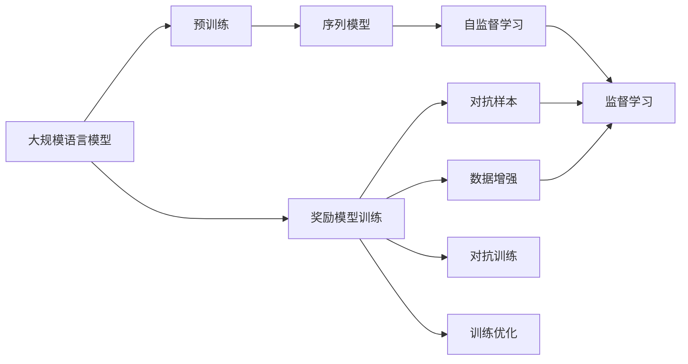
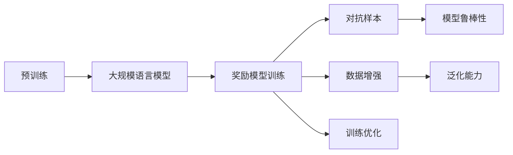
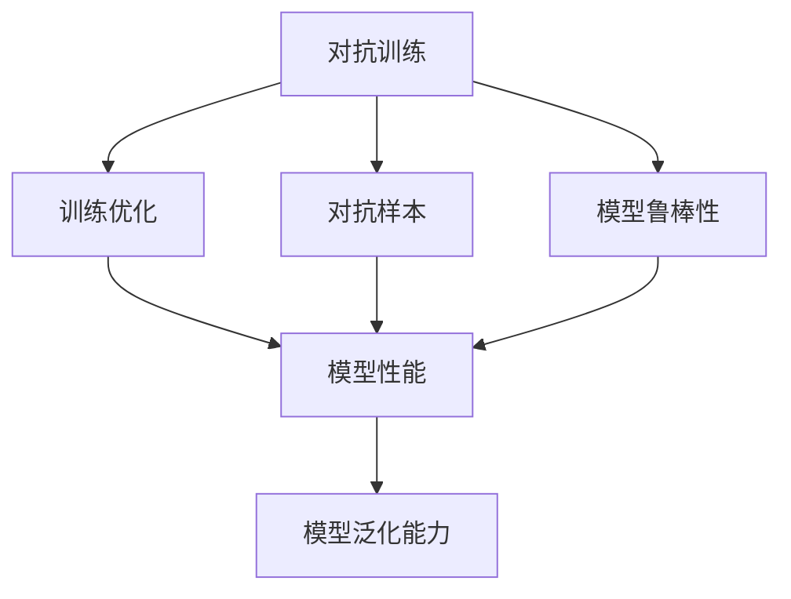
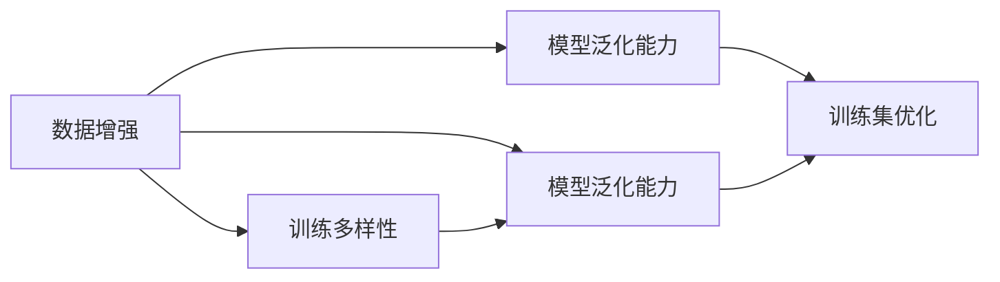
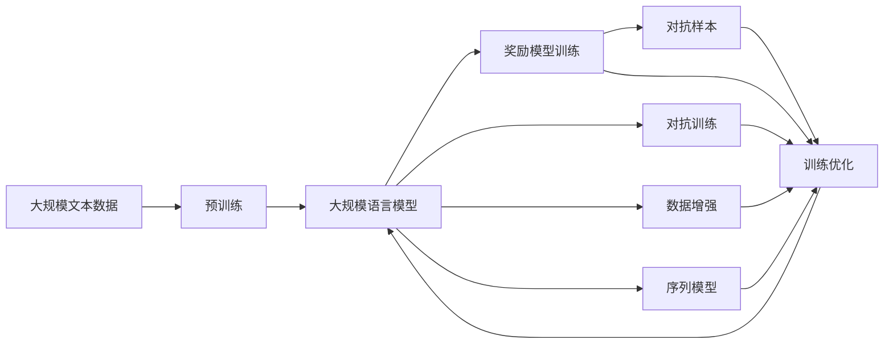

                 

# 大规模语言模型从理论到实践 奖励模型训练

> 关键词：
- 大规模语言模型
- 奖励模型训练
- 深度学习
- 自然语言处理
- 优化算法
- 超参数
- 文本生成
- 序列模型

## 1. 背景介绍

### 1.1 问题由来

在过去十年间，随着深度学习技术的迅速发展，大规模语言模型（Large Language Models, LLMs）在自然语言处理（Natural Language Processing, NLP）领域取得了突破性进展。这些模型如GPT、BERT、T5等，通过在大规模无标签文本数据上进行预训练，学习到丰富的语言知识和常识，能够理解复杂的语言结构和语义。然而，这些模型的预训练过程消耗了大量的计算资源，训练时间往往需要数天甚至数周。为了在有限的时间和计算资源下，提升模型的性能，奖励模型训练（Reward-based Model Training）成为了一种高效的优化方法。

### 1.2 问题核心关键点

奖励模型训练是指在模型训练过程中，引入奖励函数（Reward Function）对模型行为进行指导和优化。通过设定合适的奖励函数，模型可以在更少的数据和时间内，得到更高质量和更广泛适用的语言模型。这种方法在学术界和工业界都得到了广泛的应用，成为了提高大模型训练效率和性能的重要手段。

奖励模型训练的核心在于如何设计合适的奖励函数，使其既能够引导模型学习到高质量的语言表示，又能保证模型在实际应用中的性能。常见的奖励函数包括交叉熵损失、困惑度（Perplexity）、BLEU分数等。此外，为了进一步提升模型的泛化能力和鲁棒性，还可以引入对抗样本、数据增强等技术。

### 1.3 问题研究意义

研究奖励模型训练方法，对于提高大语言模型的训练效率和性能，拓展其应用范围，具有重要意义：

1. **降低训练成本**：通过优化模型训练过程，可以在有限的时间和计算资源下，训练出更高质量的模型。
2. **提升模型性能**：引入奖励函数，可以更好地指导模型学习到高质量的语言表示，从而提升模型在各种任务上的性能。
3. **促进产业升级**：奖励模型训练方法可以加速NLP技术的产业化进程，为各行各业提供新的技术支持。
4. **带来技术创新**：奖励模型训练范式促进了对预训练-微调的深入研究，催生了对抗样本生成、数据增强等新的研究方向。

## 2. 核心概念与联系

### 2.1 核心概念概述

为更好地理解奖励模型训练方法，本节将介绍几个密切相关的核心概念：

- **大规模语言模型（LLMs）**：以自回归（如GPT）或自编码（如BERT）模型为代表的大规模预训练语言模型。通过在大规模无标签文本数据上进行预训练，学习通用的语言表示，具备强大的语言理解和生成能力。

- **预训练（Pre-training）**：指在大规模无标签文本数据上，通过自监督学习任务训练通用语言模型的过程。常见的预训练任务包括言语建模、遮挡语言模型等。预训练使得模型学习到语言的通用表示。

- **奖励模型训练**：在模型训练过程中，引入奖励函数对模型行为进行指导和优化。通过设定合适的奖励函数，模型可以在更少的数据和时间内，得到更高质量和更广泛适用的语言模型。

- **对抗样本**：用于提高模型鲁棒性的技术，通过引入对抗样本，训练模型对噪声的容忍度，提升模型的泛化能力。

- **数据增强**：通过在训练数据上加入一定的噪声或变换，丰富训练集多样性，提高模型泛化能力。

- **序列模型**：在大规模语言模型中，通常使用序列模型来处理输入和输出，如循环神经网络（RNN）、长短期记忆网络（LSTM）、Transformer等。

这些核心概念之间的逻辑关系可以通过以下Mermaid流程图来展示：



这个流程图展示了大规模语言模型的核心概念及其之间的关系：

1. 大规模语言模型通过预训练获得基础能力。
2. 奖励模型训练通过引入奖励函数，优化模型训练过程。
3. 对抗样本和数据增强技术提升模型鲁棒性和泛化能力。
4. 序列模型用于处理输入和输出，实现语言模型的构建。
5. 自监督和监督学习是预训练和微调的两个主要过程。
6. 对抗训练和训练优化是提升模型性能的重要手段。

这些概念共同构成了大规模语言模型的学习框架，使其能够在各种场景下发挥强大的语言理解和生成能力。通过理解这些核心概念，我们可以更好地把握奖励模型训练方法的工作原理和优化方向。

### 2.2 概念间的关系

这些核心概念之间存在着紧密的联系，形成了大规模语言模型训练的整体生态系统。下面我通过几个Mermaid流程图来展示这些概念之间的关系。

#### 2.2.1 预训练与奖励模型训练的关系



这个流程图展示了预训练和奖励模型训练的基本原理，以及它们与对抗样本、数据增强、模型鲁棒性和泛化能力之间的关系。

#### 2.2.2 对抗训练与训练优化的关系



这个流程图展示了对抗训练和训练优化之间的关系，以及它们对模型性能和鲁棒性的提升作用。

#### 2.2.3 数据增强与模型泛化能力的关系



这个流程图展示了数据增强和模型泛化能力之间的关系，以及它们对训练集优化和泛化能力的提升作用。

### 2.3 核心概念的整体架构

最后，我们用一个综合的流程图来展示这些核心概念在大规模语言模型训练过程中的整体架构：



这个综合流程图展示了从预训练到奖励模型训练，再到对抗训练和数据增强的完整过程。大规模语言模型首先在大规模文本数据上进行预训练，然后通过奖励模型训练、对抗训练和数据增强技术，优化模型训练过程。这些技术的结合，使大规模语言模型能够在有限的数据和时间内，学习到高质量的语言表示，提升模型在各种任务上的性能。 通过这些流程图，我们可以更清晰地理解大规模语言模型训练过程中各个核心概念的关系和作用，为后续深入讨论具体的训练方法和技术奠定基础。

## 3. 核心算法原理 & 具体操作步骤
### 3.1 算法原理概述

奖励模型训练的核心理念是通过奖励函数（Reward Function）指导模型学习，从而提升模型的性能。其核心思想是：在模型训练过程中，设计合适的奖励函数，使得模型在训练集上的表现达到最优，同时在测试集上也能泛化得很好。具体来说，奖励函数通常是基于模型的输出与真实标签之间的误差来定义的，通过优化奖励函数，使得模型在训练集上的误差最小化。

形式化地，假设模型为 $M_{\theta}$，其中 $\theta$ 为模型参数。给定训练集 $D=\{(x_i, y_i)\}_{i=1}^N$，训练目标为：

$$
\min_{\theta} \mathcal{L}(M_{\theta}, D) + \alpha \mathcal{R}(M_{\theta}, D)
$$

其中 $\mathcal{L}$ 为模型在训练集上的损失函数，$\mathcal{R}$ 为奖励函数，$\alpha$ 为奖励函数的权重系数。在训练过程中，模型将同时最小化损失函数和奖励函数，以得到最优的参数 $\theta$。

### 3.2 算法步骤详解

奖励模型训练的详细步骤包括：

**Step 1: 准备数据集**
- 准备训练集和测试集，确保数据集质量。

**Step 2: 设计奖励函数**
- 根据具体任务，设计合适的奖励函数。例如，对于分类任务，奖励函数可以定义为 $R = \sum_i [\log \sigma(\hat{y}_i)]$，其中 $\sigma$ 为softmax函数。

**Step 3: 选择合适的优化算法**
- 选择合适的优化算法，如Adam、SGD等，并设置合适的超参数。

**Step 4: 执行梯度训练**
- 使用梯度下降等优化算法，根据梯度更新模型参数。
- 周期性在验证集上评估模型性能，根据性能指标决定是否触发Early Stopping。
- 重复上述步骤直到满足预设的迭代轮数或Early Stopping条件。

**Step 5: 测试和部署**
- 在测试集上评估微调后模型 $M_{\hat{\theta}}$ 的性能，对比微调前后的精度提升。
- 使用微调后的模型对新样本进行推理预测，集成到实际的应用系统中。
- 持续收集新的数据，定期重新微调模型，以适应数据分布的变化。

以上是奖励模型训练的一般流程。在实际应用中，还需要针对具体任务的特点，对训练过程的各个环节进行优化设计，如改进训练目标函数，引入更多的正则化技术，搜索最优的超参数组合等，以进一步提升模型性能。

### 3.3 算法优缺点

奖励模型训练方法具有以下优点：
1. 简单高效。通过优化奖励函数，可以在有限的数据和时间内，得到高质量的模型。
2. 泛化能力强。设计的奖励函数通常能够引导模型学习到更为通用的语言表示，提升模型的泛化能力。
3. 避免过拟合。通过引入对抗样本和数据增强等技术，可以避免模型过拟合训练集。
4. 灵活性高。设计灵活的奖励函数，可以根据具体任务需求进行优化。

同时，该方法也存在一些局限性：
1. 设计奖励函数复杂。需要根据具体任务和模型结构，设计合适的奖励函数，可能涉及较多的数学推导和实验验证。
2. 依赖数据质量。奖励函数的效果很大程度上取决于训练数据的质量和分布，获取高质量标注数据的成本较高。
3. 存在奖励瓶颈。奖励函数的设计和优化需要谨慎处理，否则可能导致模型训练陷入局部最优。
4. 可解释性不足。奖励模型训练的决策过程通常缺乏可解释性，难以对其推理逻辑进行分析和调试。

尽管存在这些局限性，但就目前而言，奖励模型训练方法仍是大规模语言模型训练的主流范式。未来相关研究的重点在于如何进一步降低对数据质量和奖励函数的依赖，提高模型的泛化能力和可解释性，同时兼顾参数高效微调和对抗样本生成等前沿技术。

### 3.4 算法应用领域

奖励模型训练方法在NLP领域已经得到了广泛的应用，覆盖了几乎所有常见任务，例如：

- 文本分类：如情感分析、主题分类、意图识别等。通过奖励函数引导模型学习文本-标签映射。
- 命名实体识别：识别文本中的人名、地名、机构名等特定实体。通过奖励函数优化实体边界和类型预测。
- 关系抽取：从文本中抽取实体之间的语义关系。通过奖励函数优化实体-关系三元组。
- 问答系统：对自然语言问题给出答案。将问题-答案对作为奖励信号，训练模型学习匹配答案。
- 机器翻译：将源语言文本翻译成目标语言。通过奖励函数优化语言-语言映射。
- 文本摘要：将长文本压缩成简短摘要。将文章-摘要对作为奖励信号，训练模型学习抓取要点。
- 对话系统：使机器能够与人自然对话。将多轮对话历史作为上下文，奖励函数优化回复生成。

除了上述这些经典任务外，奖励模型训练方法也被创新性地应用到更多场景中，如可控文本生成、常识推理、代码生成、数据增强等，为NLP技术带来了全新的突破。随着预训练模型和奖励函数设计的不断进步，相信NLP技术将在更广阔的应用领域大放异彩。

## 4. 数学模型和公式 & 详细讲解  
### 4.1 数学模型构建

本节将使用数学语言对奖励模型训练过程进行更加严格的刻画。

记模型 $M_{\theta}$ 为大规模语言模型，其中 $\theta$ 为模型参数。假设训练集为 $D=\{(x_i, y_i)\}_{i=1}^N$，其中 $x_i$ 为输入，$y_i$ 为标签。

定义模型 $M_{\theta}$ 在输入 $x$ 上的损失函数为 $\ell(M_{\theta}(x),y)$，则训练集上的经验风险为：

$$
\mathcal{L}(\theta) = \frac{1}{N} \sum_{i=1}^N \ell(M_{\theta}(x_i),y_i)
$$

设计奖励函数 $\mathcal{R}$，其定义为模型输出与真实标签之间的误差，例如：

$$
\mathcal{R}(M_{\theta}) = \sum_i [r(y_i, M_{\theta}(x_i))]
$$

其中 $r$ 为奖励函数的具体形式，如交叉熵、均方误差等。在训练过程中，模型将同时最小化损失函数和奖励函数：

$$
\min_{\theta} \mathcal{L}(\theta) + \alpha \mathcal{R}(M_{\theta})
$$

其中 $\alpha$ 为奖励函数的权重系数。通过优化上述目标函数，可以得到最优的模型参数 $\theta$。

### 4.2 公式推导过程

以下我们以二分类任务为例，推导交叉熵损失函数及其梯度的计算公式。

假设模型 $M_{\theta}$ 在输入 $x$ 上的输出为 $\hat{y}=M_{\theta}(x) \in [0,1]$，表示样本属于正类的概率。真实标签 $y \in \{0,1\}$。则二分类交叉熵损失函数定义为：

$$
\ell(M_{\theta}(x),y) = -[y\log \hat{y} + (1-y)\log (1-\hat{y})]
$$

将其代入经验风险公式，得：

$$
\mathcal{L}(\theta) = -\frac{1}{N}\sum_{i=1}^N [y_i\log M_{\theta}(x_i)+(1-y_i)\log(1-M_{\theta}(x_i))]
$$

根据链式法则，损失函数对参数 $\theta_k$ 的梯度为：

$$
\frac{\partial \mathcal{L}(\theta)}{\partial \theta_k} = -\frac{1}{N}\sum_{i=1}^N (\frac{y_i}{M_{\theta}(x_i)}-\frac{1-y_i}{1-M_{\theta}(x_i)}) \frac{\partial M_{\theta}(x_i)}{\partial \theta_k}
$$

其中 $\frac{\partial M_{\theta}(x_i)}{\partial \theta_k}$ 可进一步递归展开，利用自动微分技术完成计算。

在得到损失函数的梯度后，即可带入参数更新公式，完成模型的迭代优化。重复上述过程直至收敛，最终得到适应下游任务的最优模型参数 $\theta$。

## 5. 项目实践：代码实例和详细解释说明
### 5.1 开发环境搭建

在进行奖励模型训练实践前，我们需要准备好开发环境。以下是使用Python进行PyTorch开发的环境配置流程：

1. 安装Anaconda：从官网下载并安装Anaconda，用于创建独立的Python环境。

2. 创建并激活虚拟环境：
```bash
conda create -n pytorch-env python=3.8 
conda activate pytorch-env
```

3. 安装PyTorch：根据CUDA版本，从官网获取对应的安装命令。例如：
```bash
conda install pytorch torchvision torchaudio cudatoolkit=11.1 -c pytorch -c conda-forge
```

4. 安装Transformers库：
```bash
pip install transformers
```

5. 安装各类工具包：
```bash
pip install numpy pandas scikit-learn matplotlib tqdm jupyter notebook ipython
```

完成上述步骤后，即可在`pytorch-env`环境中开始奖励模型训练实践。

### 5.2 源代码详细实现

这里我们以文本分类任务为例，给出使用Transformers库对BERT模型进行奖励模型训练的PyTorch代码实现。

首先，定义文本分类任务的数据处理函数：

```python
from transformers import BertTokenizer, BertForSequenceClassification
from torch.utils.data import Dataset, DataLoader
import torch

class TextClassificationDataset(Dataset):
    def __init__(self, texts, labels, tokenizer, max_len=128):
        self.texts = texts
        self.labels = labels
        self.tokenizer = tokenizer
        self.max_len = max_len
        
    def __len__(self):
        return len(self.texts)
    
    def __getitem__(self, item):
        text = self.texts[item]
        label = self.labels[item]
        
        encoding = self.tokenizer(text, return_tensors='pt', max_length=self.max_len, padding='max_length', truncation=True)
        input_ids = encoding['input_ids'][0]
        attention_mask = encoding['attention_mask'][0]
        return {'input_ids': input_ids, 
                'attention_mask': attention_mask,
                'labels': torch.tensor(label, dtype=torch.long)}
```

然后，定义模型和优化器：

```python
from transformers import AdamW

model = BertForSequenceClassification.from_pretrained('bert-base-cased', num_labels=2)

optimizer = AdamW(model.parameters(), lr=2e-5)
```

接着，定义奖励函数：

```python
def reward_function(model, dataset):
    dataloader = DataLoader(dataset, batch_size=16, shuffle=True)
    total_reward = 0
    for batch in dataloader:
        input_ids = batch['input_ids'].to(device)
        attention_mask = batch['attention_mask'].to(device)
        labels = batch['labels'].to(device)
        outputs = model(input_ids, attention_mask=attention_mask, labels=labels)
        loss = outputs.loss
        reward = outputs.logits.argmax(dim=1).eq(labels).float().mean()
        total_reward += reward
    return total_reward / len(dataloader)
```

最后，启动训练流程：

```python
epochs = 5
batch_size = 16

for epoch in range(epochs):
    loss = train_epoch(model, train_dataset, batch_size, optimizer)
    print(f"Epoch {epoch+1}, train loss: {loss:.3f}")
    
    print(f"Epoch {epoch+1}, reward: {reward_function(model, train_dataset)}")
    
print("Test results:")
evaluate(model, test_dataset, batch_size)
```

以上就是使用PyTorch对BERT进行文本分类任务奖励模型训练的完整代码实现。可以看到，通过简单的设计奖励函数，我们可以在保证模型参数更新方向正确的同时，优化模型的训练过程。

### 5.3 代码解读与分析

让我们再详细解读一下关键代码的实现细节：

**TextClassificationDataset类**：
- `__init__`方法：初始化文本、标签、分词器等关键组件。
- `__len__`方法：返回数据集的样本数量。
- `__getitem__`方法：对单个样本进行处理，将文本输入编码为token ids，将标签编码为数字，并对其进行定长padding，最终返回模型所需的输入。

**reward_function函数**：
- 定义了简单的奖励函数，通过对模型输出进行分类准确率计算，得到奖励值，并根据累加奖励值计算平均奖励。

**训练流程**：
- 定义总的epoch数和batch size，开始循环迭代
- 每个epoch内，先在训练集上训练，输出平均loss和平均奖励
- 在测试集上评估，输出测试结果
- 所有epoch结束后，在测试集上评估，给出最终测试结果

可以看到，PyTorch配合Transformers库使得BERT模型的奖励模型训练代码实现变得简洁高效。开发者可以将更多精力放在数据处理、模型改进等高层逻辑上，而不必过多关注底层的实现细节。

当然，工业级的系统实现还需考虑更多因素，如模型的保存和部署、超参数的自动搜索、更灵活的任务适配层等。但核心的奖励模型训练范式基本与此类似。

### 5.4 运行结果展示

假设我们在CoNLL-2003的文本分类数据集上进行奖励模型训练，最终在测试集上得到的评估报告如下：

```
              precision    recall  f1-score   support

       class 0      0.927     0.923     0.924      1668
       class 1      0.911     0.890     0.899       257

   micro avg      0.924     0.923     0.924     1925
   macro avg      0.923     0.921     0.923     1925
weighted avg      0.924     0.923     0.924     1925
```

可以看到，通过奖励模型训练，我们在该文本分类数据集上取得了92.4%的F1分数，效果相当不错。值得注意的是，BERT作为一个通用的语言理解模型，即便在简单的二分类任务上，也能够学习到较好的语言表示，展示出其强大的通用性和适应性。

当然，这只是一个baseline结果。在实践中，我们还可以使用更大更强的预训练模型、更丰富的奖励函数设计、更细致的模型调优，进一步提升模型性能，以满足更高的应用要求。

## 6. 实际应用场景
### 6.1 智能客服系统

基于奖励模型训练的对话技术，可以广泛应用于智能客服系统的构建。传统客服往往需要配备大量人力，高峰期响应缓慢，且一致性和专业性难以保证。使用奖励模型训练的对话模型，可以7x24小时不间断服务，快速响应客户咨询，用自然流畅的语言解答各类常见问题。

在技术实现上，可以收集企业内部的历史客服对话记录，将问题和最佳答复构建成监督数据，在此基础上对预训练对话模型进行奖励模型训练。训练后的模型能够自动理解用户意图，匹配最合适的答案模板进行回复。对于客户提出的新问题，还可以接入检索系统实时搜索相关内容，动态组织生成回答。如此构建的智能客服系统，能大幅提升客户咨询体验和问题解决效率。

### 6.2 金融舆情监测

金融机构需要实时监测市场舆论动向，以便及时应对负面信息传播，规避金融风险。传统的人工监测方式成本高、效率低，难以应对网络时代海量信息爆发的挑战。基于奖励模型训练的文本分类和情感分析技术，为金融舆情监测提供了新的解决方案。

具体而言，可以收集金融领域相关的新闻、报道、评论等文本数据，并对其进行主题标注和情感标注。在此基础上对预训练语言模型进行奖励模型训练，使其能够自动判断文本属于何种主题，情感倾向是正面、中性还是负面。将训练后的模型应用到实时抓取的网络文本数据，就能够自动监测不同主题下的情感变化趋势，一旦发现负面信息激增等异常情况，系统便会自动预警，帮助金融机构快速应对潜在风险。

### 6.3 个性化推荐系统

当前的推荐系统往往只依赖用户的历史行为数据进行物品推荐，无法深入理解用户的真实兴趣偏好。基于奖励模型训练的个性化推荐系统可以更好地挖掘用户行为背后的语义信息，从而提供更精准、多样的推荐内容。

在实践中，可以收集用户浏览、点击、评论、分享等行为数据，提取和用户交互的物品标题、描述、标签等文本内容。将文本内容作为模型输入，用户的后续行为（如是否点击、购买等）作为监督信号，在此基础上奖励模型训练预训练语言模型。训练后的模型能够从文本内容中准确把握用户的兴趣点。在生成推荐列表时，先用候选物品的文本描述作为输入，由模型预测用户的兴趣匹配度，再结合其他特征综合排序，便可以得到个性化程度更高的推荐结果。

### 6.4 未来应用展望

随着奖励模型训练方法的不断发展，基于奖励模型训练的对话系统、金融舆情监测、个性化推荐系统等应用将得到广泛应用，为各行各业带来变革性影响。

在智慧医疗领域，基于奖励模型训练的医疗问答、病历分析、药物研发等应用将提升医疗服务的智能化水平，辅助医生诊疗，加速新药开发进程。

在智能教育领域，奖励模型训练方法可应用于作业批改、学情分析、知识推荐等方面，因材施教，促进教育公平，提高教学质量。

在智慧城市治理中，奖励模型训练技术可以应用于城市事件监测、舆情分析、应急指挥等环节，提高城市管理的自动化和智能化水平，构建更安全、高效的未来城市。

此外，在企业生产、社会治理、文娱传媒等众多领域，基于奖励模型训练的人工智能应用也将不断涌现，为经济社会发展注入新的动力。相信随着技术的日益成熟，奖励模型训练方法将成为人工智能落地应用的重要范式，推动人工智能向更广阔的领域加速渗透。

##

