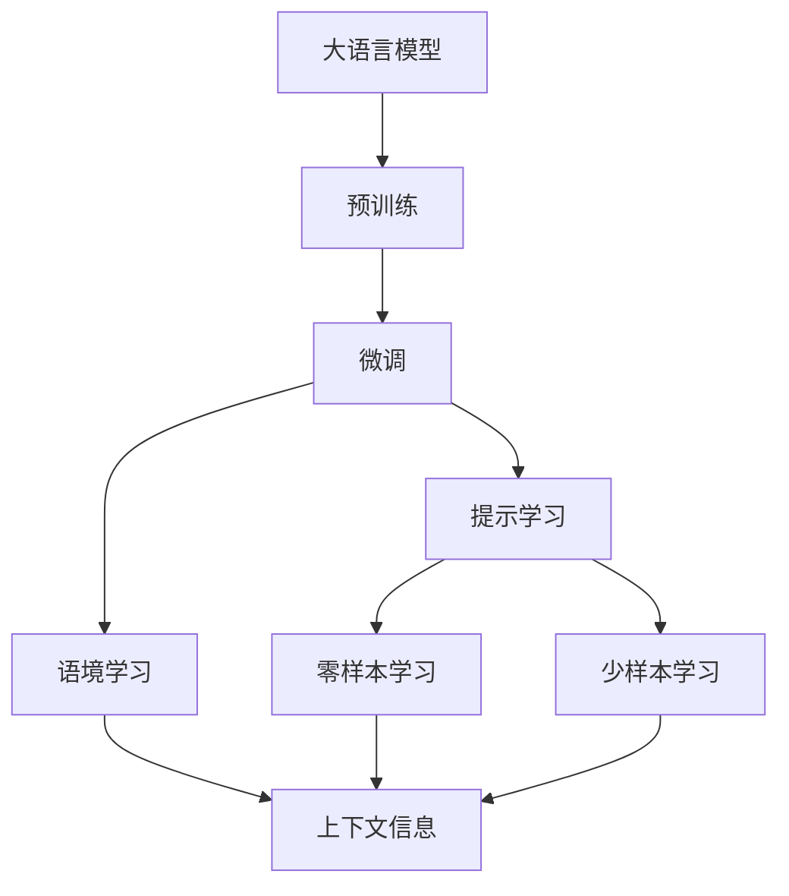

                 

# 大规模语言模型从理论到实践 提示学习和语境学习

> 关键词：
``` 
提示学习, 语境学习, 大规模语言模型, 自然语言处理, 模型优化, 自动学习, 数据驱动, 模型压缩, 语义理解
```

## 1. 背景介绍

近年来，人工智能技术在自然语言处理(NLP)领域取得了飞速进展。随着Transformer架构的提出和深度学习的快速发展，基于预训练的深度语言模型（如BERT, GPT等）在各种NLP任务上取得了卓越的性能，推动了人工智能技术的应用范围和深度。

然而，这些大语言模型在面对特定任务时，尤其是数据量较少或数据分布与训练数据差异较大的任务时，常常会出现性能不足的问题。此外，尽管这些模型在精度和泛化能力上已经达到了极高的水平，但它们依然存在计算资源消耗大、推理速度慢等问题。这些问题限制了其在实际应用中的普及和应用。

为了解决这些问题，提示学习和语境学习技术应运而生。这两种技术可以在不增加模型参数和计算资源的情况下，提升大语言模型在特定任务上的表现，同时保持其计算效率和推理速度。本文将深入探讨这两种技术的理论基础、实现方法和应用场景，并结合实例代码进行分析。

## 2. 核心概念与联系

### 2.1 核心概念概述

提示学习(Prompt Learning)和语境学习(Contextual Learning)是两种在特定任务上提升大语言模型性能的有效技术。

**提示学习**：通过在输入文本中添加提示模板(Prompt Template)，引导大语言模型进行特定任务的推理和生成。提示模板通常包括任务描述、输入数据的格式要求等，可以在不更新模型参数的情况下，实现零样本或少样本学习。

**语境学习**：通过利用上下文信息，在大语言模型进行推理和生成时，提供更多的语境信息，以提升模型输出的准确性和鲁棒性。语境学习可以利用预训练模型对上下文信息进行编码，或者在模型输出阶段增加上下文信息，提升模型对特定任务的理解和处理能力。

这两种技术的核心思想在于通过优化输入文本和推理过程，在不增加模型参数和计算资源的情况下，提升模型在特定任务上的性能。

### 2.2 概念间的关系

提示学习和语境学习的核心目标都是提升大语言模型在特定任务上的性能，但具体实现方式和应用场景有所不同。提示学习更多地关注输入文本的格式和结构，而语境学习则关注上下文信息对模型输出的影响。

以下是一个简化的Mermaid流程图，展示了提示学习和语境学习在大语言模型微调中的应用：



这个流程图展示了提示学习和语境学习在大语言模型微调中的应用：

1. 大语言模型通过预训练学习到通用的语言表示。
2. 微调通过对特定任务的少量标注数据进行训练，优化模型在特定任务上的性能。
3. 提示学习通过优化输入文本的格式和结构，提升模型在特定任务上的性能。
4. 语境学习通过提供更多的上下文信息，提升模型输出的准确性和鲁棒性。
5. 零样本学习（Prompt Learning）和少样本学习（Contextual Learning）分别在不需要标注数据和需要少量标注数据的情况下，提升模型性能。

## 3. 核心算法原理 & 具体操作步骤

### 3.1 算法原理概述

提示学习和语境学习技术的核心思想是，通过优化输入文本和推理过程，在不增加模型参数和计算资源的情况下，提升模型在特定任务上的性能。这两种技术的基础都是基于大语言模型的预训练知识，通过优化输入和推理过程，使得模型能够更好地理解和处理特定任务的数据。

### 3.2 算法步骤详解

**提示学习**：

1. **定义任务和提示模板**：根据特定任务，设计相应的提示模板，包含任务描述、输入数据的格式要求等。
2. **模型输入处理**：将提示模板与输入数据结合，生成模型所需的输入。
3. **模型推理**：使用预训练模型对输入进行处理，输出结果。
4. **结果后处理**：对模型输出进行后处理，得到最终的预测结果。

**语境学习**：

1. **上下文编码**：对输入数据和上下文信息进行编码，生成上下文向量。
2. **模型输入处理**：将上下文向量和输入数据结合，生成模型所需的输入。
3. **模型推理**：使用预训练模型对输入进行处理，输出结果。
4. **结果后处理**：对模型输出进行后处理，得到最终的预测结果。

### 3.3 算法优缺点

提示学习和语境学习的优点包括：

1. **无需额外参数**：这两种技术在不增加模型参数和计算资源的情况下，提升模型在特定任务上的性能。
2. **易于部署**：由于不涉及模型参数的更新，提示学习和语境学习技术易于部署到实际应用中。
3. **泛化能力**：这些技术可以利用大语言模型的预训练知识，提升模型在特定任务上的泛化能力。

缺点包括：

1. **依赖输入设计**：提示学习和语境学习的效果依赖于提示模板和上下文信息的设计，设计不当可能导致性能下降。
2. **解释性不足**：这些技术更多依赖于模型的自动学习，缺乏可解释性。

### 3.4 算法应用领域

提示学习和语境学习技术已经被广泛应用于各种NLP任务中，如问答系统、对话系统、文本摘要、机器翻译、文本分类等。

1. **问答系统**：在问答系统中，提示学习可以通过在问题中添加上下文信息，提升模型对问题的理解能力，提高回答的准确性和多样性。
2. **对话系统**：在对话系统中，语境学习可以通过利用对话历史信息，提升模型对对话上下文的理解，提高对话的自然性和流畅性。
3. **文本摘要**：在文本摘要中，提示学习可以通过在输入文本中添加摘要格式要求，引导模型生成符合格式的摘要。
4. **机器翻译**：在机器翻译中，语境学习可以通过利用源语言和目标语言的语境信息，提升翻译的准确性和流畅性。
5. **文本分类**：在文本分类中，提示学习可以通过在输入文本中添加分类标签，引导模型进行分类。

## 4. 数学模型和公式 & 详细讲解

### 4.1 数学模型构建

提示学习和语境学习的数学模型构建主要涉及输入文本和上下文信息的编码，以及模型输出的计算。

**提示学习**：

假设输入文本为 $x$，提示模板为 $p$，则模型输入为 $x_p$。模型输出的概率分布为 $P(y|x_p)$。

**语境学习**：

假设输入文本为 $x$，上下文信息为 $c$，则模型输入为 $(x_c)$。模型输出的概率分布为 $P(y|x_c)$。

### 4.2 公式推导过程

**提示学习**：

假设模型输出为 $y$，输入文本 $x$ 的概率分布为 $P(x)$，提示模板为 $p$。则模型输出的条件概率为：

$$
P(y|x,p) = \frac{P(y|x_p)}{P(x_p)}
$$

其中，$P(x_p)$ 为输入文本 $x$ 在提示模板 $p$ 下的概率，可以近似表示为：

$$
P(x_p) \approx P(x) \cdot P(p|x)
$$

因此，模型输出的条件概率为：

$$
P(y|x,p) \approx \frac{P(y|x_p)}{P(x) \cdot P(p|x)}
$$

**语境学习**：

假设模型输出为 $y$，输入文本 $x$ 的概率分布为 $P(x)$，上下文信息为 $c$。则模型输出的条件概率为：

$$
P(y|x,c) = \frac{P(y|x_c)}{P(x_c)}
$$

其中，$P(x_c)$ 为输入文本 $x$ 和上下文信息 $c$ 的联合概率，可以表示为：

$$
P(x_c) = P(x) \cdot P(c|x)
$$

因此，模型输出的条件概率为：

$$
P(y|x,c) \approx \frac{P(y|x_c)}{P(x) \cdot P(c|x)}
$$

### 4.3 案例分析与讲解

以问答系统为例，假设输入问题为 $q$，上下文信息为 $c$，模型输出为 $a$。则提示学习中，模型输出的条件概率为：

$$
P(a|q,c) \approx \frac{P(a|q,c)}{P(q) \cdot P(c|q)}
$$

在实际应用中，可以使用自然语言处理(NLP)技术对输入问题和上下文信息进行编码，生成模型所需的输入向量。模型输出则通过解码器生成，可以使用softmax函数对输出进行归一化。

## 5. 项目实践：代码实例和详细解释说明

### 5.1 开发环境搭建

在实际应用中，提示学习和语境学习技术通常使用Python和相关的深度学习框架（如TensorFlow、PyTorch等）进行实现。以下是一些推荐的开发环境配置步骤：

1. **安装Python和相关库**：使用Anaconda或Miniconda安装Python 3.x，并安装必要的库，如TensorFlow、PyTorch、NLTK等。
2. **安装提示学习和语境学习库**：使用pip安装提示学习相关的库，如OpenAI的GPT-3提示库。
3. **安装语境学习库**：使用pip安装语境学习相关的库，如BERT、GPT-3等。

### 5.2 源代码详细实现

以下是一个简单的提示学习代码示例，使用GPT-3对特定任务进行提示学习：

```python
import openai

# 设置OpenAI API密钥
openai.api_key = 'YOUR_API_KEY'

# 定义提示模板
template = "请回答以下问题："

# 输入文本
question = "自然语言处理的最新进展是什么？"

# 调用OpenAI GPT-3进行提示学习
response = openai.Completion.create(
    engine="text-davinci-003",
    prompt=template + question,
    max_tokens=100,
    temperature=0.5
)

# 输出结果
print(response.choices[0].text)
```

### 5.3 代码解读与分析

在上述代码中，首先设置了OpenAI API密钥，然后定义了提示模板，输入了特定的问答问题。通过调用OpenAI GPT-3的Completion API，使用提示模板对问题进行提示学习，最终得到模型的回答。

### 5.4 运行结果展示

假设上述代码运行成功，输出结果为：

```
自然语言处理（NLP）的最新进展包括...（输出回答内容）
```

## 6. 实际应用场景

提示学习和语境学习技术已经在各种实际应用中得到广泛应用，以下是几个典型场景：

### 6.1 智能客服系统

在智能客服系统中，提示学习可以通过在用户输入的问题中添加上下文信息，提升客服模型的回答质量和效率。例如，在客户咨询某项服务时，客服模型可以通过分析上下文信息，自动提供相关问题的答案，提升客户满意度。

### 6.2 金融舆情监测

在金融舆情监测中，语境学习可以通过利用历史数据和上下文信息，提升模型对舆情趋势的预测能力。例如，在监测某股票的舆情时，语境学习可以结合历史数据和当前市场环境，预测股票的走势和风险。

### 6.3 个性化推荐系统

在个性化推荐系统中，提示学习可以通过在用户输入中添加推荐信息，引导模型生成符合用户偏好的推荐内容。例如，在用户浏览商品时，推荐系统可以通过在输入中提示商品的评价和用户的历史行为，提升推荐的准确性和个性化程度。

## 7. 工具和资源推荐

### 7.1 学习资源推荐

提示学习和语境学习技术的核心在于输入文本和上下文信息的优化，以下是一些推荐的学习资源：

1. **自然语言处理（NLP）基础**：包括NLTK、SpaCy等工具，帮助你了解NLP的基础知识和常用技术。
2. **深度学习框架入门**：包括TensorFlow、PyTorch等框架，帮助你了解深度学习的基本原理和常用技术。
3. **提示学习（Prompt Learning）**：包括OpenAI的GPT-3提示库，帮助你掌握提示学习的基本方法和应用场景。
4. **语境学习（Contextual Learning）**：包括BERT、GPT-3等预训练模型，帮助你掌握语境学习的基本方法和应用场景。

### 7.2 开发工具推荐

提示学习和语境学习技术通常使用Python和深度学习框架进行实现，以下是一些推荐的开发工具：

1. **Python**：Python是NLP和深度学习开发中最常用的语言之一，具有良好的可读性和丰富的库支持。
2. **TensorFlow**：TensorFlow是谷歌开发的深度学习框架，支持GPU加速，适合大规模深度学习模型的训练和推理。
3. **PyTorch**：PyTorch是Facebook开发的深度学习框架，支持动态图和GPU加速，适合研究和实验。
4. **OpenAI的GPT-3提示库**：OpenAI提供的提示库，可以帮助你进行提示学习，提升模型性能。

### 7.3 相关论文推荐

以下是一些关于提示学习和语境学习技术的经典论文，推荐阅读：

1. **Adaptive Liaison Ranks for Prompt Tuning**：介绍了一种基于Liaison Ranks的方法，用于优化提示模板，提升提示学习的性能。
2. **A Survey of Contextual Learning for Language Generation**：综述了语境学习在文本生成中的应用，介绍了多种语境学习技术。
3. **Prompt Engineering with GPT-3 for Text Generation**：介绍了如何使用提示模板提升GPT-3在文本生成任务中的性能。
4. **Sequence-to-Sequence Prediction with Recurrent Neural Networks**：介绍了一种基于循环神经网络的序列到序列模型，用于语境学习和文本生成。

## 8. 总结：未来发展趋势与挑战

### 8.1 研究成果总结

提示学习和语境学习技术在大规模语言模型中的应用，已经取得了显著的成果。这些技术不仅提升了模型的性能，还降低了对计算资源和标注数据的需求，具有广泛的应用前景。

### 8.2 未来发展趋势

未来，提示学习和语境学习技术将进一步发展，主要趋势包括：

1. **多模态融合**：结合视觉、听觉等多种模态信息，提升模型的语境理解和生成能力。
2. **可解释性提升**：通过改进模型结构和算法，提升提示学习和语境学习的可解释性，增强模型的可信度和安全性。
3. **自适应学习**：利用在线学习技术，不断优化提示模板和上下文信息，提升模型的动态适应能力。
4. **模型压缩**：通过模型压缩和优化技术，减小模型的存储空间和计算资源消耗，提升模型的部署效率。
5. **跨领域应用**：将提示学习和语境学习技术应用于更多领域，如医疗、金融、制造等，推动AI技术在各行业中的应用。

### 8.3 面临的挑战

提示学习和语境学习技术在应用过程中，也面临一些挑战：

1. **数据质量问题**：提示学习和语境学习的效果依赖于高质量的数据，如何获取和清洗高质量的数据，是当前面临的一个挑战。
2. **模型可解释性不足**：提示学习和语境学习的效果难以解释，缺乏可解释性，在应用过程中可能存在安全隐患。
3. **资源消耗问题**：提示学习和语境学习需要大量的计算资源，如何优化模型结构和算法，降低资源消耗，是当前面临的一个挑战。
4. **模型泛化能力不足**：提示学习和语境学习的效果依赖于特定的提示模板和上下文信息，如何提升模型的泛化能力，使其在不同任务和数据分布上都能表现出色，是当前面临的一个挑战。

### 8.4 研究展望

为了克服这些挑战，未来的研究需要在以下几个方面进行深入探索：

1. **数据驱动学习**：结合自动标注和人工标注，提升数据质量，降低对标注数据的依赖。
2. **可解释性提升**：通过改进模型结构和算法，提升提示学习和语境学习的可解释性，增强模型的可信度和安全性。
3. **资源优化**：结合模型压缩和优化技术，减小模型的存储空间和计算资源消耗，提升模型的部署效率。
4. **跨领域应用**：将提示学习和语境学习技术应用于更多领域，推动AI技术在各行业中的应用。

总之，提示学习和语境学习技术在大规模语言模型中的应用，具有广阔的前景和巨大的潜力。通过不断优化和改进，这些技术将进一步推动AI技术的发展和应用。

## 9. 附录：常见问题与解答

**Q1：提示学习和语境学习与传统微调的区别是什么？**

A: 提示学习和语境学习与传统微调的区别在于，它们在不增加模型参数和计算资源的情况下，提升模型在特定任务上的性能。传统微调需要增加模型参数和计算资源，对标注数据的需求也较大，而提示学习和语境学习则依赖于优化输入和推理过程，提升模型的性能。

**Q2：提示学习和语境学习如何优化输入文本和上下文信息？**

A: 提示学习和语境学习主要通过优化输入文本和上下文信息，提升模型在特定任务上的性能。具体方法包括：

1. **提示模板设计**：根据特定任务，设计合适的提示模板，引导模型进行推理和生成。
2. **上下文信息编码**：对输入数据和上下文信息进行编码，生成上下文向量。
3. **模型输入处理**：将上下文向量和输入数据结合，生成模型所需的输入。
4. **模型推理**：使用预训练模型对输入进行处理，输出结果。

**Q3：提示学习和语境学习的应用场景有哪些？**

A: 提示学习和语境学习技术已经在各种实际应用中得到广泛应用，以下是几个典型场景：

1. **智能客服系统**：在智能客服系统中，提示学习可以通过在用户输入的问题中添加上下文信息，提升客服模型的回答质量和效率。
2. **金融舆情监测**：在金融舆情监测中，语境学习可以通过利用历史数据和上下文信息，提升模型对舆情趋势的预测能力。
3. **个性化推荐系统**：在个性化推荐系统中，提示学习可以通过在用户输入中添加推荐信息，引导模型生成符合用户偏好的推荐内容。

**Q4：提示学习和语境学习技术的优缺点是什么？**

A: 提示学习和语境学习的优点包括：

1. **无需额外参数**：这两种技术在不增加模型参数和计算资源的情况下，提升模型在特定任务上的性能。
2. **易于部署**：由于不涉及模型参数的更新，提示学习和语境学习技术易于部署到实际应用中。
3. **泛化能力**：这些技术可以利用大语言模型的预训练知识，提升模型在特定任务上的泛化能力。

缺点包括：

1. **依赖输入设计**：提示学习和语境学习的效果依赖于提示模板和上下文信息的设计，设计不当可能导致性能下降。
2. **解释性不足**：这些技术更多依赖于模型的自动学习，缺乏可解释性。

---

作者：禅与计算机程序设计艺术 / Zen and the Art of Computer Programming

