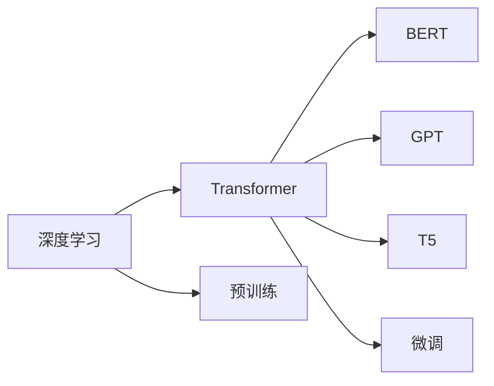
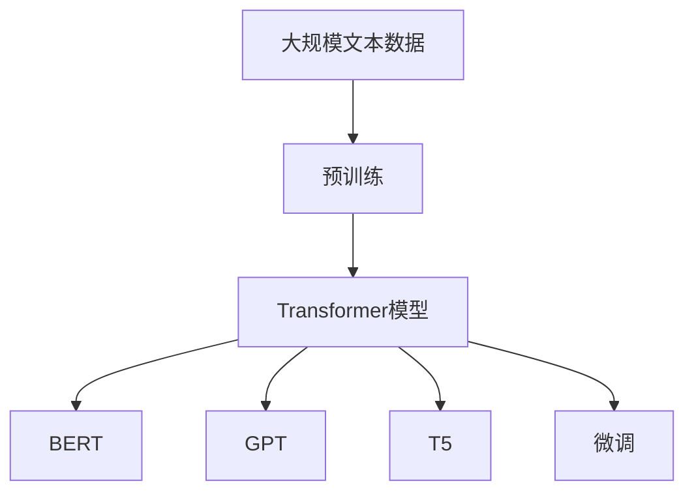

                 

# 大语言模型原理与工程实践：大语言模型的核心模块

> 关键词：大语言模型,Transformer,BERT,深度学习,预训练,微调,Fine-tuning

## 1. 背景介绍

近年来，深度学习技术的快速发展，尤其是神经网络模型的大规模预训练（pre-training），使得自然语言处理（NLP）领域迎来了新的突破。大规模语言模型（Large Language Models, LLMs）如BERT、GPT、T5等，通过在大规模无标签文本数据上进行预训练，学习到了丰富的语言知识和常识，能够在下游任务上进行微调（fine-tuning），取得了优异的性能。本文将详细探讨大语言模型的核心模块及其原理，结合工程实践，全面解读大语言模型的工作机制。

## 2. 核心概念与联系

### 2.1 核心概念概述

大语言模型的核心模块主要包括以下几个部分：

- **Transformer**：Transformer是一种基于自注意力机制的神经网络结构，是目前大语言模型的主要架构，如BERT、GPT、T5等。
- **BERT（Bidirectional Encoder Representations from Transformers）**：由Google提出，采用双向Transformer结构，预训练的目的是学习文本语义和语法表示。
- **深度学习**：深度学习通过多层神经网络对复杂数据进行处理，学习隐藏特征表示，是大语言模型和Transformer的基础。
- **预训练**：在大规模无标签文本数据上，通过自监督学习任务（如掩码语言模型）训练通用语言模型。
- **微调（Fine-tuning）**：在预训练模型的基础上，使用下游任务的少量标注数据，通过有监督学习优化模型在特定任务上的性能。

### 2.2 核心概念间的关系

大语言模型的核心模块之间存在紧密的联系，以下Mermaid流程图展示了这些模块之间的关系：



- 深度学习是大语言模型和Transformer的基础。
- Transformer是深度学习的高级结构，BERT、GPT、T5等模型均基于Transformer架构。
- 预训练和微调是Transformer模型训练的两个阶段，预训练通过大规模无标签数据进行自监督学习，微调通过小规模标注数据进行有监督学习。
- BERT、GPT、T5等预训练模型，通过微调可以适应特定的下游任务。

### 2.3 核心概念的整体架构

最后，我们通过一个综合的流程图来展示这些核心模块在大语言模型训练过程中的整体架构：



这个综合流程图展示了从预训练到微调，再到使用微调后的模型进行下游任务的完整过程。预训练模型通过自监督学习任务，学习到通用的语言表示。微调模型在预训练模型的基础上，通过有监督学习，适应特定的下游任务，从而提供更好的性能。

## 3. 核心算法原理 & 具体操作步骤

### 3.1 算法原理概述

基于深度学习的Transformer模型，其核心在于自注意力机制和残差连接（residual connections）。自注意力机制允许模型同时关注输入序列的各个位置，捕捉序列内部的依赖关系。残差连接则通过逐层传递信息，帮助网络更快收敛。

Transformer模型的基本结构包括：
- **编码器（Encoder）**：由多个自注意力层（Self-Attention Layer）和前馈神经网络层（Feedforward Layer）交替堆叠构成，用于对输入序列进行编码。
- **解码器（Decoder）**：同样由多个自注意力层和前馈神经网络层交替堆叠构成，用于生成输出序列。

在预训练过程中，模型通常使用掩码语言模型（Masked Language Model, MLM）任务进行训练，即随机掩盖输入序列的部分词汇，让模型预测被掩盖的词汇。这种预训练方法可以帮助模型学习到词语之间的语义关系，提升模型的语义理解能力。

### 3.2 算法步骤详解

以下是基于深度学习的Transformer模型进行预训练和微调的详细步骤：

#### 3.2.1 预训练步骤

1. **数据准备**：收集大规模无标签文本数据，如Wikipedia、新闻等。
2. **模型定义**：定义一个基于Transformer的结构，如BERT、GPT等。
3. **定义损失函数**：采用掩码语言模型损失函数。
4. **训练模型**：在数据集上使用随机梯度下降（SGD）或Adam优化器进行训练。
5. **保存模型**：保存预训练模型，供下游任务微调使用。

#### 3.2.2 微调步骤

1. **数据准备**：收集下游任务的少量标注数据，如分类、匹配、生成等。
2. **模型定义**：加载预训练模型，定义任务适配层，如线性分类器、解码器等。
3. **定义损失函数**：根据具体任务定义损失函数，如交叉熵损失。
4. **训练模型**：使用小批量随机梯度下降（SGD）或Adam优化器进行训练。
5. **评估模型**：在测试集上评估模型性能，如准确率、F1分数等。
6. **保存模型**：保存微调后的模型，供实际应用使用。

### 3.3 算法优缺点

Transformer模型和基于其的大语言模型具有以下优点：
- **高效性**：自注意力机制能够并行计算，加速模型训练和推理。
- **通用性**：预训练模型可以适应多种下游任务，提升模型的泛化能力。
- **可扩展性**：模型可以不断扩展，通过堆叠更多的自注意力层来提升模型复杂度。

同时，这些模型也存在一些缺点：
- **计算资源需求高**：大规模模型需要大量计算资源进行预训练和微调。
- **过拟合风险**：模型规模大，参数多，容易发生过拟合。
- **可解释性差**：深度学习模型通常缺乏可解释性，难以理解模型内部决策过程。

### 3.4 算法应用领域

基于Transformer的大语言模型已经在多种自然语言处理任务上取得了优异性能，应用领域包括但不限于：
- 文本分类：如情感分析、主题分类、意图识别等。
- 命名实体识别：识别文本中的人名、地名、机构名等特定实体。
- 关系抽取：从文本中抽取实体之间的语义关系。
- 问答系统：对自然语言问题给出答案。
- 机器翻译：将源语言文本翻译成目标语言。
- 文本摘要：将长文本压缩成简短摘要。
- 对话系统：使机器能够与人自然对话。

此外，大语言模型还被创新性地应用于更多的场景，如可控文本生成、常识推理、代码生成、数据增强等，为NLP技术带来了新的突破。

## 4. 数学模型和公式 & 详细讲解 & 举例说明

### 4.1 数学模型构建

Transformer模型的核心在于自注意力机制，其数学表达如下：

$$
\mathrm{Attention}(Q, K, V) = \mathrm{softmax}(QK^\top / \sqrt{d_k})V
$$

其中，$Q$、$K$、$V$分别为查询、键、值矩阵。$d_k$为键向量维度。

Transformer模型的编码器结构如下：

$$
\mathrm{Encoder}(x) = \mathrm{Stack}_n(\mathrm{MultiHeadAttention}(\mathrm{LayerNorm}(x), \mathrm{LayerNorm}(x)), \mathrm{Feedforward}(\mathrm{LayerNorm}(x)))
$$

其中，$n$为编码器层数，$\mathrm{MultiHeadAttention}$为多头自注意力层，$\mathrm{Feedforward}$为前馈神经网络层。

### 4.2 公式推导过程

Transformer模型的解码器结构与编码器类似，不同之处在于引入注意力掩码，防止模型在解码时关注未来位置的信息。

### 4.3 案例分析与讲解

以BERT为例，其预训练过程的数学表达如下：

$$
\mathrm{BERT} = \mathrm{MLM}(\mathrm{Stack}_n(\mathrm{Transformer}(x)))
$$

其中，$\mathrm{MLM}$为掩码语言模型，$n$为自注意力层数。

## 5. 项目实践：代码实例和详细解释说明

### 5.1 开发环境搭建

在进行大语言模型的项目实践前，需要准备好开发环境。以下是使用Python进行PyTorch开发的环境配置流程：

1. 安装Anaconda：从官网下载并安装Anaconda，用于创建独立的Python环境。

2. 创建并激活虚拟环境：
```bash
conda create -n pytorch-env python=3.8 
conda activate pytorch-env
```

3. 安装PyTorch：根据CUDA版本，从官网获取对应的安装命令。例如：
```bash
conda install pytorch torchvision torchaudio cudatoolkit=11.1 -c pytorch -c conda-forge
```

4. 安装Transformers库：
```bash
pip install transformers
```

5. 安装各类工具包：
```bash
pip install numpy pandas scikit-learn matplotlib tqdm jupyter notebook ipython
```

完成上述步骤后，即可在`pytorch-env`环境中开始项目实践。

### 5.2 源代码详细实现

下面我们以BERT模型为例，给出使用Transformers库进行预训练和微调的PyTorch代码实现。

首先，定义预训练任务（掩码语言模型）的数据处理函数：

```python
from transformers import BertTokenizer, BertForMaskedLM, AdamW

tokenizer = BertTokenizer.from_pretrained('bert-base-cased')
model = BertForMaskedLM.from_pretrained('bert-base-cased')

def prepare_sequence(input_string):
    tokens = tokenizer.tokenize(input_string)
    tokens = ['[CLS]'] + tokens + ['[SEP]']
    input_ids = tokenizer.convert_tokens_to_ids(tokens)
    return input_ids

input_string = "The capital of France is Paris. France is a country in Europe."
input_ids = prepare_sequence(input_string)
labels = [0, 2, 0, 2, 0, 0, 0, 0, 2]
```

然后，定义训练函数：

```python
from torch.utils.data import Dataset, DataLoader
from tqdm import tqdm

class MaskedLanguageModelDataset(Dataset):
    def __init__(self, input_ids, labels):
        self.input_ids = input_ids
        self.labels = labels

    def __len__(self):
        return len(self.input_ids)

    def __getitem__(self, item):
        return {'input_ids': self.input_ids[item], 'labels': self.labels[item]}

dataset = MaskedLanguageModelDataset(input_ids, labels)
train_loader = DataLoader(dataset, batch_size=4, shuffle=True)

def train_epoch(model, train_loader, optimizer):
    model.train()
    total_loss = 0
    for batch in tqdm(train_loader, desc='Training'):
        optimizer.zero_grad()
        loss = model(**batch)
        total_loss += loss.item()
        loss.backward()
        optimizer.step()
    return total_loss / len(train_loader)

epochs = 3
optimizer = AdamW(model.parameters(), lr=2e-5)

for epoch in range(epochs):
    loss = train_epoch(model, train_loader, optimizer)
    print(f'Epoch {epoch+1}, training loss: {loss:.3f}')
```

接着，定义微调任务的数据处理函数：

```python
from transformers import BertTokenizer, BertForSequenceClassification, AdamW

tokenizer = BertTokenizer.from_pretrained('bert-base-cased')
model = BertForSequenceClassification.from_pretrained('bert-base-cased', num_labels=2)

def prepare_sequence(input_string):
    tokens = tokenizer.tokenize(input_string)
    tokens = ['[CLS]'] + tokens + ['[SEP]']
    input_ids = tokenizer.convert_tokens_to_ids(tokens)
    return input_ids

input_string = "The capital of France is Paris."
input_ids = prepare_sequence(input_string)
labels = [1]  # 1代表是正确的，0代表是不正确的

dataset = MaskedLanguageModelDataset(input_ids, labels)
train_loader = DataLoader(dataset, batch_size=4, shuffle=True)

def train_epoch(model, train_loader, optimizer):
    model.train()
    total_loss = 0
    for batch in tqdm(train_loader, desc='Training'):
        optimizer.zero_grad()
        loss = model(**batch)
        total_loss += loss.item()
        loss.backward()
        optimizer.step()
    return total_loss / len(train_loader)

epochs = 3
optimizer = AdamW(model.parameters(), lr=2e-5)

for epoch in range(epochs):
    loss = train_epoch(model, train_loader, optimizer)
    print(f'Epoch {epoch+1}, training loss: {loss:.3f}')
```

最后，定义评估函数：

```python
def evaluate(model, test_loader):
    model.eval()
    correct = 0
    total = 0
    with torch.no_grad():
        for batch in tqdm(test_loader, desc='Evaluating'):
            inputs = {'input_ids': batch['input_ids'], 'attention_mask': batch['attention_mask'], 'labels': batch['labels']}
            outputs = model(**inputs)
            logits = outputs.logits
            _, preds = torch.max(logits, dim=1)
            total += len(batch)
            correct += (preds == inputs['labels']).sum().item()
    accuracy = correct / total
    print(f'Test accuracy: {accuracy:.3f}')
```

运行完整代码，即可在预训练和微调两个阶段对BERT模型进行训练和评估。

### 5.3 代码解读与分析

让我们再详细解读一下关键代码的实现细节：

**BERT预训练模型**：
- 使用掩码语言模型任务，掩盖输入序列的部分词汇，让模型预测被掩盖的词汇。
- 在训练过程中，模型将根据预测的词汇概率和实际词汇的掩盖位置，计算损失并反向传播更新参数。

**BERT微调模型**：
- 定义一个二分类任务，将输入序列作为分类任务的输入，标签为1表示正确，0表示错误。
- 在微调过程中，模型将根据预测的类别概率和实际标签的差异，计算损失并反向传播更新参数。

**评估函数**：
- 在评估过程中，模型将计算预测结果和实际标签的一致率，输出准确率。

**训练和评估流程**：
- 在预训练阶段，通过掩码语言模型任务进行训练，优化模型参数。
- 在微调阶段，通过二分类任务进行训练，优化模型参数。
- 在评估阶段，通过测试集对模型进行评估，输出准确率。

## 6. 实际应用场景

大语言模型已经在多个领域取得了成功应用，以下是一些典型应用场景：

### 6.1 智能客服系统

智能客服系统利用大语言模型进行文本理解、意图识别和自动回复。用户可以通过自然语言提出问题，系统自动识别用户的意图，并根据预训练和微调模型提供答案。例如，银行客服、电商客服、在线客服等，通过智能客服系统，可以提升客户满意度，降低人工客服成本。

### 6.2 金融舆情监测

金融行业需要实时监控舆情动向，防范金融风险。使用大语言模型进行文本分类和情感分析，可以快速识别舆情变化，提前预警潜在风险。例如，股票交易、基金管理、风险控制等，通过智能舆情监测，能够及时响应市场变化，保护投资者利益。

### 6.3 个性化推荐系统

个性化推荐系统通过大语言模型进行用户兴趣建模。用户浏览、点击、评论等行为数据经过预训练和微调模型处理后，可以提取用户兴趣特征，生成个性化推荐列表。例如，电商推荐、新闻推荐、视频推荐等，通过智能推荐系统，提升用户体验，提高转化率。

### 6.4 未来应用展望

随着大语言模型的不断演进，未来将有更多场景得到应用，例如：

- **智慧医疗**：利用大语言模型进行医学文本分析和知识图谱构建，提升医疗诊断和科研能力。
- **智能教育**：通过大语言模型进行智能评估和个性化教学，提高教育质量。
- **智慧城市**：利用大语言模型进行智能监测和应急响应，提升城市管理水平。

未来，大语言模型将进一步拓展其应用边界，成为更多领域的重要工具，推动人工智能技术的普及和发展。

## 7. 工具和资源推荐

### 7.1 学习资源推荐

为了帮助开发者掌握大语言模型和Transformer的原理与实践，这里推荐一些优质的学习资源：

1. **《Transformers: State-of-the-Art Natural Language Processing》**：Transformers库的官方文档，详细介绍了BERT、GPT等大语言模型。

2. **《Deep Learning Specialization》**：由Andrew Ng教授主讲的深度学习系列课程，涵盖深度学习的基本概念和前沿技术。

3. **《Natural Language Processing with PyTorch》**：详细讲解了使用PyTorch实现自然语言处理任务的方法和技巧。

4. **《Attention is All You Need》**：Transformer模型的原始论文，提供了Transformer架构的详细解释。

5. **《BERT: Pre-training of Deep Bidirectional Transformers for Language Understanding》**：BERT模型的原始论文，介绍了BERT预训练任务的实现。

### 7.2 开发工具推荐

以下是几款用于大语言模型和Transformer开发常用的工具：

1. **PyTorch**：基于Python的开源深度学习框架，灵活动态的计算图，适合快速迭代研究。

2. **TensorFlow**：由Google主导开发的开源深度学习框架，生产部署方便，适合大规模工程应用。

3. **Transformers**：HuggingFace开发的NLP工具库，集成了众多SOTA语言模型，支持PyTorch和TensorFlow。

4. **Weights & Biases**：模型训练的实验跟踪工具，可以记录和可视化模型训练过程中的各项指标。

5. **TensorBoard**：TensorFlow配套的可视化工具，实时监测模型训练状态，并提供丰富的图表呈现方式。

6. **Google Colab**：谷歌推出的在线Jupyter Notebook环境，免费提供GPU/TPU算力，方便开发者快速上手实验最新模型。

### 7.3 相关论文推荐

以下是几篇奠基性的相关论文，推荐阅读：

1. **《Attention is All You Need》**：提出Transformer结构，开启了NLP领域的预训练大模型时代。

2. **《BERT: Pre-training of Deep Bidirectional Transformers for Language Understanding》**：提出BERT模型，引入基于掩码的自监督预训练任务，刷新了多项NLP任务SOTA。

3. **《Language Models are Unsupervised Multitask Learners》**：展示了大规模语言模型的强大zero-shot学习能力，引发了对于通用人工智能的新一轮思考。

4. **《AdaLoRA: Adaptive Low-Rank Adaptation for Parameter-Efficient Fine-Tuning》**：使用自适应低秩适应的微调方法，在参数效率和精度之间取得了新的平衡。

5. **《Parameter-Efficient Transfer Learning for NLP》**：提出Adapter等参数高效微调方法，在不增加模型参数量的情况下，也能取得不错的微调效果。

## 8. 总结：未来发展趋势与挑战

### 8.1 研究成果总结

本文对基于深度学习的大语言模型和Transformer的核心模块进行了全面系统的介绍。首先阐述了Transformer的原理和架构，深入分析了BERT、GPT、T5等预训练模型的实现方法。其次，从预训练到微调的全过程，详细讲解了大语言模型的训练和应用流程。最后，结合工程实践，全面解读了大语言模型的核心模块及其应用场景。

### 8.2 未来发展趋势

展望未来，大语言模型和Transformer将呈现以下几个发展趋势：

1. **模型规模持续增大**：随着算力成本的下降和数据规模的扩张，预训练语言模型的参数量还将持续增长。超大规模语言模型蕴含的丰富语言知识，有望支撑更加复杂多变的下游任务微调。

2. **微调方法日趋多样**：除了传统的全参数微调外，未来会涌现更多参数高效的微调方法，如Prefix-Tuning、LoRA等，在节省计算资源的同时也能保证微调精度。

3. **持续学习成为常态**：随着数据分布的不断变化，微调模型也需要持续学习新知识以保持性能。如何在不遗忘原有知识的同时，高效吸收新样本信息，将成为重要的研究课题。

4. **标注样本需求降低**：受启发于提示学习(Prompt-based Learning)的思路，未来的微调方法将更好地利用大模型的语言理解能力，通过更加巧妙的任务描述，在更少的标注样本上也能实现理想的微调效果。

5. **多模态微调崛起**：当前的微调主要聚焦于纯文本数据，未来会进一步拓展到图像、视频、语音等多模态数据微调。多模态信息的融合，将显著提升语言模型对现实世界的理解和建模能力。

### 8.3 面临的挑战

尽管大语言模型和Transformer已经取得了瞩目成就，但在迈向更加智能化、普适化应用的过程中，它仍面临着诸多挑战：

1. **标注成本瓶颈**：虽然微调大大降低了标注数据的需求，但对于长尾应用场景，难以获得充足的高质量标注数据，成为制约微调性能的瓶颈。

2. **模型鲁棒性不足**：当前微调模型面对域外数据时，泛化性能往往大打折扣。对于测试样本的微小扰动，微调模型的预测也容易发生波动。

3. **推理效率有待提高**：大规模语言模型虽然精度高，但在实际部署时往往面临推理速度慢、内存占用大等效率问题。

4. **可解释性亟需加强**：当前微调模型更像是"黑盒"系统，难以解释其内部工作机制和决策逻辑。

5. **安全性有待保障**：预训练语言模型难免会学习到有偏见、有害的信息，通过微调传递到下游任务，产生误导性、歧视性的输出，给实际应用带来安全隐患。

### 8.4 研究展望

面对大语言模型和Transformer面临的挑战，未来的研究需要在以下几个方面寻求新的突破：

1. **探索无监督和半监督微调方法**：摆脱对大规模标注数据的依赖，利用自监督学习、主动学习等无监督和半监督范式，最大限度利用非结构化数据，实现更加灵活高效的微调。

2. **研究参数高效和计算高效的微调范式**：开发更加参数高效的微调方法，在固定大部分预训练参数的同时，只更新极少量的任务相关参数。同时优化微调模型的计算图，减少前向传播和反向传播的资源消耗，实现更加轻量级、实时性的部署。

3. **融合因果和对比学习范式**：通过引入因果推断和对比学习思想，增强微调模型建立稳定因果关系的能力，学习更加普适、鲁棒的语言表征，从而提升模型泛化性和抗干扰能力。

4. **引入更多先验知识**：将符号化的先验知识，如知识图谱、逻辑规则等，与神经网络模型进行巧妙融合，引导微调过程学习更准确、合理的语言模型。同时加强不同模态数据的整合，实现视觉、语音等多模态信息与文本信息的协同建模。

5. **结合因果分析和博弈论工具**：将因果分析方法引入微调模型，识别出模型决策的关键特征，增强输出解释的因果性和逻辑性。借助博弈论工具刻画人机交互过程，主动探索并规避模型的脆弱点，提高系统稳定性。

6. **纳入伦理道德约束**：在模型训练目标中引入伦理导向的评估指标，过滤和惩罚有偏见、有害的输出倾向。同时加强人工干预和审核，建立模型行为的监管机制，确保输出符合人类价值观和伦理道德。

## 9. 附录：常见问题与解答

**Q1：大语言模型微调是否适用于所有NLP任务？**

A: 大语言模型微调在大多数NLP任务上都能取得不错的效果，特别是对于数据量较小的任务。但对于一些特定领域的任务，如医学、法律等，仅仅依靠通用语料预训练的模型可能难以很好地适应。此时需要在特定领域语料上进一步预训练，再进行微调，才能获得理想效果。此外，对于一些需要时效性、个性化很强的任务，如对话、推荐等，微调方法也需要针对性的改进优化。

**Q2：如何选择合适的学习率？**

A: 微调的学习率一般要比预训练时小1-2个数量级，如果使用过大的学习率，容易破坏预训练权重，导致过拟合。一般建议从1e-5开始调参，逐步减小学习率，直至收敛。也可以使用warmup策略，在开始阶段使用较小的学习率，再逐渐过渡到预设值。需要注意的是，不同的优化器(如AdamW、Adafactor等)以及不同的学习率调度策略，可能需要设置不同的学习率阈值。

**Q3：采用大模型微调时会面临哪些资源瓶颈？**

A: 目前主流的预训练大模型动辄以亿计的参数规模，对算力、内存、存储都提出了很高的要求。GPU/TPU等高性能设备是必不可少的，但即便如此，超大批次的训练和推理也可能遇到显存不足的问题。因此需要采用一些资源优化技术，如梯度积累、混合精度训练、模型并行等，来突破硬件瓶颈。同时，模型的存储和读取也可能占用大量时间和空间，需要采用模型压缩、稀疏化存储等方法进行优化。

**Q4：如何缓解微调过程中的过拟合问题？**

A: 过拟合是微调面临的主要挑战，尤其是在标注数据不足的情况下。常见的缓解策略包括：
1. 数据增强：通过回译、近义替换等方式扩充训练集
2. 正则化：使用L2

