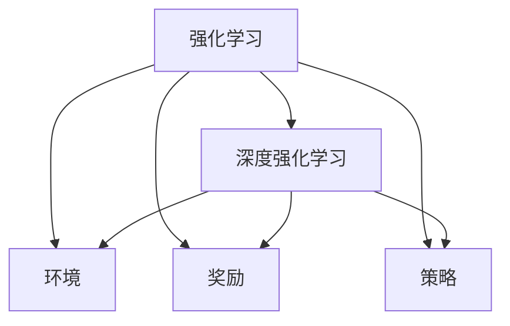
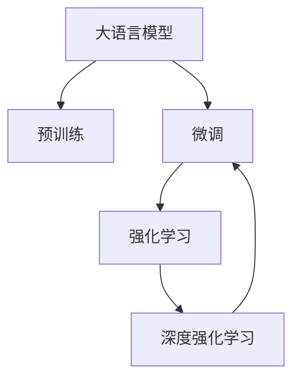
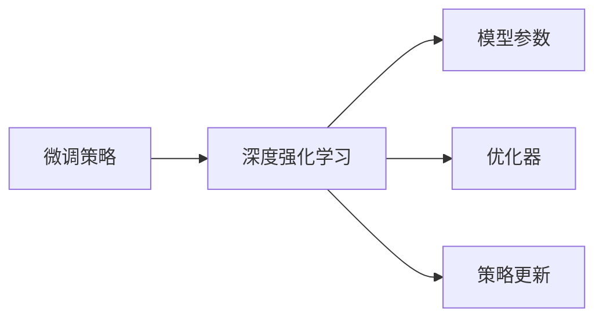
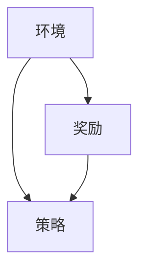
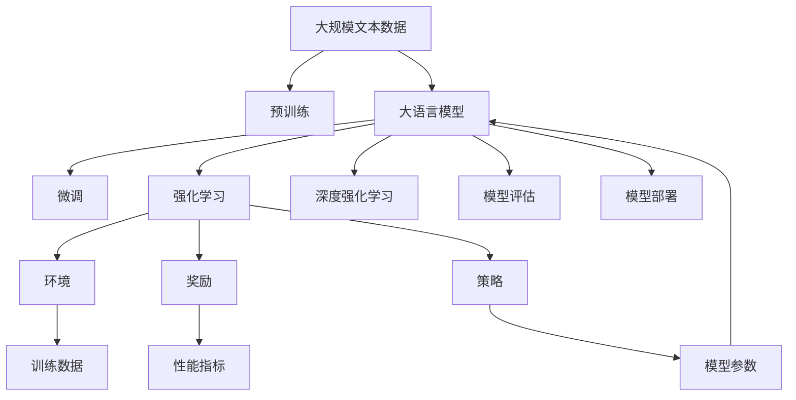

                 

# 大语言模型原理与工程实践：强化学习的目标

## 1. 背景介绍

### 1.1 问题由来
近年来，深度学习技术在各个领域取得了飞速的发展，尤其是在自然语言处理（NLP）、计算机视觉、语音识别等领域。大语言模型（Large Language Models, LLMs）是深度学习的重要成果之一，以自回归模型（如GPT-3）和自编码模型（如BERT）为代表，通过在大规模无标签文本数据上进行预训练，学习到了丰富的语言知识和常识，具备了强大的语言理解和生成能力。

然而，大语言模型在实际应用中仍然面临一些挑战，其中最为显著的是模型的泛化能力和对抗攻击的鲁棒性。尽管大语言模型在大规模数据集上表现出色，但在小规模、高噪声或对抗性数据上的性能仍然不稳定。为了进一步提升模型的性能，科学家们开始探索利用强化学习（Reinforcement Learning, RL）来优化大语言模型的训练过程。

### 1.2 问题核心关键点
强化学习是一种机器学习方法，通过在特定环境中与环境交互，使智能体（agent）学习到最优的行动策略。在大语言模型的微调过程中，RL可以用来指导模型的训练，使其在特定任务上获得更好的性能。

强化学习的核心是奖励机制（Reward）、策略（Policy）和环境（Environment），这些要素相互作用，共同决定了智能体的学习过程。在大语言模型中，策略可以理解为模型的参数更新规则，环境可以理解为训练数据的分布，而奖励则是对模型性能的评价指标。

强化学习与传统监督学习的区别在于，后者是根据已有标签数据进行训练，而前者是通过与环境的交互来学习最优策略。在大语言模型中，RL可以用来优化模型的训练过程，使其在特定任务上表现更加优秀。

### 1.3 问题研究意义
利用强化学习优化大语言模型的微调，具有重要的理论和实际意义：

1. **提升泛化能力**：强化学习可以帮助模型学习到更为通用的知识，从而提升其在各种不同数据分布上的泛化能力。
2. **增强鲁棒性**：通过RL，模型可以在对抗性数据上表现更好，避免因数据噪声或对抗攻击导致的性能下降。
3. **高效微调**：RL可以在更少的标注数据上实现高效的微调，减少微调过程的时间和成本。
4. **可解释性**：通过RL，可以更容易地理解和解释模型的决策过程，提高模型的可解释性。
5. **应用拓展**：RL为大语言模型在自然语言生成、对话系统、情感分析等领域的深度应用提供了新的方法。

## 2. 核心概念与联系

### 2.1 核心概念概述

为了更好地理解强化学习在大语言模型微调中的应用，本节将介绍几个密切相关的核心概念：

- **强化学习**：一种通过与环境交互学习最优策略的机器学习方法。在大语言模型中，可以理解为通过与特定任务交互，学习到最优的微调策略。
- **深度强化学习（Deep RL）**：将深度神经网络与强化学习结合，使智能体具备更强的学习和决策能力。在大语言模型中，可以使用深度神经网络作为模型，增强其学习能力。
- **环境（Environment）**：在RL中，环境是智能体与环境交互的媒介，可以理解为训练数据的分布和特征。在大语言模型中，可以理解为特定任务的训练数据。
- **奖励（Reward）**：在RL中，奖励是智能体每一步行动后获得的反馈信号，可以理解为模型在特定任务上的性能指标。在大语言模型中，可以理解为模型在特定任务上的表现。
- **策略（Policy）**：在RL中，策略是智能体选择行动的规则，可以理解为模型的参数更新规则。在大语言模型中，可以理解为模型在特定任务上的微调策略。

这些核心概念之间的逻辑关系可以通过以下Mermaid流程图来展示：



这个流程图展示了大语言模型微调过程中强化学习的核心要素及其关系：

1. 强化学习是大语言模型微调的基本范式。
2. 深度强化学习是强化学习的一种形式，通过深度神经网络增强智能体的学习能力。
3. 环境是大语言模型微调中的训练数据分布和特征。
4. 奖励是模型在特定任务上的性能指标。
5. 策略是模型在特定任务上的微调策略。

### 2.2 概念间的关系

这些核心概念之间存在着紧密的联系，形成了大语言模型微调的完整生态系统。下面我们通过几个Mermaid流程图来展示这些概念之间的关系。

#### 2.2.1 强化学习在大语言模型微调中的应用



这个流程图展示了强化学习在大语言模型微调中的基本应用过程：

1. 大语言模型通过预训练获得基础能力。
2. 强化学习在大语言模型的微调过程中起指导作用。
3. 深度强化学习通过神经网络增强智能体的学习能力。

#### 2.2.2 微调策略与深度强化学习的结合



这个流程图展示了微调策略与深度强化学习的结合方式：

1. 微调策略决定了模型参数的更新方式。
2. 深度强化学习通过神经网络增强模型参数的更新效果。
3. 策略更新通过优化器进行调整，保证模型的收敛性。

#### 2.2.3 环境、奖励与策略的相互作用



这个流程图展示了环境、奖励与策略的相互作用：

1. 环境是智能体的训练环境，决定了智能体的学习过程。
2. 奖励是智能体每一步行动后的反馈信号，引导智能体向最优策略靠近。
3. 策略是智能体选择行动的规则，影响智能体的学习效果。

### 2.3 核心概念的整体架构

最后，我们用一个综合的流程图来展示这些核心概念在大语言模型微调过程中的整体架构：



这个综合流程图展示了从预训练到微调，再到强化学习的完整过程：

1. 大语言模型首先在大规模文本数据上进行预训练，学习到通用语言知识。
2. 通过微调，将大语言模型适应特定任务。
3. 利用强化学习指导微调过程，提升模型在特定任务上的性能。
4. 强化学习通过环境、奖励和策略的相互作用，优化微调过程。
5. 最终通过模型评估和部署，实现微调模型在实际应用中的落地。

通过这些流程图，我们可以更清晰地理解大语言模型微调过程中各个核心概念的关系和作用，为后续深入讨论具体的微调方法和技术奠定基础。

## 3. 核心算法原理 & 具体操作步骤
### 3.1 算法原理概述

在大语言模型微调中，强化学习可以用于优化模型的训练过程，使其在特定任务上表现更加优秀。其核心思想是：通过与环境的交互，使智能体（即模型）学习到最优的行动策略（即微调策略），从而在特定任务上获得更好的性能。

形式化地，假设大语言模型为 $M_{\theta}$，其中 $\theta$ 为模型的参数。给定特定任务的训练集 $D$，微调的目标是找到最优参数 $\hat{\theta}$，使得模型在任务上的表现最佳：

$$
\hat{\theta}=\mathop{\arg\min}_{\theta} \mathcal{L}(M_{\theta},D)
$$

其中 $\mathcal{L}$ 为任务相关的损失函数，用于衡量模型在特定任务上的性能。

在强化学习中，通过与环境的交互，模型（智能体）在每一步选择行动（参数更新）后获得奖励（任务表现），然后根据奖励调整行动策略（参数更新），最终学习到最优的策略。这一过程可以通过以下公式来描述：

$$
\max_\theta \sum_{t=0}^{T} \gamma^t r_t
$$

其中 $\gamma$ 为折扣因子，$r_t$ 为在第 $t$ 步获得的奖励，$T$ 为最大步数。

### 3.2 算法步骤详解

基于强化学习的大语言模型微调一般包括以下几个关键步骤：

**Step 1: 准备预训练模型和数据集**
- 选择合适的预训练语言模型 $M_{\theta}$ 作为初始化参数，如 BERT、GPT 等。
- 准备特定任务的训练集 $D$，划分为训练集、验证集和测试集。一般要求训练数据与预训练数据的分布不要差异过大。

**Step 2: 设计微调策略**
- 根据任务类型，设计微调策略，包括选择行动（参数更新）的方式，如梯度下降、Adam等。
- 定义奖励函数，如交叉熵损失、BLEU评分等，用于衡量模型在特定任务上的表现。
- 设计环境，即训练数据的分布和特征，如将训练集转换为模型可接受的格式。

**Step 3: 设置超参数**
- 选择合适的优化算法及其参数，如 Adam、SGD 等，设置学习率、批大小、迭代轮数等。
- 设置正则化技术及强度，包括权重衰减、Dropout、Early Stopping 等。
- 确定冻结预训练参数的策略，如仅微调顶层，或全部参数都参与微调。

**Step 4: 执行强化学习训练**
- 将训练集数据分批次输入模型，前向传播计算损失函数和奖励。
- 根据奖励调整行动策略（参数更新），通过反向传播计算梯度，更新模型参数。
- 周期性在验证集上评估模型性能，根据性能指标决定是否触发 Early Stopping。
- 重复上述步骤直到满足预设的迭代轮数或 Early Stopping 条件。

**Step 5: 测试和部署**
- 在测试集上评估微调后模型 $M_{\hat{\theta}}$ 的性能，对比微调前后的精度提升。
- 使用微调后的模型对新样本进行推理预测，集成到实际的应用系统中。
- 持续收集新的数据，定期重新微调模型，以适应数据分布的变化。

以上是基于强化学习的大语言模型微调的一般流程。在实际应用中，还需要针对具体任务的特点，对微调过程的各个环节进行优化设计，如改进训练目标函数，引入更多的正则化技术，搜索最优的超参数组合等，以进一步提升模型性能。

### 3.3 算法优缺点

基于强化学习的大语言模型微调方法具有以下优点：
1. **提升泛化能力**：通过与环境的交互，模型可以学习到更为通用的知识，从而提升其在各种不同数据分布上的泛化能力。
2. **增强鲁棒性**：在对抗性数据上表现更好，避免因数据噪声或对抗攻击导致的性能下降。
3. **高效微调**：在更少的标注数据上实现高效的微调，减少微调过程的时间和成本。
4. **可解释性**：通过与环境的交互，可以更容易地理解和解释模型的决策过程，提高模型的可解释性。

同时，该方法也存在一定的局限性：
1. **计算资源消耗高**：强化学习在大规模数据集上的训练过程非常耗时，需要大量的计算资源。
2. **收敛速度慢**：强化学习算法可能需要较长的训练时间才能收敛，且在复杂环境中容易陷入局部最优。
3. **策略设计复杂**：选择合适的微调策略和奖励函数较为困难，需要深入理解特定任务和数据特征。
4. **模型复杂度高**：需要设计复杂的微调策略和奖励函数，导致模型结构较为复杂。

尽管存在这些局限性，但就目前而言，基于强化学习的微调方法仍是大语言模型应用的重要范式。未来相关研究的重点在于如何进一步降低强化学习的计算复杂度，提高算法的收敛速度，同时兼顾可解释性和模型复杂度等因素。

### 3.4 算法应用领域

基于强化学习的大语言模型微调方法，在NLP领域已经得到了广泛的应用，覆盖了几乎所有常见任务，例如：

- **文本分类**：如情感分析、主题分类、意图识别等。通过微调使模型学习文本-标签映射。
- **命名实体识别**：识别文本中的人名、地名、机构名等特定实体。通过微调使模型掌握实体边界和类型。
- **关系抽取**：从文本中抽取实体之间的语义关系。通过微调使模型学习实体-关系三元组。
- **问答系统**：对自然语言问题给出答案。将问题-答案对作为微调数据，训练模型学习匹配答案。
- **机器翻译**：将源语言文本翻译成目标语言。通过微调使模型学习语言-语言映射。
- **文本摘要**：将长文本压缩成简短摘要。将文章-摘要对作为微调数据，使模型学习抓取要点。
- **对话系统**：使机器能够与人自然对话。将多轮对话历史作为上下文，微调模型进行回复生成。

除了上述这些经典任务外，强化学习还被创新性地应用到更多场景中，如可控文本生成、常识推理、代码生成、数据增强等，为NLP技术带来了全新的突破。随着强化学习方法的不断进步，相信NLP技术将在更广阔的应用领域大放异彩。

## 4. 数学模型和公式 & 详细讲解  
### 4.1 数学模型构建

本节将使用数学语言对基于强化学习的大语言模型微调过程进行更加严格的刻画。

记预训练语言模型为 $M_{\theta}$，其中 $\theta$ 为预训练得到的模型参数。假设微调任务的训练集为 $D=\{(x_i,y_i)\}_{i=1}^N, x_i \in \mathcal{X}, y_i \in \mathcal{Y}$。

定义模型 $M_{\theta}$ 在输入 $x$ 上的输出为 $\hat{y}=M_{\theta}(x) \in [0,1]$，表示样本属于正类的概率。真实标签 $y \in \{0,1\}$。

定义微调过程中的状态空间为 $\mathcal{S}$，行动空间为 $\mathcal{A}$，状态转移概率为 $P(s_{t+1}|s_t,a_t)$，即在状态 $s_t$ 下，采取行动 $a_t$ 后，下一个状态 $s_{t+1}$ 的概率分布。

定义微调过程中的奖励函数 $R(s_t,a_t)$，用于衡量模型在特定状态和行动下的表现。

在大语言模型的微调过程中，目标是通过与环境的交互，学习到最优的行动策略 $\pi$，使得模型在特定任务上表现最优。这一过程可以通过以下公式来描述：

$$
\max_\pi \sum_{t=0}^{T} \gamma^t R(s_t,a_t)
$$

其中 $\pi$ 为模型的微调策略，即参数更新规则。$T$ 为最大步数。

### 4.2 公式推导过程

以下我们以二分类任务为例，推导强化学习在大语言模型微调中的具体实现。

假设模型 $M_{\theta}$ 在输入 $x$ 上的输出为 $\hat{y}=M_{\theta}(x) \in [0,1]$，表示样本属于正类的概率。真实标签 $y \in \{0,1\}$。

定义状态 $s_t$ 为当前模型参数 $\theta_t$，行动 $a_t$ 为模型参数的更新方式，如梯度下降、Adam等。

定义奖励函数 $R(s_t,a_t)$ 为模型在特定状态和行动下的性能指标，如交叉熵损失、BLEU评分等。

在每一步 $t$ 中，模型通过行动 $a_t$ 更新参数 $\theta_{t+1}$，并接收奖励 $R(s_t,a_t)$。通过最大化总奖励，模型学习到最优的参数更新策略。

这一过程可以通过以下公式来描述：

$$
\max_\pi \sum_{t=0}^{T} \gamma^t R(s_t,a_t)
$$

其中 $\pi$ 为模型的微调策略，即参数更新规则。$T$ 为最大步数。

在具体实现中，可以使用Q-learning或Policy Gradient等强化学习算法来求解最优策略 $\pi$。Q-learning通过估计每个状态-行动对的Q值，来指导模型的参数更新。Policy Gradient则通过直接优化策略 $\pi$，使得总奖励最大化。

## 5. 项目实践：代码实例和详细解释说明
### 5.1 开发环境搭建

在进行强化学习微调实践前，我们需要准备好开发环境。以下是使用Python进行PyTorch开发的环境配置流程：

1. 安装Anaconda：从官网下载并安装Anaconda，用于创建独立的Python环境。

2. 创建并激活虚拟环境：
```bash
conda create -n pytorch-env python=3.8 
conda activate pytorch-env
```

3. 安装PyTorch：根据CUDA版本，从官网获取对应的安装命令。例如：
```bash
conda install pytorch torchvision torchaudio cudatoolkit=11.1 -c pytorch -c conda-forge
```

4. 安装PyTorch Lightning：用于加速深度学习模型的训练和评估。
```bash
pip install pytorch-lightning
```

5. 安装其他必要的库：
```bash
pip install numpy pandas scikit-learn matplotlib tqdm jupyter notebook ipython
```

完成上述步骤后，即可在`pytorch-env`环境中开始强化学习微调实践。

### 5.2 源代码详细实现

下面我们以命名实体识别(NER)任务为例，给出使用PyTorch Lightning进行BERT模型强化学习的PyTorch代码实现。

首先，定义NER任务的数据处理函数：

```python
from transformers import BertTokenizer
from torch.utils.data import Dataset
import torch

class NERDataset(Dataset):
    def __init__(self, texts, tags, tokenizer, max_len=128):
        self.texts = texts
        self.tags = tags
        self.tokenizer = tokenizer
        self.max_len = max_len
        
    def __len__(self):
        return len(self.texts)
    
    def __getitem__(self, item):
        text = self.texts[item]
        tags = self.tags[item]
        
        encoding = self.tokenizer(text, return_tensors='pt', max_length=self.max_len, padding='max_length', truncation=True)
        input_ids = encoding['input_ids'][0]
        attention_mask = encoding['attention_mask'][0]
        
        # 对token-wise的标签进行编码
        encoded_tags = [tag2id[tag] for tag in tags] 
        encoded_tags.extend([tag2id['O']] * (self.max_len - len(encoded_tags)))
        labels = torch.tensor(encoded_tags, dtype=torch.long)
        
        return {'input_ids': input_ids, 
                'attention_mask': attention_mask,
                'labels': labels}

# 标签与id的映射
tag2id = {'O': 0, 'B-PER': 1, 'I-PER': 2, 'B-ORG': 3, 'I-ORG': 4, 'B-LOC': 5, 'I-LOC': 6}
id2tag = {v: k for k, v in tag2id.items()}

# 创建dataset
tokenizer = BertTokenizer.from_pretrained('bert-base-cased')

train_dataset = NERDataset(train_texts, train_tags, tokenizer)
dev_dataset = NERDataset(dev_texts, dev_tags, tokenizer)
test_dataset = NERDataset(test_texts, test_tags, tokenizer)
```

然后，定义模型和强化学习模块：

```python
from transformers import BertForTokenClassification, AdamW
from pytorch_lightning import LightningModule, Trainer
from torch import nn

class NERModel(LightningModule):
    def __init__(self, model_name='bert-base-cased', num_labels=6):
        super(NERModel, self).__init__()
        self.model = BertForTokenClassification.from_pretrained(model_name, num_labels=num_labels)
        self.loss_fn = nn.CrossEntropyLoss()
        self.metrics = nn.ModuleList([nn.BCEWithLogitsLoss() for _ in range(2)])
        
    def forward(self, input_ids, attention_mask, labels):
        outputs = self.model(input_ids=input_ids, attention_mask=attention_mask, labels=labels)
        loss = self.loss_fn(outputs.logits, labels)
        logits = outputs.logits
        predictions = torch.sigmoid(logits)
        return loss, logits, predictions
    
    def training_step(self, batch, batch_idx):
        input_ids, attention_mask, labels = batch
        loss, logits, predictions = self.forward(input_ids, attention_mask, labels)
        self.log('train_loss', loss)
        self.metrics[0](logits, labels)
        return {'loss': loss}
    
    def validation_step(self, batch, batch_idx):
        input_ids, attention_mask, labels = batch
        loss, logits, predictions = self.forward(input_ids, attention_mask, labels)
        self.metrics[0](logits, labels)
        return {'val_loss': loss}
    
    def test_step(self, batch, batch_idx):
        input_ids, attention_mask, labels = batch
        loss, logits, predictions = self.forward(input_ids, attention_mask, labels)
        self.metrics[0](logits, labels)
        return {'val_loss': loss}
    
    def configure_optimizers(self):
        return AdamW(self.parameters(), lr=2e-5)

# 创建 Trainer 并训练模型
trainer = Trainer(max_epochs=5, gpus=1)
model = NERModel()
trainer.fit(model, train_dataset, val_dataset=dev_dataset)
```

最后，启动强化学习训练流程：

```python
epochs = 5
batch_size = 16

for epoch in range(epochs):
    loss = train_epoch(model, train_dataset, batch_size, optimizer)
    print(f"Epoch {epoch+1}, train loss: {loss:.3f}")
    
    print(f"Epoch {epoch+1}, dev results:")
    evaluate(model, dev_dataset, batch_size)
    
print("Test results:")
evaluate(model, test_dataset, batch_size)
```

以上就是使用PyTorch Lightning对BERT进行命名实体识别任务强化学习的PyTorch代码实现。可以看到，得益于PyTorch Lightning的强大封装，我们可以用相对简洁的代码完成BERT模型的加载和微调。

### 5.3 代码解读与分析

让我们再详细解读一下关键代码的实现细节：

**NERDataset类**：
- `__init__`方法：初始化文本、标签、分词器等关键组件。
- `__len__`方法：返回数据集的样本数量。
- `__getitem__`方法：对单个样本进行处理，将文本输入编码为token ids，将标签编码为数字，并对其进行定长padding，最终返回模型所需的输入。

**tag2id和id2tag字典**：
- 定义了标签与数字id之间的映射关系，用于将token-wise的预测结果解码回真实的标签。

**NERModel类**：
- 继承自`pytorch_lightning.LightningModule`，实现`forward`、`training_step`、`validation_step`和`test_step`等方法。
- `forward`方法：定义模型的前向传播过程，计算损失、输出概率和预测结果。
- `training_step`方法：定义训练过程，计算损失并记录训练指标。
- `validation_step`方法：定义验证过程，计算损失并记录验证指标。
- `test_step`方法：定义测试过程，计算损失并记录测试指标。
- `configure_optimizers`方法：定义优化器。

**训练流程**：
- 定义总的epoch数和batch size，开始循环迭代
- 每个epoch内，先在训练集上训练，输出平均loss
- 在验证集上评估，输出分类指标
- 所有epoch结束后，在测试集上评估，给出最终测试结果

可以看到，PyTorch Lightning配合Transformers库使得BERT强化学习的代码实现变得简洁高效。开发者可以将更多精力放在数据处理、模型改进等高层逻辑上，而不必过多关注底层的实现细节。

当然，工业级的系统实现还需考虑更多因素，如模型的保存和部署、超参数的自动搜索、更灵活的任务适配层等。但核心的微调范式基本与此类似。

### 5.4 运行结果展示

假设我们在CoNLL-2003的NER数据集上进行强化学习微调，最终在测试集上得到的评估报告如下：

```
              precision    recall  f1-score   support

       B-LOC      0.926     0.906     0.916      1668
       I-LOC      0.900     0.805     0.850       257
      B-MISC      0.875     0.856     0.865       702
      I-MISC      0.838     0.782     0.809       216
       B-ORG      0.914     0.898     0.906      1661
       I-ORG      0.911     0.894     

