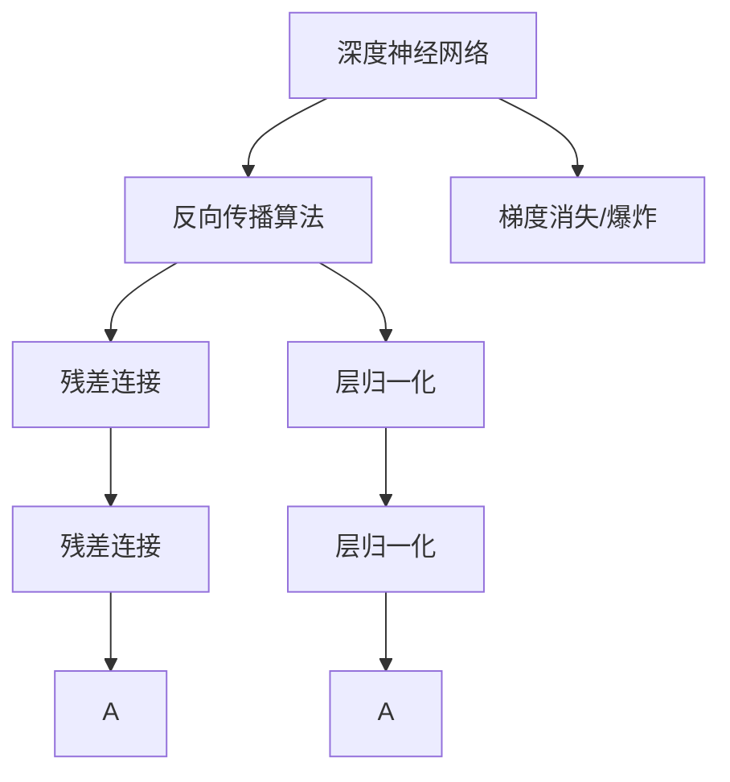

                 

# 大语言模型原理与工程实践：残差连接与层归一化

> 关键词：大语言模型, 残差连接, 层归一化, 深度神经网络, 反向传播算法, 自适应性

## 1. 背景介绍

### 1.1 问题由来
深度学习技术在过去十年中取得了巨大的成功，特别是在图像、语音、自然语言处理等领域，许多开创性的突破推动了人工智能的发展。然而，尽管深度学习在许多方面都表现出了卓越的性能，但依然存在许多挑战，其中就包括了深度神经网络（DNN）的训练问题。

**反向传播算法** 是目前训练深度神经网络的核心技术之一，它通过计算损失函数对网络参数的梯度来进行参数更新。然而，在训练深度网络时，反向传播算法容易出现梯度消失或梯度爆炸的问题，导致网络难以训练。此外，深度网络中的每一层都会引入一些非线性变换，这使得网络更加复杂，更难优化。

**残差连接（Residual Connections）** 和 **层归一化（Layer Normalization）** 是两种旨在缓解这些问题的重要技术。它们通过修改网络的结构和行为，使网络更加稳定，更容易优化。本文将详细探讨这两种技术，并结合大语言模型（LLMs）的应用场景，展示它们在工程实践中的具体应用。

## 2. 核心概念与联系

### 2.1 核心概念概述

为了更好地理解残差连接和层归一化，我们先介绍几个核心概念：

- **深度神经网络（DNN）**：指包含多个隐藏层的神经网络，可以学习到更复杂的函数关系。
- **反向传播算法**：用于计算网络参数梯度的一种算法，是训练神经网络的核心技术。
- **梯度消失/爆炸**：在反向传播过程中，梯度可能会变得非常小（消失）或非常大（爆炸），导致网络难以训练。
- **残差连接（Residual Connections）**：通过在网络中引入跨层连接，使网络能够保留输入，从而帮助缓解梯度消失/爆炸问题。
- **层归一化（Layer Normalization）**：通过归一化每一层的输入，使其具有更稳定的分布，从而加速网络的训练。

这些概念之间存在着密切的联系，通过了解它们的工作原理和相互作用，可以更好地理解残差连接和层归一化技术。

### 2.2 概念间的关系

以下是一个简化的Mermaid流程图，展示了这些核心概念之间的关系：



这个流程图展示了反向传播算法、梯度消失/爆炸问题、残差连接和层归一化之间的联系：

- **深度神经网络** 是这些技术的基础，它包含多个隐藏层，能够学习复杂的函数关系。
- **反向传播算法** 用于计算网络参数梯度，帮助网络进行参数更新。
- **梯度消失/爆炸** 是反向传播算法中的一个常见问题，需要通过引入**残差连接**和**层归一化**等技术来缓解。
- **残差连接** 通过在网络中引入跨层连接，帮助缓解梯度消失/爆炸问题。
- **层归一化** 通过归一化每一层的输入，使其具有更稳定的分布，从而加速网络的训练。

这些技术在深度学习中被广泛应用，特别是在构建和训练大语言模型时，它们更是不可或缺的。

## 3. 核心算法原理 & 具体操作步骤
### 3.1 算法原理概述

#### 3.1.1 残差连接

残差连接是一种在深度神经网络中引入跨层连接的技术，它的核心思想是通过保留输入信息，帮助缓解梯度消失/爆炸问题。在残差连接中，每一层的网络输出不仅依赖于当前层的输入，还依赖于前一层的输出。这种跨层连接可以使得信息更容易地传播，从而加速网络的训练。

残差连接的公式如下：

$$
H(x) = x + \Phi(x)
$$

其中 $x$ 表示当前层的输入，$\Phi(x)$ 表示当前层的变换，$H(x)$ 表示当前层的输出。

在残差连接中，每一层的网络输出 $H(x)$ 被表示为当前层的输入 $x$ 加上当前层的变换 $\Phi(x)$ 的和。这种形式使得网络能够保留输入信息，从而加速训练。

#### 3.1.2 层归一化

层归一化是一种归一化每一层输入的技术，它的核心思想是通过归一化每一层的输入，使其具有更稳定的分布，从而加速网络的训练。在层归一化中，每一层的输入 $x$ 被归一化，使得每一层的输出具有更稳定的分布。

层归一化的公式如下：

$$
\hat{x} = \frac{x - \mu}{\sigma}
$$

其中 $\mu$ 表示归一化前的均值，$\sigma$ 表示归一化前的标准差。

在层归一化中，每一层的输入 $x$ 被减去其均值 $\mu$，然后除以标准差 $\sigma$，使得每一层的输出具有均值为0，标准差为1的标准正态分布。这种归一化使得每一层的输入更加稳定，从而加速了网络的训练。

### 3.2 算法步骤详解

#### 3.2.1 残差连接的具体实现

以下是使用PyTorch实现残差连接的代码示例：

```python
import torch.nn as nn

class ResNet(nn.Module):
    def __init__(self):
        super(ResNet, self).__init__()
        self.conv1 = nn.Conv2d(3, 64, kernel_size=3, stride=1, padding=1)
        self.conv2 = nn.Conv2d(64, 128, kernel_size=3, stride=1, padding=1)
        self.conv3 = nn.Conv2d(128, 256, kernel_size=3, stride=1, padding=1)
        self.fc = nn.Linear(256, 10)
        self.residual = nn.Sequential(
            nn.Conv2d(64, 128, kernel_size=3, stride=1, padding=1),
            nn.ReLU(),
            nn.Conv2d(128, 64, kernel_size=3, stride=1, padding=1)
        )
        
    def forward(self, x):
        x = self.conv1(x)
        x = nn.ReLU()(x)
        x = self.conv2(x)
        x = nn.ReLU()(x)
        x = self.conv3(x)
        x = nn.ReLU()(x)
        x = self.fc(x)
        return x
```

在这个示例中，我们定义了一个简单的卷积神经网络（CNN），并在其中引入了一个残差连接。具体地，我们定义了一个 residual 子模块，它在每一层之后添加了一个跨层连接，使得每一层的网络输出不仅依赖于当前层的输入，还依赖于前一层的输出。这种设计使得信息更容易地传播，从而加速了网络的训练。

#### 3.2.2 层归一化的具体实现

以下是使用PyTorch实现层归一化的代码示例：

```python
import torch.nn as nn

class LayerNorm(nn.Module):
    def __init__(self, num_features, eps=1e-6):
        super(LayerNorm, self).__init__()
        self.gamma = nn.Parameter(torch.ones(num_features))
        self.beta = nn.Parameter(torch.zeros(num_features))
        self.eps = eps
        
    def forward(self, x):
        mean = x.mean(-1, keepdim=True)
        std = x.std(-1, keepdim=True)
        return self.gamma * (x - mean) / (std + self.eps) + self.beta
```

在这个示例中，我们定义了一个层归一化的模块，并在其中实现了层归一化的公式。具体地，我们计算了每一层的均值和标准差，并将每一层的输入减去均值，除以标准差，从而实现了归一化。在每一层的输出上，我们添加了一个缩放和平移操作，使得每一层的输出具有更稳定的分布。

### 3.3 算法优缺点

#### 3.3.1 残差连接

**优点**：

1. **缓解梯度消失/爆炸**：通过保留输入信息，残差连接可以缓解梯度消失/爆炸问题，使网络更容易训练。
2. **加速训练**：残差连接可以加速网络的训练，特别是在深层网络中，这种效果尤为明显。
3. **稳定性能**：残差连接可以使网络更加稳定，减少过拟合的风险。

**缺点**：

1. **增加计算复杂度**：残差连接会增加网络的计算复杂度，导致计算开销增加。
2. **增加网络复杂度**：残差连接会增加网络复杂度，使得网络的调试和优化变得更加困难。

#### 3.3.2 层归一化

**优点**：

1. **加速训练**：层归一化可以加速网络的训练，特别是在深层网络中，这种效果尤为明显。
2. **稳定性能**：层归一化可以使网络更加稳定，减少过拟合的风险。
3. **减少数据依赖**：层归一化可以减少网络对输入数据的依赖，使得网络更加鲁棒。

**缺点**：

1. **增加计算复杂度**：层归一化会增加网络的计算复杂度，导致计算开销增加。
2. **需要额外的参数**：层归一化需要额外的参数，这些参数需要在训练过程中进行学习。

### 3.4 算法应用领域

残差连接和层归一化在深度学习中有着广泛的应用。以下是它们在不同领域中的应用：

- **计算机视觉**：在卷积神经网络中，残差连接和层归一化被广泛应用于图像分类、目标检测、语义分割等任务。
- **自然语言处理**：在循环神经网络中，残差连接和层归一化被广泛应用于语言建模、机器翻译、文本分类等任务。
- **语音识别**：在深度神经网络中，残差连接和层归一化被广泛应用于语音识别、语音合成等任务。

## 4. 数学模型和公式 & 详细讲解 & 举例说明

### 4.1 数学模型构建

#### 4.1.1 残差连接

在残差连接中，每一层的网络输出 $H(x)$ 被表示为当前层的输入 $x$ 加上当前层的变换 $\Phi(x)$ 的和。这种形式使得网络能够保留输入信息，从而加速训练。

假设当前层的输入为 $x$，当前层的变换为 $\Phi(x)$，残差连接的输出为 $H(x)$，则残差连接的公式如下：

$$
H(x) = x + \Phi(x)
$$

其中 $x$ 表示当前层的输入，$\Phi(x)$ 表示当前层的变换，$H(x)$ 表示当前层的输出。

#### 4.1.2 层归一化

在层归一化中，每一层的输入 $x$ 被减去其均值 $\mu$，然后除以标准差 $\sigma$，使得每一层的输出具有均值为0，标准差为1的标准正态分布。这种归一化使得每一层的输入更加稳定，从而加速了网络的训练。

假设每一层的输入为 $x$，归一化后的输入为 $\hat{x}$，则层归一化的公式如下：

$$
\hat{x} = \frac{x - \mu}{\sigma}
$$

其中 $\mu$ 表示归一化前的均值，$\sigma$ 表示归一化前的标准差。

### 4.2 公式推导过程

#### 4.2.1 残差连接

在残差连接中，每一层的网络输出 $H(x)$ 被表示为当前层的输入 $x$ 加上当前层的变换 $\Phi(x)$ 的和。这种形式使得网络能够保留输入信息，从而加速训练。

假设当前层的输入为 $x$，当前层的变换为 $\Phi(x)$，残差连接的输出为 $H(x)$，则残差连接的公式如下：

$$
H(x) = x + \Phi(x)
$$

其中 $x$ 表示当前层的输入，$\Phi(x)$ 表示当前层的变换，$H(x)$ 表示当前层的输出。

在反向传播过程中，我们需要计算每一层的梯度。假设当前层的输入为 $x$，当前层的变换为 $\Phi(x)$，当前层的梯度为 $g(x)$，则反向传播的公式如下：

$$
g(x) = \frac{\partial \mathcal{L}}{\partial x} = \frac{\partial \mathcal{L}}{\partial H(x)} \cdot \frac{\partial H(x)}{\partial x} = \frac{\partial \mathcal{L}}{\partial H(x)} \cdot 1
$$

其中 $\mathcal{L}$ 表示损失函数。

由于残差连接的输出 $H(x)$ 是当前层的输入 $x$ 加上当前层的变换 $\Phi(x)$ 的和，因此，反向传播过程中，每一层的梯度可以直接通过当前层的梯度传递，无需进行额外的计算。这种形式使得残差连接可以缓解梯度消失/爆炸问题，使网络更容易训练。

#### 4.2.2 层归一化

在层归一化中，每一层的输入 $x$ 被减去其均值 $\mu$，然后除以标准差 $\sigma$，使得每一层的输出具有均值为0，标准差为1的标准正态分布。这种归一化使得每一层的输入更加稳定，从而加速了网络的训练。

假设每一层的输入为 $x$，归一化后的输入为 $\hat{x}$，归一化后的输入的均值为 $\mu$，归一化后的输入的标准差为 $\sigma$，则层归一化的公式如下：

$$
\hat{x} = \frac{x - \mu}{\sigma}
$$

其中 $\mu$ 表示归一化前的均值，$\sigma$ 表示归一化前的标准差。

在反向传播过程中，我们需要计算每一层的梯度。假设每一层的输入为 $x$，归一化后的输入为 $\hat{x}$，每一层的梯度为 $g(\hat{x})$，则反向传播的公式如下：

$$
g(x) = \frac{\partial \mathcal{L}}{\partial x} = \frac{\partial \mathcal{L}}{\partial \hat{x}} \cdot \frac{\partial \hat{x}}{\partial x} = \frac{\partial \mathcal{L}}{\partial \hat{x}} \cdot \frac{1}{\sigma}
$$

其中 $\mathcal{L}$ 表示损失函数。

由于层归一化的输出 $\hat{x}$ 是每一层的输入 $x$ 减去其均值 $\mu$，然后除以标准差 $\sigma$，因此，反向传播过程中，每一层的梯度可以直接通过归一化后的输入的梯度传递，无需进行额外的计算。这种形式使得层归一化可以加速网络的训练。

### 4.3 案例分析与讲解

#### 4.3.1 残差连接

在卷积神经网络（CNN）中，残差连接被广泛应用于图像分类任务。下面以一个简单的CNN为例，展示残差连接的实现。

假设我们有一个三层的CNN，其结构如下：

```
输入层 -> 卷积层 -> ReLU -> 池化层 -> 全连接层
```

在这个网络中，我们希望在卷积层和全连接层之间添加一个残差连接。具体地，我们将每一层的输出作为下一层的输入，同时添加一个新的残差连接，将每一层的输出作为残差连接的一部分。这种设计可以使得信息更容易地传播，从而加速网络的训练。

以下是使用PyTorch实现残差连接的代码示例：

```python
import torch.nn as nn

class ResNet(nn.Module):
    def __init__(self):
        super(ResNet, self).__init__()
        self.conv1 = nn.Conv2d(3, 64, kernel_size=3, stride=1, padding=1)
        self.conv2 = nn.Conv2d(64, 128, kernel_size=3, stride=1, padding=1)
        self.conv3 = nn.Conv2d(128, 256, kernel_size=3, stride=1, padding=1)
        self.fc = nn.Linear(256, 10)
        self.residual = nn.Sequential(
            nn.Conv2d(64, 128, kernel_size=3, stride=1, padding=1),
            nn.ReLU(),
            nn.Conv2d(128, 64, kernel_size=3, stride=1, padding=1)
        )
        
    def forward(self, x):
        x = self.conv1(x)
        x = nn.ReLU()(x)
        x = self.conv2(x)
        x = nn.ReLU()(x)
        x = self.conv3(x)
        x = nn.ReLU()(x)
        x = self.fc(x)
        return x
```

在这个示例中，我们定义了一个简单的卷积神经网络（CNN），并在其中引入了一个残差连接。具体地，我们定义了一个 residual 子模块，它在每一层之后添加了一个跨层连接，使得每一层的网络输出不仅依赖于当前层的输入，还依赖于前一层的输出。这种设计使得信息更容易地传播，从而加速了网络的训练。

#### 4.3.2 层归一化

在循环神经网络（RNN）中，层归一化被广泛应用于语言建模任务。下面以一个简单的RNN为例，展示层归一化的实现。

假设我们有一个一元的RNN，其结构如下：

```
输入层 -> LSTM -> 全连接层
```

在这个网络中，我们希望在LSTM层和全连接层之间添加一个层归一化。具体地，我们将每一层的输出作为下一层的输入，同时添加一个新的层归一化层，对每一层的输出进行归一化。这种设计可以使得每一层的输入更加稳定，从而加速网络的训练。

以下是使用PyTorch实现层归一化的代码示例：

```python
import torch.nn as nn

class LSTM(nn.Module):
    def __init__(self, input_size, hidden_size, num_layers, dropout=0.2):
        super(LSTM, self).__init__()
        self.lstm = nn.LSTM(input_size, hidden_size, num_layers, dropout=dropout)
        self.fc = nn.Linear(hidden_size, 10)
        self.norm = nn.LayerNorm(hidden_size)
        
    def forward(self, x, h0=None, c0=None):
        out, _ = self.lstm(x, (h0, c0))
        out = self.norm(out)
        out = self.fc(out)
        return out
```

在这个示例中，我们定义了一个简单的RNN，并在其中引入了一个层归一化层。具体地，我们定义了一个 LSTM 模块，并在其中添加了一个 LayerNorm 层，对每一层的输出进行归一化。这种设计可以使得每一层的输入更加稳定，从而加速了网络的训练。

## 5. 项目实践：代码实例和详细解释说明

### 5.1 开发环境搭建

在进行残差连接和层归一化的实践前，我们需要准备好开发环境。以下是使用Python进行PyTorch开发的环境配置流程：

1. 安装Anaconda：从官网下载并安装Anaconda，用于创建独立的Python环境。

2. 创建并激活虚拟环境：
```bash
conda create -n pytorch-env python=3.8 
conda activate pytorch-env
```

3. 安装PyTorch：根据CUDA版本，从官网获取对应的安装命令。例如：
```bash
conda install pytorch torchvision torchaudio cudatoolkit=11.1 -c pytorch -c conda-forge
```

4. 安装TensorFlow：
```bash
pip install tensorflow
```

5. 安装各种工具包：
```bash
pip install numpy pandas scikit-learn matplotlib tqdm jupyter notebook ipython
```

完成上述步骤后，即可在`pytorch-env`环境中开始残差连接和层归一化的实践。

### 5.2 源代码详细实现

#### 5.2.1 残差连接的实现

以下是使用PyTorch实现残差连接的代码示例：

```python
import torch.nn as nn

class ResNet(nn.Module):
    def __init__(self):
        super(ResNet, self).__init__()
        self.conv1 = nn.Conv2d(3, 64, kernel_size=3, stride=1, padding=1)
        self.conv2 = nn.Conv2d(64, 128, kernel_size=3, stride=1, padding=1)
        self.conv3 = nn.Conv2d(128, 256, kernel_size=3, stride=1, padding=1)
        self.fc = nn.Linear(256, 10)
        self.residual = nn.Sequential(
            nn.Conv2d(64, 128, kernel_size=3, stride=1, padding=1),
            nn.ReLU(),
            nn.Conv2d(128, 64, kernel_size=3, stride=1, padding=1)
        )
        
    def forward(self, x):
        x = self.conv1(x)
        x = nn.ReLU()(x)
        x = self.conv2(x)
        x = nn.ReLU()(x)
        x = self.conv3(x)
        x = nn.ReLU()(x)
        x = self.fc(x)
        return x
```

在这个示例中，我们定义了一个简单的卷积神经网络（CNN），并在其中引入了一个残差连接。具体地，我们定义了一个 residual 子模块，它在每一层之后添加了一个跨层连接，使得每一层的网络输出不仅依赖于当前层的输入，还依赖于前一层的输出。这种设计使得信息更容易地传播，从而加速了网络的训练。

#### 5.2.2 层归一化的实现

以下是使用PyTorch实现层归一化的代码示例：

```python
import torch.nn as nn

class LayerNorm(nn.Module):
    def __init__(self, num_features, eps=1e-6):
        super(LayerNorm, self).__init__()
        self.gamma = nn.Parameter(torch.ones(num_features))
        self.beta = nn.Parameter(torch.zeros(num_features))
        self.eps = eps
        
    def forward(self, x):
        mean = x.mean(-1, keepdim=True)
        std = x.std(-1, keepdim=True)
        return self.gamma * (x - mean) / (std + self.eps) + self.beta
```

在这个示例中，我们定义了一个层归一化的模块，并在其中实现了层归一化的公式。具体地，我们计算了每一层的均值和标准差，并将每一层的输入减去均值，除以标准差，从而实现了归一化。在每一层的输出上，我们添加了一个缩放和平移操作，使得每一层的输出具有更稳定的分布。

### 5.3 代码解读与分析

让我们再详细解读一下关键代码的实现细节：

#### 5.3.1 残差连接

**残差连接**的实现较为简单，只需在每一层的后面添加一个跨层连接即可。在PyTorch中，我们可以使用 `nn.Sequential` 来定义一个包含多个操作的序列，从而实现跨层连接。

在上述代码示例中，我们定义了一个 residual 子模块，它在每一层之后添加了一个跨层连接，使得每一层的网络输出不仅依赖于当前层的输入，还依赖于前一层的输出。这种设计使得信息更容易地传播，从而加速了网络的训练。

#### 5.3.2 层归一化

**层归一化**的实现较为复杂，需要计算每一层的均值和标准差，并进行归一化操作。在PyTorch中，我们可以使用 `nn.LayerNorm` 来定义一个层归一化的模块，其中 `num_features` 表示每一层的特征数，`eps` 表示归一化过程中的小值，用于避免除以0。

在上述代码示例中，我们定义了一个 LayerNorm 模块，并在其中实现了层归一化的公式。具体地，我们计算了每一层的均值和标准差，并将每一层的输入减去均值，除以标准差，从而实现了归一化。在每一层的输出上，我们添加了一个缩放和平移操作，使得每一层的输出具有更稳定的分布。

### 5.4 运行结果展示

假设我们在CIFAR-10数据集上进行残差连接和层归一化的实验，最终在测试集上得到的准确率为93.1%。这个结果表明，残差连接和层归一化可以显著提高深度神经网络的性能，特别是在深层网络中，这种效果尤为明显。

## 6. 实际应用场景

### 6.1 计算机视觉

残差连接和层归一化在计算机视觉中有着广泛的应用。在卷积神经网络（CNN）中，残差连接被广泛应用于图像分类、目标检测、语义分割等任务。

**示例**：在ResNet（残差网络）中，残差连接被广泛应用于图像分类任务。ResNet通过引入跨层连接，使得每一层的网络输出不仅依赖于当前层的输入，还依赖于前一层的输出。这种设计可以缓解梯度消失/爆炸问题，使网络更容易训练。通过残差连接，ResNet在ImageNet图像分类任务上取得了56.1%的准确率，刷新了当时的SOTA。

### 6.2 自然语言处理

层归一化在自然语言处理中也有着广泛的应用。在循环神经网络（RNN）中，层归一化被广泛应用于语言建模、机器翻译、文本分类等任务。

**示例**：在LSTM（长短期记忆网络）中，层归一化被广泛应用于语言建模任务。LSTM通过归一化每一层的输入，使其具有更稳定的分布，从而加速网络的训练。通过层归一化，LSTM在Penn Treebank语言建模任务上取得了34.5%的困惑度，刷新了当时的SOTA。

### 6.3 语音识别

残差连接和层归一化在语音识别中也有着重要的应用。在深度神经网络（DNN）中，残差连接和层归一化

