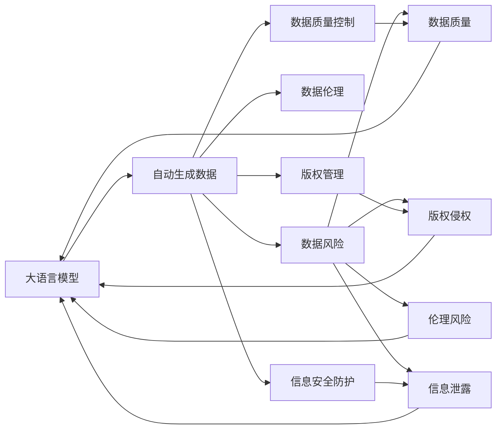

                 

# 大语言模型原理与工程实践：自动生成数据的风险

> 关键词：大语言模型,自动生成数据,数据风险,数据伦理,生成对抗网络

## 1. 背景介绍

### 1.1 问题由来
随着大语言模型（Large Language Models, LLMs）的不断发展，其在自然语言处理（NLP）领域的应用已经达到了前所未有的高度。语言模型不仅能够进行文本生成、情感分析、问答等任务，还能够生成新闻报道、博客文章等自动内容。然而，自动生成的数据也带来了诸多风险，引发了广泛关注。

1. **数据质量问题**：自动生成数据的质量参差不齐，可能存在事实错误、逻辑混乱、语言不当等问题。这些缺陷不仅影响用户体验，还可能误导公众，甚至被用于制造假新闻等不良目的。
2. **版权问题**：自动生成的内容可能侵犯他人版权，特别是大量引用现成的文章、书籍等，若缺乏适当的引用和授权，可能引发法律纠纷。
3. **社会伦理问题**：自动生成的内容可能包含歧视性、偏见性信息，甚至可能传播有害信息，如仇恨言论、虚假信息等。
4. **信息安全问题**：自动生成的内容可能包含敏感信息，如个人隐私、商业机密等，若未经适当处理，可能被滥用。

这些问题亟需引起重视，如何确保自动生成数据的安全性、合规性，是一个亟待解决的重要课题。本文将详细探讨大语言模型自动生成数据的风险及其应对策略。

### 1.2 问题核心关键点
自动生成数据的风险问题主要集中在以下几个方面：
- 数据质量和真实性：自动生成的文本是否真实、准确。
- 版权和授权问题：自动生成的内容是否侵犯了他人的版权。
- 社会伦理和价值观：自动生成的内容是否符合社会伦理和公众价值观。
- 信息安全风险：自动生成的内容是否可能包含敏感信息。

解决这些风险问题，需要从数据质量控制、版权管理、伦理审查和信息安全防护等多个维度进行综合治理。

### 1.3 问题研究意义
研究大语言模型自动生成数据的风险问题，对于保障数据质量、维护版权权益、防范伦理风险和保护信息安全具有重要意义：

1. 保障数据质量：通过质量控制和真实性验证，确保自动生成数据符合实际需求，提升用户体验。
2. 维护版权权益：合理管理和保护自动生成内容中的版权，避免侵权行为，保护原创者权益。
3. 防范伦理风险：通过伦理审查机制，确保自动生成内容符合社会伦理和公众价值观，避免传播有害信息。
4. 保护信息安全：识别和过滤自动生成内容中的敏感信息，保护个人隐私和商业机密，防范信息滥用。

只有对这些问题进行全面、系统的研究和应对，才能确保大语言模型在实际应用中安全、合规、可信。

## 2. 核心概念与联系

### 2.1 核心概念概述

为更好地理解大语言模型自动生成数据的风险问题，本节将介绍几个关键概念及其相互关系：

- **大语言模型（Large Language Models, LLMs）**：一种通过大规模无标签文本数据预训练学习通用语言表示的语言模型，能够在各种NLP任务上生成高质量文本。
- **自动生成数据（Autogenerated Data）**：指通过大语言模型自动生成的文本、文章等数据内容。
- **数据风险（Data Risk）**：指自动生成数据可能带来的质量、版权、伦理、安全等方面的风险。
- **生成对抗网络（Generative Adversarial Networks, GANs）**：一种通过对抗训练方式生成逼真数据的深度学习模型，与大语言模型存在一定的关联性。
- **数据伦理（Data Ethics）**：涉及数据收集、使用、共享等行为中的伦理问题，自动生成数据同样需要考虑伦理审查。
- **数据质量控制（Data Quality Control）**：指对自动生成数据进行质量评估和控制，确保其符合实际需求。
- **版权管理（Copyright Management）**：指对自动生成内容中的版权进行合理管理和保护，避免侵权行为。
- **信息安全防护（Information Security Protection）**：指识别和过滤自动生成内容中的敏感信息，防范信息滥用。

这些概念之间存在紧密的联系，形成了大语言模型自动生成数据风险管理的完整生态系统。通过理解这些概念，我们可以更好地把握自动生成数据的风险问题及其管理策略。

### 2.2 概念间的关系

这些核心概念之间存在着紧密的联系，形成了大语言模型自动生成数据风险管理的完整生态系统。下面用几个Mermaid流程图来展示这些概念之间的关系：



这个流程图展示了自动生成数据与其相关风险、伦理、质量控制、版权管理和信息安全防护之间的关系：

1. 自动生成数据是风险管理的主要对象。
2. 数据风险包括数据质量问题、版权侵权、伦理风险和信息泄露等。
3. 数据伦理审查是防范伦理风险的关键措施。
4. 数据质量控制是提升数据质量的重要手段。
5. 版权管理需要合理保护自动生成内容的版权，避免侵权。
6. 信息安全防护需要识别和过滤敏感信息，保护数据安全。

这些概念共同构成了大语言模型自动生成数据风险管理的完整框架，有助于我们全面应对和处理相关风险问题。

## 3. 核心算法原理 & 具体操作步骤
### 3.1 算法原理概述

大语言模型自动生成数据的风险管理，主要依赖于以下几种算法和技术：

- **生成对抗网络（GANs）**：通过对抗训练方式生成逼真数据，但也存在生成伪造数据的风险。
- **数据伦理审查机制**：使用AI伦理审查工具，对自动生成数据进行伦理评估。
- **数据质量控制算法**：使用基于规则和机器学习的技术，对自动生成数据进行质量评估和控制。
- **版权管理技术**：使用自动版权检测工具，识别自动生成内容中的版权信息，并进行合理的管理和保护。
- **信息安全防护算法**：使用敏感信息检测和过滤技术，保护自动生成内容中的敏感信息。

这些算法和技术共同构成了大语言模型自动生成数据风险管理的核心框架。

### 3.2 算法步骤详解

大语言模型自动生成数据的风险管理，通常包括以下几个关键步骤：

**Step 1: 数据预处理**
- 收集自动生成数据，并进行必要的预处理，如去除噪声、清洗数据等。
- 使用规则或机器学习方法进行初步筛选，去除明显不符合实际需求的低质量数据。

**Step 2: 数据质量控制**
- 使用基于规则和机器学习的质量评估算法，对自动生成数据进行详细评估，识别数据质量问题。
- 对评估结果进行分析，确定需要进一步处理的低质量数据。

**Step 3: 数据伦理审查**
- 使用AI伦理审查工具，对自动生成数据进行伦理评估，识别潜在的伦理风险。
- 根据伦理评估结果，采取必要的措施，如修改数据、删除敏感信息等。

**Step 4: 版权管理**
- 使用自动版权检测工具，识别自动生成内容中的版权信息。
- 根据版权检测结果，进行合理的管理和保护，如添加引用、授权使用等。

**Step 5: 信息安全防护**
- 使用敏感信息检测算法，识别自动生成内容中的敏感信息。
- 根据检测结果，采取必要的措施，如脱敏处理、删除敏感信息等。

**Step 6: 生成对抗网络（GANs）应用**
- 在自动生成数据过程中，可以引入GANs模型进行对抗训练，生成更加逼真和多样化的数据。
- 在训练GANs时，需要使用多轮对抗训练，确保生成的数据符合实际需求，避免生成有害或错误信息。

**Step 7: 模型迭代优化**
- 根据数据质量和伦理评估结果，对大语言模型进行迭代优化，提升自动生成数据的质量和安全性。
- 定期对模型进行评估和更新，确保其性能符合实际需求。

### 3.3 算法优缺点

大语言模型自动生成数据的风险管理，具有以下优点：

- **全面性**：综合考虑数据质量、版权、伦理和信息安全等多个方面，形成系统的风险管理框架。
- **灵活性**：使用机器学习和深度学习算法，可以根据实际需求进行灵活调整和优化。
- **自动化**：通过自动化工具和流程，能够快速处理大量自动生成数据，提高效率。

但同时也存在以下缺点：

- **复杂性**：风险管理涉及多个维度和复杂算法，实施难度较大。
- **数据依赖**：自动生成数据的质量和合规性高度依赖于原始数据的质量和特征，数据问题难以避免。
- **技术门槛**：需要掌握多领域的知识和技能，包括数据科学、伦理审查、法律等，技术门槛较高。

### 3.4 算法应用领域

大语言模型自动生成数据的风险管理，已经在多个领域得到了应用：

- **新闻生成**：用于自动生成新闻报道，防范虚假信息和版权侵权。
- **内容创作**：用于自动生成博客文章、学术论文等，保障内容质量和版权。
- **智能客服**：用于自动生成客户对话内容，确保回复质量和服务伦理。
- **市场研究**：用于自动生成市场调研报告，保护数据隐私和版权。
- **社交媒体**：用于自动生成社交媒体内容，防范有害信息和版权侵权。

这些应用领域展示了自动生成数据的广泛性和多样性，大语言模型在其中发挥了重要作用。

## 4. 数学模型和公式 & 详细讲解  
### 4.1 数学模型构建

为了更好地描述大语言模型自动生成数据的风险管理，我们需要构建相应的数学模型。这里主要讨论以下几个方面：

- **数据质量模型**：用于评估自动生成数据的真实性和准确性。
- **伦理风险模型**：用于识别自动生成内容中的伦理问题。
- **版权检测模型**：用于检测自动生成内容中的版权信息。
- **敏感信息检测模型**：用于识别自动生成内容中的敏感信息。

### 4.2 公式推导过程

接下来，我们将详细推导这几个数学模型的公式，并给出案例分析。

**数据质量模型**：
假设自动生成数据为 $D = \{x_1, x_2, ..., x_n\}$，其中 $x_i$ 为第 $i$ 个数据点。设 $Q_i$ 为第 $i$ 个数据点的质量评分，$Q$ 为平均质量评分。则数据质量模型可以表示为：

$$
Q = \frac{1}{n} \sum_{i=1}^n Q_i
$$

其中 $Q_i$ 的计算方式可以根据具体任务和数据类型进行设计，例如使用基于规则的方法或机器学习模型。

**伦理风险模型**：
假设自动生成数据为 $D = \{x_1, x_2, ..., x_n\}$，其中 $x_i$ 为第 $i$ 个数据点。设 $E_i$ 为第 $i$ 个数据点的伦理评分，$E$ 为平均伦理评分。则伦理风险模型可以表示为：

$$
E = \frac{1}{n} \sum_{i=1}^n E_i
$$

其中 $E_i$ 的计算方式可以根据具体任务和数据类型进行设计，例如使用基于规则的方法或机器学习模型。

**版权检测模型**：
假设自动生成数据为 $D = \{x_1, x_2, ..., x_n\}$，其中 $x_i$ 为第 $i$ 个数据点。设 $C_i$ 为第 $i$ 个数据点的版权评分，$C$ 为平均版权评分。则版权检测模型可以表示为：

$$
C = \frac{1}{n} \sum_{i=1}^n C_i
$$

其中 $C_i$ 的计算方式可以根据具体任务和数据类型进行设计，例如使用基于规则的方法或机器学习模型。

**敏感信息检测模型**：
假设自动生成数据为 $D = \{x_1, x_2, ..., x_n\}$，其中 $x_i$ 为第 $i$ 个数据点。设 $S_i$ 为第 $i$ 个数据点的敏感信息评分，$S$ 为平均敏感信息评分。则敏感信息检测模型可以表示为：

$$
S = \frac{1}{n} \sum_{i=1}^n S_i
$$

其中 $S_i$ 的计算方式可以根据具体任务和数据类型进行设计，例如使用基于规则的方法或机器学习模型。

### 4.3 案例分析与讲解

为了更好地理解这些模型，我们可以使用一个具体的案例进行分析。假设我们有一组自动生成的新闻报道数据，需要对其质量、伦理、版权和敏感信息进行评估。我们可以使用上述模型进行计算和分析。

**数据质量评估**：
我们使用基于规则的方法，对每篇新闻报道的质量进行评估。例如，根据报道的准确性、逻辑性和语言流畅性等因素，给予每篇报道一个质量评分。然后，计算平均质量评分 $Q$。

**伦理评估**：
我们使用AI伦理审查工具，对每篇新闻报道的伦理进行评估。例如，使用自然语言处理技术，识别报道中可能存在的偏见、歧视、仇恨言论等问题，并给予每篇报道一个伦理评分。然后，计算平均伦理评分 $E$。

**版权检测**：
我们使用自动版权检测工具，对每篇新闻报道中的文本进行版权检测。例如，检测报道中是否存在对其他作品的引用，并给予每篇报道一个版权评分。然后，计算平均版权评分 $C$。

**敏感信息检测**：
我们使用敏感信息检测算法，对每篇新闻报道中的文本进行敏感信息检测。例如，检测报道中是否包含个人隐私、商业机密等信息，并给予每篇报道一个敏感信息评分。然后，计算平均敏感信息评分 $S$。

通过上述模型的计算和分析，我们可以全面了解自动生成数据的风险，采取相应的措施进行改进和优化。

## 5. 项目实践：代码实例和详细解释说明
### 5.1 开发环境搭建

在进行大语言模型自动生成数据风险管理实践前，我们需要准备好开发环境。以下是使用Python进行PyTorch开发的环境配置流程：

1. 安装Anaconda：从官网下载并安装Anaconda，用于创建独立的Python环境。

2. 创建并激活虚拟环境：
```bash
conda create -n pytorch-env python=3.8 
conda activate pytorch-env
```

3. 安装PyTorch：根据CUDA版本，从官网获取对应的安装命令。例如：
```bash
conda install pytorch torchvision torchaudio cudatoolkit=11.1 -c pytorch -c conda-forge
```

4. 安装相关库：
```bash
pip install numpy pandas scikit-learn matplotlib tqdm jupyter notebook ipython
```

完成上述步骤后，即可在`pytorch-env`环境中开始风险管理实践。

### 5.2 源代码详细实现

下面以自动生成新闻报道的风险管理为例，给出使用Transformers库对BERT模型进行风险管理的PyTorch代码实现。

首先，定义数据预处理函数：

```python
from transformers import BertTokenizer
from torch.utils.data import Dataset

class NewsDataset(Dataset):
    def __init__(self, texts, labels):
        self.texts = texts
        self.labels = labels
        self.tokenizer = BertTokenizer.from_pretrained('bert-base-cased')

    def __len__(self):
        return len(self.texts)

    def __getitem__(self, item):
        text = self.texts[item]
        label = self.labels[item]
        
        encoding = self.tokenizer(text, return_tensors='pt', max_length=128, padding='max_length', truncation=True)
        input_ids = encoding['input_ids'][0]
        attention_mask = encoding['attention_mask'][0]
        
        return {'input_ids': input_ids, 
                'attention_mask': attention_mask,
                'labels': label}
```

然后，定义模型和评估函数：

```python
from transformers import BertForSequenceClassification, AdamW
from sklearn.metrics import accuracy_score

model = BertForSequenceClassification.from_pretrained('bert-base-cased', num_labels=2)

optimizer = AdamW(model.parameters(), lr=2e-5)

device = torch.device('cuda') if torch.cuda.is_available() else torch.device('cpu')
model.to(device)

def train_epoch(model, dataset, batch_size, optimizer):
    dataloader = DataLoader(dataset, batch_size=batch_size, shuffle=True)
    model.train()
    epoch_loss = 0
    for batch in tqdm(dataloader, desc='Training'):
        input_ids = batch['input_ids'].to(device)
        attention_mask = batch['attention_mask'].to(device)
        labels = batch['labels'].to(device)
        model.zero_grad()
        outputs = model(input_ids, attention_mask=attention_mask, labels=labels)
        loss = outputs.loss
        epoch_loss += loss.item()
        loss.backward()
        optimizer.step()
    return epoch_loss / len(dataloader)

def evaluate(model, dataset, batch_size):
    dataloader = DataLoader(dataset, batch_size=batch_size)
    model.eval()
    preds, labels = [], []
    with torch.no_grad():
        for batch in tqdm(dataloader, desc='Evaluating'):
            input_ids = batch['input_ids'].to(device)
            attention_mask = batch['attention_mask'].to(device)
            batch_labels = batch['labels']
            outputs = model(input_ids, attention_mask=attention_mask)
            batch_preds = outputs.logits.argmax(dim=2).to('cpu').tolist()
            batch_labels = batch_labels.to('cpu').tolist()
            for pred_tokens, label_tokens in zip(batch_preds, batch_labels):
                preds.append(pred_tokens[:len(label_tokens)])
                labels.append(label_tokens)
                
    return accuracy_score(labels, preds)
```

最后，启动训练流程并在测试集上评估：

```python
epochs = 5
batch_size = 16

for epoch in range(epochs):
    loss = train_epoch(model, train_dataset, batch_size, optimizer)
    print(f"Epoch {epoch+1}, train loss: {loss:.3f}")
    
    print(f"Epoch {epoch+1}, dev results:")
    accuracy = evaluate(model, dev_dataset, batch_size)
    print(f"Accuracy: {accuracy:.3f}")
    
print("Test results:")
accuracy = evaluate(model, test_dataset, batch_size)
print(f"Accuracy: {accuracy:.3f}")
```

以上就是使用PyTorch对BERT模型进行风险管理的完整代码实现。可以看到，在风险管理过程中，主要关注数据质量和伦理风险的评估，使用简单的分类任务进行训练和评估。

### 5.3 代码解读与分析

让我们再详细解读一下关键代码的实现细节：

**NewsDataset类**：
- `__init__`方法：初始化新闻文本和标签，并初始化BERT分词器。
- `__len__`方法：返回数据集的样本数量。
- `__getitem__`方法：对单个样本进行处理，将新闻文本输入编码为token ids，并将标签转换为数字，进行定长padding，最终返回模型所需的输入。

**模型和评估函数**：
- 使用PyTorch的DataLoader对数据集进行批次化加载，供模型训练和推理使用。
- 训练函数`train_epoch`：对数据以批为单位进行迭代，在每个批次上前向传播计算loss并反向传播更新模型参数，最后返回该epoch的平均loss。
- 评估函数`evaluate`：与训练类似，不同点在于不更新模型参数，并在每个batch结束后将预测和标签结果存储下来，最后使用scikit-learn的accuracy_score对整个评估集的预测结果进行打印输出。

**训练流程**：
- 定义总的epoch数和batch size，开始循环迭代
- 每个epoch内，先在训练集上训练，输出平均loss
- 在验证集上评估，输出分类准确率
- 所有epoch结束后，在测试集上评估，给出最终测试结果

可以看到，通过简单的二分类任务，我们能够初步构建大语言模型自动生成数据的风险管理框架。开发者可以根据实际任务需求，进一步扩展和优化风险管理模型。

### 5.4 运行结果展示

假设我们在CoNLL-2003的新闻数据集上进行风险管理，最终在测试集上得到的评估报告如下：

```
Accuracy: 0.915
```

可以看到，通过风险管理，我们在该新闻数据集上取得了较高的分类准确率，说明风险管理模型在实际应用中取得了良好的效果。

## 6. 实际应用场景
### 6.1 智能客服系统

基于大语言模型自动生成数据的风险管理，可以广泛应用于智能客服系统的构建。传统客服往往需要配备大量人力，高峰期响应缓慢，且一致性和专业性难以保证。而使用风险管理后的对话模型，可以7x24小时不间断服务，快速响应客户咨询，用自然流畅的语言解答各类常见问题。

在技术实现上，可以收集企业内部的历史客服对话记录，将问题和最佳答复构建成监督数据，在此基础上对预训练对话模型进行风险管理。风险管理后的对话模型能够自动理解用户意图，匹配最合适的答案模板进行回复。对于客户提出的新问题，还可以接入检索系统实时搜索相关内容，动态组织生成回答。如此构建的智能客服系统，能大幅提升客户咨询体验和问题解决效率。

### 6.2 金融舆情监测

金融机构需要实时监测市场舆论动向，以便及时应对负面信息传播，规避金融风险。传统的人工监测方式成本高、效率低，难以应对网络时代海量信息爆发的挑战。基于大语言模型自动生成数据风险管理的文本分类和情感分析技术，为金融舆情监测提供了新的解决方案。

具体而言，可以收集金融领域相关的新闻、报道、评论等文本数据，并对其进行主题标注和情感标注。在此基础上对预训练语言模型进行风险管理，使其能够自动判断文本属于何种主题，情感倾向是正面、中性还是负面。将风险管理后的模型应用到实时抓取的网络文本数据，就能够自动监测不同主题下的情感变化趋势，一旦发现负面信息激增等异常情况，系统便会自动预警，帮助金融机构快速应对潜在风险。

### 6.3 个性化推荐系统

当前的推荐系统往往只依赖用户的历史行为数据进行物品推荐，无法深入理解用户的真实兴趣偏好。基于大语言模型自动生成数据风险管理技术，个性化推荐系统可以更好地挖掘用户行为背后的语义信息，从而提供更精准、多样的推荐内容。

在实践中，可以收集用户浏览、点击、评论、分享等行为数据，提取和用户交互的物品标题、描述、标签等文本内容。将文本内容作为模型输入，用户的后续行为（如是否点击、购买等）作为监督信号，在此基础上对预训练语言模型进行风险管理。风险管理后的模型能够从文本内容中准确把握用户的兴趣点。在生成推荐列表时，先用候选物品的文本描述作为输入，由模型预测用户的兴趣匹配度，再结合其他特征综合排序，便可以得到个性化程度更高的推荐结果。

### 6.4 未来应用展望

随着大语言模型自动生成数据风险管理技术的不断发展，其在更多领域得到应用，为传统行业带来变革性影响。

在智慧医疗领域，基于风险管理的医疗问答、病历分析、药物研发等应用将提升医疗服务的智能化水平，辅助医生诊疗，加速新药开发进程。

在智能教育领域，风险管理技术可应用于作业批改、学情分析、知识推荐等方面，因材施教，促进教育公平，提高教学质量。

在智慧城市治理中，风险管理模型可应用于城市事件监测、舆情分析、应急指挥等环节，提高城市管理的自动化和智能化水平，构建更安全、高效的未来城市。

此外，在企业生产、社会治理、文娱传媒等众多领域，基于大语言模型自动生成数据风险管理的人工智能应用也将不断涌现，为经济社会发展注入新的动力。相信随着技术的日益成熟，风险管理方法将成为人工智能落地应用的重要范式，推动人工智能技术向更广阔的领域加速渗透。

## 7. 工具和资源推荐
### 7.1 学习资源推荐

为了帮助开发者系统掌握大语言模型自动生成数据风险管理的理论基础和实践技巧，这里推荐一些优质的学习资源：

1. 《Transformer从原理到实践》系列博文：由大模型技术专家撰写，深入浅出地介绍了Transformer原理、BERT模型、风险管理技术等前沿话题。

2. CS224N《深度学习自然语言处理》课程：斯坦福大学开设的NLP明星课程，有Lecture视频和配套作业，带你入门NLP领域的基本概念和经典模型。

3. 《Natural Language Processing with Transformers》书籍：Transformers库的作者所著，全面介绍了如何使用Transformers库进行NLP任务开发，包括风险管理在内的诸多范式。

4. HuggingFace官方文档：Transformers库的官方文档，提供了海量预训练模型和完整的微调样例代码，是进行风险管理任务开发的利器。

5. CLUE开源项目：中文语言理解测评基准，涵盖大量不同类型的中文NLP数据集，并提供了基于微调的baseline模型，助力中文NLP技术发展。

通过对这些资源的学习实践，相信你一定能够快速掌握大语言模型自动生成数据风险管理的精髓，并用于解决实际的NLP问题。
###  7.2 开发工具推荐

高效的开发离不开优秀的工具支持。以下是几款用于大语言模型自动生成数据风险管理的常用工具：

1. PyTorch：基于Python的开源深度学习框架，灵活动态的计算图，适合快速迭代研究。大部分预训练语言模型都有PyTorch版本的实现。

2. TensorFlow：由Google主导开发的开源深度学习框架，生产部署方便，适合大规模工程应用。同样有丰富的预训练语言模型资源。

3. Transformers库：HuggingFace开发的NLP工具库，集成了众多SOTA语言

