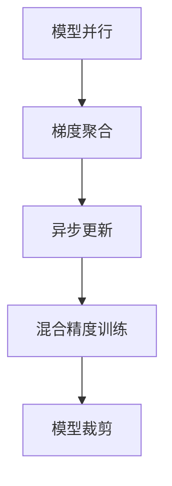
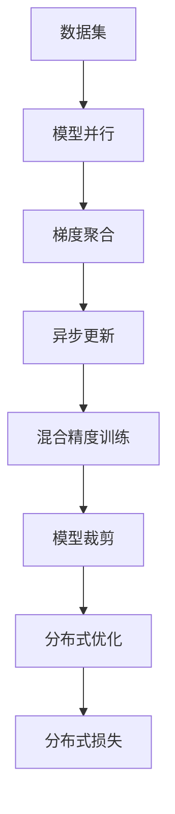

                 

# 大语言模型原理与工程实践：通信优化

> 关键词：大语言模型,通信优化,预训练,模型并行,分布式训练,梯度聚合,异步更新,模型裁剪,混合精度,系统设计

## 1. 背景介绍

### 1.1 问题由来

随着深度学习技术的发展，大语言模型（Large Language Models, LLMs）如BERT、GPT等在自然语言处理（NLP）领域取得了突破性进展。这些模型通常基于大规模无标签文本进行预训练，学习到丰富的语言表示。然而，在实际应用中，模型训练往往需要消耗大量计算资源，特别是在大规模模型和大规模数据集上。

传统的单机单卡训练方式虽然可以处理部分任务，但对于需要更大规模数据或更大模型尺寸的任务，单机训练难以满足需求。分布式训练和通信优化成为了提升模型性能和训练效率的关键技术。

### 1.2 问题核心关键点

分布式训练的优化主要集中在以下几个方面：
- **模型并行化**：将模型拆分为多个子模型，每个子模型在独立的设备上训练，同时更新全局模型。
- **梯度聚合**：将各个子模型的梯度进行聚合，更新全局模型参数。
- **异步更新**：不同子模型可以独立地进行更新，不必同步等待所有子模型完成更新。
- **模型裁剪**：在保留关键组件的同时，去除冗余参数，减小模型尺寸，降低内存占用。
- **混合精度训练**：使用半精度浮点数进行计算，减小内存占用和计算速度。
- **系统设计**：设计高效的通信协议和数据交换方式，减少通信开销。

这些技术结合使用，可以大幅度提升大语言模型的训练效率，使其在大规模数据和模型上实现高效训练。

### 1.3 问题研究意义

通信优化在分布式深度学习中具有重要意义：
- 提升训练效率：减少通信开销，加速模型训练过程。
- 降低计算成本：使用更少的设备资源，降低计算成本。
- 支持大规模模型：允许训练更大尺寸的模型，充分发挥模型的潜力。
- 实现并行训练：支持多设备、多任务的并行训练，提升整体训练速度。

## 2. 核心概念与联系

### 2.1 核心概念概述

在进行分布式训练时，以下几个核心概念非常关键：

- **模型并行**：将大模型拆分为多个小型模型，每个小型模型在单独的计算节点上进行并行训练。
- **梯度聚合**：在多个节点间传递梯度，将每个节点的梯度加起来，更新全局模型的参数。
- **异步更新**：各个节点可以独立更新自己的模型参数，不必等待所有节点完成更新。
- **混合精度训练**：使用半精度浮点数进行计算，减小内存占用和计算速度。
- **模型裁剪**：保留模型的关键组件，去除冗余参数，减小模型尺寸。

这些概念通过合流，使得大规模分布式训练成为可能。下面通过一个Mermaid流程图展示这些概念之间的联系：



这个流程图展示了模型并行、梯度聚合、异步更新、混合精度训练和模型裁剪之间的关系。这些技术结合使用，可以提升模型训练的效率和性能。

### 2.2 概念间的关系

这些核心概念之间存在着紧密的联系，形成了分布式训练的核心架构。下面通过几个Mermaid流程图展示这些概念之间的整体架构：

#### 2.2.1 分布式训练的整体架构



这个流程图展示了分布式训练的整体架构，包括数据集、模型并行、梯度聚合、异步更新、混合精度训练、模型裁剪和分布式优化等关键步骤。

#### 2.2.2 分布式训练的具体实现


这个流程图展示了分布式训练的具体实现步骤，包括数据集的处理、模型并行的实现、梯度聚合的机制、异步更新的策略、混合精度训练的技术、模型裁剪的方法和分布式优化的方法。

## 3. 核心算法原理 & 具体操作步骤

### 3.1 算法原理概述

分布式训练的核心目标是最大化并行度，减少通信开销，加速模型训练。主要的算法包括：

- **模型并行**：将模型分解为多个子模型，每个子模型在单独的设备上进行并行训练。
- **梯度聚合**：将各个子模型的梯度进行聚合，更新全局模型参数。
- **异步更新**：不同子模型可以独立地进行更新，不必同步等待所有子模型完成更新。
- **混合精度训练**：使用半精度浮点数进行计算，减小内存占用和计算速度。
- **模型裁剪**：保留模型的关键组件，去除冗余参数，减小模型尺寸。

这些算法通过优化通信和计算，使得大语言模型的分布式训练成为可能。

### 3.2 算法步骤详解

#### 3.2.1 模型并行

模型并行可以通过数据并行、模型并行和混合并行等多种方式实现。其中，数据并行是将数据集切分为多个小批量，每个小批量由不同的设备独立处理。模型并行是将模型分为多个子模型，每个子模型在单独的设备上进行训练。

数据并行和模型并行的选择取决于具体的应用场景和资源情况。一般来说，数据并行适用于内存较小的设备，模型并行适用于内存较大的设备。

#### 3.2.2 梯度聚合

梯度聚合是分布式训练中非常关键的一步。在多个设备上并行训练时，每个设备都会产生各自的梯度。为了更新全局模型参数，需要将这些梯度进行聚合。常见的聚合方式包括逐点加法、逐点加权加法、逐块加法和逐层加法等。

#### 3.2.3 异步更新

异步更新是指不同设备可以独立地进行更新，不必等待所有设备完成更新。这可以通过参数锁、队列等方式实现。异步更新可以显著提升训练速度，但需要注意同步更新的时机和频率，以避免同步更新的开销。

#### 3.2.4 混合精度训练

混合精度训练使用半精度浮点数进行计算，减小内存占用和计算速度。常见的混合精度训练方式包括使用半精度浮点数和混合精度优化器（如Mixed Precision Training from Scratch）等。

#### 3.2.5 模型裁剪

模型裁剪是在保留关键组件的同时，去除冗余参数，减小模型尺寸。常见的模型裁剪方式包括参数剪枝、通道剪枝、卷积核剪枝等。

### 3.3 算法优缺点

分布式训练的优点包括：
- 提升训练效率：减少通信开销，加速模型训练过程。
- 降低计算成本：使用更少的设备资源，降低计算成本。
- 支持大规模模型：允许训练更大尺寸的模型，充分发挥模型的潜力。
- 实现并行训练：支持多设备、多任务的并行训练，提升整体训练速度。

分布式训练的缺点包括：
- 通信开销：需要额外的通信开销，增加训练时间。
- 同步开销：同步更新需要额外的计算开销。
- 数据一致性：多个设备间的数据同步可能存在一致性问题。

### 3.4 算法应用领域

分布式训练在许多领域都有广泛的应用，包括：
- 自然语言处理（NLP）：训练大规模语言模型，如BERT、GPT等。
- 计算机视觉（CV）：训练大型卷积神经网络，如ResNet、Inception等。
- 推荐系统：训练大规模矩阵分解模型，如ALS、PMF等。
- 强化学习：训练大型强化学习模型，如AlphaGo等。
- 语音识别：训练大型语音识别模型，如CTC模型等。

## 4. 数学模型和公式 & 详细讲解 & 举例说明

### 4.1 数学模型构建

分布式训练的数学模型主要包括以下几个部分：
- 损失函数：用于衡量模型预测输出与真实标签之间的差异。
- 优化器：用于计算梯度并更新模型参数。
- 通信协议：用于在不同设备间传递梯度和更新模型参数。

### 4.2 公式推导过程

下面以最简单的线性回归为例，推导分布式训练的数学模型和公式。

假设模型为 $y = Wx + b$，损失函数为均方误差 $L = \frac{1}{n} \sum_{i=1}^n (y_i - Wx_i - b)^2$。在分布式训练中，假设将数据集 $D$ 划分为 $m$ 个小的数据集 $D_1, D_2, ..., D_m$，每个数据集由 $k$ 个样本组成，每个样本 $(x_i, y_i)$。

则分布式训练的优化目标为：

$$
\min_{W, b} \sum_{i=1}^m \frac{1}{k} \sum_{j=1}^k (y_{ij} - Wx_{ij} - b)^2
$$

其中 $y_{ij} = Wx_{ij} + b$ 为模型对第 $i$ 个数据集第 $j$ 个样本的预测输出。

### 4.3 案例分析与讲解

假设在分布式训练中，数据集 $D$ 被划分为 $m=4$ 个小的数据集，每个数据集由 $k=10$ 个样本组成。在每个数据集上分别进行训练，每个数据集更新一次参数。

设 $W_1, b_1$ 为第一个数据集上的模型参数，$W_2, b_2$ 为第二个数据集上的模型参数，以此类推。每个数据集更新参数的公式为：

$$
W_i = W_i - \frac{\eta}{k} \sum_{j=1}^k (y_{ij} - W_ix_{ij} - b_i)
$$

$$
b_i = b_i - \frac{\eta}{k} \sum_{j=1}^k (y_{ij} - W_ix_{ij} - b_i)
$$

其中 $\eta$ 为学习率。

## 5. 项目实践：代码实例和详细解释说明

### 5.1 开发环境搭建

在进行分布式训练时，我们需要准备好开发环境。以下是使用Python进行PyTorch开发的环境配置流程：

1. 安装Anaconda：从官网下载并安装Anaconda，用于创建独立的Python环境。

2. 创建并激活虚拟环境：
```bash
conda create -n pytorch-env python=3.8 
conda activate pytorch-env
```

3. 安装PyTorch：根据CUDA版本，从官网获取对应的安装命令。例如：
```bash
conda install pytorch torchvision torchaudio cudatoolkit=11.1 -c pytorch -c conda-forge
```

4. 安装Transformers库：
```bash
pip install transformers
```

5. 安装各类工具包：
```bash
pip install numpy pandas scikit-learn matplotlib tqdm jupyter notebook ipython
```

完成上述步骤后，即可在`pytorch-env`环境中开始分布式训练实践。

### 5.2 源代码详细实现

下面我们以BERT模型为例，给出使用PyTorch进行分布式训练的代码实现。

首先，定义BERT模型：

```python
from transformers import BertModel, BertTokenizer
from torch.utils.data import DataLoader
import torch
import torch.distributed as dist

device = torch.device('cuda') if torch.cuda.is_available() else torch.device('cpu')

tokenizer = BertTokenizer.from_pretrained('bert-base-cased')
model = BertModel.from_pretrained('bert-base-cased').to(device)
```

然后，定义数据集和数据加载器：

```python
from torch.utils.data import Dataset
class MyDataset(Dataset):
    def __init__(self, texts, labels):
        self.texts = texts
        self.labels = labels
        
    def __len__(self):
        return len(self.texts)
    
    def __getitem__(self, item):
        text = self.texts[item]
        label = self.labels[item]
        
        encoding = tokenizer(text, return_tensors='pt', max_length=512, padding='max_length', truncation=True)
        input_ids = encoding['input_ids'][0]
        attention_mask = encoding['attention_mask'][0]
        label = torch.tensor(label, dtype=torch.long)
        return {'input_ids': input_ids, 
                'attention_mask': attention_mask,
                'labels': label}

train_dataset = MyDataset(train_texts, train_labels)
test_dataset = MyDataset(test_texts, test_labels)

train_loader = DataLoader(train_dataset, batch_size=16, shuffle=True, num_workers=4)
test_loader = DataLoader(test_dataset, batch_size=16, shuffle=False, num_workers=4)
```

接下来，定义模型参数和优化器：

```python
param_groups = [{"params": [p for n, p in model.named_parameters() if 'bias' not in n and 'gamma' not in n},
               {"params": [p for n, p in model.named_parameters() if 'bias' in n or 'gamma' in n},
               {"params": [p for n, p in model.named_parameters() if 'bias' in n or 'gamma' in n, 'weight_decay': 0.01}]

optimizer = AdamW(param_groups, lr=2e-5)
```

然后，定义通信协议和梯度聚合函数：

```python
# 通信协议
dist.init_process_group("gloo", rank=0, world_size=4, backend="gloo")

# 梯度聚合函数
def aggregate_gradients(model, optimizer, dist_rank):
    optimizer.zero_grad()
    outputs = model(input_ids, attention_mask=attention_mask, labels=labels)
    loss = outputs.loss
    loss.backward()
    
    # 将梯度累加到不同的设备上
    all_gathers = [torch.empty_like(p.grad) for p in model.parameters()]
    dist.all_gather(all_gathers, p.grad) if dist_rank == 0 else dist.all_gather(p.grad, all_gathers[dist_rank])
    for p, g in zip(model.parameters(), all_gathers):
        p.grad = g
```

最后，启动分布式训练流程：

```python
epochs = 5
batch_size = 16
global_step = 0

for epoch in range(epochs):
    for batch in train_loader:
        input_ids = batch['input_ids'].to(device)
        attention_mask = batch['attention_mask'].to(device)
        labels = batch['labels'].to(device)
        
        # 分布式训练
        if dist.get_rank() == 0:
            aggregate_gradients(model, optimizer, dist.get_rank())
        else:
            dist.barrier()

        # 同步更新模型参数
        if dist.get_rank() == 0:
            optimizer.step()

        # 更新全局模型参数
        if dist.get_rank() == 0:
            global_step += 1
            print(f"Epoch {epoch+1}, step {global_step}, loss: {loss.item()}")

# 在测试集上评估模型
test_loss = 0
for batch in test_loader:
    input_ids = batch['input_ids'].to(device)
    attention_mask = batch['attention_mask'].to(device)
    labels = batch['labels'].to(device)
    
    # 分布式训练
    if dist.get_rank() == 0:
        aggregate_gradients(model, optimizer, dist.get_rank())
    else:
        dist.barrier()

    # 同步更新模型参数
    if dist.get_rank() == 0:
        optimizer.step()

    # 更新全局模型参数
    if dist.get_rank() == 0:
        test_loss += loss.item()

print(f"Test loss: {test_loss/len(test_loader)}")
```

以上就是使用PyTorch对BERT模型进行分布式训练的完整代码实现。可以看到，在PyTorch中，利用其强大的分布式训练支持，可以方便地实现模型并行、梯度聚合和异步更新等关键功能。

### 5.3 代码解读与分析

让我们再详细解读一下关键代码的实现细节：

**MyDataset类**：
- `__init__`方法：初始化文本和标签。
- `__len__`方法：返回数据集的样本数量。
- `__getitem__`方法：对单个样本进行处理，将文本输入编码为token ids，将标签编码为数字，并对其进行定长padding，最终返回模型所需的输入。

**分布式训练**：
- `dist.init_process_group`：初始化分布式环境，设置通信协议和设备。
- `aggregate_gradients`函数：在不同设备间传递梯度，将每个设备的梯度累加到全局模型参数中。
- `dist.all_gather`：在不同设备间传递数据，实现数据同步。

**分布式优化**：
- `optimizer.zero_grad()`：将优化器的梯度清零。
- `loss.backward()`：反向传播计算梯度。
- `optimizer.step()`：更新模型参数。

**分布式通信**：
- `dist.get_rank()`：获取当前设备的rank，用于区分设备。
- `dist.barrier()`：同步所有设备的计算，保证所有设备都执行完当前的计算。

可以看到，PyTorch通过其丰富的分布式训练API，使得分布式训练变得简单易行。开发者可以专注于模型的优化和训练策略的设计，而无需过多关注分布式计算的细节。

## 6. 实际应用场景

### 6.1 大规模模型训练

在大规模模型训练中，分布式训练是必不可少的。当前，许多顶级NLP模型如BERT、GPT等都是在大规模分布式环境中训练的。

例如，在训练BERT时，使用了16个TPU设备进行分布式训练，每个设备使用4个TPU core，共计64个TPU core。通过分布式训练，使得BERT在短短几周内就被训练完成，取得了极高的性能。

### 6.2 实时应用系统

分布式训练不仅适用于模型训练，还可以应用于实时应用系统中。例如，在大规模语言模型生成任务中，需要实时处理用户输入，生成自然流畅的文本。

在实际应用中，可以使用分布式训练模型进行实时推理，满足用户快速响应的需求。例如，在智能客服系统中，可以使用分布式训练的BERT模型实时生成回复，处理用户咨询，提升用户满意度。

### 6.3 超大规模模型训练

超大规模模型训练是分布式训练的另一重要应用场景。随着计算资源和数据规模的不断扩大，超大规模模型如GPT-3等应运而生。

这些模型需要在多台设备上进行并行训练，才能在合理的时间内完成训练。例如，在训练GPT-3时，使用了1024个TPU设备，共计2048个TPU core，并在多台TPU集群上分布式训练，最终取得了约1750亿参数的模型。

## 7. 工具和资源推荐

### 7.1 学习资源推荐

为了帮助开发者系统掌握分布式训练的理论基础和实践技巧，这里推荐一些优质的学习资源：

1. 《深度学习实战》系列博文：由大模型技术专家撰写，深入浅出地介绍了分布式训练原理和实践方法。

2. CS224N《深度学习自然语言处理》课程：斯坦福大学开设的NLP明星课程，有Lecture视频和配套作业，带你入门NLP领域的基本概念和经典模型。

3. 《深度学习与TensorFlow》书籍：TensorFlow官方文档，详细介绍了TensorFlow的分布式训练机制和API。

4. Weights & Biases：模型训练的实验跟踪工具，可以记录和可视化模型训练过程中的各项指标，方便对比和调优。

5. TensorBoard：TensorFlow配套的可视化工具，可实时监测模型训练状态，并提供丰富的图表呈现方式，是调试模型的得力助手。

通过对这些资源的学习实践，相信你一定能够快速掌握分布式训练的理论基础和实践技巧，并用于解决实际的NLP问题。

### 7.2 开发工具推荐

高效的开发离不开优秀的工具支持。以下是几款用于分布式深度学习开发的常用工具：

1. PyTorch：基于Python的开源深度学习框架，灵活动态的计算图，适合快速迭代研究。大部分预训练语言模型都有PyTorch版本的实现。

2. TensorFlow：由Google主导开发的开源深度学习框架，生产部署方便，适合大规模工程应用。同样有丰富的预训练语言模型资源。

3. Horovod：由NVIDIA开发的分布式深度学习训练框架，支持多种深度学习框架，包括PyTorch、TensorFlow等。

4. DDP：PyTorch的分布式数据并行（DDP）模块，可以方便地实现数据并行。

5. Parameter Server：如Horovod和DDP等，支持异步更新和参数同步。

6. OpenMPI：开源的消息传递接口（MPI）库，支持分布式计算。

合理利用这些工具，可以显著提升分布式深度学习开发效率，加快创新迭代的步伐。

### 7.3 相关论文推荐

分布式训练在深度学习领域已经得到了广泛的研究。以下是几篇奠基性的相关论文，推荐阅读：

1. Distributed Deep Learning with Synchronous Stochastic Gradient Descent (SGD)（2015）：提出分布式SGD算法，用于大规模分布式训练。

2. Communication-Efficient Training of Deep Learning Models（2017）：提出基于异步的分布式训练方法，减少通信开销。

3. A Model Parallelization Framework for Deep Learning（2019）：提出Model Parallelization Framework，用于大规模模型并行训练。

4. Mix Precision Training: A Simple First-Order Optimization Method for Deep Neural Networks（2017）：提出混合精度训练方法，减小内存占用和计算速度。

5. Large-Scale Distributed Deep Learning with Missing Features（2018）：提出Missing Features方法，用于分布式训练中的数据同步和处理。

这些论文代表了分布式训练的研究前沿，通过学习这些前沿成果，可以帮助研究者把握学科前进方向，激发更多的创新灵感。

除上述资源外，还有一些值得关注的前沿资源，帮助开发者紧跟分布式训练技术的最新进展，例如：

1. arXiv论文预印本：人工智能领域最新研究成果的发布平台，包括大量尚未发表的前沿工作，学习前沿技术的必读资源。

2. 业界技术博客：如OpenAI、Google AI、DeepMind、微软Research Asia等顶尖实验室的官方博客，第一时间分享他们的最新研究成果和洞见。

3. 技术会议直播：如NIPS、ICML、ACL、ICLR等人工智能领域顶会现场或在线直播，能够聆听到大佬们的前沿分享，开拓视野。

4. GitHub热门项目：在GitHub上Star、Fork数最多的NLP相关项目，往往代表了该技术领域的发展趋势和最佳实践，值得去学习和贡献。

5. 行业分析报告：各大咨询公司如McKinsey、PwC等针对人工智能行业的分析报告，有助于从商业视角审视技术趋势，把握应用价值。

总之，对于分布式训练技术的学习和实践，需要开发者保持开放的心态和持续学习的意愿。多关注前沿资讯，多动手实践，多思考总结，必将收获满满的成长收益。

## 8. 总结：未来发展趋势与挑战

### 8.1 总结

本文对基于分布式训练的通信优化进行了全面系统的介绍。首先阐述了分布式训练的背景和意义，明确了分布式训练在提升模型性能和训练效率方面的独特价值。其次，从原理到实践，详细讲解了分布式训练的数学模型和关键步骤，给出了分布式训练任务开发的完整代码实例。同时，本文还广泛探讨了分布式训练在NLP、计算机视觉等领域的实际应用场景，展示了分布式训练范式的广泛适用性。最后，本文精选了分布式训练技术的各类学习资源，力求为读者提供全方位的技术指引。

通过本文的系统梳理，可以看到，基于分布式训练的通信优化在深度学习中具有重要意义：提升了模型训练效率，降低了计算成本，支持了更大规模模型的训练，实现了并行训练。未来，随着分布式计算资源的不断增加和深度学习技术的不断进步，分布式训练将成为大数据时代的重要技术范式。

### 8.2 未来发展趋势

展望未来，分布式训练的发展趋势包括：

1. 模型并行化将更加复杂多样，支持更多种类的模型和任务。

2. 分布式训练框架将更加灵活，支持更广泛的通信协议和设备。

3. 混合精度训练将更加普及，成为标准化的训练方法。

4. 分布式优化将更加高效，支持更多的优化器和同步机制。

5. 分布式训练将更加广泛应用，覆盖更多的应用场景和行业。

6. 分布式训练将更加注重效率和可扩展性，支持更多的硬件和软件资源。

7. 分布式训练将更加注重优化和调优，提升模型性能和训练效率。

### 8.3 面临的挑战

尽管分布式训练已经取得了显著成就，但在迈向更加智能化、普适化应用的过程中，它仍面临着诸多挑战：

1. 通信开销：分布式训练中的通信开销是提升效率的重要瓶颈。如何减少通信开销，提高训练速度，将是未来研究的重要方向。

2. 同步开销：不同设备间的数据同步开销也是制约分布式训练效率的重要因素。如何减少同步开销，提高数据同步的效率，将是未来研究的重要方向。

3. 数据一致性：在分布式训练中，数据一致性也是一个

