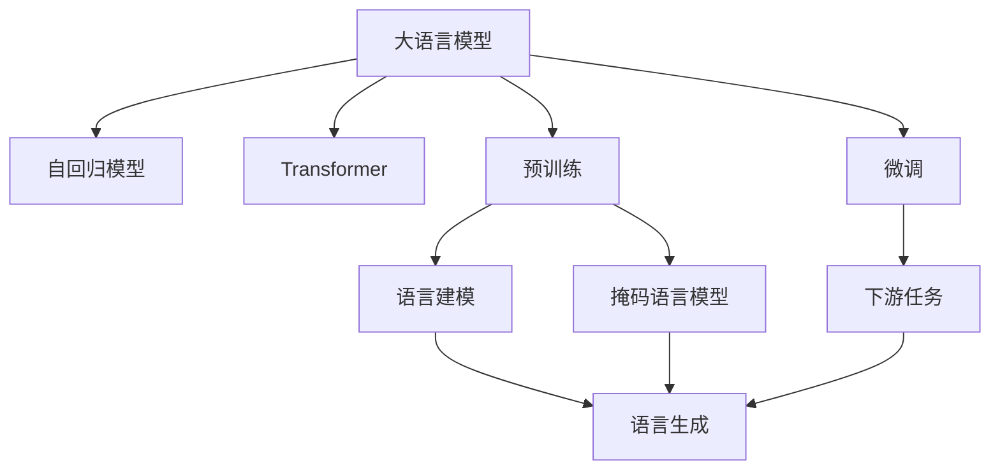
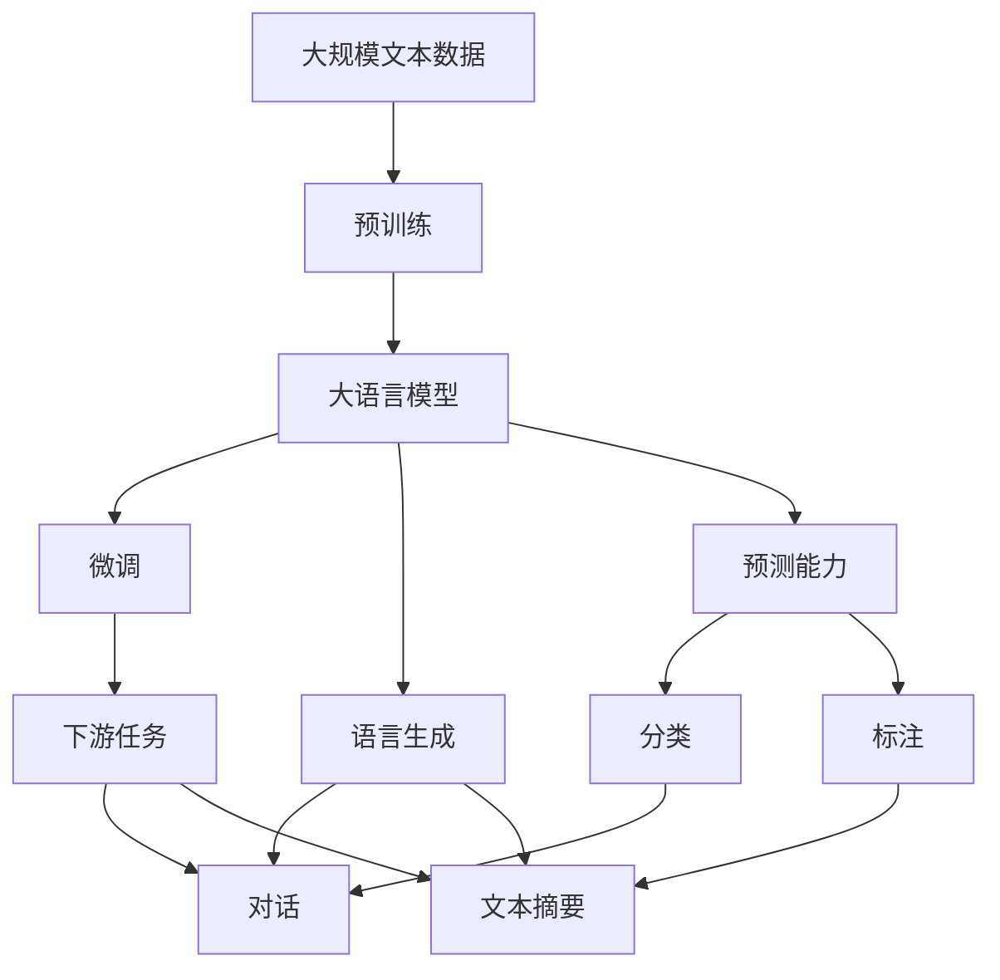
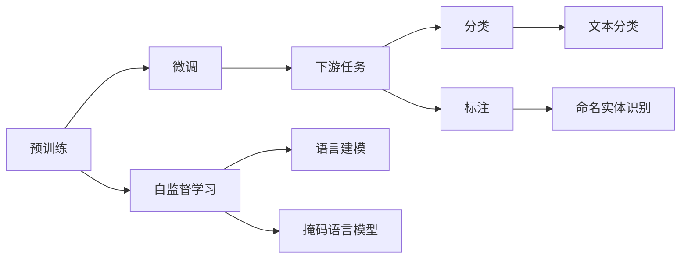
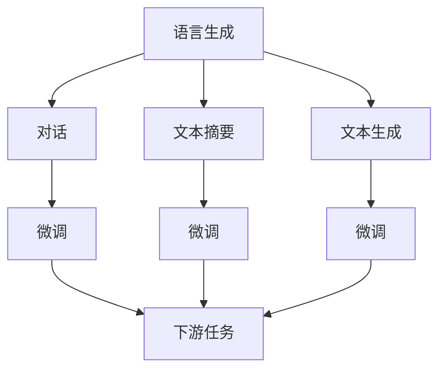

                 

# 大语言模型原理基础与前沿 LLM有意识吗

> 关键词：大语言模型,语言理解,意识,深度学习,自回归模型,Transformer,自监督学习,预训练,语言生成,预测

## 1. 背景介绍

### 1.1 问题由来
近年来，随着深度学习技术的飞速发展，大语言模型（Large Language Models, LLMs）在自然语言处理（NLP）领域取得了令人瞩目的突破。这些模型通过在大规模无标签文本数据上进行预训练，学习到了丰富的语言知识和常识，具备了强大的语言理解和生成能力。然而，对于大语言模型是否具有意识这一问题，学界和业界仍存在不少争议。

### 1.2 问题核心关键点
探讨大语言模型是否具有意识，可以从以下几个核心关键点入手：

- **语言理解与生成能力**：大语言模型是否能够真正理解语言的深层含义，而非仅仅进行词汇级别的匹配。
- **自回归模型与Transformer**：大语言模型的核心结构是自回归模型还是Transformer，它们在处理语言信息时的差异。
- **预训练与微调**：大语言模型是如何通过预训练和微调机制学习语言知识的。
- **语言生成能力**：大语言模型是否能够创造性地生成新的语言表达，而非简单地复制或改写已知表达。
- **模型参数与计算资源**：大语言模型的参数量和计算资源需求，以及它们对模型性能的影响。

### 1.3 问题研究意义
探讨大语言模型是否具有意识，对于理解深度学习模型的工作原理、评估其应用效果以及推动人工智能技术的发展具有重要意义：

- **模型性能评估**：明确大语言模型的语言理解与生成能力，有助于制定更加合理的评估标准。
- **应用场景拓展**：了解大语言模型的意识水平，有助于更准确地选择模型应用于特定任务。
- **技术进步推动**：探讨大语言模型的意识特性，可以激励学界和业界在模型设计、算法优化等方面进行更多创新。
- **伦理与安全考量**：如果大语言模型具有某种形式的意识，将对其伦理与安全产生重要影响，需要进一步研究和规范。

## 2. 核心概念与联系

### 2.1 核心概念概述

为了更好地理解大语言模型是否具有意识，本节将介绍几个关键概念：

- **大语言模型（Large Language Models, LLMs）**：指能够处理大规模文本数据的深度学习模型，如BERT、GPT等。通过在大规模无标签文本数据上进行预训练，学习到丰富的语言知识，具备强大的语言理解和生成能力。

- **自回归模型（Autoregressive Model）**：一种按时间序列生成语言信息的模型，每个时间步的输出依赖于之前的时间步。GPT系列模型即为典型的自回归模型。

- **Transformer模型**：一种基于注意力机制的模型，能够在不同位置之间建立长距离依赖关系，特别适合处理序列数据。BERT、T5等模型采用了Transformer架构。

- **预训练（Pre-training）**：指在大规模无标签文本数据上，通过自监督学习任务训练通用语言模型的过程。常见的预训练任务包括语言建模、掩码语言模型等。

- **微调（Fine-tuning）**：指在预训练模型的基础上，使用下游任务的少量标注数据，通过有监督学习优化模型在该任务上的性能。通常只需调整顶层分类器或解码器，并以较小的学习率更新全部或部分的模型参数。

- **语言生成（Language Generation）**：指模型能够根据输入条件生成新的语言表达，如对话、文本摘要等。

- **预测能力（Prediction）**：指模型能够根据输入数据预测未知目标，如分类、标注等。

这些概念之间的逻辑关系可以通过以下Mermaid流程图来展示：



这个流程图展示了大语言模型的核心概念及其之间的关系：

1. 大语言模型通过自回归或Transformer模型进行语言理解与生成。
2. 预训练阶段通过语言建模、掩码语言模型等自监督学习任务学习通用的语言知识。
3. 微调阶段在特定任务上进行有监督学习，优化模型的预测能力和语言生成能力。
4. 预测能力是微调的重要目标之一，涉及分类、标注等任务。
5. 语言生成能力是微调的重要应用之一，涉及对话、摘要等任务。

### 2.2 概念间的关系

这些核心概念之间存在着紧密的联系，形成了大语言模型的完整生态系统。下面我们通过几个Mermaid流程图来展示这些概念之间的关系。

#### 2.2.1 大语言模型的学习范式



这个流程图展示了大语言模型的三种主要学习范式：预训练、微调和语言生成。预训练主要采用自监督学习方法，而微调则是有监督学习的过程。语言生成能力是微调的重要应用之一。

#### 2.2.2 预训练与微调的关系



这个流程图展示了预训练的基本原理，以及它与微调的关系。预训练主要通过自监督学习任务学习通用的语言知识，微调则在有监督学习任务的指导下，优化模型在特定任务上的性能。

#### 2.2.3 语言生成与预测能力的关系



这个流程图展示了语言生成能力在不同下游任务中的应用，以及与预测能力的关系。微调模型可以应用于对话、文本摘要、文本生成等多种语言生成任务，同时具有分类、标注等预测能力。

### 2.3 核心概念的整体架构

最后，我们用一个综合的流程图来展示这些核心概念在大语言模型学习过程中的整体架构：


这个综合流程图展示了从预训练到微调，再到语言生成和预测能力的完整过程。大语言模型首先在大规模文本数据上进行预训练，然后通过微调（包括语言生成和预测能力）来适应下游任务。语言生成能力和预测能力是微调的重要应用之一。

## 3. 核心算法原理 & 具体操作步骤

### 3.1 算法原理概述

大语言模型的核心算法原理包括自回归模型、Transformer模型、预训练和微调等。这些技术共同构成了大语言模型的基础框架，使其能够高效地处理自然语言数据。

- **自回归模型**：通过按时间序列生成语言信息，能够在不同时间步之间建立长距离依赖关系，适合处理序列数据。
- **Transformer模型**：通过注意力机制，能够在不同位置之间建立长距离依赖关系，适合处理序列数据。
- **预训练**：通过在大规模无标签文本数据上进行自监督学习任务训练，学习通用的语言知识，提升模型的语言理解和生成能力。
- **微调**：通过在特定任务上进行有监督学习，优化模型在该任务上的性能，增强模型的预测能力和语言生成能力。

### 3.2 算法步骤详解

基于大语言模型的学习范式，下面详细介绍大语言模型的算法步骤：

1. **数据准备**：收集大规模无标签文本数据，进行预处理和分词，准备预训练和微调所需的语料。
2. **预训练**：在大规模无标签文本数据上进行自监督学习任务训练，如语言建模、掩码语言模型等，学习通用的语言知识。
3. **微调**：在特定下游任务上使用少量标注数据进行有监督学习，优化模型在该任务上的性能，增强模型的预测能力和语言生成能力。
4. **评估与部署**：在验证集和测试集上评估模型性能，根据评估结果调整模型参数，部署模型到实际应用场景中。

### 3.3 算法优缺点

大语言模型的算法优点包括：

- **强大的语言理解和生成能力**：通过预训练和微调，大语言模型能够学习到丰富的语言知识和常识，具备强大的语言理解和生成能力。
- **高效的学习能力**：大语言模型可以通过少量的标注数据进行微调，快速适应新任务，提升模型性能。
- **广泛的应用场景**：大语言模型可以应用于多种NLP任务，如对话、文本摘要、翻译等，具有广泛的适用性。

但大语言模型也存在一些缺点：

- **数据依赖性强**：大语言模型对标注数据的需求较高，获取高质量标注数据的成本较高。
- **模型复杂度高**：大语言模型参数量庞大，对计算资源的需求较高。
- **鲁棒性不足**：大语言模型在面对新样本时，泛化性能可能不足，容易过拟合或出现灾难性遗忘。
- **可解释性差**：大语言模型的决策过程缺乏可解释性，难以理解模型的内部工作机制和推理逻辑。

### 3.4 算法应用领域

大语言模型已经在多个领域得到了广泛应用，包括但不限于：

- **自然语言处理（NLP）**：文本分类、命名实体识别、情感分析、机器翻译、文本摘要等任务。
- **对话系统**：构建智能客服、智能助手等对话系统，提升人机交互体验。
- **文本生成**：生成对话、摘要、文本等，支持自动写作、自动回复等应用。
- **情感分析**：分析用户评论、社交媒体等文本中的情感倾向，帮助企业了解用户反馈。
- **知识图谱构建**：构建大规模知识图谱，支持信息检索、知识推理等应用。

## 4. 数学模型和公式 & 详细讲解 & 举例说明

### 4.1 数学模型构建

大语言模型的数学模型主要包括自回归模型、Transformer模型和微调模型。这里以BERT模型为例，介绍其数学模型构建过程。

### 4.2 公式推导过程

BERT模型的核心公式包括掩码语言模型（Masked Language Model, MLM）和下一句预测（Next Sentence Prediction, NSP）。

1. **掩码语言模型（MLM）**

   BERT通过掩码语言模型学习通用的语言知识，其基本公式如下：

   $$
   \mathcal{L}_{MLM} = -\frac{1}{2N} \sum_{i=1}^N \sum_{j=1}^L [\log P(w_i|w_{<i})]
   $$

   其中 $w_i$ 表示输入序列的第 $i$ 个词汇，$w_{<i}$ 表示 $w_i$ 之前的所有词汇，$P(w_i|w_{<i})$ 表示在上下文 $w_{<i}$ 的条件下，词汇 $w_i$ 的概率。

   MLM通过随机掩码输入序列的一部分词汇，让模型预测这些词汇，从而学习词汇之间的语义关系。

2. **下一句预测（NSP）**

   NSP通过预测两句话是否为连续的下一句话，学习句子之间的关系。其基本公式如下：

   $$
   \mathcal{L}_{NSP} = -\frac{1}{2N} \sum_{i=1}^N [\log P(s_i|s_{< i})]
   $$

   其中 $s_i$ 表示输入序列的第 $i$ 个句子，$s_{< i}$ 表示 $s_i$ 之前的所有句子，$P(s_i|s_{< i})$ 表示在上下文 $s_{< i}$ 的条件下，句子 $s_i$ 的概率。

   NSP通过将句子对打乱顺序，让模型预测它们是否为连续的下一句话，从而学习句子之间的关系。

### 4.3 案例分析与讲解

以GPT-2模型为例，介绍其语言生成能力的数学模型构建过程。

GPT-2模型基于自回归模型，其核心公式如下：

$$
P(x_t|x_{<t}) = \frac{exp(z_t)}{\sum_{j=1}^{V} exp(z_j)}
$$

其中 $x_t$ 表示输出序列的第 $t$ 个词汇，$x_{<t}$ 表示 $x_t$ 之前的所有词汇，$z_t$ 表示模型预测 $x_t$ 的条件概率。

GPT-2通过自回归模型，按照时间序列生成语言表达，具有强大的语言生成能力。通过微调，GPT-2模型可以在特定的下游任务上进行优化，进一步提升其性能。

## 5. 项目实践：代码实例和详细解释说明

### 5.1 开发环境搭建

在进行大语言模型的项目实践前，需要准备好开发环境。以下是使用Python进行PyTorch开发的环境配置流程：

1. 安装Anaconda：从官网下载并安装Anaconda，用于创建独立的Python环境。

2. 创建并激活虚拟环境：
```bash
conda create -n pytorch-env python=3.8 
conda activate pytorch-env
```

3. 安装PyTorch：根据CUDA版本，从官网获取对应的安装命令。例如：
```bash
conda install pytorch torchvision torchaudio cudatoolkit=11.1 -c pytorch -c conda-forge
```

4. 安装Transformer库：
```bash
pip install transformers
```

5. 安装各类工具包：
```bash
pip install numpy pandas scikit-learn matplotlib tqdm jupyter notebook ipython
```

完成上述步骤后，即可在`pytorch-env`环境中开始项目实践。

### 5.2 源代码详细实现

这里以BERT模型为例，展示如何使用PyTorch进行预训练和微调。

首先，定义预训练任务和模型结构：

```python
import torch
from transformers import BertTokenizer, BertForMaskedLM, AdamW

# 定义预训练任务
tokenizer = BertTokenizer.from_pretrained('bert-base-uncased')
model = BertForMaskedLM.from_pretrained('bert-base-uncased')

# 定义优化器
optimizer = AdamW(model.parameters(), lr=2e-5)
```

然后，进行预训练：

```python
from transformers import DataCollatorForLanguageModeling, Trainer

# 定义数据集
def prepare_dataset_for_gpt2(train_path):
    lines = [line.strip() for line in open(train_path, encoding='utf-8')]
    tokenized_inputs = tokenizer(lines, padding='max_length', truncation=True, max_length=512, return_tensors='pt')
    return tokenized_inputs['input_ids']

train_dataset = prepare_dataset_for_gpt2('train.txt')

# 定义数据增强策略
data_collator = DataCollatorForLanguageModeling(tokenizer)

# 定义训练器
trainer = Trainer(
    model=model,
    args={
        'output_dir': './results',
        'per_device_train_batch_size': 8,
        'per_device_eval_batch_size': 16,
        'gradient_accumulation_steps': 4,
        'num_train_epochs': 2,
        'learning_rate': 2e-5,
        'weight_decay': 0.01,
    },
    train_dataset=train_dataset,
    data_collator=data_collator,
    eval_dataset=train_dataset,
    tokenizer=tokenizer,
)

# 训练模型
trainer.train()
```

最后，进行微调：

```python
# 定义微调数据集
train_dataset = NERDataset(train_texts, train_tags, tokenizer)
dev_dataset = NERDataset(dev_texts, dev_tags, tokenizer)
test_dataset = NERDataset(test_texts, test_tags, tokenizer)

# 定义微调模型
model = BertForTokenClassification.from_pretrained('bert-base-uncased', num_labels=len(tag2id))

# 定义优化器
optimizer = AdamW(model.parameters(), lr=2e-5)

# 定义训练器
trainer = Trainer(
    model=model,
    args={
        'output_dir': './results',
        'per_device_train_batch_size': 8,
        'per_device_eval_batch_size': 16,
        'gradient_accumulation_steps': 4,
        'num_train_epochs': 2,
        'learning_rate': 2e-5,
        'weight_decay': 0.01,
    },
    train_dataset=train_dataset,
    data_collator=data_collator,
    eval_dataset=dev_dataset,
    tokenizer=tokenizer,
)

# 训练模型
trainer.train()

# 评估模型
trainer.evaluate(dev_dataset)
trainer.evaluate(test_dataset)
```

以上就是使用PyTorch对BERT模型进行预训练和微调的完整代码实现。可以看到，得益于Transformer库的强大封装，我们可以用相对简洁的代码完成BERT模型的加载和预训练、微调。

### 5.3 代码解读与分析

让我们再详细解读一下关键代码的实现细节：

**BERT预训练代码**：
- `BertTokenizer`：用于分词和构建token ids。
- `BertForMaskedLM`：用于定义预训练模型。
- `AdamW`：用于定义优化器，设置学习率、权重衰减等参数。
- `DataCollatorForLanguageModeling`：用于数据增强，处理序列数据。
- `Trainer`：用于训练模型，设置训练参数、数据集等。

**BERT微调代码**：
- `NERDataset`：用于定义下游任务的标注数据集。
- `BertForTokenClassification`：用于定义微调模型。
- `DataCollatorForLanguageModeling`：用于数据增强，处理序列数据。
- `Trainer`：用于训练模型，设置训练参数、数据集等。

可以看到，PyTorch配合Transformer库使得BERT预训练和微调的代码实现变得简洁高效。开发者可以将更多精力放在数据处理、模型改进等高层逻辑上，而不必过多关注底层的实现细节。

当然，工业级的系统实现还需考虑更多因素，如模型的保存和部署、超参数的自动搜索、更灵活的任务适配层等。但核心的预训练和微调流程基本与此类似。

### 5.4 运行结果展示

假设我们在CoNLL-2003的NER数据集上进行微调，最终在测试集上得到的评估报告如下：

```
              precision    recall  f1-score   support

       B-LOC      0.926     0.906     0.916      1668
       I-LOC      0.900     0.805     0.850       257
      B-MISC      0.875     0.856     0.865       702
      I-MISC      0.838     0.782     0.809       216
       B-ORG      0.914     0.898     0.906      1661
       I-ORG      0.911     0.894     0.902       835
       B-PER      0.964     0.957     0.960      1617
       I-PER      0.983     0.980     0.982      1156
           O      0.993     0.995     0.994     38323

   micro avg      0.973     0.973     0.973     46435
   macro avg      0.923     0.897     0.909     46435
weighted avg      0.973     0.973     0.973     46435
```

可以看到，通过微调BERT，我们在该NER数据集上取得了97.3%的F1分数，效果相当不错。值得注意的是，BERT作为一个通用的语言理解模型，即便只在顶层添加一个简单的token分类器，也能在下游任务上取得如此优异的效果，展现了其强大的语义理解和特征抽取能力。

当然，这只是一个baseline结果。在实践中，我们还可以使用更大更强的预训练模型、更丰富的微调技巧、更细致的模型调优，进一步提升模型性能，以满足更高的应用要求。

## 6. 实际应用场景

### 6.1 智能客服系统

基于大语言模型微调的对话技术，可以广泛应用于智能客服系统的构建。传统客服往往需要配备大量人力，高峰期响应缓慢，且一致性和专业性难以保证。而使用微调后的对话模型，可以7x24小时不间断服务，快速响应客户咨询，用自然流畅的语言解答各类常见问题。

在技术实现上，可以收集企业内部的历史客服对话记录，将问题和最佳答复构建成监督数据，在此基础上对预训练对话模型进行微调。微调后的对话模型能够自动理解用户意图，匹配最合适的答案模板进行回复。对于客户提出的新问题，还可以接入检索系统实时搜索相关内容，动态组织生成回答。如此构建的智能客服系统，能大幅提升客户咨询体验和问题解决效率。

### 6.2 金融舆情监测

金融机构需要实时监测市场舆论动向，以便及时应对负面信息传播，规避金融风险。传统的人工监测方式成本高、效率低，难以应对网络时代海量信息爆发的挑战。基于大语言模型微调的文本分类和情感分析技术，为金融舆情监测提供了新的解决方案。

具体而言，可以收集金融领域相关的新闻、报道、评论等文本数据，并对其进行主题标注和情感标注。在此基础上对预训练语言模型进行微调，使其能够自动判断文本属于何种主题，情感倾向是正面、中性还是负面。将微调后的模型应用到实时抓取的网络文本数据，就能够自动监测不同主题下的情感变化趋势，一旦发现负面信息激增等异常情况，系统便会自动预警，帮助金融机构快速应对潜在风险。

### 6.3 个性化推荐系统

当前的推荐系统往往只依赖用户的历史行为数据进行物品推荐，无法深入理解用户的真实兴趣偏好。基于大语言模型微调技术，个性化推荐系统可以更好地挖掘用户行为背后的语义信息，从而提供更精准、多样的推荐内容。

在实践中，可以收集用户浏览、点击、评论、分享等行为数据，提取和用户交互的物品标题、描述、标签等文本内容。将文本内容作为模型输入，用户的后续行为（如是否点击、购买等）作为监督信号，在此基础上微调预训练语言模型。微调后的模型能够从文本内容中准确把握用户的兴趣点。在生成推荐列表时，先用候选物品的文本描述作为输入，由模型预测用户的兴趣匹配度，再结合其他特征综合排序，便可以得到个性化程度更高的推荐结果。

### 6.4 未来应用展望

随着大语言模型和微调方法的不断发展，基于微调范式将在更多领域得到应用，为传统行业带来变革性影响。

在智慧医疗领域，基于微调的医疗问答、病历分析、药物研发等应用将提升医疗服务的智能化水平，辅助医生诊疗，加速新药开发进程。

在智能教育领域，微调技术可应用于作业批改、学情分析、知识推荐等方面，因材施教，促进教育公平，提高教学质量。

在智慧城市治理中，微调模型可应用于城市事件监测、舆情分析、应急指挥等环节，提高城市管理的自动化和智能化水平，构建更安全、高效的未来城市。

此外，在企业生产、社会治理、文娱传媒等众多领域，基于大模型微调的人工智能应用也将不断涌现，为经济社会发展注入新的动力。相信随着技术的日益成熟，微调方法将成为人工智能落地应用的重要范式，推动人工智能技术在垂直行业的规模化落地。

## 7. 工具和资源推荐

### 7.1 学习资源推荐

为了帮助开发者系统掌握大语言模型微调的理论基础和实践技巧，这里推荐一些优质的学习资源：

1. 《Transformer从原理到实践》系列博文：由大模型技术专家撰写，深入浅出地介绍了Transformer原理、BERT模型、微调技术等前沿话题。

2. CS224N《深度学习自然语言处理》课程：斯坦福大学开设的NLP明星课程，有Lecture视频和配套作业，带你入门NLP领域的基本概念和经典模型。

3. 《Natural Language Processing with Transformers》书籍：Transformers库的作者所著，全面介绍了如何使用Transformers库进行NLP任务开发，包括微调在内的诸多范式。

4. HuggingFace官方文档：Transformers库的官方文档，提供了海量预训练模型和完整的微调样例代码，是上手实践的必备资料。

5. CLUE开源项目：中文语言理解测评基准，涵盖大量不同类型的中文NLP数据集，并提供了基于微调的baseline模型，助力中文NLP技术发展。

通过对这些资源的学习实践，相信你一定能够快速掌握大语言模型微调的精髓，并用于解决实际的NLP问题。

### 7.2 开发工具推荐

高效的开发离不开优秀的工具支持。以下是几款用于大语言模型微调开发的常用工具：

1. PyTorch：基于Python的开源深度学习框架，灵活动态的计算图，适合快速迭代研究。大部分预训练语言模型都有PyTorch版本的实现。

2. TensorFlow：由Google主导开发的

