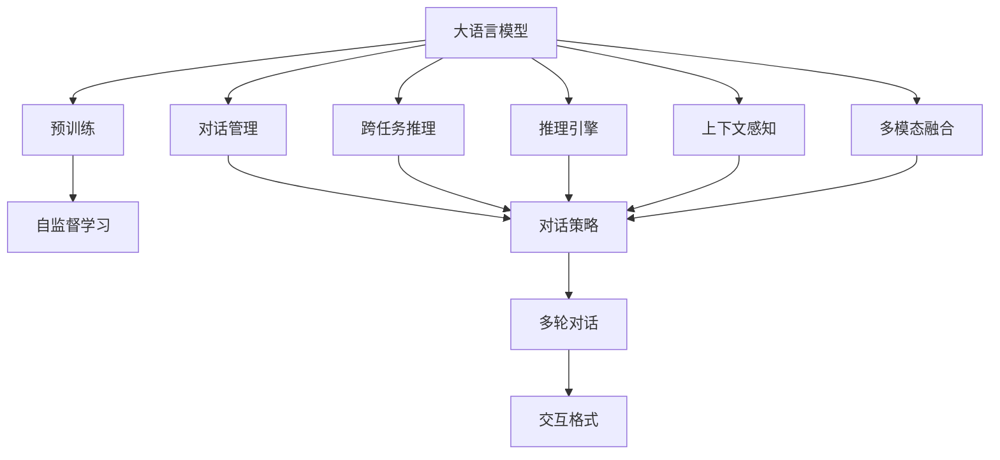
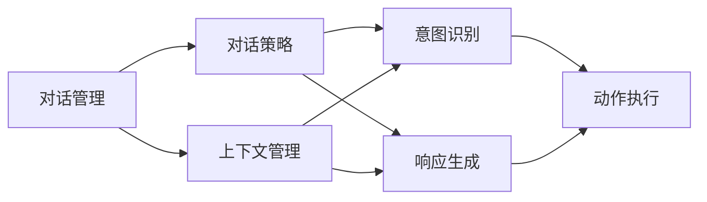
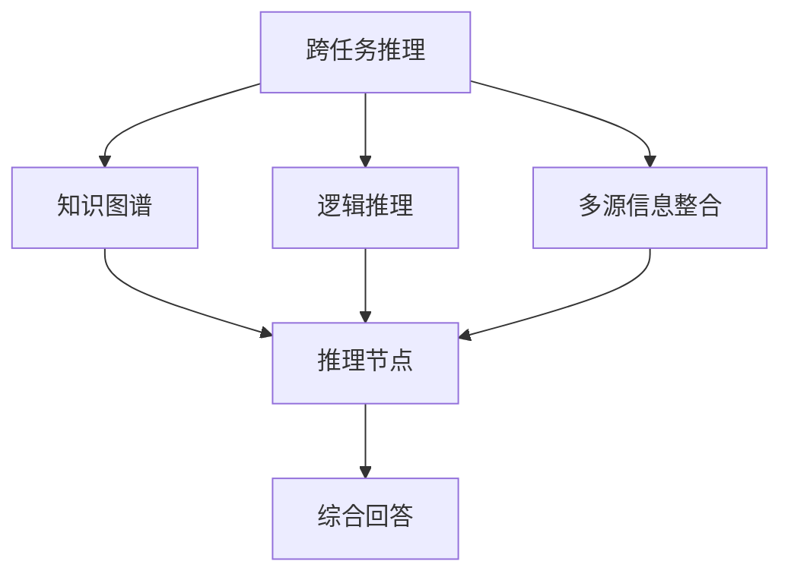
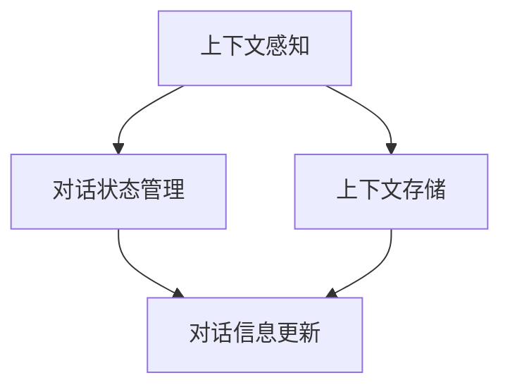
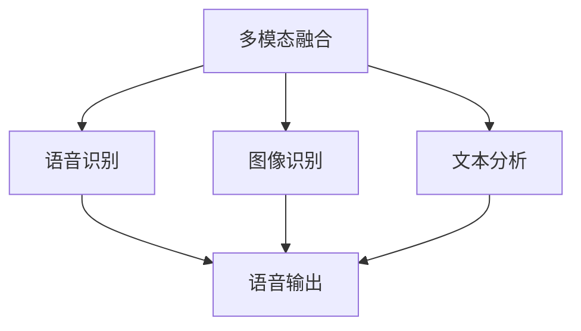
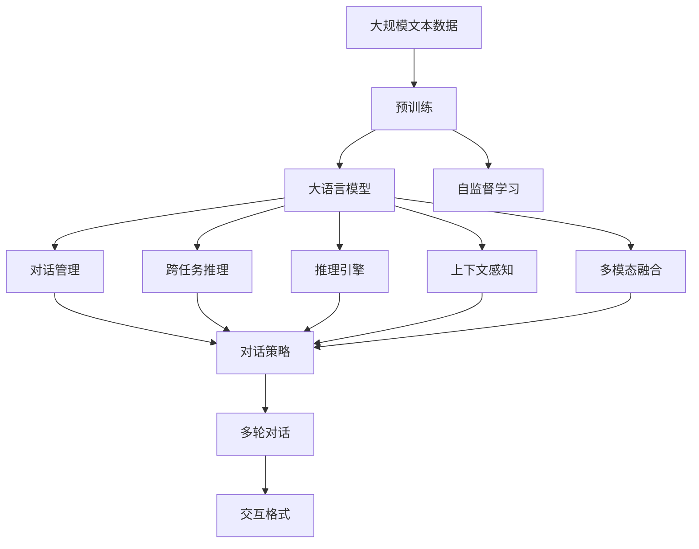

                 

# 大语言模型应用指南：交互格式

> 关键词：大语言模型,交互格式,自然语言理解,NLP,对话系统,API接口,多轮对话,推理引擎

## 1. 背景介绍

### 1.1 问题由来
大语言模型（Large Language Models, LLMs）以其强大的自然语言处理（Natural Language Processing, NLP）能力，在近年来取得了显著的进展。它们基于大规模无标签数据预训练，具备强大的语言理解和生成能力。然而，这些模型往往局限于单轮对话或单一任务，难以适应复杂的交互场景。为了克服这一局限，研究人员提出了交互格式的自然语言处理（Interactive Natural Language Processing, iNLP）方法，通过构建多轮对话和跨任务推理能力，实现与用户的无缝交互。

### 1.2 问题核心关键点
交互格式的大语言模型旨在通过多轮对话和推理机制，提供更自然、更高效的人机交互体验。其核心在于：
1. **多轮对话管理**：通过对话管理策略，确保对话流程的连贯性和一致性。
2. **跨任务推理**：支持用户跨不同任务进行询问，模型能够推理并整合多源信息，提供综合回答。
3. **推理引擎**：基于知识图谱、逻辑推理等技术，提升模型在复杂问题上的推理能力。
4. **上下文感知**：模型能够保持对话上下文信息，避免信息丢失和混淆。
5. **多模态融合**：结合文本、语音、图像等多模态信息，丰富交互体验。

交互格式的大语言模型已在智能客服、智能助手、智能问答等多个场景中得到应用，显著提升了用户体验和系统效率。

### 1.3 问题研究意义
交互格式的大语言模型研究具有重要的理论价值和实际应用意义：
1. **提高人机交互效率**：通过多轮对话和跨任务推理，减少用户的输入负担，提升交互流畅度。
2. **增强系统灵活性**：支持多种类型的任务，提高系统的通用性和可扩展性。
3. **提升用户满意度**：提供更加自然、智能的交互体验，增强用户的满意度和粘性。
4. **推动NLP技术进步**：推动NLP技术从单任务向多任务、多模态方向的深入发展。

## 2. 核心概念与联系

### 2.1 核心概念概述

为了更好地理解交互格式的大语言模型，我们首先介绍几个核心概念：

- **大语言模型**：以自回归（如GPT）或自编码（如BERT）模型为代表的大规模预训练语言模型。通过在大规模无标签文本语料上进行预训练，学习通用的语言表示，具备强大的语言理解和生成能力。

- **交互格式**：通过多轮对话和推理机制，实现与用户的无缝交互。交互格式可以涵盖对话管理、跨任务推理、上下文感知等多种技术手段。

- **对话管理**：通过对话策略，确保对话流程的连贯性和一致性，管理对话状态和上下文信息。

- **跨任务推理**：支持用户跨不同任务进行询问，模型能够推理并整合多源信息，提供综合回答。

- **推理引擎**：基于知识图谱、逻辑推理等技术，提升模型在复杂问题上的推理能力。

- **上下文感知**：模型能够保持对话上下文信息，避免信息丢失和混淆。

- **多模态融合**：结合文本、语音、图像等多模态信息，丰富交互体验。

这些核心概念之间的逻辑关系可以通过以下Mermaid流程图来展示：



这个流程图展示了交互格式的大语言模型的核心概念及其之间的关系：

1. 大语言模型通过预训练获得基础能力。
2. 对话管理、跨任务推理、推理引擎、上下文感知和多模态融合等技术手段，实现与用户的无缝交互。
3. 自监督学习是预训练过程的基础，对话管理、推理引擎等机制通过预训练模型获取语言理解能力。

### 2.2 概念间的关系

这些核心概念之间存在着紧密的联系，形成了交互格式大语言模型的完整生态系统。下面我们通过几个Mermaid流程图来展示这些概念之间的关系。

#### 2.2.1 大语言模型的学习范式


这个流程图展示了大语言模型的学习范式。预训练过程通过自监督学习任务，训练大语言模型通用的语言表示。对话管理、跨任务推理、推理引擎等机制通过预训练模型获取语言理解能力，实现与用户的无缝交互。

#### 2.2.2 对话管理与对话策略



这个流程图展示了对话管理的具体过程。对话管理通过对话策略，确保对话流程的连贯性和一致性。上下文管理用于维护对话状态，意图识别用于理解用户意图，响应生成用于生成合适的回复，动作执行用于执行用户的请求。

#### 2.2.3 跨任务推理与推理引擎



这个流程图展示了跨任务推理的具体过程。跨任务推理通过知识图谱、逻辑推理等技术，支持用户跨不同任务进行询问，模型能够推理并整合多源信息，提供综合回答。

#### 2.2.4 上下文感知与对话状态管理



这个流程图展示了上下文感知的具体过程。上下文感知用于维护对话上下文信息，对话状态管理用于更新和维护对话状态。

#### 2.2.5 多模态融合与交互体验丰富



这个流程图展示了多模态融合的具体过程。多模态融合结合文本、语音、图像等多模态信息，丰富交互体验。

### 2.3 核心概念的整体架构

最后，我们用一个综合的流程图来展示这些核心概念在大语言模型交互格式中的整体架构：



这个综合流程图展示了从预训练到交互格式大语言模型的完整过程。大语言模型首先在大规模文本数据上进行预训练，然后通过对话管理、跨任务推理、推理引擎、上下文感知和多模态融合等机制，实现与用户的无缝交互。自监督学习是预训练过程的基础，对话管理、推理引擎等机制通过预训练模型获取语言理解能力。

## 3. 核心算法原理 & 具体操作步骤
### 3.1 算法原理概述

交互格式的大语言模型微调，本质上是一个多轮对话和跨任务推理的过程。其核心思想是：将预训练的大语言模型视作一个强大的"特征提取器"，通过多轮对话和推理机制，逐步优化模型在特定交互场景中的表现。

形式化地，假设预训练模型为 $M_{\theta}$，其中 $\theta$ 为预训练得到的模型参数。给定交互任务 $T$ 的多轮对话数据 $D=\{(x_i,y_i)\}_{i=1}^N, x_i = (x_{i1}, x_{i2}, ..., x_{im}), y_i = (y_{i1}, y_{i2}, ..., y_{im})$，其中 $x_{ij}$ 为第 $i$ 轮对话的第 $j$ 条消息，$y_{ij}$ 为第 $i$ 轮对话的第 $j$ 条消息对应的回复。微调的目标是找到新的模型参数 $\hat{\theta}$，使得：

$$
\hat{\theta}=\mathop{\arg\min}_{\theta} \mathcal{L}(M_{\theta},D)
$$

其中 $\mathcal{L}$ 为针对任务 $T$ 设计的损失函数，用于衡量模型输出的质量与真实标注之间的差异。常见的损失函数包括交叉熵损失、BLEU等。

通过梯度下降等优化算法，微调过程不断更新模型参数 $\theta$，最小化损失函数 $\mathcal{L}$，使得模型输出逼近真实标注。由于 $\theta$ 已经通过预训练获得了较好的初始化，因此即便在复杂多轮对话中，也能较快收敛到理想的模型参数 $\hat{\theta}$。

### 3.2 算法步骤详解

交互格式的大语言模型微调一般包括以下几个关键步骤：

**Step 1: 准备预训练模型和数据集**
- 选择合适的预训练语言模型 $M_{\theta}$ 作为初始化参数，如 GPT、BERT 等。
- 准备交互任务 $T$ 的多轮对话数据集 $D$，划分为训练集、验证集和测试集。一般要求对话数据与预训练数据的分布不要差异过大。

**Step 2: 添加任务适配层**
- 根据任务类型，在预训练模型顶层设计合适的输出层和损失函数。
- 对于多轮对话任务，通常在顶层添加对话管理策略和推理引擎，以指导模型的对话流程。
- 对于跨任务推理任务，通常需要设计多源信息整合模块，以处理多源信息的融合和推理。

**Step 3: 设置微调超参数**
- 选择合适的优化算法及其参数，如 AdamW、SGD 等，设置学习率、批大小、迭代轮数等。
- 设置正则化技术及强度，包括权重衰减、Dropout、Early Stopping 等。
- 确定冻结预训练参数的策略，如仅微调顶层，或全部参数都参与微调。

**Step 4: 执行梯度训练**
- 将训练集数据分批次输入模型，前向传播计算损失函数。
- 反向传播计算参数梯度，根据设定的优化算法和学习率更新模型参数。
- 周期性在验证集上评估模型性能，根据性能指标决定是否触发 Early Stopping。
- 重复上述步骤直到满足预设的迭代轮数或 Early Stopping 条件。

**Step 5: 测试和部署**
- 在测试集上评估微调后模型 $M_{\hat{\theta}}$ 的性能，对比微调前后的交互质量提升。
- 使用微调后的模型对新对话进行推理预测，集成到实际的应用系统中。
- 持续收集新的对话数据，定期重新微调模型，以适应数据分布的变化。

以上是交互格式的大语言模型微调的一般流程。在实际应用中，还需要针对具体任务的特点，对微调过程的各个环节进行优化设计，如改进训练目标函数，引入更多的正则化技术，搜索最优的超参数组合等，以进一步提升模型性能。

### 3.3 算法优缺点

交互格式的大语言模型微调方法具有以下优点：
1. 简单高效。只需准备少量标注数据，即可对预训练模型进行快速适配，获得较大的性能提升。
2. 通用适用。适用于各种NLP交互任务，包括多轮对话、跨任务推理、问答等，设计简单的任务适配层即可实现微调。
3. 参数高效。利用参数高效微调技术，在固定大部分预训练参数的情况下，仍可取得不错的提升。
4. 效果显著。在学术界和工业界的诸多任务上，基于微调的方法已经刷新了最先进的性能指标。

同时，该方法也存在一定的局限性：
1. 依赖标注数据。微调的效果很大程度上取决于标注数据的质量和数量，获取高质量标注数据的成本较高。
2. 迁移能力有限。当目标任务与预训练数据的分布差异较大时，微调的性能提升有限。
3. 负面效果传递。预训练模型的固有偏见、有害信息等，可能通过微调传递到下游任务，造成负面影响。
4. 可解释性不足。微调模型的决策过程通常缺乏可解释性，难以对其推理逻辑进行分析和调试。

尽管存在这些局限性，但就目前而言，交互格式的大语言模型微调方法仍是最主流范式。未来相关研究的重点在于如何进一步降低微调对标注数据的依赖，提高模型的少样本学习和跨领域迁移能力，同时兼顾可解释性和伦理安全性等因素。

### 3.4 算法应用领域

交互格式的大语言模型微调方法已在NLP领域得到了广泛的应用，覆盖了几乎所有常见任务，例如：

- 智能客服系统：通过多轮对话，实时响应用户咨询，提供自然流畅的客服体验。
- 智能助手：基于多轮对话和跨任务推理，实现智能问答、日程安排、知识查询等功能。
- 智能问答系统：对用户提出的问题，提供准确、详尽的回答。
- 对话生成系统：基于上下文信息，生成连贯、自然的对话内容。
- 机器翻译：通过多轮对话和跨任务推理，支持多语言之间的翻译。
- 文本摘要：基于多轮对话和跨任务推理，自动生成文章摘要。

除了上述这些经典任务外，交互格式的大语言模型微调也被创新性地应用到更多场景中，如可控文本生成、常识推理、代码生成、数据增强等，为NLP技术带来了全新的突破。随着预训练模型和微调方法的不断进步，相信NLP技术将在更广阔的应用领域大放异彩。

## 4. 数学模型和公式 & 详细讲解
### 4.1 数学模型构建

本节将使用数学语言对交互格式的大语言模型微调过程进行更加严格的刻画。

记预训练语言模型为 $M_{\theta}$，其中 $\theta$ 为预训练得到的模型参数。假设交互任务 $T$ 的多轮对话数据为 $D=\{(x_i,y_i)\}_{i=1}^N, x_i = (x_{i1}, x_{i2}, ..., x_{im}), y_i = (y_{i1}, y_{i2}, ..., y_{im})$，其中 $x_{ij}$ 为第 $i$ 轮对话的第 $j$ 条消息，$y_{ij}$ 为第 $i$ 轮对话的第 $j$ 条消息对应的回复。

定义模型 $M_{\theta}$ 在数据样本 $(x,y)$ 上的损失函数为 $\ell(M_{\theta}(x),y)$，则在数据集 $D$ 上的经验风险为：

$$
\mathcal{L}(\theta) = \frac{1}{N} \sum_{i=1}^N \sum_{j=1}^m \ell(M_{\theta}(x_{ij}),y_{ij})
$$

其中 $\ell$ 为多轮对话任务的损失函数，用于衡量模型输出的质量与真实标注之间的差异。常见的损失函数包括交叉熵损失、BLEU等。

微调的优化目标是最小化经验风险，即找到最优参数：

$$
\theta^* = \mathop{\arg\min}_{\theta} \mathcal{L}(\theta)
$$

在实践中，我们通常使用基于梯度的优化算法（如AdamW、SGD等）来近似求解上述最优化问题。设 $\eta$ 为学习率，$\lambda$ 为正则化系数，则参数的更新公式为：

$$
\theta \leftarrow \theta - \eta \nabla_{\theta}\mathcal{L}(\theta) - \eta\lambda\theta
$$

其中 $\nabla_{\theta}\mathcal{L}(\theta)$ 为损失函数对参数 $\theta$ 的梯度，可通过反向传播算法高效计算。

### 4.2 公式推导过程

以下我们以多轮对话任务为例，推导交叉熵损失函数及其梯度的计算公式。

假设模型 $M_{\theta}$ 在输入 $x$ 上的输出为 $\hat{y}=M_{\theta}(x) \in [0,1]$，表示样本属于正类的概率。真实标签 $y \in \{0,1\}$。则二分类交叉熵损失函数定义为：

$$
\ell(M_{\theta}(x),y) = -[y\log \hat{y} + (1-y)\log (1-\hat{y})]
$$

将其代入经验风险公式，得：

$$
\mathcal{L}(\theta) = -\frac{1}{N}\sum_{i=1}^N \sum_{j=1}^m [y_{ij}\log M_{\theta}(x_{ij})+(1-y_{ij})\log(1-M_{\theta}(x_{ij}))
$$

根据链式法则，损失函数对参数 $\theta_k$ 的梯度为：

$$
\frac{\partial \mathcal{L}(\theta)}{\partial \theta_k} = -\frac{1}{N}\sum_{i=1}^N \sum_{j=1}^m (\frac{y_{ij}}{M_{\theta}(x_{ij})}-\frac{1-y_{ij}}{1-M_{\theta}(x_{ij})}) \frac{\partial M_{\theta}(x_{ij})}{\partial \theta_k}
$$

其中 $\frac{\partial M_{\theta}(x_{ij})}{\partial \theta_k}$ 可进一步递归展开，利用自动微分技术完成计算。

在得到损失函数的梯度后，即可带入参数更新公式，完成模型的迭代优化。重复上述过程直至收敛，最终得到适应交互任务的最优模型参数 $\theta^*$。

## 5. 项目实践：代码实例和详细解释说明
### 5.1 开发环境搭建

在进行交互格式的大语言模型微调实践前，我们需要准备好开发环境。以下是使用Python进行PyTorch开发的环境配置流程：

1. 安装Anaconda：从官网下载并安装Anaconda，用于创建独立的Python环境。

2. 创建并激活虚拟环境：
```bash
conda create -n pytorch-env python=3.8 
conda activate pytorch-env
```

3. 安装PyTorch：根据CUDA版本，从官网获取对应的安装命令。例如：
```bash
conda install pytorch torchvision torchaudio cudatoolkit=11.1 -c pytorch -c conda-forge
```

4. 安装Transformers库：
```bash
pip install transformers
```

5. 安装各类工具包：
```bash
pip install numpy pandas scikit-learn matplotlib tqdm jupyter notebook ipython
```

完成上述步骤后，即可在`pytorch-env`环境中开始交互格式的大语言模型微调实践。

### 5.2 源代码详细实现

下面我们以多轮对话任务为例，给出使用Transformers库对GPT模型进行交互格式微调的PyTorch代码实现。

首先，定义交互格式任务的训练数据：

```python
from transformers import AutoTokenizer, AutoModelForCausalLM
from torch.utils.data import Dataset
import torch

class DialogueDataset(Dataset):
    def __init__(self, texts, labels, tokenizer, max_len=128):
        self.texts = texts
        self.labels = labels
        self.tokenizer = tokenizer
        self.max_len = max_len
        
    def __len__(self):
        return len(self.texts)
    
    def __getitem__(self, item):
        text = self.texts[item]
        label = self.labels[item]
        
        encoding = self.tokenizer(text, return_tensors='pt', max_length=self.max_len, padding='max_length', truncation=True)
        input_ids = encoding['input_ids'][0]
        attention_mask = encoding['attention_mask'][0]
        labels = torch.tensor(label, dtype=torch.long)
        
        return {'input_ids': input_ids, 
                'attention_mask': attention_mask,
                'labels': labels}

# 创建dataset
tokenizer = AutoTokenizer.from_pretrained('gpt-3')
train_dataset = DialogueDataset(train_texts, train_labels, tokenizer)
dev_dataset = DialogueDataset(dev_texts, dev_labels, tokenizer)
test_dataset = DialogueDataset(test_texts, test_labels, tokenizer)
```

然后，定义模型和优化器：

```python
from transformers import AutoModelForCausalLM, AdamW

model = AutoModelForCausalLM.from_pretrained('gpt-3', num_labels=2)

optimizer = AdamW(model.parameters(), lr=2e-5)
```

接着，定义训练和评估函数：

```python
from torch.utils.data import DataLoader
from tqdm import tqdm
from sklearn.metrics import accuracy_score

device = torch.device('cuda') if torch.cuda.is_available() else torch.device('cpu')
model.to(device)

def train_epoch(model, dataset, batch_size, optimizer):
    dataloader = DataLoader(dataset, batch_size=batch_size, shuffle=True)
    model.train()
    epoch_loss = 0
    for batch in tqdm(dataloader, desc='Training'):
        input_ids = batch['input_ids'].to(device)
        attention_mask = batch['attention_mask'].to(device)
        labels = batch['labels'].to(device)
        model.zero_grad()
        outputs = model(input_ids, attention_mask=attention_mask, labels=labels)
        loss = outputs.loss
        epoch_loss += loss.item()
        loss.backward()
        optimizer.step()
    return epoch_loss / len(dataloader)

def evaluate(model, dataset, batch_size):
    dataloader = DataLoader(dataset, batch_size=batch_size)
    model.eval()
    preds, labels = [], []
    with torch.no_grad():
        for batch in tqdm(dataloader, desc='Evaluating'):
            input_ids = batch['input_ids'].to(device)
            attention_mask = batch['attention_mask'].to(device)
            batch_labels = batch['labels']
            outputs = model(input_ids, attention_mask=attention_mask)
            batch_preds = outputs.logits.argmax(dim=2).to('cpu').tolist()
            batch_labels = batch_labels.to('cpu').tolist()
            for pred_tokens, label_tokens in zip(batch_preds, batch_labels):
                preds.append(pred_tokens[:len(label_tokens)])
                labels.append(label_tokens)
                
    print(f"Accuracy: {accuracy_score(labels, preds):.2f}")
```

最后，启动训练流程并在测试集上评估：

```python
epochs = 5
batch_size = 16

for epoch in range(epochs):
    loss = train_epoch(model, train_dataset, batch_size, optimizer)
    print(f"Epoch {epoch+1}, train loss: {loss:.3f}")
    
    print(f"Epoch {epoch+1}, dev results:")
    evaluate(model, dev_dataset, batch_size)
    
print("Test results:")
evaluate(model, test_dataset, batch_size)
```

以上就是使用PyTorch对GPT进行交互格式微调的完整代码实现。可以看到，得益于Transformers库的强大封装，我们可以用相对简洁的代码完成GPT模型的加载和交互格式微调。

### 5.3 代码解读与分析

让我们再详细解读一下关键代码的实现细节：

**DialogueDataset类**：
- `__init__`方法：初始化文本、标签、分词器等关键组件。
- `__len__`方法：返回数据集的样本数量。
- `__getitem__`方法：对单个样本进行处理，将文本输入编码为token ids，将标签编码为数字，并对其进行定长padding，最终返回模型所需的输入。

**模型和优化器**：
- 使用PyTorch的AutoModelForCausalLM模块，加载预训练模型GPT-3，并设计合适的输出层和损失函数。
- 使用AdamW优化器进行微调，设置学习率等超参数。

**训练和评估函数**：
- 使用PyTorch的DataLoader对数据集进行批次化加载，供模型训练和推理使用。
- 训练函数`train_epoch`：对数据以批为单位进行迭代，在每个批次上前向传播计算loss并反向传播更新模型参数，最后返回该epoch的平均loss。
- 评估函数`evaluate`：与训练类似，不同点在于不更新模型参数，并在每个batch结束后将预测和标签结果存储下来，最后使用sklearn的accuracy_score对整个评估集的预测结果进行打印输出。

**训练流程**：
- 定义总的epoch数和batch size，开始循环迭代
- 每个epoch内，先在训练集上训练，输出平均loss
- 在验证集上

