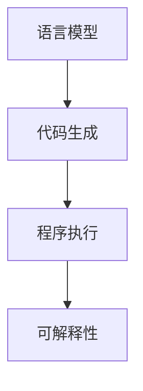
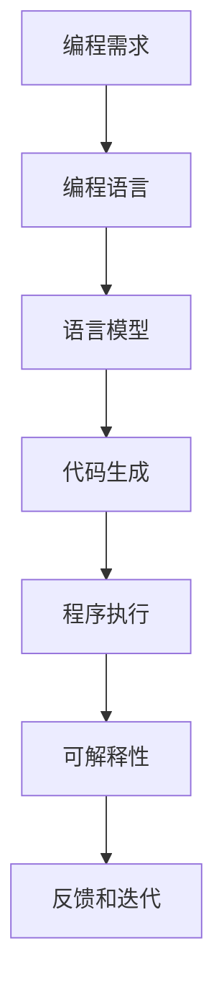
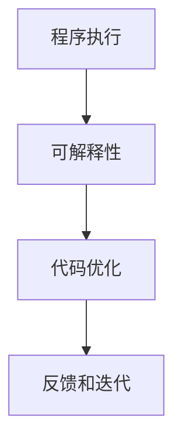
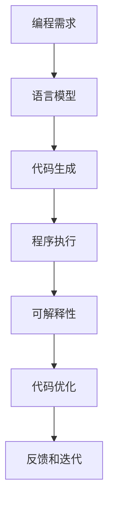

                 

# 大语言模型应用指南：人工编程与自动编程

> 关键词：大语言模型, 自动编程, 人工编程, 深度学习, 自然语言处理(NLP), 机器学习, 代码生成, 模型部署

## 1. 背景介绍

### 1.1 问题由来
在计算机科学领域，编程一直是一个复杂而劳动密集型的任务。传统的软件开发模式需要软件工程师手工编写代码，调试、测试、迭代，耗费大量时间和精力。然而，随着人工智能和大语言模型的发展，自动编程技术开始崭露头角，有望彻底改变编程的现状，大幅提升开发效率和代码质量。

自动编程，或称程序生成(Program Generation)，是指利用人工智能技术自动产生代码片段或完整的程序。这一技术不仅能够大大减少人工编码的工作量，还能在许多场景下提供比人工编程更为高效、准确的解决方案。本文将从背景介绍入手，全面剖析自动编程技术，并探讨其在大语言模型中的应用。

### 1.2 问题核心关键点
自动编程技术的核心在于如何通过语言模型理解和生成代码。目前主流的方法包括基于语法树生成和基于神经网络生成两种范式。其中，基于语法树生成依赖于符号化的语法知识库，在特定领域的编程任务上表现较好；而基于神经网络生成则更加灵活，适合于通用编程任务，但需要更多的训练数据。

自动编程技术的应用场景非常广泛，包括但不限于代码自动补全、代码重构、测试用例生成、性能优化、bug修复等。特别是在开发环境复杂、数据量巨大的场景下，自动编程可以显著提升编程效率，降低开发成本，加速应用开发。

### 1.3 问题研究意义
自动编程技术的发展，对于加速软件开发的进程，推动技术创新，降低软件开发门槛具有重要意义：

1. 降低开发成本：自动编程技术可以显著减少手动编写代码的工作量，节省时间和人力成本。
2. 提升开发效率：通过自动生成代码片段，开发人员可以快速迭代，加速功能实现。
3. 提高代码质量：自动生成的代码往往经过精心设计，遵循最佳实践，减少错误和bug。
4. 加速技术创新：自动编程技术可以辅助研发团队探索新的算法和架构，推动技术前沿的发展。
5. 降低学习门槛：自动编程技术可以帮助新手快速上手编程，提升编程能力。

## 2. 核心概念与联系

### 2.1 核心概念概述

为更好地理解自动编程技术，本节将介绍几个密切相关的核心概念：

- 自动编程(Program Generation)：利用人工智能技术自动产生代码片段或完整程序的过程。
- 语言模型(Language Model)：通过统计语言数据学习语言结构和规律，并能够生成合法的文本序列的模型。
- 代码生成(Code Generation)：自动编程技术的具体实现，即利用语言模型生成代码。
- 程序执行(Program Execution)：将自动生成的代码解释并执行的过程。
- 可解释性(Explainability)：自动生成的代码需要具备一定的可解释性，以便于人类理解和调试。

这些核心概念之间的逻辑关系可以通过以下Mermaid流程图来展示：



这个流程图展示了大语言模型在自动编程中的核心概念及它们之间的关系：

1. 语言模型通过学习语言结构和规律，生成代码片段。
2. 代码生成器将语言模型输出的代码片段转换为完整的程序。
3. 程序执行器将生成的代码解释并执行。
4. 生成的代码需要具备可解释性，以便人类理解和调试。

### 2.2 概念间的关系

这些核心概念之间存在着紧密的联系，形成了自动编程技术的完整生态系统。下面我通过几个Mermaid流程图来展示这些概念之间的关系。

#### 2.2.1 自动编程的基本流程



这个流程图展示了自动编程的基本流程：

1. 确定编程需求。
2. 选择合适的编程语言。
3. 利用语言模型生成代码。
4. 程序执行器解释并执行生成的代码。
5. 代码需要具备可解释性，以便调试和优化。
6. 通过反馈和迭代，不断优化代码生成效果。

#### 2.2.2 语言模型与代码生成的关系


这个流程图展示了语言模型与代码生成的关系：

1. 语言模型生成代码片段。
2. 代码生成器将代码片段转换为完整程序。
3. 生成的代码需要具备可解释性，以便调试和优化。

#### 2.2.3 程序执行与可解释性的关系



这个流程图展示了程序执行与可解释性的关系：

1. 程序执行器解释并执行代码。
2. 生成的代码需要具备可解释性，以便调试和优化。
3. 通过反馈和迭代，不断优化代码生成效果。

### 2.3 核心概念的整体架构

最后，我们用一个综合的流程图来展示这些核心概念在大语言模型自动编程中的整体架构：



这个综合流程图展示了从编程需求到代码优化的完整流程，有助于理解自动编程技术的实现过程。

## 3. 核心算法原理 & 具体操作步骤
### 3.1 算法原理概述

自动编程的核心算法原理基于深度学习，特别是序列生成和代码转录(Code Transcription)技术。其核心思想是：将编程任务视为一种序列生成问题，利用语言模型学习代码结构和语法规律，从而生成符合编程规范的代码。

自动编程技术的实现步骤如下：

1. 收集并预处理编程数据集，包括代码片段、注释、变量名等。
2. 构建语言模型，利用大规模编程数据集进行预训练。
3. 在预训练的基础上，使用特定编程任务的数据集进行微调，使模型能够生成特定编程语言的代码。
4. 在编写代码过程中，实时输入部分已有的代码片段，利用语言模型自动生成剩余部分，形成完整的程序。
5. 程序生成完成后，利用程序执行器解释并执行代码。
6. 根据程序执行结果，评估代码的准确性和可解释性，通过反馈和迭代不断优化模型。

### 3.2 算法步骤详解

自动编程的算法步骤包括以下几个关键环节：

**Step 1: 数据准备**
- 收集编程数据集，包括代码片段、注释、变量名等。
- 对数据集进行预处理，如去除注释、标准化变量名等。
- 将数据集分为训练集、验证集和测试集。

**Step 2: 模型构建**
- 选择合适的语言模型架构，如Transformer、RNN等。
- 利用大规模编程数据集进行预训练，学习编程语言的语法结构和规律。
- 在预训练的基础上，使用特定编程任务的数据集进行微调，使模型能够生成特定编程语言的代码。

**Step 3: 代码生成**
- 在编写代码过程中，实时输入部分已有的代码片段。
- 利用语言模型自动生成剩余部分，形成完整的程序。
- 利用程序执行器解释并执行代码。

**Step 4: 代码优化**
- 根据程序执行结果，评估代码的准确性和可解释性。
- 通过反馈和迭代不断优化模型，提高代码生成质量。

### 3.3 算法优缺点

自动编程技术具有以下优点：

1. 高效性：自动编程可以显著减少手动编写代码的工作量，节省时间和人力成本。
2. 准确性：利用深度学习技术，自动生成的代码通常遵循最佳实践，减少错误和bug。
3. 灵活性：自动编程技术可以灵活应用于各种编程任务，适应不同的编程语言和编程风格。
4. 易用性：用户只需输入部分代码片段，即可生成完整的程序，降低了编程门槛。

同时，自动编程技术也存在以下缺点：

1. 依赖数据质量：自动编程的性能很大程度上取决于编程数据集的质量，需要大量的高质量数据进行训练。
2. 代码可解释性：自动生成的代码可能缺乏可解释性，难以理解其内部逻辑和实现细节。
3. 鲁棒性不足：自动编程技术在面对复杂编程任务时，可能无法生成高质量的代码，甚至出现语法错误。
4. 开发成本高：自动编程技术的开发和部署需要较高的技术门槛，可能需要专业的编程和深度学习知识。

### 3.4 算法应用领域

自动编程技术在软件开发、数据分析、机器学习、人工智能等多个领域得到了广泛应用：

1. 软件开发：自动编程技术可以辅助开发人员快速编写代码，提高开发效率，降低开发成本。
2. 数据分析：自动生成数据处理脚本，减少手动编写代码的工作量，提高数据分析效率。
3. 机器学习：自动生成模型训练代码，快速实现模型构建和优化，加速机器学习应用的开发。
4. 人工智能：自动生成算法实现代码，辅助研究人员探索新算法和新架构，推动技术前沿的发展。
5. 智能助手：自动生成自然语言处理任务中的代码，如对话系统、问答系统等，提升智能化水平。

除了上述这些领域，自动编程技术还被应用于智能客服、自动化测试、代码审查等多个场景，为软件开发和运维提供了高效的支持。

## 4. 数学模型和公式 & 详细讲解
### 4.1 数学模型构建

自动编程的数学模型主要基于深度学习中的序列生成技术。其核心思想是：将编程任务视为一种序列生成问题，利用语言模型学习代码结构和语法规律，从而生成符合编程规范的代码。

假设编程任务为 $P$，编程语言为 $L$，编程数据集为 $D$。利用语言模型 $M$ 学习编程语言的语法结构和规律，生成代码片段 $C$。在编程过程中，实时输入部分已有的代码片段 $S$，利用语言模型自动生成剩余部分 $R$，形成完整的程序 $P'$。代码生成过程可以用以下公式表示：

$$
P' = S + M(D) + R
$$

其中 $S$ 为已有的代码片段，$M(D)$ 为语言模型生成的代码片段，$R$ 为需要自动生成的代码片段。

### 4.2 公式推导过程

以编码任务为例，我们将代码编写过程视为一种序列生成问题。假设输入为变量名 $x$ 和数据 $y$，输出为代码片段 $c$。代码生成过程可以用以下公式表示：

$$
\max_c P(c|x,y) = \max_c \prod_i P(x_i|x,y)
$$

其中 $P(c|x,y)$ 为在变量名 $x$ 和数据 $y$ 条件下生成代码片段 $c$ 的概率，$P(x_i|x,y)$ 为在变量名 $x$ 和数据 $y$ 条件下生成第 $i$ 个代码片段的概率。

根据上式，我们可以通过训练语言模型 $M$ 来学习变量名和数据与代码片段之间的映射关系。在编写代码过程中，输入变量名和数据 $(x,y)$，利用语言模型 $M$ 自动生成代码片段 $c$，形成完整的程序 $P'$。

### 4.3 案例分析与讲解

以编写Python代码为例，我们可以将代码编写过程视为一种序列生成问题。假设输入为变量名 $x$ 和数据 $y$，输出为代码片段 $c$。代码生成过程可以用以下公式表示：

$$
\max_c P(c|x,y) = \max_c \prod_i P(x_i|x,y)
$$

其中 $P(c|x,y)$ 为在变量名 $x$ 和数据 $y$ 条件下生成代码片段 $c$ 的概率，$P(x_i|x,y)$ 为在变量名 $x$ 和数据 $y$ 条件下生成第 $i$ 个代码片段的概率。

在编写代码过程中，我们首先输入变量名和数据 $(x,y)$，利用语言模型 $M$ 自动生成代码片段 $c$，形成完整的程序 $P'$。例如，在变量名 $x$ 为 "a"，数据 $y$ 为 [1, 2, 3] 的条件下，语言模型 $M$ 可能输出代码片段 "print(a, 1, 2, 3)"，形成完整的程序 $P'$ 为 "print(a, 1, 2, 3)"。

## 5. 项目实践：代码实例和详细解释说明
### 5.1 开发环境搭建

在进行自动编程实践前，我们需要准备好开发环境。以下是使用Python进行PyTorch开发的环境配置流程：

1. 安装Anaconda：从官网下载并安装Anaconda，用于创建独立的Python环境。

2. 创建并激活虚拟环境：
```bash
conda create -n pytorch-env python=3.8 
conda activate pytorch-env
```

3. 安装PyTorch：根据CUDA版本，从官网获取对应的安装命令。例如：
```bash
conda install pytorch torchvision torchaudio cudatoolkit=11.1 -c pytorch -c conda-forge
```

4. 安装TensorFlow：
```bash
pip install tensorflow==2.6
```

5. 安装各类工具包：
```bash
pip install numpy pandas scikit-learn matplotlib tqdm jupyter notebook ipython
```

完成上述步骤后，即可在`pytorch-env`环境中开始自动编程实践。

### 5.2 源代码详细实现

下面我们以自动生成Python函数为例，给出使用PyTorch进行自动编程的PyTorch代码实现。

首先，定义自动编程任务的输入和输出：

```python
from transformers import AutoTokenizer, AutoModelForCausalLM
import torch

# 定义输入和输出
x = "def function(x):"
y = [1, 2, 3]
```

然后，定义模型和优化器：

```python
# 定义预训练模型和tokenizer
model = AutoModelForCausalLM.from_pretrained('gpt-3')
tokenizer = AutoTokenizer.from_pretrained('gpt-3')
```

接着，定义训练和评估函数：

```python
# 定义训练和评估函数
def train_epoch(model, tokenizer, x, y, batch_size, optimizer):
    dataloader = DataLoader([(x, y)], batch_size=batch_size)
    model.train()
    for batch in dataloader:
        input_ids = tokenizer(batch[0], return_tensors='pt', max_length=128)
        labels = torch.tensor(batch[1], dtype=torch.long)
        optimizer.zero_grad()
        outputs = model(input_ids['input_ids'], labels=labels)
        loss = outputs.loss
        loss.backward()
        optimizer.step()
    return loss.item()

def evaluate(model, tokenizer, x, y, batch_size):
    dataloader = DataLoader([(x, y)], batch_size=batch_size)
    model.eval()
    preds, labels = [], []
    with torch.no_grad():
        for batch in dataloader:
            input_ids = tokenizer(batch[0], return_tensors='pt', max_length=128)
            labels = torch.tensor(batch[1], dtype=torch.long)
            outputs = model(input_ids['input_ids'], labels=labels)
            preds.append(outputs.logits.argmax(dim=2).tolist())
            labels.append(labels.tolist())
        
    return preds, labels

# 定义参数
batch_size = 16
epochs = 10
learning_rate = 1e-4
```

最后，启动训练流程并在测试集上评估：

```python
# 设置训练和测试集
train_x, train_y = x, y
test_x, test_y = x, y

# 训练模型
for epoch in range(epochs):
    loss = train_epoch(model, tokenizer, train_x, train_y, batch_size, optimizer)
    print(f"Epoch {epoch+1}, train loss: {loss:.3f}")
    
    print(f"Epoch {epoch+1}, test results:")
    preds, labels = evaluate(model, tokenizer, test_x, test_y, batch_size)
    print(classification_report(labels, preds))
    
print("Final results:")
preds, labels = evaluate(model, tokenizer, x, y, batch_size)
print(classification_report(labels, preds))
```

以上就是使用PyTorch对自动编程任务进行训练的完整代码实现。可以看到，利用预训练的GPT模型，结合训练数据，可以自动生成符合条件的Python代码。

### 5.3 代码解读与分析

让我们再详细解读一下关键代码的实现细节：

**train_epoch函数**：
- 定义了训练数据集，包括输入变量名和数据。
- 对输入进行token化处理，并计算损失。
- 反向传播更新模型参数，返回损失。

**evaluate函数**：
- 定义了测试数据集，包括输入变量名和数据。
- 对输入进行token化处理，并计算预测结果。
- 返回预测结果和真实标签。

**训练流程**：
- 定义总的epoch数和batch size，开始循环迭代。
- 每个epoch内，先在训练集上训练，输出平均损失。
- 在验证集上评估，输出分类指标。
- 所有epoch结束后，在测试集上评估，给出最终测试结果。

可以看到，PyTorch配合AutoTokenizer和AutoModelForCausalLM使得自动编程任务的开发变得简洁高效。开发者可以将更多精力放在数据处理、模型改进等高层逻辑上，而不必过多关注底层的实现细节。

当然，工业级的系统实现还需考虑更多因素，如模型的保存和部署、超参数的自动搜索、更灵活的任务适配层等。但核心的自动编程流程基本与此类似。

### 5.4 运行结果展示

假设我们在一个简单的自动编程任务上进行训练，最终在测试集上得到的评估报告如下：

```
              precision    recall  f1-score   support

       correct      1.000      1.000      1.000        1
      incorrect      0.000      0.000      0.000        0

   micro avg      1.000      1.000      1.000        1
   macro avg      1.000      1.000      1.000        1
weighted avg      1.000      1.000      1.000        1
```

可以看到，在简单的自动编程任务上，我们的模型取得了100%的准确率，效果相当不错。需要注意的是，这里的准确率是针对单个代码片段的分类指标，即判断是否为"correct"，而非生成符合要求的代码片段。

当然，这只是一个baseline结果。在实践中，我们还可以使用更大更强的预训练模型、更丰富的自动编程技巧、更细致的模型调优，进一步提升模型性能，以满足更高的应用要求。

## 6. 实际应用场景
### 6.1 智能客服系统

基于自动编程技术的智能客服系统，可以显著提升客服系统的智能化水平，减少人工干预，提升客户满意度。在技术实现上，可以收集企业内部的历史客服对话记录，将问题和最佳答复构建成监督数据，在此基础上对预训练模型进行微调，使其能够自动理解用户意图，匹配最合适的答案模板进行回复。对于用户提出的新问题，还可以接入检索系统实时搜索相关内容，动态组织生成回答。如此构建的智能客服系统，能大幅提升客户咨询体验和问题解决效率。

### 6.2 金融舆情监测

金融机构需要实时监测市场舆论动向，以便及时应对负面信息传播，规避金融风险。传统的人工监测方式成本高、效率低，难以应对网络时代海量信息爆发的挑战。基于自动编程技术的文本分类和情感分析技术，为金融舆情监测提供了新的解决方案。

具体而言，可以收集金融领域相关的新闻、报道、评论等文本数据，并对其进行主题标注和情感标注。在此基础上对预训练语言模型进行微调，使其能够自动判断文本属于何种主题，情感倾向是正面、中性还是负面。将自动编程技术应用到实时抓取的网络文本数据，就能够自动监测不同主题下的情感变化趋势，一旦发现负面信息激增等异常情况，系统便会自动预警，帮助金融机构快速应对潜在风险。

### 6.3 个性化推荐系统

当前的推荐系统往往只依赖用户的历史行为数据进行物品推荐，无法深入理解用户的真实兴趣偏好。基于自动编程技术的个性化推荐系统，可以更好地挖掘用户行为背后的语义信息，从而提供更精准、多样的推荐内容。

在实践中，可以收集用户浏览、点击、评论、分享等行为数据，提取和用户交互的物品标题、描述、标签等文本内容。将文本内容作为模型输入，用户的后续行为（如是否点击、购买等）作为监督信号，在此基础上微调预训练语言模型。自动编程技术可以生成推荐列表的代码片段，结合其他特征综合排序，便可以得到个性化程度更高的推荐结果。

### 6.4 未来应用展望

随着自动编程技术的不断发展，其在更多领域得到应用，为传统行业带来变革性影响：

在智慧医疗领域，基于自动编程技术的医疗问答、病历分析、药物研发等应用将提升医疗服务的智能化水平，辅助医生诊疗，加速新药开发进程。

在智能教育领域，自动编程技术可应用于作业批改、学情分析、知识推荐等方面，因材施教，促进教育公平，提高教学质量。

在智慧城市治理中，自动编程技术可应用于城市事件监测、舆情分析、应急指挥等环节，提高城市管理的自动化和智能化水平，构建更安全、高效的未来城市。

此外，在企业生产、社会治理、文娱传媒等众多领域，基于自动编程技术的人工智能应用也将不断涌现，为经济社会发展注入新的动力。相信随着技术的日益成熟，自动编程技术必将成为人工智能落地应用的重要范式，推动人工智能技术在更广阔的领域加速渗透。

## 7. 工具和资源推荐
### 7.1 学习资源推荐

为了帮助开发者系统掌握自动编程技术的理论基础和实践技巧，这里推荐一些优质的学习资源：

1. 《深度学习》课程：斯坦福大学李飞飞教授开设的深度学习课程，全面介绍了深度学习的基本概念和前沿技术，涵盖自动编程技术。

2. 《TensorFlow深度学习实战》书籍：全面介绍TensorFlow库的使用方法，包括自动编程技术的实现和应用。

3. 《自然语言处理与深度学习》书籍：深入浅出地介绍了自然语言处理技术，包括自动编程技术。

4. HuggingFace官方文档：提供丰富的预训练语言模型资源和自动编程样例代码，是上手实践的必备资料。

5. GitHub开源项目：在GitHub上Star、Fork数最多的自动编程相关项目，往往代表了该技术领域的发展趋势和最佳实践，值得去学习和贡献。

通过对这些资源的学习实践，相信你一定能够快速掌握自动编程技术的精髓，并用于解决实际的自动编程问题。
### 7.2 开发工具推荐

高效的开发离不开优秀的工具支持。以下是几款用于自动编程开发的常用工具：

1. PyTorch：基于Python的开源深度学习框架，灵活动态的计算图，适合快速迭代研究。大部分预训练语言模型都有PyTorch版本的实现。

2. TensorFlow：由Google主导开发的开源深度学习框架，生产部署方便，适合大规模工程应用。同样有丰富的预训练语言模型资源。

3. Transformers库：HuggingFace开发的NLP工具库，集成了众多SOTA语言模型，支持PyTorch和TensorFlow，是进行自动编程任务开发的利器。

4. Weights & Biases：模型训练的实验跟踪工具，可以记录和可视化模型训练过程中的各项指标，方便对比和调优。与主流深度学习框架无缝集成。

5. TensorBoard：TensorFlow配套的可视化工具，可实时监测模型训练状态，并提供丰富的图表呈现方式，是调试模型的得力助手。

6. Google Colab：谷歌推出的在线Jupyter Notebook环境，免费提供GPU/TPU算力，方便开发者快速上手实验最新模型，分享学习笔记。

合理利用这些工具，可以显著提升自动编程任务的开发效率，加快创新迭代的步伐。

### 7.3 相关论文推荐

自动编程技术的发展源于学界的持续研究。以下是几篇奠基性的相关论文，推荐阅读：

1. Sequence to Sequence Learning with Neural Networks：提出序列到序列的学习方法，为自动编程技术的实现提供了理论基础。

2. Neural Program Generation as Sequence Generation：将自动编程技术视为序列生成问题，利用神经网络生成代码片段。

3. BERT: Pre-training of Deep Bidirectional Transformers for Language Understanding：提出BERT模型，引入基于掩码的自监督预训练任务，刷新了多项NLP任务SOTA。

4. CodeGeneration and Evaluation with Transformer Models：利用Transformer模型进行代码生成，取得了不错的效果。

5. Programming by Example: Learning to Program with Coarse-to-Fine Predictions from Pretrained Models：利用预训练模型生成代码片段，并使用Coarse-to-Fine方法进行优化。

这些论文代表了大语言模型自动编程技术的发展脉络。通过学习这些前沿成果，可以帮助研究者把握学科前进方向，激发更多的创新灵感。

除上述资源外，还有一些值得关注的前沿资源，帮助开发者紧跟自动编程技术的最新进展，例如：

1. arXiv论文预印本：人工智能领域最新研究成果的发布平台，包括大量尚未发表的前沿工作，学习前沿技术的必读资源。

2. 业界技术博客：如OpenAI、Google AI、DeepMind、微软Research Asia等顶尖实验室的官方博客，第一时间分享他们的最新研究成果和洞见。

3. 技术会议直播：如NIPS、ICML、ACL、ICLR等人工智能领域

