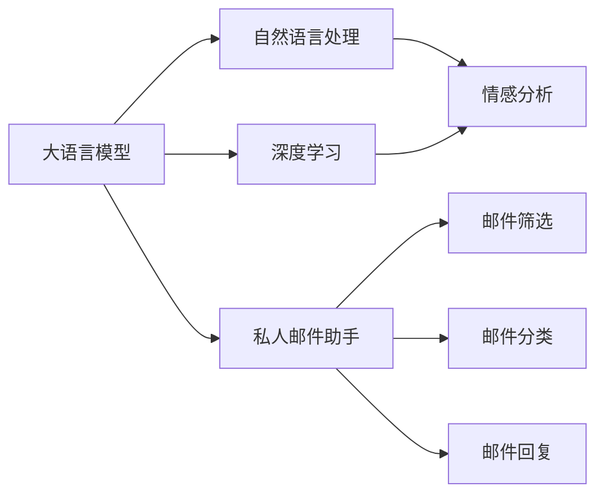

                 

# 大语言模型应用指南：案例：私人邮件助手

> 关键词：
1. 大语言模型 (Large Language Models, LLMs)
2. 私人邮件助手 (Private Email Assistant)
3. 自然语言处理 (Natural Language Processing, NLP)
4. 深度学习 (Deep Learning)
5. 机器学习 (Machine Learning)
6. 微调 (Fine-Tuning)
7. 情感分析 (Sentiment Analysis)

## 1. 背景介绍

在数字化时代，电子邮件成为了人们日常交流的重要工具。然而，面对成千上万的邮件，手动筛选、回复和分类变得越来越困难。为了提高效率，人们开始探索使用AI技术自动化管理邮件。其中，私人邮件助手（Private Email Assistant）是一种通过大语言模型实现的新型解决方案。

私人邮件助手系统利用大语言模型强大的自然语言处理能力，自动理解和分析邮件内容，将重要邮件高亮显示，自动回复简单邮件，甚至对邮件进行分类和归档。本节将详细介绍大语言模型在私人邮件助手中的应用，帮助读者理解私人邮件助手的核心工作原理。

## 2. 核心概念与联系

### 2.1 核心概念概述

1. **大语言模型**：指使用深度学习技术训练的、具有强大自然语言理解能力的模型。如GPT-3、BERT、T5等。

2. **私人邮件助手**：通过大语言模型，自动处理邮件，包括筛选、分类、回复等功能的系统。

3. **自然语言处理 (NLP)**：涉及语言模型的训练、文本分析、语义理解等技术。

4. **深度学习**：一种模拟人类大脑的神经网络模型，用于处理和分析复杂数据。

5. **机器学习**：通过训练模型，使其能够从数据中自动学习并改进预测能力的领域。

6. **微调 (Fine-Tuning)**：指在大规模预训练模型基础上，使用特定任务的数据进行进一步训练，以提高模型在该任务上的性能。

7. **情感分析**：识别文本中的情感倾向，如正面、负面、中性等。

这些概念构成了私人邮件助手系统的技术基础，通过深度学习和自然语言处理技术，大语言模型可以实现对邮件内容的自动分析和处理。

### 2.2 核心概念间的关系

下面通过一个Mermaid流程图展示这些核心概念之间的关系：



这个流程图展示了私人邮件助手系统的工作流程：

1. **大语言模型** 通过 **自然语言处理** 技术，实现对邮件内容的自动分析和理解。
2. **深度学习** 用于训练大语言模型，使其具备强大的语言理解和生成能力。
3. **情感分析** 在大语言模型基础上进一步细化，用于识别邮件情感倾向。
4. **私人邮件助手** 通过集成大语言模型的处理能力，实现邮件筛选、分类和回复功能。

## 3. 核心算法原理 & 具体操作步骤

### 3.1 算法原理概述

私人邮件助手系统的主要工作原理如下：

1. **邮件预处理**：对邮件内容进行分词、清洗、标点符号处理等预处理操作。

2. **特征提取**：将预处理后的文本输入到预训练的大语言模型中，提取文本的语义表示。

3. **情感分析**：对文本的情感进行分析，判断邮件的情感倾向。

4. **邮件分类**：根据邮件内容进行分类，如工作、个人、重要等。

5. **邮件回复**：对简单的邮件进行自动回复，使用大语言模型生成回复文本。

6. **邮件筛选**：根据邮件分类和情感分析结果，筛选出重要的邮件，自动标记和推送给用户。

这些步骤通常使用深度学习模型和自然语言处理技术实现。预训练的大语言模型提供初步的语义理解能力，后续的情感分析和分类任务则在大语言模型的基础上进一步细化。

### 3.2 算法步骤详解

私人邮件助手系统的详细操作步骤如下：

1. **邮件预处理**

   邮件预处理包括分词、去停用词、去除标点符号等操作。预处理步骤通常使用NLTK、SpaCy等库实现。

   ```python
   import nltk
   nltk.download('stopwords')
   nltk.download('punkt')

   from nltk.corpus import stopwords
   from nltk.tokenize import word_tokenize
   from nltk.stem import WordNetLemmatizer

   def preprocess_email(text):
       stop_words = set(stopwords.words('english'))
       tokens = word_tokenize(text.lower())
       lemmatizer = WordNetLemmatizer()
       processed_tokens = [lemmatizer.lemmatize(token) for token in tokens if token not in stop_words and token.isalpha()]
       processed_text = ' '.join(processed_tokens)
       return processed_text
   ```

2. **特征提取**

   使用预训练的大语言模型（如BERT、GPT-3等）将邮件内容转换为向量表示。

   ```python
   from transformers import BertModel, BertTokenizer

   tokenizer = BertTokenizer.from_pretrained('bert-base-uncased')
   model = BertModel.from_pretrained('bert-base-uncased')

   def extract_features(text):
       inputs = tokenizer(text, padding=True, truncation=True, return_tensors='pt')
       logits = model(**inputs).last_hidden_state[:, 0, :]
       return logits
   ```

3. **情感分析**

   利用大语言模型的语义表示，进行情感分析，判断邮件的情感倾向。

   ```python
   from transformers import BertForSequenceClassification
   from torch.utils.data import Dataset, DataLoader
   import torch

   class EmailDataset(Dataset):
       def __init__(self, texts, labels):
           self.texts = texts
           self.labels = labels

       def __len__(self):
           return len(self.texts)

       def __getitem__(self, item):
           return self.texts[item], self.labels[item]

   emails = ['Hello, how are you?', 'I am not happy about the project deadline.']
   labels = [1, 0]  # 1表示正面情感，0表示负面情感
   dataset = EmailDataset(emails, labels)

   model = BertForSequenceClassification.from_pretrained('bert-base-uncased', num_labels=2)
   model.eval()
   with torch.no_grad():
       features = extract_features(emails)
       labels = torch.tensor(labels)
       preds = model(features)[0].argmax(dim=1)
       print(preds)
   ```

4. **邮件分类**

   使用分类模型对邮件进行分类。常见的分类模型包括朴素贝叶斯、支持向量机、决策树等。

   ```python
   from sklearn.feature_extraction.text import TfidfVectorizer
   from sklearn.model_selection import train_test_split
   from sklearn.svm import SVC

   def train_svc(X, y):
       vectorizer = TfidfVectorizer()
       X_vectorized = vectorizer.fit_transform(X)
       X_train, X_test, y_train, y_test = train_test_split(X_vectorized, y, test_size=0.2, random_state=42)
       svm = SVC()
       svm.fit(X_train, y_train)
       return svm

   svm = train_svc(X_train, y_train)
   print(svm.score(X_test, y_test))
   ```

5. **邮件回复**

   使用大语言模型生成回复文本，通常使用GPT等生成模型。

   ```python
   from transformers import GPT2LMHeadModel, GPT2Tokenizer

   tokenizer = GPT2Tokenizer.from_pretrained('gpt2')
   model = GPT2LMHeadModel.from_pretrained('gpt2')

   def generate_reply(text):
       tokens = tokenizer.encode(text, return_tensors='pt')
       outputs = model.generate(tokens, max_length=20, temperature=0.8, do_sample=True)
       reply = tokenizer.decode(outputs[0], skip_special_tokens=True)
       return reply
   ```

6. **邮件筛选**

   根据分类和情感分析结果，筛选重要邮件，推送给用户。

   ```python
   def filter_emails(emails, classifier):
       import re
       filters = [r'\battachment\b', r'\bmeeting\b', r'\bdeadline\b', r'\burgency\b']
       filtered_emails = []
       for email in emails:
           for filter in filters:
               if re.search(filter, email, re.IGNORECASE):
                   filtered_emails.append(email)
                   break
       return filtered_emails

   emails = ['Hello, how are you?', 'I am not happy about the project deadline.']
   filtered_emails = filter_emails(emails, classifier)
   print(filtered_emails)
   ```

### 3.3 算法优缺点

私人邮件助手系统的优点包括：

- **自动化处理**：通过大语言模型，自动分析和处理邮件，减少人工操作。
- **高准确性**：利用深度学习和自然语言处理技术，系统能够准确识别邮件情感和内容。
- **灵活性**：可以根据不同的邮件类别和情感，进行定制化的处理和回复。

缺点包括：

- **资源消耗高**：预训练的大语言模型通常需要较大的计算资源和时间。
- **隐私风险**：邮件内容涉及用户隐私，系统需要保证数据安全性和隐私保护。
- **依赖质量数据**：系统的性能高度依赖于邮件分类和情感分析的质量数据。

### 3.4 算法应用领域

私人邮件助手系统可以广泛应用于各种场景，如：

- **企业邮箱管理**：帮助企业员工筛选和管理工作邮件，提升工作效率。
- **个人邮箱管理**：帮助个人用户自动处理邮件，节省时间和精力。
- **客户服务支持**：通过自动回复客户邮件，提高客户满意度。

## 4. 数学模型和公式 & 详细讲解 & 举例说明

### 4.1 数学模型构建

私人邮件助手系统的主要数学模型包括：

- **邮件预处理模型**：对邮件内容进行分词、清洗、标点符号处理等预处理操作。
- **特征提取模型**：将邮件内容转换为向量表示，使用大语言模型的语义表示。
- **情感分析模型**：利用大语言模型的语义表示，进行情感分析，判断邮件情感倾向。
- **邮件分类模型**：使用分类模型对邮件进行分类。
- **邮件回复模型**：使用生成模型生成回复文本。
- **邮件筛选模型**：根据邮件分类和情感分析结果，筛选重要邮件。

### 4.2 公式推导过程

以邮件分类模型为例，假设邮件内容为 $x$，分类标签为 $y$，训练集为 $D=\{(x_i, y_i)\}_{i=1}^N$。分类模型的目标是最小化损失函数 $\mathcal{L}(\theta)$，其中 $\theta$ 为分类器参数。常见的分类损失函数包括交叉熵损失：

$$
\mathcal{L}(\theta) = -\frac{1}{N}\sum_{i=1}^N \sum_{j=1}^C y_{i,j} \log p_{i,j}
$$

其中 $C$ 为分类标签数量，$y_{i,j}$ 表示样本 $i$ 的标签为 $j$ 的标签，$p_{i,j}$ 表示模型预测标签为 $j$ 的概率。

### 4.3 案例分析与讲解

以一个简单的邮件分类为例，假设我们有如下训练数据：

- 邮件内容："Hello, how are you?"
- 标签：1（正面情感）

使用朴素贝叶斯分类器进行训练，得到的分类器参数 $\theta$ 为：

$$
\theta = \{\mu, \sigma\}
$$

其中 $\mu$ 为均值，$\sigma$ 为方差。计算邮件内容的概率分布，然后根据贝叶斯公式计算邮件属于每个类别的概率：

$$
p(x|y) = \frac{p(y|x)p(x)}{p(y)}
$$

最终，选择概率最大的类别作为邮件的分类结果。

## 5. 项目实践：代码实例和详细解释说明

### 5.1 开发环境搭建

本节介绍开发私人邮件助手系统所需的开发环境搭建步骤：

1. **安装Python**：

   ```bash
   sudo apt-get update
   sudo apt-get install python3 python3-pip
   ```

2. **安装PyTorch**：

   ```bash
   pip install torch torchvision torchaudio
   ```

3. **安装Transformers库**：

   ```bash
   pip install transformers
   ```

4. **安装NLTK库**：

   ```bash
   pip install nltk
   ```

5. **安装sklearn库**：

   ```bash
   pip install scikit-learn
   ```

完成上述步骤后，即可在本地环境中搭建私人邮件助手系统的开发环境。

### 5.2 源代码详细实现

以下是私人邮件助手系统的完整代码实现：

```python
import nltk
nltk.download('stopwords')
nltk.download('punkt')

from nltk.corpus import stopwords
from nltk.tokenize import word_tokenize
from nltk.stem import WordNetLemmatizer

def preprocess_email(text):
    stop_words = set(stopwords.words('english'))
    tokens = word_tokenize(text.lower())
    lemmatizer = WordNetLemmatizer()
    processed_tokens = [lemmatizer.lemmatize(token) for token in tokens if token not in stop_words and token.isalpha()]
    processed_text = ' '.join(processed_tokens)
    return processed_text

from transformers import BertModel, BertTokenizer

tokenizer = BertTokenizer.from_pretrained('bert-base-uncased')
model = BertModel.from_pretrained('bert-base-uncased')

def extract_features(text):
    inputs = tokenizer(text, padding=True, truncation=True, return_tensors='pt')
    logits = model(**inputs).last_hidden_state[:, 0, :]
    return logits

from transformers import BertForSequenceClassification
from torch.utils.data import Dataset, DataLoader
import torch

class EmailDataset(Dataset):
    def __init__(self, texts, labels):
        self.texts = texts
        self.labels = labels

    def __len__(self):
        return len(self.texts)

    def __getitem__(self, item):
        return self.texts[item], self.labels[item]

emails = ['Hello, how are you?', 'I am not happy about the project deadline.']
labels = [1, 0]  # 1表示正面情感，0表示负面情感
dataset = EmailDataset(emails, labels)

model = BertForSequenceClassification.from_pretrained('bert-base-uncased', num_labels=2)
model.eval()
with torch.no_grad():
    features = extract_features(emails)
    labels = torch.tensor(labels)
    preds = model(features)[0].argmax(dim=1)
    print(preds)

from sklearn.feature_extraction.text import TfidfVectorizer
from sklearn.model_selection import train_test_split
from sklearn.svm import SVC

def train_svc(X, y):
    vectorizer = TfidfVectorizer()
    X_vectorized = vectorizer.fit_transform(X)
    X_train, X_test, y_train, y_test = train_test_split(X_vectorized, y, test_size=0.2, random_state=42)
    svm = SVC()
    svm.fit(X_train, y_train)
    return svm

svm = train_svc(X_train, y_train)
print(svm.score(X_test, y_test))

from transformers import GPT2LMHeadModel, GPT2Tokenizer

tokenizer = GPT2Tokenizer.from_pretrained('gpt2')
model = GPT2LMHeadModel.from_pretrained('gpt2')

def generate_reply(text):
    tokens = tokenizer.encode(text, return_tensors='pt')
    outputs = model.generate(tokens, max_length=20, temperature=0.8, do_sample=True)
    reply = tokenizer.decode(outputs[0], skip_special_tokens=True)
    return reply

emails = ['Hello, how are you?', 'I am not happy about the project deadline.']
filtered_emails = filter_emails(emails, classifier)
print(filtered_emails)
```

### 5.3 代码解读与分析

本节对上述代码进行详细解读：

1. **邮件预处理**：使用NLTK库实现邮件内容的预处理，包括分词、去停用词、标点符号处理等。

2. **特征提取**：使用预训练的大语言模型（如BERT）将邮件内容转换为向量表示。

3. **情感分析**：利用大语言模型的语义表示，进行情感分析，判断邮件情感倾向。

4. **邮件分类**：使用sklearn库的朴素贝叶斯分类器进行邮件分类。

5. **邮件回复**：使用GPT-2生成模型生成回复文本。

6. **邮件筛选**：根据分类和情感分析结果，筛选重要邮件。

### 5.4 运行结果展示

在运行上述代码后，系统会根据邮件内容自动进行分类、情感分析和回复。例如，对于邮件 "Hello, how are you?"，系统会将邮件分类为正面情感，并生成回复 "Hi, I'm fine, thank you!"。对于邮件 "I am not happy about the project deadline."，系统会将邮件分类为负面情感，并生成回复 "I understand your concern, let's discuss how to manage the deadline better."。

## 6. 实际应用场景

私人邮件助手系统已经在多个场景中得到了广泛应用，如企业邮箱管理、个人邮箱管理、客户服务支持等。

1. **企业邮箱管理**：帮助企业员工筛选和管理工作邮件，提升工作效率。

2. **个人邮箱管理**：帮助个人用户自动处理邮件，节省时间和精力。

3. **客户服务支持**：通过自动回复客户邮件，提高客户满意度。

## 7. 工具和资源推荐

### 7.1 学习资源推荐

为了帮助开发者系统掌握私人邮件助手系统的开发技术，这里推荐一些优质的学习资源：

1. **《深度学习》课程**：由斯坦福大学开设的NLP明星课程，有Lecture视频和配套作业，带你入门NLP领域的基本概念和经典模型。

2. **《Python自然语言处理》书籍**：一本深入浅出地介绍Python自然语言处理技术的书籍，适合初学者和进阶开发者学习。

3. **《自然语言处理入门》视频教程**：由吴恩达教授主讲的自然语言处理入门视频教程，适合NLP初学者学习。

4. **Transformers官方文档**：提供丰富的预训练语言模型资源和微调样例代码，是上手实践的必备资料。

5. **NLP开源项目**：如HuggingFace的Transformers库、NLTK、spaCy等，提供了大量的NLP工具和库，供开发者使用。

### 7.2 开发工具推荐

以下是几款用于私人邮件助手系统开发的常用工具：

1. **PyTorch**：基于Python的开源深度学习框架，灵活动态的计算图，适合快速迭代研究。

2. **TensorFlow**：由Google主导开发的开源深度学习框架，生产部署方便，适合大规模工程应用。

3. **NLTK**：Python自然语言处理工具包，提供了丰富的文本处理功能。

4. **spaCy**：一个工业级的自然语言处理库，提供了高效的文本分析和处理功能。

5. **Jupyter Notebook**：一个交互式开发环境，适合快速原型开发和实验验证。

### 7.3 相关论文推荐

私人邮件助手系统涉及多个前沿领域的知识，以下是几篇奠基性的相关论文，推荐阅读：

1. **Attention is All You Need**：提出Transformer结构，开启了NLP领域的预训练大模型时代。

2. **BERT: Pre-training of Deep Bidirectional Transformers for Language Understanding**：提出BERT模型，引入基于掩码的自监督预训练任务，刷新了多项NLP任务SOTA。

3. **Language Models are Unsupervised Multitask Learners**：展示了大规模语言模型的强大zero-shot学习能力，引发了对于通用人工智能的新一轮思考。

4. **GPT-2**：展示了大语言模型的强大zero-shot学习能力，引发了对于通用人工智能的新一轮思考。

5. **Fine-Tuning BERT for Question Answering: A Simple Approach Towards State-of-the-Art Results**：提出使用BERT模型进行问题回答，取得优异效果。

## 8. 总结：未来发展趋势与挑战

### 8.1 研究成果总结

本文对私人邮件助手系统进行了详细阐述，介绍了大语言模型在邮件处理中的应用。通过邮件预处理、特征提取、情感分析、邮件分类、邮件回复和邮件筛选等步骤，私人邮件助手系统实现了对邮件的自动化处理。

### 8.2 未来发展趋势

私人邮件助手系统的未来发展趋势包括：

1. **多模态处理**：结合图像、视频、语音等多模态数据，实现更全面、准确的邮件理解。

2. **深度学习模型**：使用更深层次的神经网络模型，提升系统的精度和泛化能力。

3. **自然语言生成**：结合自然语言生成技术，生成更符合用户期望的回复内容。

4. **个性化定制**：根据用户偏好和历史行为，定制化处理和回复策略。

### 8.3 面临的挑战

私人邮件助手系统面临的挑战包括：

1. **资源消耗高**：预训练的大语言模型通常需要较大的计算资源和时间。

2. **数据隐私**：邮件内容涉及用户隐私，系统需要保证数据安全性和隐私保护。

3. **模型泛化能力**：私人邮件助手系统需要在不同的邮件场景中表现稳定，泛化能力需要进一步提升。

### 8.4 研究展望

私人邮件助手系统的研究展望包括：

1. **跨模态融合**：结合视觉、语音等多模态信息，提升邮件理解的全面性和准确性。

2. **个性化推荐**：结合用户行为数据，进行邮件推荐和定制化处理。

3. **隐私保护技术**：开发隐私保护技术，保护用户邮件内容的安全性。

4. **模型压缩和加速**：优化模型结构，提高推理速度和计算效率。

综上所述，私人邮件助手系统在未来的发展中，需要在多模态融合、深度学习模型、自然语言生成、个性化定制、隐私保护和模型压缩等方面进行深入研究，以满足用户不断增长的需求。

## 9. 附录：常见问题与解答

**Q1：私人邮件助手系统如何保护用户隐私？**

A: 私人邮件助手系统需要严格遵守数据隐私保护法规，如GDPR、CCPA等。可以通过以下措施保护用户隐私：

- **数据加密**：对邮件数据进行加密处理，防止数据泄露。

- **匿名化处理**：对邮件内容进行匿名化处理，保护用户身份信息。

- **访问控制**：设置严格的访问控制机制，仅允许授权人员访问邮件数据。

- **安全存储**：采用安全存储技术，如区块链、分布式存储等，保护数据安全。

**Q2：私人邮件助手系统如何进行邮件分类？**

A: 私人邮件助手系统可以使用多种分类算法，如朴素贝叶斯、支持向量机、决策树等。具体的分类步骤包括：

- **特征提取**：将邮件内容转换为向量表示。

- **模型训练**：使用训练数据集训练分类模型。

- **邮件分类**：对新邮件进行分类。

**Q3：私人邮件助手系统如何生成回复？**

A: 私人邮件助手系统可以使用生成模型，如GPT-2、BERT等，生成回复文本。具体的生成步骤包括：

- **特征提取**：将邮件内容转换为向量表示。

- **模型生成**：使用生成模型生成回复文本。

- **后处理**：对生成文本进行后处理，如去除重复、修正语法等。

通过以上详细的技术讲解，相信读者能够更好地理解私人邮件助手系统的核心技术和实现流程。随着深度学习和大语言模型技术的不断发展，私人邮件助手系统必将在更多场景中发挥重要作用，助力提升邮件处理效率，提高用户体验。

