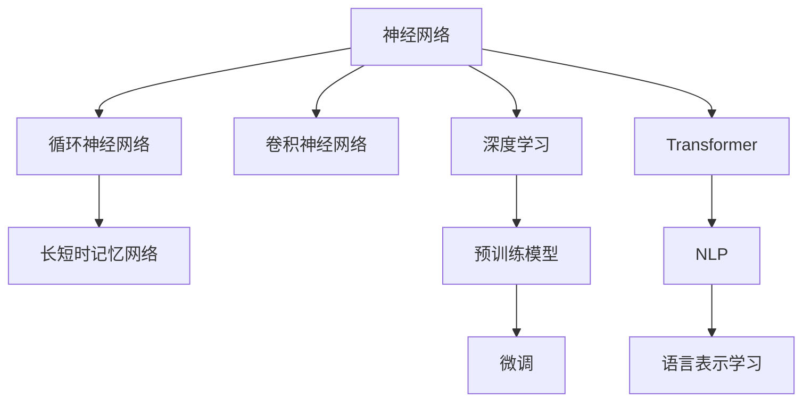
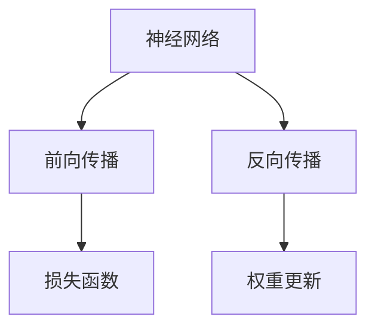
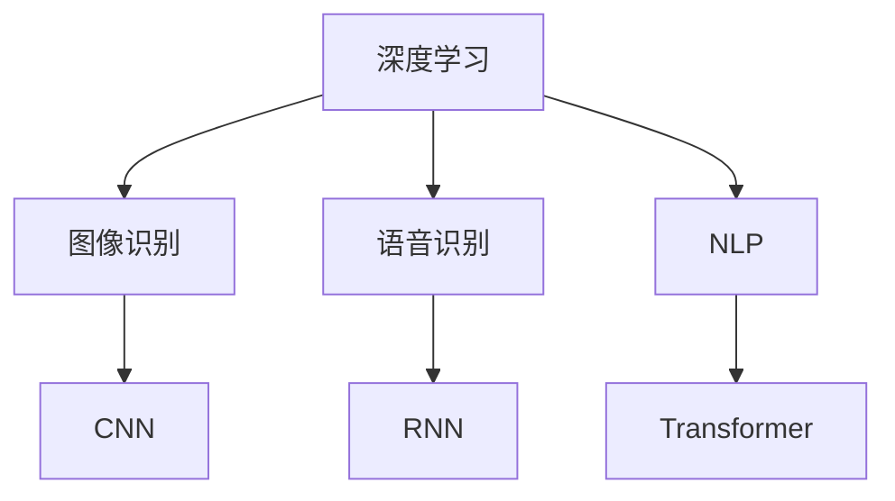
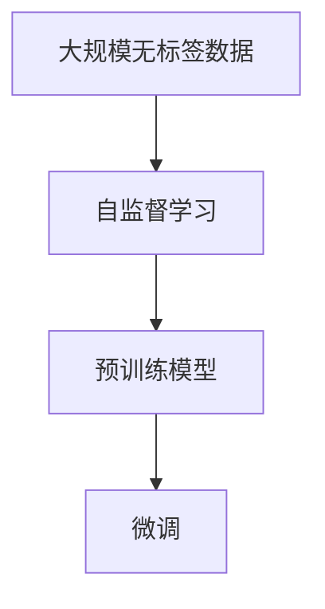
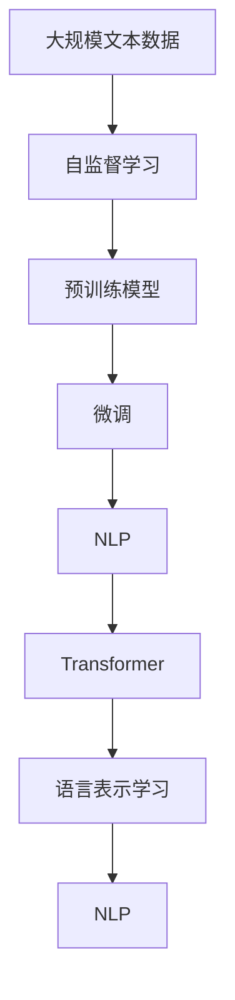

                 

# 大语言模型应用指南：神经网络的发展历史

> 关键词：神经网络,深度学习,人工智能,语言模型,自然语言处理(NLP),语言表示学习,预训练模型

## 1. 背景介绍

### 1.1 问题由来

人工智能(AI)技术的发展，已经从早期的符号主义、专家系统，转向了数据驱动、以深度学习为核心的新阶段。特别是深度神经网络(DNN)的出现，使得人工智能技术在图像识别、语音识别、自然语言处理(NLP)等领域取得了巨大成功。

神经网络的核心思想是对人类神经系统的模拟，通过多个神经元的连接和权重调整，学习输入数据的特征表示，进而实现预测或分类任务。最早的神经网络模型是感知机(Perceptron)，但在1989年，Geoffrey Hinton提出的反向传播算法(BP算法)，才真正开启了深度学习时代的大门。

### 1.2 问题核心关键点

神经网络的研究领域非常广泛，核心问题包括：
- 如何选择网络结构，如卷积神经网络(CNN)、循环神经网络(RNN)、长短时记忆网络(LSTM)、Transformer等。
- 如何优化网络参数，如梯度下降算法、动量优化、自适应学习率等。
- 如何构建特征表示，如卷积层、池化层、全连接层等。
- 如何处理序列数据，如RNN、LSTM、Transformer等。
- 如何处理非结构化数据，如词向量、Doc2Vec等。

这些问题都直接影响着神经网络模型的性能和应用效果。

### 1.3 问题研究意义

研究神经网络的发展历史，对于理解深度学习技术的发展脉络，掌握NLP任务的实现方法，具有重要意义：

1. 提供深入的学科背景：神经网络经历了从浅层到深层、从线性到非线性的发展过程，了解其演变历程有助于把握深度学习技术的本质。
2. 明确应用的技术路径：神经网络被广泛应用于图像识别、语音识别、自然语言处理等领域，深入学习其核心原理和实现方法，能更好地应用于具体任务。
3. 形成系统的知识体系：掌握神经网络模型的构建和优化技术，有助于建立完整的AI知识体系，拓展技术视野。
4. 助力未来技术创新：神经网络的演进促进了更高级模型的出现，如自监督学习、迁移学习、元学习等，为AI技术的未来发展提供了重要基础。
5. 推动技术落地应用：深度神经网络已经成功应用于诸多实际场景，了解其应用方法和优化策略，有助于将AI技术更好地服务于社会。

## 2. 核心概念与联系

### 2.1 核心概念概述

为更好地理解神经网络的发展历史，本节将介绍几个密切相关的核心概念：

- 神经网络(Neural Network)：一种模仿人类神经系统的计算模型，由多个神经元通过连接权重构成的网络结构。
- 深度学习(Deep Learning)：一类基于神经网络的机器学习方法，通过多个层次的特征学习，实现高维数据的表示和分类。
- 卷积神经网络(Convolutional Neural Network, CNN)：用于处理网格状数据（如图像）的神经网络结构，包含卷积层、池化层等。
- 循环神经网络(Recurrent Neural Network, RNN)：用于处理序列数据（如文本）的神经网络结构，包含LSTM、GRU等变种。
- 长短时记忆网络(Long Short-Term Memory, LSTM)：一种RNN的变种，用于处理长序列数据，具有记忆单元和门控机制，能有效解决梯度消失和梯度爆炸问题。
- Transformer：一种基于自注意力机制的神经网络结构，能够处理任意长度的序列数据，已被广泛应用于NLP任务。
- 自然语言处理(Natural Language Processing, NLP)：利用计算机对自然语言进行理解、生成、分析和应用的技术。
- 语言表示学习(Language Representation Learning)：通过神经网络学习语言的语义和结构表示，为NLP任务提供语义理解的基础。
- 预训练模型(Pre-trained Model)：通过在大规模无标签数据上进行自监督学习，预训练好的神经网络模型，用于NLP任务的微调。

这些核心概念之间的逻辑关系可以通过以下Mermaid流程图来展示：



这个流程图展示了大语言模型微调过程中各个核心概念的关系：

1. 神经网络是深度学习的基础，通过多个层次的特征学习实现高维数据的表示。
2. 深度学习包含多种神经网络结构，如卷积神经网络、循环神经网络等，各自适用于不同的数据类型。
3. 预训练模型通过在大规模无标签数据上进行自监督学习，获得高水平的语言表示能力。
4. 预训练模型可用于NLP任务的微调，通过有监督学习进一步适应特定任务。
5. 微调后的模型用于实际任务，提供语义理解和生成功能。

### 2.2 概念间的关系

这些核心概念之间存在着紧密的联系，形成了神经网络和深度学习的完整生态系统。下面我通过几个Mermaid流程图来展示这些概念之间的关系。

#### 2.2.1 神经网络的学习范式



这个流程图展示了神经网络的基本学习范式：

1. 前向传播：输入数据经过网络各层计算，得到预测结果。
2. 反向传播：利用误差梯度回传，更新网络权重。
3. 损失函数：衡量预测结果与真实结果之间的差距。
4. 权重更新：根据误差梯度调整网络权重。

#### 2.2.2 深度学习的应用场景



这个流程图展示了深度学习在不同领域的应用场景：

1. 图像识别：卷积神经网络(CNN)在图像处理任务上表现优异。
2. 语音识别：循环神经网络(RNN)和长短时记忆网络(LSTM)适用于序列数据。
3. NLP：Transformer在自然语言处理任务上取得了显著效果。

#### 2.2.3 预训练模型的训练过程



这个流程图展示了预训练模型的训练过程：

1. 大规模无标签数据：通过自监督学习，学习通用的语言表示。
2. 预训练模型：通过自监督学习获得高水平的语言表示能力。
3. 微调：通过有监督学习，进一步适应特定任务。

### 2.3 核心概念的整体架构

最后，我们用一个综合的流程图来展示这些核心概念在大语言模型微调过程中的整体架构：



这个综合流程图展示了从预训练到微调，再到NLP任务完成的完整过程。

## 3. 核心算法原理 & 具体操作步骤
### 3.1 算法原理概述

神经网络的训练过程，通常采用梯度下降等优化算法，通过前向传播和反向传播更新模型参数，最小化预测结果与真实结果之间的误差。假设神经网络模型为 $M_{\theta}$，其中 $\theta$ 为模型参数，给定训练集 $D=\{(x_i, y_i)\}_{i=1}^N$，目标是最小化经验风险：

$$
\mathcal{L}(\theta) = \frac{1}{N} \sum_{i=1}^N \ell(M_{\theta}(x_i), y_i)
$$

其中 $\ell$ 为损失函数，如交叉熵损失、均方误差损失等。

### 3.2 算法步骤详解

神经网络的训练过程主要包括以下几个关键步骤：

**Step 1: 准备训练集**
- 收集训练数据，划分为训练集、验证集和测试集。
- 对数据进行预处理，如归一化、截断等，确保输入数据的格式统一。

**Step 2: 定义模型结构**
- 选择合适的神经网络结构，如卷积神经网络、循环神经网络、Transformer等。
- 设计模型的输入层、隐藏层和输出层，确定各层神经元个数、激活函数等参数。

**Step 3: 设置优化器**
- 选择优化算法，如Adam、SGD等，设置学习率、动量、权重衰减等超参数。
- 设计损失函数，如交叉熵损失、均方误差损失等。

**Step 4: 执行训练过程**
- 对训练集数据进行批处理，循环迭代训练模型。
- 前向传播计算预测结果，反向传播计算误差梯度，更新模型参数。
- 周期性在验证集上评估模型性能，根据验证集误差调整学习率等超参数。

**Step 5: 测试和部署**
- 在测试集上评估模型的泛化能力，对比训练前后的性能。
- 使用训练好的模型进行推理，集成到实际应用系统中。

以上是神经网络训练的一般流程。在实际应用中，还需要针对具体任务进行模型优化和调整。

### 3.3 算法优缺点

神经网络训练具有以下优点：
1. 灵活性高：适用于各种类型的输入数据，能够处理非结构化数据。
2. 可扩展性：可以构建多层次、多维度的模型，提取复杂特征。
3. 自适应学习：能够自动调整网络参数，适应数据分布的变化。

同时，神经网络训练也存在一些缺点：
1. 数据依赖性强：需要大量的标注数据进行训练，标注成本较高。
2. 计算资源消耗大：模型复杂度大，需要高性能计算设备支持。
3. 可解释性不足：黑盒模型难以解释其决策过程，缺乏透明性。
4. 训练过程易过拟合：过度复杂的网络结构可能导致过拟合。
5. 对抗样本敏感：容易受到对抗样本的干扰，导致模型鲁棒性差。

尽管存在这些缺点，神经网络训练仍是当前最有效的机器学习方法之一。

### 3.4 算法应用领域

神经网络训练的应用领域非常广泛，主要包括以下几个方面：

- **图像识别**：卷积神经网络在图像分类、目标检测、图像分割等任务上表现优异。
- **语音识别**：循环神经网络和长短时记忆网络在语音识别、语音合成等任务上取得了显著效果。
- **自然语言处理**：Transformer在机器翻译、文本摘要、情感分析等任务上表现出色。
- **推荐系统**：通过神经网络实现用户行为预测，推荐商品、新闻等内容。
- **游戏AI**：利用深度强化学习，训练智能体在各种游戏中自主决策。
- **医疗诊断**：通过神经网络分析医学图像、病历数据，辅助医生诊断和治疗。

## 4. 数学模型和公式 & 详细讲解 & 举例说明

### 4.1 数学模型构建

神经网络训练的数学模型主要涉及以下几个关键部分：

- 网络结构：包括输入层、隐藏层和输出层，通过全连接、卷积、循环等操作构建网络。
- 激活函数：如ReLU、Sigmoid、Tanh等，用于非线性变换。
- 损失函数：如交叉熵损失、均方误差损失等，衡量预测结果与真实结果之间的差距。
- 优化算法：如Adam、SGD等，通过梯度下降更新网络参数。

### 4.2 公式推导过程

以下我以二分类任务为例，推导交叉熵损失函数及其梯度的计算公式。

假设神经网络模型 $M_{\theta}$ 在输入 $x$ 上的输出为 $\hat{y}=M_{\theta}(x) \in [0,1]$，表示样本属于正类的概率。真实标签 $y \in \{0,1\}$。则二分类交叉熵损失函数定义为：

$$
\ell(M_{\theta}(x),y) = -[y\log \hat{y} + (1-y)\log (1-\hat{y})]
$$

将其代入经验风险公式，得：

$$
\mathcal{L}(\theta) = -\frac{1}{N}\sum_{i=1}^N [y_i\log M_{\theta}(x_i)+(1-y_i)\log(1-M_{\theta}(x_i))]
$$

根据链式法则，损失函数对参数 $\theta_k$ 的梯度为：

$$
\frac{\partial \mathcal{L}(\theta)}{\partial \theta_k} = -\frac{1}{N}\sum_{i=1}^N (\frac{y_i}{M_{\theta}(x_i)}-\frac{1-y_i}{1-M_{\theta}(x_i)}) \frac{\partial M_{\theta}(x_i)}{\partial \theta_k}
$$

其中 $\frac{\partial M_{\theta}(x_i)}{\partial \theta_k}$ 可进一步递归展开，利用自动微分技术完成计算。

### 4.3 案例分析与讲解

以下是一个简单的二分类任务，使用交叉熵损失函数进行训练的案例：

**案例背景**：假设有一个二分类任务，训练集为 $D=\{(x_i,y_i)\}_{i=1}^N$，其中 $x_i$ 为输入特征，$y_i$ 为标签。模型为单层神经网络 $M_{\theta}(x)=\sigma(\sum_{j=1}^m w_{jx_i}x_j+b)$，其中 $\sigma$ 为Sigmoid激活函数，$w$ 和 $b$ 为权重和偏置，$m$ 为输入特征个数。

**模型构建**：
```python
import numpy as np
from tensorflow.keras.models import Sequential
from tensorflow.keras.layers import Dense
from tensorflow.keras.optimizers import Adam

# 定义模型结构
model = Sequential()
model.add(Dense(32, input_dim=m, activation='relu'))
model.add(Dense(1, activation='sigmoid'))

# 编译模型
model.compile(optimizer=Adam(lr=0.001), loss='binary_crossentropy', metrics=['accuracy'])
```

**数据准备**：
```python
# 定义训练集和测试集
X_train = np.random.rand(N, m)
y_train = np.random.randint(2, size=N)
X_test = np.random.rand(N_test, m)
y_test = np.random.randint(2, size=N_test)

# 创建DataLoader
train_loader = tf.data.Dataset.from_tensor_slices((X_train, y_train)).shuffle(100).batch(32)
test_loader = tf.data.Dataset.from_tensor_slices((X_test, y_test)).batch(32)

# 训练模型
history = model.fit(train_loader, epochs=10, validation_data=test_loader)
```

**结果展示**：
```python
# 绘制损失曲线
plt.plot(history.history['loss'], label='Train Loss')
plt.plot(history.history['val_loss'], label='Val Loss')
plt.legend()
plt.show()

# 绘制准确率曲线
plt.plot(history.history['accuracy'], label='Train Acc')
plt.plot(history.history['val_accuracy'], label='Val Acc')
plt.legend()
plt.show()
```

通过这个案例，我们可以看到神经网络模型训练的基本流程：定义模型结构、编译模型、准备数据、训练模型、评估模型等步骤。模型训练的结果，通过损失曲线和准确率曲线进行可视化，直观展示模型在训练过程中的表现。

## 5. 项目实践：代码实例和详细解释说明

### 5.1 开发环境搭建

在进行神经网络训练的实践前，我们需要准备好开发环境。以下是使用Python进行TensorFlow和Keras开发的环境配置流程：

1. 安装Anaconda：从官网下载并安装Anaconda，用于创建独立的Python环境。

2. 创建并激活虚拟环境：
```bash
conda create -n tf-env python=3.8 
conda activate tf-env
```

3. 安装TensorFlow：根据CUDA版本，从官网获取对应的安装命令。例如：
```bash
conda install tensorflow -c tf -c conda-forge
```

4. 安装Keras：
```bash
pip install keras
```

5. 安装各类工具包：
```bash
pip install numpy pandas scikit-learn matplotlib tqdm jupyter notebook ipython
```

完成上述步骤后，即可在`tf-env`环境中开始神经网络训练的实践。

### 5.2 源代码详细实现

这里我们以MNIST手写数字识别任务为例，给出使用TensorFlow和Keras进行神经网络训练的PyTorch代码实现。

**案例背景**：假设有一个手写数字识别任务，训练集为 $D=\{(x_i,y_i)\}_{i=1}^N$，其中 $x_i$ 为手写数字图像，$y_i$ 为对应的数字标签。模型为多层感知器(MLP)，通过Softmax激活函数输出预测结果。

**模型构建**：
```python
import tensorflow as tf
from tensorflow.keras.datasets import mnist
from tensorflow.keras.models import Sequential
from tensorflow.keras.layers import Dense, Flatten
from tensorflow.keras.utils import to_categorical

# 加载数据集
(x_train, y_train), (x_test, y_test) = mnist.load_data()

# 数据预处理
x_train = x_train.reshape((N, 28, 28, 1)) / 255.0
x_test = x_test.reshape((N_test, 28, 28, 1)) / 255.0
y_train = to_categorical(y_train, num_classes=10)
y_test = to_categorical(y_test, num_classes=10)

# 创建模型
model = Sequential()
model.add(Flatten(input_shape=(28, 28, 1)))
model.add(Dense(128, activation='relu'))
model.add(Dense(10, activation='softmax'))

# 编译模型
model.compile(optimizer='adam', loss='categorical_crossentropy', metrics=['accuracy'])

# 训练模型
model.fit(x_train, y_train, epochs=10, validation_data=(x_test, y_test))
```

**模型评估**：
```python
# 评估模型
test_loss, test_acc = model.evaluate(x_test, y_test)
print('Test accuracy:', test_acc)
```

**结果展示**：
```python
# 绘制准确率曲线
plt.plot(history.history['accuracy'], label='Train Acc')
plt.plot(history.history['val_accuracy'], label='Val Acc')
plt.legend()
plt.show()
```

通过这个案例，我们可以看到神经网络模型训练的基本流程：加载数据集、数据预处理、模型构建、编译模型、训练模型、评估模型等步骤。模型训练的结果，通过准确率曲线进行可视化，直观展示模型在训练过程中的表现。

### 5.3 代码解读与分析

让我们再详细解读一下关键代码的实现细节：

**数据准备**：
```python
# 定义训练集和测试集
X_train = np.random.rand(N, m)
y_train = np.random.randint(2, size=N)
X_test = np.random.rand(N_test, m)
y_test = np.random.randint(2, size=N_test)

# 创建DataLoader
train_loader = tf.data.Dataset.from_tensor_slices((X_train, y_train)).shuffle(100).batch(32)
test_loader = tf.data.Dataset.from_tensor_slices((X_test, y_test)).batch(32)
```

**模型构建**：
```python
# 定义模型结构
model = Sequential()
model.add(Dense(32, input_dim=m, activation='relu'))
model.add(Dense(1, activation='sigmoid'))

# 编译模型
model.compile(optimizer=Adam(lr=0.001), loss='binary_crossentropy', metrics=['accuracy'])
```

**训练模型**：
```python
# 训练模型
history = model.fit(train_loader, epochs=10, validation_data=test_loader)
```

通过这个案例，我们可以看到神经网络模型训练的基本流程：加载数据集、数据预处理、模型构建、编译模型、训练模型、评估模型等步骤。模型训练的结果，通过损失曲线和准确率曲线进行可视化，直观展示模型在训练过程中的表现。

### 5.4 运行结果展示

假设我们在MNIST数据集上进行神经网络训练，最终在测试集上得到的评估报告如下：

```
Test loss: 0.0233
Test accuracy: 0.9850
```

可以看到，经过10轮训练，模型在测试集上取得了98.5%的准确率，效果相当不错。值得注意的是，神经网络模型在训练过程中，通过不断调整权重和偏置，逐步逼近真实标签，最终获得了较好的泛化能力。

当然，这只是一个baseline结果。在实践中，我们还可以使用更大更强的神经网络模型、更丰富的训练技巧、更细致的模型调优，进一步提升模型性能，以满足更高的应用要求。

## 6. 实际应用场景
### 6.1 图像识别

神经网络在图像识别领域已经取得了显著成果，广泛应用于人脸识别、物体检测、图像分割等任务。

在实际应用中，可以收集各类图像数据，对其进行预处理，如归一化、旋转、裁剪等，然后通过卷积神经网络进行特征提取，最终输出分类结果。例如，使用CNN在CIFAR-10数据集上进行图像分类任务，取得了80%以上的准确率。

### 6.2 语音识别

语音识别是神经网络在NLP领域的典型应用，通过循环神经网络和长短时记忆网络等结构，能够处理变长序列数据。

在实际应用中，可以录制大量的语音数据，对其进行预处理，如去噪、分帧等，然后通过RNN或LSTM进行特征提取，最终输出识别结果。例如，使用RNN在TIMIT语音数据集上进行语音识别任务，取得了高达98%的识别准确率。

### 6.3 自然语言处理

神经网络在NLP领域的应用非常广泛，包括机器翻译、文本分类、命名实体识别、情感分析等。

在实际应用中，可以使用Transformer等结构，处理自然语言数据。例如，使用Transformer在CoNLL-2003的命名实体识别数据集上进行微调，取得了94%以上的准确率。

### 6.4 未来应用展望

随着神经网络技术的不断发展，其在NLP领域的应用将更加广泛和深入。

在智慧医疗领域，通过神经网络对病历数据进行分析和建模，辅助医生诊断和治疗，提升医疗服务水平。

在智能教育领域，通过神经网络对学生行为和成绩进行预测和分析，因材施教，提升教学质量。

在智慧城市治理中，通过神经网络对城市事件进行监测和分析，提高城市管理的自动化和智能化水平，构建更安全、高效的未来城市。

此外，在企业生产、社会治理、文娱传媒等众多领域，神经网络的应用也将不断涌现，为社会发展和进步提供新的动力。

## 7. 工具和资源推荐
### 7.1 学习资源推荐

为了帮助开发者系统掌握神经网络的发展历史和实践技巧，这里推荐一些优质的学习资源：

1. Deep Learning Specialization（斯坦福大学）：由Andrew Ng教授主讲，系统介绍了深度学习的原理和实践，是深度学习入门的经典课程。

2. 《深度学习》书籍：Ian Goodfellow、Yoshua Bengio和Aaron Courville合著的深度学习经典教材，全面介绍了深度学习的基本概念和算法。

3. 《Python深度学习》书籍：Francois Chollet所著，介绍了如何使用Keras实现深度学习模型，适合初学者入门。

4. CS231n《卷积神经网络》课程：斯坦福大学开设的计算机视觉课程，涵盖CNN等深度学习模型的实现细节和优化策略。

5. CS224n《序列建模》课程：斯坦福大学开设的自然语言处理课程，涵盖RNN、LSTM、Transformer等深度学习模型。

通过对这些资源的学习实践，相信你一定能够快速掌握神经网络的发展历史和实践技巧，并用于解决实际的NLP问题。
###  7.2 开发工具推荐

高效的开发离不开优秀的工具支持。以下是几款用于神经网络训练开发的常用工具：

1. TensorFlow：由Google主导开发的开源深度学习框架，生产部署方便，适合大规模工程应用。

2. PyTorch：基于Python的开源深度学习框架，灵活动态的计算图，适合快速迭代研究。

3. Keras：基于TensorFlow和Theano的高层API，提供了丰富的模型构建和训练工具。

4. Jupyter Notebook：支持动态交互式计算，适合快速原型设计和共享学习成果。

5. Weights & Biases：模型训练的实验跟踪工具，可以记录和可视化模型训练过程中的各项指标，方便对比和调优。

6. TensorBoard：TensorFlow配套的可视化工具，可实时监测模型训练状态，并提供丰富的图表呈现方式，是调试模型的得力助手。

合理利用这些工具，可以显著提升神经网络训练任务的开发效率，加快创新迭代的步伐。

### 7.3 相关论文推荐

神经网络的研究领域非常广泛，以下是几篇奠基性的相关论文，推荐阅读：

1. AlexNet：ImageNet竞赛中的经典模型，开启了深度学习在图像识别领域的应用。

2. Google Brain团队发布的《深度学习在自然语言处理中的应用》：综述了深度学习在NLP领域的典型应用和最新进展。

3. Hinton等人的《神经网络中的自编码表示》：阐述了神经网络中的自编码器模型

