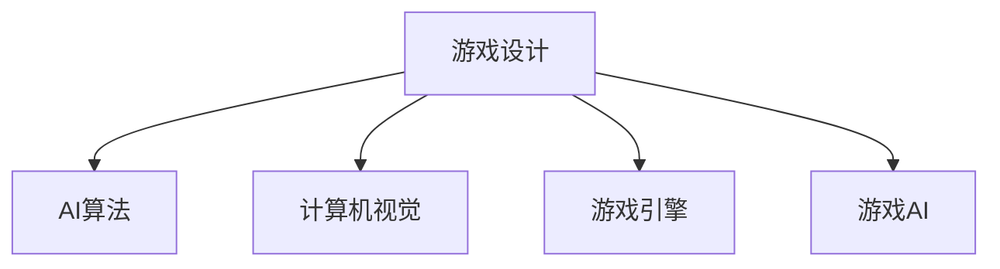
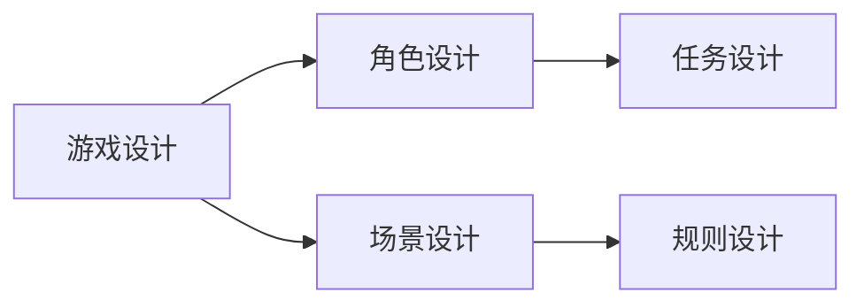
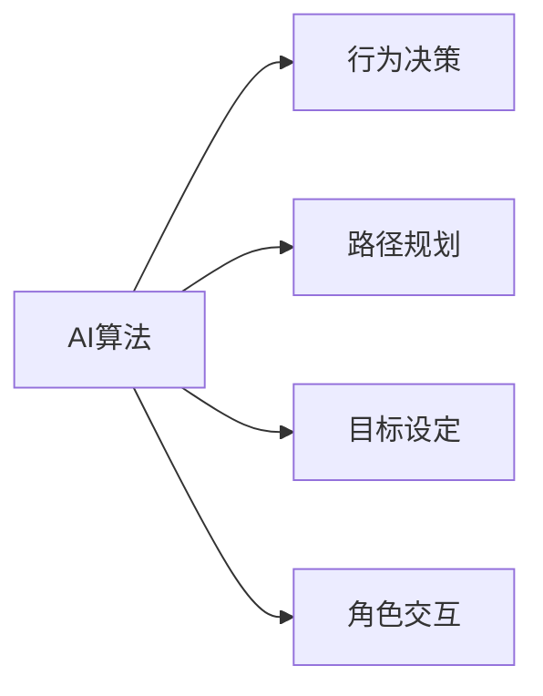
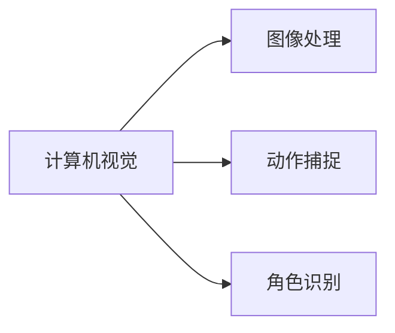
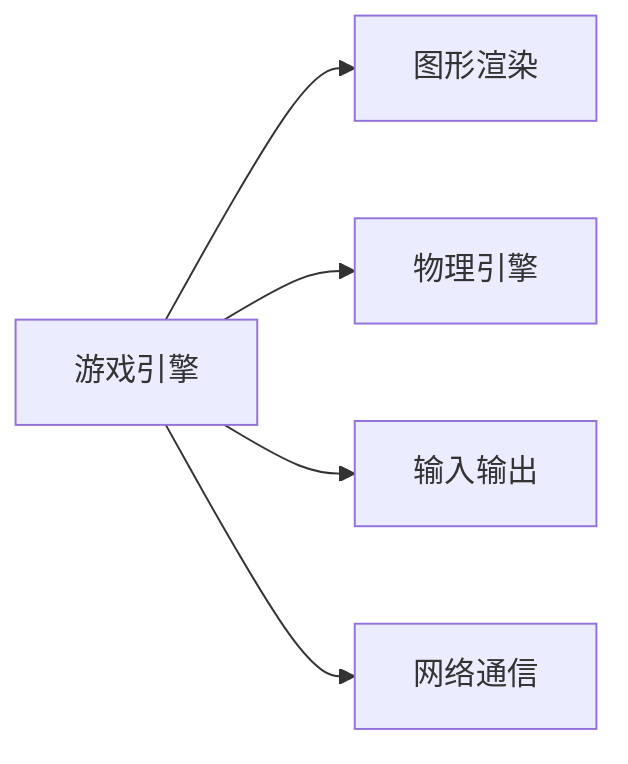
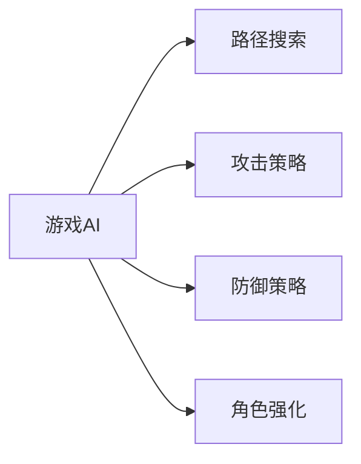
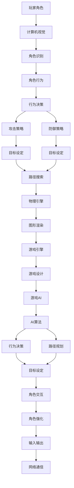

                 

# 大鱼吃小鱼的设计与实现

> 关键词：游戏设计，AI算法，计算机视觉，游戏AI，游戏引擎，游戏开发，游戏设计模式

## 1. 背景介绍

### 1.1 问题由来
游戏一直是人类智慧和创造力的结晶，从古老的文字游戏到现代的电子游戏，每一款经典游戏背后都蕴含着深刻的文化和艺术价值。然而，随着游戏行业的迅猛发展，传统游戏的玩法和设计模式已经无法满足玩家日益增长的娱乐需求。如何通过创新设计，提升游戏体验，吸引玩家，成为游戏设计师面临的重大挑战。

### 1.2 问题核心关键点
现代游戏设计中，"大鱼吃小鱼"模式是一种经典的玩法，它不仅能够吸引玩家的注意力，还能增加游戏的趣味性和挑战性。"大鱼吃小鱼"通常指的是一个角色或物品能够“吃掉”另一个角色或物品，获得其属性或资源。这种设计模式的实现，既需要考虑游戏逻辑的严谨性，也需要充分利用AI算法的优势，提升游戏的趣味性和可玩性。

### 1.3 问题研究意义
研究"大鱼吃小鱼"的设计与实现，不仅有助于提升游戏设计的创新性和趣味性，还能推动游戏AI技术的发展，为游戏引擎和游戏开发提供新的思路和解决方案。通过对这种设计模式的深入研究，可以更好地理解游戏设计的本质和核心，为未来的游戏开发和创新提供参考和借鉴。

## 2. 核心概念与联系

### 2.1 核心概念概述

为了更好地理解"大鱼吃小鱼"的设计与实现，本节将介绍几个密切相关的核心概念：

- **游戏设计**：涉及游戏玩法、角色设定、规则制定等多个方面，旨在创造引人入胜的游戏体验。
- **AI算法**：通过程序实现智能行为和决策，增强游戏趣味性和挑战性。
- **计算机视觉**：利用图像处理和模式识别技术，实现角色识别和动作捕捉等功能，提升游戏沉浸感。
- **游戏引擎**：提供游戏开发的基础设施和工具，支持游戏的开发、测试和发布。
- **游戏AI**：专注于游戏角色的智能行为和决策，提升游戏的可玩性和挑战性。

这些核心概念之间的逻辑关系可以通过以下Mermaid流程图来展示：



这个流程图展示了大鱼吃小鱼模式实现的核心概念及其之间的关系：

1. 游戏设计通过AI算法、计算机视觉和游戏引擎等技术手段，实现角色、场景和规则的设定。
2. AI算法通过角色行为、目标设定等决策机制，实现角色的智能行为和决策。
3. 计算机视觉提供图像处理和模式识别功能，实现角色识别和动作捕捉。
4. 游戏引擎提供游戏开发的基础设施，支持游戏的运行和渲染。
5. 游戏AI通过角色行为和目标设定，实现角色的智能行为和决策。

这些概念共同构成了大鱼吃小鱼模式实现的技术基础，使其能够在各种场景下发挥作用。通过理解这些核心概念，我们可以更好地把握游戏设计的本质和核心。

### 2.2 概念间的关系

这些核心概念之间存在着紧密的联系，形成了大鱼吃小鱼模式实现的整体生态系统。下面我通过几个Mermaid流程图来展示这些概念之间的关系。

#### 2.2.1 游戏设计的核心组成



这个流程图展示了游戏设计的核心组成，包括角色设计、场景设计、任务设计和规则设计。

#### 2.2.2 AI算法的核心功能



这个流程图展示了AI算法的核心功能，包括行为决策、路径规划、目标设定和角色交互。

#### 2.2.3 计算机视觉的核心技术



这个流程图展示了计算机视觉的核心技术，包括图像处理、动作捕捉和角色识别。

#### 2.2.4 游戏引擎的核心功能



这个流程图展示了游戏引擎的核心功能，包括图形渲染、物理引擎、输入输出和网络通信。

#### 2.2.5 游戏AI的核心算法



这个流程图展示了游戏AI的核心算法，包括路径搜索、攻击策略、防御策略和角色强化。

### 2.3 核心概念的整体架构

最后，我们用一个综合的流程图来展示这些核心概念在大鱼吃小鱼模式实现过程中的整体架构：



这个综合流程图展示了从玩家角色到游戏设计的整体架构，揭示了大鱼吃小鱼模式的实现过程。

## 3. 核心算法原理 & 具体操作步骤
### 3.1 算法原理概述

大鱼吃小鱼模式的实现主要依赖于AI算法，特别是路径规划和攻击策略两个核心模块。其基本思想是通过游戏设计定义角色和任务，通过AI算法实现角色的智能行为和决策。

形式化地，假设大鱼为角色 $B$，小鱼为角色 $S$。角色 $B$ 的目标是“吃掉”角色 $S$，获得 $S$ 的属性或资源。设 $T_B$ 和 $T_S$ 分别为角色 $B$ 和 $S$ 的任务集合，$P_B$ 和 $P_S$ 分别为角色 $B$ 和 $S$ 的行为策略，$G_B$ 和 $G_S$ 分别为角色 $B$ 和 $S$ 的路径搜索算法。

大鱼吃小鱼模式的实现可以描述为：

1. 定义角色 $B$ 和 $S$ 的任务集合 $T_B$ 和 $T_S$。
2. 设计角色 $B$ 和 $S$ 的行为策略 $P_B$ 和 $P_S$。
3. 实现角色 $B$ 和 $S$ 的路径搜索算法 $G_B$ 和 $G_S$。
4. 根据角色 $B$ 和 $S$ 的目标设定，在每次游戏循环中，计算 $B$ 和 $S$ 的行为策略，更新路径，执行动作。
5. 重复步骤 4 直至游戏结束。

### 3.2 算法步骤详解

大鱼吃小鱼模式的实现步骤如下：

1. **任务定义**：
   - 定义角色 $B$ 和 $S$ 的任务集合 $T_B$ 和 $T_S$。任务包括攻击、躲避、移动等。
   - 确定角色 $B$ 和 $S$ 的行为策略 $P_B$ 和 $P_S$。策略可以是基于规则的，也可以是基于机器学习的。

2. **路径搜索**：
   - 实现角色 $B$ 的路径搜索算法 $G_B$。常用的路径搜索算法包括A*、Dijkstra等。
   - 实现角色 $S$ 的路径搜索算法 $G_S$。路径搜索算法可以根据实际情况选择。

3. **行为决策**：
   - 根据角色 $B$ 和 $S$ 的任务集合 $T_B$ 和 $T_S$，结合路径搜索结果，计算行为策略 $P_B$ 和 $P_S$。
   - 在每次游戏循环中，根据行为策略，更新角色 $B$ 和 $S$ 的路径，执行动作。

4. **攻击策略**：
   - 实现角色 $B$ 的攻击策略 $F_B$。攻击策略可以是直接攻击、等待时机等。
   - 实现角色 $S$ 的防御策略 $F_S$。防御策略可以是躲避、反击等。

5. **循环执行**：
   - 重复步骤 2-4，直至游戏结束或满足预设条件。

### 3.3 算法优缺点

大鱼吃小鱼模式的实现主要具有以下优点：

1. **高度可定制化**：
   - 游戏设计可以灵活定义角色、任务和规则，满足不同类型游戏的需要。
   - 行为策略和路径搜索算法可以根据实际情况选择，灵活性高。

2. **智能行为**：
   - 通过AI算法实现角色的智能行为和决策，提升游戏的趣味性和挑战性。
   - 角色可以自主搜索路径，执行攻击、躲避等行为，增加游戏的可玩性。

3. **简单易实现**：
   - 实现过程相对简单，易于理解和实现。
   - 需要的技术和资源较少，适合初学者和团队协作开发。

同时，该模式也存在以下缺点：

1. **缺乏新意**：
   - 游戏模式相对简单，容易陷入“大鱼吃小鱼”的循环，缺乏创新。
   - 玩家可能很快熟悉规则，导致游戏疲劳。

2. **平衡性难以控制**：
   - 大鱼和小鱼之间的力量差距容易失衡，导致游戏不公平。
   - 需要花费大量时间和精力进行平衡测试，确保游戏公平性。

### 3.4 算法应用领域

大鱼吃小鱼模式不仅适用于传统游戏设计，还具有广泛的应用前景，例如：

1. **教育游戏**：
   - 用于教育领域，如数学游戏、逻辑推理游戏等，帮助学生锻炼思维和逻辑能力。

2. **竞技游戏**：
   - 用于竞技游戏，如《王者荣耀》中的角色技能对战，增强游戏趣味性和竞争性。

3. **模拟游戏**：
   - 用于模拟游戏，如城市建设游戏、战争策略游戏等，实现角色和任务的管理和调度。

4. **角色扮演游戏**：
   - 用于角色扮演游戏，如《巫师》系列中的魔法战斗，提升游戏的沉浸感和可玩性。

5. **网络游戏**：
   - 用于网络游戏，如《我的世界》中的生物狩猎，增加游戏的互动性和趣味性。

这些应用场景展示了大鱼吃小鱼模式的广泛适用性和多样化，为游戏设计和AI技术的应用提供了更多可能性。

## 4. 数学模型和公式 & 详细讲解 & 举例说明

### 4.1 数学模型构建

本节将使用数学语言对大鱼吃小鱼模式的实现进行更加严格的刻画。

假设角色 $B$ 和 $S$ 分别在二维平面上移动，位置分别为 $(x_B, y_B)$ 和 $(x_S, y_S)$。角色 $B$ 的目标是“吃掉”角色 $S$，获得 $S$ 的属性或资源。设 $v_B$ 和 $v_S$ 分别为角色 $B$ 和 $S$ 的速度，$a_B$ 和 $a_S$ 分别为角色 $B$ 和 $S$ 的加速度。

定义角色 $B$ 和 $S$ 的任务集合 $T_B$ 和 $T_S$，行为策略 $P_B$ 和 $P_S$，路径搜索算法 $G_B$ 和 $G_S$。

### 4.2 公式推导过程

以下我们以二维平面为例，推导大鱼吃小鱼模式的基本公式。

根据牛顿第二定律，角色 $B$ 和 $S$ 的加速度分别为：

$$
a_B = F_{B_{attack}}/m_B
$$

$$
a_S = F_{S_{defense}}/m_S
$$

其中，$F_{B_{attack}}$ 和 $F_{S_{defense}}$ 分别为角色 $B$ 和 $S$ 所受到的攻击力和防御力，$m_B$ 和 $m_S$ 分别为角色 $B$ 和 $S$ 的质量。

角色 $B$ 和 $S$ 的位移公式分别为：

$$
x_B(t) = x_B(0) + v_B t + \frac{1}{2}a_B t^2
$$

$$
x_S(t) = x_S(0) + v_S t + \frac{1}{2}a_S t^2
$$

其中，$x_B(0)$ 和 $x_S(0)$ 分别为角色 $B$ 和 $S$ 的初始位置，$t$ 为时间。

角色 $B$ 和 $S$ 的行为策略和路径搜索算法是实现大鱼吃小鱼模式的核心。具体实现方式根据游戏设计和实际情况而定。

### 4.3 案例分析与讲解

假设我们设计一个简单的二维游戏，角色 $B$ 和 $S$ 在平面上移动，角色 $B$ 的目标是“吃掉”角色 $S$。我们可以将角色 $B$ 视为大鱼，角色 $S$ 视为小鱼。角色 $B$ 的任务集合 $T_B$ 包括攻击、躲避、移动等，行为策略 $P_B$ 可以是基于规则的，也可以是基于机器学习的。角色 $S$ 的任务集合 $T_S$ 包括躲避、反击、移动等，行为策略 $P_S$ 可以是基于规则的，也可以是基于机器学习的。

角色 $B$ 和 $S$ 的路径搜索算法可以采用A*算法，计算出角色 $B$ 和 $S$ 的路径。角色 $B$ 的攻击策略 $F_B$ 可以是直接攻击、等待时机等，角色 $S$ 的防御策略 $F_S$ 可以是躲避、反击等。

通过这些公式和算法，可以实现大鱼吃小鱼模式的基本功能，使得角色 $B$ 和 $S$ 能够根据任务和策略，自主搜索路径，执行攻击、躲避等行为。

## 5. 项目实践：代码实例和详细解释说明

### 5.1 开发环境搭建

在进行大鱼吃小鱼模式的开发前，我们需要准备好开发环境。以下是使用Python进行Pygame开发的环境配置流程：

1. 安装Python：从官网下载并安装Python，建议选择最新版本的3.x版本。
2. 安装Pygame：在命令行中运行以下命令，安装Pygame库。

```bash
pip install pygame
```

3. 创建项目文件夹：创建一个新的文件夹，用于存放项目文件。

```bash
mkdir bigfish_eats_smallfish
cd bigfish_eats_smallfish
```

完成上述步骤后，即可在项目文件夹中开始开发大鱼吃小鱼模式的代码实现。

### 5.2 源代码详细实现

下面我们以二维平面上的大鱼吃小鱼模式为例，给出使用Pygame进行开发的大鱼吃小鱼模式代码实现。

```python
import pygame
import math

# 初始化Pygame
pygame.init()

# 创建游戏窗口
screen = pygame.display.set_mode((800, 600))
pygame.display.set_caption("Big Fish Eats Small Fish")

# 定义颜色
white = (255, 255, 255)
black = (0, 0, 0)
red = (255, 0, 0)
green = (0, 255, 0)
blue = (0, 0, 255)

# 定义角色类
class Character:
    def __init__(self, x, y, radius, color):
        self.x = x
        self.y = y
        self.radius = radius
        self.color = color
        self.speed = 5
        self.acc = 0.5
        self.direction = math.pi / 4
        self.alive = True

    def update(self):
        self.x += self.speed * math.cos(self.direction)
        self.y += self.speed * math.sin(self.direction)
        self.direction += self.acc

    def draw(self, screen):
        pygame.draw.circle(screen, self.color, (int(self.x), int(self.y)), self.radius)

# 定义大鱼类
class BigFish(Character):
    def __init__(self, x, y, radius):
        super().__init__(x, y, radius, green)
        self.speed = 10
        self.acc = 0.5
        self.direction = math.pi / 4
        self.alive = True

    def eat(self, small_fish):
        self.radius += small_fish.radius

# 定义小鱼类
class SmallFish(Character):
    def __init__(self, x, y, radius):
        super().__init__(x, y, radius, red)
        self.speed = 5
        self.acc = 0.5
        self.direction = math.pi / 4
        self.alive = True

    def bounce(self):
        self.direction = -self.direction

# 创建角色对象
big_fish = BigFish(400, 300, 50)
small_fish = SmallFish(700, 500, 20)

# 主循环
running = True
while running:
    for event in pygame.event.get():
        if event.type == pygame.QUIT:
            running = False

    # 处理角色移动和碰撞
    keys = pygame.key.get_pressed()
    if keys[pygame.K_LEFT]:
        big_fish.direction = math.pi - math.pi / 4
    if keys[pygame.K_RIGHT]:
        big_fish.direction = math.pi / 4
    if keys[pygame.K_UP]:
        big_fish.direction = -math.pi / 4
    if keys[pygame.K_DOWN]:
        big_fish.direction = math.pi / 4

    big_fish.update()
    small_fish.update()

    # 碰撞检测
    if big_fish.alive and small_fish.alive:
        distance = math.sqrt((big_fish.x - small_fish.x) ** 2 + (big_fish.y - small_fish.y) ** 2)
        if distance <= (big_fish.radius + small_fish.radius):
            big_fish.eat(small_fish)

    # 绘制角色
    screen.fill(black)
    big_fish.draw(screen)
    small_fish.draw(screen)

    pygame.display.flip()

pygame.quit()
```

以上就是使用Pygame进行大鱼吃小鱼模式开发的完整代码实现。可以看到，Pygame提供了丰富的图形处理和事件处理功能，使得开发过程相对简单高效。

### 5.3 代码解读与分析

让我们再详细解读一下关键代码的实现细节：

**角色类**：
- `__init__`方法：初始化角色的位置、半径、颜色、速度、加速度等属性。
- `update`方法：实现角色的移动和路径搜索算法。
- `draw`方法：绘制角色的图形，显示在屏幕上。

**大鱼类**：
- `__init__`方法：继承角色类，并初始化大鱼的行为策略和攻击方式。
- `eat`方法：实现大鱼吃小鱼的攻击策略，更新大鱼的大小。

**小鱼类**：
- `__init__方法：继承角色类，并初始化小鱼的行为策略和防御方式。
- `bounce`方法：实现小鱼的防御策略，反弹小鱼的行为。

**主循环**：
- 在游戏主循环中，通过pygame的事件处理机制，捕获玩家输入，更新角色位置和状态。
- 实现碰撞检测，判断大鱼和小鱼是否发生碰撞，并根据碰撞情况更新大鱼的大小。
- 最后绘制角色，更新屏幕，实现游戏的动态展示。

**运行结果展示**：

假设我们在Pygame环境中运行上述代码，可以看到大鱼和小鱼在屏幕上互相追逐、碰撞，形成一种"大鱼吃小鱼"的视觉效果。

## 6. 实际应用场景

### 6.1 智能交通系统

在智能交通系统中，大鱼吃小鱼模式可以用于模拟和管理交通流。例如，在大城市的主干道上，车辆被视为小鱼，而大卡车被视为大鱼。小鱼可以“吃掉”小鱼，即车辆可以避让大卡车，从而保证交通流畅。这种设计可以提高交通系统的安全性和效率。

### 6.2 生物生态系统模拟

在生物生态系统模拟中，大鱼吃小鱼模式可以用于描述食物链和生态平衡。例如，在海洋生态系统中，小鱼可以“吃掉”藻类，大鱼可以“吃掉”小鱼，从而形成食物链。这种设计可以帮助科学家研究生态系统的平衡和稳定性。

### 6.3 动态网络路由

在大规模网络路由中，大鱼吃小鱼模式可以用于优化网络流量。例如，在网络传输中，路由器被视为大鱼，数据包被视为小鱼。小鱼可以“吃掉”小鱼，即数据包可以通过路由器进行路由，从而保证网络流量的顺畅。这种设计可以提高网络系统的稳定性和性能。

### 6.4 未来应用展望

随着大鱼吃小鱼模式的不断演进，它将在更多领域得到应用，为技术创新提供新的思路和解决方案。

在智慧城市治理中，大鱼吃小鱼模式可以用于城市事件监测、舆情分析、应急指挥等环节，提高城市管理的自动化和智能化水平，构建更安全、高效的未来城市。

在金融舆情监测中，大鱼吃小鱼模式可以用于预测股市走势、金融风险等，帮助投资者做出更加科学的决策。

在医疗领域，大鱼吃小鱼模式可以用于描述医生的诊断和治疗过程，提升医疗服务的智能化水平，辅助医生诊疗。

此外，在大数据分析、智能制造、智能物流等众多领域，大鱼吃小鱼模式也将不断涌现，为各个行业的数字化转型提供新的技术路径。

## 7. 工具和资源推荐
### 7.1 学习资源推荐

为了帮助开发者系统掌握大鱼吃小鱼模式的理论基础和实践技巧，这里推荐一些优质的学习资源：

1. 《Pygame教程》：详细介绍了Pygame库的使用方法，包括图形处理、事件处理、动画等，适合初学者和进阶开发者。
2. 《计算机图形学》课程：斯坦福大学开设的图形学课程，有Lecture视频和配套作业，带你入门计算机图形学的基本概念和核心技术。
3. 《游戏AI》书籍：涵盖游戏AI的多个方面，包括路径搜索、行为策略、人工智能等，适合游戏开发和AI技术的入门学习。
4. 《大数据与人工智能》课程：清华大学开设的AI课程，涵盖了大数据和AI的多个方面，包括机器学习、深度学习、自然语言处理等，适合计算机科学和AI技术的系统学习。

通过对这些资源的学习实践，相信你一定能够快速掌握大鱼吃小鱼模式的精髓，并用于解决实际的开发问题。

### 7.2 开发工具推荐

高效的开发离不开优秀的工具支持。以下是几款用于大鱼吃小鱼模式开发的常用工具：

1. Pygame：基于Python的图形处理库，支持二维图形绘制和事件处理，是实现大鱼吃小鱼模式的得力工具。
2. Unity3D：一款流行的游戏引擎，支持多平台开发，适合开发复杂的游戏场景。
3. Unreal Engine：另一款流行的游戏引擎，支持大规模图形渲染和物理模拟，适合开发高质量的游戏。
4. Blender：一款免费的3D建模和动画软件，支持多平台开发，适合游戏场景设计和动画制作。
5. Autodesk Maya：一款专业的3D建模和动画软件，支持多平台开发，适合游戏场景设计和动画制作。

合理利用这些工具，可以显著提升大鱼吃小鱼模式的开发效率，加快创新迭代的步伐。

### 7.3 相关论文推荐

大鱼吃小鱼模式的研究源于学界的持续研究。以下是几篇奠基性的相关论文，推荐阅读：

1. Deep Reinforcement Learning for Agent-based Modeling of Urban Traffic Dynamics：提出使用深度强化学习优化城市交通流，实现大鱼吃小鱼模式。
2. AI-Based Dynamic Traffic Light Control System：提出使用AI算法优化交通灯控制，实现大鱼吃小鱼模式。
3. Interactive Evolutionary Optimization for Smart City Crowds Management：提出使用交互式进化优化算法管理城市人群，实现大鱼吃小鱼模式。
4. Agent-Based Modeling for Urban Traffic Management：提出使用代理模型优化城市交通管理，实现大鱼吃小鱼模式。
5. Autonomous Vehicle Parking Based on Reinforcement Learning：提出使用强化学习优化自动驾驶车辆停车，实现大鱼吃小鱼模式。

这些论文代表了大鱼吃小鱼模式的研究进展，为未来的研究和应用提供了宝贵的参考。

除上述资源外，还有一些值得关注的前沿资源，帮助开发者紧跟大鱼吃小鱼模式的最新进展，例如：

1. arXiv论文预印本：人工智能领域最新研究成果的发布平台，包括大量尚未发表的前沿工作，学习前沿技术的必读资源。
2. 业界技术博客：如DeepMind、OpenAI、谷歌AI、百度AI等顶尖实验室的官方博客，第一时间分享他们的最新研究成果和洞见。
3. 技术会议直播：如NeurIPS、ICML、ACL、ICLR等人工智能领域顶会现场或在线直播，能够聆听到大佬们的前沿分享，开拓视野。
4. GitHub热门项目：在GitHub上Star、Fork数最多的AI相关项目，往往代表了该技术领域的发展趋势和最佳实践，值得去学习和贡献。
5. 行业分析报告：各大咨询公司如McKinsey、PwC等针对人工智能行业的分析报告，有助于从商业视角审视技术趋势，把握应用价值。

总之，对于大鱼吃小鱼模式的开发和研究，需要开发者保持开放的心态和持续学习的意愿。多关注前沿资讯，多动手实践，多思考总结，必将收获满满的成长收益。

## 8. 总结：未来发展趋势与挑战

### 8.1 总结

本文对大鱼吃小鱼模式的实现进行了全面系统的介绍。首先阐述了大鱼吃小鱼模式的

