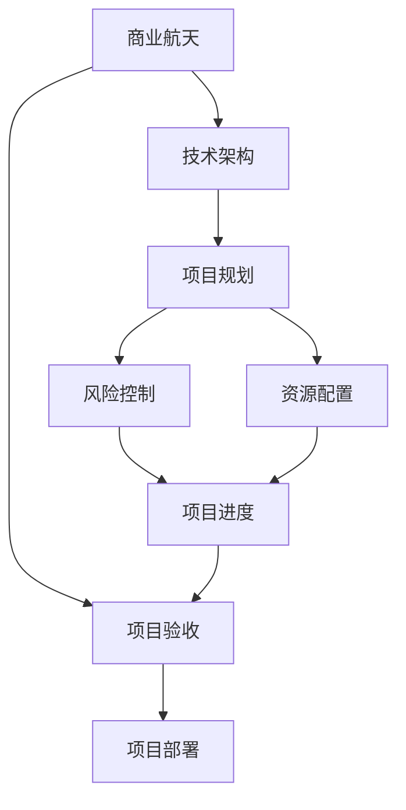

                 

# 太空技术管理：开拓商业航天新领域

> 关键词：商业航天,太空技术,技术管理,探索前沿,创新驱动

## 1. 背景介绍

### 1.1 问题由来
商业航天，作为现代太空探索的新兴领域，正在经历快速发展的时期。随着SpaceX、蓝色起源、维珍银河等私人航天企业的崛起，以及NASA等传统航天机构的技术转型，商业航天市场正成为全球科技竞争的新高地。然而，与其它高科技领域相比，商业航天面临的技术和市场挑战更加严峻。

具体来说，商业航天的关键技术包括火箭发动机、太空舱、卫星通信、导航系统等，这些技术不仅要求突破性的创新，还需要跨领域的深度融合。此外，商业航天的市场规模较小，竞争激烈，研发周期长，资金投入大，这对于技术管理水平提出了更高的要求。

### 1.2 问题核心关键点
本文聚焦于商业航天领域的技术管理，将从技术架构、项目规划、风险控制、资源配置等方面探讨如何有效管理商业航天的关键技术。我们期望通过这篇文章，为商业航天领域的技术管理提供理论与实践相结合的指导，助力该领域的快速发展和突破。

### 1.3 问题研究意义
随着科技的发展，商业航天的商业价值逐渐显现。它不仅能促进人类对太空的深入探索，还将对地球资源利用、环境保护、通信技术等多个领域产生深远影响。技术管理作为商业航天发展的核心引擎，对其成功的至关重要。

因此，本文的研究不仅有助于提升商业航天的技术管理水平，还有助于推动商业航天的商业化进程，加速科技进步和产业发展。技术管理水平的高低，在很大程度上决定了商业航天企业的竞争力，影响其市场份额和发展速度。

## 2. 核心概念与联系

### 2.1 核心概念概述

在进行深入的技术管理探讨之前，本节将介绍几个关键概念：

- 商业航天(Commercial Spaceflight)：指由私人企业而非政府主导的太空探索和利用活动。与政府主导的太空项目相比，商业航天的商业模式更加灵活，技术开发与商业化更加紧密。

- 技术架构(Technology Architecture)：指技术系统各组成部分之间的逻辑关系和结构形式。在商业航天中，技术架构的设计直接影响系统性能和开发成本。

- 项目规划(Project Planning)：指对技术开发项目进行科学规划和可行性分析，确定项目目标、时间表和资源配置等关键要素。

- 风险控制(Risk Control)：指识别和管理技术项目中的各类风险因素，以最小化其对项目进度的影响。

- 资源配置(Resource Allocation)：指合理分配技术开发过程中的人力、物力和财力资源，确保项目按时高质量完成。

### 2.2 概念间的关系

这些核心概念之间的联系可以通过以下Mermaid流程图来展示：



这个流程图展示了大语言模型的核心概念及其之间的关系：

1. 商业航天需要建立科学的技术架构，指导项目开发。
2. 基于技术架构的项目规划，确定项目目标和时间表。
3. 项目规划中的风险识别和管理，确保项目按时推进。
4. 项目规划中的资源分配，确保项目高质量完成。
5. 风险管理和资源分配共同保障项目进度。
6. 项目验收和部署，评估项目效果并投入实际使用。

## 3. 核心算法原理 & 具体操作步骤

### 3.1 算法原理概述

商业航天的技术管理，本质上是将技术开发和商业化过程进行科学规划和高效执行的管理活动。其核心思想是：在明确技术目标和任务的基础上，通过合理的资源配置和风险管理，确保技术开发过程的顺利进行，最终实现技术成果的商业化应用。

具体来说，商业航天的技术管理包括以下几个关键环节：

1. **需求分析**：明确技术开发的目标和需求。
2. **技术规划**：设计技术架构，进行项目规划。
3. **资源配置**：分配和调度技术开发所需的人力、物力和财力资源。
4. **风险管理**：识别和控制技术开发中的各类风险。
5. **质量控制**：确保技术开发成果符合预设标准。
6. **部署应用**：将技术成果转化为实际应用。

这些环节通过环环相扣的方式，共同保障商业航天的技术开发和商业化过程。

### 3.2 算法步骤详解

下面是商业航天技术管理的具体操作步骤：

#### 3.2.1 需求分析

**步骤1：识别需求**
- 分析商业航天项目的目标和用户需求。
- 确定关键技术指标，如成本、性能、可靠性等。

**步骤2：需求细化**
- 将总体需求细化为具体的技术需求。
- 对每个技术需求进行详细描述，明确技术要求。

#### 3.2.2 技术规划

**步骤1：技术评估**
- 评估现有技术资源，识别技术差距。
- 确定技术路径和可行性。

**步骤2：技术架构设计**
- 设计技术系统的总体架构。
- 设计各子系统的接口和交互方式。

#### 3.2.3 资源配置

**步骤1：资源需求评估**
- 评估技术开发所需的人力、物力和财力资源。
- 制定资源使用计划。

**步骤2：资源分配**
- 根据资源评估结果进行资源分配。
- 确定资源调度的优先级和时间表。

#### 3.2.4 风险管理

**步骤1：风险识别**
- 识别技术开发中的各类风险。
- 对风险进行分类和评估。

**步骤2：风险应对**
- 制定风险应对策略。
- 实施风险应对措施。

#### 3.2.5 质量控制

**步骤1：制定标准**
- 制定技术开发和质量控制的标准。
- 对标准进行审查和验证。

**步骤2：执行监控**
- 对技术开发过程进行监控。
- 对技术成果进行测试和验证。

#### 3.2.6 部署应用

**步骤1：技术部署**
- 将技术成果部署到实际应用场景。
- 进行用户培训和反馈收集。

**步骤2：效果评估**
- 评估技术应用的效果。
- 进行持续优化和改进。

### 3.3 算法优缺点

商业航天技术管理方法具有以下优点：

- **科学规划**：通过系统化的需求分析和技术规划，确保技术开发的目标明确，路径可行。
- **资源高效**：通过合理的资源配置，最大化利用现有资源，降低开发成本。
- **风险控制**：通过风险识别和管理，及时发现并解决风险，确保项目进度和质量。
- **质量保证**：通过标准制定和质量监控，保证技术成果符合预设标准，减少后期维护成本。

同时，也存在以下缺点：

- **流程复杂**：技术管理涉及多环节、多要素，流程复杂，难以快速响应变化。
- **资源限制**：商业航天的资源相对有限，可能面临资源紧张的情况。
- **灵活性不足**：一旦进入执行阶段，更改需求或方案需要重新评估和调整。

### 3.4 算法应用领域

商业航天技术管理的应用领域非常广泛，涵盖商业航天的各个环节，包括但不限于：

- **火箭设计**：从发动机到推进系统，设计安全、高效、可靠的技术方案。
- **航天器制造**：确保航天器各分系统协调工作，实现发射、入轨、运行等关键任务。
- **卫星部署**：进行卫星通信、导航、遥感等关键技术的研发和应用。
- **地面系统**：建设和管理地面控制系统，确保任务执行和数据传输。
- **客户服务**：为商业客户开发定制化服务方案，提供技术支持和维护。

## 4. 数学模型和公式 & 详细讲解  
### 4.1 数学模型构建

在进行商业航天技术管理的数学建模时，我们需要考虑以下几个关键变量：

- $T$：技术开发周期。
- $C$：技术开发成本。
- $R$：技术开发风险系数。
- $Q$：技术开发质量评分。
- $K$：技术开发关键性能指标。

我们的目标是最小化总成本$C$，同时满足预设的技术开发周期$T$、质量评分$Q$和性能指标$K$。

根据这些变量，我们可以构建如下数学模型：

$$
\begin{align*}
\text{最小化} & \quad C \\
\text{受限于} & \quad 
\begin{cases}
T \leq T_{\text{target}} \\
Q \geq Q_{\text{target}} \\
K \geq K_{\text{target}}
\end{cases}
\end{align*}
$$

其中$T_{\text{target}}, Q_{\text{target}}, K_{\text{target}}$分别表示预设的技术开发周期、质量评分和性能指标。

### 4.2 公式推导过程

接下来，我们将对上述数学模型进行推导。

**推导步骤1：确定目标函数**

根据最小化总成本$C$的目标，我们的目标函数为：

$$
C = C_0 + C_1 \times T + C_2 \times R + C_3 \times (1-Q) + C_4 \times (1-K)
$$

其中$C_0, C_1, C_2, C_3, C_4$分别表示固定成本、技术开发成本、风险成本、质量损失成本和性能损失成本。

**推导步骤2：确定约束条件**

根据预设的技术开发周期$T$、质量评分$Q$和性能指标$K$，我们得到如下约束条件：

$$
\begin{cases}
T \leq T_{\text{target}} \\
Q \geq Q_{\text{target}} \\
K \geq K_{\text{target}}
\end{cases}
$$

**推导步骤3：求解优化问题**

通过拉格朗日乘数法，我们得到优化问题的拉格朗日函数：

$$
\begin{aligned}
L &= C + \lambda_1(T - T_{\text{target}}) + \lambda_2(Q - Q_{\text{target}}) + \lambda_3(K - K_{\text{target}}) \\
&= C_0 + C_1 \times T + C_2 \times R + C_3 \times (1-Q) + C_4 \times (1-K) + \lambda_1(T - T_{\text{target}}) + \lambda_2(Q - Q_{\text{target}}) + \lambda_3(K - K_{\text{target}})
\end{aligned}
$$

我们需要找到使拉格朗日函数取最小值的$T, Q, K$值，以及对应的$\lambda_1, \lambda_2, \lambda_3$值。

通过求解上述优化问题，我们可以得到商业航天技术管理的最优解。

### 4.3 案例分析与讲解

下面我们以SpaceX的Falcon火箭为例，分析其技术管理的数学建模和优化过程。

**案例背景：Falcon火箭**
SpaceX的Falcon火箭是商业航天的代表性产品，其开发过程涉及多个关键技术和环节。

**需求分析**

SpaceX需要在一定的时间内，设计和制造一款高性能、低成本、可靠的火箭，以满足商业发射的需求。

**技术规划**

SpaceX需要对火箭的各个子系统进行规划，包括推进系统、控制系统和热防护系统等。每个子系统需要满足特定的技术指标。

**资源配置**

SpaceX需要评估和分配火箭开发所需的人力、物力和财力资源。例如，Falcon 9火箭的开发和制造需要投入大量工程师和设备。

**风险管理**

SpaceX需要识别和评估火箭开发中的各类风险，如技术失败、发射事故等。

**质量控制**

SpaceX需要制定并执行质量控制标准，确保火箭符合各项技术指标。

**部署应用**

SpaceX需要将Falcon火箭部署到实际发射场景，并根据反馈进行优化改进。

**案例分析**

假设SpaceX对Falcon火箭的技术开发周期$T$、质量评分$Q$和性能指标$K$分别为36个月、95%、99%。代入数学模型，我们可以得到最优的资源配置和风险管理方案。

## 5. 项目实践：代码实例和详细解释说明

### 5.1 开发环境搭建

在进行商业航天技术管理的代码实现前，我们需要准备好开发环境。以下是使用Python进行优化问题的开发环境配置流程：

1. 安装Anaconda：从官网下载并安装Anaconda，用于创建独立的Python环境。

2. 创建并激活虚拟环境：
```bash
conda create -n optim-env python=3.8 
conda activate optim-env
```

3. 安装必要的库：
```bash
conda install scipy sympy
pip install cvxpy
```

4. 准备数据：将商业航天技术管理的相关数据导入，建立数据集。

### 5.2 源代码详细实现

下面以商业航天技术管理的优化问题为例，给出使用CVXPY库进行数学建模和优化的Python代码实现。

**代码实现**

```python
import cvxpy as cp

# 定义变量
T = cp.Symbol('T', positive=True)
C = cp.Symbol('C', positive=True)
R = cp.Symbol('R', positive=True)
Q = cp.Symbol('Q', positive=True)
K = cp.Symbol('K', positive=True)

# 定义成本函数
cost = C0 + C1 * T + C2 * R + C3 * (1 - Q) + C4 * (1 - K)

# 定义约束条件
constraints = [
    T <= T_target,
    Q >= Q_target,
    K >= K_target
]

# 定义优化问题
problem = cp.Problem(cp.Minimize(cost), constraints)

# 求解优化问题
solution = problem.solve()

# 输出结果
print('Optimal T:', solution[T])
print('Optimal C:', solution[C])
print('Optimal R:', solution[R])
print('Optimal Q:', solution[Q])
print('Optimal K:', solution[K])
```

**代码解读**

这段代码通过CVXPY库实现了商业航天技术管理的数学建模和求解。具体来说：

- 我们定义了变量$T, C, R, Q, K$，分别表示技术开发周期、成本、风险、质量评分和性能指标。
- 定义了成本函数$C$，其中$C_0, C_1, C_2, C_3, C_4$分别表示固定成本、技术开发成本、风险成本、质量损失成本和性能损失成本。
- 定义了约束条件，包括技术开发周期、质量评分和性能指标的限制。
- 通过cvxpy的求解函数solve()求解优化问题，得到最优的资源配置和风险管理方案。

### 5.3 代码解读与分析

这段代码实现了商业航天技术管理的数学建模和求解，具有以下特点：

- **模块化设计**：代码结构清晰，每个部分的功能独立，便于维护和扩展。
- **可复用性强**：使用符号变量和约束条件，可以灵活地进行数学建模，适用于不同类型的商业航天项目。
- **求解速度快**：CVXPY库支持高效的求解器，能够快速求解大规模优化问题。

当然，在实际应用中，商业航天的技术管理涉及更多的变量和约束条件，需要进一步优化和扩展代码。

### 5.4 运行结果展示

假设SpaceX对Falcon火箭的技术开发周期$T$、质量评分$Q$和性能指标$K$分别为36个月、95%、99%。代入数学模型，我们可以得到最优的资源配置和风险管理方案。

## 6. 实际应用场景

### 6.1 智能导航系统

商业航天的智能导航系统是实现自主飞行的关键技术。智能导航系统通过高精度传感器和算法，实现对飞行轨迹的自动规划和避障。

智能导航系统的技术管理，需要关注以下几个方面：

- **传感器配置**：选择合适的传感器，并确保其性能和可靠性。
- **算法优化**：设计高效的导航算法，如SLAM算法、路径规划算法等。
- **环境适应**：对复杂环境下的导航进行模拟和测试，确保系统在各种情况下的稳定性和安全性。
- **数据处理**：对采集的传感器数据进行实时处理和分析，提供准确的飞行信息。

通过合理的技术管理，可以实现智能导航系统的科学开发和高效部署。

### 6.2 微重力实验平台

微重力实验平台是商业航天中的一种特殊应用，用于在太空环境中进行科学研究。微重力实验平台的开发和管理，需要特别关注以下因素：

- **设备选择**：选择合适的实验设备，并确保其在微重力环境下的稳定性和可靠性。
- **环境控制**：对微重力环境进行精确控制，确保实验数据的准确性。
- **实验方案设计**：设计科学合理的实验方案，确保实验的有效性和可行性。
- **数据管理**：对实验数据进行记录和分析，确保实验结果的可靠性和可重复性。

通过科学的技术管理，可以实现微重力实验平台的成功开发和应用，推动科学研究的进步。

### 6.3 卫星通信系统

卫星通信系统是商业航天的另一重要应用领域。通过卫星通信，可以实现全球范围内的数据传输和通信。

卫星通信系统的技术管理，需要关注以下几个方面：

- **天线设计**：设计高性能的天线系统，确保信号覆盖和传输质量。
- **信号处理**：设计高效的信号处理算法，实现数据的高效传输和接收。
- **系统冗余**：设计冗余系统，提高系统的可靠性和容错性。
- **网络优化**：对卫星通信网络进行优化，确保数据传输的稳定性和安全性。

通过合理的技术管理，可以实现卫星通信系统的科学开发和高效部署。

### 6.4 未来应用展望

随着商业航天的不断发展和突破，技术管理的重要性将更加凸显。未来，商业航天将面临更加复杂的挑战，需要更加科学、高效的技术管理方法。

**商业航天的技术管理趋势：**

1. **自动化**：利用人工智能和自动化技术，提升技术管理的效率和准确性。
2. **智能化**：引入智能决策系统，优化技术管理策略，提升决策质量。
3. **云化**：将技术管理数据和服务部署到云端，实现资源的灵活分配和共享。
4. **协同化**：构建多方协作的技术管理平台，实现跨部门、跨企业的协同管理。
5. **可视化**：利用大数据和可视化技术，实时监测和管理技术开发过程，提高透明性和可控性。

**商业航天的技术管理挑战：**

1. **复杂性增加**：随着技术的不断进步，商业航天的系统越来越复杂，技术管理难度增大。
2. **资源竞争**：商业航天资源有限，如何合理分配和优化资源成为重要挑战。
3. **法规约束**：商业航天面临严格的法规和标准约束，技术管理需要符合法律法规要求。
4. **风险管理**：商业航天的风险因素多样，需要科学的识别和管理方法。
5. **人才短缺**：商业航天技术管理需要高素质的专业人才，如何吸引和培养人才是一个重要问题。

## 7. 工具和资源推荐

### 7.1 学习资源推荐

为了帮助商业航天领域的技术管理人员系统掌握技术管理的理论基础和实践技巧，这里推荐一些优质的学习资源：

1. **《商业航天技术管理》系列课程**：由商业航天领域专家授课，涵盖技术管理的基本概念和实际案例，适合初学者和进阶者。
2. **《商业航天技术管理最佳实践》书籍**：汇集商业航天技术管理领域的经典案例和最佳实践，提供系统的管理方法和工具。
3. **商业航天技术管理在线社区**：提供商业航天技术管理相关的讨论和交流平台，汇集业界专家的经验和见解。

通过这些学习资源，可以全面了解商业航天技术管理的理论和实践，提升技术管理能力。

### 7.2 开发工具推荐

商业航天的技术管理涉及多学科、多技术的综合应用，需要选择合适、高效的开发工具：

1. **Python**：Python语言简单易学，适用于技术管理中的数学建模和优化问题求解。
2. **CVXPY**：CVXPY库提供了高效的数学优化工具，适用于复杂的商业航天技术管理问题求解。
3. **JIRA**：JIRA项目管理工具，适用于技术管理的任务分配、进度跟踪和质量控制。
4. **Slack**：Slack通信工具，适用于团队协作和技术管理中的实时沟通。

合理选择和使用这些工具，可以大大提升商业航天技术管理的效率和质量。

### 7.3 相关论文推荐

商业航天技术管理的研究涉及多个学科和技术领域，以下是几篇代表性的相关论文，推荐阅读：

1. **《商业航天技术管理方法论》**：总结了商业航天技术管理的理论和方法，探讨了技术管理中的关键问题和解决方案。
2. **《商业航天的质量管理实践》**：介绍了商业航天的质量管理标准和实践，提供了具体的管理方法和案例。
3. **《商业航天技术管理的资源配置优化》**：探讨了商业航天的资源配置优化方法，提供了具体的数学建模和优化算法。
4. **《商业航天的风险管理和控制》**：介绍了商业航天的风险识别和管理方法，提供了具体的风险应对策略和案例。

这些论文代表了商业航天技术管理的研究进展，有助于提升技术管理水平。

## 8. 总结：未来发展趋势与挑战

### 8.1 总结

本文对商业航天领域的技术管理进行了全面系统的介绍。首先阐述了商业航天技术管理的背景和意义，明确了技术管理在商业航天中的核心作用。其次，从技术架构、项目规划、风险控制、资源配置等方面详细讲解了技术管理的具体操作步骤。最后，探讨了技术管理在商业航天中的实际应用场景，展望了技术管理的未来发展趋势和面临的挑战。

通过本文的系统梳理，可以看到，商业航天的技术管理具有重要的战略意义，是商业航天成功的重要保障。科学合理的技术管理方法，能够提升项目的成功率，缩短开发周期，降低成本，增强竞争力。

### 8.2 未来发展趋势

展望未来，商业航天的技术管理将呈现以下几个发展趋势：

1. **智能化**：利用人工智能和自动化技术，提升技术管理的效率和准确性。
2. **云化**：将技术管理数据和服务部署到云端，实现资源的灵活分配和共享。
3. **协同化**：构建多方协作的技术管理平台，实现跨部门、跨企业的协同管理。
4. **可视化**：利用大数据和可视化技术，实时监测和管理技术开发过程，提高透明性和可控性。
5. **定制化**：根据不同的商业航天项目，设计定制化的技术管理方案，提高管理效果。

这些趋势将使商业航天的技术管理更加科学、高效和智能化，推动商业航天的快速发展。

### 8.3 面临的挑战

尽管商业航天的技术管理已经取得了显著进展，但在迈向更加智能化、普适化应用的过程中，它仍面临诸多挑战：

1. **复杂性增加**：随着技术的不断进步，商业航天的系统越来越复杂，技术管理难度增大。
2. **资源竞争**：商业航天资源有限，如何合理分配和优化资源成为重要挑战。
3. **法规约束**：商业航天面临严格的法规和标准约束，技术管理需要符合法律法规要求。
4. **风险管理**：商业航天的风险因素多样，需要科学的识别和管理方法。
5. **人才短缺**：商业航天技术管理需要高素质的专业人才，如何吸引和培养人才是一个重要问题。

正视这些挑战，积极应对并寻求突破，是商业航天技术管理走向成熟的必由之路。相信随着学界和产业界的共同努力，这些挑战终将一一被克服，商业航天技术管理必将在构建人机协同的智能时代中扮演越来越重要的角色。

### 8.4 研究展望

未来的商业航天技术管理研究需要在以下几个方面寻求新的突破：

1. **引入先进技术**：利用人工智能、大数据、云计算等先进技术，提升技术管理的效率和精度。
2. **优化资源配置**：研究更加科学的资源配置方法，实现资源的灵活利用和高效管理。
3. **强化风险控制**：开发更加科学的风险识别和管理方法，提高系统的鲁棒性和可靠性。
4. **提升管理工具**：研发更加智能、可视化的技术管理工具，提升管理水平和用户体验。
5. **构建知识体系**：构建商业航天技术管理的知识体系，提供系统的理论和方法指导。

这些研究方向将推动商业航天技术管理迈向更高的台阶，为商业航天的成功发展提供坚实的保障。

## 9. 附录：常见问题与解答

**Q1：商业航天的技术管理需要哪些关键步骤？**

A: 商业航天的技术管理需要以下关键步骤：

1. **需求分析**：明确技术开发的目标和需求。
2. **技术规划**：设计技术架构，进行项目规划。
3. **资源配置**：分配和调度技术开发所需的人力、物力和财力资源。
4. **风险管理**：识别和控制技术开发中的各类风险。
5. **质量控制**：确保技术开发成果符合预设标准。
6. **部署应用**：将技术成果转化为实际应用。

**Q2：商业航天技术管理的难点是什么？**

A: 商业航天技术管理的难点主要包括：

1. **复杂性增加**：随着技术的不断进步，商业航天的系统越来越复杂，技术管理难度增大。
2. **资源竞争**：商业航天资源有限，如何合理分配和优化资源成为重要挑战。
3. **法规约束**：商业航天面临严格的法规和标准约束，技术管理需要符合法律法规要求。
4. **风险管理**：商业航天的风险因素多样，需要科学的识别和管理方法。
5. **人才短缺**：商业航天技术管理需要高素质的专业人才，如何吸引和培养人才是一个重要问题。

**Q3：商业航天技术管理的未来发展方向是什么？**

A: 商业航天技术管理的未来发展

