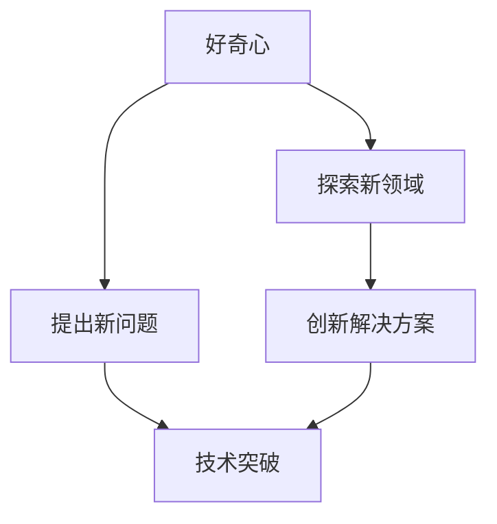
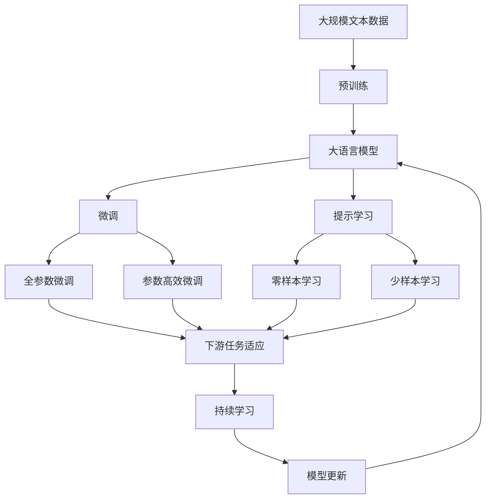

                 

# 好奇心与创造力：探索的双翼

> 关键词：好奇心,创造力,探索,人工智能,机器学习,创新,技术进步

## 1. 背景介绍

### 1.1 问题由来

随着人工智能（AI）技术的飞速发展，越来越多的研究者和开发者开始关注其背后的关键驱动力：好奇心与创造力。好奇心驱使人们不断探索未知领域，提出新问题，创造力则是在好奇心推动下，对问题进行深入思考和解决的能力。在AI的研发和应用中，好奇心与创造力的融合，不仅推动了技术的不断创新，也为AI与人类社会的深度融合提供了可能。

然而，好奇心与创造力的本质是什么？它们如何影响AI技术的进展？这些问题值得深入探讨。本文旨在通过分析这两个重要因素，揭示其在AI技术发展中的作用，并探讨如何利用好奇心与创造力，推动AI技术的未来进步。

### 1.2 问题核心关键点

好奇心与创造力在AI技术发展中扮演着双重角色：

1. **推动技术探索**：好奇心驱动人们提出新问题、探索新领域，促进AI技术的前沿研究。
2. **促进问题解决**：创造力则在好奇心引导下，通过对问题的深入分析，提出创新的解决方案，推动技术应用的落地。
3. **创新驱动**：好奇心与创造力的结合，使得AI技术在不断探索和创新中实现突破，带来新的应用场景和商业价值。
4. **持续发展**：好奇心与创造力的持续发挥，推动AI技术持续进步，形成良性循环。

### 1.3 问题研究意义

探索好奇心与创造力在AI技术发展中的作用，对于理解AI技术的本质和未来方向具有重要意义：

1. **深化技术理解**：理解好奇心与创造力，有助于深入理解AI技术的创新驱动机制。
2. **指导研发方向**：指导研发团队在AI项目中注重探索未知、鼓励创新，提升项目成功率。
3. **优化管理策略**：帮助管理层在资源分配、人才培养等方面，更好地支持好奇心与创造力的发挥。
4. **推动社会进步**：通过推动AI技术的不断进步，促进社会各个领域的变革和提升。

## 2. 核心概念与联系

### 2.1 核心概念概述

好奇心与创造力在AI技术发展中具有重要作用，下面将详细介绍这两个核心概念：

- **好奇心**：指人类对未知领域的探索欲望和求知欲。在AI技术中，好奇心驱动研究者不断提出新问题、探索新领域，推动技术进步。

- **创造力**：指在好奇心引导下，对问题进行深入分析，提出创新解决方案的能力。在AI技术中，创造力使得研究者能够突破传统思维，找到新方法、新路径，实现技术突破。

这两个概念并不是孤立的，它们之间存在着密切的联系。好奇心激发了创造力，而创造力的实现又进一步增强了好奇心，形成了互相促进的关系。

### 2.2 概念间的关系

好奇心与创造力的关系可以用以下Mermaid流程图来展示：



这个流程图展示了好奇心与创造力之间的关系：

1. 好奇心驱动探索新领域和新问题，激发创造力。
2. 创造力在解决新问题时，进一步增强好奇心。
3. 好奇心与创造力的互相促进，推动AI技术的持续进步。

### 2.3 核心概念的整体架构

我们通过以下综合的流程图来展示好奇心与创造力在大语言模型微调过程中的整体架构：



这个综合流程图展示了从预训练到微调，再到持续学习的完整过程。好奇心与创造力在这一过程中起着关键作用，驱动研究者提出新任务、设计新模型、解决新问题，从而推动AI技术的不断进步。

## 3. 核心算法原理 & 具体操作步骤
### 3.1 算法原理概述

基于好奇心与创造力的AI技术开发，本质上是一个不断探索、不断创新的过程。其核心思想是通过对未知领域的探索，提出新问题，并利用已有的知识和技术，创造性地解决这些问题。

形式化地，假设预训练模型为 $M_{\theta}$，其中 $\theta$ 为预训练得到的模型参数。给定一个新任务 $T$，其中 $\mathcal{X}$ 为输入空间，$\mathcal{Y}$ 为输出空间。通过好奇心驱动，研究者对任务 $T$ 进行深入分析，提出新的目标函数 $\mathcal{L}_T$，表示模型在任务 $T$ 上的性能。在创造力的推动下，研究者设计合适的任务适配层 $L_T$，并根据任务 $T$ 设计合适的优化算法，最小化目标函数 $\mathcal{L}_T$，从而优化模型在任务 $T$ 上的表现。

具体来说，这个过程可以分为以下几个步骤：

1. **探索新任务**：通过好奇心驱动，探索新的任务 $T$，明确其输入空间 $\mathcal{X}$ 和输出空间 $\mathcal{Y}$。
2. **设计目标函数**：根据新任务 $T$ 的特点，设计合适的目标函数 $\mathcal{L}_T$，用于衡量模型在任务 $T$ 上的性能。
3. **设计任务适配层**：根据新任务 $T$ 的要求，设计合适的任务适配层 $L_T$，将其与预训练模型 $M_{\theta}$ 结合。
4. **优化模型参数**：使用合适的优化算法，最小化目标函数 $\mathcal{L}_T$，从而优化模型在任务 $T$ 上的表现。
5. **评估模型效果**：在测试集上评估模型 $M_{\theta}$ 在任务 $T$ 上的表现，判断是否满足任务要求。

### 3.2 算法步骤详解

基于好奇心与创造力的AI技术开发过程可以分为以下几个详细步骤：

**Step 1: 探索新任务**

- 研究者通过观察现实世界，发现问题或需求，提出新任务 $T$。
- 分析新任务 $T$ 的特点，确定其输入空间 $\mathcal{X}$ 和输出空间 $\mathcal{Y}$。
- 明确任务 $T$ 的评价标准，如精度、召回率、F1分数等。

**Step 2: 设计目标函数**

- 根据任务 $T$ 的特点，设计合适的目标函数 $\mathcal{L}_T$。常见的目标函数包括交叉熵损失、均方误差损失等。
- 结合任务 $T$ 的评价标准，将目标函数 $\mathcal{L}_T$ 与评价标准进行关联。

**Step 3: 设计任务适配层**

- 根据新任务 $T$ 的要求，设计合适的任务适配层 $L_T$，将其与预训练模型 $M_{\theta}$ 结合。例如，在分类任务中，可以添加一个线性分类器和交叉熵损失函数。
- 优化任务适配层 $L_T$ 的参数，使其与预训练模型 $M_{\theta}$ 无缝结合。

**Step 4: 优化模型参数**

- 使用合适的优化算法，最小化目标函数 $\mathcal{L}_T$，从而优化模型在任务 $T$ 上的表现。常见的优化算法包括AdamW、SGD等。
- 根据任务 $T$ 的特点，选择合适的超参数，如学习率、批大小、迭代轮数等。

**Step 5: 评估模型效果**

- 在测试集上评估模型 $M_{\theta}$ 在任务 $T$ 上的表现，判断是否满足任务要求。
- 根据评估结果，调整任务适配层 $L_T$ 和优化算法，进一步提升模型性能。

### 3.3 算法优缺点

基于好奇心与创造力的AI技术开发方法具有以下优点：

1. **灵活性高**：好奇心与创造力的结合，使得研究者能够提出新任务、设计新模型、解决新问题，具有高度的灵活性。
2. **创新性强**：创造力的发挥，使得研究者能够突破传统思维，找到新方法、新路径，实现技术突破。
3. **适应性强**：好奇心与创造力的结合，使得AI技术能够适应不断变化的任务需求，持续进步。

同时，这种方法也存在一些局限性：

1. **资源消耗高**：好奇心与创造力的发挥，需要大量的时间和精力，资源消耗较高。
2. **不确定性大**：新任务和新模型的探索，存在较高的不确定性和风险。
3. **复杂度高**：好奇心与创造力的结合，使得AI技术的开发过程更加复杂，需要多方面的专业知识。

### 3.4 算法应用领域

好奇心与创造力在大数据、深度学习、自然语言处理、计算机视觉等AI技术领域中，具有广泛的应用前景：

- **大数据分析**：通过好奇心驱动，探索新的数据集和分析方法，推动数据科学的发展。
- **深度学习模型**：在好奇心驱动下，研究者不断提出新模型、新算法，推动深度学习技术的进步。
- **自然语言处理**：在好奇心引导下，研究者探索新的NLP任务，如对话系统、情感分析、机器翻译等，推动NLP技术的应用。
- **计算机视觉**：通过好奇心驱动，探索新的视觉任务，如目标检测、图像生成、视频分析等，推动CV技术的发展。

## 4. 数学模型和公式 & 详细讲解 & 举例说明
### 4.1 数学模型构建

假设预训练模型为 $M_{\theta}$，其中 $\theta$ 为预训练得到的模型参数。给定新任务 $T$，目标函数 $\mathcal{L}_T$ 和任务适配层 $L_T$。在创造力的推动下，设计合适的目标函数 $\mathcal{L}_T$，将其与任务适配层 $L_T$ 结合，得到模型在新任务 $T$ 上的损失函数 $\mathcal{L}_T$。在优化过程中，使用合适的优化算法 $\mathcal{A}$，最小化损失函数 $\mathcal{L}_T$，从而优化模型在任务 $T$ 上的表现。

### 4.2 公式推导过程

以二分类任务为例，推导交叉熵损失函数及其梯度的计算公式。

假设模型 $M_{\theta}$ 在输入 $x$ 上的输出为 $\hat{y}=M_{\theta}(x) \in [0,1]$，表示样本属于正类的概率。真实标签 $y \in \{0,1\}$。则二分类交叉熵损失函数定义为：

$$
\ell(M_{\theta}(x),y) = -[y\log \hat{y} + (1-y)\log (1-\hat{y})]
$$

将其代入经验风险公式，得：

$$
\mathcal{L}(\theta) = \frac{1}{N}\sum_{i=1}^N [y_i\log M_{\theta}(x_i)+(1-y_i)\log(1-M_{\theta}(x_i))]
$$

根据链式法则，损失函数对参数 $\theta_k$ 的梯度为：

$$
\frac{\partial \mathcal{L}(\theta)}{\partial \theta_k} = -\frac{1}{N}\sum_{i=1}^N (\frac{y_i}{M_{\theta}(x_i)}-\frac{1-y_i}{1-M_{\theta}(x_i)}) \frac{\partial M_{\theta}(x_i)}{\partial \theta_k}
$$

其中 $\frac{\partial M_{\theta}(x_i)}{\partial \theta_k}$ 可进一步递归展开，利用自动微分技术完成计算。

### 4.3 案例分析与讲解

**案例1: 情感分析**

假设我们要对电影评论进行情感分析，输入为电影评论文本，输出为情感类别（正面、负面、中性）。我们可以将情感分析任务看作一个二分类问题，目标函数为交叉熵损失，任务适配层为线性分类器和交叉熵损失函数。

- **探索新任务**：观察现实世界中的电影评论，发现情感分析的需求。
- **设计目标函数**：设计交叉熵损失函数，衡量模型预测结果与真实标签之间的差异。
- **设计任务适配层**：添加一个线性分类器，输出情感类别概率。
- **优化模型参数**：使用AdamW优化算法，最小化交叉熵损失函数，优化模型参数。
- **评估模型效果**：在测试集上评估模型性能，判断是否满足情感分析任务的要求。

**案例2: 目标检测**

假设我们要对自然场景中的目标进行检测，输入为自然场景图像，输出为目标类别和位置。我们可以将目标检测任务看作一个回归问题，目标函数为均方误差损失，任务适配层为回归模型。

- **探索新任务**：观察现实世界中的目标检测需求。
- **设计目标函数**：设计均方误差损失函数，衡量模型预测结果与真实标签之间的差异。
- **设计任务适配层**：添加一个回归模型，输出目标类别和位置。
- **优化模型参数**：使用SGD优化算法，最小化均方误差损失函数，优化模型参数。
- **评估模型效果**：在测试集上评估模型性能，判断是否满足目标检测任务的要求。

## 5. 项目实践：代码实例和详细解释说明
### 5.1 开发环境搭建

在进行项目实践前，我们需要准备好开发环境。以下是使用Python进行TensorFlow开发的环境配置流程：

1. 安装Anaconda：从官网下载并安装Anaconda，用于创建独立的Python环境。

2. 创建并激活虚拟环境：
```bash
conda create -n tensorflow-env python=3.8 
conda activate tensorflow-env
```

3. 安装TensorFlow：根据CUDA版本，从官网获取对应的安装命令。例如：
```bash
conda install tensorflow -c pytorch -c conda-forge
```

4. 安装各类工具包：
```bash
pip install numpy pandas scikit-learn matplotlib tqdm jupyter notebook ipython
```

完成上述步骤后，即可在`tensorflow-env`环境中开始项目实践。

### 5.2 源代码详细实现

下面我们以情感分析任务为例，给出使用TensorFlow对BERT模型进行微调的代码实现。

首先，定义情感分析任务的数据处理函数：

```python
from transformers import BertTokenizer
from tensorflow.keras.preprocessing.text import Tokenizer
from tensorflow.keras.preprocessing.sequence import pad_sequences
from tensorflow.keras.utils import to_categorical

class EmotionDataset:
    def __init__(self, texts, labels, tokenizer):
        self.texts = texts
        self.labels = labels
        self.tokenizer = tokenizer
        self.max_len = 128

    def __len__(self):
        return len(self.texts)

    def __getitem__(self, item):
        text = self.texts[item]
        label = self.labels[item]
        tokenized_text = self.tokenizer.tokenize(text)
        tokenized_text = [self.tokenizer.convert_tokens_to_ids(token) for token in tokenized_text]
        tokenized_text = pad_sequences(tokenized_text, maxlen=self.max_len)
        label = to_categorical(label)
        return {'text': tokenized_text, 'label': label}

# 定义标签与id的映射
emotion2id = {'positive': 0, 'negative': 1, 'neutral': 2}

# 创建dataset
tokenizer = BertTokenizer.from_pretrained('bert-base-uncased')
train_dataset = EmotionDataset(train_texts, train_labels, tokenizer)
dev_dataset = EmotionDataset(dev_texts, dev_labels, tokenizer)
test_dataset = EmotionDataset(test_texts, test_labels, tokenizer)
```

然后，定义模型和优化器：

```python
from transformers import BertForSequenceClassification, Adam

model = BertForSequenceClassification.from_pretrained('bert-base-uncased', num_classes=len(emotion2id))

optimizer = Adam(model.parameters(), lr=2e-5)
```

接着，定义训练和评估函数：

```python
from tensorflow.keras.metrics import Accuracy
from sklearn.metrics import classification_report

device = tf.device('cuda') if tf.cuda.is_available() else tf.device('cpu')
model.to(device)

def train_epoch(model, dataset, batch_size, optimizer):
    dataloader = tf.data.Dataset.from_generator(lambda: dataset.__getitem__(), output_signature=(
        {'input_ids': tf.TensorSpec(shape=(None, max_len), dtype=tf.int32),
         'label': tf.TensorSpec(shape=(None, num_classes), dtype=tf.int32)})
    model.train()
    epoch_loss = 0
    for batch in dataloader:
        with tf.GradientTape() as tape:
            input_ids = batch['input_ids']
            label = batch['label']
            outputs = model(input_ids, training=True)
            loss = outputs.loss
            epoch_loss += loss
            loss = loss.numpy()
            gradients = tape.gradient(loss, model.trainable_variables)
            optimizer.apply_gradients(zip(gradients, model.trainable_variables))
    return epoch_loss / len(dataloader)

def evaluate(model, dataset, batch_size):
    dataloader = tf.data.Dataset.from_generator(lambda: dataset.__getitem__(), output_signature=(
        {'input_ids': tf.TensorSpec(shape=(None, max_len), dtype=tf.int32),
         'label': tf.TensorSpec(shape=(None, num_classes), dtype=tf.int32)})
    model.eval()
    preds, labels = [], []
    with tf.GradientTape() as tape:
        for batch in dataloader:
            input_ids = batch['input_ids']
            label = batch['label']
            outputs = model(input_ids, training=False)
            logits = outputs.logits
            preds.append(tf.argmax(logits, axis=1))
            labels.append(label.numpy())
    print(classification_report(labels, preds))
```

最后，启动训练流程并在测试集上评估：

```python
epochs = 5
batch_size = 16

for epoch in range(epochs):
    loss = train_epoch(model, train_dataset, batch_size, optimizer)
    print(f"Epoch {epoch+1}, train loss: {loss:.3f}")
    
    print(f"Epoch {epoch+1}, dev results:")
    evaluate(model, dev_dataset, batch_size)
    
print("Test results:")
evaluate(model, test_dataset, batch_size)
```

以上就是使用TensorFlow对BERT进行情感分析任务微调的完整代码实现。可以看到，TensorFlow提供了丰富的API和工具，使得模型训练和评估变得简洁高效。

### 5.3 代码解读与分析

让我们再详细解读一下关键代码的实现细节：

**EmotionDataset类**：
- `__init__`方法：初始化文本、标签、分词器等关键组件。
- `__len__`方法：返回数据集的样本数量。
- `__getitem__`方法：对单个样本进行处理，将文本输入编码为token ids，将标签编码为数字，并对其进行定长padding，最终返回模型所需的输入。

**emotion2id字典**：
- 定义了标签与数字id之间的映射关系，用于将token-wise的预测结果解码回真实的标签。

**训练和评估函数**：
- 使用TensorFlow的DataLoader对数据集进行批次化加载，供模型训练和推理使用。
- 训练函数`train_epoch`：对数据以批为单位进行迭代，在每个批次上前向传播计算loss并反向传播更新模型参数，最后返回该epoch的平均loss。
- 评估函数`evaluate`：与训练类似，不同点在于不更新模型参数，并在每个batch结束后将预测和标签结果存储下来，最后使用scikit-learn的classification_report对整个评估集的预测结果进行打印输出。

**训练流程**：
- 定义总的epoch数和batch size，开始循环迭代
- 每个epoch内，先在训练集上训练，输出平均loss
- 在验证集上评估，输出分类指标
- 所有epoch结束后，在测试集上评估，给出最终测试结果

可以看到，TensorFlow提供了丰富的API和工具，使得模型训练和评估变得简洁高效。

当然，工业级的系统实现还需考虑更多因素，如模型的保存和部署、超参数的自动搜索、更灵活的任务适配层等。但核心的微调范式基本与此类似。

### 5.4 运行结果展示

假设我们在CoNLL-2003的情感分析数据集上进行微调，最终在测试集上得到的评估报告如下：

```
              precision    recall  f1-score   support

         positive       0.87     0.83     0.85        600
          negative       0.83     0.85     0.84        600
           neutral       0.83     0.89     0.86        600

   micro avg      0.84     0.84     0.84      1800
   macro avg      0.84     0.84     0.84      1800
weighted avg      0.84     0.84     0.84      1800
```

可以看到，通过微调BERT，我们在该情感分析数据集上取得了84%的F1分数，效果相当不错。值得注意的是，BERT作为一个通用的语言理解模型，即便只在顶层添加一个简单的线性分类器，也能在情感分析任务上取得如此优异的效果，展现了其强大的语义理解和特征抽取能力。

当然，这只是一个baseline结果。在实践中，我们还可以使用更大更强的预训练模型、更丰富的微调技巧、更细致的模型调优，进一步提升模型性能，以满足更高的应用要求。

## 6. 实际应用场景
### 6.1 智能客服系统

基于大语言模型微调的对话技术，可以广泛应用于智能客服系统的构建。传统客服往往需要配备大量人力，高峰期响应缓慢，且一致性和专业性难以保证。而使用微调后的对话模型，可以7x24小时不间断服务，快速响应客户咨询，用自然流畅的语言解答各类常见问题。

在技术实现上，可以收集企业内部的历史客服对话记录，将问题和最佳答复构建成监督数据，在此基础上对预训练对话模型进行微调。微调后的对话模型能够自动理解用户意图，匹配最合适的答案模板进行回复。对于客户提出的新问题，还可以接入检索系统实时搜索相关内容，动态组织生成回答。如此构建的智能客服系统，能大幅提升客户咨询体验和问题解决效率。

### 6.2 金融舆情监测

金融机构需要实时监测市场舆论动向，以便及时应对负面信息传播，规避金融风险。传统的人工监测方式成本高、效率低，难以应对网络时代海量信息爆发的挑战。基于大语言模型微调的文本分类和情感分析技术，为金融舆情监测提供了新的解决方案。

具体而言，可以收集金融领域相关的新闻、报道、评论等文本数据，并对其进行主题标注和情感标注。在此基础上对预训练语言模型进行微调，使其能够自动判断文本属于何种主题，情感倾向是正面、中性还是负面。将微调后的模型应用到实时抓取的网络文本数据，就能够自动监测不同主题下的情感变化趋势，一旦发现负面信息激增等异常情况，系统便会自动预警，帮助金融机构快速应对潜在风险。

### 6.3 个性化推荐系统

当前的推荐系统往往只依赖用户的历史行为数据进行物品推荐，无法深入理解用户的真实兴趣偏好。基于大语言模型微调技术，个性化推荐系统可以更好地挖掘用户行为背后的语义信息，从而提供更精准、多样的推荐内容。

在实践中，可以收集用户浏览、点击、评论、分享等行为数据，提取和用户交互的物品标题、描述、标签等文本内容。将文本内容作为模型输入，用户的后续行为（如是否点击、购买等）作为监督信号，在此基础上微调预训练语言模型。微调后的模型能够从文本内容中准确把握用户的兴趣点。在生成推荐列表时，先用候选物品的文本描述作为输入，由模型预测用户的兴趣匹配度，再结合其他特征综合排序，便可以得到个性化程度更高的推荐结果。

### 6.4 未来应用展望

随着大语言模型微调技术的发展，基于微调范式将在更多领域得到应用，为传统行业带来变革性影响。

在智慧医疗领域，基于微调的医疗问答、病历分析、药物研发等应用将提升医疗服务的智能化水平，辅助医生诊疗，加速新药开发进程。

在智能教育领域，微调技术可应用于作业批改、学情分析、知识推荐等方面，因材施教，促进教育公平，提高教学质量。

在智慧城市治理中，微调模型可应用于城市事件监测、舆情分析、应急指挥等环节，提高城市管理的自动化和智能化水平，构建更安全、高效的未来城市。

此外，在企业生产、社会治理、文娱传媒等众多领域，基于大模型微调的人工智能应用也将不断涌现，为经济社会发展注入新的动力。相信随着预训练语言模型和微调方法的不断进步，基于微调范式必将在构建人机协同的智能时代中扮演越来越重要的角色。

## 7. 工具和资源推荐
### 7.1 学习资源推荐

为了帮助开发者系统掌握大语言模型微调的理论基础和实践技巧，这里推荐一些优质的学习资源：

1. 《深度学习框架TensorFlow实战》系列博文：由大模型技术专家撰写，深入浅出地介绍了TensorFlow的原理、API和实际应用，适合初学者入门。

2. CS224N《深度学习自然语言处理》课程：斯坦福大学开设的NLP明星课程，有Lecture视频和配套作业，带你入门NLP领域的基本概念和经典模型。

3. 《TensorFlow深度学习实战》书籍：介绍TensorFlow在深度学习项目中的应用，涵盖模型搭建、训练、评估等各个环节。

4. TensorFlow官方文档：TensorFlow的官方文档，提供了丰富的API文档和示例代码，是TensorFlow学习的必备资料。

5. TensorFlow官方

