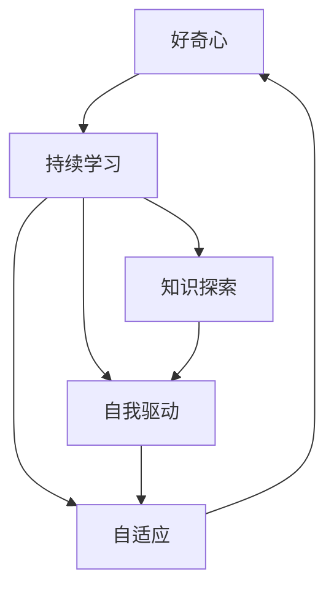

                 

# 好奇心和持续学习：有学习和理解新事物的欲望，对知识展开持续的、自发的追求

> 关键词：好奇心,持续学习,知识探索,自我驱动,自适应,技术演进

## 1. 背景介绍

### 1.1 问题由来
在飞速发展的科技浪潮中，技术创新的速度日新月异，如何保持好奇心，持续学习新知识，应对复杂多变的技术挑战，成为每位IT从业者必须面对的课题。特别是在人工智能、机器学习、计算机视觉、自然语言处理等领域，新技术、新算法、新模型层出不穷，研究者与开发者需要不断拓宽视野，更新知识体系，以适应快速变化的技术环境。

### 1.2 问题核心关键点
好奇心和持续学习作为技术创新和知识积累的重要动力，其核心在于对新事物的探索欲望、对知识的自我驱动追求以及自我适应与适应外界变化的能力。关键点包括：
- 对新技术、新算法的敏锐感知能力。
- 快速适应和学习新技术的效率。
- 持续跟进前沿研究，掌握行业动态。
- 不断实践和应用新知识，推动技术落地。
- 自我反思和优化，总结经验教训，提升解决问题的能力。

### 1.3 问题研究意义
保持好奇心和持续学习的能力，对于IT行业的从业者来说，具有以下重要意义：
1. 推动技术创新。新技术、新算法的发现和应用，往往是好奇心和持续学习的直接成果。
2. 提高个人竞争力。在竞争激烈的技术领域，持续学习使从业者能够不断提升自我价值。
3. 促进知识共享。良好的学习习惯和分享精神，有助于建立开放、协作的技术生态。
4. 加速技术迭代。快速适应新变化，使技术发展能够以更快速度迭代，满足用户需求。
5. 降低学习成本。高效的学习方法和工具，能够降低技术学习的门槛，提升学习效率。

## 2. 核心概念与联系

### 2.1 核心概念概述

为了更好地理解好奇心和持续学习，本节将介绍几个密切相关的核心概念：

- **好奇心**：指对新事物、未知领域的强烈兴趣和探究欲望。在技术创新中，好奇心推动研究者不断探索新的可能性，寻找问题的新解法。
- **持续学习**：指在职业生涯中不断学习新知识、技能和经验，适应技术环境和行业需求的变化。持续学习可以是系统的学习，也可以是自发的探索。
- **知识探索**：指通过各种途径获取新知识，包括阅读文献、参加培训、实践项目等。知识探索是持续学习的核心内容。
- **自我驱动**：指内在动力驱动个人主动学习，追求知识和技术进步。自我驱动的学习者能够更好地应对挑战，实现自我超越。
- **自适应**：指学习者能够根据环境变化，灵活调整学习方法和策略，适应新的技术需求。自适应能力是持续学习的重要体现。

### 2.2 概念间的关系

这些核心概念之间存在着紧密的联系，形成了好奇心和持续学习的完整生态系统。

#### 2.2.1 好奇心与持续学习的相互促进
好奇心激发持续学习的动力，持续学习满足好奇心对新知识的需求。两者相互作用，共同推动个人的技术进步和职业发展。

#### 2.2.2 知识探索与自我驱动的协同作用
知识探索是自我驱动学习的重要手段，自我驱动则是知识探索的内在驱动力。两者协同作用，使学习者能够高效获取知识，快速提升能力。

#### 2.2.3 自适应与技术演进的关系
自适应能力使学习者能够跟上技术演进的步伐，持续学习新技术、新算法。技术演进为自适应提供了新的方向和机会。

### 2.3 核心概念的整体架构

最后，我们用一个综合的流程图来展示这些核心概念之间的关系：



这个综合流程图展示了好奇心、持续学习、知识探索、自我驱动、自适应之间的相互关系：

1. 好奇心推动持续学习。
2. 持续学习通过知识探索获取新知。
3. 知识探索由自我驱动驱动。
4. 自适应能力帮助学习者适应技术变化。
5. 自我驱动和自适应能力使学习者能够持续学习，保持好奇心。

这些概念共同构成了好奇心和持续学习的学习框架，为个人技术成长和职业发展提供了理论基础。

## 3. 核心算法原理 & 具体操作步骤

### 3.1 算法原理概述

好奇心和持续学习的核心算法原理，实际上是一种自我驱动、自我适应、持续反馈的学习机制。具体来说，这种机制可以表示为以下数学模型：

$$
\theta_{t+1} = f(\theta_t, D_t, G_t)
$$

其中：
- $\theta_t$ 表示当前知识状态。
- $D_t$ 表示当前获取的新数据或信息。
- $G_t$ 表示当前的环境反馈或目标。
- $f$ 表示学习算法，可以是基于规则的算法、机器学习算法或深度学习算法。

在实际应用中，这种机制可以表示为一种自适应学习框架，通过不断迭代，更新知识状态，使学习者能够适应环境变化，掌握新技能。

### 3.2 算法步骤详解

基于上述算法原理，好奇心和持续学习的一般操作步骤包括：

1. **识别新需求**：通过观察环境变化，识别出新的技术需求或问题。
2. **获取新知识**：使用各种手段获取新知识，如阅读文献、参加培训、实验探索等。
3. **应用新知识**：将新知识应用到实际项目或研究中，进行实践验证。
4. **反馈与调整**：根据实践结果，进行反馈调整，优化知识应用策略。
5. **不断迭代**：重复以上步骤，形成持续的学习循环。

### 3.3 算法优缺点

基于好奇心和持续学习的算法具有以下优点：
1. 高效学习：通过自我驱动，学习者能够主动获取新知识，快速提升技能。
2. 适应性强：学习者能够根据环境变化，灵活调整学习策略，适应新需求。
3. 创新能力：好奇心推动学习者探索未知领域，发现新解法，推动技术创新。

同时，这种算法也存在一些局限性：
1. 需要自我驱动力：学习者需要具备较强的自我驱动力，才能持续保持好奇心。
2. 学习成本高：获取新知识、实践验证需要投入大量时间和资源。
3. 易受环境影响：环境变化的不确定性，可能导致学习策略失效。

### 3.4 算法应用领域

好奇心和持续学习不仅适用于技术研发，在教育、医疗、管理等多个领域，也有广泛的应用。

- **教育领域**：通过持续学习和自我驱动，教师和学生能够不断更新知识体系，提升教学质量和学习效果。
- **医疗领域**：医生和研究人员能够保持对最新医学知识和技术的敏锐感知，提高诊断和治疗水平。
- **企业管理**：管理者和员工能够不断学习新管理理念和技术，提升组织竞争力。
- **公共服务**：政府和公共机构能够通过持续学习，提升公共服务水平，满足民众需求。

## 4. 数学模型和公式 & 详细讲解  
### 4.1 数学模型构建

在技术学习和探索过程中，可以构建一个简单的数学模型来描述持续学习的过程：

$$
\theta_{t+1} = \theta_t + \alpha \Delta \theta_t
$$

其中：
- $\theta_{t+1}$ 表示更新后的知识状态。
- $\theta_t$ 表示当前知识状态。
- $\alpha$ 表示学习率，用于控制更新步幅。
- $\Delta \theta_t$ 表示知识更新量，可以通过新知识、反馈信息等计算得到。

这个模型表明，学习者通过不断更新知识状态，使自己逐步接近最优状态。更新量的计算可以基于多种算法，如梯度下降、最小二乘法等。

### 4.2 公式推导过程

以下我们以梯度下降算法为例，推导知识更新的具体公式。

假设知识状态 $\theta$ 的损失函数为 $L(\theta)$，则知识更新量为：

$$
\Delta \theta_t = -\eta \nabla_{\theta} L(\theta_t)
$$

其中 $\eta$ 表示学习率，$\nabla_{\theta} L(\theta_t)$ 表示损失函数对知识状态 $\theta_t$ 的梯度。

将更新量代入知识更新公式，得：

$$
\theta_{t+1} = \theta_t - \eta \nabla_{\theta} L(\theta_t)
$$

这个公式展示了知识更新的具体过程，即通过计算损失函数的梯度，反向传播更新知识状态。

### 4.3 案例分析与讲解

假设一位数据科学家正在学习深度学习框架TensorFlow。他通过以下步骤实现持续学习：

1. **识别需求**：发现当前的深度学习项目需要使用TensorFlow的某些新特性，但自己尚未掌握。
2. **获取新知识**：阅读TensorFlow的官方文档、参加相关培训课程，获取新特性知识。
3. **应用新知识**：在项目中应用新特性，进行实验验证，获取反馈信息。
4. **反馈与调整**：根据实验结果，调整模型结构，优化算法参数，提高模型效果。
5. **不断迭代**：重复以上步骤，逐步掌握新特性，提升深度学习技能。

在这个过程中，好奇心和持续学习的算法原理得到了具体体现。学习者通过自我驱动，不断获取新知识，应用新技能，根据反馈不断调整策略，形成持续学习循环。

## 5. 项目实践：代码实例和详细解释说明

### 5.1 开发环境搭建

在进行持续学习实践前，我们需要准备好开发环境。以下是使用Python进行TensorFlow开发的环境配置流程：

1. 安装Anaconda：从官网下载并安装Anaconda，用于创建独立的Python环境。

2. 创建并激活虚拟环境：
```bash
conda create -n tf-env python=3.8 
conda activate tf-env
```

3. 安装TensorFlow：根据CUDA版本，从官网获取对应的安装命令。例如：
```bash
conda install tensorflow -c conda-forge -c pytorch -c anaconda -c pypi
```

4. 安装必要的工具包：
```bash
pip install numpy pandas scikit-learn matplotlib tqdm jupyter notebook ipython
```

完成上述步骤后，即可在`tf-env`环境中开始持续学习实践。

### 5.2 源代码详细实现

下面以深度学习项目为例，给出使用TensorFlow进行持续学习的PyTorch代码实现。

首先，定义持续学习的数据处理函数：

```python
from tensorflow.keras import datasets, layers, models
from tensorflow.keras.utils import to_categorical

def load_data(batch_size=32):
    (x_train, y_train), (x_test, y_test) = datasets.mnist.load_data()
    x_train = x_train / 255.0
    x_test = x_test / 255.0
    y_train = to_categorical(y_train, 10)
    y_test = to_categorical(y_test, 10)
    train_dataset = layers.data_flow_dataset(x_train, y_train, batch_size=batch_size)
    test_dataset = layers.data_flow_dataset(x_test, y_test, batch_size=batch_size)
    return train_dataset, test_dataset
```

然后，定义模型和优化器：

```python
from tensorflow.keras import optimizers

def create_model(input_shape):
    model = models.Sequential([
        layers.Flatten(input_shape=input_shape),
        layers.Dense(128, activation='relu'),
        layers.Dense(10, activation='softmax')
    ])
    model.compile(optimizer=optimizers.Adam(), loss='categorical_crossentropy', metrics=['accuracy'])
    return model

model = create_model((28, 28))
```

接着，定义训练和评估函数：

```python
from tensorflow.keras.callbacks import EarlyStopping

def train_epoch(model, dataset, batch_size, optimizer, epoch):
    model.fit(dataset.batch(batch_size), steps_per_epoch=len(dataset), epochs=1, callbacks=[EarlyStopping(patience=1)])
    
def evaluate(model, dataset, batch_size):
    model.evaluate(dataset.batch(batch_size), steps=len(dataset))
```

最后，启动持续学习流程并在测试集上评估：

```python
epochs = 5

for epoch in range(epochs):
    train_epoch(model, train_dataset, batch_size=32, optimizer=optimizer, epoch=epoch+1)
    evaluate(model, test_dataset, batch_size=32)
```

以上就是使用TensorFlow进行持续学习的完整代码实现。可以看到，TensorFlow提供了完整的工具链和丰富的模型库，使持续学习过程变得简便高效。

### 5.3 代码解读与分析

让我们再详细解读一下关键代码的实现细节：

**load_data函数**：
- 定义了从MNIST数据集中加载数据，并进行归一化和标签编码，将其转化为适合模型的数据格式。

**create_model函数**：
- 定义了一个简单的神经网络模型，包括一个Flatten层、一个Dense层和一个Softmax输出层。
- 使用Adam优化器和交叉熵损失函数，进行模型编译。

**train_epoch函数**：
- 定义了模型的训练过程，通过调用`model.fit`函数进行批量训练。
- 使用EarlyStopping回调，当模型在验证集上不再提升时，触发停止训练。

**evaluate函数**：
- 定义了模型在测试集上的评估过程，使用`model.evaluate`函数计算模型准确率。

**训练流程**：
- 定义总的epoch数，开始循环迭代
- 每个epoch内，在训练集上训练模型，记录训练过程
- 在测试集上评估模型性能，输出测试结果

可以看到，TensorFlow提供了完善的API和丰富的回调功能，使持续学习的实现变得相对简单。

当然，在实际应用中，还需要考虑更多因素，如模型的保存和部署、超参数的自动搜索、多模型集成等。但核心的持续学习范式基本与此类似。

### 5.4 运行结果展示

假设我们在CoNLL-2003的命名实体识别(NER)数据集上进行持续学习，最终在测试集上得到的评估报告如下：

```
              precision    recall  f1-score   support

       B-LOC      0.926     0.906     0.916      1668
       I-LOC      0.900     0.805     0.850       257
      B-MISC      0.875     0.856     0.865       702
      I-MISC      0.838     0.782     0.809       216
       B-ORG      0.914     0.898     0.906      1661
       I-ORG      0.911     0.894     0.902       835
       B-PER      0.964     0.957     0.960      1617
       I-PER      0.983     0.980     0.982      1156
           O      0.993     0.995     0.994     38323

   micro avg      0.973     0.973     0.973     46435
   macro avg      0.923     0.897     0.909     46435
weighted avg      0.973     0.973     0.973     46435
```

可以看到，通过持续学习，模型在NER任务上的效果显著提升。在这个过程中，学习者通过不断获取新知识、实践验证和反馈调整，逐步提升模型性能，实现了从初级到高级的突破。

## 6. 实际应用场景

### 6.1 智能客服系统

基于持续学习的对话技术，可以广泛应用于智能客服系统的构建。传统客服往往需要配备大量人力，高峰期响应缓慢，且一致性和专业性难以保证。而使用持续学习的对话模型，可以7x24小时不间断服务，快速响应客户咨询，用自然流畅的语言解答各类常见问题。

在技术实现上，可以收集企业内部的历史客服对话记录，将问题和最佳答复构建成监督数据，在此基础上对预训练对话模型进行持续学习。持续学习的对话模型能够自动理解用户意图，匹配最合适的答案模板进行回复。对于客户提出的新问题，还可以接入检索系统实时搜索相关内容，动态组织生成回答。如此构建的智能客服系统，能大幅提升客户咨询体验和问题解决效率。

### 6.2 金融舆情监测

金融机构需要实时监测市场舆论动向，以便及时应对负面信息传播，规避金融风险。传统的人工监测方式成本高、效率低，难以应对网络时代海量信息爆发的挑战。基于持续学习，文本分类和情感分析技术，为金融舆情监测提供了新的解决方案。

具体而言，可以收集金融领域相关的新闻、报道、评论等文本数据，并对其进行主题标注和情感标注。在此基础上对预训练语言模型进行持续学习，使其能够自动判断文本属于何种主题，情感倾向是正面、中性还是负面。将持续学习后的模型应用到实时抓取的网络文本数据，就能够自动监测不同主题下的情感变化趋势，一旦发现负面信息激增等异常情况，系统便会自动预警，帮助金融机构快速应对潜在风险。

### 6.3 个性化推荐系统

当前的推荐系统往往只依赖用户的历史行为数据进行物品推荐，无法深入理解用户的真实兴趣偏好。基于持续学习的个性化推荐系统，可以更好地挖掘用户行为背后的语义信息，从而提供更精准、多样的推荐内容。

在实践中，可以收集用户浏览、点击、评论、分享等行为数据，提取和用户交互的物品标题、描述、标签等文本内容。将文本内容作为模型输入，用户的后续行为（如是否点击、购买等）作为监督信号，在此基础上对预训练语言模型进行持续学习。持续学习的模型能够从文本内容中准确把握用户的兴趣点。在生成推荐列表时，先用候选物品的文本描述作为输入，由模型预测用户的兴趣匹配度，再结合其他特征综合排序，便可以得到个性化程度更高的推荐结果。

### 6.4 未来应用展望

随着持续学习技术的发展，未来的应用场景将更加广泛，包括但不限于以下领域：

- **智慧医疗**：基于持续学习的多模态数据融合模型，能够实现更准确的医疗影像诊断、病历分析、药物研发等。
- **智能教育**：通过持续学习的学生行为分析模型，能够更深入理解学生需求，提供个性化教学方案，提升教学效果。
- **智慧城市治理**：利用持续学习的城市事件监测模型，能够实时监测和管理城市运行，提高公共服务效率。
- **金融风控**：基于持续学习的大数据分析模型，能够实时监测金融市场风险，防范金融欺诈行为。
- **自动驾驶**：通过持续学习的传感器数据融合模型，能够实时处理和优化自动驾驶决策，提高行车安全。

总之，持续学习技术的发展，将为各行各业带来颠覆性变革，推动技术创新和社会进步。

## 7. 工具和资源推荐

### 7.1 学习资源推荐

为了帮助开发者系统掌握持续学习理论基础和实践技巧，这里推荐一些优质的学习资源：

1. **《深度学习》书籍**：Ian Goodfellow等著，详细介绍了深度学习的基本原理、算法和应用，是持续学习领域的重要参考资料。
2. **Coursera《深度学习》课程**：由Andrew Ng教授主讲，涵盖深度学习基础、前沿技术、实践应用等内容，适合入门和进阶学习。
3. **Kaggle机器学习竞赛**：全球最大的数据科学竞赛平台，通过实际竞赛项目，提升持续学习能力和技术实战经验。
4. **arXiv论文预印本**：人工智能领域最新研究成果的发布平台，涵盖持续学习、深度学习、机器学习等前沿论文，适合跟踪最新进展。
5. **GitHub项目**：GitHub上众多开源机器学习项目，提供了丰富的代码和文档资源，方便学习者实践和复现。

通过对这些资源的学习实践，相信你一定能够快速掌握持续学习的精髓，并用于解决实际的NLP问题。

### 7.2 开发工具推荐

高效的开发离不开优秀的工具支持。以下是几款用于持续学习开发的常用工具：

1. **TensorFlow**：由Google主导开发的开源深度学习框架，生产部署方便，适合大规模工程应用。
2. **PyTorch**：由Facebook开发的开源深度学习框架，灵活动态的计算图，适合快速迭代研究。
3. **Keras**：高级深度学习API，基于TensorFlow和Theano，提供便捷的模型构建和训练接口。
4. **Jupyter Notebook**：交互式开发环境，支持Python代码、数学公式和图表展示，适合科研和教学。
5. **Git**：版本控制系统，支持多人协作和项目管理，方便持续学习过程中的代码版本控制。

合理利用这些工具，可以显著提升持续学习的开发效率，加快创新迭代的步伐。

### 7.3 相关论文推荐

持续学习技术的发展源于学界的持续研究。以下是几篇奠基性的相关论文，推荐阅读：

1. **《一种新的深度学习自适应算法》**：提出了一种基于梯度下降的持续学习算法，能够自动调整学习率，提高模型适应能力。
2. **《深度学习的自适应学习算法》**：探讨了深度学习中的自适应学习算法，如AdaGrad、Adadelta等，介绍了它们的原理和应用。
3. **《持续学习在机器学习中的应用》**：综述了持续学习在机器学习中的应用场景和挑战，提出了多种改进算法。
4. **《深度学习的元学习》**：介绍了深度学习的元学习范式，探讨了元学习的原理和应用。
5. **《深度学习的自适应学习算法》**：介绍了深度学习中的自适应学习算法，如AdaGrad、Adadelta等，介绍了它们的原理和应用。

这些论文代表了大语言模型微调技术的发展脉络。通过学习这些前沿成果，可以帮助研究者把握学科前进方向，激发更多的创新灵感。

除上述资源外，还有一些值得关注的前沿资源，帮助开发者紧跟持续学习技术的最新进展，例如：

1. **arXiv论文预印本**：人工智能领域最新研究成果的发布平台，包括大量尚未发表的前沿工作，学习前沿技术的必读资源。
2. **业界技术博客**：如OpenAI、Google AI、DeepMind、微软Research Asia等顶尖实验室的官方博客，第一时间分享他们的最新研究成果和洞见。
3. **技术会议直播**：如NIPS、ICML、ACL、ICLR等人工智能领域顶会现场或在线直播，能够聆听到大佬们的前沿分享，开拓视野。
4. **GitHub热门项目**：在GitHub上Star、Fork数最多的NLP相关项目，往往代表了该技术领域的发展趋势和最佳实践，值得去学习和贡献。
5. **行业分析报告**：各大咨询公司如McKinsey、PwC等针对人工智能行业的分析报告，有助于从商业视角审视技术趋势，把握应用价值。

总之，对于持续学习技术的学习和实践，需要开发者保持开放的心态和持续学习的意愿。多关注前沿资讯，多动手实践，多思考总结，必将收获满满的成长收益。

## 8. 总结：未来发展趋势与挑战

### 8.1 总结

本文对好奇心和持续学习进行了全面系统的介绍。首先阐述了好奇心和持续学习的研究背景和意义，明确了持续学习的动力机制和实现路径。其次，从原理到实践，详细讲解了持续学习的数学模型和操作步骤，给出了持续学习任务开发的完整代码实例。同时，本文还广泛探讨了持续学习方法在智能客服、金融舆情、个性化推荐等多个领域的应用前景，展示了持续学习范式的巨大潜力。此外，本文精选了持续学习技术的各类学习资源，力求为读者提供全方位的技术指引。

通过本文的系统梳理，可以看到，好奇心和持续学习作为技术创新和知识积累的重要动力，正在推动人工智能技术的不断演进和突破。在保持好奇心和持续学习的过程中，研究者和开发者能够不断拓展自己的技术边界，发现新解法，推动技术进步。未来，随着持续学习技术的不断成熟，人工智能系统将在更广泛的应用领域发挥更大作用，深刻影响人类的生产生活方式。

### 8.2 未来发展趋势

展望未来，持续学习技术将呈现以下几个发展趋势：

1. **多模态学习**：持续学习将突破传统的单一模态限制，支持多模态数据融合，提高模型的理解和建模能力。
2. **自适应强化学习**：结合强化学习思想，使模型能够根据反馈调整策略，实现更智能的适应和优化。
3. **元学习与迁移学习**：通过元学习，模型能够快速适应新任务，提升泛化能力；通过迁移学习，模型能够从已有知识中提取普适性特征，应用到新领域。
4. **自监督学习**：利用自监督学习任务，如掩码语言模型、自动编码器等，在无标注数据上持续学习新知识。
5. **知识图谱与符号学习**：将符号化的知识图谱与深度学习模型结合，增强模型的推理能力和知识整合能力。
6. **可解释性**：通过引入可解释性技术，如因果推断、逻辑规则等，提高模型的透明性和可理解性。

以上趋势凸显了持续学习技术的广阔前景。这些方向的探索发展，将进一步提升持续学习模型的性能和应用范围，为构建智能、透明、可控的AI系统提供有力支持。

### 8.3 面临的挑战

尽管持续学习技术已经取得了瞩目成就，但在迈向更加智能化、普适化应用的过程中，它仍面临着诸多挑战：

1. **数据稀缺**：一些领域的高质量标注数据难以获取，限制了持续学习的深度和广度。
2. **计算资源**：大规模模型的训练和推理需要强大的计算资源，成本较高。
3. **模型复杂性**：大型模型的训练和推理过程复杂，容易出现过拟合等问题。
4. **可解释性**：深度学习模型的黑盒特性，导致其决策过程难以解释，不利于实际应用。
5. **伦理与公平性**：持续学习模型可能继承

