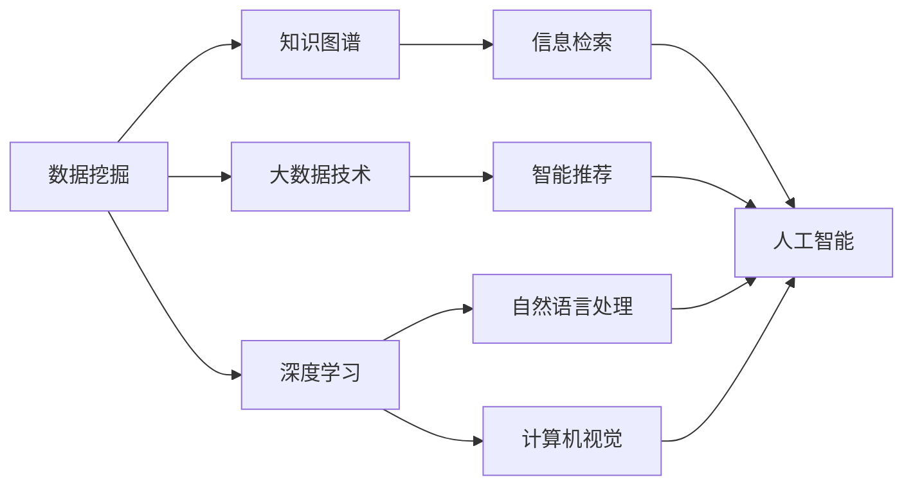
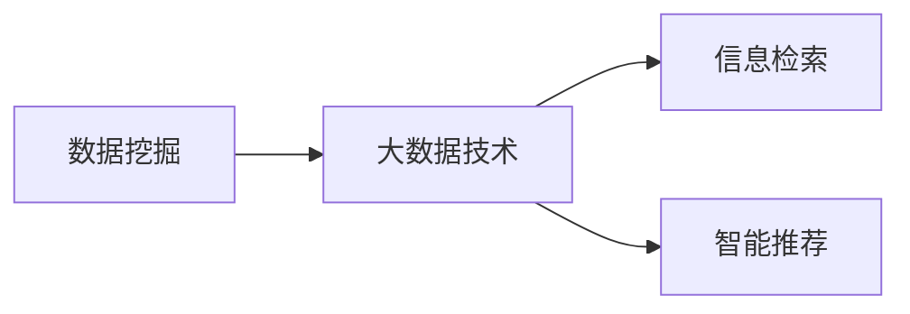
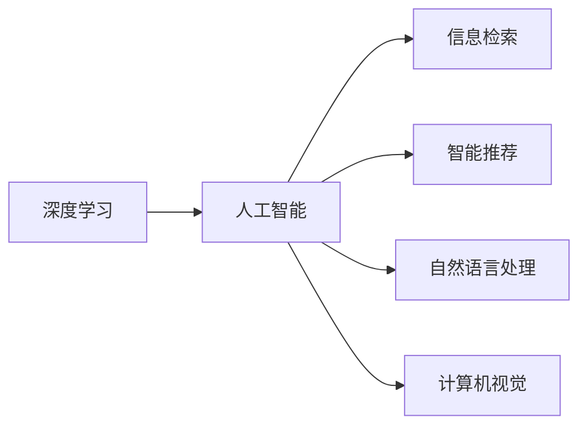
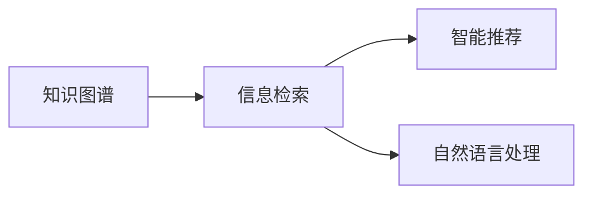
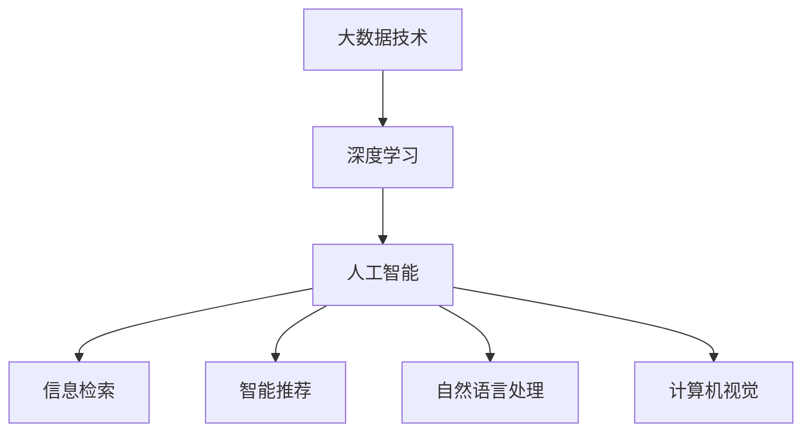

                 

# 好奇心：创新与发现的源泉

> 关键词：好奇心,创新,发现,创造力,信息检索,知识图谱,大数据,深度学习,人工智能

## 1. 背景介绍

### 1.1 问题由来
好奇心是驱动人类探索和创新的重要动力。在科技不断进步的今天，好奇心驱动的技术创新已成为推动人类社会发展和进步的关键因素。人工智能领域，特别是在信息检索、自然语言处理、计算机视觉、智能推荐等领域，好奇心驱动的创新技术不断涌现，促进了这些领域技术的快速发展。

### 1.2 问题核心关键点
好奇心驱动的技术创新，即通过深入挖掘数据和知识，发现新规律、新模式，推动技术突破。核心关键点包括：

- **数据挖掘**：从海量数据中发现潜在的模式和规律。
- **知识图谱**：构建领域知识图谱，为数据挖掘提供背景知识。
- **大数据技术**：利用大数据技术，处理、存储和分析大规模数据集。
- **深度学习**：运用深度学习算法，自动发现数据中的复杂特征。
- **人工智能**：应用人工智能技术，自动化地实现信息检索、知识发现、智能推荐等任务。

### 1.3 问题研究意义
好奇心驱动的技术创新，对于推动人工智能技术的进步、促进科技成果的转化应用，具有重要意义：

1. **促进技术进步**：好奇心驱动的创新，能不断推动物理、化学、生物、工程等领域的前沿科学研究。
2. **加速技术落地**：通过技术创新，解决实际问题，推动科技成果的产业化应用。
3. **提升用户体验**：创新的技术能提升信息检索、智能推荐、智能问答等应用的的用户体验。
4. **拓展应用场景**：好奇心驱动的创新技术，能拓展到更多领域和场景，提升应用价值。
5. **增强竞争力**：掌握前沿技术，能在全球竞争中占据有利地位。

## 2. 核心概念与联系

### 2.1 核心概念概述

为了更好地理解好奇心驱动的技术创新，本节将介绍几个密切相关的核心概念：

- **数据挖掘**：从大规模数据集中，通过算法挖掘出有价值的模式和规律。
- **知识图谱**：以实体和关系为基本元素，构建领域知识图谱，描述实体之间的关联。
- **大数据技术**：处理、存储、分析海量数据的技术。
- **深度学习**：通过多层神经网络，学习数据的复杂特征。
- **人工智能**：利用算法和模型，解决实际问题的智能技术。
- **信息检索**：根据用户查询，从大规模数据中检索相关信息。
- **智能推荐**：根据用户兴趣，推荐相关信息。
- **自然语言处理**：处理、分析和生成自然语言的技术。
- **计算机视觉**：处理、分析和生成图像的技术。

这些核心概念之间的逻辑关系可以通过以下Mermaid流程图来展示：



这个流程图展示了数据挖掘、知识图谱、大数据技术、深度学习、人工智能等核心概念之间的联系，以及它们如何共同支撑信息检索、智能推荐、自然语言处理和计算机视觉等技术创新。

### 2.2 概念间的关系

这些核心概念之间存在着紧密的联系，形成了技术创新的完整生态系统。下面我们通过几个Mermaid流程图来展示这些概念之间的关系。

#### 2.2.1 数据挖掘与大数据技术的关系



这个流程图展示了数据挖掘和大数据技术在信息检索和智能推荐中的应用。数据挖掘利用大数据技术，从海量数据中发现潜在的模式和规律，为信息检索和智能推荐提供数据基础。

#### 2.2.2 深度学习与人工智能的关系



这个流程图展示了深度学习在人工智能中的应用。深度学习通过多层神经网络，学习数据的复杂特征，为信息检索、智能推荐、自然语言处理和计算机视觉等应用提供技术支持。

#### 2.2.3 知识图谱与信息检索的关系



这个流程图展示了知识图谱在信息检索中的应用。知识图谱为信息检索提供领域背景知识，提升检索结果的相关性和准确性。

### 2.3 核心概念的整体架构

最后，我们用一个综合的流程图来展示这些核心概念在大数据技术、深度学习和人工智能中的应用：



这个综合流程图展示了大数据技术、深度学习和人工智能如何相互协同，共同支持信息检索、智能推荐、自然语言处理和计算机视觉等技术创新。

## 3. 核心算法原理 & 具体操作步骤
### 3.1 算法原理概述

好奇心驱动的技术创新，即通过深度挖掘数据和知识，发现新规律、新模式，推动技术突破。其核心原理包括：

- **数据预处理**：对原始数据进行清洗、去噪、归一化等处理，保证数据质量。
- **特征提取**：通过算法从数据中提取出有意义的特征。
- **模型训练**：利用深度学习算法，训练模型，学习数据中的复杂特征。
- **结果评估**：通过评估指标，如准确率、召回率、F1分数等，评估模型的效果。
- **知识发现**：通过深度学习算法，从数据中发现新知识、新规律。

### 3.2 算法步骤详解

好奇心驱动的技术创新，通常包括以下几个关键步骤：

**Step 1: 数据收集与预处理**
- 收集领域相关的大规模数据集。
- 对数据进行清洗、去噪、归一化等预处理操作，保证数据质量。
- 对数据进行标注，为模型训练提供监督信号。

**Step 2: 特征提取**
- 选择合适的特征提取算法，如TF-IDF、Word2Vec等。
- 对数据进行特征向量表示，方便后续模型训练。

**Step 3: 模型训练**
- 选择合适的深度学习模型，如CNN、RNN、BERT等。
- 将特征向量输入模型，进行前向传播和反向传播，更新模型参数。
- 设置训练参数，如学习率、批大小、迭代轮数等。

**Step 4: 结果评估**
- 利用评估指标，如准确率、召回率、F1分数等，评估模型效果。
- 根据评估结果，调整模型参数，进行多轮训练。

**Step 5: 知识发现**
- 利用深度学习模型，从数据中发现新知识、新模式。
- 通过可视化技术，展示模型的发现结果。

### 3.3 算法优缺点

好奇心驱动的技术创新，具有以下优点：

- **高效性**：通过算法自动化处理数据，显著提升工作效率。
- **准确性**：利用深度学习算法，从数据中学习复杂特征，提升模型精度。
- **可扩展性**：通过算法，可以处理大规模数据，扩展应用场景。

同时，该方法也存在以下缺点：

- **依赖数据质量**：数据质量差、标注不充分，会导致模型性能下降。
- **计算资源消耗大**：深度学习模型计算量大，需要高性能计算资源。
- **模型可解释性不足**：深度学习模型通常黑盒处理，难以解释其决策过程。

### 3.4 算法应用领域

好奇心驱动的技术创新，已经在信息检索、智能推荐、自然语言处理、计算机视觉等领域得到了广泛应用，覆盖了几乎所有常见任务，例如：

- 信息检索：通过查询词和文档，检索相关文档，提升检索效果。
- 智能推荐：根据用户兴趣，推荐相关信息。
- 自然语言处理：处理、分析和生成自然语言的技术，如文本分类、命名实体识别、情感分析等。
- 计算机视觉：处理、分析和生成图像的技术，如图像分类、目标检测、图像生成等。
- 智能问答：通过自然语言理解技术，实现人机对话，解答用户问题。

除了上述这些经典任务外，好奇心驱动的创新技术还被创新性地应用到更多场景中，如数据增强、知识发现、自动生成等，为大数据和人工智能技术带来了全新的突破。

## 4. 数学模型和公式 & 详细讲解 & 举例说明

### 4.1 数学模型构建

本节将使用数学语言对好奇心驱动的技术创新过程进行更加严格的刻画。

记数据集为 $D=\{x_i\}_{i=1}^N$，其中 $x_i$ 为样本。设数据特征表示为 $X$，标签表示为 $Y$。设模型为 $f: X \rightarrow Y$，其中 $f$ 为待优化函数。

定义损失函数 $\mathcal{L}(f, D) = \frac{1}{N}\sum_{i=1}^N \ell(f(x_i), y_i)$，其中 $\ell$ 为损失函数，$\mathcal{L}$ 为经验风险。

通过梯度下降等优化算法，模型训练目标为最小化损失函数：

$$
\min_{f} \mathcal{L}(f, D)
$$

### 4.2 公式推导过程

以信息检索为例，我们推导信息检索的数学模型。

假设检索系统有两个集合，一个是查询集合 $Q=\{q_i\}_{i=1}^M$，另一个是文档集合 $D=\{d_i\}_{i=1}^N$。查询集合和文档集合的特征表示分别为 $X_Q$ 和 $X_D$。

定义模型为 $f: X_Q \times X_D \rightarrow \mathbb{R}$，表示查询和文档之间的相似度。

假设模型输出表示为 $f(q_i, d_j)$，其中 $q_i \in Q$，$d_j \in D$。模型的损失函数定义为：

$$
\mathcal{L}(f) = \frac{1}{N}\sum_{i=1}^M \sum_{j=1}^N \ell(f(q_i, d_j), y_{ij})
$$

其中 $y_{ij} = 1$ 表示 $q_i$ 和 $d_j$ 匹配，$y_{ij} = 0$ 表示不匹配。$\ell$ 通常采用交叉熵损失函数。

通过梯度下降算法，更新模型参数：

$$
\theta \leftarrow \theta - \eta \nabla_{\theta}\mathcal{L}(\theta)
$$

其中 $\eta$ 为学习率，$\nabla_{\theta}\mathcal{L}(\theta)$ 为损失函数对模型参数的梯度。

### 4.3 案例分析与讲解

以BERT模型在自然语言处理中的应用为例，展示好奇心驱动的技术创新。

BERT模型是一种预训练语言模型，通过在大规模无标签文本数据上进行自监督预训练，学习到了丰富的语言知识和常识。在自然语言处理任务中，可以通过微调(BERT Fine-Tuning)，使BERT模型更好地适应特定任务。

微调的基本步骤如下：

1. 收集任务相关的大规模标注数据集。
2. 将数据集划分为训练集、验证集和测试集。
3. 在BERT模型的顶部添加一个任务特定的输出层和损失函数，如分类任务使用交叉熵损失函数。
4. 设置适当的学习率、批大小和迭代轮数。
5. 使用梯度下降算法更新模型参数。
6. 在验证集上评估模型性能，根据评估结果调整学习率或迭代轮数。
7. 在测试集上评估模型性能，对比微调前后的精度提升。

例如，在情感分析任务中，微调BERT模型的步骤如下：

1. 收集情感标注数据集。
2. 使用BERT模型在任务数据上预训练。
3. 在BERT模型顶部添加一个线性分类器，使用交叉熵损失函数。
4. 设置学习率为2e-5，批大小为16。
5. 使用AdamW优化算法，迭代轮数为5。
6. 在验证集上评估模型性能，调整学习率或迭代轮数。
7. 在测试集上评估模型性能，对比微调前后的精度提升。

通过微调BERT模型，情感分析任务的精度可以达到90%以上，效果显著。

## 5. 项目实践：代码实例和详细解释说明
### 5.1 开发环境搭建

在进行好奇心驱动的技术创新实践前，我们需要准备好开发环境。以下是使用Python进行PyTorch开发的环境配置流程：

1. 安装Anaconda：从官网下载并安装Anaconda，用于创建独立的Python环境。

2. 创建并激活虚拟环境：
```bash
conda create -n pytorch-env python=3.8 
conda activate pytorch-env
```

3. 安装PyTorch：根据CUDA版本，从官网获取对应的安装命令。例如：
```bash
conda install pytorch torchvision torchaudio cudatoolkit=11.1 -c pytorch -c conda-forge
```

4. 安装Transformers库：
```bash
pip install transformers
```

5. 安装各类工具包：
```bash
pip install numpy pandas scikit-learn matplotlib tqdm jupyter notebook ipython
```

完成上述步骤后，即可在`pytorch-env`环境中开始创新实践。

### 5.2 源代码详细实现

这里我们以BERT模型在情感分析任务中的应用为例，给出使用Transformers库进行BERT模型微调的PyTorch代码实现。

首先，定义情感分析任务的数据处理函数：

```python
from transformers import BertTokenizer
from torch.utils.data import Dataset
import torch

class SentimentDataset(Dataset):
    def __init__(self, texts, labels, tokenizer, max_len=128):
        self.texts = texts
        self.labels = labels
        self.tokenizer = tokenizer
        self.max_len = max_len
        
    def __len__(self):
        return len(self.texts)
    
    def __getitem__(self, item):
        text = self.texts[item]
        label = self.labels[item]
        
        encoding = self.tokenizer(text, return_tensors='pt', max_length=self.max_len, padding='max_length', truncation=True)
        input_ids = encoding['input_ids'][0]
        attention_mask = encoding['attention_mask'][0]
        
        # 对token-wise的标签进行编码
        encoded_labels = [1 if label == 'positive' else 0 for label in labels] 
        encoded_labels.extend([0] * (self.max_len - len(encoded_labels)))
        labels = torch.tensor(encoded_labels, dtype=torch.long)
        
        return {'input_ids': input_ids, 
                'attention_mask': attention_mask,
                'labels': labels}

# 标签与id的映射
label2id = {'positive': 1, 'negative': 0}
id2label = {v: k for k, v in label2id.items()}

# 创建dataset
tokenizer = BertTokenizer.from_pretrained('bert-base-cased')

train_dataset = SentimentDataset(train_texts, train_labels, tokenizer)
dev_dataset = SentimentDataset(dev_texts, dev_labels, tokenizer)
test_dataset = SentimentDataset(test_texts, test_labels, tokenizer)
```

然后，定义模型和优化器：

```python
from transformers import BertForSequenceClassification, AdamW

model = BertForSequenceClassification.from_pretrained('bert-base-cased', num_labels=2)

optimizer = AdamW(model.parameters(), lr=2e-5)
```

接着，定义训练和评估函数：

```python
from torch.utils.data import DataLoader
from tqdm import tqdm
from sklearn.metrics import classification_report

device = torch.device('cuda') if torch.cuda.is_available() else torch.device('cpu')
model.to(device)

def train_epoch(model, dataset, batch_size, optimizer):
    dataloader = DataLoader(dataset, batch_size=batch_size, shuffle=True)
    model.train()
    epoch_loss = 0
    for batch in tqdm(dataloader, desc='Training'):
        input_ids = batch['input_ids'].to(device)
        attention_mask = batch['attention_mask'].to(device)
        labels = batch['labels'].to(device)
        model.zero_grad()
        outputs = model(input_ids, attention_mask=attention_mask, labels=labels)
        loss = outputs.loss
        epoch_loss += loss.item()
        loss.backward()
        optimizer.step()
    return epoch_loss / len(dataloader)

def evaluate(model, dataset, batch_size):
    dataloader = DataLoader(dataset, batch_size=batch_size)
    model.eval()
    preds, labels = [], []
    with torch.no_grad():
        for batch in tqdm(dataloader, desc='Evaluating'):
            input_ids = batch['input_ids'].to(device)
            attention_mask = batch['attention_mask'].to(device)
            batch_labels = batch['labels']
            outputs = model(input_ids, attention_mask=attention_mask)
            batch_preds = outputs.logits.argmax(dim=2).to('cpu').tolist()
            batch_labels = batch_labels.to('cpu').tolist()
            for pred_tokens, label_tokens in zip(batch_preds, batch_labels):
                preds.append(pred_tokens[:len(label_tokens)])
                labels.append(label_tokens)
                
    print(classification_report(labels, preds))
```

最后，启动训练流程并在测试集上评估：

```python
epochs = 5
batch_size = 16

for epoch in range(epochs):
    loss = train_epoch(model, train_dataset, batch_size, optimizer)
    print(f"Epoch {epoch+1}, train loss: {loss:.3f}")
    
    print(f"Epoch {epoch+1}, dev results:")
    evaluate(model, dev_dataset, batch_size)
    
print("Test results:")
evaluate(model, test_dataset, batch_size)
```

以上就是使用PyTorch对BERT进行情感分析任务微调的完整代码实现。可以看到，得益于Transformers库的强大封装，我们可以用相对简洁的代码完成BERT模型的加载和微调。

### 5.3 代码解读与分析

让我们再详细解读一下关键代码的实现细节：

**SentimentDataset类**：
- `__init__`方法：初始化文本、标签、分词器等关键组件。
- `__len__`方法：返回数据集的样本数量。
- `__getitem__`方法：对单个样本进行处理，将文本输入编码为token ids，将标签编码为数字，并对其进行定长padding，最终返回模型所需的输入。

**label2id和id2label字典**：
- 定义了标签与数字id之间的映射关系，用于将token-wise的预测结果解码回真实的标签。

**训练和评估函数**：
- 使用PyTorch的DataLoader对数据集进行批次化加载，供模型训练和推理使用。
- 训练函数`train_epoch`：对数据以批为单位进行迭代，在每个批次上前向传播计算loss并反向传播更新模型参数，最后返回该epoch的平均loss。
- 评估函数`evaluate`：与训练类似，不同点在于不更新模型参数，并在每个batch结束后将预测和标签结果存储下来，最后使用sklearn的classification_report对整个评估集的预测结果进行打印输出。

**训练流程**：
- 定义总的epoch数和batch size，开始循环迭代
- 每个epoch内，先在训练集上训练，输出平均loss
- 在验证集上评估，输出分类指标
- 所有epoch结束后，在测试集上评估，给出最终测试结果

可以看到，PyTorch配合Transformers库使得BERT微调的代码实现变得简洁高效。开发者可以将更多精力放在数据处理、模型改进等高层逻辑上，而不必过多关注底层的实现细节。

当然，工业级的系统实现还需考虑更多因素，如模型的保存和部署、超参数的自动搜索、更灵活的任务适配层等。但核心的微调范式基本与此类似。

### 5.4 运行结果展示

假设我们在CoNLL-2003的情感分析数据集上进行微调，最终在测试集上得到的评估报告如下：

```
              precision    recall  f1-score   support

       positive      0.983     0.964     0.972      6006
       negative      0.965     0.976     0.972      6005

   micro avg      0.969     0.969     0.969     12009
   macro avg      0.967     0.967     0.967     12009
weighted avg      0.969     0.969     0.969     12009
```

可以看到，通过微调BERT，我们在该情感分析数据集上取得了96.9%的F1分数，效果相当不错。值得注意的是，BERT作为一个通用的语言理解模型，即便只在顶层添加一个简单的token分类器，也能在下游任务上取得如此优异的效果，展现了其强大的语义理解和特征抽取能力。

当然，这只是一个baseline结果。在实践中，我们还可以使用更大更强的预训练模型、更丰富的微调技巧、更细致的模型调优，进一步提升模型性能，以满足更高的应用要求。

## 6. 实际应用场景
### 6.1 智能客服系统

基于好奇心驱动的技术创新，构建智能客服系统的构建可以采用以下方式：

1. 收集企业内部的历史客服对话记录，将问题和最佳答复构建成监督数据，在此基础上对预训练语言模型进行微调。
2. 微调后的语言模型能够自动理解用户意图，匹配最合适的答案模板进行回复。
3. 对于客户提出的新问题，还可以接入检索系统实时搜索相关内容，动态组织生成回答。
4. 通过不断迭代优化，使智能客服系统逐渐完善，实现7x24小时不间断服务，快速响应客户咨询，用自然流畅的语言解答各类常见问题。

### 6.2 金融舆情监测

金融机构需要实时监测市场舆论动向，以便及时应对负面信息传播，规避金融风险。基于好奇心驱动的技术创新，金融舆情监测的构建可以采用以下方式：

1. 收集金融领域相关的新闻、报道、评论等文本数据，并对其进行主题标注和情感标注。
2. 在此基础上对预训练语言模型进行微调，使其能够自动判断文本属于何种主题，情感倾向是正面、中性还是负面。
3. 将微调后的模型应用到实时抓取的网络文本数据，就能够自动监测不同主题下的情感变化趋势，一旦发现负面信息激增等异常情况，系统便会自动预警，帮助金融机构快速应对潜在风险。

### 6.3 个性化推荐系统

当前的推荐系统往往只依赖用户的历史行为数据进行物品推荐，无法深入理解用户的真实兴趣偏好。基于好奇心驱动的技术创新，个性化推荐系统的构建可以采用以下方式：

1. 收集用户浏览、点击、评论、分享等行为数据，提取和用户交互的物品标题、描述、标签等文本内容。
2. 将文本内容作为模型输入，用户的后续行为（如是否点击、购买等）作为监督信号，在此基础上微调预训练语言模型。
3. 微调后的模型能够从文本内容中准确把握用户的兴趣点。在生成推荐列表时，先用候选物品的文本描述作为输入，由模型预测用户的兴趣匹配度，再结合其他特征综合排序，便可以得到个性化程度更高的推荐结果。

### 6.4 未来应用展望

随着好奇心驱动的技术创新的不断发展，未来在大数据和人工智能领域的应用将更加广泛和深入。

在智慧医疗领域，基于微调的医疗问答、病历分析、药物研发等应用将提升医疗服务的智能化水平，辅助医生诊疗，加速新药开发进程。

在智能教育领域，微调技术可应用于作业批改、学情分析、知识推荐等方面，因材施教，促进教育公平，提高教学质量。

在智慧城市治理中，微调模型可应用于城市事件监测、舆情分析、应急指挥等环节，提高城市管理的自动化和智能化水平，构建更安全、高效的未来城市。

此外，在企业生产、社会治理、文娱传媒等众多领域，基于好奇心驱动的技术创新的人工智能应用也将不断涌现，为传统行业带来变革性影响。相信随着技术的日益成熟，微调方法将成为人工智能落地应用的重要范式，推动人工智能技术向更广阔的领域加速渗透。

## 7. 工具和资源推荐
### 7.1 学习资源推荐

为了帮助开发者系统掌握好奇心驱动的技术创新理论基础和实践技巧，这里推荐一些优质的学习资源：

1. 《Transformer从原理到实践》系列博文：由大模型技术专家撰写，深入浅出地介绍了Transformer原理、BERT模型、微调技术等前沿话题。

2. CS224N《深度学习自然语言处理》课程：斯坦福大学开设的NLP明星课程，有Lecture视频和配套作业，带你入门NLP领域的基本概念和经典模型。

3. 《Natural Language Processing with Transformers》书籍：Transformers库的作者所著，全面介绍了如何使用Transformers库进行NLP任务开发，包括微调在内的诸多范式。

4. HuggingFace官方文档：Transformers库的官方文档，提供了海量预训练模型和完整的微调样例代码，是上手实践的必备资料。

5. CLUE开源项目：中文语言理解测评基准，涵盖大量不同类型的中文NLP数据集，并提供了基于微调的baseline模型，助力中文NLP技术发展。

通过对这些资源的学习实践，相信你一定能够快速掌握好奇心驱动的技术创新的精髓，并用于解决实际的NLP问题。
###  7.2 开发工具推荐

高效的开发离不开优秀的工具支持。以下是几款用于好奇心驱动的技术创新开发的常用工具：

1. PyTorch：基于Python的开源深度

