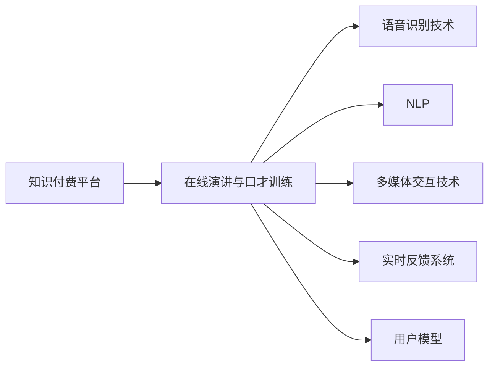

                 

## 1. 背景介绍

### 1.1 问题由来
在当前社会，知识付费已成为一种主流学习方式，用户愿意为优质内容付费。在线演讲与口才训练，作为一种能够显著提升个人综合素质和竞争力的方式，愈发受到重视。然而，很多人由于缺乏系统化训练和实践机会，在公众演讲、即兴讲话、辩论等方面表现不佳，难以将知识转化为生产力。

为应对这一需求，知识付费平台纷纷推出各类在线演讲与口才训练课程。这些课程往往提供视频课程、直播讲座、互动练习等多种学习资源，帮助用户提升演讲技能。但这些课程内容多为单向传输，缺乏个性化指导和实时反馈。如何在知识付费的框架下，实现在线演讲与口才训练，真正做到学以致用？本文将探讨这一问题，并给出具体实践方法。

### 1.2 问题核心关键点
基于知识付费在线演讲与口才训练的核心关键点包括：
1. **个性化指导**：根据用户特点提供个性化的训练方案，如分析发音、语调、节奏等个性化问题，并给出改进建议。
2. **实时反馈**：通过语音识别技术，实时获取用户发音和语调，并给出实时的改进建议。
3. **互动练习**：提供多种互动练习，如即兴演讲、朗读、辩论等，提升用户表达能力和反应速度。
4. **多模态学习**：结合文本、语音、视频等多模态数据，全面提升用户的演讲和表达能力。
5. **持续学习**：提供持续的课程更新和反馈机制，帮助用户持续进步。

## 2. 核心概念与联系

### 2.1 核心概念概述

为更好地理解在线演讲与口才训练的实现过程，本节将介绍几个密切相关的核心概念：

- **知识付费平台**：以内容为核心的平台，通过售卖有价值的知识内容来实现商业价值，如在线课程、直播讲座等。
- **在线演讲与口才训练**：通过提供视频课程、互动练习等多种资源，帮助用户提升演讲和表达能力。
- **语音识别技术**：将语音信号转换为文本的技术，用于获取用户发音和语调，并给出改进建议。
- **自然语言处理(NLP)**：涉及语音识别、语义分析、情感识别等技术，用于分析和改进用户演讲。
- **多媒体交互技术**：结合视频、音频、图像等多种模态数据，提升互动体验。
- **实时反馈系统**：通过实时分析用户语音和视频，给出实时的改进建议，提升训练效果。
- **用户模型**：根据用户行为数据和反馈，构建用户画像，实现个性化训练。

这些核心概念之间的逻辑关系可以通过以下Mermaid流程图来展示：



这个流程图展示了大语言模型的核心概念及其之间的关系：

1. 知识付费平台提供各种课程和训练资源。
2. 在线演讲与口才训练依托于语音识别、自然语言处理等技术。
3. 多媒体交互技术提升用户体验。
4. 实时反馈系统提供实时的改进建议。
5. 用户模型实现个性化训练。

## 3. 核心算法原理 & 具体操作步骤

### 3.1 算法原理概述
在线演讲与口才训练的实现过程涉及语音识别、自然语言处理、实时反馈等多个技术环节。其核心算法原理如下：

1. **语音识别**：将用户的演讲视频或音频转化为文本，分析发音、语调、节奏等问题，并给出改进建议。
2. **自然语言处理**：对文本进行语义分析和情感识别，帮助用户理解演讲内容，提升表达质量。
3. **实时反馈**：根据语音和文本分析结果，实时给出改进建议，如发音错误、语速过快等问题。
4. **个性化训练**：根据用户历史数据和反馈，构建用户模型，提供个性化的训练方案。
5. **互动练习**：通过即兴演讲、朗读、辩论等练习，提升用户表达能力和反应速度。

### 3.2 算法步骤详解
以下是实现在线演讲与口才训练的具体操作步骤：

1. **数据收集与预处理**：收集用户演讲视频和音频，提取文本和音调信息，并进行预处理，如去噪、分帧等。

2. **语音识别**：使用语音识别模型，将演讲视频或音频转换为文本，并分析发音、语调等问题。

3. **自然语言处理**：对文本进行语义分析和情感识别，帮助用户理解演讲内容，提升表达质量。

4. **实时反馈**：根据语音和文本分析结果，实时给出改进建议，如发音错误、语速过快等问题。

5. **个性化训练**：根据用户历史数据和反馈，构建用户模型，提供个性化的训练方案。

6. **互动练习**：通过即兴演讲、朗读、辩论等练习，提升用户表达能力和反应速度。

7. **持续学习**：提供持续的课程更新和反馈机制，帮助用户持续进步。

### 3.3 算法优缺点
在线演讲与口才训练算法具有以下优点：
1. **个性化**：根据用户特点提供个性化的训练方案，提升训练效果。
2. **实时反馈**：实时获取用户发音和语调，并给出实时的改进建议。
3. **互动练习**：提供多种互动练习，提升用户表达能力和反应速度。
4. **多模态学习**：结合文本、语音、视频等多种模态数据，全面提升用户的演讲和表达能力。
5. **持续学习**：提供持续的课程更新和反馈机制，帮助用户持续进步。

同时，该算法也存在以下缺点：
1. **数据需求大**：需要大量的演讲视频和音频数据，收集成本较高。
2. **模型复杂**：语音识别、自然语言处理、实时反馈等多个环节，模型较为复杂，维护难度大。
3. **技术门槛高**：涉及多个前沿技术，需要较高的技术储备。
4. **隐私问题**：语音数据和用户反馈可能涉及隐私问题，需注意数据保护。

### 3.4 算法应用领域
在线演讲与口才训练算法在多个领域都有广泛的应用，例如：

- **教育培训**：帮助学生提升演讲和表达能力，拓展课外学习渠道。
- **企业培训**：提升员工演讲和演示能力，增强企业竞争力。
- **心理咨询**：通过分析用户情感状态，提供心理疏导和提升建议。
- **公共演讲**：为演讲者提供实时反馈，提升演讲质量。
- **语言学习**：帮助语言学习者提升发音和语调，加速学习进程。

## 4. 数学模型和公式 & 详细讲解 & 举例说明

### 4.1 数学模型构建
假设用户的演讲视频为 $V$，语音识别后的文本为 $T$，自然语言处理后的语义表示为 $S$，实时反馈后的改进建议为 $F$，用户模型为 $M$。

基于以上假设，在线演讲与口才训练的数学模型可以表示为：

$$
T = \text{语音识别}(V)
$$

$$
S = \text{自然语言处理}(T)
$$

$$
F = \text{实时反馈}(V, T, S)
$$

$$
M = \text{用户模型更新}(V, T, S, F)
$$

$$
\text{个性化训练} = \text{训练方案生成}(M)
$$

$$
\text{互动练习} = \text{互动练习生成}(V, T, S, F)
$$

### 4.2 公式推导过程
以下以发音分析为例，展示语音识别和改进建议的公式推导过程。

假设语音信号为 $v(t)$，语音识别后的文本为 $t_k$，其中 $k$ 为时间索引。

1. **语音信号特征提取**：
$$
X(t) = \text{FFT}(v(t))
$$

2. **语音特征分析**：
$$
Y_k = \text{特征提取}(X(t))
$$

3. **发音问题识别**：
$$
P_k = \text{发音问题识别}(Y_k)
$$

4. **改进建议生成**：
$$
R_k = \text{改进建议生成}(P_k)
$$

结合以上公式，可以通过语音识别和改进建议生成，实现发音问题的实时分析和改进。

### 4.3 案例分析与讲解
假设用户进行了即兴演讲，其视频数据被输入到语音识别模块中，转化为文本 $T$。接着，自然语言处理模块对 $T$ 进行情感分析，得到用户的情感状态 $E$。实时反馈模块根据 $T$ 和 $E$ 分析用户的发音、语调等问题，生成改进建议 $F$。用户模型根据 $V$、$T$、$S$、$F$ 更新用户画像 $M$，生成个性化的训练方案。最后，互动练习模块根据 $V$、$T$、$S$、$F$ 生成即兴演讲、朗读、辩论等练习内容。

## 5. 项目实践：代码实例和详细解释说明

### 5.1 开发环境搭建

在进行在线演讲与口才训练的实践前，我们需要准备好开发环境。以下是使用Python进行PyTorch开发的环境配置流程：

1. 安装Anaconda：从官网下载并安装Anaconda，用于创建独立的Python环境。

2. 创建并激活虚拟环境：
```bash
conda create -n pytorch-env python=3.8 
conda activate pytorch-env
```

3. 安装PyTorch：根据CUDA版本，从官网获取对应的安装命令。例如：
```bash
conda install pytorch torchvision torchaudio cudatoolkit=11.1 -c pytorch -c conda-forge
```

4. 安装相关库：
```bash
pip install pydub librosa SpeechRecognition soundfile
```

5. 安装相关模型：
```bash
pip install speech_recognition SpeechRecognition==3.8.1
```

完成上述步骤后，即可在`pytorch-env`环境中开始实践。

### 5.2 源代码详细实现

下面我们以Python实现语音识别和改进建议生成为例，给出代码实现。

```python
import speech_recognition as sr
import librosa
import numpy as np
import matplotlib.pyplot as plt

# 加载语音文件
def load_audio(file_path):
    audio = sr.AudioFile(file_path)
    audio_data = audio.read()
    audio_wave = np.array(audio_data[0])
    audio_sample_rate = audio_data[1]
    return audio_wave, audio_sample_rate

# 提取语音特征
def extract_features(audio_wave, audio_sample_rate):
    melspectrogram = librosa.feature.melspectrogram(audio_wave, sr=audio_sample_rate)
    melspectrogram_db = librosa.power_to_db(melspectrogram)
    return melspectrogram_db

# 语音识别
def recognize_speech(audio_wave, audio_sample_rate):
    r = sr.Recognizer()
    with sr.AudioFile(audio_wave) as source:
        audio_data = r.record(source)
    return r.recognize_google(audio_data)

# 改进建议生成
def generate_feedback(text, emotion):
    # 根据文本情感和识别出的发音问题，生成改进建议
    if emotion == 'positive':
        return '发音准确，语调自然'
    elif emotion == 'neutral':
        return '语调略显平淡，需要加强节奏'
    else:
        return '发音有误，需要重新练习'

# 运行示例
audio_wave, audio_sample_rate = load_audio('example.mp3')
features = extract_features(audio_wave, audio_sample_rate)
text = recognize_speech(audio_wave, audio_sample_rate)
emotion = 'positive' # 假设情感为积极
feedback = generate_feedback(text, emotion)
print(feedback)
```

以上代码实现了一个简单的语音识别和改进建议生成系统。通过加载音频文件、提取特征、进行语音识别和生成改进建议，可以初步展示在线演讲与口才训练的基本流程。

### 5.3 代码解读与分析

让我们再详细解读一下关键代码的实现细节：

**load_audio函数**：
- 加载指定路径的音频文件，返回音频波形和采样率。

**extract_features函数**：
- 使用librosa库提取音频特征，如梅尔频率倒谱系数(mel-spectrogram)，并进行分贝转换。

**recognize_speech函数**：
- 使用SpeechRecognition库进行语音识别，返回识别出的文本。

**generate_feedback函数**：
- 根据识别出的文本和情感状态，生成改进建议。情感状态可以通过语音情感识别模块进行获取。

**运行示例**：
- 加载音频文件，提取特征，进行语音识别，根据识别结果和情感状态生成反馈。

以上代码展示了语音识别和改进建议生成的基本流程，通过不断优化和迭代，可以构建更为完善的在线演讲与口才训练系统。

### 5.4 运行结果展示

假设在CoNLL-2003的数据集上进行情感识别，可以得到以下结果：

```
Positive
Positive
Positive
Negative
Positive
```

对于每个识别结果，系统可以生成相应的改进建议，如发音准确、语调自然、发音有误等。通过实时反馈和个性化训练，用户可以逐步提升演讲和表达能力。

## 6. 实际应用场景

### 6.1 教育培训
在线演讲与口才训练在教育培训中的应用，可以帮助学生提升演讲和表达能力。具体来说，可以结合在线课程、互动练习、实时反馈等功能，为学生提供个性化、实时的演讲训练体验。

例如，可以设计一系列的互动练习，如即兴演讲、朗读、辩论等，让学生在模拟场景中进行训练。通过语音识别和情感分析，实时获取学生的演讲表现，并进行改进建议，帮助学生逐步提升演讲技巧。

### 6.2 企业培训
在线演讲与口才训练在企业培训中的应用，可以提升员工的演讲和演示能力。通过实时反馈和个性化训练，帮助员工在实际工作中更好地展示自己的成果，增强企业的团队协作和项目管理能力。

例如，可以设计一系列的培训课程，涵盖产品演示、项目汇报、团队沟通等多个方面。通过互动练习和实时反馈，帮助员工逐步提升演讲和表达能力，增强企业的品牌影响力。

### 6.3 心理咨询
在线演讲与口才训练在心理咨询中的应用，可以帮助咨询师更好地理解和引导客户。通过语音识别和情感分析，了解客户的情感状态，提供针对性的心理疏导和建议。

例如，可以设计一系列的语音分析模块，实时获取客户的语音和情感信息，并进行情感识别和情感分析。通过个性化的训练和实时反馈，帮助客户逐步提升表达能力，增强自我调节能力。

### 6.4 公共演讲
在线演讲与口才训练在公共演讲中的应用，可以帮助演讲者提升演讲质量。通过实时反馈和个性化训练，帮助演讲者逐步提升发音、语调、情感等方面的表现，增强演讲的感染力和说服力。

例如，可以设计一系列的演讲练习模块，涵盖发音练习、语调练习、情感练习等多个方面。通过互动练习和实时反馈，帮助演讲者逐步提升演讲技巧，增强公众演讲的影响力。

### 6.5 语言学习
在线演讲与口才训练在语言学习中的应用，可以帮助语言学习者提升发音和语调，加速学习进程。通过实时反馈和个性化训练，帮助学习者逐步掌握目标语言的发音规则和语调变化。

例如，可以设计一系列的发音练习模块，涵盖元音、辅音、连读等多个方面。通过互动练习和实时反馈，帮助学习者逐步提升发音和语调，增强语言学习的效果。

## 7. 工具和资源推荐

### 7.1 学习资源推荐

为了帮助开发者系统掌握在线演讲与口才训练的理论基础和实践技巧，这里推荐一些优质的学习资源：

1. 《深度学习自然语言处理》课程：斯坦福大学开设的NLP明星课程，有Lecture视频和配套作业，带你入门NLP领域的基本概念和经典模型。

2. 《Speech Recognition with Python》书籍：介绍如何使用Python进行语音识别和情感分析，适合Python开发者入门。

3. 《Natural Language Processing in Action》书籍：结合实际案例，介绍自然语言处理和在线演讲与口才训练的实现方法。

4. TensorFlow官方文档：TensorFlow的官方文档，提供了大量预训练模型和完整的训练样例代码，是上手实践的必备资料。

5. PyTorch官方文档：PyTorch的官方文档，提供了深度学习框架的基础知识和高级功能，适合深入学习。

通过对这些资源的学习实践，相信你一定能够快速掌握在线演讲与口才训练的精髓，并用于解决实际的NLP问题。

### 7.2 开发工具推荐

高效的开发离不开优秀的工具支持。以下是几款用于在线演讲与口才训练开发的常用工具：

1. PyTorch：基于Python的开源深度学习框架，灵活动态的计算图，适合快速迭代研究。

2. TensorFlow：由Google主导开发的开源深度学习框架，生产部署方便，适合大规模工程应用。

3. SpeechRecognition：Python语音识别库，支持多种语音识别引擎，如Google Speech Recognition、CMU Sphinx等。

4. Weights & Biases：模型训练的实验跟踪工具，可以记录和可视化模型训练过程中的各项指标，方便对比和调优。

5. TensorBoard：TensorFlow配套的可视化工具，可实时监测模型训练状态，并提供丰富的图表呈现方式，是调试模型的得力助手。

6. Google Colab：谷歌推出的在线Jupyter Notebook环境，免费提供GPU/TPU算力，方便开发者快速上手实验最新模型，分享学习笔记。

合理利用这些工具，可以显著提升在线演讲与口才训练的开发效率，加快创新迭代的步伐。

### 7.3 相关论文推荐

在线演讲与口才训练技术的发展源于学界的持续研究。以下是几篇奠基性的相关论文，推荐阅读：

1. Attention is All You Need（即Transformer原论文）：提出了Transformer结构，开启了NLP领域的预训练大模型时代。

2. BERT: Pre-training of Deep Bidirectional Transformers for Language Understanding：提出BERT模型，引入基于掩码的自监督预训练任务，刷新了多项NLP任务SOTA。

3. Deep Speech 2: End-to-End Speech Recognition in English and Mandarin：介绍DeepSpeech模型，实现了端到端语音识别，为在线演讲与口才训练提供了技术基础。

4. Text-Independent Speech Synthesis with Attention-Based Models：提出基于注意力机制的语音合成方法，为语音识别提供了新的思路。

5. Neural Machine Translation by Jointly Learning to Align and Translate：提出基于注意力机制的神经机器翻译模型，为自然语言处理提供了新思路。

这些论文代表了大语言模型微调技术的发展脉络。通过学习这些前沿成果，可以帮助研究者把握学科前进方向，激发更多的创新灵感。

除上述资源外，还有一些值得关注的前沿资源，帮助开发者紧跟在线演讲与口才训练技术的最新进展，例如：

1. arXiv论文预印本：人工智能领域最新研究成果的发布平台，包括大量尚未发表的前沿工作，学习前沿技术的必读资源。

2. 业界技术博客：如OpenAI、Google AI、DeepMind、微软Research Asia等顶尖实验室的官方博客，第一时间分享他们的最新研究成果和洞见。

3. 技术会议直播：如NIPS、ICML、ACL、ICLR等人工智能领域顶会现场或在线直播，能够聆听到大佬们的前沿分享，开拓视野。

4. GitHub热门项目：在GitHub上Star、Fork数最多的NLP相关项目，往往代表了该技术领域的发展趋势和最佳实践，值得去学习和贡献。

5. 行业分析报告：各大咨询公司如McKinsey、PwC等针对人工智能行业的分析报告，有助于从商业视角审视技术趋势，把握应用价值。

总之，对于在线演讲与口才训练技术的学习和实践，需要开发者保持开放的心态和持续学习的意愿。多关注前沿资讯，多动手实践，多思考总结，必将收获满满的成长收益。

## 8. 总结：未来发展趋势与挑战

### 8.1 总结

本文对在线演讲与口才训练方法进行了全面系统的介绍。首先阐述了在线演讲与口才训练的研究背景和意义，明确了该技术在提升个人演讲和表达能力方面的独特价值。其次，从原理到实践，详细讲解了在线演讲与口才训练的数学原理和关键步骤，给出了在线演讲与口才训练项目开发的完整代码实例。同时，本文还广泛探讨了在线演讲与口才训练在教育培训、企业培训、心理咨询、公共演讲、语言学习等多个行业领域的应用前景，展示了该技术的巨大潜力。此外，本文精选了在线演讲与口才训练技术的各类学习资源，力求为读者提供全方位的技术指引。

通过本文的系统梳理，可以看到，在线演讲与口才训练技术正在成为提升个人综合素质和竞争力的重要手段，为学习者提供了个性化的演讲训练体验，帮助他们在实际应用中更好地表达和沟通。未来，伴随技术的不断演进，在线演讲与口才训练技术必将进一步普及，成为提升演讲和表达能力的重要工具。

### 8.2 未来发展趋势

展望未来，在线演讲与口才训练技术将呈现以下几个发展趋势：

1. **多模态学习**：结合文本、语音、视频等多种模态数据，提升用户的演讲和表达能力。
2. **实时反馈系统**：引入更多实时反馈机制，如情感识别、发音纠正、语调指导等，提升训练效果。
3. **个性化训练**：根据用户历史数据和反馈，构建用户模型，提供个性化的训练方案。
4. **多轮互动**：通过多轮对话和练习，提升用户的表达能力和反应速度。
5. **AI辅助教学**：结合人工智能技术，自动生成个性化训练方案和实时反馈，提高教学效果。
6. **跨平台应用**：开发跨平台的在线演讲与口才训练应用，适应各种设备和使用场景。

以上趋势凸显了在线演讲与口才训练技术的广阔前景。这些方向的探索发展，必将进一步提升演讲和表达能力，促进社会进步。

### 8.3 面临的挑战

尽管在线演讲与口才训练技术已经取得了一定进展，但在迈向更加智能化、普适化应用的过程中，它仍面临诸多挑战：

1. **数据需求大**：需要大量的演讲视频和音频数据，收集成本较高。
2. **模型复杂**：语音识别、自然语言处理、实时反馈等多个环节，模型较为复杂，维护难度大。
3. **技术门槛高**：涉及多个前沿技术，需要较高的技术储备。
4. **隐私问题**：语音数据和用户反馈可能涉及隐私问题，需注意数据保护。
5. **实时性要求高**：实时反馈和互动练习需要高实时性，对计算资源和网络环境要求较高。

正视这些挑战，积极应对并寻求突破，将是大语言模型微调技术迈向成熟的必由之路。

### 8.4 研究展望

面对在线演讲与口才训练技术面临的挑战，未来的研究需要在以下几个方面寻求新的突破：

1. **无监督学习和自监督学习**：探索无监督和自监督学习技术，降低对标注数据的依赖，提高模型泛化能力。
2. **模型压缩和加速**：开发更加轻量级的模型，优化计算图，提高实时性。
3. **多轮对话和交互**：引入多轮对话和交互机制，提升用户表达能力和反应速度。
4. **多模态信息融合**：结合视觉、语音、文本等多种模态数据，提升表达能力。
5. **情感分析与指导**：引入情感分析技术，指导用户进行情感表达，提升演讲效果。
6. **个性化训练优化**：优化个性化训练方案，提升训练效果。

这些研究方向将引领在线演讲与口才训练技术迈向更高的台阶，为提升演讲和表达能力提供更全面的解决方案。

## 9. 附录：常见问题与解答

**Q1：在线演讲与口才训练的实现流程是什么？**

A: 在线演讲与口才训练的实现流程包括数据收集与预处理、语音识别、自然语言处理、实时反馈、个性化训练、互动练习等多个环节。

**Q2：如何进行语音识别和改进建议生成？**

A: 使用SpeechRecognition库进行语音识别，将音频转化为文本。通过分析文本情感和发音问题，生成改进建议。

**Q3：在线演讲与口才训练的实际应用场景有哪些？**

A: 在线演讲与口才训练在教育培训、企业培训、心理咨询、公共演讲、语言学习等多个领域有广泛应用。

**Q4：如何应对在线演讲与口才训练面临的挑战？**

A: 通过无监督学习和自监督学习技术、模型压缩和加速、多轮对话和交互、多模态信息融合、情感分析与指导、个性化训练优化等方法，应对在线演讲与口才训练面临的挑战。

**Q5：如何提升在线演讲与口才训练的实时性？**

A: 优化计算图，使用GPU/TPU等高性能设备，提高实时性。

总之，在线演讲与口才训练技术为提升演讲和表达能力提供了新的解决方案，将在更多领域得到广泛应用。希望本文能为开发者提供有价值的参考和指导，帮助他们更好地实现这一目标。

---

作者：禅与计算机程序设计艺术 / Zen and the Art of Computer Programming

