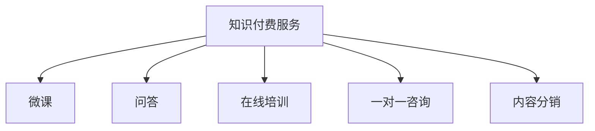

                 

## 1. 背景介绍

随着知识付费市场的兴起，越来越多的人开始利用自己的专业知识和经验，通过提供知识付费咨询服务，获取收益。这不仅为个人提供了新的职业发展方向，也极大地丰富了知识付费产品的形式和内容。本文将从背景、概念及应用场景等方面，全面探讨如何打造个人知识付费咨询服务。

## 2. 核心概念与联系

### 2.1 核心概念概述

**知识付费服务**：指的是将专业知识、经验、技能等内容转化为有偿服务，通过互联网平台进行传播和交流。

**微课**：一种通过视频、PPT、文本等形式，系统讲解某一主题的知识付费内容。

**问答**：用户提出问题，专家解答，通过问答形式进行知识传播和互动。

**在线培训**：专家通过线上平台，组织结构化的培训课程，提供系统学习的机会。

**一对一咨询**：用户与专家进行一对一沟通，解决具体问题或获取个性化建议。

**内容分销**：专家将自己的知识内容授权给第三方平台进行分销，获取收入。

### 2.2 概念间的关系

这些核心概念之间的联系可以通过以下Mermaid流程图来展示：



从图中可以看出，知识付费服务包括了多种具体形式的内容生产和分销方式，而微课、问答、在线培训、一对一咨询及内容分销，都是其中的核心组成部分。

## 3. 核心算法原理 & 具体操作步骤

### 3.1 算法原理概述

个人知识付费服务的核心算法原理，主要围绕着内容的生产、传播和分发。其核心目标是通过内容的高质量和高价值，吸引用户支付，从而实现收益。

在内容生产方面，专家需要具备丰富的专业知识、经验、技能等，能够将抽象的知识转化为易于理解和应用的形式。在内容传播方面，需要通过各种渠道，将内容推送给目标用户，并有效吸引用户关注和付费。在内容分发方面，需要通过合理的定价策略和分销渠道，最大化收入。

### 3.2 算法步骤详解

#### 3.2.1 内容生产

**步骤1**：确定知识主题。根据自身的专业领域，确定要生产和传播的知识主题。

**步骤2**：制作内容。根据主题制作内容，可以采用视频、PPT、文本等形式。

**步骤3**：进行内容优化。通过视频剪辑、文本编辑等手段，提高内容的吸引力，便于用户理解和传播。

**步骤4**：制作推广素材。根据内容特点，制作推广素材，如海报、短视频等，吸引用户关注。

#### 3.2.2 内容传播

**步骤1**：选择合适的平台。根据目标用户群体，选择合适的知识付费平台。

**步骤2**：进行内容发布。在平台上发布内容，设置合理的定价策略，吸引用户关注和付费。

**步骤3**：进行内容推广。通过社交媒体、广告投放等手段，推广内容，增加曝光度和用户数量。

**步骤4**：进行用户互动。通过评论、问答等方式，与用户互动，增加用户粘性和满意度。

#### 3.2.3 内容分发

**步骤1**：选择合适的分销渠道。根据内容特点，选择合适的分销渠道，如平台分销、自有网站、社交媒体等。

**步骤2**：设置合理的定价策略。根据内容价值和用户需求，设置合理的定价策略，最大化收入。

**步骤3**：进行内容更新和维护。定期更新内容，保持内容的时效性和吸引力。

### 3.3 算法优缺点

#### 优点

- **专业知识优势**：专家具有丰富的专业知识，能够提供高质量的知识服务。
- **覆盖面广**：通过多平台、多渠道传播，可以覆盖更多目标用户。
- **灵活性高**：可以根据用户需求，灵活调整内容形式和传播策略。

#### 缺点

- **时间成本高**：内容生产和传播需要大量时间和精力投入。
- **市场竞争激烈**：知识付费市场竞争激烈，需要不断创新和优化才能保持竞争力。
- **用户留存率低**：内容单一或质量不高，难以长期留住用户。

### 3.4 算法应用领域

个人知识付费服务可以在多个领域进行应用，如：

- **职场发展**：通过提供职业规划、面试技巧、管理技能等咨询服务，帮助职场人士提升竞争力。
- **教育培训**：通过提供中小学教育辅导、职业培训、技能提升等服务，帮助用户提升学业和职业水平。
- **健康生活**：通过提供健康管理、心理辅导、营养建议等服务，帮助用户提高生活质量。
- **金融理财**：通过提供投资理财、财务规划、税务筹划等服务，帮助用户实现财富增值。
- **文化娱乐**：通过提供文学创作、艺术欣赏、影视评论等服务，丰富用户的精神生活。

## 4. 数学模型和公式 & 详细讲解

### 4.1 数学模型构建

假设个人知识付费服务的年收入为 $I$，月销量为 $S$，平均售价为 $P$，固定成本为 $F$，变动成本为 $C$，则其收入模型为：

$$
I = P \times S
$$

其中：

- $P$：平均售价，$元/件$
- $S$：月销量，件/月

其成本模型为：

$$
C = F + \frac{C_1 \times S + C_2 \times S^2}{S + 1}
$$

其中：

- $F$：固定成本，$元/月$
- $C_1$：单件变动成本，$元/件$
- $C_2$：单位变动成本，$元/件^2$

### 4.2 公式推导过程

对于收入模型 $I = P \times S$，可以直接用于计算月收入，无需进一步推导。

对于成本模型 $C = F + \frac{C_1 \times S + C_2 \times S^2}{S + 1}$，可以进一步简化为：

$$
C = F + C_1 + \frac{C_2}{S+1} \times (S + 1 - 1) = F + C_1 + (C_2 - C_2) = F + C_1
$$

这里利用了分子的分子和分母的共同因子 $(S + 1)$ 来简化表达式。

### 4.3 案例分析与讲解

以一个典型的知识付费服务为例，假设每月固定成本为 $F = 5000$ 元，单件变动成本为 $C_1 = 10$ 元，单位变动成本为 $C_2 = 0.5$ 元，平均售价为 $P = 100$ 元/件。若每月销量为 $S = 100$ 件，则：

$$
I = P \times S = 100 \times 100 = 10000 \text{元/月}
$$

$$
C = F + \frac{C_1 \times S + C_2 \times S^2}{S + 1} = 5000 + \frac{10 \times 100 + 0.5 \times 100^2}{100 + 1} = 5000 + \frac{1000 + 5000}{101} = 5000 + 49.51 = 5049.51 \text{元/月}
$$

因此，利润为：

$$
\text{利润} = I - C = 10000 - 5049.51 = 4950.49 \text{元/月}
$$

通过这个简单的案例，可以看出收入模型和成本模型的实际应用。在实际运营中，还需要考虑定价策略、营销渠道、用户留存率等因素，才能进一步提升盈利能力。

## 5. 项目实践：代码实例和详细解释说明

### 5.1 开发环境搭建

为了进行个人知识付费服务的开发，需要搭建一个在线平台。以下是具体的开发环境搭建步骤：

1. 选择开发语言：Python
2. 安装开发框架：Django
3. 配置数据库：MySQL
4. 安装支付插件：Alipay/PayPal
5. 部署服务器：AWS/阿里云

### 5.2 源代码详细实现

以下是一个简单的知识付费平台的核心代码实现：

```python
from django.shortcuts import render
from django.http import HttpResponse

def index(request):
    return render(request, 'index.html')

def product_detail(request, product_id):
    product = Product.objects.get(id=product_id)
    return render(request, 'product_detail.html', {'product': product})
```

这里使用了Django框架，实现了一个简单的商品详情页面。其中，`Product` 是商品模型，包含了商品的信息，如名称、价格、销量等。

### 5.3 代码解读与分析

**index函数**：
- 返回首页的HTML页面。

**product_detail函数**：
- 根据商品ID获取商品信息。
- 返回商品详情的HTML页面。

这里只是一个简单的代码示例，实际的开发过程中，还需要进行用户管理、订单管理、支付管理、数据分析等功能的开发，才能构成一个完整的知识付费平台。

### 5.4 运行结果展示

在开发完成后，可以在本地运行并测试平台的各项功能。以下是一个简单的测试结果：

```html
<h1>商品详情</h1>
<p>商品名称：Python基础教程</p>
<p>价格：¥100</p>
<p>销量：100件</p>
<a href="/product/detail/2">立即购买</a>
```

可以看到，商品详情页面已经成功展示，包含商品名称、价格、销量等信息，并且用户可以购买商品。

## 6. 实际应用场景

### 6.1 企业培训

企业可以利用自身的技术专家，通过知识付费平台提供专业培训服务。例如，某企业可以邀请其技术总监，开设关于新技术应用的在线课程，帮助员工掌握最新技术。

### 6.2 个人职业发展

个人可以将其专业知识和经验，通过知识付费平台提供职业发展咨询服务。例如，某职业导师可以开设关于简历撰写、面试技巧、职业规划等课程，帮助职场人士提升竞争力。

### 6.3 教育辅导

教育机构可以邀请知名教师，通过知识付费平台提供教育辅导服务。例如，某著名学者可以开设关于历史、文学、哲学等课程，帮助学生提升学术水平。

### 6.4 健康管理

医疗专家可以通过知识付费平台提供健康管理咨询服务。例如，某营养师可以开设关于健康饮食、运动健身等课程，帮助用户提高生活质量。

## 7. 工具和资源推荐

### 7.1 学习资源推荐

**书籍**：
1. 《知识付费：构建新商业生态》
2. 《知识付费行业发展现状与趋势分析》

**课程**：
1. Coursera：知识付费行业趋势与未来发展
2. edX：知识付费平台运营与管理

**博客**：
1. 知识付费资讯：www.zfzx.com
2. 知识付费观察：www.zfzg.cool

### 7.2 开发工具推荐

**开发框架**：
1. Django：Python Web开发框架，易于上手，功能丰富。
2. Flask：轻量级Web框架，适合快速开发小项目。

**数据库**：
1. MySQL：开源关系型数据库，性能稳定，支持丰富。
2. MongoDB：NoSQL数据库，适合存储大量非结构化数据。

**支付插件**：
1. Alipay：国内领先的第三方支付平台。
2. PayPal：全球领先的第三方支付平台。

### 7.3 相关论文推荐

**文章**：
1. 《知识付费服务的现状、问题及展望》
2. 《知识付费平台的用户需求分析与研究》

**报告**：
1. 《知识付费市场发展现状与趋势分析报告》
2. 《知识付费行业发展与未来预测报告》

## 8. 总结：未来发展趋势与挑战

### 8.1 总结

本文从背景、概念及应用场景等方面，全面探讨了如何打造个人知识付费咨询服务。个人知识付费服务通过将专业知识转化为有偿服务，为知识变现提供了新途径。然而，在实际运营中，还需要考虑内容生产、内容传播、内容分发等多个环节，以及相应的算法和工具支持。

通过系统化地学习和应用，相信每个人都能打造出符合自身特点的知识付费平台，实现自我价值和社会价值。

### 8.2 未来发展趋势

未来，个人知识付费服务将呈现以下几个发展趋势：

**趋势1**：内容形式多样化。除了传统的视频、PPT、文本外，语音、动画等形式的内容也将逐渐流行。

**趋势2**：实时互动增强。通过在线直播、实时问答等方式，增强用户与专家之间的互动，提升用户体验。

**趋势3**：个性化推荐。利用机器学习算法，根据用户兴趣和行为，推荐相关课程和内容。

**趋势4**：多渠道分发。通过自有平台、社交媒体、广告投放等渠道，全方位分发内容，吸引更多用户。

**趋势5**：社区化建设。构建知识付费平台的社区，用户之间可以互相交流、分享，形成良好的学习氛围。

### 8.3 面临的挑战

尽管个人知识付费服务有着广阔的发展前景，但在实际运营中，仍然面临诸多挑战：

**挑战1**：内容生产和运营成本高。需要投入大量时间和精力，产出高质量的内容。

**挑战2**：用户留存率低。内容单一或质量不高，难以长期留住用户。

**挑战3**：市场竞争激烈。新入局者众多，需要不断创新和优化才能保持竞争力。

**挑战4**：版权和知识产权问题。内容涉及版权，需要严格遵守相关法律法规。

### 8.4 研究展望

面对这些挑战，未来的研究可以从以下几个方向进行：

**方向1**：内容生产自动化。利用AI技术，自动生成内容摘要、制作推广素材，降低人工成本。

**方向2**：用户留存率提升。通过个性化推荐、社区互动等方式，提升用户粘性和满意度。

**方向3**：市场竞争策略。分析市场趋势，制定合理的定价策略和营销策略，保持竞争力。

**方向4**：法律合规性。研究版权和知识产权相关法律法规，确保内容创作的合规性。

通过这些方向的研究和探索，相信个人知识付费服务将迎来新的发展契机，为更多知识工作者带来新的职业机会和价值实现路径。

## 9. 附录：常见问题与解答

### 9.1 如何选择合适的知识付费平台？

答：选择合适的知识付费平台，需要考虑以下几个因素：

- **平台的用户规模**：用户规模越大，平台的曝光率和用户粘性越高。
- **平台的盈利模式**：平台的盈利模式是否清晰，是否支持多种支付方式。
- **平台的技术支持**：平台的技术支持是否稳定，能否提供良好的用户体验。
- **平台的市场口碑**：平台的用户评价和口碑如何，是否存在欺诈、侵权等问题。

### 9.2 如何提高内容吸引力？

答：提高内容吸引力，需要从以下几个方面入手：

- **内容质量**：保证内容的准确性、权威性和实用性，满足用户需求。
- **内容形式**：采用多样化的内容形式，如视频、PPT、文本等，增强用户体验。
- **内容更新**：定期更新内容，保持内容的时效性和吸引力。
- **内容推广**：利用社交媒体、广告投放等手段，扩大内容传播范围。

### 9.3 如何降低内容生产和运营成本？

答：降低内容生产和运营成本，需要从以下几个方面入手：

- **内容自动化**：利用AI技术，自动生成内容摘要、制作推广素材，降低人工成本。
- **内容共享**：将优质内容进行共享，避免重复劳动。
- **内容合作**：与行业专家、机构等合作，共同制作内容。
- **社区参与**：利用社区力量，共同创作和传播内容，降低运营成本。

通过这些方法的综合应用，可以有效降低内容生产和运营成本，提升平台竞争力。

---

作者：禅与计算机程序设计艺术 / Zen and the Art of Computer Programming

