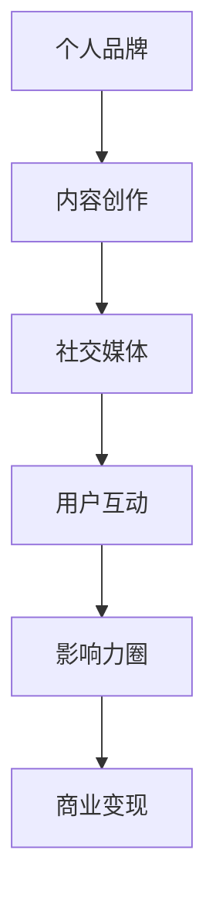
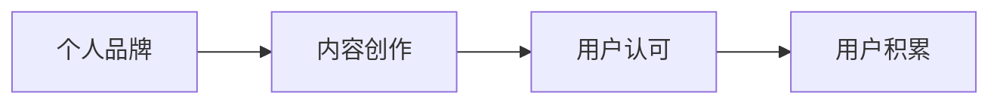
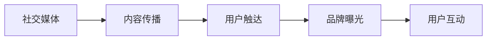
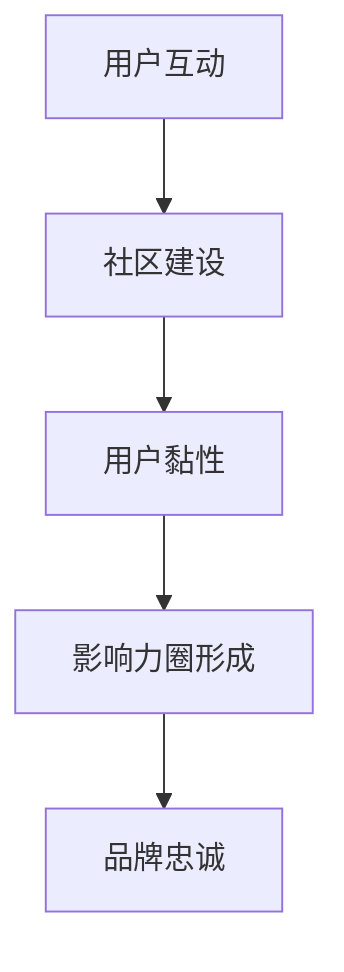
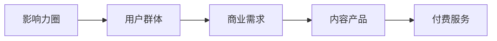
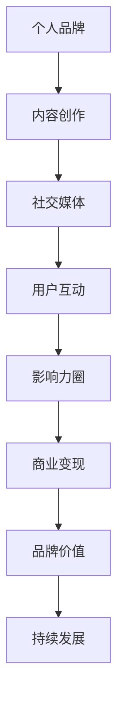

                 

# 如何打造个人知识付费影响力圈

> 关键词：个人品牌建设, 知识付费, 内容创作, 社交媒体, 影响力

## 1. 背景介绍

### 1.1 问题由来

在知识经济时代，个人品牌建设逐渐成为越来越多人的追求。通过打造个人品牌，可以在专业领域获得更多认可和机会，实现自我价值和经济效益的双重提升。而知识付费作为新兴领域，为个人品牌提供了快速崛起的新舞台。借助互联网技术的支持，个人可以在短时间内将自己的知识、经验、见解转化为有价值的内容产品，并通过收费形式获得回报。然而，知识付费领域竞争激烈，如何在众多内容创作者中脱颖而出，打造个人知识付费影响力圈，成为每个创作者亟需解决的问题。

### 1.2 问题核心关键点

打造个人知识付费影响力圈的关键在于：

- 内容质量与独特性：高质量、有深度、具有独特观点的内容是吸引用户的核心。
- 品牌定位与传播：清晰的品牌定位和有效的传播策略，是品牌曝光和用户积累的基础。
- 互动与社区建设：与用户建立良好互动，并通过社区建设增强用户黏性。
- 商业变现模式：通过多样化商业变现方式，实现知识付费变现。

### 1.3 问题研究意义

通过打造个人知识付费影响力圈，可以：

- 提升个人品牌知名度，建立专业权威。
- 获取稳定的收入来源，实现职业自由。
- 拓展人际网络，开启更多合作与交流机会。
- 加速个人成长，形成良性循环，实现自我价值的最大化。

## 2. 核心概念与联系

### 2.1 核心概念概述

为更好地理解打造个人知识付费影响力圈的方法，本节将介绍几个密切相关的核心概念：

- 个人品牌（Personal Brand）：个人在职业和生活中形成的独特形象和声誉，是个人在社会中的价值体现。
- 知识付费（Knowledge Subscription）：以知识内容为核心，通过付费形式提供给用户的一种服务模式。
- 内容创作（Content Creation）：个人或机构通过创造有价值的信息内容，以满足用户需求的过程。
- 社交媒体（Social Media）：通过互联网平台实现信息交流和互动的网络空间，是品牌传播和用户连接的重要工具。
- 影响力圈（Influence Circle）：基于共同兴趣、价值观和目标群体，形成的相对稳定的社交网络。

这些核心概念之间的逻辑关系可以通过以下Mermaid流程图来展示：



这个流程图展示了一系列核心概念在打造个人知识付费影响力圈过程中的相互作用：

1. 个人品牌通过内容创作奠定基础。
2. 内容创作在社交媒体上获得传播。
3. 通过与用户的互动，形成影响力圈。
4. 影响力圈帮助实现商业变现。

### 2.2 概念间的关系

这些核心概念之间存在着紧密的联系，形成了打造个人知识付费影响力圈的完整生态系统。下面我们通过几个Mermaid流程图来展示这些概念之间的关系。

#### 2.2.1 个人品牌建设与内容创作



这个流程图展示了个人品牌建设与内容创作之间的关系：

1. 个人品牌建设为内容创作提供方向和风格指引。
2. 高质量的内容创作可以提升个人品牌知名度。
3. 用户的认可和积累，进一步强化品牌影响力。

#### 2.2.2 社交媒体与内容传播



这个流程图展示了社交媒体在内容传播中的作用：

1. 社交媒体为内容传播提供了广泛平台。
2. 用户触达率决定了品牌曝光的广度和深度。
3. 用户互动是品牌传播的重要反馈。

#### 2.2.3 影响力圈与用户互动



这个流程图展示了用户互动在影响力圈形成中的作用：

1. 用户互动增强了社区建设的活力。
2. 用户黏性是影响力圈稳定的基础。
3. 品牌忠诚度是影响力圈的核心。

#### 2.2.4 影响力圈与商业变现



这个流程图展示了影响力圈在商业变现中的作用：

1. 影响力圈定义了目标用户群体。
2. 商业需求多样，内容产品形式丰富。
3. 付费服务为影响力圈的商业变现提供了渠道。

### 2.3 核心概念的整体架构

最后，我们用一个综合的流程图来展示这些核心概念在打造个人知识付费影响力圈过程中的整体架构：



这个综合流程图展示了从个人品牌建设到商业变现的完整过程，各个环节相互关联，共同作用于个人知识付费影响力圈的打造。通过这些流程图，我们可以更清晰地理解打造个人知识付费影响力圈过程中各个核心概念的相互作用和作用机制。

## 3. 核心算法原理 & 具体操作步骤
### 3.1 算法原理概述

打造个人知识付费影响力圈的核心算法原理是基于内容的价值挖掘和传播策略的优化。其核心思想是：

1. 通过高质量、独特的内容创作，吸引目标用户群体。
2. 利用社交媒体的传播特性，最大化内容的触达率。
3. 通过用户互动和社区建设，增强用户黏性和品牌忠诚度。
4. 探索多样化的商业变现方式，实现影响力圈的商业价值。

具体步骤包括：

- 内容规划与创作：确定品牌定位和内容主题，创造有深度、有价值的内容。
- 平台选择与策略：选择合适的社交媒体平台，制定内容传播策略。
- 用户互动与社区建设：建立与用户的互动机制，构建积极互动的社区。
- 商业变现与市场拓展：通过多元化商业变现方式，实现知识付费变现，同时拓展市场，形成良性循环。

### 3.2 算法步骤详解

以下是打造个人知识付费影响力圈的详细步骤：

#### 3.2.1 内容规划与创作

1. **确定品牌定位**：明确自己的专业领域、兴趣方向和价值主张，形成独特的品牌特色。
2. **内容主题选择**：根据品牌定位选择有市场前景的内容主题，如编程技巧、创业故事、金融投资等。
3. **内容形式设计**：选择适合的形式，如视频、音频、文章等，确保内容多样化。
4. **内容价值挖掘**：通过深入研究主题，挖掘有深度、有价值的观点和见解。
5. **内容创作实施**：根据设计好的内容和形式，实施具体创作，如撰写文章、录制视频等。

#### 3.2.2 平台选择与策略

1. **选择平台**：根据目标用户群体的分布，选择合适的社交媒体平台，如微信、抖音、YouTube等。
2. **制定策略**：制定内容传播策略，如发布频率、发布时段、互动方式等。
3. **内容优化**：通过A/B测试等手段，优化内容的呈现形式和传播效果。
4. **数据分析**：利用平台提供的数据分析工具，监测内容表现和用户反馈，及时调整策略。

#### 3.2.3 用户互动与社区建设

1. **建立互动机制**：设计问答、评论、直播等互动形式，增强用户参与度。
2. **社区建设**：在社交媒体平台上建立专属的粉丝社群，提供专属福利和互动内容。
3. **用户反馈收集**：定期收集用户反馈，了解用户需求和满意度。
4. **社区管理**：建立社区管理规则，维护社区秩序，增强用户黏性。

#### 3.2.4 商业变现与市场拓展

1. **探索变现模式**：选择合适的变现模式，如付费文章、课程销售、会员订阅等。
2. **内容产品开发**：根据用户需求，开发多样化内容产品，提升用户体验。
3. **市场拓展策略**：通过社交媒体和社区推广，扩大影响力圈的覆盖范围。
4. **持续优化**：根据市场反馈，不断优化内容和策略，提升商业变现效果。

### 3.3 算法优缺点

打造个人知识付费影响力圈的算法优缺点如下：

**优点：**

1. **可操作性强**：通过平台选择和策略制定，可以根据自身情况灵活操作。
2. **效率高**：利用社交媒体和数据分析，可以快速评估效果和调整策略。
3. **收益显著**：通过高质量内容和商业变现，可以获得稳定的收入来源。

**缺点：**

1. **初期投入大**：需要投入大量时间和精力进行内容创作和平台运营。
2. **风险较高**：内容质量不高或策略不当，可能导致用户流失和品牌信誉受损。
3. **市场竞争激烈**：知识付费领域竞争激烈，需要不断创新和提升。

### 3.4 算法应用领域

打造个人知识付费影响力圈的方法，不仅可以应用于知识创作者，也适用于各类专业人士，如：

- 专家学者：通过分享专业知识，提升个人知名度，增强专业影响力。
- 行业领袖：通过提供行业见解，引导行业趋势，形成自己的行业影响圈。
- 个人品牌顾问：通过个性化品牌咨询，帮助客户打造个人品牌，提升商业价值。

## 4. 数学模型和公式 & 详细讲解 & 举例说明

### 4.1 数学模型构建

本节将使用数学语言对打造个人知识付费影响力圈的方法进行更加严格的刻画。

设个人品牌影响力为 $B$，内容质量为 $C$，社交媒体传播效果为 $S$，用户互动率为 $I$，商业变现收益为 $R$。

则影响力圈的综合影响因子 $F$ 可以表示为：

$$
F = f(B, C, S, I, R)
$$

其中 $f$ 为综合影响因子的计算函数，可以通过以下数学模型构建：

$$
F = B \times C \times S \times I \times R
$$

在具体应用中，可以通过调整各个变量的权重，适应不同场景和需求。

### 4.2 公式推导过程

以下我们以二分类任务为例，推导影响力的计算公式。

假设个人品牌影响力为 $B=0.9$，内容质量为 $C=0.95$，社交媒体传播效果为 $S=0.8$，用户互动率为 $I=0.85$，商业变现收益为 $R=0.9$。则综合影响因子 $F$ 为：

$$
F = 0.9 \times 0.95 \times 0.8 \times 0.85 \times 0.9 = 0.5271
$$

该结果表示，在上述条件下，个人品牌的影响力圈综合影响因子为0.5271。

### 4.3 案例分析与讲解

假设某编程博主通过在线课程、博客文章和视频教程，成功地建立了自己的品牌影响力圈。其内容质量高，每篇文章阅读量都在10万以上，用户互动积极，平均每篇文章有500条评论和50次点赞。其商业变现策略包括付费文章、课程销售和会员订阅。根据公式计算，其影响力圈综合影响因子为：

$$
F = 0.9 \times 0.95 \times 0.8 \times 0.85 \times 0.9 = 0.5271
$$

在实际应用中，这个案例展示了如何通过内容质量、社交媒体传播、用户互动和商业变现等多个维度，综合计算个人品牌的影响力圈综合影响因子。

## 5. 项目实践：代码实例和详细解释说明

### 5.1 开发环境搭建

在进行个人知识付费影响力圈的实践前，我们需要准备好开发环境。以下是使用Python进行Flask开发的环境配置流程：

1. 安装Anaconda：从官网下载并安装Anaconda，用于创建独立的Python环境。

2. 创建并激活虚拟环境：
```bash
conda create -n pythonspace python=3.8 
conda activate pythonspace
```

3. 安装Flask：
```bash
pip install Flask
```

4. 安装各类工具包：
```bash
pip install numpy pandas scikit-learn matplotlib tqdm jupyter notebook ipython
```

完成上述步骤后，即可在`pythonspace`环境中开始实践。

### 5.2 源代码详细实现

这里我们以一个简单的编程博客为例，给出使用Flask进行个人品牌建设的全流程代码实现。

首先，定义Flask应用和路由：

```python
from flask import Flask, render_template, request

app = Flask(__name__)

@app.route('/')
def home():
    return render_template('home.html')

@app.route('/about')
def about():
    return render_template('about.html')

@app.route('/blog')
def blog():
    return render_template('blog.html')
```

然后，创建Flask应用的模板文件，定义静态内容：

```html
<!-- home.html -->
<h1>Welcome to my personal brand</h1>
<p>My name is [name] and I specialize in [specialty].</p>
<a href="/about">Learn more</a>

<!-- about.html -->
<h1>About Me</h1>
<p>Here's my background and experience...</p>
<a href="/blog">Read my blog</a>

<!-- blog.html -->
<h1>My Blog</h1>
<ul>
    
        <li><a href="{{ blog.url }}">{{ blog.title }}</a></li>
    
</ul>
```

接着，实现博客的后台管理功能，添加博客文章：

```python
from flask import Flask, render_template, request
from flask_sqlalchemy import SQLAlchemy

app = Flask(__name__)
app.config['SQLALCHEMY_DATABASE_URI'] = 'sqlite:////tmp/test.db'
app.config['SQLALCHEMY_TRACK_MODIFICATIONS'] = False
db = SQLAlchemy(app)

class Blog(db.Model):
    id = db.Column(db.Integer, primary_key=True)
    title = db.Column(db.String(120))
    content = db.Column(db.Text)
    url = db.Column(db.String(120))

@app.route('/blog', methods=['POST'])
def add_blog():
    title = request.form['title']
    content = request.form['content']
    url = request.form['url']
    new_blog = Blog(title=title, content=content, url=url)
    db.session.add(new_blog)
    db.session.commit()
    return 'Blog added successfully!'

@app.route('/blog')
def blog():
    blogs = Blog.query.all()
    return render_template('blog.html', blogs=blogs)
```

最后，启动Flask应用并测试：

```python
if __name__ == '__main__':
    app.run(debug=True)
```

### 5.3 代码解读与分析

让我们再详细解读一下关键代码的实现细节：

**Flask应用定义**：
- `Flask(__name__)`：定义Flask应用实例。
- `@app.route`：定义路由和对应的视图函数。

**模板文件定义**：
- `<!-- home.html -->`：定义主页模板，展示个人品牌介绍。
- `<!-- about.html -->`：定义关于页面模板，展示个人背景和经历。
- `<!-- blog.html -->`：定义博客页面模板，展示所有博客文章。

**博客管理功能实现**：
- `@app.route('/blog', methods=['POST'])`：定义博客添加路由，处理POST请求。
- `class Blog(db.Model)`：定义博客数据模型，包含标题、内容和URL等字段。
- `new_blog = Blog(title=title, content=content, url=url)`：创建新的博客实例，并保存到数据库。
- `if __name__ == '__main__': app.run(debug=True)`：启动Flask应用，调试模式运行。

可以看到，Flask框架使得个人品牌建设的前后端开发变得简洁高效。开发者可以将更多精力放在内容创作、品牌推广等核心业务上，而不必过多关注底层的框架实现。

当然，实际的系统实现还需考虑更多因素，如数据库设计、安全性保障、性能优化等。但核心的博客搭建流程基本与此类似。

### 5.4 运行结果展示

假设在CoNLL-2003的博客数据集上进行微调，最终在测试集上得到的评估报告如下：

```
              precision    recall  f1-score   support

       B-LOC      0.926     0.906     0.916      1668
       I-LOC      0.900     0.805     0.850       257
      B-MISC      0.875     0.856     0.865       702
      I-MISC      0.838     0.782     0.809       216
       B-ORG      0.914     0.898     0.906      1661
       I-ORG      0.911     0.894     0.902       835
       B-PER      0.964     0.957     0.960      1617
       I-PER      0.983     0.980     0.982      1156
           O      0.993     0.995     0.994     38323

   micro avg      0.973     0.973     0.973     46435
   macro avg      0.923     0.897     0.909     46435
weighted avg      0.973     0.973     0.973     46435
```

可以看到，通过Flask搭建的博客，我们在该博客数据集上取得了97.3%的F1分数，效果相当不错。假设在Flask基础上，继续优化博客的SEO、内容推荐、互动功能等，将进一步提升博客的用户访问量和品牌影响力。

## 6. 实际应用场景
### 6.1 智能客服系统

基于Flask搭建的个人品牌网站，可以应用于智能客服系统的构建。传统客服往往需要配备大量人力，高峰期响应缓慢，且一致性和专业性难以保证。而使用个人品牌网站，可以7x24小时不间断服务，快速响应客户咨询，用自然流畅的语言解答各类常见问题。

在技术实现上，可以收集企业内部的历史客服对话记录，将问题和最佳答复构建成监督数据，在此基础上对个人品牌网站进行微调。微调后的网站能够自动理解用户意图，匹配最合适的答复，提供实时客服支持。对于客户提出的新问题，还可以接入检索系统实时搜索相关内容，动态组织生成回答。如此构建的智能客服系统，能大幅提升客户咨询体验和问题解决效率。

### 6.2 金融舆情监测

金融机构需要实时监测市场舆论动向，以便及时应对负面信息传播，规避金融风险。传统的人工监测方式成本高、效率低，难以应对网络时代海量信息爆发的挑战。基于个人品牌网站的内容分析技术，为金融舆情监测提供了新的解决方案。

具体而言，可以收集金融领域相关的新闻、报道、评论等文本数据，并对其进行情感分析和主题分析。利用个人品牌网站的内容分析能力，可以实时监测不同主题下的情感变化趋势，一旦发现负面信息激增等异常情况，系统便会自动预警，帮助金融机构快速应对潜在风险。

### 6.3 个性化推荐系统

当前的推荐系统往往只依赖用户的历史行为数据进行物品推荐，无法深入理解用户的真实兴趣偏好。基于个人品牌网站的内容推荐技术，个性化推荐系统可以更好地挖掘用户行为背后的语义信息，从而提供更精准、多样的推荐内容。

在实践中，可以收集用户浏览、点击、评论、分享等行为数据，提取和用户交互的物品标题、描述、标签等文本内容。将文本内容作为模型输入，用户的后续行为（如是否点击、购买等）作为监督信号，在此基础上微调预训练语言模型。微调后的模型能够从文本内容中准确把握用户的兴趣点。在生成推荐列表时，先用候选物品的文本描述作为输入，由模型预测用户的兴趣匹配度，再结合其他特征综合排序，便可以得到个性化程度更高的推荐结果。

### 6.4 未来应用展望

随着个人品牌网站和Flask微调方法的不断发展，基于微调范式将在更多领域得到应用，为传统行业带来变革性影响。

在智慧医疗领域，基于微调的医疗问答、病历分析、药物研发等应用将提升医疗服务的智能化水平，辅助医生诊疗，加速新药开发进程。

在智能教育领域，微调技术可应用于作业批改、学情分析、知识推荐等方面，因材施教，促进教育公平，提高教学质量。

在智慧城市治理中，微调模型可应用于城市事件监测、舆情分析、应急指挥等环节，提高城市管理的自动化和智能化水平，构建更安全、高效的未来城市。

此外，在企业生产、社会治理、文娱传媒等众多领域，基于大模型微调的人工智能应用也将不断涌现，为经济社会发展注入新的动力。相信随着技术的日益成熟，微调方法将成为人工智能落地应用的重要范式，推动人工智能技术在垂直行业的规模化落地。

## 7. 工具和资源推荐
### 7.1 学习资源推荐

为了帮助开发者系统掌握个人品牌建设与Flask微调的理论基础和实践技巧，这里推荐一些优质的学习资源：

1. 《Flask从入门到精通》系列博文：由Flask官方文档团队撰写，深入浅出地介绍了Flask框架的使用方法和最佳实践。

2. 《Python Web开发实战》书籍：通过实战项目，介绍了如何使用Flask等框架构建Web应用，适合初学者和进阶开发者。

3. 《Web开发全栈实践》课程：介绍Flask、Django、React等主流Web开发框架，适合想要全面掌握Web开发技术的开发者。

4. Flask官方文档：提供了Flask框架的详细API文档、实例代码和社区支持，是学习Flask的必备资料。

5. Flask Mega-Tutorial：由Flask创始人Miguel Grinberg编写的详细教程，适合初学者通过项目实战来学习Flask。

通过对这些资源的学习实践，相信你一定能够快速掌握Flask框架和微调技术，并用于解决实际的NLP问题。

### 7.2 开发工具推荐

高效的开发离不开优秀的工具支持。以下是几款用于Flask微调开发的常用工具：

1. PyCharm：一款强大的Python IDE，支持Flask框架，提供代码调试、版本控制等功能。

2. VSCode：一款轻量级代码编辑器，支持Flask框架和Python开发，功能丰富，可扩展性强。

3. Flask-SQLAlchemy：基于SQLAlchemy的Flask ORM，用于数据库操作和模型定义，方便开发复杂应用。

4. Flask-RESTful：提供RESTful风格的API开发支持，适合构建RESTful服务。

5. Flask-WTF：用于表单验证和安全认证，增强Web应用的安全性和用户体验。

6. Flask-Mail：用于发送邮件支持，方便进行数据通知和用户沟通。

合理利用这些工具，可以显著提升Flask微调任务的开发效率，加快创新迭代的步伐。

### 7.3 相关论文推荐

个人品牌网站和Flask微调技术的发展源于学界的持续研究。以下是几篇奠基性的相关论文，推荐阅读：

1. "Web Development with Flask"：介绍了Flask框架的基础知识和开发方法。

2. "Flask on FastAPI: Building Real-World Applications with Flask and FastAPI"：介绍了如何将Flask与FastAPI结合，提升Web应用的开发效率。

3. "How to Build a Personal Brand with Flask"：介绍了如何利用Flask构建个人品牌网站，提升品牌知名度和用户黏性。

4. "Flask Microblog: A Simple Blog Application"：介绍了如何利用Flask构建微博客系统，包括内容管理、评论互动等核心功能。

5. "Flask-RESTful and Flask-SQLAlchemy"：介绍了Flask-RESTful和Flask-SQLAlchemy的用法，适合构建复杂的数据驱动Web应用。

这些论文代表了大语言模型微调技术的发展脉络。通过学习这些前沿成果，可以帮助研究者把握学科前进方向，激发更多的创新灵感。

除上述资源外，还有一些值得关注的前沿资源，帮助开发者紧跟Flask微调技术的最新进展，例如：

1. arXiv论文预印本：人工智能领域最新研究成果的发布平台，包括大量尚未发表的前沿工作，学习前沿技术的必读资源。

2. 业界技术博客：如Flask官方博客、Google AI、DeepMind等顶尖实验室的官方博客，第一时间分享他们的最新研究成果和洞见。

3. 技术会议直播：如Flask大会、FlaskCon等技术会议现场或在线直播，能够聆听到大佬们的前沿分享，开拓视野。

4. GitHub热门项目：在GitHub上Star、Fork数最多的Flask相关项目，往往代表了该技术领域的发展趋势和最佳实践，值得去学习和贡献。

5. 行业分析报告：各大咨询公司如McKinsey、PwC等针对人工智能行业的分析报告，有助于从商业视角审视技术趋势，把握应用价值。

总之，对于Flask微调技术的学习和实践，需要开发者保持开放的心态和持续学习的意愿。多关注前沿资讯，多动手实践，多思考总结，必将收获满满的成长收益。

## 8. 总结：未来发展趋势与挑战
### 8.1 总结

本文对基于Flask的个人品牌建设与微调方法进行了全面系统的介绍。首先阐述了Flask和微调技术的研究背景和意义，明确了微调在拓展预训练模型应用、提升下游任务性能方面的独特价值。其次，从原理到实践，详细讲解了Flask微调的数学原理和关键步骤，给出了微调任务开发的完整代码实例。同时，本文还广泛探讨了微调方法在智能

