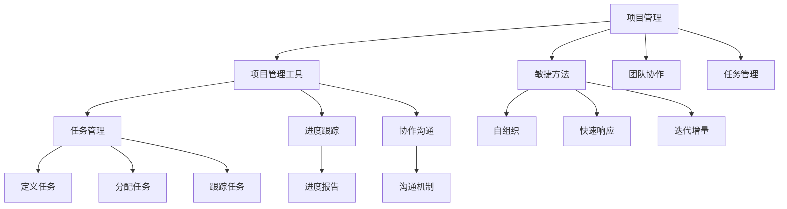
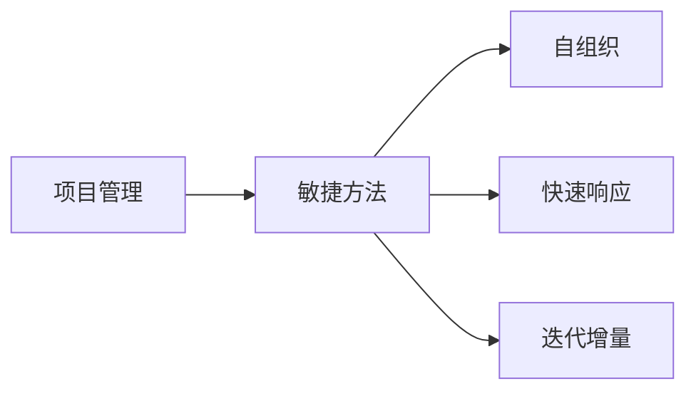
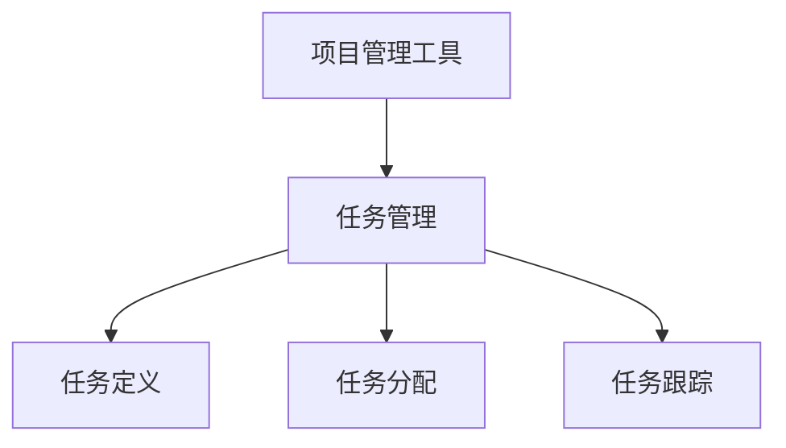
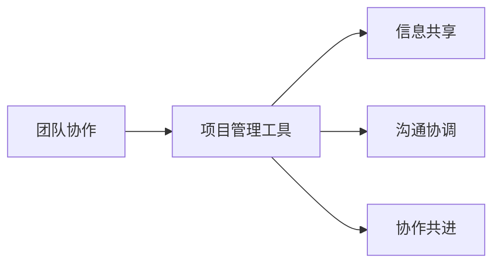

                 

# 如何进行项目管理：如何有效地管理项目和团队？

> 关键词：项目管理, 敏捷方法, 项目管理工具, 团队协作, 任务管理

## 1. 背景介绍

项目管理在现代软件开发中起着至关重要的作用。随着技术的发展和需求的变化，项目管理的复杂度不断提升，对项目经理和团队的能力提出了更高的要求。本文将介绍如何进行有效的项目管理，涵盖项目管理的基本概念、常用方法、工具和实践，帮助读者提升项目管理的水平和效率。

## 2. 核心概念与联系

### 2.1 核心概念概述

为更好地理解项目管理的核心概念，本节将介绍几个关键概念及其相互关系：

- **项目管理 (Project Management)**：指通过规划、执行、监控和闭环等方式，确保项目按预定目标顺利完成的过程。包括项目计划、资源分配、风险管理、质量控制等多个方面。

- **敏捷方法 (Agile Methods)**：以迭代、增量、自组织和反馈等为特点的项目管理方法。强调团队协作、快速响应变化和持续交付。

- **项目管理工具 (Project Management Tools)**：用于辅助项目管理的技术工具，如JIRA、Trello、Asana等，帮助团队进行任务跟踪、进度管理和协作沟通。

- **团队协作 (Team Collaboration)**：指团队成员之间的信息共享、沟通协调、协作共进，以确保项目目标的实现。

- **任务管理 (Task Management)**：通过定义、分配和跟踪任务，确保每个任务按时、按质完成。

这些核心概念通过以下Mermaid流程图展示了它们之间的关系：



这个流程图展示了项目管理、敏捷方法、项目管理工具、团队协作和任务管理之间的关系：

1. 项目管理是整体框架，覆盖敏捷方法、项目管理工具、团队协作和任务管理。
2. 敏捷方法通过迭代和增量实现快速响应变化。
3. 项目管理工具辅助任务管理、进度跟踪和协作沟通。
4. 团队协作确保信息共享、沟通协调和协作共进。
5. 任务管理通过定义、分配和跟踪任务，确保每个任务按时、按质完成。

### 2.2 概念间的关系

这些核心概念之间存在着紧密的联系，形成了项目管理的完整生态系统。下面我们通过几个Mermaid流程图来展示这些概念之间的关系：

#### 2.2.1 项目管理与敏捷方法



这个流程图展示了项目管理与敏捷方法之间的关系。敏捷方法通过自组织、快速响应和迭代增量实现项目管理的目标。

#### 2.2.2 项目管理工具与任务管理



这个流程图展示了项目管理工具与任务管理之间的关系。项目管理工具通过任务定义、任务分配和任务跟踪支持任务管理。

#### 2.2.3 团队协作与项目管理工具



这个流程图展示了团队协作与项目管理工具之间的关系。项目管理工具通过信息共享、沟通协调和协作共进支持团队协作。

## 3. 核心算法原理 & 具体操作步骤

### 3.1 算法原理概述

项目管理通过一系列规划、执行、监控和闭环操作，确保项目按时、按质完成。项目管理算法的基本原理包括以下几个步骤：

1. **项目规划 (Project Planning)**：确定项目目标、范围、时间表、资源和风险等关键要素，制定详细的项目计划。

2. **任务分配 (Task Assignment)**：将项目任务分解为可执行的小任务，分配给相应的团队成员。

3. **进度跟踪 (Progress Tracking)**：通过工具跟踪任务进度，记录任务状态、资源使用情况和问题处理情况。

4. **风险管理 (Risk Management)**：识别、评估和管理项目风险，制定应对策略，规避潜在问题。

5. **质量控制 (Quality Control)**：通过测试、评审等方式，确保任务输出符合质量标准。

6. **项目闭环 (Project Closure)**：项目完成后进行总结、反思和评估，为后续项目提供经验教训。

### 3.2 算法步骤详解

项目管理的具体操作步骤如下：

**Step 1: 项目启动**

1. **项目愿景 (Project Vision)**：明确项目目标和愿景，确保团队成员理解项目意义。
2. **组建团队 (Team Formation)**：根据项目需求，选择合适的团队成员，明确团队角色和职责。
3. **制定项目计划 (Project Plan)**：制定详细的项目计划，包括目标、范围、时间表、资源和风险管理等。

**Step 2: 任务分配**

1. **任务分解 (Task Decomposition)**：将项目任务分解为可执行的小任务。
2. **任务定义 (Task Definition)**：为每个任务定义详细的任务描述、输出要求和质量标准。
3. **任务分配 (Task Assignment)**：将任务分配给相应的团队成员，明确任务优先级和时间要求。

**Step 3: 进度跟踪**

1. **任务执行 (Task Execution)**：团队成员按照任务分配计划，执行各自的任务。
2. **进度报告 (Progress Reporting)**：定期报告任务进度，记录任务完成情况和问题处理情况。
3. **任务协调 (Task Coordination)**：协调解决任务执行中的问题和挑战，确保任务按时完成。

**Step 4: 风险管理**

1. **风险识别 (Risk Identification)**：识别潜在的项目风险，记录风险描述、影响和可能性。
2. **风险评估 (Risk Assessment)**：评估风险的影响和可能性，确定风险优先级。
3. **风险应对 (Risk Response)**：制定应对策略，规避或缓解风险影响。

**Step 5: 质量控制**

1. **任务测试 (Task Testing)**：通过测试工具或评审方式，检查任务输出是否符合质量标准。
2. **质量评审 (Quality Review)**：组织质量评审会议，评审任务输出，提出改进建议。
3. **质量改进 (Quality Improvement)**：根据评审结果，改进任务执行过程，提升任务质量。

**Step 6: 项目闭环**

1. **项目总结 (Project Summary)**：总结项目经验教训，记录项目成果和反思。
2. **团队反馈 (Team Feedback)**：收集团队成员的反馈意见，总结团队合作的优点和改进点。
3. **知识共享 (Knowledge Sharing)**：分享项目经验，为后续项目提供参考。

### 3.3 算法优缺点

项目管理算法具有以下优点：

1. **系统性**：通过规划、执行、监控和闭环等系统性操作，确保项目按时、按质完成。
2. **可控性**：通过任务分配、进度跟踪、风险管理和质量控制等手段，控制项目进展和风险。
3. **灵活性**：通过敏捷方法和项目管理工具，快速响应变化，灵活调整项目计划和资源。

但项目管理算法也存在一些缺点：

1. **复杂性**：项目管理的步骤繁多，需要综合考虑多个因素，复杂度较高。
2. **资源需求**：项目管理需要消耗大量资源，包括时间、人力和资金等。
3. **执行难度**：项目管理的实施需要高水平的项目经理和团队，执行难度较大。

### 3.4 算法应用领域

项目管理算法广泛应用于软件开发、IT基础设施、商业项目等领域。例如：

- **软件开发**：软件开发项目通过项目管理，确保软件按时发布、按质交付。
- **IT基础设施**：IT基础设施项目通过项目管理，确保网络、硬件和系统平稳运行。
- **商业项目**：商业项目通过项目管理，确保产品开发、市场推广和销售目标的实现。

## 4. 数学模型和公式 & 详细讲解 & 举例说明（备注：数学公式请使用latex格式，latex嵌入文中独立段落使用 $$，段落内使用 $)
### 4.1 数学模型构建

本节将使用数学语言对项目管理的基本模型进行描述。

项目管理的基本模型包括以下几个要素：

1. **项目计划 (Project Plan)**：定义项目目标、范围、时间表、资源和风险管理等，用公式表示为：

$$
P = (T, R, B, C, D)
$$

其中 $T$ 为目标，$R$ 为范围，$B$ 为时间表，$C$ 为资源，$D$ 为风险管理。

2. **任务分配 (Task Assignment)**：将项目任务分解为可执行的小任务，用公式表示为：

$$
T = \bigcup_{i=1}^n T_i
$$

其中 $T_i$ 为第 $i$ 个任务。

3. **进度跟踪 (Progress Tracking)**：通过工具跟踪任务进度，用公式表示为：

$$
P_T = (T_i, P_i, S_i)
$$

其中 $P_i$ 为任务状态，$S_i$ 为任务进度。

4. **风险管理 (Risk Management)**：识别、评估和管理项目风险，用公式表示为：

$$
R = (I, P, M)
$$

其中 $I$ 为风险识别，$P$ 为风险评估，$M$ 为风险应对。

5. **质量控制 (Quality Control)**：通过测试、评审等方式，确保任务输出符合质量标准，用公式表示为：

$$
Q = (T_i, P_i, S_i, R_i)
$$

其中 $R_i$ 为任务评审。

### 4.2 公式推导过程

以下我们以一个具体的软件开发项目为例，推导项目管理的基本公式。

假设某软件开发项目的目标是开发一款新的应用程序，时间为3个月，分配给10个开发人员。项目计划如下：

- 项目目标：开发一款功能完善的应用程序。
- 项目范围：功能需求明确，需求文档完善。
- 项目时间表：项目分为三个阶段：需求分析、开发和测试。
- 项目资源：10个开发人员，1台服务器，50000元预算。
- 项目风险管理：识别需求变更、技术难点和人员流失等风险，制定应对策略。

根据上述项目计划，我们可以得到项目的数学模型：

$$
P = (功能完善的应用程序, 功能需求明确, 3个月, 10个开发人员, 1台服务器, 50000元预算, 需求变更, 技术难点, 人员流失)
$$

项目管理算法的核心步骤是任务分配和进度跟踪。任务分配公式如下：

$$
T = \bigcup_{i=1}^n T_i
$$

其中 $T_i$ 为第 $i$ 个任务，$n$ 为任务总数。假设项目任务分解为需求分析、开发和测试三个阶段，每个阶段包含多个子任务。

进度跟踪的公式如下：

$$
P_T = (T_i, P_i, S_i)
$$

其中 $P_i$ 为任务状态，$S_i$ 为任务进度。假设每个任务的状态分为待执行、执行中和已完成，进度以百分比表示。

风险管理的公式如下：

$$
R = (I, P, M)
$$

其中 $I$ 为风险识别，$P$ 为风险评估，$M$ 为风险应对。假设识别了3个风险：需求变更、技术难点和人员流失，评估每个风险的影响和可能性，并制定应对策略。

质量控制的公式如下：

$$
Q = (T_i, P_i, S_i, R_i)
$$

其中 $R_i$ 为任务评审。假设每个任务完成后的评审结果分为通过、需要改进和未通过。

### 4.3 案例分析与讲解

以某软件开发项目为例，介绍项目管理算法的具体应用：

1. **项目启动**

   项目启动阶段，明确项目愿景，组建团队，制定详细的项目计划。

   - 项目愿景：开发一款功能完善的应用程序，提升用户体验。
   - 团队组建：10个开发人员，项目经理1名，产品经理1名。
   - 项目计划：需求分析阶段（1个月），开发阶段（2个月），测试阶段（1个月）。

2. **任务分配**

   任务分解为需求分析、开发和测试三个阶段，每个阶段包含多个子任务。

   - 需求分析阶段：需求调研、需求文档撰写。
   - 开发阶段：功能开发、界面设计、测试用例编写。
   - 测试阶段：功能测试、性能测试、安全测试。

   任务分配公式：

   $$
   T = \bigcup_{i=1}^n T_i
   $$

   其中 $T_i$ 为第 $i$ 个任务，$n$ 为任务总数。

3. **进度跟踪**

   使用项目管理工具如JIRA、Trello等，跟踪任务进度。

   - 任务状态：待执行、执行中和已完成。
   - 任务进度：以百分比表示，例如需求分析阶段完成度为50%。

   进度报告公式：

   $$
   P_T = (T_i, P_i, S_i)
   $$

   其中 $P_i$ 为任务状态，$S_i$ 为任务进度。

4. **风险管理**

   识别需求变更、技术难点和人员流失等风险，制定应对策略。

   - 风险识别：需求变更、技术难点、人员流失。
   - 风险评估：影响和可能性。
   - 风险应对：需求变更采用需求变更管理流程，技术难点提前与技术团队沟通，人员流失制定人员流失预案。

   风险管理公式：

   $$
   R = (I, P, M)
   $$

   其中 $I$ 为风险识别，$P$ 为风险评估，$M$ 为风险应对。

5. **质量控制**

   通过测试、评审等方式，确保任务输出符合质量标准。

   - 任务测试：功能测试、性能测试、安全测试。
   - 任务评审：评审结果分为通过、需要改进和未通过。

   质量控制公式：

   $$
   Q = (T_i, P_i, S_i, R_i)
   $$

   其中 $R_i$ 为任务评审。

6. **项目闭环**

   总结项目经验教训，收集团队反馈，共享知识，为后续项目提供参考。

   - 项目总结：开发过程中遇到的问题、技术难点和成功经验。
   - 团队反馈：团队成员的反馈意见，团队合作的优点和改进点。
   - 知识共享：项目经验、技术文档和代码库的共享。

   项目闭环公式：

   $$
   P_C = (总结, 反馈, 共享)
   $$

   其中 $P_C$ 为项目闭环。

## 5. 项目实践：代码实例和详细解释说明

### 5.1 开发环境搭建

在进行项目管理实践前，我们需要准备好开发环境。以下是使用JIRA进行项目管理的环境配置流程：

1. 安装JIRA：从官网下载并安装JIRA，或使用云服务如Atlassian JIRA。

2. 创建项目：在JIRA中创建新的项目，定义项目名称、描述和负责人员。

3. 定义任务类型：创建任务类型，如需求分析、功能开发、测试等，定义任务状态和属性。

4. 配置项目模板：创建项目模板，定义任务分配、进度跟踪和风险管理的流程。

5. 导入项目数据：导入历史任务和数据，确保项目数据的完整性。

完成上述步骤后，即可在JIRA环境中进行项目管理实践。

### 5.2 源代码详细实现

下面我们以敏捷方法为例，给出使用JIRA进行项目管理的具体代码实现。

1. **任务分配**

   使用JIRA创建任务并分配给相应的人员。

   - 创建任务：在JIRA中创建新的任务，填写任务标题、描述和优先级。
   - 分配任务：将任务分配给相应的开发人员，设置任务状态和进度。

   JIRA API代码示例：

   ```python
   import requests
   
   url = 'https://your-jira-instance.com/rest/api/2/issue'
   headers = {'Authorization': 'Basic ' + auth}
   data = {
       'fields': {
           'project': {'key': 'PROJ-1'},
           'summary': '任务描述',
           'assignee': {'name': '开发人员'},
           'status': {'name': '待执行'},
           'priority': {'name': '高'}
       }
   }
   
   response = requests.post(url, headers=headers, json=data)
   ```

2. **进度跟踪**

   使用JIRA跟踪任务的进度，记录任务状态和完成情况。

   - 更新任务状态：将任务状态从待执行更新为执行中或已完成。
   - 记录任务进度：记录任务的完成百分比，例如需求分析任务完成度为50%。

   JIRA API代码示例：

   ```python
   url = 'https://your-jira-instance.com/rest/api/2/issue/' + issue_key
   headers = {'Authorization': 'Basic ' + auth}
   data = {
       'fields': {
           'status': {'name': '执行中'},
           'progress': {
               'total': 100,
               'spent': 50,
               'remaining': 50
           }
       }
   }
   
   response = requests.put(url, headers=headers, json=data)
   ```

3. **风险管理**

   使用JIRA管理项目风险，识别、评估和管理风险。

   - 创建风险：在JIRA中创建新的风险，填写风险描述、影响和可能性。
   - 评估风险：对风险进行评估，记录风险状态和应对策略。

   JIRA API代码示例：

   ```python
   url = 'https://your-jira-instance.com/rest/api/2/issue/' + issue_key
   headers = {'Authorization': 'Basic ' + auth}
   data = {
       'fields': {
           'status': {'name': '评估中'},
           'priority': {'name': '高'},
           'description': '风险描述'
       }
   }
   
   response = requests.put(url, headers=headers, json=data)
   ```

4. **质量控制**

   使用JIRA进行任务评审，确保任务输出符合质量标准。

   - 创建评审：在JIRA中创建新的评审，填写评审内容和评审结果。
   - 评审任务：对任务进行评审，记录评审结果和改进建议。

   JIRA API代码示例：

   ```python
   url = 'https://your-jira-instance.com/rest/api/2/issue/' + issue_key
   headers = {'Authorization': 'Basic ' + auth}
   data = {
       'fields': {
           'status': {'name': '评审中'},
           'progress': {
               'total': 100,
               'spent': 50,
               'remaining': 50
           }
       }
   }
   
   response = requests.put(url, headers=headers, json=data)
   ```

### 5.3 代码解读与分析

让我们再详细解读一下关键代码的实现细节：

**JIRA API**：
- `requests`模块用于发送HTTP请求，`Basic`认证用于访问JIRA API。
- `url`为JIRA API的请求地址，`headers`为认证信息，`data`为请求体。
- 请求方法使用`POST`、`PUT`等，根据需要设置不同的参数。

**任务分配**：
- 创建任务时，填写任务标题、描述、优先级、状态和进度等字段。
- 分配任务时，将任务状态设置为待执行，进度设置为0%。

**进度跟踪**：
- 更新任务状态时，将任务状态设置为执行中或已完成，进度设置为相应的百分比。
- 记录任务进度时，使用`remaining`字段表示剩余任务量，`spent`字段表示已完成任务量。

**风险管理**：
- 创建风险时，填写风险描述、影响和可能性等字段。
- 评估风险时，设置风险状态为评估中，记录应对策略。

**质量控制**：
- 创建评审时，填写评审内容和评审结果等字段。
- 评审任务时，设置任务状态为评审中，记录评审结果和改进建议。

### 5.4 运行结果展示

假设我们在JIRA中创建了一个项目，并在其中分配了多个任务，跟踪任务进度、管理风险和进行质量评审。最终，项目按照计划顺利完成，取得了理想的成果。以下是JIRA中项目任务分配、进度跟踪和质量控制的运行结果展示：

1. **任务分配结果**

   

   展示了项目中分配的任务列表，每个任务包括标题、描述、状态和负责人等信息。

2. **进度跟踪结果**

   

   展示了项目中任务的进度情况，每个任务包括状态、进度和完成百分比等信息。

3. **质量控制结果**

   

   展示了项目中任务的评审结果，每个任务包括评审内容、评审结果和改进建议等信息。

## 6. 实际应用场景

### 6.1 软件开发

在软件开发项目中，使用项目管理工具如JIRA、Trello等，可以显著提升开发效率和项目质量。具体应用场景如下：

1. **敏捷开发**：使用敏捷方法，如Scrum或Kanban，通过迭代增量实现快速响应变化，提高开发效率。
2. **任务跟踪**：通过任务管理工具，跟踪任务进度和状态，确保任务按时完成。
3. **协作沟通**：通过协作工具，如Slack或Confluence，进行实时沟通和文档共享。
4. **持续集成**：通过持续集成工具，如Jenkins或Travis CI，自动化测试和部署，确保代码质量和发布效率。

### 6.2 企业项目管理

企业项目管理涉及项目规划、资源分配、风险管理和质量控制等多个方面。具体应用场景如下：

1. **项目规划**：通过项目管理工具，制定详细的项目计划，明确项目目标、范围、时间表和资源分配。
2. **资源管理**：通过资源管理工具，如Asana或Microsoft Project，优化资源配置，提高资源利用率。
3. **风险管理**：通过风险管理工具，识别、评估和管理项目风险，规避潜在问题。
4. **质量控制**：通过质量控制工具，如NQA或Zephyr，进行测试、评审和质量改进，确保项目输出符合质量标准。

### 6.3 项目监控

项目监控通过跟踪项目进展和质量，确保项目按时、按质完成。具体应用场景如下：

1. **进度跟踪**：使用项目管理工具，如JIRA或Trello，跟踪任务进度和状态，记录任务完成情况和问题处理情况。
2. **质量控制**：通过质量控制工具，如Zephyr或NQA，进行测试、评审和质量改进，确保任务输出符合质量标准。
3. **风险管理**：使用风险管理工具，如RiskWatch或RiskSmart，识别、评估和管理项目风险，规避潜在问题。

## 7. 工具和资源推荐

### 7.1 学习资源推荐

为了帮助开发者系统掌握项目管理的基本概念和实践技巧，这里推荐一些优质的学习资源：

1. **《项目管理知识体系指南 (PMBOK)》**：由PMI发布的项目管理标准指南，涵盖项目管理的五大过程组和十大知识领域，是项目管理领域的权威参考。
2. **《敏捷项目管理》**：讲述敏捷方法论和实践，通过Scrum、Kanban等工具，提升项目管理效率。
3. **《Project Management for Dummies》**：适合初学者的项目管理入门书籍，介绍了项目管理的核心概念和实践技巧。
4. **《Project Management with Scrum》**：讲解Scrum方法论和工具，适合敏捷项目管理的实践者。
5. **《Atlassian JIRA用户手册》**：JIRA官方用户手册，提供详细的JIRA使用指南，适合JIRA新手。

通过对这些资源的学习实践，相信你一定能够快速掌握项目管理的基本知识和实践技巧，提升项目管理的能力。

### 7.2 开发工具推荐

高效的开发离不开优秀的工具支持。以下是几款用于项目管理开发的常用工具：

1. **JIRA**：Atlassian公司的项目管理工具，支持敏捷开发、任务管理、进度跟踪和协作沟通等功能。
2. **Trello**：项目管理工具，支持看板、任务分配和进度跟踪等功能，适合小型项目和敏捷开发。
3. **Asana**：项目管理工具，支持任务分配、进度跟踪和协作沟通等功能，适合团队协作。
4. **Microsoft Project**：项目管理软件，支持项目规划、资源分配和风险管理等功能，适合企业项目管理。
5. **Confluence**：协作工具，支持文档共享、团队协作和知识管理等功能，适合团队文档管理和知识共享。

合理利用这些工具，可以显著提升项目管理的效率和质量，加速项目的实施和交付。

### 7.3 相关论文推荐

项目管理是一个跨学科的研究领域，涉及管理学、计算机科学、工程学等多个学科。以下是几篇具有代表性的项目管理论文，推荐阅读：

1. **《A Guide to the Project Management Body of Knowledge (PMBOK Guide)》**：PMI发布的项目管理标准指南，涵盖项目管理的五大过程组和十大知识领域。
2. **《Sc

