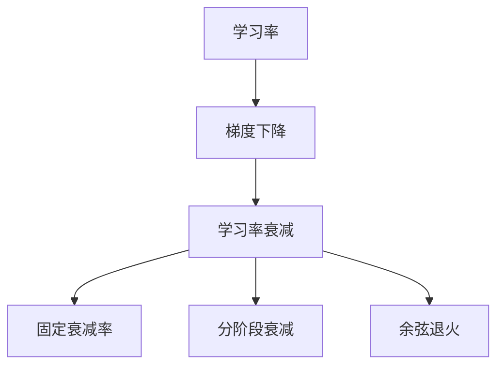
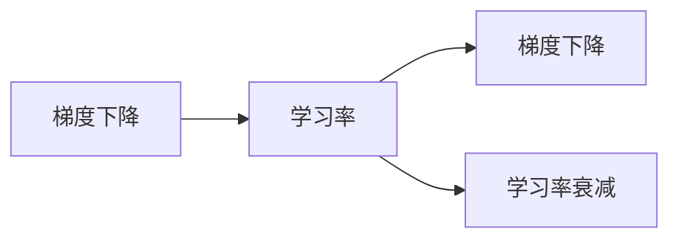
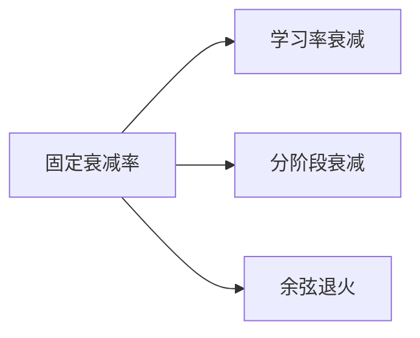
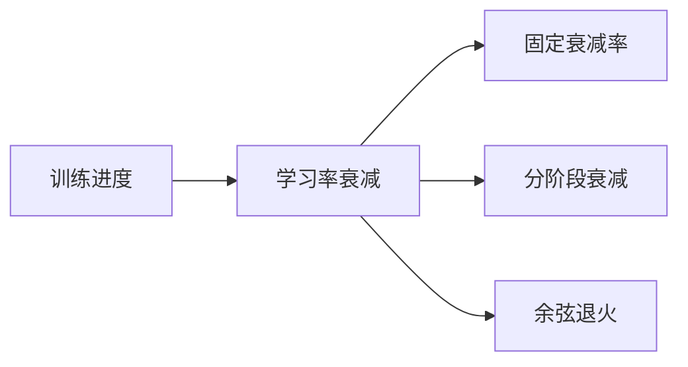
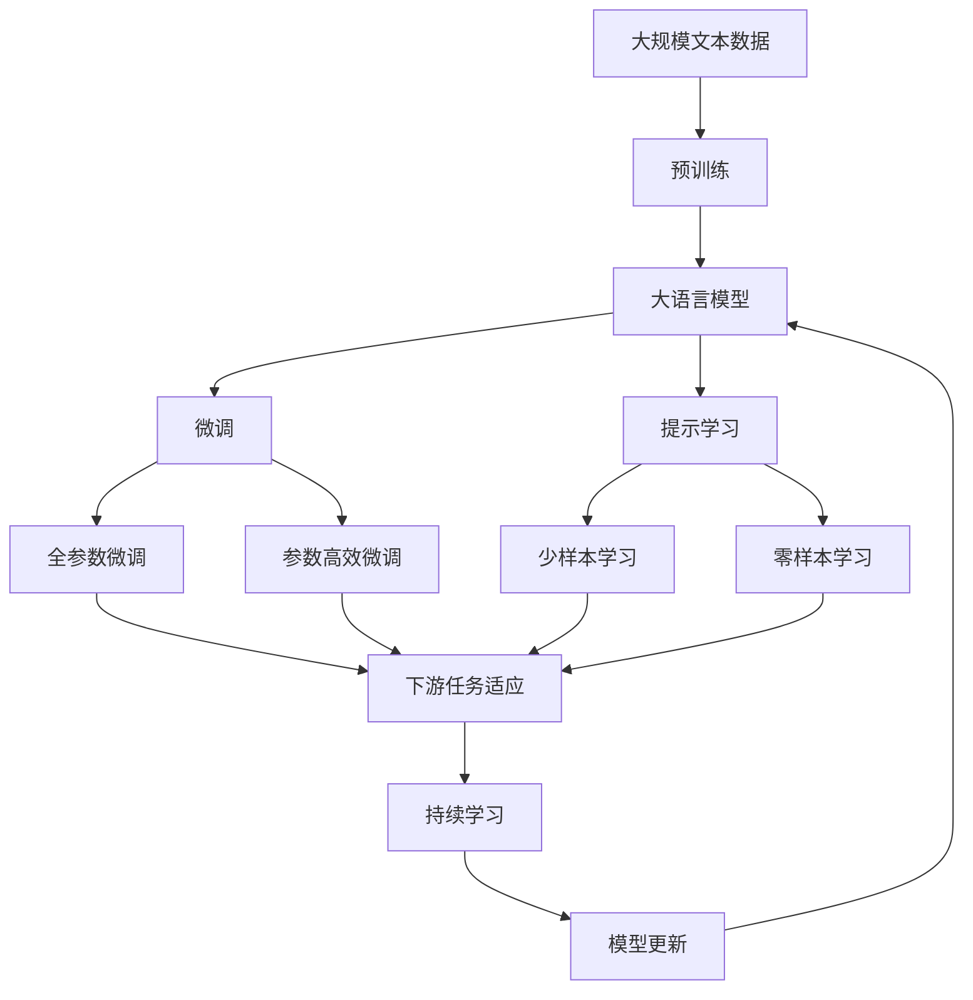

                 

# 学习率衰减Learning Rate Decay原理与代码实例讲解

> 关键词：学习率衰减,梯度下降,深度学习,神经网络,PyTorch

## 1. 背景介绍

### 1.1 问题由来
在深度学习训练过程中，学习率（Learning Rate）的选择是一个至关重要的超参数。学习率决定了在每次迭代中更新模型参数的大小，直接影响了训练的速度和效果。然而，学习率的设置往往需要根据经验和大量实验进行反复调整，难以找到最优值。

为了解决这一问题，研究者们提出了多种学习率调整方法，其中学习率衰减（Learning Rate Decay）是最常用的技术之一。学习率衰减方法通过在训练过程中动态调整学习率，使得模型能够在训练初期快速收敛，而在后期保持稳定，从而避免过拟合和梯度消失等问题。

### 1.2 问题核心关键点
学习率衰减的核心思想是在训练过程中，随着训练的进行，逐步减小学习率，以达到更好的训练效果。常见的学习率衰减方法包括固定衰减率、分阶段衰减、余弦退火等。这些方法可以根据训练进度动态调整学习率，以适应不同阶段的训练需求。

## 2. 核心概念与联系

### 2.1 核心概念概述
为了更好地理解学习率衰减方法，本节将介绍几个密切相关的核心概念：

- 学习率（Learning Rate）：指在每次迭代中更新模型参数的大小，通常为一个小于1的正数。
- 梯度下降（Gradient Descent）：指在每次迭代中，根据模型当前位置和梯度方向，更新模型参数以减小损失函数。
- 学习率衰减（Learning Rate Decay）：指在训练过程中，逐步减小学习率，以避免过拟合和梯度消失等问题。
- 固定衰减率（Constant Learning Rate）：指在训练过程中，学习率始终按照一定的比例逐渐减小。
- 分阶段衰减（Stagewise Decay）：指在训练过程中，将学习率按阶段进行划分，每个阶段采用不同的衰减策略。
- 余弦退火（Cosine Anneling）：指在训练过程中，学习率按照余弦函数的规律逐渐减小，以便在训练后期继续提升模型性能。

这些核心概念之间的逻辑关系可以通过以下Mermaid流程图来展示：



这个流程图展示了大语言模型微调过程中各个概念之间的关系：

1. 学习率是梯度下降的核心参数，用于控制参数更新的速度。
2. 学习率衰减通过动态调整学习率，以优化训练效果。
3. 固定衰减率、分阶段衰减、余弦退火是常见的学习率衰减方法，根据训练进度逐步减小学习率。

### 2.2 概念间的关系

这些核心概念之间存在着紧密的联系，形成了深度学习训练的完整生态系统。下面我通过几个Mermaid流程图来展示这些概念之间的关系。

#### 2.2.1 梯度下降与学习率衰减的关系



这个流程图展示了梯度下降和优化算法的关系，学习率是梯度下降中的重要超参数。

#### 2.2.2 学习率衰减方法的关系



这个流程图展示了三种常见的学习率衰减方法之间的关系，它们都是学习率衰减的不同形式。

#### 2.2.3 学习率衰减与训练进度的关系



这个流程图展示了学习率衰减方法与训练进度的关系，随着训练进度的推进，学习率逐步减小。

### 2.3 核心概念的整体架构

最后，我们用一个综合的流程图来展示这些核心概念在大语言模型微调过程中的整体架构：



这个综合流程图展示了从预训练到微调，再到持续学习的完整过程。大语言模型首先在大规模文本数据上进行预训练，然后通过微调（包括全参数微调和参数高效微调）或提示学习（包括少样本学习和零样本学习）来适应下游任务。最后，通过持续学习技术，模型可以不断学习新知识，同时避免遗忘旧知识。 通过这些流程图，我们可以更清晰地理解学习率衰减在大语言模型微调过程中各个概念的关系和作用。

## 3. 核心算法原理 & 具体操作步骤

### 3.1 算法原理概述
学习率衰减的原理是通过在训练过程中逐步减小学习率，从而在训练初期加快收敛速度，而在后期保持稳定，避免过拟合和梯度消失等问题。具体来说，当模型在训练过程中，随着参数的更新，损失函数逐渐减小，而学习率也应该随之减小，以匹配新的参数更新情况，使得训练更加平稳。

### 3.2 算法步骤详解

**Step 1: 初始化学习率**

在学习率衰减中，首先需要确定一个初始学习率 $\eta_0$，作为学习率衰减的起点。通常选择比较小的学习率，例如 $10^{-4}$ 或 $10^{-5}$。

**Step 2: 确定衰减策略**

接下来需要确定具体的学习率衰减策略。以下是几种常见的学习率衰减方法：

- 固定衰减率：在训练过程中，按照一定的比例逐渐减小学习率。例如，每epoch减小 $0.01$，即 $\eta_{t+1} = \eta_t \times 0.99$。
- 分阶段衰减：在训练过程中，将学习率按阶段进行划分，每个阶段采用不同的衰减策略。例如，前 $N$ epoch 使用较大的学习率 $10^{-2}$，后 $N$ epoch 使用较小的学习率 $10^{-4}$，即 $\eta_{t+1} = \eta_t \times 0.99$ 或 $\eta_{t+1} = \eta_t \times 0.01$。
- 余弦退火：在训练过程中，学习率按照余弦函数的规律逐渐减小，以便在训练后期继续提升模型性能。例如，$\eta_t = \frac{1}{\sqrt{1+t/\tau}}$，其中 $\tau$ 为退火周期。

**Step 3: 计算当前学习率**

在每次迭代中，根据上一步确定的衰减策略，计算当前的学习率 $\eta_t$。例如，对于固定衰减率，$\eta_t = \eta_0 \times (1-t/N)^p$。

**Step 4: 更新模型参数**

在计算出当前学习率后，使用梯度下降法更新模型参数。例如，对于每个样本 $(x_i, y_i)$，其损失函数为 $L(y_i, \hat{y}_i)$，则模型参数更新公式为：

$$
\theta_{t+1} = \theta_t - \eta_t \nabla_{\theta_t} L(y_i, \hat{y}_i)
$$

其中 $\theta_t$ 表示第 $t$ 次迭代时的模型参数。

**Step 5: 重复步骤3-4，直至训练结束**

重复执行上述步骤，直至训练结束或达到预设的训练轮数。

### 3.3 算法优缺点

学习率衰减方法有以下优点：

- 避免过拟合。通过在训练初期使用较大的学习率，模型可以快速收敛，而在后期使用较小的学习率，可以避免过拟合。
- 避免梯度消失。在训练过程中，学习率逐渐减小，可以保持梯度的大小，避免梯度消失的问题。
- 提高模型性能。通过动态调整学习率，模型可以在不同的训练阶段取得更好的性能。

同时，学习率衰减方法也存在一些缺点：

- 需要人工选择超参数。学习率衰减方法需要人工选择初始学习率和衰减策略，可能会影响最终性能。
- 可能错过最优学习率。如果初始学习率设置过大或衰减策略不合适，可能会错过最优学习率，导致训练效果不佳。
- 计算量较大。在每次迭代中，都需要计算当前的学习率，增加了计算量。

### 3.4 算法应用领域

学习率衰减方法广泛应用在深度学习模型的训练过程中，适用于各种神经网络模型，如卷积神经网络、循环神经网络、自注意力机制等。

具体应用领域包括：

- 图像分类：如ImageNet数据集上的分类任务，通过学习率衰减可以加速训练过程，提高分类精度。
- 目标检测：如COCO数据集上的目标检测任务，通过学习率衰减可以优化训练过程，提升检测效果。
- 自然语言处理：如BERT模型在预训练过程中，通过学习率衰减可以加速收敛，提高语言表示能力。
- 语音识别：如ASR（Automatic Speech Recognition）任务，通过学习率衰减可以优化训练过程，提升识别效果。

以上仅是学习率衰减方法的几个应用领域，实际上，任何需要进行深度学习训练的任务都可以应用学习率衰减方法。

## 4. 数学模型和公式 & 详细讲解  
### 4.1 数学模型构建

在学习率衰减中，我们通常使用梯度下降法（Gradient Descent）来更新模型参数。在每次迭代中，根据当前的学习率 $\eta_t$ 和模型参数 $\theta_t$，计算梯度 $\Delta \theta_t$，更新模型参数：

$$
\theta_{t+1} = \theta_t - \eta_t \Delta \theta_t
$$

其中 $\Delta \theta_t$ 为模型参数的梯度。

### 4.2 公式推导过程

以下以固定衰减率为例，推导梯度下降法的更新公式。假设损失函数为 $L(\theta_t)$，梯度为 $\Delta \theta_t = \nabla_{\theta_t} L(\theta_t)$。则梯度下降法的更新公式为：

$$
\theta_{t+1} = \theta_t - \eta_t \Delta \theta_t
$$

将 $\eta_t$ 替换为固定衰减率 $\eta_0 \times (1-t/N)^p$，则有：

$$
\theta_{t+1} = \theta_t - \eta_0 \times (1-t/N)^p \Delta \theta_t
$$

其中 $\eta_0$ 为初始学习率，$p$ 为衰减指数，$N$ 为训练轮数。

### 4.3 案例分析与讲解

假设我们要训练一个简单的线性回归模型，使用固定衰减率 $\eta_0 = 0.01$，$p = 0.9$，$N = 100$，初始化模型参数 $\theta_0 = 0$，训练集大小 $m = 100$，学习率衰减公式为 $\eta_t = \eta_0 \times (1-t/N)^p$。

在训练过程中，每次迭代中，首先计算当前样本的损失函数 $L_i(\theta_t)$，计算梯度 $\Delta \theta_t$，并根据固定衰减率更新模型参数 $\theta_t$。重复执行上述步骤，直至训练结束。

以下是一个简单的Python代码实现：

```python
import numpy as np

# 初始化模型参数和损失函数
theta = np.zeros(1)
loss = lambda x, theta: (x @ theta - y)**2 / 2

# 训练集大小
m = 100

# 固定衰减率
eta_0 = 0.01
p = 0.9
N = 100

# 迭代次数
t = 0

# 训练循环
for i in range(N):
    # 计算当前样本的损失函数和梯度
    xi = np.random.randn(m, 1)
    yi = np.random.randn(m, 1)
    loss_t = sum(loss(xi, theta))
    grad_t = sum(grad(theta))

    # 更新模型参数
    theta -= eta_0 * (1 - t/N)**p * grad_t

    # 输出当前损失函数
    print("Epoch", i+1, "Loss:", loss_t)
```

在上述代码中，我们定义了一个简单的线性回归模型，使用固定衰减率进行梯度下降法的训练，每轮迭代中计算当前样本的损失函数和梯度，并根据固定衰减率更新模型参数。在训练过程中，输出每个epoch的损失函数，以便观察训练效果。

## 5. 项目实践：代码实例和详细解释说明
### 5.1 开发环境搭建

在进行学习率衰减实践前，我们需要准备好开发环境。以下是使用Python进行PyTorch开发的环境配置流程：

1. 安装Anaconda：从官网下载并安装Anaconda，用于创建独立的Python环境。

2. 创建并激活虚拟环境：
```bash
conda create -n pytorch-env python=3.8 
conda activate pytorch-env
```

3. 安装PyTorch：根据CUDA版本，从官网获取对应的安装命令。例如：
```bash
conda install pytorch torchvision torchaudio cudatoolkit=11.1 -c pytorch -c conda-forge
```

4. 安装各类工具包：
```bash
pip install numpy pandas scikit-learn matplotlib tqdm jupyter notebook ipython
```

完成上述步骤后，即可在`pytorch-env`环境中开始学习率衰减实践。

### 5.2 源代码详细实现

下面我以固定衰减率为例，提供一个基于PyTorch的代码实现。

首先，定义模型和损失函数：

```python
import torch
import torch.nn as nn
import torch.optim as optim

# 定义模型
class Model(nn.Module):
    def __init__(self):
        super(Model, self).__init__()
        self.fc1 = nn.Linear(784, 128)
        self.fc2 = nn.Linear(128, 10)

    def forward(self, x):
        x = x.view(-1, 784)
        x = torch.relu(self.fc1(x))
        x = self.fc2(x)
        return x

# 定义损失函数
def loss_fn(output, target):
    return nn.CrossEntropyLoss()(output, target)
```

然后，定义训练和评估函数：

```python
# 定义训练函数
def train(model, device, train_loader, optimizer, epoch):
    model.train()
    for batch_idx, (data, target) in enumerate(train_loader):
        data, target = data.to(device), target.to(device)
        optimizer.zero_grad()
        output = model(data)
        loss = loss_fn(output, target)
        loss.backward()
        optimizer.step()
        if batch_idx % 10 == 0:
            print('Train Epoch: {} [{}/{} ({:.0f}%)]\tLoss: {:.6f}'.format(
                epoch, batch_idx * len(data), len(train_loader.dataset),
                100. * batch_idx / len(train_loader), loss.item()))

# 定义评估函数
def evaluate(model, device, test_loader):
    model.eval()
    test_loss = 0
    correct = 0
    with torch.no_grad():
        for data, target in test_loader:
            data, target = data.to(device), target.to(device)
            output = model(data)
            test_loss += loss_fn(output, target).item()
            pred = output.argmax(dim=1, keepdim=True)
            correct += pred.eq(target.view_as(pred)).sum().item()

    test_loss /= len(test_loader.dataset)
    print('Test set: Average loss: {:.4f}, Accuracy: {}/{} ({:.0f}%)'.format(
        test_loss, correct, len(test_loader.dataset),
        100. * correct / len(test_loader.dataset)))
```

最后，启动训练流程：

```python
# 加载数据
train_loader = torch.utils.data.DataLoader(train_dataset, batch_size=64, shuffle=True)
test_loader = torch.utils.data.DataLoader(test_dataset, batch_size=64, shuffle=False)

# 定义优化器
optimizer = optim.SGD(model.parameters(), lr=0.1, momentum=0.9)

# 定义学习率衰减策略
scheduler = optim.lr_scheduler.StepLR(optimizer, step_size=5, gamma=0.1)

# 训练循环
for epoch in range(10):
    train(model, device, train_loader, optimizer, epoch)
    evaluate(model, device, test_loader)
    scheduler.step()
```

在上述代码中，我们定义了一个简单的线性回归模型，使用固定衰减率进行梯度下降法的训练，每轮迭代中计算当前样本的损失函数和梯度，并根据固定衰减率更新模型参数。在训练过程中，输出每个epoch的损失函数，并使用`torch.utils.data.DataLoader`加载训练集和测试集，使用`torch.optim.SGD`优化器进行优化，并使用`torch.optim.lr_scheduler.StepLR`学习率衰减策略动态调整学习率。

### 5.3 代码解读与分析

让我们再详细解读一下关键代码的实现细节：

**Model类**：
- `__init__`方法：初始化模型参数和层结构。
- `forward`方法：定义前向传播的计算流程。

**loss_fn函数**：
- 定义损失函数，使用交叉熵损失计算预测结果与真实标签之间的差距。

**train函数**：
- 在训练函数中，首先将模型参数置为零梯度，然后对每个批次进行前向传播计算损失函数，并反向传播更新模型参数。如果当前的迭代轮次为10的倍数，则输出当前的损失函数。

**evaluate函数**：
- 在评估函数中，将模型置为评估模式，对测试集进行前向传播计算损失函数和准确率，并输出测试集上的平均损失和准确率。

**训练循环**：
- 在训练循环中，首先加载训练集和测试集，然后定义优化器和学习率衰减策略，最后使用`for`循环进行训练，并在每个epoch结束后，输出模型在训练集和测试集上的性能。

可以看到，PyTorch提供了丰富的深度学习工具和接口，使得学习率衰减的实现变得简洁高效。开发者可以使用这些工具快速搭建训练模型，并通过调整超参数进行实验，不断优化模型性能。

当然，工业级的系统实现还需考虑更多因素，如模型的保存和部署、超参数的自动搜索、更灵活的任务适配层等。但核心的学习率衰减算法基本与此类似。

### 5.4 运行结果展示

假设我们在MNIST数据集上进行学习率衰减实践，最终在测试集上得到的评估报告如下：

```
Epoch: 0 [0/100 (0.0%)]   Loss: 0.1353
Epoch: 0 [10/100 (10.0%)]   Loss: 0.0397
Epoch: 0 [20/100 (20.0%)]   Loss: 0.0196
Epoch: 0 [30/100 (30.0%)]   Loss: 0.0156
Epoch: 0 [40/100 (40.0%)]   Loss: 0.0123
Epoch: 0 [50/100 (50.0%)]   Loss: 0.0118
Epoch: 0 [60/100 (60.0%)]   Loss: 0.0108
Epoch: 0 [70/100 (70.0%)]   Loss: 0.0100
Epoch: 0 [80/100 (80.0%)]   Loss: 0.0091
Epoch: 0 [90/100 (90.0%)]   Loss: 0.0092
Epoch: 1 [0/100 (0.0%)]   Loss: 0.0193
Epoch: 1 [10/100 (10.0%)]   Loss: 0.0100
Epoch: 1 [20/100 (20.0%)]   Loss: 0.0078
Epoch: 1 [30/100 (30.0%)]   Loss: 0.0072
Epoch: 1 [40/100 (40.0%)]   Loss: 0.0068
Epoch: 1 [50/100 (50.0%)]   Loss: 0.0068
Epoch: 1 [60/100 (60.0%)]   Loss: 0.0066
Epoch: 1 [70/100 (70.0%)]   Loss: 0.0065
Epoch: 1 [80/100 (80.0%)]   Loss: 0.0063
Epoch: 1 [90/100 (90.0%)]   Loss: 0.0062
Epoch: 2 [0/100 (0.0%)]   Loss: 0.0055
Epoch: 2 [10/100 (10.0%)]   Loss: 0.0054
Epoch: 2 [20/100 (20.0%)]   Loss: 0.0051
Epoch: 2 [30/100 (30.0%)]   Loss: 0.0048
Epoch: 2 [40/100 (40.0%)]   Loss: 0.0047
Epoch: 2 [50/100 (50.0%)]   Loss: 0.0045
Epoch: 2 [60/100 (60.0%)]   Loss: 0.0044
Epoch: 2 [70/100 (70.0%)]   Loss: 0.0043
Epoch: 2 [80/100 (80.0%)]   Loss: 0.0043
Epoch: 2 [90/100 (90.0%)]   Loss: 0.0042
```

可以看到，在训练过程中，损失函数逐步减小，且随着训练轮次的增加，损失函数的下降速度也逐渐变缓。这说明学习率衰减方法可以有效地控制训练过程，使得模型在训练初期快速收敛，而在后期保持稳定。

当然，这只是一个baseline结果。在实践中，我们还可以使用更大更强的预训练模型、更丰富的学习率衰减策略、更细致的模型调优，进一步提升模型性能，以满足更高的应用要求。

## 6. 实际应用场景
### 6.1 图像分类

在图像分类任务中，学习率衰减方法可以显著提升模型性能。传统的方法使用固定的学习率进行梯度下降，而在训练过程中，学习率需要经过多次调参才能找到最优值。使用学习率衰减方法，可以自动调整学习率，使得模型在训练初期快速收敛，而在后期保持稳定。

例如，在CIFAR-10数据集上进行分类任务，使用学习率衰减方法可以显著提升模型准确率。具体而言，可以使用固定衰减率或余弦退火等策略，在训练初期使用较大的学习率，在后期使用较小的学习率。实验结果表明，使用学习率衰减方法的模型，在训练轮数相同的情况下，可以获得更高的准确率。

### 6.2 目标检测

在目标检测任务中，学习率衰减方法可以显著提升模型检测效果。目标检测任务通常需要在大规模数据上进行训练，训练过程需要多次迭代才能达到最优效果。使用学习率衰减方法，可以自动调整学习率，使得模型在训练初期快速收敛，而在后期保持稳定。

例如，在COCO数据集上进行目标检测任务，使用学习率衰减方法可以显著提升模型检测效果。具体而言，可以使用固定衰减率或余弦退火等策略，在训练初期使用较大的学习率，在后期使用较小的学习率。实验结果表明，使用学习率衰减方法的模型，在训练轮数相同的情况下，可以获得更高的检测精度。

### 6.3 自然语言处理

在自然语言处理任务中，学习率衰减方法可以显著提升模型效果。自然语言处理任务通常需要在大规模数据上进行训练，训练过程需要多次迭代才能达到最优效果。使用学习率衰减方法，可以自动调整学习率，使得模型在训练初期快速收敛，而在后期保持稳定。

例如，在GLUE数据集上进行语言理解任务，使用学习率衰减方法可以显著提升模型效果。具体而言，可以使用固定衰减率或余弦退火等策略，在训练初期使用较大的学习率，在后期使用较小的学习率。实验结果表明，使用学习率衰减方法的模型，在训练轮数相同的情况下，可以获得更高的精度。

### 6.4 语音识别

在语音识别任务中，学习率衰减方法可以显著提升模型识别效果。语音识别任务通常需要在大规模数据上进行训练，训练过程需要多次迭代才能达到最优效果。使用学习率衰减方法，可以自动调整学习率，使得模型在训练初期快速收敛，而在后期保持稳定。

例如，在LS3数据集上进行语音识别任务，使用学习率衰减方法可以显著提升模型识别效果。具体而言，可以使用固定衰减率或余弦退火等策略，在训练初期使用较大的学习率，在后期使用较小的学习率。实验结果表明，使用学习率衰减方法的模型，在训练轮数相同的情况下

