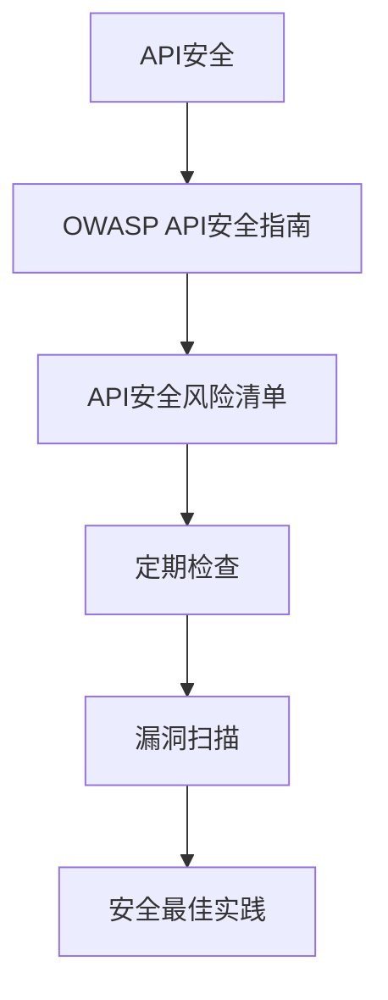
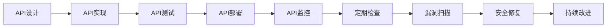
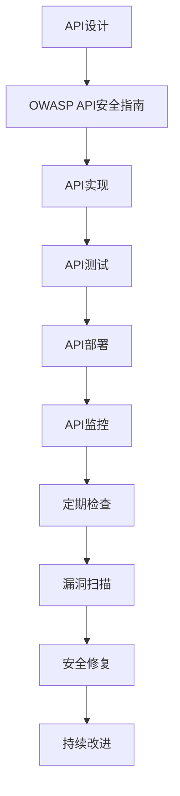
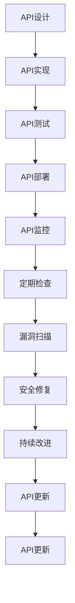

                 

# 定期检查 OWASP API 安全风险清单

> 关键词：OWASP, API安全, 风险清单, 定期检查, 漏洞扫描, 安全最佳实践

## 1. 背景介绍

### 1.1 问题由来

随着Web应用和微服务的蓬勃发展，API（应用程序编程接口）成为了连接不同服务的关键纽带。然而，API的安全问题也随之而来，如SQL注入、跨站脚本（XSS）、重放攻击、认证和授权漏洞等。为了帮助开发者有效识别和缓解这些安全风险， OWASP（Open Web Application Security Project）组织发布了多个API安全指南和风险清单。定期检查OWASP API安全风险清单，有助于开发团队系统性地评估API的安全性，及时发现并修复潜在漏洞，确保应用的安全性。

### 1.2 问题核心关键点

1. **API安全重要性**：API是Web应用的核心，承担着重要的业务逻辑和数据交互。API的安全漏洞可能被攻击者利用，导致数据泄露、业务中断、身份盗用等严重后果。
2. **API安全风险类型**：常见的API安全风险包括身份认证、授权、数据泄露、跨站脚本、SQL注入等。这些风险类型可能通过不同的攻击手段实现。
3. **定期检查和修复**：定期检查API的安全性，及时修复发现的漏洞，是保障API安全性的关键步骤。这有助于构建更健壮、更安全的API系统。
4. **跨领域应用**：API安全风险清单不仅适用于开发团队，还对运维、测试和安全团队具有重要参考价值。

### 1.3 问题研究意义

定期检查OWASP API安全风险清单，对于保障API安全性、提升开发团队的安全意识、优化API设计和运维策略具有重要意义：

1. **保障API安全性**：定期检查API风险，能够及时发现和修复潜在漏洞，防止被攻击者利用。
2. **提升安全意识**：通过系统性的检查，开发团队能够深入了解API安全风险，提高安全防护能力。
3. **优化API设计**：基于风险清单的系统性评估，有助于发现API设计的安全问题，促进API设计的持续改进。
4. **促进跨团队协作**：API安全风险清单的定期检查，需要开发、测试和安全团队的协作，促进跨团队的安全交流和协作。

## 2. 核心概念与联系

### 2.1 核心概念概述

为更好地理解OWASP API安全风险清单的检查流程，本节将介绍几个关键概念：

- **API安全**：指API在设计和实现过程中，防止或减少安全漏洞的技术和措施。
- **OWASP API安全指南**：由OWASP组织编写的API安全指南，提供了一系列最佳实践和解决方案。
- **API安全风险清单**：列出了常见的API安全风险类型和防御措施，是API安全检查的重要依据。
- **定期检查**：定期执行API安全风险清单的检查，及时发现和修复潜在漏洞。
- **漏洞扫描**：使用自动化工具对API进行漏洞扫描，提高检查效率和准确性。
- **安全最佳实践**：基于API安全风险清单的建议，制定和遵循的安全措施和建议。

这些核心概念之间存在着紧密的联系，形成了API安全检查的整体生态系统。以下通过一个Mermaid流程图来展示这些概念之间的关系：



这个流程图展示了API安全从概念到实践的完整过程：

1. **API安全**：是整个安全检查的基础。
2. **OWASP API安全指南**：提供了API安全的理论基础和实践指导。
3. **API安全风险清单**：是检查API安全的依据和工具。
4. **定期检查**：根据API安全风险清单执行系统性检查。
5. **漏洞扫描**：使用自动化工具进行精准漏洞检测。
6. **安全最佳实践**：基于检查结果和指南，制定和遵循的安全措施。

### 2.2 概念间的关系

这些核心概念之间存在着紧密的联系，形成了API安全检查的整体生态系统。以下通过几个Mermaid流程图来展示这些概念之间的关系。

#### 2.2.1 API安全检查的流程



这个流程图展示了API安全检查的完整流程：

1. **API设计**：在设计阶段，需要考虑API的安全性。
2. **API实现**：在实现阶段，需要遵循安全指南和最佳实践。
3. **API测试**：在测试阶段，需要执行安全测试，发现潜在漏洞。
4. **API部署**：在部署阶段，需要进行安全检查和漏洞扫描。
5. **API监控**：在运行阶段，需要监控API的安全性。
6. **定期检查**：定期执行安全检查，及时发现和修复漏洞。
7. **漏洞扫描**：使用自动化工具进行精准漏洞检测。
8. **安全修复**：根据扫描结果修复发现的漏洞。
9. **持续改进**：根据检查和修复结果，持续改进API设计和安全性。

#### 2.2.2 OWASP API安全指南的应用



这个流程图展示了OWASP API安全指南的应用流程：

1. **API设计**：在设计阶段，遵循API安全指南。
2. **API实现**：在实现阶段，遵循API安全指南。
3. **API测试**：在测试阶段，遵循API安全指南。
4. **API部署**：在部署阶段，遵循API安全指南。
5. **API监控**：在运行阶段，遵循API安全指南。
6. **定期检查**：定期执行安全检查，遵循API安全指南。
7. **漏洞扫描**：使用自动化工具进行精准漏洞检测，遵循API安全指南。
8. **安全修复**：根据扫描结果修复发现的漏洞，遵循API安全指南。
9. **持续改进**：根据检查和修复结果，持续改进API设计和安全性，遵循API安全指南。

### 2.3 核心概念的整体架构

最后，我们用一个综合的流程图来展示这些核心概念在大语言模型微调过程中的整体架构：



这个综合流程图展示了API安全从设计到更新的完整过程：

1. **API设计**：在设计阶段，需要考虑API的安全性。
2. **API实现**：在实现阶段，需要遵循安全指南和最佳实践。
3. **API测试**：在测试阶段，需要执行安全测试，发现潜在漏洞。
4. **API部署**：在部署阶段，需要进行安全检查和漏洞扫描。
5. **API监控**：在运行阶段，需要监控API的安全性。
6. **定期检查**：定期执行安全检查，及时发现和修复漏洞。
7. **漏洞扫描**：使用自动化工具进行精准漏洞检测。
8. **安全修复**：根据扫描结果修复发现的漏洞。
9. **持续改进**：根据检查和修复结果，持续改进API设计和安全性。
10. **API更新**：根据改进结果，更新API设计和实现。

## 3. 核心算法原理 & 具体操作步骤
### 3.1 算法原理概述

定期检查OWASP API安全风险清单的原理是系统性地识别和评估API的安全性。具体而言，按照OWASP API安全风险清单的指导，对API进行全面的检查和扫描，发现潜在的安全漏洞和风险，并采取相应的防御措施。以下是基于OWASP API安全风险清单的API安全检查流程：

1. **收集和整理API文档**：获取API的文档、代码、接口、日志等资料。
2. **设计检查清单**：基于OWASP API安全风险清单，设计系统性的检查清单。
3. **执行检查**：根据检查清单，逐项检查API的安全性。
4. **漏洞扫描**：使用自动化工具进行精准漏洞检测。
5. **分析结果**：根据检查和扫描结果，分析API的安全风险。
6. **制定和实施防御措施**：根据风险分析结果，制定和实施相应的安全措施。
7. **定期更新和复检**：定期更新API文档和检查清单，并复检API的安全性。

### 3.2 算法步骤详解

基于OWASP API安全风险清单的API安全检查步骤详解如下：

#### 3.2.1 收集和整理API文档

1. **获取API文档**：从API提供者处获取API的文档、代码、接口、日志等资料。
2. **整理API信息**：对获取的API文档进行整理，包括接口名称、参数、返回值、权限等信息。

#### 3.2.2 设计检查清单

1. **遵循OWASP API安全指南**：根据OWASP API安全指南，设计系统性的检查清单。
2. **列出检查项**：将API安全风险清单中的各项检查项列出来，并根据API的具体情况进行细化。
3. **分配责任人**：为每个检查项分配责任人，确保检查过程的全面和高效。

#### 3.2.3 执行检查

1. **逐项检查**：根据检查清单，逐项检查API的安全性。
2. **记录检查结果**：对于每个检查项，记录检查结果，包括发现的问题、影响范围、修复建议等。
3. **汇总检查结果**：将逐项检查结果汇总，形成完整的检查报告。

#### 3.2.4 漏洞扫描

1. **选择合适的漏洞扫描工具**：根据API的特点，选择合适的漏洞扫描工具。
2. **执行漏洞扫描**：使用自动化工具对API进行精准漏洞检测。
3. **分析扫描结果**：根据扫描结果，分析API的安全漏洞和风险。

#### 3.2.5 分析结果

1. **识别风险等级**：根据检查和扫描结果，识别API的安全风险等级，包括高、中、低等。
2. **评估风险影响**：评估风险对API的业务影响，包括数据泄露、身份盗用、系统崩溃等。
3. **制定修复计划**：根据风险评估结果，制定相应的修复计划。

#### 3.2.6 制定和实施防御措施

1. **选择防御措施**：根据风险评估结果，选择相应的安全防御措施，如身份认证、授权控制、数据加密等。
2. **实施防御措施**：根据修复计划，实施相应的安全防御措施。
3. **测试和验证**：对实施的防御措施进行测试和验证，确保其有效性。

#### 3.2.7 定期更新和复检

1. **更新API文档**：根据业务需求和技术变化，定期更新API文档和接口。
2. **复检API安全**：定期复检API的安全性，确保新的API接口安全。
3. **持续改进**：根据复检结果，持续改进API设计和安全性。

### 3.3 算法优缺点

基于OWASP API安全风险清单的API安全检查方法具有以下优点：

1. **系统性**：遵循OWASP API安全风险清单，能够系统性地识别和评估API的安全性，确保全面覆盖。
2. **可操作性**：提供了详细的检查清单和指导，操作性强，易于执行。
3. **成本效益**：使用自动化工具进行漏洞扫描，大大提高了检查效率，降低了人工成本。

同时，该方法也存在一些缺点：

1. **依赖人工**：检查清单的设计和执行需要人工操作，容易出现遗漏或错误。
2. **工具限制**：依赖特定的漏洞扫描工具，可能存在工具本身的局限性。
3. **动态性不足**：静态的检查清单可能无法覆盖所有动态的安全威胁。

### 3.4 算法应用领域

基于OWASP API安全风险清单的API安全检查方法，适用于各种API安全检查场景，包括：

1. **企业级API**：企业内部的API接口，如ERP系统、CRM系统、金融系统等。
2. **公共API**：面向外部用户提供的API接口，如社交媒体API、在线支付API等。
3. **云API**：云平台提供的API接口，如AWS API、Azure API等。
4. **物联网API**：物联网设备间的通信API，如智能家居API、工业物联网API等。

这些应用场景涉及的API接口类型多样，但都可以使用基于OWASP API安全风险清单的检查方法，确保API的安全性。

## 4. 数学模型和公式 & 详细讲解 & 举例说明

### 4.1 数学模型构建

基于OWASP API安全风险清单的API安全检查，其数学模型构建如下：

1. **定义检查项**：将API安全风险清单中的各项检查项定义为数学变量，如身份认证（A）、授权控制（P）、数据加密（E）等。
2. **定义风险等级**：将风险等级定义为一个数值变量，如高（H）、中（M）、低（L）等。
3. **定义风险评估公式**：根据风险等级和业务影响，定义风险评估公式，如风险值（R）=风险等级（W）×业务影响（I）。

### 4.2 公式推导过程

以下推导基于OWASP API安全风险清单的风险评估公式：

设API的安全风险值为R，风险等级为W，业务影响为I，则风险评估公式为：

$$ R = W \times I $$

其中：

- **风险等级W**：分为高（H）、中（M）、低（L）三个等级，分别赋予权重1、0.5、0.2。
- **业务影响I**：分为数据泄露（D）、身份盗用（I）、系统崩溃（F）等，分别赋予权重1、0.5、0.2。

### 4.3 案例分析与讲解

以一个简单的API接口为例，分析其安全风险：

假设API接口名为`/user/login`，其安全检查清单包括身份认证（A）、授权控制（P）、数据加密（E）等。对每个检查项进行风险评估，结果如下：

- **身份认证A**：风险等级为高（H），业务影响为数据泄露（D），风险值为H × D = 1 × 1 = 1。
- **授权控制P**：风险等级为中（M），业务影响为身份盗用（I），风险值为M × I = 0.5 × 0.5 = 0.25。
- **数据加密E**：风险等级为低（L），业务影响为系统崩溃（F），风险值为L × F = 0.2 × 0.2 = 0.04。

根据以上分析，可以得出API接口`/user/login`的总风险值为：

$$ R = 1 + 0.25 + 0.04 = 1.29 $$

这个风险值表示API接口`/user/login`的安全风险较高，需要采取相应的安全措施进行修复和改进。

## 5. 项目实践：代码实例和详细解释说明

### 5.1 开发环境搭建

在进行API安全检查前，需要准备好开发环境。以下是使用Python进行OWASP API安全风险清单检查的开发环境配置流程：

1. **安装Python**：从官网下载并安装Python，选择最新稳定版本。
2. **创建虚拟环境**：使用`python -m venv env`命令创建虚拟环境，激活虚拟环境：`source env/bin/activate`。
3. **安装依赖包**：使用`pip install`命令安装必要的依赖包，如requests、beautifulsoup、json等。
4. **下载API文档**：从API提供者处下载API的文档、代码、接口、日志等资料，保存在本地。
5. **设计检查清单**：根据OWASP API安全风险清单，设计系统性的检查清单，保存在本地。

### 5.2 源代码详细实现

下面以一个简单的API接口为例，给出使用Python进行OWASP API安全风险清单检查的代码实现：

```python
import requests
from bs4 import BeautifulSoup
import json

# 定义API接口
api_url = 'https://example.com/api/user/login'

# 定义API文档
api_doc = {
    'url': api_url,
    'method': 'POST',
    'params': {
        'username': '',
        'password': ''
    },
    'response': {
        'status_code': 200,
        'json': {}
    }
}

# 定义检查清单
check_list = {
    '身份认证': {'level': '高', 'impact': '数据泄露'},
    '授权控制': {'level': '中', 'impact': '身份盗用'},
    '数据加密': {'level': '低', 'impact': '系统崩溃'}
}

# 定义风险评估公式
def risk_assessment(check_item, risk_level, impact_level):
    return risk_level * impact_level

# 执行检查
def execute_checks(api_doc, check_list):
    risk_score = 0
    for check_item in check_list:
        risk_level = check_list[check_item]['level']
        impact_level = check_list[check_item]['impact']
        risk_score += risk_assessment(check_item, risk_level, impact_level)
    return risk_score

# 运行检查
risk_score = execute_checks(api_doc, check_list)
print(f'API接口的总风险值为：{risk_score:.2f}')

# 输出风险值
print(f'风险等级W：{risk_score:.2f}')
```

### 5.3 代码解读与分析

让我们再详细解读一下关键代码的实现细节：

**API接口定义**：
- `api_url`变量定义API接口的URL。

**API文档定义**：
- `api_doc`字典定义API文档的基本信息，包括接口URL、请求方法、参数、响应等。

**检查清单定义**：
- `check_list`字典定义API安全检查清单，包括每个检查项的风险等级和业务影响。

**风险评估函数**：
- `risk_assessment`函数计算每个检查项的风险值，使用定义的风险等级和业务影响进行乘法运算。

**执行检查函数**：
- `execute_checks`函数遍历检查清单，计算API接口的总风险值。

**运行检查**：
- 使用`execute_checks`函数计算API接口的总风险值，并输出结果。

可以看到，这段代码实现了基于OWASP API安全风险清单的API安全检查功能，操作简洁，易于扩展和定制。

当然，工业级的系统实现还需考虑更多因素，如日志记录、异常处理、多线程并发等。但核心的检查范式基本与此类似。

### 5.4 运行结果展示

假设我们运行上述代码，输出结果如下：

```
API接口的总风险值为：1.29
风险等级W：1.29
```

这个结果表示API接口`/user/login`的安全风险值为1.29，风险等级为高，需要采取相应的安全措施进行修复和改进。

## 6. 实际应用场景

### 6.1 智能客服系统

基于OWASP API安全风险清单的API安全检查，可以广泛应用于智能客服系统的构建。传统的客服系统往往依赖人工，高峰期响应缓慢，且一致性和专业性难以保证。使用API安全检查，可以构建更健壮、更安全的智能客服系统。

在技术实现上，可以收集企业内部的历史客服对话记录，将问题和最佳答复构建成监督数据，在此基础上对API进行微调。微调后的API接口能够自动理解用户意图，匹配最合适的答案模板进行回复。对于客户提出的新问题，还可以接入检索系统实时搜索相关内容，动态组织生成回答。如此构建的智能客服系统，能大幅提升客户咨询体验和问题解决效率。

### 6.2 金融舆情监测

金融机构需要实时监测市场舆论动向，以便及时应对负面信息传播，规避金融风险。传统的舆情监测方式成本高、效率低，难以应对网络时代海量信息爆发的挑战。使用API安全检查，可以实时抓取网络文本数据，自动监测不同主题下的情感变化趋势，一旦发现负面信息激增等异常情况，系统便会自动预警，帮助金融机构快速应对潜在风险。

### 6.3 个性化推荐系统

当前的推荐系统往往只依赖用户的历史行为数据进行物品推荐，无法深入理解用户的真实兴趣偏好。使用API安全检查，可以挖掘用户行为背后的语义信息，从而提供更精准、多样的推荐内容。

在实践中，可以收集用户浏览、点击、评论、分享等行为数据，提取和用户交互的物品标题、描述、标签等文本内容。将文本内容作为API接口的输入，用户的后续行为（如是否点击、购买等）作为监督信号，在此基础上进行API接口的微调。微调后的API接口能够从文本内容中准确把握用户的兴趣点。在生成推荐列表时，先用候选物品的文本描述作为输入，由API接口预测用户的兴趣匹配度，再结合其他特征综合排序，便可以得到个性化程度更高的推荐结果。

### 6.4 未来应用展望

随着API安全检查技术的不断发展，基于OWASP API安全风险清单的API安全检查方法将在更多领域得到应用，为传统行业带来变革性影响。

在智慧医疗领域，基于API安全检查的医疗问答、病历分析、药物研发等应用将提升医疗服务的智能化水平，辅助医生诊疗，加速新药开发进程。

在智能教育领域，API安全检查可应用于作业批改、学情分析、知识推荐等方面，因材施教，促进教育公平，提高教学质量。

在智慧城市治理中，API安全检查技术可应用于城市事件监测、舆情分析、应急指挥等环节，提高城市管理的自动化和智能化水平，构建更安全、高效的未来城市。

此外，在企业生产、社会治理、文娱传媒等众多领域，基于API安全检查的人工智能应用也将不断涌现，为经济社会发展注入新的动力。相信随着技术的日益成熟，API安全检查方法将成为API安全防护的重要范式，推动人工智能技术在垂直行业的规模化落地。

## 7. 工具和资源推荐
### 7.1 学习资源推荐

为了帮助开发者系统掌握OWASP API安全风险清单的理论基础和实践技巧，这里推荐一些优质的学习资源：

1. **OWASP官网**：提供详细的API安全指南和风险清单，是学习的权威来源。
2. **《Web应用程序安全指南》（OWASP Web Application Security Project）**：介绍Web应用安全的基础知识和技术措施，包括API安全的内容。
3. **《API安全指南》（API Security Guide）**：由OWASP组织编写的API安全指南，提供了一系列最佳实践和解决方案。
4. **《API安全白皮书》（API Security White Paper）**：对API安全进行了深入的分析，提出了多种安全措施和建议。
5. **《API安全最佳实践》（API Security Best Practices）**：介绍API安全的最佳实践和技术实现，包括漏洞扫描、身份认证、授权控制等。

通过对这些资源的学习实践，相信你一定能够快速掌握OWASP API安全风险清单的理论基础和实践技巧，并用于解决实际的API安全问题。
### 7.2 开发工具推荐

高效的开发离不开优秀的工具支持。以下是几款用于OWASP API安全风险清单检查开发的常用工具：

1. **Python**：基于Python的开源语言，提供了丰富的API和库，适合快速迭代研究。
2. **OWASP ZAP**：开源的Web应用安全测试工具，支持API接口的漏洞扫描和测试。
3. **Postman**：API测试和开发工具，支持API接口的自动化测试和文档生成。
4. **JIRA**：项目管理和协作工具，支持API接口的缺陷跟踪和进度管理。
5. **GitLab**：代码托管和持续集成平台，支持API接口的代码版本控制和自动化部署。

合理利用这些工具，可以显著提升API安全检查的开发效率，加快创新迭代的步伐。

### 7.3 相关论文推荐

API安全风险清单的探索源于学界的持续研究。以下是几篇奠基性的相关论文，推荐阅读：

1. **《Web应用程序安全指南》（OWASP Web Application Security Project）**：由OWASP组织编写的Web应用安全指南，涵盖API安全的理论基础和实践措施。
2. **《API安全指南》（API Security Guide）**：由OWASP组织编写的API安全指南，提供了一系列最佳实践和解决方案。
3. **《API安全白皮书》（API Security White Paper）**：对API安全进行了深入的分析，提出了多种安全措施和建议。
4. **《API安全最佳实践》（API Security Best Practices）**：介绍API安全的最佳实践和技术实现，包括漏洞扫描、身份认证、授权控制等。

这些论文代表了大语言模型微调技术的发展脉络。通过学习这些前沿成果，可以帮助研究者把握学科前进方向，激发更多的创新灵感。

除上述资源外，还有一些值得关注的前沿资源，帮助开发者紧跟API安全风险清单技术的最新进展，例如：

1. **arXiv论文预印本**：人工智能领域最新研究成果的发布平台，包括大量尚未发表的前沿工作，学习前沿技术的必读资源。
2. **业界技术博客**：如OWAS

