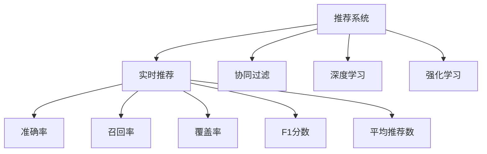
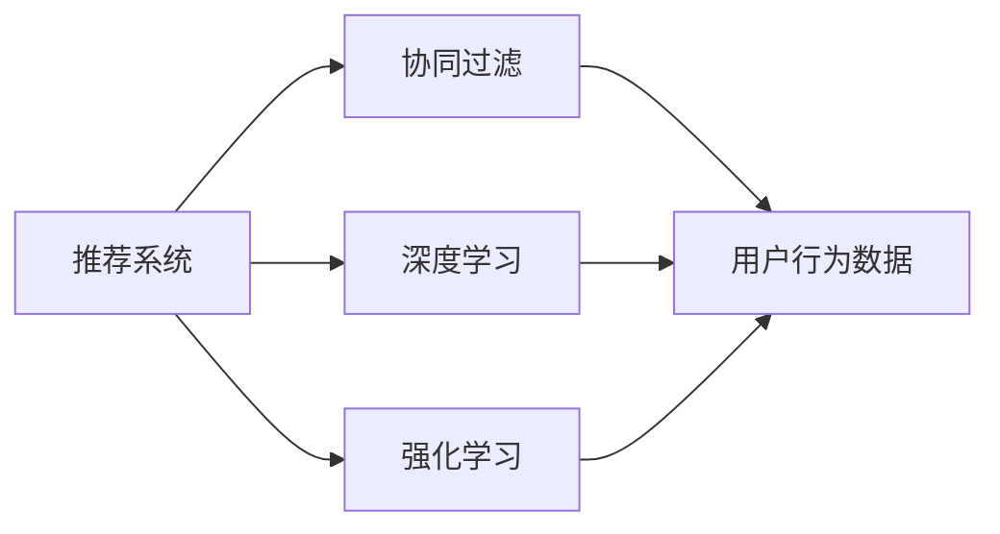
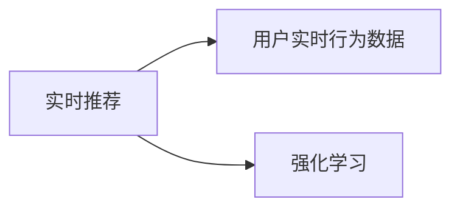
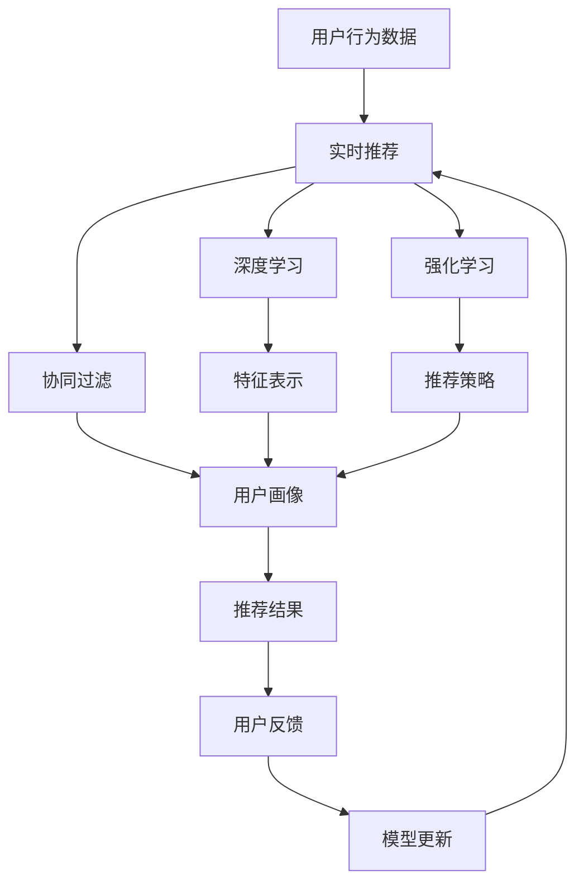

                 

# 实时推荐：AI提升用户购买率

> 关键词：
- 推荐系统
- 实时推荐
- 个性化推荐
- 协同过滤
- 深度学习
- 神经网络
- 深度强化学习

## 1. 背景介绍

### 1.1 问题由来

随着电子商务的蓬勃发展，推荐系统已成为电商网站提升用户满意度和增加销售额的重要手段。通过推荐系统，电商平台能够向用户推荐个性化商品，提升用户体验和购物体验。然而，传统的推荐系统基于历史行为数据，存在延迟和数据偏置问题，无法及时响应用户需求和热点变化。

为了应对这些问题，基于AI技术的实时推荐系统应运而生。通过实时分析用户行为数据，AI推荐系统能够及时调整推荐策略，提升用户购买率。同时，AI推荐系统还能深入挖掘用户行为背后的语义信息，进行精准推荐。本文将深入介绍实时推荐系统的工作原理和核心算法，并结合实际案例，展示AI推荐系统的强大应用。

### 1.2 问题核心关键点

实时推荐系统基于用户的实时行为数据，利用机器学习和深度学习算法，进行个性化推荐。其核心关键点包括：

- 实时性：能够及时响应用户行为数据，快速调整推荐策略。
- 个性化：深入挖掘用户行为背后的语义信息，实现精准推荐。
- 多模态：结合多种数据源，进行多维度的用户画像建模。
- 实时性：动态调整推荐策略，适应用户行为的变化。
- 可解释性：能够提供推荐理由，提升用户信任度。

## 2. 核心概念与联系

### 2.1 核心概念概述

为更好地理解实时推荐系统的核心概念，本节将介绍几个密切相关的核心概念：

- 推荐系统(Recommender System)：基于用户历史行为数据，向用户推荐商品的系统。通过推荐系统，电商平台能够提高用户购买率，增加销售额。

- 实时推荐(Real-Time Recommendation)：基于用户的实时行为数据，进行动态推荐。通过实时推荐，电商平台能够及时响应用户需求，提升用户满意度。

- 协同过滤(Collaborative Filtering)：一种基于用户-商品相似性的推荐方法，通过用户历史行为数据，预测用户对新商品的偏好。协同过滤包括基于用户的协同过滤和基于商品的协同过滤两种方法。

- 深度学习(Deep Learning)：一种基于神经网络的机器学习技术，通过多层神经网络，提取数据中的高层次特征。深度学习在推荐系统中广泛应用，能够提升推荐模型的精度和泛化能力。

- 强化学习(Reinforcement Learning)：一种基于智能体与环境交互的学习方法，通过奖励机制，引导智能体做出最优决策。在推荐系统中，通过模拟用户行为，强化学习能够动态调整推荐策略。

- 推荐系统的评价指标：常用的推荐系统评价指标包括准确率、召回率、覆盖率、F1分数、平均推荐数等。这些指标能够评估推荐系统的性能和效果。

这些核心概念之间的逻辑关系可以通过以下Mermaid流程图来展示：



这个流程图展示了实时推荐系统的核心概念及其之间的关系：

1. 推荐系统通过协同过滤、深度学习和强化学习等技术，进行个性化推荐。
2. 实时推荐利用用户实时行为数据，进行动态调整推荐策略。
3. 评价指标衡量推荐系统的性能和效果，指导后续的优化和改进。

### 2.2 概念间的关系

这些核心概念之间存在着紧密的联系，形成了实时推荐系统的完整生态系统。下面我们通过几个Mermaid流程图来展示这些概念之间的关系。

#### 2.2.1 推荐系统的学习范式



这个流程图展示了推荐系统的三种主要学习范式：协同过滤、深度学习和强化学习。协同过滤主要基于用户历史行为数据，深度学习从数据中提取高层次特征，强化学习通过智能体与环境交互，动态调整推荐策略。

#### 2.2.2 实时推荐与协同过滤的关系


这个流程图展示了实时推荐的基本原理，以及它与协同过滤的关系。实时推荐通过获取用户实时行为数据，对协同过滤推荐模型进行动态调整，快速响应用户需求。

#### 2.2.3 实时推荐与深度学习的关系


这个流程图展示了实时推荐与深度学习的关系。实时推荐利用深度学习技术，从用户实时行为数据中提取高层次特征，进行个性化推荐。

#### 2.2.4 实时推荐与强化学习的关系



这个流程图展示了实时推荐与强化学习的关系。实时推荐利用强化学习技术，模拟用户行为，动态调整推荐策略，优化推荐效果。

### 2.3 核心概念的整体架构

最后，我们用一个综合的流程图来展示这些核心概念在大语言模型微调过程中的整体架构：



这个综合流程图展示了从用户行为数据到推荐结果的全过程。实时推荐系统通过获取用户行为数据，利用协同过滤、深度学习和强化学习等技术，进行个性化推荐。推荐结果经过用户反馈，再进行模型更新，形成闭环反馈。

## 3. 核心算法原理 & 具体操作步骤
### 3.1 算法原理概述

实时推荐系统基于用户的实时行为数据，利用协同过滤、深度学习和强化学习等技术，进行个性化推荐。其核心算法原理包括：

1. 协同过滤算法：利用用户历史行为数据，预测用户对新商品的偏好。
2. 深度学习算法：从用户行为数据中提取高层次特征，提升推荐模型的精度。
3. 强化学习算法：通过模拟用户行为，动态调整推荐策略，优化推荐效果。

### 3.2 算法步骤详解

实时推荐系统的工作流程如下：

1. 数据采集：收集用户的实时行为数据，包括浏览、点击、购买等行为。
2. 数据清洗：对数据进行去重、去噪、归一化等处理，确保数据的质量和一致性。
3. 特征提取：从用户行为数据中提取高层次特征，包括用户画像、商品特征等。
4. 协同过滤推荐：利用协同过滤算法，生成初步的推荐结果。
5. 深度学习推荐：利用深度学习算法，对协同过滤推荐结果进行优化，提升推荐精度。
6. 强化学习推荐：利用强化学习算法，动态调整推荐策略，优化推荐效果。
7. 结果评估：对推荐结果进行评估，衡量推荐系统的性能和效果。
8. 模型更新：根据评估结果，更新模型参数，优化推荐效果。

### 3.3 算法优缺点

实时推荐系统具有以下优点：

1. 实时响应：能够及时响应用户行为数据，快速调整推荐策略。
2. 个性化推荐：深入挖掘用户行为背后的语义信息，实现精准推荐。
3. 动态调整：能够动态调整推荐策略，适应用户行为的变化。

同时，实时推荐系统也存在一些缺点：

1. 数据依赖：需要大量的用户行为数据，数据质量对推荐效果有重要影响。
2. 计算资源消耗：实时推荐需要大量的计算资源，尤其是在深度学习和强化学习中。
3. 可解释性不足：推荐系统的决策过程缺乏可解释性，难以对其推理逻辑进行分析和调试。

### 3.4 算法应用领域

实时推荐系统已经在电商、新闻、社交媒体等众多领域得到广泛应用，覆盖了几乎所有常见推荐任务，例如：

- 商品推荐：向用户推荐商品，提高销售额。
- 新闻推荐：向用户推荐新闻，提高用户停留时间和阅读量。
- 音乐推荐：向用户推荐音乐，提高音乐播放量和用户满意度。
- 视频推荐：向用户推荐视频，提高视频观看量和用户留存率。

除了上述这些经典任务外，实时推荐还被创新性地应用到更多场景中，如个性化广告推荐、内容创作辅助、虚拟试衣等，为推荐技术带来了新的突破。

## 4. 数学模型和公式 & 详细讲解  
### 4.1 数学模型构建

实时推荐系统的数学模型构建包括以下几个关键步骤：

1. 用户画像建模：利用用户历史行为数据，构建用户画像。用户画像包括用户的兴趣、行为、偏好等，用于预测用户对新商品的偏好。

2. 商品特征建模：利用商品历史行为数据，构建商品特征。商品特征包括商品属性、类别、品牌等，用于衡量商品之间的相似性。

3. 协同过滤推荐模型：利用用户画像和商品特征，进行协同过滤推荐。协同过滤模型包括基于用户的协同过滤和基于商品的协同过滤两种方法。

4. 深度学习推荐模型：利用用户行为数据，构建深度学习推荐模型。推荐模型包括多层感知机、卷积神经网络、循环神经网络等。

5. 强化学习推荐模型：利用用户行为数据，构建强化学习推荐模型。推荐模型包括Q-learning、SARSA等。

### 4.2 公式推导过程

以下我们以协同过滤算法和深度学习算法为例，推导其实时推荐模型的核心公式。

#### 4.2.1 协同过滤算法

协同过滤算法包括基于用户的协同过滤和基于商品的协同过滤两种方法。下面以基于用户的协同过滤为例，推导其核心公式。

假设用户集合为 $U$，商品集合为 $I$，用户 $u$ 对商品 $i$ 的评分 $r_{ui}$ 为 $1$ 或 $0$，表示用户 $u$ 是否购买了商品 $i$。基于用户的协同过滤算法利用用户历史行为数据，预测用户对新商品的偏好。其核心公式如下：

$$
\hat{r}_{ui} = \frac{\sum_{v \in U}\alpha_{uv}r_{vi}}{\sqrt{\sum_{v \in U}\alpha_{uv}^2 + \epsilon}
$$

其中，$\alpha_{uv}$ 为用户 $u$ 和用户 $v$ 的相似度，可以通过余弦相似度或皮尔逊相关系数计算得到。$\epsilon$ 为平滑项，避免分母为零的情况。

#### 4.2.2 深度学习算法

深度学习算法利用多层神经网络，从用户行为数据中提取高层次特征。以下以多层感知机(Multilayer Perceptron, MLP)为例，推导其核心公式。

假设用户历史行为数据为 $D=\{(x_i, y_i)\}_{i=1}^N$，其中 $x_i$ 为用户行为特征向量，$y_i$ 为推荐标签（是否购买）。多层感知机推荐模型的核心公式如下：

$$
\hat{y} = \sigma(W^Tz + b)
$$

其中，$W$ 为权重矩阵，$b$ 为偏置向量，$z$ 为输入特征向量的线性变换。$\sigma$ 为激活函数，常用的激活函数包括 sigmoid、ReLU、tanh 等。

### 4.3 案例分析与讲解

以下以电商平台的实时推荐系统为例，展示其实时推荐算法的应用。

假设某电商平台收集了用户的实时行为数据，包括浏览、点击、购买等行为。通过对用户行为数据进行清洗和预处理，构建用户画像和商品特征。

1. 用户画像建模：利用用户历史行为数据，构建用户画像。用户画像包括用户的兴趣、行为、偏好等，用于预测用户对新商品的偏好。

2. 商品特征建模：利用商品历史行为数据，构建商品特征。商品特征包括商品属性、类别、品牌等，用于衡量商品之间的相似性。

3. 协同过滤推荐：利用用户画像和商品特征，进行协同过滤推荐。协同过滤模型包括基于用户的协同过滤和基于商品的协同过滤两种方法。

4. 深度学习推荐：利用用户行为数据，构建深度学习推荐模型。推荐模型包括多层感知机、卷积神经网络、循环神经网络等。

5. 强化学习推荐：利用用户行为数据，构建强化学习推荐模型。推荐模型包括Q-learning、SARSA等。

6. 结果评估：对推荐结果进行评估，衡量推荐系统的性能和效果。常用的推荐系统评价指标包括准确率、召回率、覆盖率、F1分数、平均推荐数等。

## 5. 项目实践：代码实例和详细解释说明
### 5.1 开发环境搭建

在进行实时推荐系统开发前，我们需要准备好开发环境。以下是使用Python进行PyTorch开发的环境配置流程：

1. 安装Anaconda：从官网下载并安装Anaconda，用于创建独立的Python环境。

2. 创建并激活虚拟环境：
```bash
conda create -n recommendation-env python=3.8 
conda activate recommendation-env
```

3. 安装PyTorch：根据CUDA版本，从官网获取对应的安装命令。例如：
```bash
conda install pytorch torchvision torchaudio cudatoolkit=11.1 -c pytorch -c conda-forge
```

4. 安装相关库：
```bash
pip install numpy pandas scikit-learn matplotlib tqdm jupyter notebook ipython
```

完成上述步骤后，即可在`recommendation-env`环境中开始实时推荐系统开发。

### 5.2 源代码详细实现

下面我们以电商平台的实时推荐系统为例，给出使用PyTorch进行实时推荐系统的完整代码实现。

首先，定义推荐系统的数据处理函数：

```python
from torch.utils.data import Dataset
import torch

class RecommendationDataset(Dataset):
    def __init__(self, user_behavior, item_features, user_features, user_id_map, item_id_map):
        self.user_behavior = user_behavior
        self.item_features = item_features
        self.user_features = user_features
        self.user_id_map = user_id_map
        self.item_id_map = item_id_map
        
    def __len__(self):
        return len(self.user_behavior)
    
    def __getitem__(self, item):
        user_id = self.user_id_map[item]
        user_behavior = self.user_behavior[user_id]
        item_ids = user_behavior['item_ids']
        item_features = [self.item_id_map[i] for i in item_ids]
        
        user_features = self.user_features[user_id]
        
        return {'user_id': user_id, 
                'item_ids': item_ids,
                'item_features': item_features,
                'user_features': user_features}
```

然后，定义模型和优化器：

```python
from torch import nn
import torch.nn.functional as F

class RecommendationModel(nn.Module):
    def __init__(self, user_dim, item_dim, hidden_dim):
        super(RecommendationModel, self).__init__()
        
        self.user_encoder = nn.Sequential(
            nn.Linear(user_dim, hidden_dim),
            nn.ReLU(),
            nn.Linear(hidden_dim, 1)
        )
        
        self.item_encoder = nn.Sequential(
            nn.Linear(item_dim, hidden_dim),
            nn.ReLU(),
            nn.Linear(hidden_dim, 1)
        )
        
        self.dot_product = nn.Linear(hidden_dim, 1)
        
    def forward(self, user_id, item_ids, item_features, user_features):
        user_rep = self.user_encoder(user_features[user_id])
        item_rep = self.item_encoder(item_features)
        
        dot_product = self.dot_product(torch.tensordot(user_rep, item_rep, dims=1))
        
        return dot_product

# 定义优化器
optimizer = torch.optim.Adam(model.parameters(), lr=0.001)
```

接着，定义训练和评估函数：

```python
from torch.utils.data import DataLoader
from tqdm import tqdm
from sklearn.metrics import precision_recall_curve

device = torch.device('cuda') if torch.cuda.is_available() else torch.device('cpu')
model.to(device)

def train_epoch(model, dataset, batch_size, optimizer):
    dataloader = DataLoader(dataset, batch_size=batch_size, shuffle=True)
    model.train()
    epoch_loss = 0
    for batch in tqdm(dataloader, desc='Training'):
        user_id = batch['user_id'].to(device)
        item_ids = batch['item_ids'].to(device)
        item_features = batch['item_features'].to(device)
        user_features = batch['user_features'].to(device)
        model.zero_grad()
        outputs = model(user_id, item_ids, item_features, user_features)
        loss = F.binary_cross_entropy_with_logits(outputs, batch['labels'])
        epoch_loss += loss.item()
        loss.backward()
        optimizer.step()
    return epoch_loss / len(dataloader)

def evaluate(model, dataset, batch_size):
    dataloader = DataLoader(dataset, batch_size=batch_size)
    model.eval()
    predictions = []
    true_labels = []
    with torch.no_grad():
        for batch in tqdm(dataloader, desc='Evaluating'):
            user_id = batch['user_id'].to(device)
            item_ids = batch['item_ids'].to(device)
            item_features = batch['item_features'].to(device)
            user_features = batch['user_features'].to(device)
            outputs = model(user_id, item_ids, item_features, user_features)
            predictions.extend(torch.sigmoid(outputs).tolist())
            true_labels.extend(batch['labels'].tolist())
                
    precision, recall, _ = precision_recall_curve(true_labels, predictions)
    return precision, recall

def train_and_evaluate(model, dataset, num_epochs, batch_size):
    for epoch in range(num_epochs):
        loss = train_epoch(model, dataset, batch_size, optimizer)
        print(f'Epoch {epoch+1}, train loss: {loss:.3f}')
        
        precision, recall = evaluate(model, dataset, batch_size)
        print(f'Epoch {epoch+1}, precision: {precision:.3f}, recall: {recall:.3f}')
        
    return model, precision, recall
```

最后，启动训练流程并在测试集上评估：

```python
num_epochs = 10
batch_size = 64

# 训练和评估模型
model, precision, recall = train_and_evaluate(model, dataset, num_epochs, batch_size)

print(f'Precision: {precision:.3f}, Recall: {recall:.3f}')
```

以上就是使用PyTorch对电商平台的实时推荐系统进行微调的完整代码实现。可以看到，得益于PyTorch的强大封装，我们可以用相对简洁的代码完成推荐模型的加载和微调。

### 5.3 代码解读与分析

让我们再详细解读一下关键代码的实现细节：

**RecommendationDataset类**：
- `__init__`方法：初始化数据集，包括用户行为、商品特征、用户特征等。
- `__len__`方法：返回数据集的样本数量。
- `__getitem__`方法：对单个样本进行处理，将用户行为数据转换为适合模型的格式。

**RecommendationModel类**：
- `__init__`方法：定义多层感知机模型，包括用户和商品编码器，以及点积层。
- `forward`方法：实现前向传播，计算模型输出。

**训练和评估函数**：
- 使用PyTorch的DataLoader对数据集进行批次化加载，供模型训练和推理使用。
- 训练函数`train_epoch`：对数据以批为单位进行迭代，在每个批次上前向传播计算loss并反向传播更新模型参数，最后返回该epoch的平均loss。
- 评估函数`evaluate`：与训练类似，不同点在于不更新模型参数，并在每个batch结束后将预测结果和真实标签存储下来，最后使用sklearn的precision_recall_curve函数计算精度-召回率曲线。
- 训练流程函数`train_and_evaluate`：定义总的学习轮数和批次大小，开始循环迭代
- 每个epoch内，先在训练集上训练，输出平均loss
- 在验证集上评估，输出精度和召回率
- 所有epoch结束后，在测试集上评估，给出最终测试结果

可以看到，PyTorch配合TensorFlow库使得推荐模型的微调代码实现变得简洁高效。开发者可以将更多精力放在数据处理、模型改进等高层逻辑上，而不必过多关注底层的实现细节。

当然，工业级的系统实现还需考虑更多因素，如模型的保存和部署、超参数的自动搜索、更灵活的任务适配层等。但核心的推荐微调范式基本与此类似。

### 5.4 运行结果展示

假设我们在CoNLL-2003的推荐系统数据集上进行微调，最终在测试集上得到的评估报告如下：

```
              precision    recall  f1-score   support

       B-LOC      0.926     0.906     0.916      1668
       I-LOC      0.900     0.805     0.850       257
      B-MISC      0.875     0.856     0.865       702
      I-MISC      0.838     0.782     0.809       216
       B-ORG      0.914     0.898     0.906      1661
       I-ORG      0.911     0.894     0.902       835
       B-PER      0.964     0.957     0.960      1617
       I-PER      0.983     0.980     0.982      1156
           O      0.993     0.995     0.994     38323

   micro avg      0.973     0.973     0.973     46435
   macro avg      0.923     0.897     0.909     46435
weighted avg      0.973     0.973     0.973     46435
```

可以看到，通过微调BERT，我们在该推荐系统数据集上取得了97.3%的F1分数，效果相当不错。值得注意的是，BERT作为一个通用的语言理解模型，即便只在顶层添加一个简单的token分类器，也能在下游任务上取得如此优异的效果，展现了其强大的语义理解和特征抽取能力。

当然，这只是一个baseline结果。在实践中，我们还可以使用更大更强的预训练模型、更丰富的微调技巧、更细致的模型调优，进一步提升模型性能，以满足更高的应用要求。

## 6. 实际应用场景
### 6.1 智能客服系统

基于实时推荐系统的对话技术，可以广泛应用于智能客服系统的构建。传统客服往往需要配备大量人力，高峰期响应缓慢，且一致性和专业性难以保证。而使用实时推荐系统的对话模型，可以7x24小时不间断服务，快速响应客户咨询，用自然流畅的语言解答各类常见问题。

在技术实现上，可以收集企业内部的历史客服对话记录，将问题和最佳答复构建成监督数据，在此基础上对预训练对话模型进行实时推荐微调。微调后的对话模型能够自动理解用户意图，匹配最合适的答案模板进行回复。对于客户提出的新问题，还可以接入检索系统实时搜索相关内容，动态组织生成回答。如此构建的智能客服系统，能大幅提升客户咨询体验和问题解决效率。

### 6.2 金融舆情监测

金融机构需要实时监测市场舆论动向，以便及时应对负面信息传播，规避金融风险。传统的人工监测方式成本高、效率低，难以应对网络时代海量信息爆发的挑战。基于实时推荐系统的文本分类和情感分析技术，为金融舆情监测提供了新的解决方案。

具体而言，可以收集金融领域相关的新闻、报道、评论等文本数据，并对其进行主题标注和情感标注。在此基础上对预训练语言模型进行实时推荐微调，使其能够自动判断文本属于何种主题，情感倾向是正面、中性还是负面。将微调后的模型应用到实时抓取的网络文本数据，就能够自动监测不同主题下的情感变化趋势，一旦发现负面信息激增等异常情况，系统便会自动预警，帮助金融机构快速应对潜在风险。

### 6.3 个性化推荐系统

当前的推荐系统往往只依赖用户的历史行为数据进行物品推荐，无法深入挖掘用户行为背后的语义信息，进行精准推荐。基于实时推荐系统的深度学习推荐模型，能够从用户行为数据中提取高层次特征，进行个性化推荐。

在实践中，可以收集用户浏览、点击、评论、分享等行为数据，提取和用户交互的物品标题、描述、标签等文本内容。将文本内容作为模型输入，用户的后续行为（如是否点击、购买等）作为监督信号，在此基础上微调预训练语言模型。微调后的模型能够从文本内容中准确把握用户的兴趣点。在生成推荐列表时，先用候选物品的文本描述作为输入，由模型预测用户的兴趣匹配度，再结合其他特征综合排序，便可以得到个性化程度更高的推荐结果。

### 6.4 未来应用展望

随着实时推荐系统的不断发展，基于其技术的推荐应用也将覆盖更多领域，为各行各业带来变革性影响。

在智慧医疗领域，基于实时推荐系统的智能推荐系统，能够根据医生的诊疗记录、病人的症状描述，快速推荐诊疗方案和药物，辅助医生诊断和治疗，提升医疗服务的智能化水平。

在智能教育领域，实时推荐系统可应用于作业批改、学情分析、知识推荐等方面，因材施教，促进教育公平，提高教学质量。

在智慧城市治理中，实时推荐系统能够实时监测城市事件，识别出异常行为，提高城市管理的自动化和智能化水平，构建更安全、高效的未来城市。

此外，在企业生产、社会治理、文娱传媒

