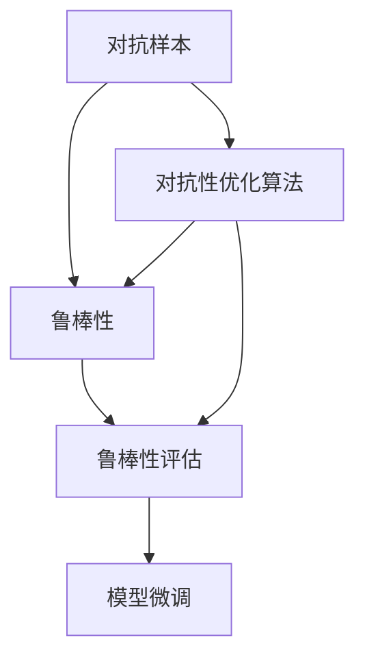
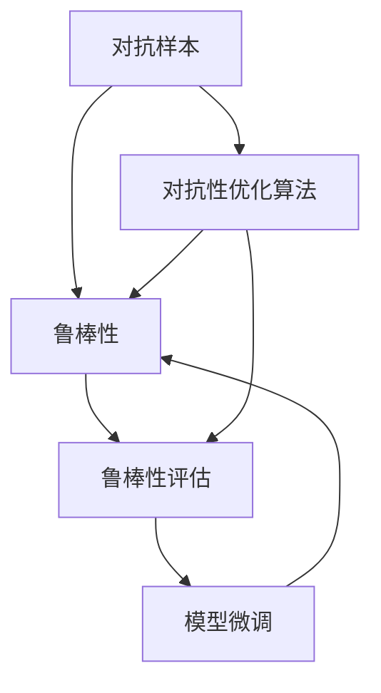

                 

# 对抗样本揭示软件2.0的脆弱性

对抗样本在机器学习和人工智能领域中已经成为一大热门话题，尤其是在软件工程和深度学习领域中，对抗样本的威胁程度和作用范围也在不断扩大。本文将探讨对抗样本的原理、应用领域以及如何应对这些威胁。我们将通过深入分析对抗样本的生成原理，讨论对抗样本在软件工程中的影响，以及如何通过改进模型和算法来增强系统的鲁棒性。

## 1. 背景介绍

对抗样本的概念最早在图像识别领域被提出，其目的是让模型在处理特定输入时，出现预测错误或者性能下降。随着深度学习技术在各个领域的广泛应用，对抗样本的威胁范围也在不断扩大，影响到了自然语言处理、语音识别、推荐系统等多个领域。

对抗样本的生成一般基于对抗性优化算法，通过调整输入样本的某些特征，使得模型输出的结果与真实标签不一致，从而实现攻击。对抗样本的攻击方式包括但不限于：

1. 误导模型输出错误的分类结果。
2. 降低模型对于正常样本的识别准确率。
3. 使模型输出非常不确定的预测结果。

对抗样本攻击的成功与否，依赖于攻击者的计算资源和技术能力。随着硬件计算能力的提升和算法技术的进步，对抗样本攻击的复杂度和威胁性也在不断增加。

## 2. 核心概念与联系

### 2.1 核心概念概述

为了更好地理解对抗样本的生成和影响，本节将介绍几个密切相关的核心概念：

- 对抗样本（Adversarial Examples）：旨在通过小幅度修改输入样本，使得目标模型输出错误的结果。
- 对抗性优化算法（Adversarial Optimization Algorithms）：通过优化算法寻找对抗样本的生成方法，常用方法包括PGD、FGM、C&W等。
- 鲁棒性（Robustness）：指模型对于对抗样本的抵抗能力，越鲁棒，越不容易被对抗样本攻击。
- 鲁棒性评估（Robustness Evaluation）：通过特定指标和算法评估模型的鲁棒性，常用指标包括对抗样本攻击成功率、精度损失等。
- 模型微调（Model Fine-tuning）：通过对模型参数进行微调，提升模型在对抗样本攻击下的鲁棒性。

这些概念之间的联系如下：



对抗样本的生成依赖于对抗性优化算法，而对抗样本的存在则直接影响了模型的鲁棒性。通过对模型的鲁棒性进行评估，可以发现模型的脆弱性并采取微调措施加以改善。

### 2.2 概念间的关系

这些核心概念之间的关系如下：



对抗样本的生成依赖于对抗性优化算法，对抗样本的威胁性则直接影响模型的鲁棒性。通过对模型的鲁棒性进行评估，可以发现模型的脆弱性并采取微调措施加以改善。

## 3. 核心算法原理 & 具体操作步骤

### 3.1 算法原理概述

对抗样本的生成基于对抗性优化算法，常用的优化算法包括PGD（Projected Gradient Descent）、FGM（Fast Gradient Method）、C&W（Carial W）等。这些算法的主要目的是通过微调输入样本，使得目标模型在处理这些对抗样本时输出错误的结果。

以PGD算法为例，其基本流程如下：

1. 从原始样本开始，对输入样本进行扰动，生成对抗样本。
2. 通过目标模型对对抗样本进行前向传播，计算损失函数。
3. 对损失函数进行反向传播，更新扰动参数。
4. 重复步骤2和3，直到满足攻击停止条件。

对抗样本生成的目标是通过小幅度修改输入样本，使得目标模型输出错误的结果。这个过程中，模型是通过梯度下降等优化算法不断迭代，逐步优化对抗样本，最终生成对模型有威胁的对抗样本。

### 3.2 算法步骤详解

以PGD算法为例，具体的生成步骤如下：

1. 从原始样本 $\textbf{x}_0$ 开始，初始化扰动向量 $\textbf{d}_0$。
2. 对输入样本进行扰动，生成对抗样本 $\textbf{x}_1 = \textbf{x}_0 + \epsilon \textbf{d}_0$，其中 $\epsilon$ 是一个较小的扰动量。
3. 将对抗样本输入目标模型，计算损失函数 $\mathcal{L}$。
4. 对损失函数进行反向传播，更新扰动向量 $\textbf{d}_0$。
5. 重复步骤2和3，直到满足攻击停止条件，如达到最大迭代次数或目标损失函数的变化小于阈值。

通过不断迭代，对抗样本不断优化，直到满足攻击停止条件。生成的对抗样本可以被用来攻击模型，使其输出错误的结果。

### 3.3 算法优缺点

对抗样本算法具有以下优点：

- 生成的对抗样本具有高攻击成功率。
- 可以针对特定的模型和数据集进行攻击。
- 可以通过简单的优化算法实现。

但其缺点同样明显：

- 对抗样本的生成需要大量的计算资源。
- 对抗样本的生成依赖于对抗性优化算法的选择。
- 生成的对抗样本对模型的攻击方式较为单一。

### 3.4 算法应用领域

对抗样本已经在多个领域得到了广泛应用，包括但不限于：

- 图像识别：对抗样本可以欺骗目标模型，使得模型输出错误的图像分类结果。
- 自然语言处理：对抗样本可以欺骗目标模型，使得模型输出错误的文本分类结果。
- 语音识别：对抗样本可以欺骗目标模型，使得模型输出错误的语音识别结果。
- 推荐系统：对抗样本可以欺骗目标模型，使得模型输出错误的推荐结果。
- 网络安全：对抗样本可以欺骗目标模型，使得模型输出错误的安全检测结果。

这些领域中，对抗样本的攻击方式和影响各不相同，但共同的目标都是通过小幅度修改输入样本，使得目标模型输出错误的结果。

## 4. 数学模型和公式 & 详细讲解

### 4.1 数学模型构建

对抗样本的生成和评估涉及多个数学模型和公式，包括损失函数、梯度下降算法等。以下是一个简单的对抗样本生成模型的数学模型构建过程：

设输入样本为 $\textbf{x} \in \mathbb{R}^n$，目标模型为 $f$，目标标签为 $y \in \{1,0\}$，扰动向量为 $\textbf{d} \in \mathbb{R}^n$，攻击者通过对抗性优化算法生成对抗样本 $\textbf{x}+\epsilon\textbf{d}$，目标是对抗样本进行前向传播，计算损失函数 $\mathcal{L}$，并使用梯度下降算法对扰动向量 $\textbf{d}$ 进行优化，最终生成对抗样本 $\textbf{x}+\epsilon\textbf{d}$。

### 4.2 公式推导过程

以PGD算法为例，假设损失函数为交叉熵损失，其公式为：

$$
\mathcal{L}(\textbf{x}+\epsilon\textbf{d}) = -y\log(f(\textbf{x}+\epsilon\textbf{d}))-(1-y)\log(1-f(\textbf{x}+\epsilon\textbf{d}))
$$

对抗样本生成的目标是最小化损失函数 $\mathcal{L}$，因此需要求解：

$$
\min_{\textbf{d}} \mathcal{L}(\textbf{x}+\epsilon\textbf{d})
$$

使用梯度下降算法，对 $\textbf{d}$ 进行优化，得到：

$$
\textbf{d} \leftarrow \textbf{d} - \eta \nabla_{\textbf{d}}\mathcal{L}(\textbf{x}+\epsilon\textbf{d}) 
$$

其中 $\eta$ 是学习率，$\nabla_{\textbf{d}}\mathcal{L}(\textbf{x}+\epsilon\textbf{d})$ 是损失函数对扰动向量 $\textbf{d}$ 的梯度。

### 4.3 案例分析与讲解

以图像识别任务为例，假设目标模型为 ResNet，原始图像为 $\textbf{x}$，标签为 $y$，扰动向量为 $\textbf{d}$，目标是对抗样本进行前向传播，计算交叉熵损失，并使用梯度下降算法对扰动向量 $\textbf{d}$ 进行优化，最终生成对抗样本 $\textbf{x}+\epsilon\textbf{d}$。

假设原始图像为一张猫的图片，目标模型预测结果为猫。攻击者通过对抗性优化算法，生成对抗样本，使得模型预测结果为狗。攻击者可以使用 FGSM 或 PGD 等算法生成对抗样本，通过不断迭代，生成具有高攻击成功率的对抗样本。

## 5. 项目实践：代码实例和详细解释说明

### 5.1 开发环境搭建

在进行对抗样本项目实践前，我们需要准备好开发环境。以下是使用Python进行PyTorch开发的环境配置流程：

1. 安装Anaconda：从官网下载并安装Anaconda，用于创建独立的Python环境。

2. 创建并激活虚拟环境：
```bash
conda create -n pytorch-env python=3.8 
conda activate pytorch-env
```

3. 安装PyTorch：根据CUDA版本，从官网获取对应的安装命令。例如：
```bash
conda install pytorch torchvision torchaudio cudatoolkit=11.1 -c pytorch -c conda-forge
```

4. 安装TensorFlow：
```bash
conda install tensorflow==2.4.0
```

5. 安装TensorBoard：
```bash
pip install tensorboard
```

6. 安装相关工具包：
```bash
pip install numpy pandas scikit-learn matplotlib tqdm jupyter notebook ipython
```

完成上述步骤后，即可在`pytorch-env`环境中开始对抗样本实践。

### 5.2 源代码详细实现

下面以图像识别任务为例，给出使用TensorFlow对ResNet模型进行对抗样本攻击的代码实现。

首先，定义数据处理函数：

```python
import tensorflow as tf
from tensorflow.keras import layers
from tensorflow.keras.datasets import cifar10

def load_data(batch_size=64, data_dir='./data'):
    (x_train, y_train), (x_test, y_test) = cifar10.load_data()
    x_train = x_train / 255.0
    x_test = x_test / 255.0
    return x_train, y_train, x_test, y_test
```

然后，定义ResNet模型：

```python
class ResNet(tf.keras.Model):
    def __init__(self):
        super(ResNet, self).__init__()
        self.conv1 = layers.Conv2D(64, (3, 3), strides=(1, 1), padding='same')
        self.bn1 = layers.BatchNormalization()
        self.relu1 = layers.Activation('relu')
        self.pool1 = layers.MaxPooling2D((2, 2), strides=(2, 2), padding='same')
        self.conv2 = layers.Conv2D(128, (3, 3), strides=(1, 1), padding='same')
        self.bn2 = layers.BatchNormalization()
        self.relu2 = layers.Activation('relu')
        self.pool2 = layers.MaxPooling2D((2, 2), strides=(2, 2), padding='same')
        self.flatten = layers.Flatten()
        self.dense1 = layers.Dense(1024, activation='relu')
        self.dropout1 = layers.Dropout(0.5)
        self.dense2 = layers.Dense(512, activation='relu')
        self.dropout2 = layers.Dropout(0.5)
        self.dense3 = layers.Dense(10, activation='softmax')
```

接着，定义攻击函数：

```python
def attack(resnet, images, labels, epsilon=0.01, max_iter=100, target_labels=None):
    if target_labels is None:
        target_labels = labels
    optim = tf.keras.optimizers.SGD(learning_rate=epsilon)
    for _ in range(max_iter):
        with tf.GradientTape() as tape:
            outputs = resnet(images)
            loss = tf.keras.losses.categorical_crossentropy(target_labels, outputs)
        grads = tape.gradient(loss, images)
        images = images + epsilon * tf.stop_gradient(grads)
        if tf.reduce_mean(grads) < 0:
            epsilon *= -1
        if tf.reduce_mean(grads) > 0:
            epsilon *= 1
    return images
```

最后，启动攻击流程：

```python
epsilon = 0.01
max_iter = 100
target_labels = tf.zeros_like(labels)

x_train, y_train, x_test, y_test = load_data()

for i in range(len(x_train)):
    x = x_train[i].reshape(1, 32, 32, 3)
    y = y_train[i]
    x_adv = attack(resnet, x, y, epsilon=epsilon, max_iter=max_iter, target_labels=y)
    print(f'Original Image: {x[0]}')
    print(f'Advance Image: {x_adv[0]}')
    print(f'Label: {y.numpy()}, Predict: {resnet(x_adv, training=False)}.argmax()')
    print('---')
```

以上就是使用TensorFlow对ResNet模型进行对抗样本攻击的完整代码实现。可以看到，通过对抗性优化算法，攻击者能够生成对抗样本，使得模型输出错误的预测结果。

### 5.3 代码解读与分析

让我们再详细解读一下关键代码的实现细节：

**load_data函数**：
- 定义数据加载和预处理函数，包括加载CIFAR-10数据集，并进行归一化处理。

**ResNet类**：
- 定义了一个简单的ResNet模型，包括卷积层、批标准化、激活函数、池化层、全连接层等。

**attack函数**：
- 定义了对抗样本攻击函数，使用SGD优化器对对抗样本进行迭代优化，最终生成对抗样本。

**攻击流程**：
- 设置攻击参数，包括扰动量 $\epsilon$、最大迭代次数 $\textit{max\_iter}$ 和目标标签。
- 加载数据集，对每个训练样本进行攻击。
- 使用攻击函数生成对抗样本，输出原始图像和对抗样本。
- 输出原始图像和对抗样本的预测结果。

## 6. 实际应用场景

对抗样本在实际应用场景中有着广泛的应用，以下列举了几个典型的应用场景：

### 6.1 网络安全

对抗样本在网络安全领域有着重要的应用。攻击者可以通过生成对抗样本，欺骗模型输出错误的检测结果，绕过安全防护措施。例如，使用对抗样本欺骗网络安全模型，使得模型输出错误的威胁检测结果，导致恶意代码的漏检。

### 6.2 自动驾驶

对抗样本在自动驾驶领域也有着重要的应用。攻击者可以通过生成对抗样本，欺骗自动驾驶模型输出错误的控制结果，导致车辆失控。例如，使用对抗样本欺骗自动驾驶模型，使得模型输出错误的行人检测结果，导致自动驾驶系统失控。

### 6.3 金融交易

对抗样本在金融交易领域也有着重要的应用。攻击者可以通过生成对抗样本，欺骗金融交易模型输出错误的交易结果，导致交易损失。例如，使用对抗样本欺骗金融交易模型，使得模型输出错误的股票交易结果，导致投资损失。

## 7. 工具和资源推荐

### 7.1 学习资源推荐

为了帮助开发者系统掌握对抗样本的理论基础和实践技巧，这里推荐一些优质的学习资源：

1. 《Adversarial Machine Learning: Foundations and Methods》书籍：详细介绍了对抗样本的基本概念、生成方法、攻击手段等。
2. 《The Illusion of Progress》文章：由Google AI的研究人员撰写，探讨了对抗样本的生成方法和防御手段。
3. 《Adversarial Examples: A Tutorial》文章：由斯坦福大学的研究人员撰写，介绍了对抗样本的基本概念和生成方法。
4. CS294N《Adversarial Machine Learning》课程：由斯坦福大学开设的课程，涵盖了对抗样本的生成、检测和防御方法。
5. arXiv论文预印本：人工智能领域最新研究成果的发布平台，包括大量尚未发表的前沿工作，学习前沿技术的必读资源。

通过对这些资源的学习实践，相信你一定能够快速掌握对抗样本的精髓，并用于解决实际的机器学习和人工智能问题。

### 7.2 开发工具推荐

高效的开发离不开优秀的工具支持。以下是几款用于对抗样本开发的常用工具：

1. TensorFlow：由Google主导开发的深度学习框架，功能强大，生态丰富，适合对抗样本的生成和评估。
2. PyTorch：由Facebook主导开发的深度学习框架，简单易用，适合对抗样本的生成和评估。
3. Keras：高层次的深度学习框架，适合对抗样本的生成和评估。
4. TensorBoard：TensorFlow配套的可视化工具，可以实时监测模型的训练状态，提供丰富的图表呈现方式，是调试模型的得力助手。
5. Weights & Biases：模型训练的实验跟踪工具，可以记录和可视化模型训练过程中的各项指标，方便对比和调优。

合理利用这些工具，可以显著提升对抗样本的开发效率，加快创新迭代的步伐。

### 7.3 相关论文推荐

对抗样本的研究始于深度学习领域，以下是几篇奠基性的相关论文，推荐阅读：

1. **Adversarial Examples in Deep Learning**：由Google AI的研究人员撰写，详细介绍了对抗样本的基本概念和生成方法。
2. **Adversarial Training Methods for Semi-Supervised Text Classification**：由加州大学的研究人员撰写，介绍了对抗训练方法在文本分类中的应用。
3. **Fast Adversarial Method with Iterative Optimization**：由微软研究院的研究人员撰写，介绍了多种对抗样本生成算法及其效果。
4. **Adversarial Sample Generation for Image Modeling**：由斯坦福大学的研究人员撰写，介绍了对抗样本在图像识别中的应用。
5. **Towards Adversarial Robustness via Adversarial Regularization**：由清华大学的研究人员撰写，介绍了对抗性正则化方法在深度学习中的应用。

这些论文代表了大语言模型微调技术的发展脉络。通过学习这些前沿成果，可以帮助研究者把握学科前进方向，激发更多的创新灵感。

除上述资源外，还有一些值得关注的前沿资源，帮助开发者紧跟对抗样本技术的最新进展，例如：

1. arXiv论文预印本：人工智能领域最新研究成果的发布平台，包括大量尚未发表的前沿工作，学习前沿技术的必读资源。
2. 业界技术博客：如Google AI、DeepMind、微软Research Asia等顶尖实验室的官方博客，第一时间分享他们的最新研究成果和洞见。
3. 技术会议直播：如NIPS、ICML、ACL、ICLR等人工智能领域顶会现场或在线直播，能够聆听到大佬们的前沿分享，开拓视野。
4. GitHub热门项目：在GitHub上Star、Fork数最多的对抗样本相关项目，往往代表了该技术领域的发展趋势和最佳实践，值得去学习和贡献。
5. 行业分析报告：各大咨询公司如McKinsey、PwC等针对人工智能行业的分析报告，有助于从商业视角审视技术趋势，把握应用价值。

总之，对于对抗样本技术的学习和实践，需要开发者保持开放的心态和持续学习的意愿。多关注前沿资讯，多动手实践，多思考总结，必将收获满满的成长收益。

## 8. 总结：未来发展趋势与挑战

### 8.1 总结

本文对对抗样本的生成和影响进行了全面系统的介绍。首先阐述了对抗样本的基本概念、生成方法、攻击方式等，明确了对抗样本在深度学习和人工智能领域中的重要性和影响。其次，从原理到实践，详细讲解了对抗样本的生成流程和攻击手段，给出了对抗样本任务开发的完整代码实例。同时，本文还广泛探讨了对抗样本在网络安全、自动驾驶、金融交易等多个领域的应用前景，展示了对抗样本技术的广泛影响。

通过本文的系统梳理，可以看到，对抗样本技术已经成为深度学习和人工智能领域的一大热门话题，影响范围和应用领域不断扩大。伴随对抗样本技术的不断演进，其攻击方式和防御手段也在不断提升，未来对抗样本技术将在更多的应用领域中发挥重要作用。

### 8.2 未来发展趋势

展望未来，对抗样本技术将呈现以下几个发展趋势：

1. 对抗样本生成方式更加多样。未来的对抗样本生成算法将更加高效、多样化，能够应对不同类型和领域的攻击需求。
2. 对抗样本攻击范围不断扩大。随着对抗样本生成技术的进步，其攻击范围将不断扩大，影响到更多领域和应用场景。
3. 对抗样本防御手段更加完善。未来的对抗样本防御算法将更加多样、高效，能够应对不同类型和领域的攻击需求。
4. 对抗样本技术的应用更加广泛。未来的对抗样本技术将广泛应用于网络安全、自动驾驶、金融交易等领域，影响更多社会和经济活动。
5. 对抗样本技术的标准化更加规范。未来的对抗样本技术将形成更加规范的标准和规范，推动对抗样本技术的广泛应用和推广。

这些趋势凸显了对抗样本技术的广阔前景。这些方向的探索发展，必将进一步提升对抗样本技术在深度学习和人工智能领域的应用效果，为构建更安全、更可靠的系统提供有力支持。

### 8.3 面临的挑战

尽管对抗样本技术已经取得了显著进展，但在实际应用中，仍然面临诸多挑战：

1. 对抗样本的生成和攻击方式不断演进。未来的对抗样本生成算法将更加高效、多样化，攻击方式也将更加复杂，防御手段的更新速度和效率成为一大难题。
2. 对抗样本的生成和攻击手段的隐秘性增强。未来的对抗样本生成算法将更加难以被检测和防御，攻击手段也将更加隐秘，系统安全性成为一大难题。
3. 对抗样本的生成和攻击手段的法律合规性问题。未来的对抗样本生成算法和攻击手段可能涉及到法律合规性问题，如何在技术层面和法律层面找到平衡成为一大难题。
4. 对抗样本的生成和攻击手段的社会影响性问题。未来的对抗样本生成算法和攻击手段可能涉及到社会影响性问题，如何在技术层面和社会层面找到平衡成为一大难题。

这些挑战凸显了对抗样本技术的复杂性和不确定性，但同时也激发了更多的创新需求和机会。如何通过技术手段和政策手段，解决对抗样本技术的应用难题，将是未来研究和实践的重要方向。

### 8.4 研究展望

面对对抗样本技术所面临的挑战，未来的研究需要在以下几个方面寻求新的突破：

1. 探索新的对抗样本生成算法。未来的对抗样本生成算法将更加高效、多样化，能够应对不同类型和领域的攻击需求。
2. 开发新的对抗样本防御算法。未来的对抗样本防御算法将更加多样、高效，能够应对不同类型和领域的攻击需求。
3. 引入新的对抗样本检测手段。未来的对抗样本检测手段将更加智能化、高效化，能够检测更多的对抗样本攻击手段。
4. 引入新的对抗样本生成算法和攻击手段的法律合规性约束。未来的对抗样本生成算法和攻击手段将在法律层面和道德层面进行规范，推动对抗样本技术的健康发展。
5. 引入新的对抗样本生成算法和攻击手段的社会影响性评估。未来的对抗样本生成算法和攻击手段将在社会层面进行评估，确保对抗样本技术的应用不会对社会造成负面影响。

这些研究方向将推动对抗样本技术的不断进步和成熟，为构建安全、可靠、可解释、可控的人工智能系统提供有力支持。总之，对抗样本技术需要在技术层面、法律层面和社会层面进行全面综合的考虑和研究，才能真正发挥其应有的价值和意义。

## 9. 附录：常见问题与解答

**Q1: 对抗样本技术的发展现状如何？**

A: 对抗样本技术已经取得了一定的进展，生成对抗样本的方式不断多样化，攻击手段也日益复杂。现有的对抗样本防御手段包括梯度掩蔽、对抗训练等，但仍然面临攻击方式不断演进和隐秘性增强的挑战。未来的对抗样本技术需要更加智能化、高效化，才能更好地应对攻击和防御。

**Q2: 对抗样本攻击对系统安全性有何影响？**

A: 对抗样本攻击会直接影响系统的安全性，导致模型输出错误的结果。攻击者可以通过生成对抗样本，欺骗模型输出错误的预测结果，造成系统安全漏洞。例如，对抗样本可以欺骗图像识别模型，输出错误的图像分类结果；对抗样本可以欺骗语音识别模型，输出错误的语音识别结果；对抗样本可以欺骗推荐系统，输出错误的推荐结果等。

**Q3: 对抗样本技术在实际应用中需要注意哪些问题？**

A: 对抗样本技术在实际应用中需要注意以下问题：

1. 对抗样本生成和攻击方式不断演进，需要及时更新防御手段，防范新型的对抗样本攻击。
2. 对抗样本生成和攻击手段的隐秘性增强，需要开发更加智能化的检测手段，及时发现和防范对抗样本攻击。
3. 对抗样本生成和攻击手段的法律合规性问题，需要在技术层面和法律层面进行规范，确保对抗样本技术的应用合法合规。
4. 对抗样本生成和攻击手段的社会影响性问题，需要在技术层面和社会层面进行评估，确保对抗样本技术的应用不会对社会造成负面影响。

通过关注这些问题，可以更好地应对对抗样本技术在实际应用中的挑战，提升系统的安全性。

**Q4: 对抗样本技术在实际应用中如何防御？**

A: 对抗样本技术的防御手段包括梯度掩蔽、对抗训练等。梯度掩蔽是一种简单但有效的防御手段，通过将梯度信息隐藏在随机噪声中，使得对抗样本无法通过梯度下降攻击成功。对抗训练是一种更加复杂的防御手段，通过引入对抗样本进行训练，提升模型的鲁棒性。

