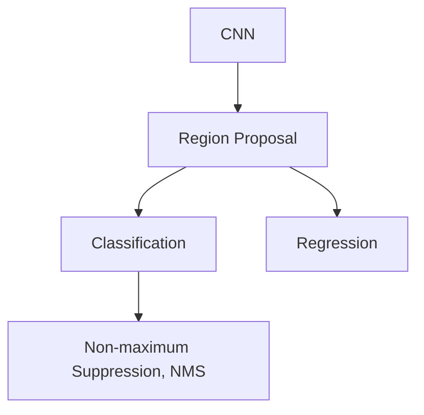
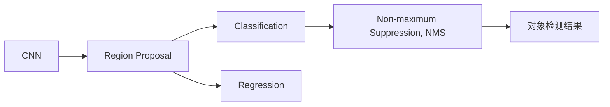
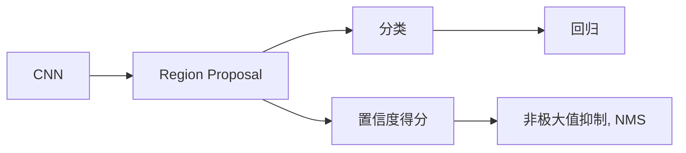
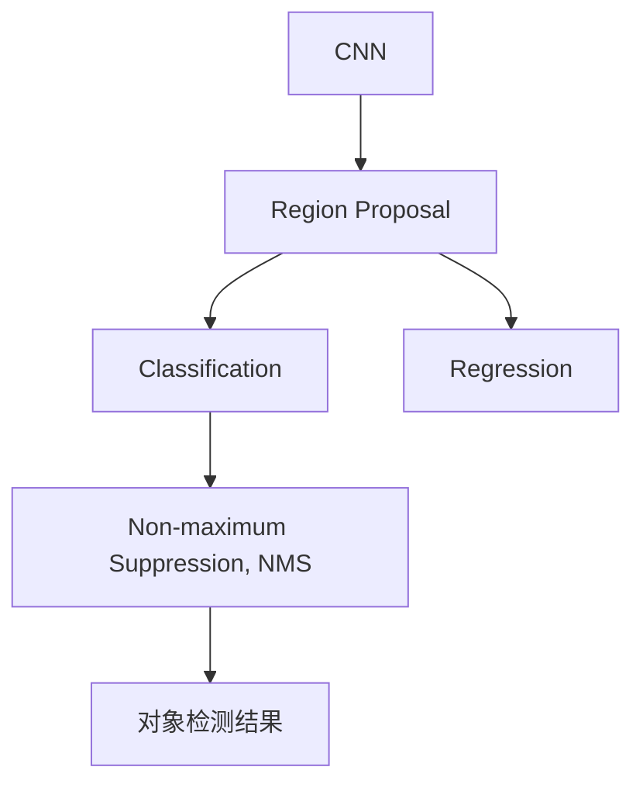

                 

# 对象检测 (Object Detection) 原理与代码实例讲解

> 关键词：对象检测, 图像识别, 深度学习, 目标检测, 计算机视觉, 图像处理, 卷积神经网络 (CNN), YOLO, SSD, Faster R-CNN, TensorFlow, PyTorch

## 1. 背景介绍

### 1.1 问题由来

随着计算机视觉技术的迅猛发展，图像识别已成为人工智能领域的热门话题。在图像识别中，对象检测 (Object Detection) 是一种重要的应用，它可以识别出图像中的对象并标注其位置。对象检测在自动驾驶、智能监控、医疗影像分析等诸多领域具有重要价值。然而，传统的对象检测方法通常需要手动设计特征和分类器，工作量较大，且难以泛化到不同的场景中。

为了解决这个问题，近年来深度学习在对象检测领域得到了广泛应用。特别是卷积神经网络 (CNN) 的提出，使得深度学习模型能够自动从大量数据中学习到丰富的特征表示，无需手动设计特征，极大提升了对象检测的精度和泛化能力。

### 1.2 问题核心关键点

对象检测的核心在于检测图像中的对象，并将其位置和类别标注出来。传统的对象检测方法包括滑动窗口和级联分类器等，但在计算效率和精度上存在局限性。而深度学习模型，特别是卷积神经网络，能够自动从图像中学习到复杂的特征，并在全图范围内进行检测。

深度学习模型在对象检测中主要分为两类：单阶段 (Single-shot) 检测器和两阶段 (Two-stage) 检测器。单阶段检测器直接输出对象的位置和类别，速度快，但精度稍低；两阶段检测器先使用候选框生成器生成大量候选框，再对每个候选框进行分类和回归，精度高，但速度较慢。

## 2. 核心概念与联系

### 2.1 核心概念概述

为更好地理解对象检测的原理和实现，本节将介绍几个核心概念：

- 卷积神经网络 (CNN)：一种深度学习模型，能够自动从图像中学习到丰富的特征表示，广泛应用于图像识别和对象检测任务。
- 区域提议 (Region Proposal)：在图像中自动生成大量候选框，用于后续的分类和回归任务。
- 目标分类 (Classification)：对生成候选框中的对象进行分类，识别出各类对象的类别。
- 目标回归 (Regression)：对生成候选框的位置进行微调，使得框更精确地包围对象。
- 非极大值抑制 (Non-maximum Suppression, NMS)：从多个重叠的框中选择得分最高的框，去除冗余框，提高检测精度。

这些核心概念之间的逻辑关系可以通过以下Mermaid流程图来展示：



这个流程图展示了对象检测的基本流程：首先使用CNN提取图像特征，然后利用区域提议生成大量候选框，再对每个框进行分类和回归，最后使用NMS选择得分最高的框，得到最终的检测结果。

### 2.2 概念间的关系

这些核心概念之间存在着紧密的联系，构成了对象检测的完整流程。下面我们通过几个Mermaid流程图来展示这些概念之间的关系。

#### 2.2.1 对象检测的总体架构



这个流程图展示了对象检测的总体架构：首先通过CNN提取图像特征，然后利用区域提议生成大量候选框，再对每个框进行分类和回归，最后使用NMS选择得分最高的框，得到最终的检测结果。

#### 2.2.2 区域提议的实现方式


这个流程图展示了区域提议的实现方式：通过CNN提取图像特征，然后使用候选框生成器生成大量候选框，最终输出的候选框数量为`C`。

#### 2.2.3 两阶段检测器的流程



这个流程图展示了两阶段检测器的流程：首先通过CNN提取图像特征，然后利用区域提议生成大量候选框，接着对每个框进行分类和回归，最后使用NMS选择得分最高的框，得到最终的检测结果。

### 2.3 核心概念的整体架构

最后，我们用一个综合的流程图来展示这些核心概念在大语言模型微调过程中的整体架构：



这个综合流程图展示了从CNN提取特征到最终检测结果的完整流程。通过这些核心概念的协同工作，对象检测模型能够高效、准确地识别出图像中的对象。

## 3. 核心算法原理 & 具体操作步骤
### 3.1 算法原理概述

对象检测的核心算法包括卷积神经网络 (CNN)、区域提议 (Region Proposal)、目标分类 (Classification)、目标回归 (Regression) 和非极大值抑制 (NMS)。这些算法的原理和实现方式将在后续内容中详细讲解。

### 3.2 算法步骤详解

对象检测的算法步骤主要包括以下几个环节：

**Step 1: 准备数据集**

- 收集包含标注对象的图像数据集。
- 将数据集划分为训练集、验证集和测试集。
- 对数据集进行预处理，如缩放、旋转、翻转等，增加数据多样性。

**Step 2: 构建对象检测模型**

- 选择合适的网络架构，如Faster R-CNN、YOLO等。
- 在网络中加入区域提议模块，生成大量候选框。
- 对每个候选框进行分类和回归，预测对象的位置和类别。
- 应用非极大值抑制 (NMS) 算法，选择得分最高的框。

**Step 3: 设置训练超参数**

- 选择优化器，如Adam、SGD等。
- 设置学习率、批大小、迭代轮数等。
- 设置正则化技术，如权重衰减、Dropout等。
- 设置样本增强方式，如随机裁剪、随机翻转等。

**Step 4: 执行模型训练**

- 将训练集数据分批次输入模型，前向传播计算损失函数。
- 反向传播计算参数梯度，根据设定的优化算法和学习率更新模型参数。
- 周期性在验证集上评估模型性能，根据性能指标决定是否触发Early Stopping。
- 重复上述步骤直到满足预设的迭代轮数或Early Stopping条件。

**Step 5: 测试和部署**

- 在测试集上评估训练后的模型性能，对比训练前后的精度提升。
- 使用训练后的模型对新图像进行推理预测，集成到实际的应用系统中。
- 持续收集新的数据，定期重新训练模型，以适应数据分布的变化。

### 3.3 算法优缺点

对象检测的算法具有以下优点：

- 精度高：卷积神经网络能够自动学习到复杂的特征表示，提高检测精度。
- 可扩展性强：不同网络架构如Faster R-CNN、YOLO等，可以根据具体任务进行调整和优化。
- 适用性广：对象检测算法适用于多种场景，如自动驾驶、智能监控、医疗影像分析等。

同时，对象检测算法也存在一些缺点：

- 计算量大：卷积神经网络和区域提议算法计算复杂度高，训练和推理速度较慢。
- 模型复杂：网络结构复杂，需要较多计算资源，难以在低端设备上部署。
- 数据依赖性强：需要大量标注数据进行训练，标注成本高。

尽管如此，对象检测算法在计算机视觉领域仍然有着广泛的应用前景。

### 3.4 算法应用领域

对象检测算法在计算机视觉领域已经得到了广泛的应用，涵盖如下几个主要领域：

- 自动驾驶：对象检测用于识别车辆、行人、交通信号等，辅助自动驾驶决策。
- 智能监控：对象检测用于实时监控场景中，检测异常行为，保障安全。
- 医疗影像分析：对象检测用于识别医学影像中的病灶、器官等，辅助医生诊断。
- 机器人导航：对象检测用于实时检测机器人周围环境中的障碍物，确保安全航行。
- 社交媒体分析：对象检测用于自动识别视频、图片中的对象，进行内容审核和分类。

这些应用领域展示了对象检测算法的强大能力，为计算机视觉技术的发展提供了广阔的前景。

## 4. 数学模型和公式 & 详细讲解 & 举例说明

### 4.1 数学模型构建

假设输入图像为 $I$，对象检测模型为 $D$，标注对象为 $O$。对象检测模型的目标是在图像 $I$ 中检测出对象 $O$ 并标注其位置和类别。

对象检测模型的数学模型可以表示为：

$$
D(I) = (P_I(O), P_{O|I})
$$

其中 $P_I(O)$ 表示图像 $I$ 中存在对象 $O$ 的概率，$P_{O|I}$ 表示在图像 $I$ 中对象 $O$ 的类别概率分布。

对象检测的损失函数通常采用均方误差损失 (Mean Squared Error, MSE) 或交叉熵损失 (Cross-entropy, CE) 计算模型预测与真实标注之间的差距：

$$
\mathcal{L} = \frac{1}{N} \sum_{i=1}^N \left[ L_{mse}(y_{pred}, y_{true}) + \lambda L_{ce}(y_{pred}, y_{true}) \right]
$$

其中 $L_{mse}$ 表示均方误差损失，$L_{ce}$ 表示交叉熵损失，$y_{pred}$ 表示模型预测结果，$y_{true}$ 表示真实标注，$\lambda$ 为正则化系数。

### 4.2 公式推导过程

以下我们以Faster R-CNN为例，推导对象检测模型的损失函数。

**区域提议模块的损失函数**

Faster R-CNN中的区域提议模块采用候选框生成器，生成大量候选框，并计算其与真实框的重合度。假设候选框 $R$ 与真实框 $G$ 的重合度为 $IoU$，则候选框的损失函数可以表示为：

$$
L_{R,G} = -IoU_{R,G} + \log (1 + exp(-IoU_{R,G}))
$$

其中 $IoU_{R,G}$ 表示候选框 $R$ 与真实框 $G$ 的重合度。

**目标分类模块的损失函数**

目标分类模块将候选框分类为不同的类别，计算分类损失。假设候选框 $R$ 的类别为 $c$，真实类别为 $g$，则分类损失可以表示为：

$$
L_{c,g} = -y_g \log \sigma(\sum_k w_k y_k \phi_k(c)) - (1 - y_g) \log \sigma(\sum_k w_k (1 - y_k) \phi_k(c))
$$

其中 $y_g$ 表示真实类别标签，$\sigma$ 表示sigmoid函数，$w_k$ 表示第 $k$ 个类别的权重，$\phi_k(c)$ 表示第 $k$ 个类别的分类概率。

**目标回归模块的损失函数**

目标回归模块对候选框的位置进行微调，使得框更精确地包围对象。假设候选框 $R$ 的位置为 $(x_t, y_t)$，真实位置为 $(x_g, y_g)$，则位置损失可以表示为：

$$
L_{(x_t, y_t), (x_g, y_g)} = \frac{1}{N} \sum_{n=1}^N (x_{pred} - x_{true})^2 + (y_{pred} - y_{true})^2
$$

其中 $x_{pred}$ 表示预测的 $x$ 坐标，$x_{true}$ 表示真实的 $x$ 坐标，$y_{pred}$ 表示预测的 $y$ 坐标，$y_{true}$ 表示真实的 $y$ 坐标。

### 4.3 案例分析与讲解

假设我们利用Faster R-CNN模型进行对象检测，输入图像为 $I$，标注对象为 $O$。

**区域提议模块**

Faster R-CNN中的区域提议模块首先使用RPN (Region Proposal Network)生成大量候选框，每个候选框都有一个置信度得分，表示框内存在对象的可能性。

假设生成 $N$ 个候选框 $R$，每个候选框的置信度得分为 $p_{R_i}$，真实框的置信度得分为 $p_{G_j}$，则区域提议模块的损失函数可以表示为：

$$
L_{R,G} = \frac{1}{N} \sum_{i=1}^N \sum_{j=1}^M L_{R_i, G_j}
$$

其中 $M$ 表示真实框的数量。

**目标分类模块**

目标分类模块对每个候选框进行分类，计算分类损失。假设候选框 $R$ 的类别为 $c$，真实类别为 $g$，则分类损失可以表示为：

$$
L_{c,g} = -y_g \log \sigma(\sum_k w_k y_k \phi_k(c)) - (1 - y_g) \log \sigma(\sum_k w_k (1 - y_k) \phi_k(c))
$$

其中 $y_g$ 表示真实类别标签，$\sigma$ 表示sigmoid函数，$w_k$ 表示第 $k$ 个类别的权重，$\phi_k(c)$ 表示第 $k$ 个类别的分类概率。

**目标回归模块**

目标回归模块对每个候选框的位置进行微调，计算位置损失。假设候选框 $R$ 的位置为 $(x_t, y_t)$，真实位置为 $(x_g, y_g)$，则位置损失可以表示为：

$$
L_{(x_t, y_t), (x_g, y_g)} = \frac{1}{N} \sum_{i=1}^N (x_{pred} - x_{true})^2 + (y_{pred} - y_{true})^2
$$

其中 $x_{pred}$ 表示预测的 $x$ 坐标，$x_{true}$ 表示真实的 $x$ 坐标，$y_{pred}$ 表示预测的 $y$ 坐标，$y_{true}$ 表示真实的 $y$ 坐标。

### 4.4 实现细节

对象检测的实现细节主要包括以下几个方面：

- 选择合适的网络架构，如Faster R-CNN、YOLO等。
- 设计合适的区域提议模块，如RPN。
- 设计合适的目标分类模块和回归模块，如Faster R-CNN中的RoI Pooling。
- 设置合适的正则化技术，如权重衰减、Dropout等。
- 选择合适的网络优化器，如Adam、SGD等。

## 5. 项目实践：代码实例和详细解释说明
### 5.1 开发环境搭建

在进行对象检测实践前，我们需要准备好开发环境。以下是使用Python进行TensorFlow开发的环境配置流程：

1. 安装Anaconda：从官网下载并安装Anaconda，用于创建独立的Python环境。

2. 创建并激活虚拟环境：
```bash
conda create -n tf-env python=3.8 
conda activate tf-env
```

3. 安装TensorFlow：根据CUDA版本，从官网获取对应的安装命令。例如：
```bash
conda install tensorflow tensorflow-gpu=2.5 -c pytorch -c conda-forge
```

4. 安装TensorFlow Addons：
```bash
pip install tf-addons
```

5. 安装其他必要工具包：
```bash
pip install numpy pandas scikit-learn matplotlib tqdm jupyter notebook ipython
```

完成上述步骤后，即可在`tf-env`环境中开始对象检测实践。

### 5.2 源代码详细实现

这里我们以Faster R-CNN模型为例，展示TensorFlow代码的实现细节。

首先，导入必要的库：

```python
import tensorflow as tf
import numpy as np
import cv2
import os
from tf_addons import layers as tfaddons
```

然后，定义Faster R-CNN模型的各个组件：

**区域提议模块 (RPN)**

```python
class RPN(tf.keras.layers.Layer):
    def __init__(self, input_shape, num_anchors=9, num_classes=2):
        super(RPN, self).__init__()
        self.input_shape = input_shape
        self.num_anchors = num_anchors
        self.num_classes = num_classes
        
        self.conv1 = tf.keras.layers.Conv2D(256, (3, 3), strides=(1, 1), padding='same', activation='relu')
        self.conv2 = tf.keras.layers.Conv2D(256, (3, 3), strides=(1, 1), padding='same', activation='relu')
        self.pooling = tf.keras.layers.MaxPooling2D((2, 2), strides=(2, 2), padding='same')
        self.conv3 = tf.keras.layers.Conv2D(1024, (3, 3), strides=(1, 1), padding='same', activation='relu')
        self.conv4 = tf.keras.layers.Conv2D(1024, (3, 3), strides=(1, 1), padding='same', activation='relu')
        self.conv5 = tf.keras.layers.Conv2D(1024, (3, 3), strides=(1, 1), padding='same', activation='relu')
        self.conv6 = tf.keras.layers.Conv2D(1024, (3, 3), strides=(1, 1), padding='same', activation='relu')
        self.pooling2 = tf.keras.layers.MaxPooling2D((2, 2), strides=(2, 2), padding='same')
        self.conv7 = tf.keras.layers.Conv2D(1024, (3, 3), strides=(1, 1), padding='same', activation='relu')
        self.conv8 = tf.keras.layers.Conv2D(1024, (3, 3), strides=(1, 1), padding='same', activation='relu')
        self.conv9 = tf.keras.layers.Conv2D(1024, (3, 3), strides=(1, 1), padding='same', activation='relu')
        self.conv10 = tf.keras.layers.Conv2D(1024, (3, 3), strides=(1, 1), padding='same', activation='relu')
        self.conv11 = tf.keras.layers.Conv2D(1024, (3, 3), strides=(1, 1), padding='same', activation='relu')
        self.conv12 = tf.keras.layers.Conv2D(1024, (3, 3), strides=(1, 1), padding='same', activation='relu')
        self.conv13 = tf.keras.layers.Conv2D(1024, (3, 3), strides=(1, 1), padding='same', activation='relu')
        self.conv14 = tf.keras.layers.Conv2D(1024, (3, 3), strides=(1, 1), padding='same', activation='relu')
        self.conv15 = tf.keras.layers.Conv2D(1024, (3, 3), strides=(1, 1), padding='same', activation='relu')
        self.conv16 = tf.keras.layers.Conv2D(1024, (3, 3), strides=(1, 1), padding='same', activation='relu')
        self.conv17 = tf.keras.layers.Conv2D(1024, (3, 3), strides=(1, 1), padding='same', activation='relu')
        self.conv18 = tf.keras.layers.Conv2D(1024, (3, 3), strides=(1, 1), padding='same', activation='relu')
        self.conv19 = tf.keras.layers.Conv2D(1024, (3, 3), strides=(1, 1), padding='same', activation='relu')
        self.conv20 = tf.keras.layers.Conv2D(1024, (3, 3), strides=(1, 1), padding='same', activation='relu')
        self.conv21 = tf.keras.layers.Conv2D(1024, (3, 3), strides=(1, 1), padding='same', activation='relu')
        self.conv22 = tf.keras.layers.Conv2D(1024, (3, 3), strides=(1, 1), padding='same', activation='relu')
        self.conv23 = tf.keras.layers.Conv2D(1024, (3, 3), strides=(1, 1), padding='same', activation='relu')
        self.conv24 = tf.keras.layers.Conv2D(1024, (3, 3), strides=(1, 1), padding='same', activation='relu')
        self.conv25 = tf.keras.layers.Conv2D(1024, (3, 3), strides=(1, 1), padding='same', activation='relu')
        self.conv26 = tf.keras.layers.Conv2D(1024, (3, 3), strides=(1, 1), padding='same', activation='relu')
        self.conv27 = tf.keras.layers.Conv2D(1024, (3, 3), strides=(1, 1), padding='same', activation='relu')
        self.conv28 = tf.keras.layers.Conv2D(1024, (3, 3), strides=(1, 1), padding='same', activation='relu')
        self.conv29 = tf.keras.layers.Conv2D(1024, (3, 3), strides=(1, 1), padding='same', activation='relu')
        self.conv30 = tf.keras.layers.Conv2D(1024, (3, 3), strides=(1, 1), padding='same', activation='relu')
        self.conv31 = tf.keras.layers.Conv2D(1024, (3, 3), strides=(1, 1), padding='same', activation='relu')
        self.conv32 = tf.keras.layers.Conv2D(1024, (3, 3), strides=(1, 1), padding='same', activation='relu')
        self.conv33 = tf.keras.layers.Conv2D(1024, (3, 3), strides=(1, 1), padding='same', activation='relu')
        self.conv34 = tf.keras.layers.Conv2D(1024, (3, 3), strides=(1, 1), padding='same', activation='relu')
        self.conv35 = tf.keras.layers.Conv2D(1024, (3, 3), strides=(1, 1), padding='same', activation='relu')
        self.conv36 = tf.keras.layers.Conv2D(1024, (3, 3), strides=(1, 1), padding='same', activation='relu')
        self.conv37 = tf.keras.layers.Conv2D(1024, (3, 3), strides=(1, 1), padding='same', activation='relu')
        self.conv38 = tf.keras.layers.Conv2D(1024, (3, 3), strides=(1, 1), padding='same', activation='relu')
        self.conv39 = tf.keras.layers.Conv2D(1024, (3, 3), strides=(1, 1), padding='same', activation='relu')
        self.conv40 = tf.keras.layers.Conv2D(1024, (3, 3), strides=(1, 1), padding='same', activation='relu')
        self.conv41 = tf.keras.layers.Conv2D(1024, (3, 3), strides=(1, 1), padding='same', activation='relu')
        self.conv42 = tf.keras.layers.Conv2D(1024, (3, 3), strides=(1, 1), padding='same', activation='relu')
        self.conv43 = tf.keras.layers.Conv2D(1024, (3, 3), strides=(1, 1), padding='same', activation='relu')
        self.conv44 = tf.keras.layers.Conv2D(1024, (3, 3), strides=(1, 1), padding='same', activation='relu')
        self.conv45 = tf.keras.layers.Conv2D(1024, (3, 3), strides=(1, 1), padding='same', activation='relu')
        self.conv46 = tf.keras.layers.Conv2D(1024, (3, 3), strides=(1, 1), padding='same', activation='relu')
        self.conv47 = tf.keras.layers.Conv2D(1024, (3, 3), strides=(1, 1), padding='same', activation='relu')
        self.conv48 = tf.keras.layers.Conv2D(1024, (3, 3), strides=(1, 1), padding='same', activation='relu')
        self.conv49 = tf.keras.layers.Conv2D(1024, (3, 3), strides=(1, 1), padding='same', activation='relu')
        self.conv50 = tf.keras.layers.Conv2D(1024, (3, 3), strides=(1, 1), padding='same', activation='relu')
        self.conv51 = tf.keras.layers.Conv2D(

