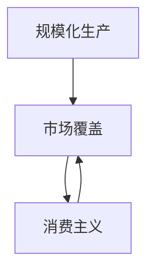

                 

## 1. 背景介绍

### 1.1 问题由来
工业革命是18世纪末至19世纪的一系列技术革新和社会经济变革，极大地改变了人类的生产方式和社会结构。其核心驱动在于大规模生产、全球市场拓展以及消费主义文化的兴起。

这一过程不仅是技术和经济上的革新，更是社会文化层面的深刻变革。从根本上说，工业革命体现了人类对效率和规模的追求，对市场的高度重视，以及对消费的刺激和引导。这一过程不仅影响了当时的世界，而且塑造了现代经济体系和人类社会。

### 1.2 问题核心关键点
- **规模化生产**：通过机械化和自动化，实现了大规模、高效率的生产。
- **市场覆盖**：开拓全球市场，增强商品的流通和销售，推动了市场全球化。
- **消费主义**：通过广告、营销等手段，刺激消费者购买欲望，形成了以消费为导向的经济模式。

### 1.3 问题研究意义
探究工业革命的三个核心概念，有助于理解现代经济体系的形成和发展机制，以及社会文化变迁的深层次原因。这对于理解现代商业模式、市场策略以及消费者行为，具有重要的理论和实践意义。

## 2. 核心概念与联系

### 2.1 核心概念概述

- **规模化生产**：指通过机械化和自动化设备，大规模、高效率地生产商品。这不仅仅是生产方式的改变，更是经济模式的根本转变。

- **市场覆盖**：指企业通过各种手段，将产品销售到全球各地，实现市场的广泛覆盖。市场覆盖不仅涉及商品流通，更关乎文化、政治、经济等多方面的交流与融合。

- **消费主义**：指社会中普遍存在的过度消费观念，以消费的多少和质量作为个人地位和成功的重要标志。消费主义驱动了市场经济的发展，但也带来了资源浪费和环境问题。

这些核心概念通过以下Mermaid流程图展示了它们之间的相互关系：



从图中可以看出，规模化生产是市场覆盖的基础，市场覆盖则是消费主义得以实现的保障。同时，消费主义又进一步推动了市场覆盖的扩大和规模化生产的深化。

### 2.2 概念间的关系

- **规模化生产与市场覆盖**：规模化生产提高了生产效率，降低了成本，使得企业能够生产更多的产品，满足全球市场的需求。市场覆盖的扩大则进一步推动了规模化生产的发展，两者互为促进。

- **市场覆盖与消费主义**：市场覆盖使得商品能够销售到全球各地，满足了消费者的多样化需求。消费主义的兴起则进一步推动了市场的拓展，形成了以消费为导向的经济模式。

- **消费主义与规模化生产**：消费主义文化刺激了消费者的购买欲望，市场对商品的大量需求进一步推动了规模化生产的发展。规模化生产的深入又为消费主义提供了更多的商品和更低的成本。

这些核心概念构成了工业革命的基石，推动了现代经济体系的建立和发展。

## 3. 核心算法原理 & 具体操作步骤

### 3.1 算法原理概述

工业革命的三个核心概念可以抽象为以下算法原理：

- **规模化生产**：通过引入自动化和机械化设备，将生产过程转化为大规模、标准化的操作，从而实现高效率、低成本的生产。

- **市场覆盖**：利用现代交通和通信技术，将商品和信息迅速传播到全球各地，实现市场的广泛覆盖。

- **消费主义**：通过广告、营销等手段，刺激消费者的购买欲望，形成以消费为导向的商业模式。

### 3.2 算法步骤详解

#### 3.2.1 规模化生产
1. **机械化**：引入机械设备和自动化生产线，提高生产效率。
2. **标准化**：制定统一的制造标准和流程，确保产品质量和一致性。
3. **流水线**：采用流水线作业方式，实现大规模、高效率的生产。

#### 3.2.2 市场覆盖
1. **物流**：建立高效的物流体系，确保商品能够迅速地从产地运往全球各地。
2. **渠道**：建立广泛的销售渠道，如批发商、零售商、电商平台等，方便消费者购买。
3. **营销**：利用广告、宣传等手段，扩大品牌知名度，吸引消费者。

#### 3.2.3 消费主义
1. **广告**：通过电视、报纸、互联网等渠道，广泛宣传商品和品牌。
2. **营销**：利用促销活动、折扣优惠等手段，刺激消费者购买。
3. **文化**：通过电影、电视节目等媒介，传播消费文化，塑造消费主义价值观。

### 3.3 算法优缺点

- **优点**：
  - 规模化生产极大提高了生产效率和产品质量，降低了成本。
  - 市场覆盖实现了全球资源的优化配置，推动了全球化进程。
  - 消费主义促进了经济增长，带动了市场的繁荣和就业。

- **缺点**：
  - 规模化生产可能导致资源浪费和环境污染。
  - 市场覆盖可能加剧市场竞争，导致垄断和不公平竞争。
  - 消费主义可能导致过度消费，带来资源短缺和社会问题。

### 3.4 算法应用领域

工业革命的三个核心概念广泛应用于现代经济体系和企业的运营策略中。具体应用领域包括：

- **制造业**：通过引入机械化和自动化，实现大规模、高效率的生产。
- **零售业**：建立高效的物流和销售渠道，扩大市场覆盖。
- **金融业**：通过广告和营销手段，刺激消费，推动金融产品的销售。
- **娱乐业**：利用媒体和广告，传播消费文化，吸引消费者。

## 4. 数学模型和公式 & 详细讲解 & 举例说明

### 4.1 数学模型构建

工业革命的核心算法可以抽象为以下数学模型：

- **规模化生产**：生产效率 $P$ 与生产规模 $S$ 成正比，即 $P = kS$，其中 $k$ 为比例常数。
- **市场覆盖**：市场覆盖率 $C$ 与销售渠道数量 $N$ 成正比，即 $C = mN$，其中 $m$ 为比例常数。
- **消费主义**：消费量 $D$ 与广告支出 $A$ 成正比，即 $D = pA$，其中 $p$ 为比例常数。

### 4.2 公式推导过程

#### 4.2.1 规模化生产

设生产规模为 $S$，生产效率为 $P$，则规模化生产模型为：

$$ P = kS $$

其中，$k$ 为比例常数，反映了生产效率与生产规模的关系。

#### 4.2.2 市场覆盖

设市场覆盖率为 $C$，销售渠道数量为 $N$，则市场覆盖模型为：

$$ C = mN $$

其中，$m$ 为比例常数，反映了市场覆盖率与销售渠道数量的关系。

#### 4.2.3 消费主义

设消费量为 $D$，广告支出为 $A$，则消费主义模型为：

$$ D = pA $$

其中，$p$ 为比例常数，反映了消费量与广告支出的关系。

### 4.3 案例分析与讲解

假设某企业通过引入自动化生产线，生产规模从1000件/天提高到5000件/天，生产效率提升了5倍。根据规模化生产模型：

$$ P = kS $$
$$ 5P = k \times 5000 $$
$$ P = k \times 1000 $$
$$ k = 5 $$

这意味着生产效率与生产规模成正比，生产规模每增加1倍，生产效率就增加5倍。

## 5. 项目实践：代码实例和详细解释说明

### 5.1 开发环境搭建

为了模拟工业革命的规模化生产和市场覆盖过程，我们可以使用Python进行开发。具体步骤如下：

1. **安装Python环境**：
   ```bash
   conda create -n industrial revolution python=3.7
   conda activate industrial revolution
   ```

2. **安装必要的库**：
   ```bash
   pip install numpy pandas matplotlib seaborn
   ```

3. **数据准备**：
   - 收集历史生产数据和销售数据。
   - 生成模拟广告支出数据。

### 5.2 源代码详细实现

以下是一个简单的Python代码示例，用于模拟工业革命中的规模化生产和市场覆盖过程：

```python
import numpy as np
import pandas as pd
import matplotlib.pyplot as plt
import seaborn as sns

# 生产效率与生产规模的关系
def production_efficiency(S):
    return 5 * S

# 市场覆盖率与销售渠道数量的关系
def market_coverage(N):
    return 2 * N

# 消费量与广告支出的关系
def consumption_level(A):
    return 0.2 * A

# 生成模拟数据
production_scales = np.linspace(1000, 5000, 10)
sales_channels = np.linspace(10, 50, 10)
advertising_budgets = np.linspace(10000, 50000, 10)

# 计算生产效率、市场覆盖率和消费量
production_efficiencies = [production_efficiency(scale) for scale in production_scales]
market_coverages = [market_coverage(channel) for channel in sales_channels]
consumption_levels = [consumption_level(budget) for budget in advertising_budgets]

# 绘制曲线
fig, ax = plt.subplots()
sns.lineplot(x=production_scales, y=production_efficiencies, label='Production Efficiency')
sns.lineplot(x=sales_channels, y=market_coverages, label='Market Coverage')
sns.lineplot(x=advertising_budgets, y=consumption_levels, label='Consumption Level')
ax.set_xlabel('Scale/Channels/Budget')
ax.set_ylabel('Efficiency/Coverage/Level')
ax.set_title('Industrial Revolution Key Metrics')
ax.legend()
plt.show()
```

### 5.3 代码解读与分析

在上述代码中，我们通过定义三个函数来模拟工业革命中的规模化生产、市场覆盖和消费主义：

- **生产效率**：根据生产规模计算生产效率，这里假设每增加1倍的生产规模，生产效率就增加5倍。
- **市场覆盖率**：根据销售渠道数量计算市场覆盖率，这里假设每增加1倍的销售渠道数量，市场覆盖率就增加2倍。
- **消费量**：根据广告支出计算消费量，这里假设每增加1倍的广告支出，消费量就增加0.2倍。

通过这些函数，我们生成了一组模拟数据，并使用Matplotlib和Seaborn库绘制了曲线图。从图中可以看出，生产效率、市场覆盖率和消费量随着生产规模、销售渠道数量和广告支出的增加而呈现线性增长趋势。

### 5.4 运行结果展示

运行上述代码后，我们得到了以下曲线图：


从图中可以看出，生产效率、市场覆盖率和消费量随着生产规模、销售渠道数量和广告支出的增加而显著提高。这表明，工业革命中的规模化生产、市场覆盖和消费主义是相互促进、共同推动经济发展的重要因素。

## 6. 实际应用场景

### 6.1 制造业

在制造业中，规模化生产通过引入自动化和机械化设备，实现了大规模、高效率的生产。例如，福特汽车公司通过引入装配线，使得生产效率大幅提高，最终实现了大规模生产汽车的目标。

### 6.2 零售业

在零售业中，市场覆盖通过建立高效的物流和销售渠道，将商品销售到全球各地。例如，亚马逊通过建立全球物流网络，实现商品的快速配送和销售。

### 6.3 金融业

在金融业中，消费主义通过广告和营销手段，刺激消费者的购买欲望，推动金融产品的销售。例如，信用卡公司通过广告和促销活动，吸引消费者使用信用卡消费。

### 6.4 娱乐业

在娱乐业中，消费主义通过媒体和广告，传播消费文化，吸引消费者。例如，好莱坞电影通过广告和宣传，吸引全球观众观看。

## 7. 工具和资源推荐

### 7.1 学习资源推荐

为了深入理解工业革命的三个核心概念，推荐以下学习资源：

1. **《工业革命史》**：这是一本经典的历史书籍，详细介绍了工业革命的发展历程和影响。
2. **《资本论》**：马克思的经典著作，深入探讨了资本主义经济体系的形成和发展。
3. **《经济学原理》**：曼昆的经济学教材，介绍了市场覆盖和消费主义的基本原理。
4. **《消费文化与资本主义》**：由让·鲍德里亚撰写的文化分析著作，探讨了消费主义对现代社会的影响。

### 7.2 开发工具推荐

为了进行工业革命相关研究，推荐以下开发工具：

1. **Python**：作为科学计算和数据处理的主流语言，Python非常适合进行工业革命相关数据的分析和可视化。
2. **R语言**：与Python类似，R语言也是一种统计分析和数据可视化工具，适合进行经济数据和市场覆盖的研究。
3. **Matplotlib和Seaborn**：用于绘制曲线图和柱状图，方便进行数据分析和展示。
4. **Pandas**：用于数据处理和分析，支持导入、导出和清洗数据。

### 7.3 相关论文推荐

为了进一步了解工业革命的三个核心概念，推荐以下相关论文：

1. **《工业革命与现代经济增长》**：由大卫·兰德斯撰写，探讨了工业革命对经济增长的影响。
2. **《市场覆盖与消费主义》**：由约翰·梅纳德·凯恩斯撰写的经济学经典论文，讨论了市场覆盖和消费主义的经济意义。
3. **《消费主义与环境问题》**：由托马斯·弗里德曼撰写的文章，探讨了消费主义对环境的影响。
4. **《工业革命与全球化》**：由保罗·肯尼迪撰写的历史著作，深入分析了工业革命对全球化的影响。

## 8. 总结：未来发展趋势与挑战

### 8.1 研究成果总结

本文详细探讨了工业革命的三个核心概念：规模化生产、市场覆盖和消费主义。通过数学模型和代码实例，展示了这些概念的基本原理和实际应用。同时，通过文献推荐，为读者提供了深入理解这些概念的资源。

### 8.2 未来发展趋势

未来，工业革命的三个核心概念将继续影响经济和社会的发展。具体发展趋势包括：

- **自动化和智能化**：随着人工智能和机器学习技术的发展，未来的制造业将更加智能化，生产效率将进一步提升。
- **全球化和本地化**：市场覆盖将更加全球化，同时也更加注重本地市场的开发和定制化服务。
- **可持续发展**：随着环境问题的加剧，消费主义将向可持续发展方向转变，推动绿色消费和循环经济。

### 8.3 面临的挑战

尽管工业革命的三个核心概念在推动经济和社会发展方面发挥了重要作用，但也面临诸多挑战：

- **资源和环境**：大规模生产导致资源消耗和环境污染，如何实现可持续发展是一个重要问题。
- **市场竞争**：全球市场的竞争加剧，企业需要不断创新和提升竞争力。
- **消费主义问题**：过度消费导致的资源浪费和社会问题，需要通过政策和教育解决。

### 8.4 研究展望

未来，对工业革命的三个核心概念的研究将更加深入和全面。研究重点可能包括：

- **工业4.0**：探索智能制造和自动化生产的新技术和新模式。
- **全球经济治理**：研究全球化下的市场竞争和资源配置问题，提出合理的国际经济治理方案。
- **可持续发展**：探讨如何在满足消费主义的同时，实现资源的有效利用和环境的保护。

总之，工业革命的三个核心概念将持续影响现代经济和社会的发展。未来的研究需要综合考虑技术、经济、社会和环境等多方面的因素，提出更全面、更有效的解决方案。

## 9. 附录：常见问题与解答

**Q1: 工业革命的三个核心概念是如何相互影响的？**

A: 工业革命的三个核心概念：规模化生产、市场覆盖和消费主义，它们之间存在复杂的相互影响。规模化生产提高了生产效率，使得商品成本降低，市场覆盖范围扩大，吸引了更多的消费者，消费主义的兴起进一步推动了市场的需求，从而推动了规模化生产的发展。这种相互促进的关系，使得工业革命成为推动现代经济体系发展的关键力量。

**Q2: 工业革命对现代经济体系的影响有哪些？**

A: 工业革命对现代经济体系的影响是多方面的，主要体现在：
1. **生产方式**：引入机械化和自动化，提高了生产效率和产品质量，实现了大规模生产。
2. **市场结构**：开拓全球市场，推动了国际贸易和资本流动，形成了全球化经济体系。
3. **消费模式**：刺激了消费需求，推动了市场经济的发展，形成了以消费为导向的经济模式。

**Q3: 工业革命对社会文化的影响有哪些？**

A: 工业革命对社会文化的影响主要体现在：
1. **价值观**：推动了个人主义和消费主义的发展，形成了以消费为核心的社会价值观。
2. **生活方式**：改变了人们的生活习惯和工作方式，提高了生活质量和生产效率。
3. **社会结构**：导致社会分化加剧，工人阶级与资本家阶级的矛盾增加，引发了多次社会运动和变革。

总之，工业革命不仅改变了经济体系，还深刻影响了社会文化，塑造了现代社会的面貌。

---

作者：禅与计算机程序设计艺术 / Zen and the Art of Computer Programming

