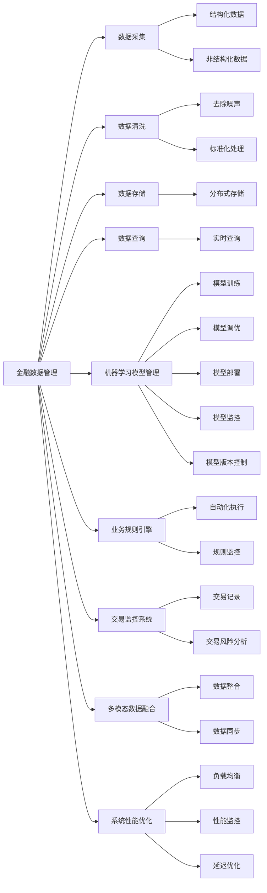
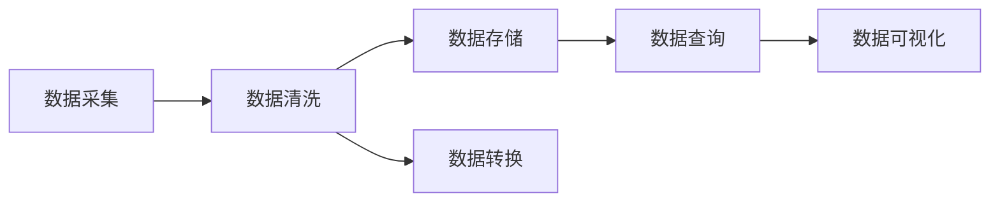
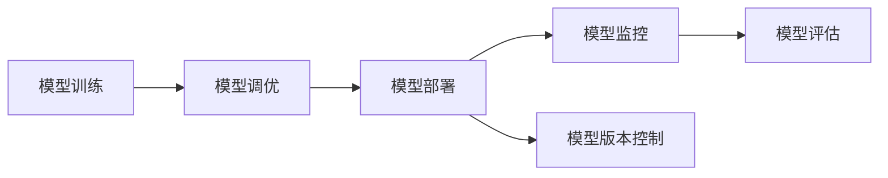
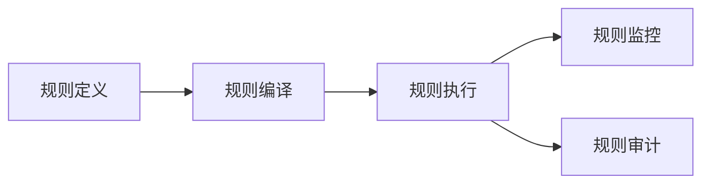
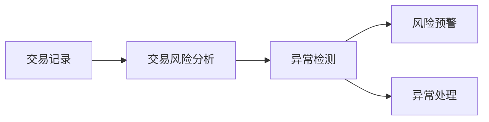
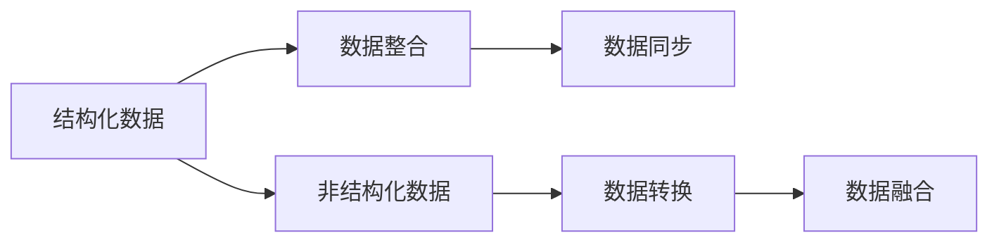

                 

## 1. 背景介绍

### 1.1 问题由来

金融行业是现代经济的核心引擎，涉及交易、融资、投资、风险管理等复杂活动。在过去几十年中，金融行业经历了从传统线下到数字化再到智能化的转型。然而，即便在数字化金融时代，仍然面临着大量繁琐、重复的任务，如信用评估、风险控制、客户服务、金融产品推荐等，这些任务对人力和计算资源的需求仍然非常巨大，难以满足现代金融业务的快速迭代和规模化需求。

因此，智能金融系统成为金融行业发展的必然趋势。智能金融系统利用人工智能和大数据技术，可以自动化、智能化地处理金融业务，大幅度提升金融服务的效率和质量。其中，工具使用机制在智能金融系统中扮演着至关重要的角色，通过对金融数据、模型和工具的自动化管理和调度，实现金融业务的全流程智能化。

### 1.2 问题核心关键点

智能金融系统中的工具使用机制主要包括以下几个方面：

1. **金融数据管理**：包括数据的采集、清洗、存储、查询等环节。金融数据通常涉及个人隐私和敏感信息，因此需要严格的数据安全措施，并保证数据的及时性和准确性。

2. **模型管理与调度**：智能金融系统中使用各种机器学习模型进行风险评估、信用评分、投资决策等任务。工具使用机制需要动态地管理和调度这些模型，确保在恰当的时机使用最适合的模型，并及时更新模型以适应新的业务需求。

3. **自动化执行与监控**：金融系统中涉及大量的业务规则和流程，工具使用机制需要对这些规则进行自动化执行，并实时监控执行情况，确保业务流程的顺利进行，同时及时发现并解决问题。

4. **交易执行与监控**：智能金融系统需要对金融交易进行自动化执行，并实时监控交易状态和风险，及时发现并处理异常交易行为，保护金融安全。

5. **多模态数据整合**：金融业务涉及多种数据源，包括交易数据、市场数据、客户数据等，工具使用机制需要对这些数据进行整合，构建统一的数据视图，为业务决策提供支持。

6. **性能优化与扩展**：金融系统需要处理海量交易数据，工具使用机制需要优化系统性能，确保其在高并发和高负载情况下仍能稳定运行，并支持系统的扩展性。

这些关键点构成了智能金融系统中工具使用机制的核心，其设计和实现直接影响着系统的性能、稳定性和可扩展性。

### 1.3 问题研究意义

研究智能金融系统中的工具使用机制，对于提升金融业务的自动化水平、降低运营成本、提高服务效率和客户满意度具有重要意义：

1. **提升自动化水平**：通过工具使用机制，金融业务可以实现自动化、智能化的处理，减少人工干预，提升处理效率和准确性。

2. **降低运营成本**：自动化处理减少了人力和物力的投入，降低了运营成本，使金融机构能够更好地应对激烈的市场竞争。

3. **提高服务质量**：工具使用机制可以实时监控业务流程，及时发现并解决问题，提高金融服务的稳定性与可靠性。

4. **增强客户体验**：自动化和智能化的金融服务提升了客户的使用体验，增加了客户黏性和忠诚度。

5. **支持决策优化**：工具使用机制可以对金融数据进行深度分析，提供决策支持，提升金融决策的科学性和准确性。

6. **推动业务创新**：通过工具使用机制，金融机构可以迅速迭代和优化业务流程，加速产品和服务创新，提升市场竞争力。

因此，研究智能金融系统中的工具使用机制，对于推动金融业的数字化转型和智能化升级具有深远的意义。

## 2. 核心概念与联系

### 2.1 核心概念概述

为了更好地理解智能金融系统中的工具使用机制，本节将介绍几个密切相关的核心概念：

1. **金融数据管理**：指对金融业务中涉及的各种数据进行采集、清洗、存储、查询等管理活动。金融数据通常包括结构化数据（如交易记录、财务报表）和非结构化数据（如新闻、社交媒体）。

2. **机器学习模型管理**：指对金融系统中使用的各种机器学习模型进行动态管理，包括模型的训练、调优、部署、监控等。模型管理需要考虑模型的版本控制、参数配置、资源需求等因素。

3. **业务规则引擎**：指在智能金融系统中用于自动化执行和监控金融业务规则的工具。业务规则引擎可以动态地加载和执行业务规则，并实时监控执行结果，确保业务流程的合规性和稳定性。

4. **交易监控系统**：指用于实时监控金融交易状态和风险的工具。交易监控系统可以实时分析交易行为，识别异常交易，及时处理潜在的金融风险。

5. **多模态数据融合**：指对金融系统中涉及的多源异构数据进行整合，构建统一的数据视图，为业务决策提供支持。多模态数据融合需要考虑数据格式、语义、实时性等因素。

6. **系统性能优化**：指对智能金融系统进行性能优化，包括提升系统响应速度、降低延迟、提高吞吐量等，确保系统在高并发和高负载情况下仍能稳定运行。

这些核心概念之间存在紧密的联系，共同构成了智能金融系统中工具使用机制的完整生态系统。以下将通过一系列Mermaid流程图展示这些概念之间的联系：

以上流程图展示了智能金融系统中工具使用机制的基本流程：

1. 金融数据通过数据采集、清洗、存储和查询等环节，进入机器学习模型进行建模和预测。
2. 机器学习模型经过训练和调优后，被部署到业务规则引擎中，用于自动化执行和监控金融业务规则。
3. 业务规则引擎通过实时监控交易状态和风险，发现异常交易行为并及时处理。
4. 金融数据通过多模态数据融合，构建统一的数据视图，支持业务决策。
5. 智能金融系统通过系统性能优化，提升响应速度和吞吐量，确保系统在高并发和高负载情况下的稳定性。

### 2.2 概念间的关系

这些核心概念之间存在着紧密的联系，形成了智能金融系统中工具使用机制的整体架构。以下通过几个Mermaid流程图来展示这些概念之间的关系：

#### 2.2.1 金融数据管理的流程

以上流程图展示了金融数据管理的基本流程：

1. 金融数据通过数据采集环节进入系统。
2. 采集到的数据经过清洗和转换，去除噪声和异常值，转换为标准格式。
3. 清洗后的数据存储到分布式数据库中，方便查询和分析。
4. 存储的数据通过查询接口，支持实时和批量查询需求。
5. 查询结果通过数据可视化工具，提供直观的展示和分析。

#### 2.2.2 机器学习模型的生命周期

以上流程图展示了机器学习模型的生命周期：

1. 金融数据通过训练和调优环节，生成初步的机器学习模型。
2. 调优后的模型被部署到业务规则引擎中，用于自动化执行和监控金融业务规则。
3. 部署后的模型通过监控和评估，不断优化和更新。
4. 更新的模型通过版本控制，管理和跟踪模型变更历史。

#### 2.2.3 业务规则引擎的工作机制

以上流程图展示了业务规则引擎的工作机制：

1. 金融业务规则通过定义和编译环节，转换为可执行的规则。
2. 编译后的规则被执行引擎加载和执行。
3. 执行过程中的规则通过实时监控，确保业务流程的合规性和稳定性。
4. 执行结果通过审计工具，进行定期和即时的审计和分析。

#### 2.2.4 交易监控系统的流程

以上流程图展示了交易监控系统的基本流程：

1. 交易数据通过记录和存储，进入交易监控系统。
2. 交易数据经过风险分析，识别异常交易行为。
3. 异常交易行为通过检测和预警，及时发现潜在风险。
4. 风险预警信息通过处理，采取相应的风险控制措施。

#### 2.2.5 多模态数据融合的流程

以上流程图展示了多模态数据融合的基本流程：

1. 金融业务涉及的结构化数据和非结构化数据，通过数据采集和转换，进入数据融合环节。
2. 结构化数据和非结构化数据通过整合和同步，构建统一的数据视图。
3. 统一的数据视图通过转换和融合，提供丰富的数据支持和分析。

#### 2.2.6 系统性能优化的流程

以上流程图展示了系统性能优化的基本流程：

1. 智能金融系统通过负载均衡，均衡分布计算资源。
2. 系统性能通过监控和分析，识别性能瓶颈。
3. 性能瓶颈通过延迟优化和资源分配，提升系统响应速度。
4. 系统优化通过合理的配置和设计，提升系统稳定性和可靠性。
5. 系统扩展通过合理的架构设计和工具支持，支持系统的扩展性。

通过这些流程图，我们可以更清晰地理解智能金融系统中各个环节的交互和依赖关系，为后续深入讨论具体的工具使用机制提供基础。

## 3. 核心算法原理 & 具体操作步骤

### 3.1 算法原理概述

智能金融系统中的工具使用机制，主要基于金融数据的自动管理和模型动态调度，通过自动化、智能化地处理金融业务，提升系统的效率和稳定性。其核心算法原理包括：

1. **数据管理算法**：用于对金融数据进行高效采集、清洗、存储和查询。
2. **模型管理算法**：用于动态地管理机器学习模型，包括训练、调优、部署和监控。
3. **业务规则引擎算法**：用于自动化执行和监控金融业务规则，确保业务流程的合规性和稳定性。
4. **交易监控算法**：用于实时监控金融交易状态和风险，及时发现和处理异常交易行为。
5. **数据融合算法**：用于多模态数据的整合和融合，构建统一的数据视图。
6. **系统性能优化算法**：用于提升系统的响应速度、降低延迟、提高吞吐量，确保系统在高并发和高负载情况下的稳定性。

这些算法原理构成了智能金融系统中工具使用机制的基础，通过合理的算法设计和优化，可以实现金融业务的自动化、智能化和高效化。

### 3.2 算法步骤详解

智能金融系统中的工具使用机制，主要包括以下几个关键步骤：

#### 3.2.1 数据管理

**步骤1: 数据采集**
- 使用分布式爬虫工具，从不同数据源（如金融交易系统、社交媒体、新闻网站等）采集金融数据。
- 数据采集工具需支持多线程、分布式和异步处理，以提高采集效率和稳定性。

**步骤2: 数据清洗**
- 使用数据清洗工具，对采集到的数据进行去重、去噪、标准化处理，去除异常值和无效数据。
- 数据清洗工具需支持多种数据格式和处理方法，能够自动识别并处理数据异常。

**步骤3: 数据存储**
- 使用分布式数据库（如Hadoop、Spark、MySQL等）对清洗后的数据进行存储。
- 数据库需支持高并发和高负载情况下的读写操作，保证数据的及时性和可靠性。

**步骤4: 数据查询**
- 使用查询工具，对存储的数据进行实时和批量查询。
- 查询工具需支持复杂的SQL查询语句和数据分析功能，提供丰富的数据展示和分析结果。

#### 3.2.2 模型管理

**步骤1: 模型训练**
- 使用机器学习框架（如TensorFlow、PyTorch等）对金融数据进行建模，生成初步的机器学习模型。
- 模型训练需使用大规模数据集和合适的优化器，确保模型在训练过程中的收敛性和准确性。

**步骤2: 模型调优**
- 使用调优工具，对训练好的模型进行参数调整和优化，提高模型的精度和泛化能力。
- 调优工具需支持多种优化算法和超参数搜索方法，能够自动选择最优模型。

**步骤3: 模型部署**
- 使用部署工具，将训练好的模型部署到生产环境，支持模型的高效加载和执行。
- 部署工具需支持多种模型格式和数据源，能够兼容不同的业务场景和应用环境。

**步骤4: 模型监控**
- 使用监控工具，实时监测模型的运行状态和性能指标，及时发现和处理异常情况。
- 监控工具需支持多维度监控指标和告警机制，能够提供实时的数据和分析结果。

**步骤5: 模型评估**
- 使用评估工具，对模型在测试集上的表现进行评估，衡量模型的性能和准确性。
- 评估工具需支持多种评估指标和方法，能够提供全面的模型分析和改进建议。

#### 3.2.3 业务规则引擎

**步骤1: 规则定义**
- 使用规则编辑器，定义金融业务规则，包括条件、操作和异常处理等。
- 规则编辑器需支持可视化操作和编辑，能够快速构建复杂的业务规则。

**步骤2: 规则编译**
- 使用编译工具，将定义好的规则编译为可执行的规则引擎逻辑。
- 编译工具需支持多种规则语言和引擎类型，能够兼容不同的业务需求和技术平台。

**步骤3: 规则执行**
- 使用规则引擎，加载和执行编译好的规则，自动处理金融业务流程。
- 规则引擎需支持多种规则类型和处理逻辑，能够高效地处理大量的业务请求。

**步骤4: 规则监控**
- 使用监控工具，实时监测规则引擎的执行状态和性能指标，及时发现和处理异常情况。
- 监控工具需支持多维度监控指标和告警机制，能够提供实时的数据和分析结果。

**步骤5: 规则审计**
- 使用审计工具，对规则引擎的执行结果进行定期和即时的审计和分析，发现潜在的风险和问题。
- 审计工具需支持多种审计指标和分析方法，能够提供全面的业务规则分析和改进建议。

#### 3.2.4 交易监控

**步骤1: 交易记录**
- 使用交易记录工具，记录金融交易数据，包括交易时间、金额、交易对手等关键信息。
- 交易记录工具需支持实时记录和存储，保证交易数据的完整性和时效性。

**步骤2: 交易风险分析**
- 使用风险分析工具，对交易数据进行分析，识别异常交易行为和潜在风险。
- 风险分析工具需支持多种风险评估模型和算法，能够自动检测和分析交易风险。

**步骤3: 异常检测**
- 使用异常检测工具，对交易风险分析的结果进行检测和预警，及时发现和处理异常交易。
- 异常检测工具需支持多种异常检测算法和策略，能够快速识别和定位异常交易。

**步骤4: 风险预警**
- 使用风险预警工具，对异常交易进行预警，提醒相关人员进行处理。
- 风险预警工具需支持多种预警方式和通知机制，能够快速响应和处理异常交易。

**步骤5: 异常处理**
- 使用异常处理工具，对异常交易进行处理，采取相应的风险控制措施。
- 异常处理工具需支持多种风险控制策略和流程，能够及时应对和处理异常交易。

#### 3.2.5 数据融合

**步骤1: 数据整合**
- 使用数据整合工具，将结构化数据和非结构化数据进行整合，构建统一的数据视图。
- 数据整合工具需支持多种数据格式和转换方法，能够高效地进行数据整合和同步。

**步骤2: 数据同步**
- 使用数据同步工具，对整合后的数据进行同步，确保数据的及时性和一致性。
- 数据同步工具需支持多种数据源和目标，能够兼容不同的业务需求和技术平台。

**步骤3: 数据转换**
- 使用数据转换工具，对不同数据源的数据进行转换和标准化处理，统一数据格式和语义。
- 数据转换工具需支持多种数据格式和处理方法，能够自动进行数据转换和处理。

**步骤4: 数据融合**
- 使用数据融合工具，对整合后的数据进行融合，生成多模态数据视图。
- 数据融合工具需支持多种数据源和处理方法，能够高效地进行数据融合和分析。

#### 3.2.6 系统性能优化

**步骤1: 负载均衡**
- 使用负载均衡工具，均衡分配计算资源，确保系统的稳定性和高并发处理能力。
- 负载均衡工具需支持多种负载算法和调度策略，能够高效地进行负载均衡和资源分配。

**步骤2: 性能监控**
- 使用性能监控工具，实时监测系统性能指标，如响应时间、吞吐量、错误率等。
- 性能监控工具需支持多种监控指标和方法，能够提供实时的数据和分析结果。

**步骤3: 延迟优化**
- 使用延迟优化工具，优化系统响应速度和延迟，提升用户体验和系统效率。
- 延迟优化工具需支持多种优化算法和策略，能够快速识别和优化系统延迟。

**步骤4: 资源分配**
- 使用资源分配工具，合理分配计算资源，确保系统的稳定性和高效性。
- 资源分配工具需支持多种资源类型和分配策略，能够自动进行资源分配和优化。

**步骤5: 系统优化**
- 使用系统优化工具，对系统进行全面的优化，提升系统的稳定性和可靠性。
- 系统优化工具需支持多种优化算法和策略，能够自动进行系统优化和改进。

**步骤6: 系统扩展**
- 使用系统扩展工具，支持系统的扩展和升级，确保系统的可扩展性和可维护性。
- 系统扩展工具需支持多种扩展技术和架构，能够快速部署和扩展系统。

### 3.3 算法优缺点

智能金融系统中的工具使用机制，具有以下优点：

1. **自动化水平高**：通过自动化工具，可以高效地处理金融业务，减少人工干预，提升处理效率和准确性。
2. **稳定性高**：通过实时监控和异常处理，保证金融业务流程的稳定性和可靠性。
3. **灵活性强**：通过动态管理和调度模型和规则，支持金融业务的快速迭代和优化。
4. **数据安全性强**：通过严格的数据安全措施，保护金融数据的安全和隐私。
5. **扩展性好**：通过合理的架构设计和工具支持，支持系统的扩展和升级，确保系统的可扩展性和可维护性。

同时，该机制也存在以下缺点：

1. **初始投入大**：初期需要投入大量的技术和人力资源进行工具的开发和部署，建设成本较高。
2. **复杂度高**：涉及多种工具和技术的协同工作，开发和维护复杂度高。
3. **数据质量依赖大**：工具使用机制的效果依赖于数据的质量和及时性，需要严格的数据管理措施。
4. **风险控制难度大**：金融业务涉及复杂的风险控制和异常处理，需要综合考虑多种风险因素。
5. **技术更新快**：金融市场和技术的不断变化，需要持续更新和优化工具，保持系统的先进性和有效性。

尽管存在这些局限性，但智能金融系统中的工具使用机制，以其高效、稳定和灵活的特点，成为现代金融业务发展的必然趋势。未来，随着技术的不断进步和优化，该机制的应用将更加广泛和深入。

### 3.4 算法应用领域

智能金融系统中的工具使用机制，主要应用于以下领域：

1. **风险管理**：通过交易监控和异常处理，及时发现和控制金融风险，保护金融安全。
2. **信用评估**：通过机器学习模型和业务规则引擎，自动评估客户的信用风险，提供精准的信用评分。
3. **投资决策**：通过多模态数据融合和系统性能优化，提供实时的投资决策支持，提升投资收益。
4. **客户服务**：通过智能客服系统，自动处理客户的咨询和投诉，提高客户满意度和忠诚度。
5. **金融产品推荐**：通过推荐系统，自动推荐个性化的金融产品，提升客户体验和转化率。
6. **金融数据分析**：通过金融数据分析工具，实时监控和分析金融市场动态，提供决策支持。

以上领域展示了工具使用机制在智能金融系统中的广泛应用，通过高效的工具设计和合理的算法优化，可以实现金融业务的全面智能化和自动化。

## 4. 数学模型和公式 & 详细讲解 & 举例说明

### 4.1 数学模型构建

智能金融系统中的工具使用机制，涉及到多种复杂的算法和模型。以下以金融数据分析为例，介绍数学模型的构建过程。

**4.1.1 模型选择**
- 根据金融数据分析的需求，选择合适的机器学习模型。例如，可以使用线性回归、决策树、随机森林等模型进行预测和分类。
- 模型选择需考虑数据的特征、模型复杂度和预测目标等因素，确保模型的准确性和泛化能力。

**4.1.2 数据预处理**
- 使用数据预处理工具，对金融数据进行去重、去噪、标准化处理，去除异常值和无效数据。
- 数据预处理需支持多种数据格式和处理方法，能够自动进行数据清洗和转换。

**4.1.3 特征工程**
- 使用特征工程工具，对金融数据进行特征提取和特征选择，生成模型所需的输入特征。
- 特征工程需考虑特征的重要性和相关性，选择最优的特征进行建模。

**4.1.4 模型训练**
- 使用机器学习框架，对金融数据进行建模，生成初步的机器学习模型。
- 模型训练需使用大规模数据集和合适的优化器，确保模型在训练过程中的收敛性和准确性。

**4.1.5 模型调优**
- 使用调优工具，对训练好的模型进行参数调整和优化，提高模型的精度和泛化能力。
- 调优工具需支持多种优化算法和超参数搜索方法，能够自动选择最优模型。

**4.1.6 模型评估**
- 使用评估工具，对模型在测试集上的表现进行评估，衡量模型的性能和准确性。
- 评估工具需支持多种评估指标和方法，能够提供全面的模型分析和改进建议。

### 4.2 公式推导过程

以下以线性回归模型为例，推导其数学公式及其推导过程。

**4.2.1 模型定义**
- 线性回归模型的目标是最小化预测值和真实值之间的平方误差，公式如下：
$$
\min_{\theta} \frac{1}{2m} \sum_{i=1}^m (y_i - h_\theta(x_i))^2
$$

**4.2.2 参数求解**
- 对上述目标函数求偏导，得到每个参数的梯度表达式：
$$
\frac{\partial \mathcal{L}}{\partial \theta_j} = \frac{1}{m} \sum_{i=1}^m (y_i - h_\theta(x_i))x_{ij}
$$

**4.2.3 梯度下降**
- 使用梯度下降算法，对参数进行迭代更新：
$$
\theta_j = \theta_j - \eta \frac{\partial \mathcal{L}}{\partial \theta_j}
$$

**4.2.4 模型验证**
- 使用交叉验证方法，验证模型的泛化能力和预测效果，确保模型的稳定性和可靠性。
- 交叉验证方法需支持多种数据划分和模型评估指标，能够全面评估模型的性能和准确性。

### 4.3 案例分析与讲解

以下以智能金融系统中的交易监控为例，展示模型管理机制的实际应用。

**案例背景**
- 某金融机构需要对客户的交易行为进行实时监控，识别潜在的异常交易和风险，并及时采取控制措施。

**案例过程**
- 使用异常检测算法，对客户的交易数据进行实时分析，识别出异常交易行为。
- 对异常交易行为进行实时预警，并根据预警信息采取相应的风险控制措施，如冻结账户、限制交易等。

**案例结果**
- 通过交易监控系统，该金融机构及时发现并处理

