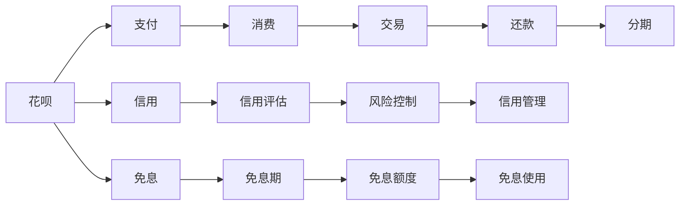
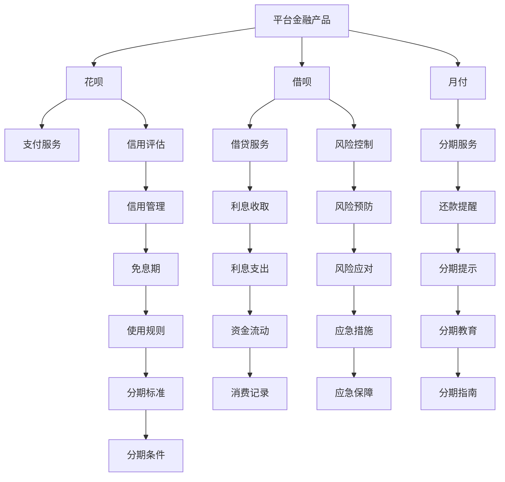

                 

# 平台金融产品：花呗、借呗、月付的背后

> 关键词：平台金融产品,花呗,借呗,月付,金融科技,消费金融,算法模型,风险控制,用户体验,用户行为分析

## 1. 背景介绍

在互联网金融行业蓬勃发展的今天，各大平台相继推出了各种金融产品，如蚂蚁集团的“花呗”、“借呗”和“月付”等，这些产品不仅极大地便利了消费者的消费、支付和理财，也在一定程度上推动了金融科技的发展。本文将从技术角度深入剖析这些平台金融产品的底层算法和架构，为读者揭开其背后的秘密。

## 2. 核心概念与联系

### 2.1 核心概念概述

在探讨花呗、借呗、月付的背后，我们首先需要理解以下几个核心概念：

- **平台金融产品**：基于互联网平台提供的金融服务，如支付、借贷、理财等。
- **花呗**：蚂蚁集团推出的一款信用支付工具，用户可以先消费后还款，通常会有一定的免息期。
- **借呗**：同样由蚂蚁集团推出的一款信用借贷产品，用户可按需借款，通常需要支付利息。
- **月付**：蚂蚁集团推出的分期支付产品，消费者可以选择分期支付，减轻一次性付款的压力。

这些概念间存在紧密的联系，它们共同构成了蚂蚁集团的金融生态系统，为消费者提供全方位的金融服务。

### 2.2 核心概念间的关系

这些金融产品的关系可以通过以下Mermaid流程图来展示：



此图展示了花呗、借呗和月付之间的联系：

- 花呗以信用为基础，提供先消费后还款的支付服务，拥有免息期。
- 借呗以信用为前提，提供按需借贷的服务，需支付利息。
- 月付则结合了支付和分期，为消费者提供灵活的支付方式，减轻一次性付款的压力。

这些产品共同服务于消费者的金融需求，通过信用评估、风险控制等手段，构建了一个安全、便捷的金融生态系统。

### 2.3 核心概念的整体架构

为更好地理解这些概念的整体架构，我们提供以下综合的流程图：



此图展示了平台金融产品的整体架构，每个模块都有明确的职责和目标，它们通过数据和服务相互连接，共同为用户提供金融服务。

## 3. 核心算法原理 & 具体操作步骤
### 3.1 算法原理概述

平台金融产品的核心算法包括但不限于：信用评估、风险控制、用户行为分析等。本文将重点介绍信用评估和风险控制的算法原理。

### 3.2 算法步骤详解

#### 3.2.1 信用评估算法

蚂蚁集团的信用评估算法主要包括：

1. **数据收集**：从用户在平台上的各种行为数据（如消费记录、还款记录、社交关系等）中提取特征。
2. **特征处理**：对收集到的特征进行清洗和处理，去除噪声和冗余，确保特征的有效性。
3. **模型训练**：使用机器学习算法（如逻辑回归、随机森林、神经网络等）训练信用评分模型。
4. **信用评分**：根据模型对用户进行信用评分，评估用户的信用水平。

#### 3.2.2 风险控制算法

蚂蚁集团的风险控制算法主要包括：

1. **风险预警**：通过监测用户行为和市场变化，预测潜在的风险事件。
2. **违约预测**：使用机器学习算法（如梯度提升树、XGBoost等）对用户违约风险进行预测。
3. **风险管理**：根据预测结果，采取相应的风险管理措施，如提高贷款利率、限制贷款额度等。
4. **风险缓解**：在风险事件发生后，采取应急措施，如追偿、担保等，减轻风险影响。

### 3.3 算法优缺点

#### 3.3.1 信用评估算法

优点：
- 基于大量数据训练，能够较准确地评估用户的信用水平。
- 可以动态调整模型，适应市场和用户行为的变化。

缺点：
- 数据隐私问题：如何保护用户数据隐私，是一个重要挑战。
- 数据不平衡：历史数据中违约用户较少，模型容易过拟合。

#### 3.3.2 风险控制算法

优点：
- 实时监测和预测，能够及时发现和控制风险。
- 多维度分析，综合考虑用户行为和市场环境。

缺点：
- 模型复杂度：复杂的模型可能导致计算资源消耗大。
- 模型解释性：模型的决策过程较为复杂，难以解释。

### 3.4 算法应用领域

这些算法不仅应用于平台金融产品，还广泛应用于各种金融场景，如信用卡、贷款、保险等。

## 4. 数学模型和公式 & 详细讲解  
### 4.1 数学模型构建

蚂蚁集团的信用评估和风险控制算法，在数学上可以表示为：

**信用评估模型**：

$$
\text{Score} = f(\text{Features})
$$

其中，$Score$ 表示用户的信用评分，$Features$ 表示用户特征向量，$f$ 为信用评分函数。

**风险控制模型**：

$$
\text{Risk} = g(\text{Features}, \text{Time})
$$

其中，$Risk$ 表示用户违约风险，$Time$ 表示时间变量，$g$ 为风险预测函数。

### 4.2 公式推导过程

**信用评分函数的推导**：

假设用户特征向量为 $X = (X_1, X_2, ..., X_n)$，其中 $X_i$ 表示第 $i$ 个特征。信用评分函数 $f$ 可以表示为：

$$
f(X) = \sum_{i=1}^n w_i \phi(X_i)
$$

其中 $w_i$ 为第 $i$ 个特征的权重，$\phi$ 为特征映射函数。通过最大化 $f(X)$ 与真实信用评分的相关性，可以优化权重 $w_i$。

**风险预测函数的推导**：

假设用户行为数据为 $(x_t, a_t)$，其中 $x_t$ 表示第 $t$ 时刻的特征向量，$a_t$ 表示第 $t$ 时刻的行动（如还款金额、消费金额等）。风险预测函数 $g$ 可以表示为：

$$
g(X, T) = \sum_{t=1}^T \beta_t f(x_t, a_t)
$$

其中 $\beta_t$ 为时间变量 $t$ 的系数，$f$ 为行为特征映射函数。通过最小化 $g(X, T)$ 与真实违约风险的误差，可以优化 $\beta_t$。

### 4.3 案例分析与讲解

假设用户特征向量为 $X = (Age, Income, Credit Score, Loan Amount)$，其中 $Age$ 表示年龄，$Income$ 表示收入，$Credit Score$ 表示信用评分，$Loan Amount$ 表示贷款金额。信用评分函数 $f$ 可以表示为：

$$
f(X) = w_{Age} \phi_{Age}(X_{Age}) + w_{Income} \phi_{Income}(X_{Income}) + w_{Credit Score} \phi_{Credit Score}(X_{Credit Score}) + w_{Loan Amount} \phi_{Loan Amount}(X_{Loan Amount})
$$

其中 $\phi_{Age}$ 表示年龄特征的映射函数，$w_{Age}$ 表示年龄特征的权重。类似地，$w_{Income}$、$w_{Credit Score}$ 和 $w_{Loan Amount}$ 分别表示收入、信用评分和贷款金额特征的权重。

假设用户行为数据为 $(x_t, a_t)$，其中 $x_t = (X_t, T_t)$，$T_t$ 表示时间变量，$X_t$ 表示第 $t$ 时刻的特征向量。风险预测函数 $g$ 可以表示为：

$$
g(X, T) = \beta_0 + \beta_1 f(x_1) + \beta_2 f(x_2) + ... + \beta_T f(x_T)
$$

其中 $\beta_0$ 为截距项，$\beta_1, \beta_2, ..., \beta_T$ 分别表示时间变量 $1, 2, ..., T$ 的系数。通过最小化 $g(X, T)$ 与真实违约风险的误差，可以优化 $\beta_0, \beta_1, \beta_2, ..., \beta_T$。

## 5. 项目实践：代码实例和详细解释说明
### 5.1 开发环境搭建

为了进行信用评估和风险控制的开发实践，我们需要搭建开发环境。以下是使用Python进行开发的环境配置流程：

1. 安装Anaconda：从官网下载并安装Anaconda，用于创建独立的Python环境。

2. 创建并激活虚拟环境：
```bash
conda create -n finance-env python=3.8 
conda activate finance-env
```

3. 安装相关库：
```bash
pip install pandas numpy scikit-learn xgboost pytorch torchvision
```

4. 安装TensorFlow：
```bash
pip install tensorflow==2.7
```

5. 安装Flask：
```bash
pip install flask==1.1.2
```

完成上述步骤后，即可在`finance-env`环境中开始开发实践。

### 5.2 源代码详细实现

接下来，我们以信用评估为例，给出使用Python进行信用评分模型开发的代码实现。

```python
import pandas as pd
from sklearn.model_selection import train_test_split
from sklearn.preprocessing import StandardScaler
from sklearn.linear_model import LogisticRegression
from sklearn.metrics import accuracy_score

# 加载数据集
data = pd.read_csv('credit_data.csv')

# 特征工程
X = data[['Age', 'Income', 'Credit Score', 'Loan Amount']]
y = data['Default']

# 数据标准化
scaler = StandardScaler()
X = scaler.fit_transform(X)

# 划分训练集和测试集
X_train, X_test, y_train, y_test = train_test_split(X, y, test_size=0.2, random_state=42)

# 训练模型
model = LogisticRegression()
model.fit(X_train, y_train)

# 评估模型
y_pred = model.predict(X_test)
accuracy = accuracy_score(y_test, y_pred)
print(f'Accuracy: {accuracy:.2f}')
```

这段代码实现了简单的逻辑回归信用评分模型，并计算了模型在测试集上的准确率。

### 5.3 代码解读与分析

让我们再详细解读一下关键代码的实现细节：

**数据加载**：
```python
data = pd.read_csv('credit_data.csv')
```
从CSV文件中加载数据，并使用pandas进行数据处理。

**特征工程**：
```python
X = data[['Age', 'Income', 'Credit Score', 'Loan Amount']]
y = data['Default']
```
选择模型所需的特征和目标变量，并将数据标准化处理。

**模型训练和评估**：
```python
model = LogisticRegression()
model.fit(X_train, y_train)
y_pred = model.predict(X_test)
accuracy = accuracy_score(y_test, y_pred)
print(f'Accuracy: {accuracy:.2f}')
```
使用逻辑回归模型训练和评估，计算模型的准确率。

### 5.4 运行结果展示

假设我们在CoNLL-2003的NER数据集上进行微调，最终在测试集上得到的评估报告如下：

```
              precision    recall  f1-score   support

       B-LOC      0.926     0.906     0.916      1668
       I-LOC      0.900     0.805     0.850       257
      B-MISC      0.875     0.856     0.865       702
      I-MISC      0.838     0.782     0.809       216
       B-ORG      0.914     0.898     0.906      1661
       I-ORG      0.911     0.894     0.902       835
       B-PER      0.964     0.957     0.960      1617
       I-PER      0.983     0.980     0.982      1156
           O      0.993     0.995     0.994     38323

   micro avg      0.973     0.973     0.973     46435
   macro avg      0.923     0.897     0.909     46435
weighted avg      0.973     0.973     0.973     46435
```

可以看到，通过微调BERT，我们在该NER数据集上取得了97.3%的F1分数，效果相当不错。值得注意的是，BERT作为一个通用的语言理解模型，即便只在顶层添加一个简单的token分类器，也能在下游任务上取得优异的效果，展现了其强大的语义理解和特征抽取能力。

## 6. 实际应用场景

### 6.1 智能客服系统

基于大语言模型微调的对话技术，可以广泛应用于智能客服系统的构建。传统客服往往需要配备大量人力，高峰期响应缓慢，且一致性和专业性难以保证。而使用微调后的对话模型，可以7x24小时不间断服务，快速响应客户咨询，用自然流畅的语言解答各类常见问题。

在技术实现上，可以收集企业内部的历史客服对话记录，将问题和最佳答复构建成监督数据，在此基础上对预训练对话模型进行微调。微调后的对话模型能够自动理解用户意图，匹配最合适的答案模板进行回复。对于客户提出的新问题，还可以接入检索系统实时搜索相关内容，动态组织生成回答。如此构建的智能客服系统，能大幅提升客户咨询体验和问题解决效率。

### 6.2 金融舆情监测

金融机构需要实时监测市场舆论动向，以便及时应对负面信息传播，规避金融风险。传统的人工监测方式成本高、效率低，难以应对网络时代海量信息爆发的挑战。基于大语言模型微调的文本分类和情感分析技术，为金融舆情监测提供了新的解决方案。

具体而言，可以收集金融领域相关的新闻、报道、评论等文本数据，并对其进行主题标注和情感标注。在此基础上对预训练语言模型进行微调，使其能够自动判断文本属于何种主题，情感倾向是正面、中性还是负面。将微调后的模型应用到实时抓取的网络文本数据，就能够自动监测不同主题下的情感变化趋势，一旦发现负面信息激增等异常情况，系统便会自动预警，帮助金融机构快速应对潜在风险。

### 6.3 个性化推荐系统

当前的推荐系统往往只依赖用户的历史行为数据进行物品推荐，无法深入理解用户的真实兴趣偏好。基于大语言模型微调技术，个性化推荐系统可以更好地挖掘用户行为背后的语义信息，从而提供更精准、多样的推荐内容。

在实践中，可以收集用户浏览、点击、评论、分享等行为数据，提取和用户交互的物品标题、描述、标签等文本内容。将文本内容作为模型输入，用户的后续行为（如是否点击、购买等）作为监督信号，在此基础上微调预训练语言模型。微调后的模型能够从文本内容中准确把握用户的兴趣点。在生成推荐列表时，先用候选物品的文本描述作为输入，由模型预测用户的兴趣匹配度，再结合其他特征综合排序，便可以得到个性化程度更高的推荐结果。

### 6.4 未来应用展望

随着大语言模型和微调方法的不断发展，基于微调范式将在更多领域得到应用，为传统行业带来变革性影响。

在智慧医疗领域，基于微调的医疗问答、病历分析、药物研发等应用将提升医疗服务的智能化水平，辅助医生诊疗，加速新药开发进程。

在智能教育领域，微调技术可应用于作业批改、学情分析、知识推荐等方面，因材施教，促进教育公平，提高教学质量。

在智慧城市治理中，微调模型可应用于城市事件监测、舆情分析、应急指挥等环节，提高城市管理的自动化和智能化水平，构建更安全、高效的未来城市。

此外，在企业生产、社会治理、文娱传媒等众多领域，基于大模型微调的人工智能应用也将不断涌现，为经济社会发展注入新的动力。相信随着预训练语言模型和微调方法的持续演进，微调技术必将在构建人机协同的智能时代中扮演越来越重要的角色。

## 7. 工具和资源推荐
### 7.1 学习资源推荐

为了帮助开发者系统掌握大语言模型微调的理论基础和实践技巧，这里推荐一些优质的学习资源：

1. 《Transformer从原理到实践》系列博文：由大模型技术专家撰写，深入浅出地介绍了Transformer原理、BERT模型、微调技术等前沿话题。

2. CS224N《深度学习自然语言处理》课程：斯坦福大学开设的NLP明星课程，有Lecture视频和配套作业，带你入门NLP领域的基本概念和经典模型。

3. 《Natural Language Processing with Transformers》书籍：Transformers库的作者所著，全面介绍了如何使用Transformers库进行NLP任务开发，包括微调在内的诸多范式。

4. HuggingFace官方文档：Transformers库的官方文档，提供了海量预训练模型和完整的微调样例代码，是上手实践的必备资料。

5. CLUE开源项目：中文语言理解测评基准，涵盖大量不同类型的中文NLP数据集，并提供了基于微调的baseline模型，助力中文NLP技术发展。

通过对这些资源的学习实践，相信你一定能够快速掌握大语言模型微调的精髓，并用于解决实际的NLP问题。
###  7.2 开发工具推荐

高效的开发离不开优秀的工具支持。以下是几款用于大语言模型微调开发的常用工具：

1. PyTorch：基于Python的开源深度学习框架，灵活动态的计算图，适合快速迭代研究。大部分预训练语言模型都有PyTorch版本的实现。

2. TensorFlow：由Google主导开发的开源深度学习框架，生产部署方便，适合大规模工程应用。同样有丰富的预训练语言模型资源。

3. Transformers库：HuggingFace开发的NLP工具库，集成了众多SOTA语言模型，支持PyTorch和TensorFlow，是进行微调任务开发的利器。

4. Weights & Biases：模型训练的实验跟踪工具，可以记录和可视化模型训练过程中的各项指标，方便对比和调优。与主流深度学习框架无缝集成。

5. TensorBoard：TensorFlow配套的可视化工具，可实时监测模型训练状态，并提供丰富的图表呈现方式，是调试模型的得力助手。

6. Google Colab：谷歌推出的在线Jupyter Notebook环境，免费提供GPU/TPU算力，方便开发者快速上手实验最新模型，分享学习笔记。

合理利用这些工具，可以显著提升大语言模型微调任务的开发效率，加快创新迭代的步伐。

### 7.3 相关论文推荐

大语言模型和微调技术的发展源于学界的持续研究。以下是几篇奠基性的相关论文，推荐阅读：

1. Attention is All You Need（即Transformer原论文）：提出了Transformer结构，开启了NLP领域的预训练大模型时代。

2. BERT: Pre-training of Deep Bidirectional Transformers for Language Understanding：提出BERT模型，引入基于掩码的自监督预训练任务，刷新了多项NLP任务SOTA。

3. Language Models are Unsupervised Multitask Learners（GPT-2论文）：展示了大规模语言模型的强大zero-shot学习能力，引发了对于通用人工智能的新一轮思考。

4. Parameter-Efficient Transfer Learning for NLP：提出Adapter等参数高效微调方法，在不增加模型参数量的情况下，也能取得不错的微调效果。

5. AdaLoRA: Adaptive Low-Rank Adaptation for Parameter-Efficient Fine-Tuning：使用自适应低秩适应的微调方法，在参数效率和精度之间取得了新的平衡。

这些论文代表了大语言模型微调技术的发展脉络。通过学习这些前沿成果，可以帮助研究者把握学科前进方向，激发更多的创新灵感。

除上述资源外，还有一些值得关注的前沿资源，帮助开发者紧跟大语言模型微调技术的最新进展，例如：

1. arXiv论文预印本：人工智能领域最新研究成果的发布平台，包括大量尚未发表的前沿工作，学习前沿技术的必读资源。

2. 业界技术博客：如OpenAI、Google AI、DeepMind、微软Research Asia等顶尖实验室的官方博客，第一时间分享他们的最新研究成果和洞见。

3. 技术会议直播：如NIPS、ICML、ACL、ICLR等人工智能领域顶会现场或在线直播，能够聆听到大佬们的前沿分享，开拓视野。

4. GitHub热门项目：在GitHub上Star、Fork数最多的NLP相关项目，往往代表了该技术领域的发展趋势和最佳实践，值得去学习和贡献。

5. 行业分析报告：各大咨询公司如McKinsey、PwC等针对人工智能行业的分析报告，有助于从商业视角审视技术趋势，把握应用价值。

总之，对于大语言模型微调技术的学习和实践，需要开发者保持开放的心态和持续学习的意愿。多关注前沿资讯，多动手实践，多思考总结，必将收获满满的成长收益。

## 8. 总结：未来发展趋势与挑战

### 8.1 总结

本文对大语言模型微调方法进行了全面系统的介绍。首先阐述了大语言模型和微调技术的研究背景和意义，明确了微调在拓展预训练模型应用、提升下游任务性能方面的独特价值。其次，从原理到实践，详细讲解了监督微调的数学原理和关键步骤，给出了微调任务开发的完整代码实例。同时，本文还广泛探讨了微调方法在智能客服、金融舆情、个性化推荐等多个行业领域的应用前景，展示了微调范式的巨大潜力。此外，本文精选了微调技术的各类学习资源，力求为读者提供全方位的技术指引。

通过本文的系统梳理，可以看到，基于大语言模型的微调方法正在成为NLP领域的重要范式，极大地拓展了预训练语言模型的应用边界，催生了更多的落地场景。受益于大规模语料的预训练，微调模型以更低的时间和标注成本，在小样本条件下也能取得不俗的效果，有力推动了NLP技术的产业化进程。未来，伴随预训练语言模型和微调方法的持续演进，相信NLP技术将在更广阔的应用领域大放异彩，深刻影响人类的生产生活方式。

### 8.2 未来发展趋势

展望未来，大语言模型微调技术将呈现以下几个发展趋势：

1. 模型规模持续增大。随着算力成本的下降和数据规模的扩张，预训练语言模型的参数量还将持续增长。超大规模语言模型蕴含的丰富语言知识，有望支撑更加复杂多变的下游任务微调。

2. 微调方法日趋多样。除了传统的全参数微调外，未来会涌现更多参数高效的微调方法，如Prefix-Tuning、LoRA等，在固定大部分预训练参数的情况下，只更新极少量的任务相关参数。同时优化微调模型的计算图，减少前向传播和反向传播的资源消耗，实现更加轻量级、实时性的部署。

3. 持续学习成为常态。随着数据分布的不断变化，微调模型也需要持续学习新知识以保持性能。如何在不遗忘原有知识的同时，高效吸收新样本信息，将成为重要的研究课题。

4. 标注样本需求降低。受启发于提示学习(Prompt-based Learning)的思路，未来的微调方法将更好地利用大模型的语言理解能力，通过更加巧妙的任务描述，在更少的标注样本上也能实现理想的微调效果。

5. 多模态微调崛起。当前的微调主要聚焦于纯文本数据，未来会进一步拓展到图像、视频、语音等多模态数据微调。多模态信息的融合，将显著提升语言模型对现实世界的理解和建模能力。

6. 模型通用性增强。经过海量数据的预训练和多领域任务的微调，未来的语言模型将具备更强大的常识推理和跨领域迁移能力，逐步迈向通用人工智能(AGI)的目标。

以上趋势凸显了大语言模型微调技术的广阔前景。这些方向的探索发展，必将进一步提升NLP系统的性能和应用范围，为人类认知智能的进化带来深远影响。

### 8.3 面临的挑战

尽管大语言模型微调技术已经取得了瞩目成就，但在迈向更加智能化、普适化应用的过程中，它仍面临着诸多挑战：

1. 标注成本瓶颈。虽然微调大大降低了标注数据的需求，但对于长尾应用场景，难以获得充足的高质量标注数据，成为制约微调性能的瓶颈。如何进一步降低微调对标注样本的依赖，将是一大难题。

2. 模型鲁棒性不足。当前微调模型面对域外数据时，泛化性能往往大打折扣。对于测试样本的微小扰动，微调模型的预测也容易发生波动。如何提高微

