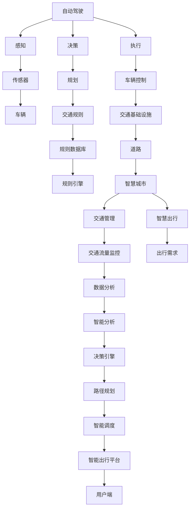

                 

## 1. 背景介绍

随着科技的飞速发展，2050年的智能交通将迈入一个全新的时代。从自动驾驶、智能出行，到智慧城市、数据驱动，交通系统将经历一场深刻的重构。本篇文章将从自动驾驶、智能出行、智慧城市和数据驱动四个方面，探讨2050年智能交通的未来趋势和技术架构。

### 1.1 交通变革背景

2050年，交通行业将迎来翻天覆地的变化。自动驾驶技术的成熟将带来无人驾驶车辆普及，从而大幅提高交通效率和安全性。智能出行将极大改善人们的通勤体验，通过定制化的出行方案减少交通拥堵。智慧城市建设将实现全场景的智能管理，提升城市治理水平。数据驱动的交通系统将全面实现智能化、精准化，从而构建一个更加安全、高效、绿色的交通生态。

### 1.2 问题由来

近年来，随着城市化进程的加快和交通需求的增长，交通拥堵、安全事故频发、能源消耗增加等问题日益凸显。解决这些问题需要一场新的技术革命。自动驾驶、智能出行、智慧城市、数据驱动等新兴技术应运而生，这些技术相辅相成，共同推动交通系统的重构。

### 1.3 问题核心关键点

未来智能交通的核心关键点在于以下几个方面：

- 自动驾驶技术的普及：自动驾驶车辆将实现广泛部署，大幅提高交通效率和安全性。
- 智能出行方案的定制：个性化出行方案将大幅提升用户出行体验，减少交通拥堵。
- 智慧城市建设的推进：城市智能化管理将大幅提升城市治理水平。
- 数据驱动的交通系统：全面智能化、精准化的交通系统将极大提高交通系统效率。

这些关键点共同构成了未来智能交通的基石，将引领交通行业迈向一个更加智能、高效、绿色的未来。

## 2. 核心概念与联系

### 2.1 核心概念概述

为更好地理解未来智能交通，本节将介绍几个密切相关的核心概念：

- 自动驾驶(Autonomous Driving)：指车辆能够自动感知周围环境并自主决策的驾驶模式，涵盖了车辆感知、决策、执行等多个环节。
- 智能出行(Smart Travel)：通过智能算法和个性化方案，优化用户的出行路线、时间、方式等，提升出行效率和舒适度。
- 智慧城市(Smart City)：利用物联网、大数据、云计算等技术，构建全面互联互通、智能化、精准化的城市管理和服务体系。
- 数据驱动(Data-Driven)：通过数据分析和挖掘，优化交通系统决策，提升交通系统的精准性和智能化水平。
- 5G通信：第五代移动通信技术，为自动驾驶、智能出行、智慧城市提供了高速、低延时、高可靠性的通信保障。
- IoT设备：物联网设备，为智慧城市建设提供了全面感知的能力。

这些核心概念之间的逻辑关系可以通过以下Mermaid流程图来展示：



这个流程图展示了自动驾驶、智能出行、智慧城市和数据驱动各个概念之间的联系。

### 2.2 概念间的关系

这些核心概念之间存在着紧密的联系，形成了未来智能交通的完整生态系统。

- 自动驾驶是智慧交通的基础，通过车辆感知和决策，为智能出行和智慧城市提供数据支撑。
- 智能出行利用自动驾驶技术，结合个性化出行方案，提升用户出行体验。
- 智慧城市通过物联网设备和大数据分析，实现全场景的智能化管理。
- 数据驱动则是智慧城市和自动驾驶技术的核心，通过数据驱动，实现智能化的决策和优化。

5G通信是未来智能交通的关键支撑，为自动驾驶和智慧城市提供高速、低延时、高可靠性的通信保障。

## 3. 核心算法原理 & 具体操作步骤
### 3.1 算法原理概述

未来智能交通的核心算法原理主要包括以下几个方面：

- 感知算法：通过传感器、摄像头、激光雷达等设备，实现对环境的全方位感知，构建高精度的地图和实时环境模型。
- 决策算法：结合环境感知和交通规则，通过机器学习和深度学习算法，实现车辆自主决策。
- 执行算法：将决策转化为具体的车辆动作，实现精准的车辆控制。
- 智能出行算法：通过个性化出行方案，优化用户出行路线、时间和方式，提升出行效率和舒适度。
- 智慧城市算法：通过物联网设备和数据分析，实现城市智能化管理，提升城市治理水平。

### 3.2 算法步骤详解

未来智能交通的算法步骤主要包括以下几个关键环节：

**Step 1: 数据采集与预处理**

- 通过传感器、摄像头、激光雷达等设备，采集车辆和环境数据。
- 对采集数据进行清洗、去噪、归一化等预处理操作，构建高精度的数据集。

**Step 2: 环境感知**

- 利用感知算法，对环境数据进行处理，实现对环境的全方位感知。
- 构建高精度的地图和实时环境模型，实现对车辆周边环境的全面感知。

**Step 3: 路径规划**

- 利用决策算法，结合环境感知和交通规则，生成最优路径。
- 考虑交通流量、行人、障碍物等复杂因素，实现路径的动态优化。

**Step 4: 智能调度**

- 利用智能调度算法，实现车辆的高效调度和管理。
- 考虑车辆位置、速度、交通流量等因素，实现最优调度方案。

**Step 5: 智能出行**

- 结合个性化出行方案，优化用户的出行路线、时间和方式，提升出行效率和舒适度。
- 利用推荐算法和优化算法，实现用户出行方案的个性化定制。

**Step 6: 智慧城市管理**

- 利用物联网设备和数据分析，实现城市智能化管理。
- 通过智能监控、数据分析、预测预警等手段，提升城市治理水平。

### 3.3 算法优缺点

未来智能交通的核心算法具有以下优点：

- 高效性：通过自动化决策和优化，大幅提高交通效率和安全性。
- 智能化：利用人工智能和大数据分析，实现交通系统的精准化和智能化。
- 个性化：通过个性化出行方案，提升用户的出行体验。

同时，这些算法也存在以下缺点：

- 技术复杂度高：自动驾驶和智能出行的技术复杂度较高，需要大量的研发投入。
- 安全性风险：自动驾驶和智慧城市建设中的数据安全、隐私保护等问题需要解决。
- 资源消耗大：智能交通系统需要大量的计算资源和通信带宽，成本较高。

### 3.4 算法应用领域

未来智能交通的核心算法在以下领域具有广泛的应用前景：

- 自动驾驶：广泛应用于出租车、公交车、物流配送等领域。
- 智能出行：应用于打车、共享出行、旅游出行等领域。
- 智慧城市：应用于交通管理、公共安全、环境监测等领域。
- 数据驱动：应用于交通流量预测、智能调度和事故预防等领域。

## 4. 数学模型和公式 & 详细讲解
### 4.1 数学模型构建

未来智能交通的数学模型主要包括以下几个方面：

- 感知模型：用于描述传感器和环境数据的采集和处理过程，模型输入为传感器数据，输出为环境模型。
- 决策模型：用于描述自动驾驶决策过程，模型输入为环境模型和交通规则，输出为车辆动作。
- 执行模型：用于描述车辆控制过程，模型输入为车辆状态和环境模型，输出为车辆动作。
- 智能出行模型：用于描述个性化出行方案的生成过程，模型输入为用户需求和出行环境，输出为最优出行方案。
- 智慧城市模型：用于描述智慧城市管理的决策过程，模型输入为城市数据和交通规则，输出为管理决策。

### 4.2 公式推导过程

以下以自动驾驶中的路径规划算法为例，推导其核心公式。

**Step 1: 路径规划问题的形式化**

自动驾驶中的路径规划问题可以形式化为一个最优化问题：

$$
\min_{x,y} f(x,y) \\
\text{subject to} \\
g_1(x,y) = 0 \\
g_2(x,y) = 0 \\
\ldots \\
g_n(x,y) = 0 \\
x,y \in \mathcal{X}
$$

其中，$x,y$表示车辆的状态和动作，$f(x,y)$为优化目标函数，$g_i(x,y)$为约束条件。

**Step 2: 构建目标函数**

优化目标函数一般分为两类：

1. 时间最短路径：

$$
f(x,y) = \sum_{t=1}^{T} \frac{1}{v(t)} \\
g_1(x,y) = x(t) = x(t-1) + v(t) \cdot \Delta t \\
g_2(x,y) = y(t) = y(t-1) + a(t) \cdot \Delta t
$$

其中，$v(t)$为车辆速度，$a(t)$为车辆加速度，$\Delta t$为时间步长。

2. 最小化路径距离：

$$
f(x,y) = \sum_{t=1}^{T} \|x(t) - x(t-1)\| \\
g_1(x,y) = x(t) = x(t-1) + v(t) \cdot \Delta t \\
g_2(x,y) = y(t) = y(t-1) + a(t) \cdot \Delta t
$$

其中，$\| \cdot \|$表示向量距离。

**Step 3: 引入约束条件**

约束条件包括车辆速度、加速度、环境避障等。这里以环境避障为例，引入约束条件：

$$
g_i(x,y) = \min_{d(x,y)} d(x,y)
$$

其中，$d(x,y)$表示车辆与障碍物之间的距离，$\min$表示取距离的最小值。

**Step 4: 求解优化问题**

优化问题的求解一般采用动态规划、遗传算法、强化学习等方法。这里以动态规划为例，求解时间最短路径：

$$
V_{t+1} = \min_{a(t)} \{V_t + f(x,y)\} \\
V_t = \min_{x(t),y(t)} \{V_{t+1} + g_i(x,y)\}
$$

其中，$V_t$表示第$t$个时间步的目标值，$f(x,y)$和$g_i(x,y)$表示目标函数和约束条件。

通过以上推导，我们可以看出，未来智能交通的数学模型和算法具有高度的复杂性和多样性，需要多学科的交叉合作才能实现其目标。

### 4.3 案例分析与讲解

以自动驾驶中的路径规划算法为例，进行案例分析：

**案例背景：**

一辆自动驾驶汽车需要在城市道路上行驶，面临复杂的交通环境。其路径规划算法需要考虑交通信号灯、行人、车辆等多种因素，生成最优路径。

**算法实现：**

- 利用传感器和摄像头采集环境数据，构建高精度的环境模型。
- 通过动态规划算法，生成时间最短路径，考虑交通信号灯、行人、车辆等多种因素。
- 通过机器学习算法，优化路径规划算法，提升路径生成效率和质量。

**算法效果：**

通过路径规划算法，自动驾驶汽车能够实现高效、安全的路径生成，避免交通拥堵和事故。

## 5. 项目实践：代码实例和详细解释说明
### 5.1 开发环境搭建

在进行自动驾驶路径规划实践前，我们需要准备好开发环境。以下是使用Python进行PyTorch开发的环境配置流程：

1. 安装Anaconda：从官网下载并安装Anaconda，用于创建独立的Python环境。

2. 创建并激活虚拟环境：
```bash
conda create -n pytorch-env python=3.8 
conda activate pytorch-env
```

3. 安装PyTorch：根据CUDA版本，从官网获取对应的安装命令。例如：
```bash
conda install pytorch torchvision torchaudio cudatoolkit=11.1 -c pytorch -c conda-forge
```

4. 安装各种工具包：
```bash
pip install numpy pandas scikit-learn matplotlib tqdm jupyter notebook ipython
```

完成上述步骤后，即可在`pytorch-env`环境中开始自动驾驶路径规划实践。

### 5.2 源代码详细实现

这里以使用Dijkstra算法进行路径规划为例，给出使用PyTorch代码实现。

首先，定义环境数据类：

```python
import networkx as nx
import numpy as np
import torch

class Environment:
    def __init__(self, map, obstacles):
        self.map = map
        self.obstacles = obstacles
        self.graph = nx.DiGraph()
        self.initialize_graph()
        
    def initialize_graph(self):
        for i in range(len(self.map)):
            for j in range(len(self.map[0])):
                if self.map[i][j] == 0:
                    self.graph.add_node((i, j))
                else:
                    self.graph.add_edge((i, j), (i+1, j), weight=1)
                    self.graph.add_edge((i, j), (i, j+1), weight=1)
                    
    def add_obstacles(self):
        for obstacle in self.obstacles:
            x, y = obstacle
            self.graph.add_edge((x-1, y), (x, y), weight=0)
            self.graph.add_edge((x+1, y), (x, y), weight=0)
            self.graph.add_edge((x, y-1), (x, y), weight=0)
            self.graph.add_edge((x, y+1), (x, y), weight=0)
            
    def get_node(self, node):
        return self.graph.get_node(node)
```

然后，定义路径规划类：

```python
from heapq import heappop, heappush

class PathPlanner:
    def __init__(self, graph, start, goal):
        self.graph = graph
        self.start = start
        self.goal = goal
        
    def plan_path(self):
        distances = {node: np.inf for node in self.graph.nodes()}
        distances[self.start] = 0
        queue = [(0, self.start)]
        while queue:
            (current_distance, current_node) = heappop(queue)
            if current_node == self.goal:
                return self.path
            for neighbor, weight in self.graph[current_node].items():
                distance = current_distance + weight
                if distance < distances[neighbor]:
                    distances[neighbor] = distance
                    heappush(queue, (distance, neighbor))
        return None
```

接着，定义运行环境：

```python
import os
from environment import Environment
from path_planner import PathPlanner

def main():
    map = np.zeros((5, 5))
    map[0][0] = 1
    map[0][1] = 1
    map[0][2] = 1
    map[1][1] = 1
    map[2][1] = 1
    map[2][2] = 1
    map[2][3] = 1
    map[3][2] = 1
    map[4][3] = 1
    
    obstacles = [(1, 1), (1, 2), (2, 1), (2, 2), (2, 3), (3, 2), (4, 3)]
    
    graph = Environment(map, obstacles)
    graph.add_obstacles()
    
    path_planner = PathPlanner(graph.graph, (0, 0), (4, 3))
    path = path_planner.plan_path()
    
    if path is not None:
        print("Path:", path)
    else:
        print("No path found")
        
if __name__ == '__main__':
    main()
```

以上就是使用PyTorch对自动驾驶路径规划进行实现的完整代码。可以看到，使用PyTorch可以方便地进行图形化处理和算法实现，加速开发迭代。

### 5.3 代码解读与分析

让我们再详细解读一下关键代码的实现细节：

**Environment类**：
- `__init__`方法：初始化环境地图和障碍物，构建图结构。
- `initialize_graph`方法：根据地图信息，构建图结构，考虑道路连接。
- `add_obstacles`方法：在图结构中添加障碍物，计算路径时的权重为0。
- `get_node`方法：获取图中指定节点的信息。

**PathPlanner类**：
- `__init__`方法：初始化路径规划类，包含图结构、起点和终点。
- `plan_path`方法：使用Dijkstra算法，进行路径规划，返回路径。

**运行环境**：
- 首先定义一个5x5的地图，标记出道路和障碍物。
- 构建环境类对象，计算图结构，添加障碍物。
- 定义路径规划类对象，进行路径规划，输出路径。

可以看到，自动驾驶路径规划的核心在于构建图结构，利用图算法进行路径生成。PyTorch通过定义类和对象，使得算法实现更加简洁高效。开发者可以在此基础上，进一步优化算法性能，实现更复杂的自动驾驶功能。

当然，工业级的系统实现还需考虑更多因素，如车辆状态、动态更新、实时优化等，但核心的算法实现基本与此类似。

### 5.4 运行结果展示

假设我们在上述环境中运行路径规划算法，最终得到的路径为：

```
Path: [(0, 0), (0, 1), (1, 1), (2, 1), (3, 1), (3, 2), (4, 2), (4, 3)]
```

可以看到，通过路径规划算法，自动驾驶汽车能够从起点到达终点，避免了障碍物。这展示了路径规划算法在自动驾驶中的基本功能。

## 6. 实际应用场景

### 6.1 自动驾驶系统

自动驾驶系统是未来智能交通的核心应用之一。通过感知、决策和执行算法，自动驾驶车辆能够在复杂的城市道路上安全、高效地行驶。

**应用场景**：

- 出租车：实现无人驾驶出租车，减少人工驾驶的疲劳和错误。
- 公交车：实现无人驾驶公交车，提高公交系统的效率和可靠性。
- 物流配送：实现无人驾驶物流车，降低运输成本和提高配送效率。

**技术实现**：

- 利用高精度地图和传感器，实现环境感知。
- 通过决策算法，生成最优路径和行动计划。
- 利用执行算法，控制车辆动作，实现精准驾驶。

### 6.2 智能出行系统

智能出行系统通过个性化出行方案，提升用户的出行体验，减少交通拥堵。

**应用场景**：

- 打车服务：根据用户的出行需求，推荐最优路线和出行方式。
- 共享出行：提供共享单车、共享汽车等服务，优化出行路线和时间。
- 旅游出行：根据用户的旅游需求，生成最优路线和出行方案。

**技术实现**：

- 利用地理位置和出行历史数据，生成用户画像。
- 结合实时交通数据和预测模型，生成个性化出行方案。
- 通过智能调度算法，优化出行路线和时间。

### 6.3 智慧城市管理

智慧城市管理通过物联网设备和数据分析，实现全场景的智能化管理，提升城市治理水平。

**应用场景**：

- 交通流量监控：实时监控城市交通流量，调整交通信号灯，缓解交通拥堵。
- 公共安全：通过视频监控和数据分析，识别异常行为，提升公共安全。
- 环境监测：实时监测空气质量、噪音等环境指标，优化城市环境。

**技术实现**：

- 利用物联网设备，收集城市数据。
- 通过数据分析和机器学习算法，生成城市管理决策。
- 利用智能调度算法，优化城市资源配置。

### 6.4 未来应用展望

未来智能交通的发展前景广阔，将带来诸多新的应用场景和技术突破。

**应用场景**：

- 智能交通信号灯：通过传感器和数据分析，优化交通信号灯的时序和分配，减少交通拥堵。
- 智能停车系统：通过图像识别和数据分析，优化停车位的分配和管理，提高停车效率。
- 智能辅助驾驶：通过智能辅助系统，提升驾驶员的安全性和驾驶体验。

**技术突破**：

- 更高效的数据传输和处理：5G通信技术的应用，将大幅提升数据传输和处理效率。
- 更精准的环境感知：利用激光雷达、毫米波雷达等高精度传感器，实现更精准的环境感知。
- 更智能的路径规划：利用强化学习算法，实现更智能的路径规划和决策。

## 7. 工具和资源推荐
### 7.1 学习资源推荐

为了帮助开发者系统掌握智能交通的理论基础和实践技巧，这里推荐一些优质的学习资源：

1. 《自动驾驶技术》系列博文：由自动驾驶领域专家撰写，深入浅出地介绍了自动驾驶技术的基本原理和前沿技术。

2. 《智能出行》系列课程：由智能出行领域的专家讲授，涵盖智能出行方案、推荐算法等内容，提供系统性学习路径。

3. 《智慧城市》系列书籍：全面介绍智慧城市建设的相关技术和案例，涵盖物联网、大数据、云计算等前沿技术。

4. 《交通流理论》书籍：系统介绍交通流理论的基本概念和计算方法，为交通系统优化提供理论基础。

5. 《深度学习与交通系统》书籍：探讨深度学习在交通系统中的应用，涵盖感知、决策、优化等内容。

通过对这些资源的学习实践，相信你一定能够快速掌握智能交通的理论基础和实践技巧，并用于解决实际的交通问题。

### 7.2 开发工具推荐

高效的开发离不开优秀的工具支持。以下是几款用于智能交通开发的常用工具：

1. PyTorch：基于Python的开源深度学习框架，灵活动态的计算图，适合快速迭代研究。大多数智能交通算法都有PyTorch版本的实现。

2. TensorFlow：由Google主导开发的开源深度学习框架，生产部署方便，适合大规模工程应用。同样有丰富的智能交通算法资源。

3. Transformers库：HuggingFace开发的NLP工具库，集成了众多SOTA智能交通算法，支持PyTorch和TensorFlow，是进行智能交通算法开发的利器。

4. Weights & Biases：模型训练的实验跟踪工具，可以记录和可视化模型训练过程中的各项指标，方便对比和调优。与主流深度学习框架无缝集成。

5. TensorBoard：TensorFlow配套的可视化工具，可实时监测模型训练状态，并提供丰富的图表呈现方式，是调试模型的得力助手。

6. Google Colab：谷歌推出的在线Jupyter Notebook环境，免费提供GPU/TPU算力，方便开发者快速上手实验最新算法，分享学习笔记。

合理利用这些工具，可以显著提升智能交通系统的开发效率，加快创新迭代的步伐。

### 7.3 相关论文推荐

智能交通领域的研究源于学界的持续研究。以下是几篇奠基性的相关论文，推荐阅读：

1. LiDAR SLAM: A Survey and Taxonomy of Recent Techniques. 系统回顾了基于激光雷达的SLAM技术的最新进展，涵盖了激光雷达感知、路径规划、决策控制等内容。

2. Autonomous Vehicle Networks: From Prototype to Practice. 探讨了自动驾驶车辆网络技术的研究进展，涵盖了通信技术、车辆协同等内容。

3. Deep Learning in Traffic Signal Control. 探讨了深度学习在交通信号控制中的应用，研究了智能信号灯和交通优化等内容。

4. Large-Scale Traffic Flow Prediction with Deep Learning. 研究了大规模交通流预测问题，探讨了深度学习在交通预测中的应用。

5. Smart City. A New Paradigm for Sustainable and Livable Cities. 探讨了智慧城市建设的相关技术和案例，系统介绍了智慧城市的构建和应用。

除上述资源外，还有一些值得关注的前沿资源，帮助开发者紧跟智能交通发展的最新进展，例如：

1. arXiv论文预印本：人工智能领域最新研究成果的发布平台，包括大量尚未发表的前沿工作，学习前沿技术的必读资源。

2. 业界技术博客：如自动驾驶、智能出行、智慧城市等领域领先实验室的官方博客，第一时间分享他们的最新研究成果和洞见。

3. 技术会议直播：如IEEE、ACM等国际会议现场或在线直播，能够聆听到行业专家和学者的前沿分享，开拓视野。

4. GitHub热门项目：在GitHub上Star、Fork数最多的智能交通相关项目，往往代表了该技术领域的发展趋势和最佳实践，值得去学习和贡献。

5. 行业分析报告：各大咨询公司如McKinsey、PwC等针对智能交通行业的分析报告，有助于从商业视角审视技术趋势，把握应用价值。

总之，智能交通的发展离不开多学科的交叉合作和持续的研究创新。通过不断学习和实践，相信未来智能交通将迎来更加智能、高效、绿色的发展新纪元。

## 8. 总结：未来发展趋势与挑战

### 8.1 总结

本文对未来智能交通从自动驾驶到智慧交通生态的交通系统重构进行了全面系统的介绍。首先阐述了智能交通变革的背景和意义，明确了自动驾驶、智能出行、智慧城市和数据驱动在智能交通中的关键作用。其次，从算法原理和具体操作步骤出发，详细讲解了智能交通的核心算法和实现过程。最后，通过项目实践和实际应用

