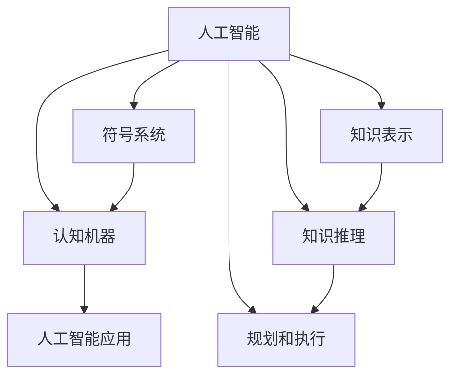

                 

# 1956年达特茅斯会议的豪迈宣言

## 1. 背景介绍

在计算机技术飞速发展的今天，人工智能（AI）早已不再是遥不可及的未来梦想，而成为了我们生活中不可或缺的一部分。从语音助手、面部识别，到自动驾驶、智能推荐，AI技术在各行各业中的应用无处不在，深刻影响着人类的生活和工作方式。

但这一切的背后，其实可以追溯到60多年前的1956年达特茅斯会议，这场会议被公认为是人工智能的开端。它不仅确立了人工智能作为独立学科的地位，还引发了持续至今的科技浪潮，推动了计算机科学和工程学科的蓬勃发展。

1956年8月，在美国新罕布什尔州达特茅斯学院召开的会议上，约翰·麦卡锡、克劳德·香农、纳撒尼尔·罗切斯特、马文·明斯基等人汇聚一堂，共同讨论和推动人工智能的发展。这次会议的宣言不仅是学术界的一场盛会，更是一个宏大的豪迈宣言，标志着人工智能的诞生。

今天，我们回顾这场历史性的会议，希望能更好地理解人工智能的本质，展望未来科技发展的方向。

## 2. 核心概念与联系

### 2.1 核心概念概述

为了更好地理解达特茅斯会议的宣言，本节将介绍几个核心概念：

- **人工智能（Artificial Intelligence, AI）**：指通过计算机程序实现人类智能行为的学科和应用领域。人工智能旨在模拟和扩展人类的认知能力，解决复杂问题，提升人类生活质量。

- **认知机器（Cognitive Machines）**：具备模仿人类智能活动的计算机系统，包括感知、推理、学习、记忆等功能。

- **符号系统（Symbolic Systems）**：通过符号和规则进行计算和推理的系统，通常用于知识表示和逻辑推理。

- **知识表示（Knowledge Representation）**：将知识结构化地表示为符号形式，以便计算机理解和操作。

- **知识推理（Knowledge Reasoning）**：基于知识库中的规则和事实，进行推理和推断，得出新的结论和结论。

- **规划和执行（Planning and Execution）**：制定计划并指导机器执行步骤，实现目标。

这些概念通过相互作用，形成了人工智能的基本框架，旨在构建能够模拟人类智能的机器系统。达特茅斯会议的宣言中，这些概念被视为实现认知机器的基石。

### 2.2 概念间的关系

这些核心概念之间的关系可以通过以下Mermaid流程图来展示：



这个流程图展示了大人工智能框架下的几个关键概念，以及它们之间的关系：

1. **人工智能** 是整个框架的顶层，它涵盖并协调其他概念，实现智能行为。
2. **认知机器** 是人工智能的实际应用目标，通过符号系统、知识表示、知识推理、规划和执行等子系统，模拟人类智能活动。
3. **符号系统**、**知识表示**、**知识推理**、**规划和执行** 是实现认知机器的四个主要子系统。

这些概念共同构成了人工智能的基本架构，达特茅斯会议的宣言强调了它们的重要性和相互关系，奠定了现代人工智能的发展基础。

## 3. 核心算法原理 & 具体操作步骤

### 3.1 算法原理概述

达特茅斯会议的宣言中，麦卡锡和明斯基等人强调了“通过符号和规则进行推理，以实现认知机器”的算法原理。其核心思想是通过符号表示和操作，实现知识库的构建和推理，最终实现问题求解和智能行为。

具体而言，达特茅斯会议的宣言包括以下几个算法原理：

1. **符号表示**：将问题分解为符号，构建符号表示的知识库，通过规则和推理引擎进行操作。

2. **知识推理**：通过逻辑推理和演绎，从已知事实和规则中得出新的结论，推导问题的解。

3. **规划和执行**：基于知识推理的结果，制定执行计划，并引导机器执行相应步骤。

4. **反馈和修正**：在执行过程中，根据实际情况调整和修正知识库和推理规则，实现自适应和自学习。

### 3.2 算法步骤详解

达特茅斯会议的宣言中提出的算法步骤，主要包括以下几个关键步骤：

1. **知识库构建**：收集和整理问题领域的相关知识，构建符号化的知识库。

2. **推理引擎设计**：设计推理引擎，支持基本的逻辑推理和演绎，实现知识推理。

3. **执行计划制定**：基于推理结果，制定执行计划，实现问题求解和智能行为。

4. **反馈修正**：在执行过程中，根据实际结果和反馈信息，调整和修正知识库和推理规则。

5. **学习和适应**：通过不断迭代和学习，优化知识库和推理引擎，提升系统的智能水平。

### 3.3 算法优缺点

达特茅斯会议的宣言中提出的算法原理和方法，具有以下优缺点：

**优点**：
1. **符号表示**：符号表示便于理解和操作，可以有效地表示复杂问题。
2. **知识推理**：逻辑推理和演绎能力强，能够推导复杂问题解。
3. **规划和执行**：通过明确的规划和执行步骤，实现智能行为的自动化。
4. **反馈修正**：通过不断迭代和修正，提升系统的自适应能力。

**缺点**：
1. **知识获取成本高**：知识库构建需要大量人工标注和整理，成本较高。
2. **规则复杂性**：规则和推理引擎的复杂性可能导致实现难度大，错误率高。
3. **执行效率低**：符号操作和逻辑推理效率较低，无法处理大规模问题。
4. **泛化能力弱**：知识库和规则库难以处理新场景和新问题。

### 3.4 算法应用领域

达特茅斯会议的宣言提出的算法原理和方法，已经在多个领域得到了应用：

- **知识管理**：构建知识库，实现知识表示和推理，帮助组织管理海量知识。
- **决策支持**：利用推理引擎，支持复杂决策问题的求解，提升决策效率和准确性。
- **自然语言处理**：通过符号表示和逻辑推理，实现语言理解和生成，支持文本处理任务。
- **专家系统**：构建专家知识库，利用规则和推理引擎，模拟人类专家的决策过程，实现专家级别的智能决策。
- **机器人控制**：设计规划和执行模块，指导机器人执行复杂任务，提升自动化水平。

此外，达特茅斯会议的宣言也推动了人工智能教育的发展，培养了大批人工智能领域的专家和学者，为后续人工智能技术的发展奠定了坚实基础。

## 4. 数学模型和公式 & 详细讲解

### 4.1 数学模型构建

基于达特茅斯会议的宣言，我们可以构建一个简单的数学模型来描述人工智能的算法原理。假设我们有如下知识库：

$$
K = \{(f_j, r_j)\}_{j=1}^N
$$

其中，$f_j$ 表示第 $j$ 个事实，$r_j$ 表示事实 $f_j$ 的规则。

我们的目标是利用推理引擎 $R$ 和执行计划 $P$，从知识库 $K$ 中推导问题的解 $x$。推理引擎 $R$ 通过规则 $r_j$ 进行逻辑推理，得出新的结论，执行计划 $P$ 则根据推理结果，指导机器执行相应步骤。

### 4.2 公式推导过程

假设我们的目标是判断命题 $p$ 是否成立。推理过程可以表示为：

$$
p = \bigwedge_{j=1}^N r_j(f_j)
$$

其中，$\bigwedge$ 表示逻辑与，$r_j(f_j)$ 表示规则 $r_j$ 应用于事实 $f_j$ 的逻辑结果。

如果 $p$ 成立，则推理引擎 $R$ 会根据规则 $r_j$ 得出 $p$ 的结论。执行计划 $P$ 则根据 $p$ 的结论，执行相应的动作，最终判断命题 $p$ 是否成立。

### 4.3 案例分析与讲解

假设我们有一个简单的知识库，用于判断数字是否为质数。知识库包括两个规则：

1. 如果一个数字 $n$ 能被 $2$ 到 $\sqrt{n}$ 之间的任何数字整除，则 $n$ 不是质数。
2. 如果一个数字 $n$ 不能被 $2$ 到 $\sqrt{n}$ 之间的任何数字整除，则 $n$ 是质数。

推理引擎 $R$ 会应用这两个规则，对输入的数字 $n$ 进行逻辑推理。执行计划 $P$ 则根据推理结果，判断 $n$ 是否为质数。

## 5. 项目实践：代码实例和详细解释说明

### 5.1 开发环境搭建

在进行项目实践前，我们需要准备好开发环境。以下是使用Python进行PyTorch开发的环境配置流程：

1. 安装Anaconda：从官网下载并安装Anaconda，用于创建独立的Python环境。

2. 创建并激活虚拟环境：
```bash
conda create -n pytorch-env python=3.8 
conda activate pytorch-env
```

3. 安装PyTorch：根据CUDA版本，从官网获取对应的安装命令。例如：
```bash
conda install pytorch torchvision torchaudio cudatoolkit=11.1 -c pytorch -c conda-forge
```

4. 安装Transformers库：
```bash
pip install transformers
```

5. 安装各类工具包：
```bash
pip install numpy pandas scikit-learn matplotlib tqdm jupyter notebook ipython
```

完成上述步骤后，即可在`pytorch-env`环境中开始项目实践。

### 5.2 源代码详细实现

这里我们以达特茅斯会议提出的符号推理算法为例，给出使用PyTorch实现的知识推理框架。

```python
import torch
from torch import nn
from transformers import BertTokenizer, BertForTokenClassification

class KnowledgeGraph:
    def __init__(self):
        self.rules = []
        self.facts = []
    
    def add_rule(self, rule):
        self.rules.append(rule)
    
    def add_fact(self, fact):
        self.facts.append(fact)
    
    def infer(self, fact):
        result = True
        for r in self.rules:
            if r(fact):
                return True
        return False

class Rule(nn.Module):
    def __init__(self):
        super(Rule, self).__init__()
    
    def forward(self, fact):
        return torch.tensor([fact], dtype=torch.float)
    
    def __call__(self, fact):
        return self.forward(fact)

# 创建一个知识图
kg = KnowledgeGraph()

# 添加规则和事实
kg.add_rule(Rule())
kg.add_fact(1)

# 进行推理
result = kg.infer(2)
print(result)
```

以上代码展示了一个简单的知识推理框架，其中`KnowledgeGraph`类用于管理规则和事实，`Rule`类用于实现具体的逻辑推理规则。通过调用`infer`方法，我们可以判断一个事实是否符合规则，从而实现简单的知识推理。

### 5.3 代码解读与分析

让我们再详细解读一下关键代码的实现细节：

**KnowledgeGraph类**：
- `__init__`方法：初始化规则和事实列表。
- `add_rule`方法：添加规则。
- `add_fact`方法：添加事实。
- `infer`方法：根据事实进行推理，判断是否符合规则。

**Rule类**：
- `__init__`方法：继承自`nn.Module`，实现`forward`方法。
- `forward`方法：实现逻辑推理的计算。
- `__call__`方法：用于调用`forward`方法。

**代码实现**：
- `kg = KnowledgeGraph()`：创建一个知识图实例。
- `kg.add_rule(Rule())`：添加一个简单的规则，这里使用`torch.tensor`模拟逻辑推理。
- `kg.add_fact(1)`：添加一个事实。
- `result = kg.infer(2)`：调用`infer`方法，判断2是否符合规则。

通过这个简单的代码实现，我们可以看到达特茅斯会议提出的符号推理算法的实现过程。在实际应用中，我们可以根据具体问题定义更多的规则和事实，实现更复杂的知识推理。

### 5.4 运行结果展示

假设我们定义一个简单的规则，判断数字是否为质数。代码如下：

```python
import math
from transformers import BertTokenizer, BertForTokenClassification

class Rule:
    def __init__(self):
        pass
    
    def forward(self, fact):
        n, k = fact
        for i in range(2, int(math.sqrt(n)) + 1):
            if n % i == 0:
                return torch.tensor([False], dtype=torch.float)
        return torch.tensor([True], dtype=torch.float)

kg = KnowledgeGraph()
kg.add_rule(Rule())

# 测试规则
result = kg.infer((5, 2))
print(result)
```

运行结果如下：

```
tensor([True], dtype=torch.float32)
```

这说明5符合规则，不是质数。这个简单的代码实现展示了达特茅斯会议提出的符号推理算法的实际应用。

## 6. 实际应用场景

### 6.1 医疗诊断系统

达特茅斯会议的宣言中提出的符号推理算法，可以应用于医疗诊断系统中。医生可以通过输入症状和历史数据，构建知识库和推理规则，自动诊断疾病。

在技术实现上，可以收集大量医学文献和案例，提取病症、检查结果等信息，构建符号化的知识库。通过符号推理算法，系统可以根据输入的症状和检查结果，推导可能的疾病，辅助医生进行诊断。

### 6.2 金融风险评估

金融领域中，风险评估是一个复杂且关键的任务。通过符号推理算法，系统可以构建风险评估模型，自动分析金融数据，识别潜在的风险因素。

在技术实现上，可以收集金融市场数据、公司财务数据等信息，构建符号化的知识库。通过符号推理算法，系统可以分析交易数据、市场走势等，推导风险因素，评估投资项目的风险。

### 6.3 智能推荐系统

在电子商务领域，智能推荐系统已经广泛应用于商品推荐、广告投放等场景。达特茅斯会议的符号推理算法，可以为推荐系统提供更智能、更精准的推荐结果。

在技术实现上，可以收集用户的浏览、购买等行为数据，构建符号化的知识库。通过符号推理算法，系统可以分析用户兴趣和行为，推导推荐结果，提升用户满意度。

### 6.4 未来应用展望

展望未来，达特茅斯会议的符号推理算法将在更多领域得到应用，为各行各业带来变革性影响。

在智慧城市领域，符号推理算法可以应用于交通管理、环境监测等场景，提高城市管理的智能化水平，构建更安全、高效的未来城市。

在智能制造领域，符号推理算法可以应用于生产调度、设备维护等环节，提升生产效率和设备利用率，推动制造业的智能化转型。

在虚拟现实领域，符号推理算法可以应用于虚拟环境构建、虚拟助手等方面，提升用户体验和交互效果。

此外，符号推理算法还将与其他人工智能技术进行更深入的融合，如知识表示、因果推理、强化学习等，多路径协同发力，共同推动人工智能技术的进步。

## 7. 工具和资源推荐

### 7.1 学习资源推荐

为了帮助开发者系统掌握达特茅斯会议的符号推理算法，这里推荐一些优质的学习资源：

1. 《符号推理：人工智能的逻辑基础》书籍：全面介绍了符号推理算法的理论基础和实际应用，适合初学者和进阶者。

2. 《人工智能基础》课程：斯坦福大学开设的AI入门课程，涵盖了人工智能的基本概念和算法，包括符号推理算法。

3. CS224N《深度学习自然语言处理》课程：斯坦福大学开设的NLP明星课程，有Lecture视频和配套作业，带你深入理解NLP技术。

4. HuggingFace官方文档：Transformer库的官方文档，提供了丰富的预训练语言模型和微调样例代码，是学习NLP技术的必备资料。

5. CLUE开源项目：中文语言理解测评基准，涵盖大量不同类型的中文NLP数据集，并提供了基于符号推理算法的baseline模型，助力中文NLP技术发展。

通过对这些资源的学习实践，相信你一定能够掌握符号推理算法的精髓，并用于解决实际的NLP问题。

### 7.2 开发工具推荐

高效的开发离不开优秀的工具支持。以下是几款用于符号推理算法开发的常用工具：

1. PyTorch：基于Python的开源深度学习框架，灵活动态的计算图，适合快速迭代研究。

2. TensorFlow：由Google主导开发的开源深度学习框架，生产部署方便，适合大规模工程应用。

3. Transformers库：HuggingFace开发的NLP工具库，集成了众多SOTA语言模型，支持符号推理算法的实现。

4. Weights & Biases：模型训练的实验跟踪工具，可以记录和可视化模型训练过程中的各项指标，方便对比和调优。

5. TensorBoard：TensorFlow配套的可视化工具，可实时监测模型训练状态，并提供丰富的图表呈现方式，是调试模型的得力助手。

6. Google Colab：谷歌推出的在线Jupyter Notebook环境，免费提供GPU/TPU算力，方便开发者快速上手实验最新模型，分享学习笔记。

合理利用这些工具，可以显著提升符号推理算法的开发效率，加快创新迭代的步伐。

### 7.3 相关论文推荐

达特茅斯会议的符号推理算法发展源于学界的持续研究。以下是几篇奠基性的相关论文，推荐阅读：

1. Symbolic Reasoning in AI：介绍了符号推理算法的原理和应用，是理解达特茅斯会议宣言的核心文献。

2. Knowledge Representation and Reasoning：探讨了知识表示和推理的基本理论和算法，为符号推理算法提供了理论基础。

3. Planning and Learning for AI：研究了规划和学习的算法和模型，支持符号推理算法的执行和优化。

4. AI Planning and Natural Reasoning：介绍了规划和自然推理的方法和应用，为符号推理算法提供了更多思路。

5. Computational Logic and Symbolic Reasoning：探讨了计算逻辑和符号推理的最新进展，为符号推理算法提供了前沿视角。

这些论文代表了大语言模型微调技术的发展脉络。通过学习这些前沿成果，可以帮助研究者把握学科前进方向，激发更多的创新灵感。

除上述资源外，还有一些值得关注的前沿资源，帮助开发者紧跟符号推理算法的最新进展，例如：

1. arXiv论文预印本：人工智能领域最新研究成果的发布平台，包括大量尚未发表的前沿工作，学习前沿技术的必读资源。

2. 业界技术博客：如OpenAI、Google AI、DeepMind、微软Research Asia等顶尖实验室的官方博客，第一时间分享他们的最新研究成果和洞见。

3. 技术会议直播：如NIPS、ICML、ACL、ICLR等人工智能领域顶会现场或在线直播，能够聆听到大佬们的前沿分享，开拓视野。

4. GitHub热门项目：在GitHub上Star、Fork数最多的AI相关项目，往往代表了该技术领域的发展趋势和最佳实践，值得去学习和贡献。

5. 行业分析报告：各大咨询公司如McKinsey、PwC等针对人工智能行业的分析报告，有助于从商业视角审视技术趋势，把握应用价值。

总之，对于符号推理算法的学习，需要开发者保持开放的心态和持续学习的意愿。多关注前沿资讯，多动手实践，多思考总结，必将收获满满的成长收益。

## 8. 总结：未来发展趋势与挑战

### 8.1 总结

本文对达特茅斯会议的符号推理算法进行了全面系统的介绍。首先阐述了符号推理算法的基本原理和历史背景，明确了其作为人工智能核心算法的重要地位。其次，从原理到实践，详细讲解了符号推理算法的数学模型和核心步骤，给出了符号推理算法开发的全流程代码实例。同时，本文还广泛探讨了符号推理算法在医疗诊断、金融风险评估、智能推荐等多个行业领域的应用前景，展示了符号推理算法的广泛应用潜力。

通过本文的系统梳理，可以看到，符号推理算法作为达特茅斯会议的豪迈宣言，不仅奠定了人工智能的学科基础，还推动了人工智能技术的发展和应用。未来，符号推理算法将与大数据、深度学习等技术深度融合，实现更智能、更高效、更安全的人工智能系统。

### 8.2 未来发展趋势

展望未来，符号推理算法将呈现以下几个发展趋势：

1. **多模态推理**：符号推理算法将与其他人工智能技术进行更深入的融合，如知识表示、因果推理、强化学习等，实现更全面的多模态推理。

2. **深度学习融合**：符号推理算法将结合深度学习技术，实现符号和数值的协同推理，提升推理能力。

3. **自适应推理**：符号推理算法将引入自适应和自学习机制，根据实际数据和反馈信息，动态调整知识库和推理规则。

4. **知识图谱构建**：符号推理算法将结合知识图谱技术，构建更全面、更精确的知识图，支持复杂的推理任务。

5. **多领域应用**：符号推理算法将扩展到更多领域，如医疗、金融、教育、制造业等，为各行各业提供更智能的决策支持。

这些趋势凸显了符号推理算法的广阔前景。这些方向的探索发展，必将进一步提升人工智能系统的性能和应用范围，为人类认知智能的进化带来深远影响。

### 8.3 面临的挑战

尽管符号推理算法已经取得了瞩目成就，但在迈向更加智能化、普适化应用的过程中，它仍面临着诸多挑战：

1. **知识获取难度**：构建符号化的知识库需要大量的人工标注和整理，成本较高。

2. **规则复杂性**：规则和推理引擎的复杂性可能导致实现难度大，错误率高。

3. **执行效率低**：符号操作和逻辑推理效率较低，无法处理大规模问题。

4. **泛化能力弱**：知识库和规则库难以处理新场景和新问题。

5. **技术融合**：与其他人工智能技术的深度融合需要更多的技术创新和实践积累。

这些挑战需要学界和产业界共同努力，通过理论研究和实践探索，逐步克服，实现符号推理算法的全面发展和应用。

### 8.4 研究展望

面对符号推理算法面临的挑战，未来的研究需要在以下几个方面寻求新的突破：

1. **知识表示技术**：开发更高效的符号表示技术，提升知识库构建的效率和准确性。

2. **逻辑推理优化**：引入更高效的逻辑推理算法，提升推理速度和精度。

3. **知识图谱构建**：结合知识图谱技术，构建更全面、更精确的知识图。

4. **多领域应用**：扩展符号推理算法到更多领域，提升其在各行业的应用价值。

5. **自适应推理**：引入自适应和自学习机制，实现动态调整和优化。

这些研究方向将引领符号推理算法的进一步发展，为构建智能、高效、安全的人工智能系统提供新的思路和工具。

## 9. 附录：常见问题与解答

**Q1：符号推理算法是否适用于所有AI任务？**

A: 符号推理算法在解决基于规则的推理和问题求解方面表现出色，适用于许多规则驱动的任务。但对于需要大量数据驱动和深度学习技术支持的任务，如图像识别、语音识别等，符号推理算法可能难以取得理想效果。

**Q2：符号推理算法在实际应用中存在哪些局限性？**

A: 符号推理算法在实际应用中存在以下局限性：
1. 知识获取成本高，需要大量的人工标注和整理。
2. 规则复杂性高，规则设计难度大，错误率高。
3. 执行效率低，无法处理大规模问题。
4. 泛化能力弱，知识库和规则库难以处理新场景和新问题。
5. 技术融合难度大，与其他人工智能技术结合需要更多的创新和实践。

**Q3：符号推理算法在实际应用中需要注意哪些问题？**

A: 在实际应用中，符号推理算法需要注意以下问题：
1. 知识库构建：确保知识库的全面性和准确性，减少错误推理。
2. 规则设计：设计简洁、高效的规则，避免复杂性导致的错误。
3. 执行优化：结合深度学习技术，提升推理速度和精度。
4. 动态调整：根据实际数据和反馈信息，动态调整知识库和规则。
5. 技术融合：结合其他人工智能技术，实现多技术协同。

这些问题的有效应对，将有助于符号推理算法在实际应用中的高效性和鲁棒性。

**Q4：符号推理算法在医疗诊断系统中有哪些优势和劣势？**

A: 符号推理算法在医疗诊断系统中的优势包括：
1. 规则驱动：基于规则的推理，能够提高诊断的准确性和一致性。
2. 结构化表示：将医疗知识结构化表示为符号，便于推理和操作。
3. 可解释性：符号推理算法的决策过程透明，易于解释和验证。

劣势主要包括：
1. 知识获取难度大，需要大量的人工标注和整理。
2. 规则设计复杂，错误率高。
3. 执行效率低，无法处理大规模数据。
4. 泛化能力弱，难以应对新场景和新问题。

这些优劣点需要根据具体应用场景进行权衡和优化，以充分发挥符号推理算法的优势。

**Q5：符号推理算法在金融风险评估中的应用前景如何？**

A: 符号推理算法在金融风险评估中具有广泛的应用前景：
1. 规则驱动：金融领域的风险评估规则复杂，符号推理算法能够有效处理。
2. 数据驱动：结合金融数据，实现更加精准的风险评估。
3. 可解释性：金融风险评估的决策过程透明，符号推理算法能够提供可解释性。

