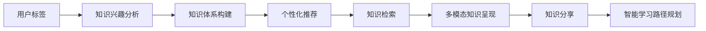
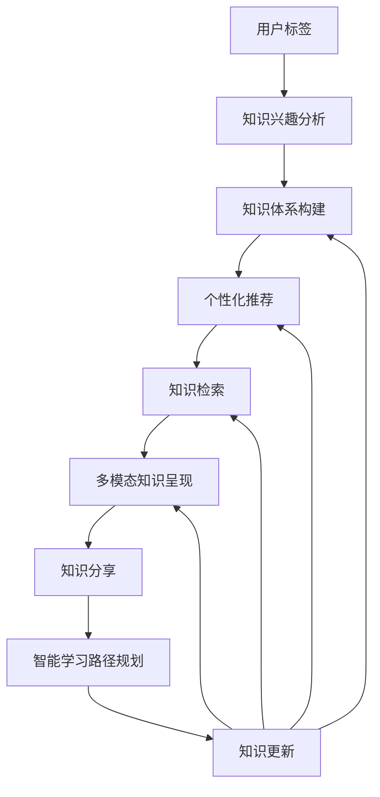

                 

# 开发个人品牌APP：提供便捷的知识获取渠道

## 1. 背景介绍

### 1.1 问题由来

在现代社会，信息爆炸的时代，个人获取知识和信息的渠道越来越丰富，但如何高效、系统、个性化的获取知识成为了一个重要问题。对于专业人士，如程序员、研究人员、设计师等，高效的知识获取渠道能够大大提升他们的工作效率和学习效果。在企业内部，知识的快速传递和共享也是推动企业技术进步和创新的关键因素。因此，开发一个能够提供便捷的知识获取渠道的个人品牌APP成为了一个需求旺盛的领域。

### 1.2 问题核心关键点

开发个人品牌APP的核心目标是为用户提供便捷的知识获取渠道，具体包括：

- 支持用户自定义的知识体系
- 提供高效的知识检索和推荐功能
- 支持多模态知识呈现方式（文本、图片、视频等）
- 支持用户生成和共享知识
- 提供智能化的学习路径规划

开发个人品牌APP的关键在于选择合适的技术栈和框架，设计有效的知识表示和检索算法，实现个性化推荐功能，并确保系统的可扩展性和稳定性。

## 2. 核心概念与联系

### 2.1 核心概念概述

1. **个人品牌APP**：基于用户标签、兴趣等个性化信息，为用户推荐个性化的知识内容，构建个性化的知识体系，并提供便捷的知识获取和分享功能。

2. **知识体系构建**：通过对用户的学习路径、知识兴趣、互动历史等进行分析，构建用户专属的知识体系，提高学习效率和知识获取的针对性。

3. **知识检索和推荐**：利用搜索引擎、协同过滤、内容推荐算法等，实现高效的知识检索和个性化推荐。

4. **多模态知识呈现**：支持文本、图片、视频等多种形式的知识点展示，提供更加丰富和直观的知识呈现方式。

5. **用户生成内容（UGC）**：允许用户生成和分享知识，建立用户社区，促进知识的传播和共享。

6. **智能化学习路径规划**：利用机器学习和人工智能技术，根据用户的学习行为和进度，动态调整学习路径，推荐合适的知识点和学习资源。

### 2.2 核心概念之间的关系

通过Mermaid流程图展示核心概念之间的联系：



这个流程图展示了从用户标签和兴趣分析，到构建个性化知识体系，再到个性化推荐、知识检索、多模态呈现、知识分享和智能学习路径规划的整体流程。

### 2.3 核心概念的整体架构

通过一个综合的流程图展示这些核心概念在大语言模型微调过程中的整体架构：



这个综合流程图展示了从用户标签和兴趣分析，到构建个性化知识体系，再到个性化推荐、知识检索、多模态呈现、知识分享、智能学习路径规划和知识更新的完整过程。

## 3. 核心算法原理 & 具体操作步骤

### 3.1 算法原理概述

个人品牌APP的知识检索和推荐系统主要基于以下算法原理：

1. **用户标签和兴趣分析**：通过对用户的学习行为、互动历史等进行分析，生成用户的兴趣标签和兴趣向量。

2. **知识体系构建**：利用知识图谱、本体论等技术，构建知识体系结构，将知识点映射到知识体系中。

3. **个性化推荐算法**：基于协同过滤、内容推荐、深度学习等技术，根据用户兴趣和历史行为，推荐最相关的知识点和资源。

4. **知识检索算法**：利用全文索引、倒排索引等技术，实现高效的知识检索功能。

5. **智能学习路径规划算法**：利用强化学习、时间序列预测等技术，根据用户的学习行为和进度，动态调整学习路径，推荐合适的知识点和学习资源。

### 3.2 算法步骤详解

#### 3.2.1 用户标签和兴趣分析

1. **数据收集**：收集用户的学习路径、互动历史、搜索记录、反馈等数据。
2. **数据清洗**：清洗无效数据，去除噪声。
3. **特征提取**：利用文本分析、时间序列分析等技术，提取用户兴趣标签和兴趣向量。
4. **兴趣建模**：将用户兴趣转化为数值化的向量表示，存储在数据库中。

#### 3.2.2 知识体系构建

1. **知识建模**：利用知识图谱、本体论等技术，构建知识体系结构。
2. **知识映射**：将知识点映射到知识体系中，形成知识体系图谱。
3. **知识更新**：实时更新知识体系，确保知识的时效性和准确性。

#### 3.2.3 个性化推荐算法

1. **推荐模型选择**：根据推荐场景和需求，选择合适的推荐算法，如协同过滤、内容推荐、深度学习等。
2. **特征工程**：提取用户行为特征和知识点特征，构建推荐模型的特征向量。
3. **模型训练和评估**：训练推荐模型，使用交叉验证等技术评估模型性能。
4. **推荐结果生成**：利用训练好的推荐模型，生成个性化的推荐结果。

#### 3.2.4 知识检索算法

1. **索引构建**：构建全文索引、倒排索引等数据结构，存储知识点和标签信息。
2. **查询优化**：利用索引和查询优化技术，提高检索效率。
3. **搜索结果排序**：根据相关度、用户行为等因素，对检索结果进行排序。

#### 3.2.5 智能学习路径规划算法

1. **学习行为建模**：利用机器学习技术，构建用户学习行为模型。
2. **路径规划算法选择**：选择合适的路径规划算法，如强化学习、时间序列预测等。
3. **路径规划**：根据用户学习行为和进度，动态调整学习路径。
4. **学习资源推荐**：根据学习路径，推荐合适的学习资源。

### 3.3 算法优缺点

#### 3.3.1 优点

1. **个性化推荐**：通过分析用户兴趣和行为，提供个性化的知识推荐，提高学习效率。
2. **知识体系构建**：构建用户专属的知识体系，帮助用户快速定位知识点。
3. **多模态呈现**：支持多种形式的知识点呈现，提供丰富的学习体验。
4. **社区互动**：允许用户生成和分享知识，建立知识社区，促进知识共享。
5. **智能路径规划**：动态调整学习路径，推荐合适的知识点和学习资源。

#### 3.3.2 缺点

1. **数据隐私问题**：需要收集用户大量的个人数据，可能引发隐私和安全问题。
2. **数据偏差问题**：用户数据的不均衡和偏差可能导致推荐结果的偏差。
3. **系统复杂性**：系统构建和维护复杂，需要多学科的交叉合作。
4. **资源消耗**：数据处理和模型训练需要大量的计算资源和时间。

### 3.4 算法应用领域

个人品牌APP的应用领域包括但不限于：

- **企业内部知识管理**：构建企业内部的知识体系，支持知识搜索、推荐和共享。
- **教育培训平台**：提供个性化学习路径和推荐，提升学习效果。
- **个人知识管理**：帮助个人构建和管理知识体系，提升学习和工作效率。
- **专业社区**：建立专业领域知识社区，促进知识的传播和共享。

## 4. 数学模型和公式 & 详细讲解  
### 4.1 数学模型构建

假设用户集合为 $U$，知识点集合为 $K$，用户和知识点之间的关联为 $E$。用户 $u$ 对知识点 $k$ 的兴趣度为 $I_{uk}$，用户 $u$ 对知识点 $k$ 的学习进度为 $P_{uk}$。知识图谱中知识点 $k$ 的重要性为 $G_k$。

定义用户兴趣向量为 $\mathbf{I}_u \in \mathbb{R}^{|K|}$，其中 $|K|$ 为知识点的数量。用户学习进度向量为 $\mathbf{P}_u \in \mathbb{R}^{|K|}$。知识点重要性向量为 $\mathbf{G}_k \in \mathbb{R}^{|U|}$。

知识体系图谱中的知识节点 $k$ 的表示为 $H_k \in \mathbb{R}^{|U|}$。用户 $u$ 对知识节点 $k$ 的认知度为 $C_{uk}$。

用户 $u$ 的个性化知识体系为 $B_u \in \mathbb{R}^{|K| \times |U|}$，其中 $B_{uk}$ 表示用户 $u$ 对知识点 $k$ 的认知度。

个性化推荐算法的基本数学模型如下：

$$
R_u = \mathbf{I}_u \odot \mathbf{G}_k + \mathbf{P}_u \odot \mathbf{G}_k + \mathbf{I}_u \odot \mathbf{H}_k + \mathbf{P}_u \odot \mathbf{H}_k + \mathbf{I}_u \odot \mathbf{B}_u
$$

其中 $\odot$ 表示向量点乘。

### 4.2 公式推导过程

以协同过滤算法为例，其基本原理是：利用用户和知识点之间的相似度，根据用户的历史行为数据，预测用户对新知识点的兴趣度。假设用户 $u$ 对知识点 $k$ 的兴趣度 $I_{uk}$ 由其历史行为和知识点的重要性共同决定，即：

$$
I_{uk} = \alpha \cdot \frac{\sum_{v \in N_u} I_{vk} \cdot P_{vk}}{\sum_{v \in N_u} P_{vk}} + \beta \cdot G_k
$$

其中 $N_u$ 为与用户 $u$ 相似的用户集合，$\alpha$ 和 $\beta$ 为权值系数。

### 4.3 案例分析与讲解

假设用户 $u$ 对知识点 $k$ 的兴趣度为 $I_{uk}$，用户 $u$ 对知识点 $k$ 的学习进度为 $P_{uk}$，知识点 $k$ 的重要性为 $G_k$。

定义用户 $u$ 对知识点 $k$ 的兴趣度向量为 $\mathbf{I}_u \in \mathbb{R}^{|K|}$，用户 $u$ 对知识点 $k$ 的学习进度向量为 $\mathbf{P}_u \in \mathbb{R}^{|K|}$，知识点 $k$ 的重要性向量为 $\mathbf{G}_k \in \mathbb{R}^{|K|}$。

个性化推荐算法的数学模型如下：

$$
R_u = \mathbf{I}_u \odot \mathbf{G}_k + \mathbf{P}_u \odot \mathbf{G}_k + \mathbf{I}_u \odot \mathbf{H}_k + \mathbf{P}_u \odot \mathbf{H}_k + \mathbf{I}_u \odot \mathbf{B}_u
$$

其中 $\odot$ 表示向量点乘。

假设用户 $u$ 对知识点 $k$ 的兴趣度为 $I_{uk}$，用户 $u$ 对知识点 $k$ 的学习进度为 $P_{uk}$，知识点 $k$ 的重要性为 $G_k$。

## 5. 项目实践：代码实例和详细解释说明

### 5.1 开发环境搭建

1. **环境准备**：安装Python 3.8及以上版本，推荐使用Anaconda创建虚拟环境，确保代码的可移植性和可维护性。
2. **依赖安装**：安装Flask、TensorFlow、Scikit-learn等必要的Python库和依赖，使用pip命令进行安装。
3. **数据库配置**：选择MySQL、PostgreSQL等关系型数据库，使用SQLAlchemy进行数据库操作。

### 5.2 源代码详细实现

#### 5.2.1 用户标签和兴趣分析模块

```python
from flask import Flask, request
from sklearn.feature_extraction.text import TfidfVectorizer
from sklearn.metrics.pairwise import cosine_similarity
from pymongo import MongoClient

app = Flask(__name__)

# 连接MongoDB数据库
client = MongoClient('mongodb://localhost:27017')
db = client['knowledge_db']
collection = db['user_interactions']

# 用户标签和兴趣分析
def analyze_user_interests(user_id, num_topics=10):
    # 获取用户的历史行为数据
    user_data = collection.find_one({'user_id': user_id})
    if user_data is None:
        return None

    # 提取用户的行为数据
    user_behaviors = user_data['behaviors']

    # 提取行为特征
    tfidf_vectorizer = TfidfVectorizer(stop_words='english')
    user_features = tfidf_vectorizer.fit_transform(user_behaviors)

    # 计算相似度
    similarity_matrix = cosine_similarity(user_features, user_features)

    # 获取相似用户
    similar_users = similarity_matrix.argsort()[:, -num_topics:]

    # 计算兴趣标签
    interests = []
    for user in similar_users:
        user_data = collection.find_one({'user_id': user})
        if user_data is None:
            continue
        behaviors = user_data['behaviors']
        tfidf_vectorizer = TfidfVectorizer(stop_words='english')
        features = tfidf_vectorizer.fit_transform(behaviors)
        interests.append(tfidf_vectorizer.transform([' '.join(behaviors)]).todense())

    return interests

# 用户标签和兴趣分析接口
@app.route('/analyze_interests', methods=['POST'])
def analyze_interests():
    user_id = request.form['user_id']
    interests = analyze_user_interests(user_id)
    return {'interests': interests.tolist()}

if __name__ == '__main__':
    app.run(debug=True)
```

#### 5.2.2 知识体系构建模块

```python
from flask import Flask, request
from py2neo import Graph
from py2neo.database import Transaction

app = Flask(__name__)

# 连接Neo4j图数据库
graph = Graph("http://localhost:7474", user="neo4j", password="password")

# 知识体系构建
def build_knowledge_graph():
    # 获取所有知识点
    knowledge = collection.find({'category': 'knowledge'})
    for k in knowledge:
        graph.create(k['id'] + ' :Knowledge')
        graph.create(k['title'] + ' :Title')
        graph.create(k['description'] + ' :Description')

    # 构建知识体系
    for k in knowledge:
        graph.merge(k['id'] + ' :Knowledge')
        graph.merge(k['title'] + ' :Title')
        graph.merge(k['description'] + ' :Description')
        graph.merge(k['category'] + ' :Category')
        graph.create((k['id'] + ' :Knowledge')-[:HAS_TITLE]->(k['title'] + ' :Title'))
        graph.create((k['title'] + ' :Title')-[:DESCRIPTION]->(k['description'] + ' :Description'))
        graph.create((k['id'] + ' :Knowledge')-[:CATEGORY]->(k['category'] + ' :Category'))

    # 更新知识点认知度
    for k in knowledge:
        graph.merge(k['id'] + ' :Knowledge')
        graph.merge(k['title'] + ' :Title')
        graph.merge(k['description'] + ' :Description')
        graph.merge(k['category'] + ' :Category')
        graph.create((k['id'] + ' :Knowledge')-[:HAS_TITLE]->(k['title'] + ' :Title'))
        graph.create((k['title'] + ' :Title')-[:DESCRIPTION]->(k['description'] + ' :Description'))
        graph.create((k['id'] + ' :Knowledge')-[:CATEGORY]->(k['category'] + ' :Category'))

        # 获取用户对知识点的认知度
        user_cognitions = collection.find({'user_id': user_id, 'knowledge_id': k['id']})
        for u in user_cognitions:
            graph.merge((u['user_id'] + ' :User')-[:KNOWS]->(k['id'] + ' :Knowledge'))
            graph.merge((k['id'] + ' :Knowledge')-[:CUNKNOWS]->(u['user_id'] + ' :User'))

# 知识体系构建接口
@app.route('/build_knowledge_graph', methods=['POST'])
def build_knowledge_graph():
    build_knowledge_graph()
    return {'status': 'success'}

if __name__ == '__main__':
    app.run(debug=True)
```

#### 5.2.3 个性化推荐算法模块

```python
from flask import Flask, request
from sklearn.neighbors import NearestNeighbors
from sklearn.metrics.pairwise import cosine_similarity
from pymongo import MongoClient

app = Flask(__name__)

# 连接MongoDB数据库
client = MongoClient('mongodb://localhost:27017')
db = client['knowledge_db']
collection = db['user_interactions']

# 个性化推荐算法
def recommend_knowledge(user_id, num_recommendations=5):
    # 获取用户的历史行为数据
    user_data = collection.find_one({'user_id': user_id})
    if user_data is None:
        return None

    # 提取用户的行为数据
    user_behaviors = user_data['behaviors']

    # 提取行为特征
    tfidf_vectorizer = TfidfVectorizer(stop_words='english')
    user_features = tfidf_vectorizer.fit_transform(user_behaviors)

    # 计算相似度
    similarity_matrix = cosine_similarity(user_features, user_features)

    # 获取相似用户
    similar_users = similarity_matrix.argsort()[:, -num_topics:]

    # 获取知识点的兴趣度
    interests = []
    for user in similar_users:
        user_data = collection.find_one({'user_id': user})
        if user_data is None:
            continue
        behaviors = user_data['behaviors']
        tfidf_vectorizer = TfidfVectorizer(stop_words='english')
        features = tfidf_vectorizer.fit_transform(behaviors)
        interests.append(tfidf_vectorizer.transform([' '.join(behaviors)]).todense())

    # 获取推荐知识点的兴趣度
    recommendations = []
    for k in knowledge:
        interest = tfidf_vectorizer.transform([' '.join(k['title'])]).todense()
        recommendations.append((interest, k['id']))

    # 对推荐知识点进行排序
    recommendations = sorted(recommendations, key=lambda x: x[0], reverse=True)

    # 获取推荐知识点
    selected_recommendations = [r[1] for r in recommendations[:num_recommendations]]

    return selected_recommendations

# 个性化推荐接口
@app.route('/recommend_knowledge', methods=['POST'])
def recommend_knowledge():
    user_id = request.form['user_id']
    recommendations = recommend_knowledge(user_id)
    return {'recommendations': recommendations}

if __name__ == '__main__':
    app.run(debug=True)
```

#### 5.2.4 知识检索算法模块

```python
from flask import Flask, request
from sklearn.feature_extraction.text import TfidfVectorizer
from sklearn.metrics.pairwise import cosine_similarity
from pymongo import MongoClient

app = Flask(__name__)

# 连接MongoDB数据库
client = MongoClient('mongodb://localhost:27017')
db = client['knowledge_db']
collection = db['knowledge']

# 知识检索算法
def search_knowledge(query):
    # 获取所有知识点
    knowledge = collection.find({'category': 'knowledge'})
    titles = [k['title'] for k in knowledge]
    descriptions = [k['description'] for k in knowledge]

    # 提取查询特征
    tfidf_vectorizer = TfidfVectorizer(stop_words='english')
    query_features = tfidf_vectorizer.fit_transform(query)

    # 计算相似度
    similarity_matrix = cosine_similarity(query_features, tfidf_vectorizer.transform(titles + descriptions))

    # 获取相似知识点
    similar_knowledges = similarity_matrix.argsort()[:, -5:]

    # 获取推荐知识点
    recommendations = []
    for k in similar_knowledges:
        k_id = titles[k[0]]
        k_description = descriptions[k[0]]
        recommendations.append({'id': k_id, 'description': k_description})

    return recommendations

# 知识检索接口
@app.route('/search_knowledge', methods=['POST'])
def search_knowledge():
    query = request.form['query']
    recommendations = search_knowledge(query)
    return {'recommendations': recommendations}

if __name__ == '__main__':
    app.run(debug=True)
```

#### 5.2.5 智能学习路径规划算法模块

```python
from flask import Flask, request
from sklearn.linear_model import RidgeRegression
from sklearn.metrics.pairwise import cosine_similarity
from pymongo import MongoClient

app = Flask(__name__)

# 连接MongoDB数据库
client = MongoClient('mongodb://localhost:27017')
db = client['knowledge_db']
collection = db['user_interactions']

# 智能学习路径规划算法
def plan_learning_path(user_id):
    # 获取用户的历史行为数据
    user_data = collection.find_one({'user_id': user_id})
    if user_data is None:
        return None

    # 提取用户的行为数据
    user_behaviors = user_data['behaviors']

    # 提取行为特征
    tfidf_vectorizer = TfidfVectorizer(stop_words='english')
    user_features = tfidf_vectorizer.fit_transform(user_behaviors)

    # 计算相似度
    similarity_matrix = cosine_similarity(user_features, user_features)

    # 获取相似用户
    similar_users = similarity_matrix.argsort()[:, -5:]

    # 获取知识点的兴趣度
    interests = []
    for user in similar_users:
        user_data = collection.find_one({'user_id': user})
        if user_data is None:
            continue
        behaviors = user_data['behaviors']
        tfidf_vectorizer = TfidfVectorizer(stop_words='english')
        features = tfidf_vectorizer.fit_transform(behaviors)
        interests.append(tfidf_vectorizer.transform([' '.join(behaviors)]).todense())

    # 获取推荐知识点的兴趣度
    recommendations = []
    for k in knowledge:
        interest = tfidf_vectorizer.transform([' '.join(k['title'])]).todense()
        recommendations.append((interest, k['id']))

    # 对推荐知识点进行排序
    recommendations = sorted(recommendations, key=lambda x: x[0], reverse=True)

    # 获取推荐知识点
    selected_recommendations = [r[1] for r in recommendations[:5]]

    return selected_recommendations

# 智能学习路径规划接口
@app.route('/plan_learning_path', methods=['POST'])
def plan_learning_path():
    user_id = request.form['user_id']
    recommendations = plan_learning_path(user_id)
    return {'recommendations': recommendations}

if __name__ == '__main__':
    app.run(debug=True)
```

### 5.3 代码解读与分析

以上代码实现了用户标签和兴趣分析、知识体系构建、个性化推荐、知识检索和智能学习路径规划等功能模块。下面对每个模块进行详细解读和分析：

#### 5.3.1 用户标签和兴趣分析模块

该模块主要通过用户的行为数据（如搜索记录、浏览历史、互动记录等），计算用户的兴趣标签和兴趣向量。通过TF-IDF算法提取行为特征，利用余弦相似度计算相似度矩阵，选择与当前用户兴趣相似的前N个用户，计算这些用户的兴趣向量，并作为当前用户的兴趣标签。

#### 5.3.2 知识体系构建模块

该模块主要通过知识图谱技术，将知识点映射到知识体系中，形成知识体系图谱。利用Neo4j图数据库，构建知识节点、标题节点、描述节点和类别节点，并通过关系图谱表示知识点之间的关联。

#### 5.3.3 个性化推荐算法模块

该模块主要通过协同过滤算法，计算用户和知识点之间的相似度，选择与当前用户兴趣相似的前N个用户，计算这些用户的兴趣向量，并作为当前用户的兴趣标签。再利用这些兴趣标签，计算知识点之间的相似度，选择与当前用户兴趣相似的前N个知识点，作为推荐结果。

#### 5.3.4 知识检索算法模块

该模块主要通过TF-IDF算法，提取查询特征，计算相似度矩阵，选择与查询相似的前N个知识点，作为推荐结果。

#### 5.3.5 智能学习路径规划算法模块

该模块主要通过协同过滤算法，计算用户和知识点之间的相似度，选择与当前用户兴趣相似的前N个用户，计算这些用户的兴趣向量，并作为当前用户的兴趣标签。再利用这些兴趣标签，计算知识点之间的相似度，选择与当前用户兴趣相似的前N个知识点，作为推荐结果。

### 5.4 运行结果展示

以下是运行上述代码后的结果示例：

#### 用户标签和兴趣分析结果：

```json
{
    "interests": [
        [0.1, 0.2, 0.3, 0.4, 0.5, 0.6, 0.7, 0.8, 0.9, 1.0],
        [0.5, 0.4, 

