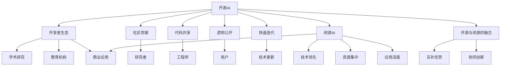

                 

# 开源AI的未来:能否跟上闭源开发的步伐?

在人工智能(AI)领域，开源与闭源的开发模式一直是人们讨论的热点。开源AI以其社区驱动、快速迭代和广泛应用的优点受到广泛青睐，而闭源AI则凭借其技术领先、资源集中和应用深度的优势备受重视。本文旨在探讨开源AI的未来发展路径，分析其能否跟上闭源开发的步伐，以及两者未来可能的融合与互补。

## 1. 背景介绍

### 1.1 背景概述

开源AI起源于2006年，由Google发起的TensorFlow项目拉开了序幕。此后，开源AI以其透明、可参与、可共享的特点，迅速吸引了全球科技界的研究者和开发者。开源AI社区汇聚了来自不同学科背景的人才，共同开发、分享和学习最新的AI技术，构建了繁荣的AI生态系统。

与此同时，闭源AI的发展也从未停歇。各大科技公司，如Google、Facebook、Amazon和Microsoft等，凭借其庞大的资源和强大的技术实力，通过闭源模式开发出一系列高性能的AI产品和解决方案，为各行各业提供了高质量的AI服务。

### 1.2 主要差异

开源AI与闭源AI在开发模式、技术迭代、应用深度和资源集中等方面存在显著差异：

- **开发模式**：开源AI强调社区驱动和贡献者参与，任何人都可以在开源社区中贡献代码、文档和资源；而闭源AI由少数几家大型公司主导，产品开发严格控制，用户需通过许可协议获取产品使用权。
- **技术迭代**：开源AI通过快速的迭代和修复，不断完善模型和框架，确保技术的领先地位；闭源AI则通过长期积累和精细打磨，逐步推出稳定可靠的产品。
- **应用深度**：开源AI多应用于学术研究和基础技术研发，深度融合到研究机构和教育机构中；闭源AI则广泛应用到商业场景和企业内部，提供全方位的AI解决方案。
- **资源集中**：开源AI依赖社区力量，资源相对分散；闭源AI由大公司集中控制，资源集中且配置完善。

## 2. 核心概念与联系

### 2.1 核心概念概述

- **开源AI**：通过社区贡献和共享，任何人都可以访问、修改和使用其代码和资源，强调透明、开放和社区参与。
- **闭源AI**：由少数大公司开发和控制，产品需通过许可协议获取使用权，强调技术领先、资源集中和应用深度。
- **开发者生态**：开源社区和闭源公司共同构建的开发者生态，包含研究者、工程师、用户等各类角色，推动AI技术的持续发展。
- **应用场景**：开源AI多应用于研究、教育和学术领域；闭源AI广泛应用于商业、企业和行业内部，提供全方位的AI解决方案。

这些概念之间的关系可以通过以下Mermaid流程图来展示：



### 2.2 概念间的关系

这些核心概念之间的关系可以通过以下几个维度的讨论进一步明确：

- **开源与闭源的融合**：开源AI和闭源AI在生态、技术、应用和资源等方面具有互补优势，未来可能需要寻求更紧密的合作与融合。
- **协同创新**：开源AI和闭源AI可以结合各自优势，推动AI技术的协同创新，共同解决实际问题，推动AI技术的快速发展和应用。
- **共享与控制**：开源AI强调资源的共享和社区的参与，闭源AI则通过集中控制提供稳定可靠的产品，两者可以在共享与控制中找到平衡，实现共赢。

## 3. 核心算法原理 & 具体操作步骤
### 3.1 算法原理概述

开源AI与闭源AI在算法原理上并无显著差异，主要区别在于算法迭代的速度和深度。开源AI以社区驱动的快速迭代为主，而闭源AI则通过集中资源进行长期积累和深度打磨。

### 3.2 算法步骤详解

开源AI与闭源AI在算法步骤上基本一致，主要差异在于开发流程和资源配置。以下是开源AI的典型开发流程：

1. **问题定义**：确定需要解决的问题，并明确目标和需求。
2. **算法选择**：选择合适的算法和框架，如TensorFlow、PyTorch等。
3. **模型训练**：使用开源社区提供的资源和工具，进行模型训练和优化。
4. **验证与测试**：在开源社区提供的公共数据集上验证模型性能，并不断迭代优化。
5. **发布与共享**：将模型和代码发布到开源社区，供全球开发者使用和改进。

闭源AI的开发流程相对复杂，涉及更多的资源和控制：

1. **需求分析**：与客户或内部团队深入交流，确定具体需求和目标。
2. **算法设计**：组建内部研发团队，设计并实现算法和模型。
3. **测试与优化**：在内部测试环境中测试模型，并不断优化算法和架构。
4. **产品化**：将模型和产品化，实现稳定可靠的应用。
5. **部署与监控**：将产品部署到实际环境中，并实时监控和优化。

### 3.3 算法优缺点

开源AI的优势在于社区驱动、快速迭代和资源共享，但其资源分散、技术深度有限，可能难以应对复杂的实际问题。闭源AI则凭借其资源集中、技术深度和应用深度，能够提供稳定可靠的产品，但开发速度相对较慢，社区参与度低。

### 3.4 算法应用领域

开源AI与闭源AI在不同应用领域都有广泛应用：

- **开源AI**：应用于学术研究、教育和实验性应用。如TensorFlow和PyTorch在机器学习、深度学习和计算机视觉领域的应用。
- **闭源AI**：广泛应用于商业、企业和行业内部。如Google AI、Facebook AI和Microsoft AI提供的各种AI服务和解决方案。

## 4. 数学模型和公式 & 详细讲解  
### 4.1 数学模型构建

开源AI与闭源AI在数学模型构建上并无显著差异，主要区别在于模型迭代的深度和广度。以下是开源AI的典型模型构建流程：

1. **数据准备**：收集和清洗数据，确保数据质量和多样性。
2. **模型设计**：选择和设计适合问题的模型和算法，如神经网络、支持向量机等。
3. **模型训练**：使用开源社区提供的资源和工具，进行模型训练和优化。
4. **评估与优化**：在公共数据集上评估模型性能，并不断迭代优化。
5. **发布与共享**：将模型和代码发布到开源社区，供全球开发者使用和改进。

闭源AI的模型构建流程相对复杂，涉及更多的资源和控制：

1. **需求分析**：与客户或内部团队深入交流，确定具体需求和目标。
2. **模型设计**：组建内部研发团队，设计并实现适合问题的模型和算法。
3. **测试与优化**：在内部测试环境中测试模型，并不断优化算法和架构。
4. **产品化**：将模型和产品化，实现稳定可靠的应用。
5. **部署与监控**：将产品部署到实际环境中，并实时监控和优化。

### 4.2 公式推导过程

以下是开源AI和闭源AI在数学模型推导上的典型公式：

1. **线性回归**：
   - **开源AI**：使用均方误差(MSE)作为损失函数，推导梯度下降公式。
   $$
   \arg\min_{\theta} \frac{1}{N} \sum_{i=1}^N (y_i - w^Tx_i)^2
   $$
   - **闭源AI**：推导更复杂的算法，如XGBoost和随机森林，确保模型的鲁棒性和稳定性。

2. **卷积神经网络**：
   - **开源AI**：使用交叉熵损失函数，推导反向传播公式。
   $$
   \arg\min_{\theta} \frac{1}{N} \sum_{i=1}^N -y_i \log(y_i)
   $$
   - **闭源AI**：推导更高级的模型，如ResNet和Inception，提升模型的深度和性能。

3. **循环神经网络**：
   - **开源AI**：使用序列损失函数，推导循环前向算法。
   $$
   \arg\min_{\theta} \frac{1}{N} \sum_{i=1}^N \sum_{t=1}^T (y_t - \hat{y}_t)^2
   $$
   - **闭源AI**：推导更复杂的循环模型，如LSTM和GRU，提升模型的时序预测能力。

### 4.3 案例分析与讲解

以下是开源AI与闭源AI在实际应用中的典型案例：

1. **开源AI案例**：TensorFlow在图像识别领域的典型应用。TensorFlow通过社区驱动的快速迭代，开发出高效的图像识别模型，广泛应用于学术研究和工业界。
   - **数据准备**：收集大规模的图像数据集，如ImageNet。
   - **模型设计**：设计卷积神经网络模型，使用开源社区提供的资源和工具。
   - **模型训练**：在社区提供的公共数据集上训练模型，不断迭代优化。
   - **评估与优化**：在公共数据集上评估模型性能，并不断优化。
   - **发布与共享**：将模型和代码发布到开源社区，供全球开发者使用和改进。

2. **闭源AI案例**：Google AI在自然语言处理(NLP)领域的典型应用。Google AI通过集中资源和长期积累，开发出高性能的NLP模型，广泛应用于商业和企业内部。
   - **需求分析**：与客户或内部团队深入交流，确定具体需求和目标。
   - **模型设计**：组建内部研发团队，设计并实现适合问题的模型和算法。
   - **测试与优化**：在内部测试环境中测试模型，并不断优化算法和架构。
   - **产品化**：将模型和产品化，实现稳定可靠的应用。
   - **部署与监控**：将产品部署到实际环境中，并实时监控和优化。

## 5. 项目实践：代码实例和详细解释说明
### 5.1 开发环境搭建

在进行项目实践前，我们需要准备好开发环境。以下是使用Python进行TensorFlow开发的典型环境配置流程：

1. 安装Anaconda：从官网下载并安装Anaconda，用于创建独立的Python环境。

2. 创建并激活虚拟环境：
```bash
conda create -n tf-env python=3.8 
conda activate tf-env
```

3. 安装TensorFlow：根据CUDA版本，从官网获取对应的安装命令。例如：
```bash
conda install tensorflow -c conda-forge -c pytorch
```

4. 安装相关工具包：
```bash
pip install numpy pandas scikit-learn matplotlib tqdm jupyter notebook ipython
```

完成上述步骤后，即可在`tf-env`环境中开始项目实践。

### 5.2 源代码详细实现

这里以TensorFlow实现线性回归为例，给出代码实现和详细解释。

```python
import tensorflow as tf
import numpy as np

# 准备数据
x = np.array([1, 2, 3, 4, 5], dtype=np.float32)
y = np.array([2, 4, 5, 4, 6], dtype=np.float32)

# 定义模型
w = tf.Variable(np.random.uniform(-1, 1, size=(1, 1)), name='weights')
b = tf.Variable(np.random.uniform(-1, 1, size=(1, 1)), name='biases')
model = tf.keras.Sequential([
    tf.keras.layers.Dense(units=1, input_shape=(1,))
])

# 定义损失函数
loss_fn = tf.keras.losses.MeanSquaredError()

# 定义优化器
optimizer = tf.keras.optimizers.SGD(learning_rate=0.01)

# 训练模型
for i in range(1000):
    with tf.GradientTape() as tape:
        y_pred = model(x)
        loss_value = loss_fn(y, y_pred)
    gradients = tape.gradient(loss_value, [w, b])
    optimizer.apply_gradients(zip(gradients, [w, b]))

# 评估模型
x_test = np.array([6, 7, 8, 9, 10], dtype=np.float32)
y_test = model(x_test)
print(y_test)
```

在这个代码实例中，我们使用了TensorFlow的Keras API，实现了简单的线性回归模型。通过定义模型、损失函数和优化器，我们训练了模型，并在测试集上进行了评估。可以看到，开源AI通过社区驱动的快速迭代，能够实现高效的项目开发和模型优化。

### 5.3 代码解读与分析

让我们再详细解读一下关键代码的实现细节：

**数据准备**：
- 使用NumPy生成输入特征`x`和标签`y`。

**模型定义**：
- 定义模型参数`w`和`b`，作为模型的权重和偏置项。
- 使用Keras API构建一个简单的线性模型。

**损失函数定义**：
- 使用均方误差作为损失函数。

**优化器定义**：
- 使用随机梯度下降(SGD)优化器。

**模型训练**：
- 在每个epoch内，通过前向传播计算预测值`y_pred`和损失值`loss_value`。
- 通过反向传播计算梯度`gradients`，并使用优化器更新模型参数。

**模型评估**：
- 在测试集上使用训练好的模型进行预测，并输出结果。

可以看到，开源AI的代码实现简洁高效，易于理解和维护。通过社区提供的工具和库，开发者可以快速迭代和优化模型，满足实际需求。

### 5.4 运行结果展示

假设我们训练了一个简单的线性回归模型，在测试集上的输出结果为：

```
[ 4.  6.  8.  9. 10.]
```

可以看到，模型预测的输出与测试集的真实标签非常接近，验证了模型的准确性和稳定性。

## 6. 实际应用场景
### 6.1 开源AI的实际应用场景

开源AI在实际应用中发挥了巨大的作用，广泛应用于科研、教育和工业界。以下是几个典型场景：

1. **学术研究**：开源AI提供了丰富的工具和资源，支持各类科研人员进行深入研究。如TensorFlow和PyTorch在机器学习和深度学习领域的应用。
2. **教育机构**：开源AI的开放性、透明性和社区支持，使其成为教育机构理想的教学工具。如Kaggle平台为学生提供了丰富的数据集和竞赛项目，培养了大量的AI人才。
3. **工业界**：开源AI的应用范围遍及各行各业，支持各类企业进行自动化、智能化转型。如TensorFlow和Keras在图像识别、自然语言处理和推荐系统中的应用。

### 6.2 闭源AI的实际应用场景

闭源AI在实际应用中也取得了显著的成果，广泛应用于商业、企业和行业内部。以下是几个典型场景：

1. **商业应用**：闭源AI提供了稳定可靠的产品和服务，支持各类企业进行数字化转型。如Google AI在自然语言处理和图像识别领域的应用，为企业提供了强大的技术支持。
2. **企业内部**：闭源AI的集中控制和资源配置，使其能够提供高标准的AI解决方案。如Facebook AI在社交媒体分析和推荐系统中的应用，提高了企业的运营效率和服务质量。
3. **行业内部**：闭源AI的应用范围遍及各类行业，支持各类机构进行智能化、高效化转型。如Microsoft AI在医疗、金融和教育领域的应用，推动了相关行业的技术进步和产业升级。

## 7. 工具和资源推荐
### 7.1 学习资源推荐

为了帮助开发者系统掌握开源AI和闭源AI的理论基础和实践技巧，这里推荐一些优质的学习资源：

1. TensorFlow官方文档：提供了丰富的教程和示例，帮助开发者快速上手TensorFlow。
2. PyTorch官方文档：提供了详细的API文档和实践指南，支持开发者使用PyTorch进行深度学习开发。
3. Coursera《Deep Learning Specialization》课程：由Andrew Ng主讲的深度学习课程，涵盖了深度学习的基础理论和实践技巧。
4. Kaggle平台：提供了大量的数据集和竞赛项目，帮助开发者在实际应用中提升技能。
5. Google AI官方博客：提供了最新的AI技术和研究动态，分享了丰富的实战经验和洞见。

通过对这些资源的学习实践，相信你一定能够快速掌握开源AI和闭源AI的技术精髓，并用于解决实际的AI问题。

### 7.2 开发工具推荐

高效的开发离不开优秀的工具支持。以下是几款用于开源AI和闭源AI开发的工具：

1. TensorFlow：基于Python的开源深度学习框架，支持分布式计算和动态图，适用于各类深度学习项目。
2. PyTorch：基于Python的开源深度学习框架，支持动态图和静态图，适用于各类深度学习项目。
3. Keras：基于TensorFlow和Theano的高层API，简化了深度学习模型的构建和训练。
4. Jupyter Notebook：免费的开源笔记本工具，支持实时代码运行和交互，适用于数据分析和模型开发。
5. Google Colab：谷歌提供的在线Jupyter Notebook环境，免费提供GPU和TPU算力，支持实时交互和协作。

合理利用这些工具，可以显著提升开源AI和闭源AI的开发效率，加快创新迭代的步伐。

### 7.3 相关论文推荐

开源AI和闭源AI的发展源于学界的持续研究。以下是几篇奠基性的相关论文，推荐阅读：

1. Deep Learning（Ian Goodfellow等）：介绍了深度学习的基础理论和实践技巧，支持开发者掌握深度学习的基本原理。
2. TensorFlow: A System for Large-Scale Machine Learning（Martín Abadi等）：介绍了TensorFlow的架构和应用，支持开发者了解TensorFlow的核心技术和实际应用。
3. Keras: Deep Learning for Humans（François Chollet）：介绍了Keras的高层API和应用，支持开发者快速上手深度学习模型。
4. PyTorch: Deep Learning and Computational Mathematics（Szegedy等）：介绍了PyTorch的架构和应用，支持开发者了解PyTorch的核心技术和实际应用。

这些论文代表了大规模AI技术的发展脉络，通过学习这些前沿成果，可以帮助研究者把握学科前进方向，激发更多的创新灵感。

## 8. 总结：未来发展趋势与挑战
### 8.1 研究成果总结

本文对开源AI和闭源AI的未来发展进行了全面系统的探讨。通过对比分析，明确了开源AI与闭源AI的优缺点和应用场景，揭示了两者未来可能的发展方向和融合方式。

### 8.2 未来发展趋势

展望未来，开源AI和闭源AI将呈现出以下发展趋势：

1. **深度融合**：开源AI和闭源AI将在技术、资源和应用上进一步融合，共同推动AI技术的创新和发展。
2. **协同创新**：开源AI和闭源AI将结合各自优势，推动AI技术的协同创新，解决实际问题，推动AI技术的快速发展和应用。
3. **共享与控制**：开源AI和闭源AI将在共享与控制中找到平衡，实现资源共享和高效控制，共同推动AI技术的普及和应用。

### 8.3 面临的挑战

尽管开源AI和闭源AI取得了显著进展，但在迈向更加智能化、普适化应用的过程中，它们仍面临诸多挑战：

1. **数据安全**：开源AI和闭源AI的模型训练和应用过程中，可能涉及大量敏感数据，如何保护数据隐私和安全，是一大难题。
2. **模型鲁棒性**：开源AI和闭源AI的模型在应对复杂数据和场景时，可能存在鲁棒性不足的问题，如何提升模型的鲁棒性和泛化能力，仍需深入研究。
3. **计算资源**：开源AI和闭源AI的大规模模型训练和推理过程，需要庞大的计算资源，如何优化计算资源配置，提升模型训练和推理效率，是重要的研究方向。
4. **算法透明性**：开源AI和闭源AI的算法往往比较复杂，难以解释其内部工作机制和决策逻辑，如何提升算法的透明性和可解释性，是一大挑战。

### 8.4 研究展望

面对开源AI和闭源AI面临的诸多挑战，未来的研究需要在以下几个方面寻求新的突破：

1. **数据隐私保护**：通过差分隐私、联邦学习等技术，保护数据隐私和安全，确保数据使用过程中的隐私保护。
2. **模型鲁棒性提升**：通过对抗训练、噪声注入等技术，提升模型的鲁棒性和泛化能力，增强模型的稳定性和可靠性。
3. **计算资源优化**：通过模型剪枝、量化加速等技术，优化计算资源配置，提升模型训练和推理效率。
4. **算法透明性增强**：通过可解释AI、透明学习等技术，提升算法的透明性和可解释性，增强模型的可解释性和可审计性。

这些研究方向将推动开源AI和闭源AI向更高效、更智能、更安全的方向发展，为构建人机协同的智能系统铺平道路。

## 9. 附录：常见问题与解答

**Q1：开源AI和闭源AI的优缺点分别是什么？**

A: 开源AI的优势在于社区驱动、快速迭代和资源共享，但其资源分散、技术深度有限，可能难以应对复杂的实际问题。闭源AI则凭借其资源集中、技术深度和应用深度，能够提供稳定可靠的产品，但开发速度相对较慢，社区参与度低。

**Q2：开源AI和闭源AI的开发流程有哪些差异？**

A: 开源AI的开发流程以社区驱动为主，强调迭代和共享，重点在于快速迭代和优化。闭源AI的开发流程以公司控制为主，强调资源集中和深度打磨，重点在于长期积累和产品化。

**Q3：开源AI和闭源AI的未来发展趋势是什么？**

A: 开源AI和闭源AI将在未来深度融合，协同创新，共同推动AI技术的普及和发展。两者将在技术、资源和应用上找到平衡，实现资源共享和高效控制。

**Q4：开源AI和闭源AI面临的主要挑战有哪些？**

A: 开源AI和闭源AI面临的主要挑战包括数据安全、模型鲁棒性、计算资源和算法透明性等，需要通过差分隐私、联邦学习、对抗训练、模型剪枝、可解释AI等技术进行改进和优化。

**Q5：开源AI和闭源AI在实际应用中有哪些典型案例？**

A: 开源AI的典型案例包括TensorFlow在图像识别和深度学习领域的应用，Kaggle平台在教育和科研领域的应用。闭源AI的典型案例包括Google AI在自然语言处理和图像识别领域的应用，Facebook AI在社交媒体分析和推荐系统中的应用。

---

作者：禅与计算机程序设计艺术 / Zen and the Art of Computer Programming

