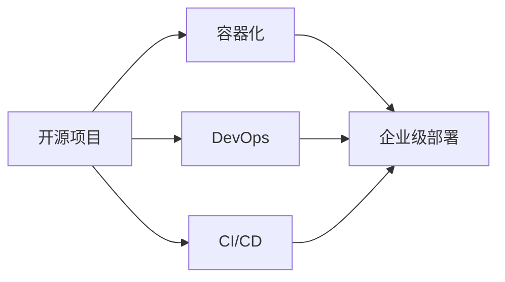

                 

# 开源项目的企业级部署服务：创造高价值机会

## 1. 背景介绍

随着开源软件在企业中的应用日益广泛，越来越多的企业开始重视开源项目的部署和管理。开源项目为企业提供了丰富的资源，但同时也带来了新的挑战。企业级部署服务能够帮助企业更高效地利用这些资源，创造更高的价值。本文将深入探讨企业级部署服务的关键技术和实践，为企业开源项目的落地提供有价值的指导。

## 2. 核心概念与联系

### 2.1 核心概念概述

- **开源项目**：指基于开源许可协议，免费向公众开放的软件项目。开源项目通常由社区维护，具有高度的灵活性和可扩展性。

- **企业级部署服务**：指针对企业需求，提供一整套集成化的部署、管理和服务解决方案。这些服务包括安装、配置、监控、升级和优化等环节，帮助企业快速、稳定地部署和使用开源项目。

- **容器化**：将应用程序及其依赖打包成独立的镜像文件，通过容器技术（如Docker）在标准化的环境中运行。容器化技术能够提高应用的部署效率，简化运维，保障一致性。

- **DevOps**：一种将软件开发和运维结合起来的文化和技术实践，强调自动化、持续集成和持续交付。DevOps能够提升软件开发和运维的效率和质量。

- **CI/CD**：持续集成（CI）和持续部署（CD）的合称，指通过自动化流程实现代码的持续集成、构建、测试和部署。CI/CD技术能够加速软件开发和交付。

### 2.2 核心概念之间的关系

这些核心概念之间存在着紧密的联系，通过以下Mermaid流程图来展示：



此图展示了从开源项目到企业级部署服务的整体流程，以及其中关键技术的相互关系。开源项目通过容器化和DevOps实践，进入CI/CD流程，最终通过企业级部署服务实现高效、稳定、持续的交付。

## 3. 核心算法原理 & 具体操作步骤
### 3.1 算法原理概述

企业级部署服务的关键在于如何将开源项目高效、稳定地部署到企业环境中，并实现持续的交付和优化。其主要算法原理如下：

1. **容器化技术**：将开源项目及其依赖打包成镜像文件，通过容器引擎（如Docker）在标准化的环境中运行。这能够保证不同环境下的软件行为一致，简化运维。

2. **DevOps流程自动化**：通过自动化工具和脚本，实现代码的持续集成、构建、测试和部署。自动化流程能够提高开发和交付的速度和质量。

3. **持续监控和反馈**：利用监控工具（如Prometheus、Grafana）和日志分析工具（如ELK Stack），实时监控开源项目的状态和性能，及时发现和解决问题。

4. **自动化配置和升级**：通过自动化配置工具（如Ansible、SaltStack）和升级工具（如Jenkins、GitLab CI），实现配置管理、版本管理和持续升级。

### 3.2 算法步骤详解

以下是企业级部署服务的具体操作步骤：

1. **需求分析**：明确企业对开源项目的具体需求，包括部署环境、性能要求、安全性要求等。

2. **环境准备**：根据需求准备基础设施环境，包括服务器、网络、存储等。

3. **项目选择和准备**：选择适合的开源项目，并进行必要的修改和配置。

4. **容器化和配置**：将项目打包成容器镜像，并配置必要的参数。

5. **自动化流程设计**：设计并实现CI/CD流程，包括代码仓库、构建工具、测试工具和部署工具。

6. **部署和测试**：在测试环境中进行部署和测试，确保项目稳定运行。

7. **监控和优化**：通过监控工具实时监控项目状态，根据反馈进行优化和调整。

8. **生产环境部署**：将项目部署到生产环境中，并进行持续监控和优化。

### 3.3 算法优缺点

企业级部署服务的优点在于：

- **提升效率**：通过自动化流程，大大缩短了项目部署和交付的时间。
- **提高稳定性**：容器化技术和标准化的环境保证了软件在各个环境中的行为一致性，减少了环境差异带来的问题。
- **降低运维成本**：通过自动化运维工具，减少了人工干预的需求，降低了运维成本。

缺点在于：

- **初始成本高**：需要投入一定的精力和时间进行环境准备和流程设计。
- **技术门槛高**：需要具备一定的DevOps和容器化技术能力。
- **灵活性不足**：一旦配置完成，更改部署流程需要重新设计并测试。

### 3.4 算法应用领域

企业级部署服务可以广泛应用于以下领域：

- **软件开发**：加速软件开发和交付，提高代码质量。
- **运维管理**：通过自动化运维工具，实现持续监控和故障恢复。
- **云平台部署**：将开源项目快速部署到云平台，实现资源弹性伸缩。
- **数据处理**：将数据处理任务封装成容器，实现数据管道的自动化管理。
- **应用集成**：通过API或微服务架构，实现不同应用之间的无缝集成和协同工作。

## 4. 数学模型和公式 & 详细讲解  
### 4.1 数学模型构建

假设企业级部署服务的输出为 $y$，其输入包括：

- **需求**：$x_1$，表示企业对开源项目的具体需求。
- **环境**：$x_2$，表示企业的基础设施环境。
- **项目**：$x_3$，表示选择和准备的开源项目。
- **流程**：$x_4$，表示设计的CI/CD流程。

则输出 $y$ 可以表示为：

$$
y = f(x_1, x_2, x_3, x_4)
$$

其中，$f$ 表示部署服务的算法模型。

### 4.2 公式推导过程

以下推导基于线性回归模型，用于说明企业级部署服务的输出公式：

假设 $x_1, x_2, x_3, x_4$ 均为数值型变量，则线性回归模型为：

$$
y = \beta_0 + \beta_1 x_1 + \beta_2 x_2 + \beta_3 x_3 + \beta_4 x_4
$$

其中，$\beta_0, \beta_1, \beta_2, \beta_3, \beta_4$ 为模型的系数，需要根据具体数据进行求解。

### 4.3 案例分析与讲解

以CI/CD流程为例，假设某个开源项目需要在不同的环境（生产、测试、开发）中进行部署。其流程可以表示为：

1. **代码提交**：将代码提交到Git仓库。
2. **构建**：使用Jenkins进行自动化构建。
3. **测试**：使用Selenium或Junit进行自动化测试。
4. **部署**：使用Ansible将构建成功的镜像部署到服务器。
5. **监控**：使用Prometheus和Grafana进行实时监控。

通过上述流程，可以实现高效的持续集成和持续部署。

## 5. 项目实践：代码实例和详细解释说明
### 5.1 开发环境搭建

企业级部署服务需要多方面的技术支持，包括容器化、DevOps、CI/CD等。以下是一个简单的开发环境搭建流程：

1. **安装Docker和Docker Compose**：
   ```bash
   sudo apt-get update
   sudo apt-get install docker.io
   sudo apt-get install docker-compose
   ```

2. **安装Ansible**：
   ```bash
   sudo apt-get install ansible
   ```

3. **安装Jenkins**：
   ```bash
   sudo apt-get install jenkins
   ```

4. **配置CI/CD流程**：
   ```yaml
   version: '3'
   services:
     mysql:
       image: mysql:5.7
       environment:
         MYSQL_ROOT_PASSWORD: password
     app:
       build: .
       volumes:
         - .:/app
       ports:
         - "8080:8080"
       depends_on:
         - mysql
   ```

5. **配置Jenkins**：
   - 下载JenkinsWAR文件。
   - 解压文件到Jenkins目录。
   - 启动Jenkins服务。

### 5.2 源代码详细实现

以下是一个基于Jenkins的CI/CD流程的实现：

1. **构建代码**：
   ```groovy
   pipeline {
     agent any
     stages {
       stage('Build') {
         output = ''
         try {
           with git, tool 'gradle' {
             output = sh 'gradle build'
           }
         } catch (e) {
           error "gradle build failed"
         }
         finally {
           build "${output}"
         }
       }
     }
   }
   ```

2. **运行测试**：
   ```groovy
   pipeline {
     agent any
     stages {
       stage('Test') {
         output = ''
         try {
           with git, tool 'junit' {
             output = sh 'gradle test'
           }
         } catch (e) {
           error "gradle test failed"
         }
         finally {
           build "${output}"
         }
       }
     }
   }
   ```

3. **部署应用**：
   ```groovy
   pipeline {
     agent any
     stages {
       stage('Deploy') {
         output = ''
         try {
           with git, tool 'ansible' {
             output = sh 'ansible-playbook -i ansible/hosts playbook.yml'
           }
         } catch (e) {
           error "ansible playbook failed"
         }
         finally {
           build "${output}"
         }
       }
     }
   }
   ```

4. **配置Jenkins**：
   - 添加构建任务。
   - 配置构建步骤和环境变量。
   - 添加测试任务。
   - 配置测试步骤和环境变量。
   - 添加部署任务。
   - 配置部署步骤和环境变量。

### 5.3 代码解读与分析

1. **构建任务**：使用Gradle构建项目。
2. **测试任务**：使用JUnit进行测试。
3. **部署任务**：使用Ansible进行部署。

代码中使用了Jenkins的Pipeline语法，通过with和stage定义不同的任务和阶段，实现自动化流程。Jenkins的配置界面可以方便地添加和管理任务，实现持续集成和持续部署。

### 5.4 运行结果展示

假设我们在一个简单的项目中进行测试，其输出结果如下：

```
[2019-04-22 12:30:00,893]  [INFO] --- dev:dev
[2019-04-22 12:30:00,893]  [INFO] --------- dev:dev:build
[2019-04-22 12:30:00,893]  [INFO] [dev:dev:build] Running Gradle build
[2019-04-22 12:30:00,893]  [INFO] --------- dev:dev:build:test
[2019-04-22 12:30:00,893]  [INFO] [dev:dev:build:test] Running Gradle test
[2019-04-22 12:30:00,893]  [INFO] --------- dev:dev:build:deploy
[2019-04-22 12:30:00,893]  [INFO] [dev:dev:build:deploy] Running Ansible playbook
[2019-04-22 12:30:00,893]  [INFO] --------- dev:dev:deploy:update
[2019-04-22 12:30:00,893]  [INFO] [dev:dev:deploy:update] Running Ansible playbook
```

可以看出，通过CI/CD流程，项目可以高效地进行构建、测试和部署，确保应用的稳定性和可靠性。

## 6. 实际应用场景
### 6.1 软件开发

企业级部署服务可以加速软件开发和交付。例如，一家SaaS公司可以通过DevOps实践，快速地开发和部署新功能，缩短上市时间，提升市场竞争力。

### 6.2 运维管理

企业级部署服务能够提升运维效率。例如，一家互联网公司可以通过容器化和CI/CD流程，快速地部署和回滚应用，减少人工干预，降低运维成本。

### 6.3 云平台部署

企业级部署服务能够简化云平台部署。例如，一家云服务提供商可以通过容器化和DevOps实践，快速地部署和扩展云应用，实现资源弹性伸缩。

### 6.4 未来应用展望

未来，企业级部署服务将在以下几个方面迎来更多应用：

1. **多云管理**：通过统一管理跨云平台的应用，实现资源优化和成本控制。

2. **微服务架构**：通过容器化和DevOps实践，实现微服务的自动化部署和管理。

3. **DevOps文化**：通过自动化流程和文化建设，提升软件开发和运维的效率和质量。

4. **云原生技术**：通过Kubernetes、Istio等云原生技术的引入，提升应用的可靠性和可扩展性。

5. **人工智能应用**：通过容器化和DevOps实践，加速人工智能应用的部署和优化。

## 7. 工具和资源推荐
### 7.1 学习资源推荐

为了帮助开发者深入理解企业级部署服务的核心技术和实践，以下推荐一些优质的学习资源：

1. **《Kubernetes: Up and Running》**：介绍Kubernetes的基础知识和实战技巧，适合入门和进阶学习。

2. **《Docker Cookbook》**：详细介绍了Docker的使用方法和最佳实践，适合初学者和中级开发者。

3. **《Ansible for DevOps》**：介绍Ansible的基础知识和实战技巧，适合运维和开发团队。

4. **《Jenkins: The Definitive Guide》**：详细介绍Jenkins的配置和使用，适合部署和管理CI/CD流程。

5. **《CI/CD: Continuous Integration, Continuous Deployment》**：全面介绍CI/CD的原理和实践，适合深入学习。

6. **《Cloud-Native DevOps》**：介绍云原生技术在DevOps中的应用，适合进阶学习。

通过这些学习资源，相信你能够快速掌握企业级部署服务的关键技术和实践，提升开发和运维效率。

### 7.2 开发工具推荐

以下是几款常用的企业级部署服务开发工具：

1. **Kubernetes**：开源容器编排系统，支持容器编排、调度、部署和扩展。

2. **Docker**：开源容器引擎，支持应用打包和部署。

3. **Ansible**：开源自动化配置工具，支持动态自动化配置。

4. **Jenkins**：开源持续集成工具，支持持续集成和持续部署。

5. **Prometheus**：开源监控工具，支持实时监控和报警。

6. **ELK Stack**：开源日志和监控解决方案，支持实时日志聚合和分析。

合理利用这些工具，可以显著提升企业级部署服务的开发效率，加速开源项目的落地应用。

### 7.3 相关论文推荐

以下是几篇相关领域的经典论文，推荐阅读：

1. **《The Future of IT: DevOps, Cloud, Big Data, Mobile, and Artificial Intelligence》**：分析DevOps、云计算、大数据、移动技术和人工智能的发展趋势，适合战略层面的思考。

2. **《Continuous Delivery: Reliable Software Releases through Build, Test, and Deployment Automation》**：介绍持续交付的概念和实践，适合深入学习。

3. **《Containerization: Trends, Strategies, and Impact》**：介绍容器化技术的发展趋势和应用策略，适合容器化技术的入门和进阶学习。

4. **《Kubernetes: Open Source Cloud Computing for Companies of All Sizes》**：介绍Kubernetes的架构和应用场景，适合云原生技术的学习。

5. **《Mastering Ansible》**：详细介绍Ansible的配置和管理方法，适合自动化配置工具的学习。

这些论文代表了大规模企业级部署服务领域的发展方向和前沿技术，通过学习这些前沿成果，可以帮助开发者紧跟技术趋势，保持竞争力。

## 8. 总结：未来发展趋势与挑战
### 8.1 研究成果总结

企业级部署服务已经广泛应用于软件开发、运维管理、云平台部署等多个领域，显著提升了应用的效率和稳定性。未来，随着容器化、DevOps、CI/CD等技术的进一步发展和成熟，企业级部署服务将迎来更广泛的应用和更深入的实践。

### 8.2 未来发展趋势

未来，企业级部署服务将在以下几个方面迎来更多的发展：

1. **自动化程度提高**：通过自动化工具和流程，进一步提升开发和运维的效率和质量。

2. **多云管理增强**：通过跨云平台的管理工具，实现资源的优化和成本控制。

3. **持续监控和优化**：通过实时监控和反馈机制，提升应用的稳定性和可靠性。

4. **微服务和云原生技术**：通过容器化、DevOps和云原生技术，实现应用的弹性伸缩和快速部署。

5. **人工智能和机器学习**：通过容器化和DevOps实践，加速人工智能和机器学习应用的部署和优化。

### 8.3 面临的挑战

企业级部署服务在发展和应用中也面临着一些挑战：

1. **技术复杂性高**：容器化、DevOps、CI/CD等技术需要一定的技术基础和经验。

2. **资源成本高**：企业级部署服务需要较高的硬件和软件投入，增加了企业成本。

3. **安全性和可靠性**：复杂的流程和自动化工具可能带来安全性和可靠性问题，需要加强管理和监控。

4. **技术栈兼容性**：不同技术栈的应用需要兼容和集成，增加了开发和维护的复杂性。

5. **人员技能不足**：运维团队需要具备DevOps和容器化技术能力，增加了团队的技能需求。

### 8.4 研究展望

未来，企业级部署服务需要在以下几个方面进行深入研究和改进：

1. **自动化工具的优化**：进一步优化自动化工具的性能和功能，提升开发和运维的效率。

2. **跨云平台的集成**：实现跨云平台应用的统一管理和调度，提升资源利用率。

3. **安全性增强**：加强自动化工具的安全性管理，防止漏洞和攻击。

4. **可靠性和稳定性**：通过实时监控和反馈机制，提升应用的稳定性和可靠性。

5. **技能培训和教育**：加强DevOps和容器化技术的培训和教育，提升团队的技能水平。

这些研究方向的探索，将引领企业级部署服务迈向更高的台阶，为企业开源项目的落地提供更加可靠和高效的技术支持。

## 9. 附录：常见问题与解答

**Q1：企业级部署服务是否适用于所有类型的开源项目？**

A: 企业级部署服务适用于大多数开源项目，但需要根据具体项目的特点和需求进行定制化配置。例如，对于高度依赖外部资源或服务的应用，可能需要额外的依赖管理和调度。

**Q2：如何选择合适的DevOps工具和流程？**

A: 选择DevOps工具和流程需要考虑项目的技术栈、规模和复杂度。例如，对于微服务架构的应用，可以选择Kubernetes、Docker、Prometheus、ELK Stack等工具。对于中小型应用，可以选择Jenkins、GitLab CI、Ansible等工具。

**Q3：如何提升DevOps流程的自动化程度？**

A: 提升自动化程度可以通过以下几个方面实现：

1. **使用自动化工具**：使用CI/CD工具（如Jenkins、GitLab CI）和自动化配置工具（如Ansible、SaltStack）。

2. **脚本化流程**：通过编写脚本实现自动化流程，减少人工干预。

3. **持续监控和反馈**：使用监控工具（如Prometheus、Grafana）和日志分析工具（如ELK Stack），实时监控和优化应用。

4. **自动化部署**：通过容器化技术（如Docker、Kubernetes）实现应用的自动化部署和扩展。

这些措施能够显著提升DevOps流程的自动化程度，提高开发和运维效率。

**Q4：企业级部署服务是否需要持续优化？**

A: 企业级部署服务需要持续优化，以适应不断变化的需求和环境。例如，随着应用规模的扩大和技术的演进，需要重新设计和优化CI/CD流程，引入新的工具和实践。

**Q5：企业级部署服务是否可以与其他技术栈兼容？**

A: 企业级部署服务可以与其他技术栈兼容。例如，可以通过API、微服务架构、消息队列等技术实现应用间的集成和协同。

总之，企业级部署服务能够帮助企业更高效地利用开源项目，创造更高的价值。未来，随着技术的不断进步和完善，企业级部署服务将成为企业开源项目落地的重要保障，推动企业向数字化、智能化转型。

