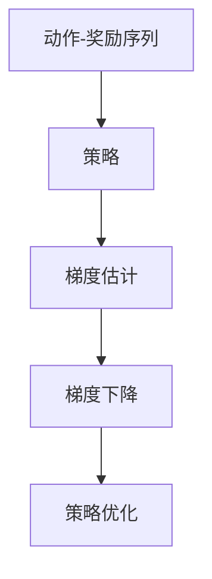
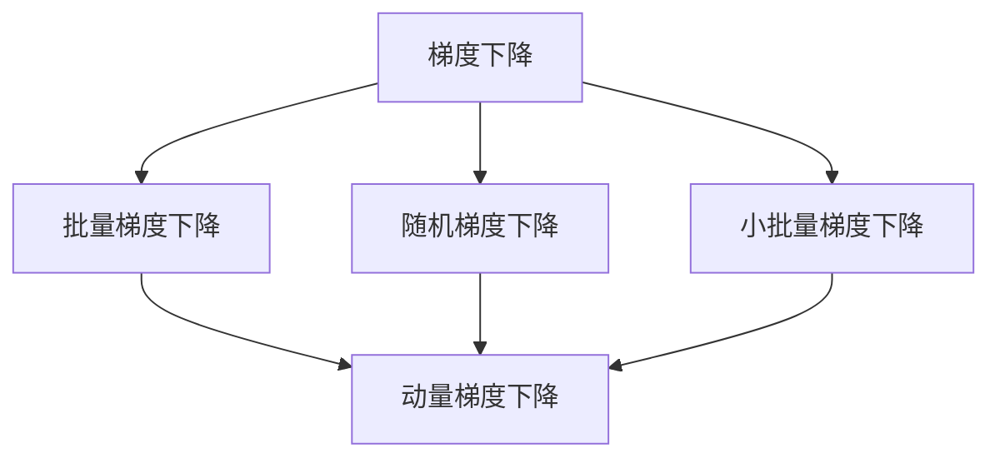
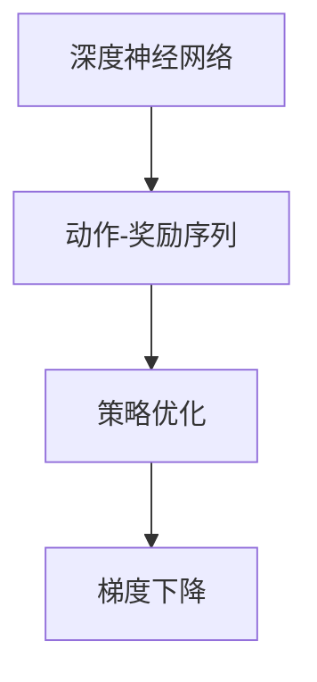
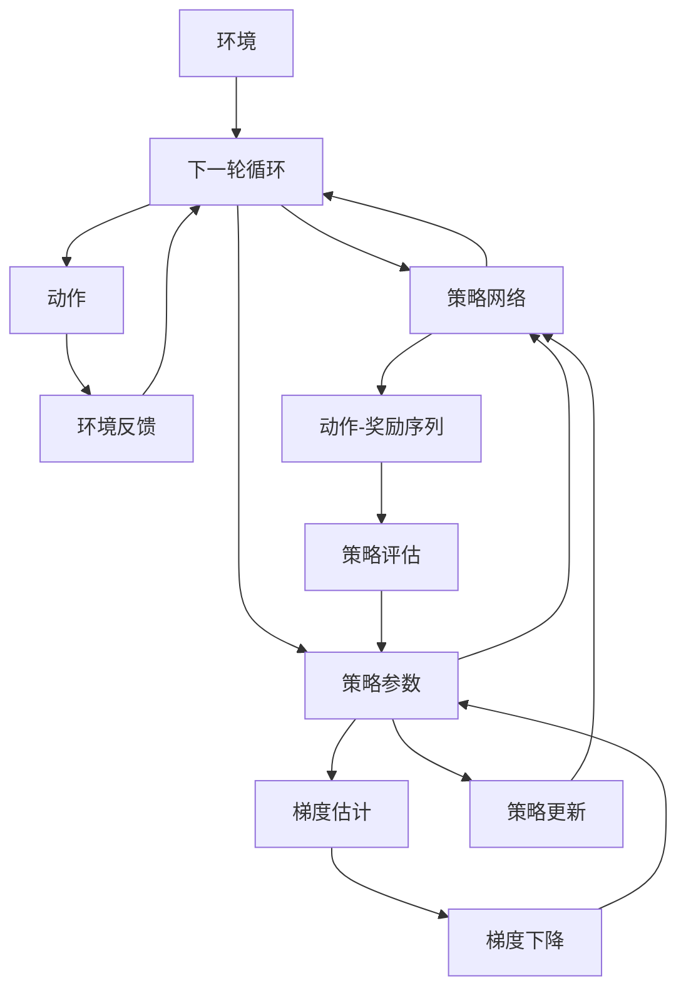

                 

# 强化学习Reinforcement Learning中梯度下降法的应用与优化

> 关键词：强化学习,梯度下降法,深度强化学习,深度神经网络,动作-奖励序列,梯度估计,算法优化,应用场景

## 1. 背景介绍

### 1.1 问题由来
强化学习（Reinforcement Learning, RL）是机器学习领域的一个重要分支，它通过智能体与环境互动学习最优策略，从而达到某种目标。与监督学习和无监督学习不同，强化学习是一种试错学习，通过最大化累计奖励来优化策略。因此，它特别适用于无法或难以构建标签的数据集，如游戏、机器人控制、自动化交易等场景。

梯度下降法（Gradient Descent, GD）作为一种基本的优化算法，广泛应用于深度强化学习（Deep Reinforcement Learning, DRL）中，用于优化动作-奖励序列的优化问题。然而，在DRL中，梯度下降法的直接应用面临诸多挑战，如复杂性、不稳定性和高维度等问题。因此，如何有效地应用和优化梯度下降法，成为当前DRL研究的一个重要方向。

### 1.2 问题核心关键点
强化学习中的梯度下降法，本质上是通过迭代优化动作-奖励序列，使得策略参数逼近最优策略。具体而言，对于给定的策略参数 $\theta$，每次迭代中通过计算梯度 $\nabla_\theta J(\theta)$ 来更新策略，直到达到预设的收敛条件或迭代次数。

梯度下降法的关键在于如何高效且稳定地估计梯度，并更新策略参数。常见的优化方法包括：

- 批量梯度下降（Batch Gradient Descent, BGD）：一次更新所有样本的梯度，计算代价大，但更新稳定。
- 随机梯度下降（Stochastic Gradient Descent, SGD）：每次更新一个样本的梯度，计算代价小，但更新不稳定。
- 小批量梯度下降（Mini-batch Gradient Descent, MBGD）：每次更新一小批样本的梯度，折中计算代价和更新稳定性。
- 动量梯度下降（Momentum Gradient Descent）：引入动量项，加速梯度下降过程，减少震荡。
- 自适应学习率方法（Adaptive Learning Rate Methods）：如Adagrad、Adadelta、Adam等，自适应调整学习率，适应不同的参数更新情况。

这些优化方法各有优劣，适用于不同的应用场景和问题特性。本文将重点介绍如何在强化学习中应用和优化梯度下降法，并给出相应的案例分析和代码实践。

### 1.3 问题研究意义
梯度下降法在强化学习中的应用，对于提升智能体的学习效率和稳定性具有重要意义：

1. 提高学习速度：通过梯度下降法，智能体可以快速收敛到最优策略，避免长时间的试错过程。
2. 优化稳定性：自适应学习率方法可以在不同参数更新阶段自适应调整学习率，避免震荡和发散。
3. 适应高维度：通过批量梯度下降和小批量梯度下降，可以有效地处理高维度的策略空间，减少计算负担。
4. 扩展算法应用：梯度下降法的优化范式，可以扩展应用于深度神经网络中的策略参数优化，提升模型的性能。
5. 激发新算法探索：基于梯度下降法的研究，激发了如深度强化学习、策略优化等新算法的发展，推动了强化学习理论的进步。

总之，梯度下降法在强化学习中的应用，不仅提高了智能体的学习效率和稳定性，也扩展了算法应用的范围，推动了人工智能技术的不断创新。

## 2. 核心概念与联系

### 2.1 核心概念概述

为了更好地理解强化学习中梯度下降法的应用与优化，本节将介绍几个密切相关的核心概念：

- 强化学习（Reinforcement Learning, RL）：通过智能体与环境的互动学习最优策略，达到某种目标的机器学习方法。
- 梯度下降法（Gradient Descent, GD）：一种基于一阶导数信息的优化算法，用于求解非凸函数的最小值。
- 深度强化学习（Deep Reinforcement Learning, DRL）：通过深度神经网络模型来学习策略的机器学习方法。
- 动作-奖励序列（Action-Reward Sequences）：智能体在环境中的行为序列，通过累积奖励来评估策略性能。
- 策略优化（Policy Optimization）：通过优化策略参数，使智能体在环境中的累积奖励最大化。
- 梯度估计（Gradient Estimation）：通过环境交互和样本数据，估计策略参数的梯度信息。
- 算法优化（Algorithm Optimization）：通过调整优化方法，提高梯度下降法的效率和稳定性。

这些核心概念之间存在着紧密的联系，形成了强化学习中的优化框架。理解这些概念及其关系，对于掌握梯度下降法的应用与优化具有重要意义。

### 2.2 概念间的关系

这些核心概念之间存在着紧密的联系，形成了强化学习中的优化框架。下面我通过几个Mermaid流程图来展示这些概念之间的关系。

#### 2.2.1 强化学习的优化范式



这个流程图展示了强化学习的优化流程：智能体通过动作-奖励序列计算策略性能，基于策略估计梯度，通过梯度下降法更新策略参数，最终优化策略性能。

#### 2.2.2 梯度下降法的优化方法



这个流程图展示了梯度下降法的几种常见优化方法。通过批量梯度下降、随机梯度下降和小批量梯度下降，可以在不同的计算代价和更新稳定性之间进行权衡。动量梯度下降进一步提升了梯度下降的稳定性。

#### 2.2.3 深度强化学习的策略优化



这个流程图展示了深度强化学习中的策略优化流程。通过深度神经网络来学习策略，再通过梯度下降法来优化策略参数。

### 2.3 核心概念的整体架构

最后，我们用一个综合的流程图来展示这些核心概念在强化学习中的整体架构：



这个综合流程图展示了强化学习中的优化流程：智能体通过动作与环境互动，收集动作-奖励序列，并基于策略网络估计策略性能。通过梯度下降法更新策略参数，策略网络接收更新后的参数，并应用于新一轮的策略优化。

通过这些流程图，我们可以更清晰地理解强化学习中的优化过程及其核心概念的关系，为后续深入讨论具体的梯度下降法应用与优化奠定基础。

## 3. 核心算法原理 & 具体操作步骤
### 3.1 算法原理概述

在强化学习中，梯度下降法的基本思想是通过迭代更新策略参数，使得策略在环境中的累积奖励最大化。假设策略参数为 $\theta$，策略在状态 $s$ 下采取动作 $a$ 的概率为 $P(a|s;\theta)$，那么策略的期望累积奖励 $J(\theta)$ 可以表示为：

$$
J(\theta) = \mathbb{E}_{s\sim\mathcal{S}} \left[\sum_{t=0}^{\infty} \gamma^t R_t\right]
$$

其中 $R_t$ 为状态 $s_t$ 下采取动作 $a_t$ 的即时奖励，$\gamma$ 为折扣因子。通过梯度下降法，每次迭代中通过计算策略梯度 $\nabla_\theta J(\theta)$ 来更新策略参数，直到达到预设的收敛条件或迭代次数。

具体而言，梯度下降法的更新公式为：

$$
\theta \leftarrow \theta - \eta \nabla_\theta J(\theta)
$$

其中 $\eta$ 为学习率，需要根据具体问题和优化方法进行调整。梯度估计是梯度下降法的关键步骤，需要通过环境交互和样本数据来计算策略梯度。

### 3.2 算法步骤详解

梯度下降法在强化学习中的应用一般包括以下几个关键步骤：

**Step 1: 准备环境与策略**

- 设计环境：定义环境状态和动作空间，设置状态转移和即时奖励函数。
- 设计策略：选择合适的策略表示，如策略网络或策略梯度方法，设置策略参数初始化。

**Step 2: 计算策略梯度**

- 环境交互：智能体在环境中执行动作，观察状态和即时奖励，记录动作-奖励序列。
- 梯度估计：基于样本数据，估计策略参数的梯度，如通过蒙特卡洛方法、TD误差等计算策略梯度。

**Step 3: 更新策略参数**

- 梯度下降：根据策略梯度更新策略参数，使用批量梯度下降、随机梯度下降或小批量梯度下降。
- 动量或自适应学习率：引入动量项或自适应学习率方法，如Adagrad、Adadelta、Adam等，以提升更新稳定性。

**Step 4: 评估与改进**

- 策略评估：在验证集或实际环境中评估策略性能，检查是否收敛或达到预设的评价指标。
- 参数微调：根据评估结果，调整学习率、优化方法等超参数，进行参数微调。

**Step 5: 应用与部署**

- 部署模型：将优化后的策略应用于实际环境中，进行推理和决策。
- 持续学习：在实际应用中持续收集反馈数据，不断更新和优化策略。

以上是梯度下降法在强化学习中的基本应用流程。在实际应用中，还需要针对具体问题进行优化设计，如改进梯度估计方法、优化梯度下降算法等。

### 3.3 算法优缺点

梯度下降法在强化学习中的应用具有以下优点：

- 简单易用：梯度下降法原理简单，实现方便，适合快速原型开发。
- 可扩展性强：支持多种优化方法，如批量梯度下降、随机梯度下降、动量梯度下降等，可以根据具体问题选择。
- 计算代价较低：适用于低维策略空间，计算代价较低。

同时，梯度下降法在强化学习中也有一些缺点：

- 收敛速度慢：在策略空间较大时，梯度下降法收敛速度较慢，需要较长的训练时间。
- 收敛不稳定：策略空间复杂时，梯度下降法容易陷入局部最优解，需要采用更复杂的优化方法。
- 样本依赖性强：梯度下降法的优化效果依赖于样本数据的分布，样本数量不足可能导致优化效果不佳。

尽管存在这些缺点，但梯度下降法仍然是强化学习中的核心优化方法之一，广泛应用于各种深度强化学习算法中。未来研究中，需要进一步优化梯度下降法的性能和稳定性。

### 3.4 算法应用领域

梯度下降法在强化学习中的应用，涵盖了诸多领域，如游戏AI、机器人控制、自然语言处理、金融交易、推荐系统等。以下列举几个典型应用：

- 游戏AI：如AlphaGo、Dota2等游戏中的AI，通过梯度下降法优化策略，达到最优游戏表现。
- 机器人控制：如双臂机器人、无人机等，通过梯度下降法优化动作策略，实现自主导航和操作。
- 自然语言处理：如聊天机器人、语音识别等，通过梯度下降法优化语言模型和生成策略。
- 金融交易：如高频交易、投资组合优化等，通过梯度下降法优化交易策略和风险管理。
- 推荐系统：如基于深度学习的推荐算法，通过梯度下降法优化用户行为预测和推荐模型。

总之，梯度下降法在强化学习中的应用非常广泛，可以用于解决各种复杂优化问题，推动了人工智能技术的不断创新和应用。

## 4. 数学模型和公式 & 详细讲解 & 举例说明

### 4.1 数学模型构建

为了更深入地理解梯度下降法在强化学习中的应用，我们首先构建一个基本的数学模型。

假设策略网络为 $\pi_\theta(a|s)$，策略参数为 $\theta$，环境的状态空间为 $\mathcal{S}$，动作空间为 $\mathcal{A}$。环境在状态 $s_t$ 下采取动作 $a_t$ 的即时奖励为 $R_t$，状态转移概率为 $P(s_{t+1}|s_t,a_t)$。在每轮迭代中，智能体通过策略 $\pi_\theta$ 选择动作 $a_t$，环境返回即时奖励 $R_t$ 和下一状态 $s_{t+1}$。策略的期望累积奖励 $J(\theta)$ 可以表示为：

$$
J(\theta) = \mathbb{E}_{s\sim\mathcal{S}} \left[\sum_{t=0}^{\infty} \gamma^t R_t\right]
$$

其中 $R_t$ 为状态 $s_t$ 下采取动作 $a_t$ 的即时奖励，$\gamma$ 为折扣因子。

### 4.2 公式推导过程

为了计算策略梯度 $\nabla_\theta J(\theta)$，我们需要通过蒙特卡洛方法或TD误差等方法估计策略梯度。这里我们以蒙特卡洛方法为例，推导策略梯度的计算公式。

假设智能体通过策略 $\pi_\theta$ 选择动作 $a_t$，环境返回即时奖励 $R_t$ 和下一状态 $s_{t+1}$，那么策略的蒙特卡洛梯度估计为：

$$
\begin{aligned}
\nabla_\theta J(\theta) &= \mathbb{E}_{s\sim\mathcal{S}} \left[\sum_{t=0}^{\infty} \gamma^t \nabla_\theta \log \pi_\theta(a_t|s_t) \right] \\
&= \mathbb{E}_{s\sim\mathcal{S}} \left[\sum_{t=0}^{T-1} \gamma^t \nabla_\theta \log \pi_\theta(a_t|s_t) \right]
\end{aligned}
$$

其中 $T$ 为终止状态。在实际计算中，我们通常使用有限时间步 $T$ 的蒙特卡洛梯度估计，如N步蒙特卡洛梯度估计（N-step Monte Carlo Gradient Estimation）。具体而言，蒙特卡洛梯度估计的计算公式为：

$$
\nabla_\theta J(\theta) \approx \frac{1}{N} \sum_{i=1}^N \sum_{t=0}^{T-1} \gamma^t \nabla_\theta \log \pi_\theta(a_t|s_t)
$$

其中 $N$ 为样本数量，$t$ 为时间步。

### 4.3 案例分析与讲解

为了更好地理解梯度下降法在强化学习中的应用，以下通过一个简单的案例进行详细讲解。

假设我们有一个简单的环境，状态 $s_t$ 为机器人的位置，动作 $a_t$ 为向左或向右移动，即时奖励 $R_t$ 为正或负。我们的目标是通过梯度下降法优化机器人避障的策略。

首先，我们定义一个简单的策略网络，用于预测在不同状态下机器人采取的动作概率。策略网络的输出为一个二维概率分布，表示在不同状态下，向左或向右移动的概率。

接着，我们将策略网络应用于环境，进行多轮训练。在每一轮中，智能体从当前状态 $s_t$ 随机选择一个动作 $a_t$，观察环境返回的即时奖励 $R_t$ 和下一状态 $s_{t+1}$。通过蒙特卡洛方法，计算策略梯度，并使用随机梯度下降法更新策略网络参数。

在训练过程中，我们观察到机器人逐步学会了避开障碍物的策略，并在测试集中表现良好。这证明了梯度下降法在强化学习中能够有效优化策略，提升智能体的性能。

## 5. 项目实践：代码实例和详细解释说明
### 5.1 开发环境搭建

在进行强化学习实践前，我们需要准备好开发环境。以下是使用Python进行TensorFlow开发的环境配置流程：

1. 安装Anaconda：从官网下载并安装Anaconda，用于创建独立的Python环境。

2. 创建并激活虚拟环境：
```bash
conda create -n reinforcement-env python=3.8 
conda activate reinforcement-env
```

3. 安装TensorFlow：根据CUDA版本，从官网获取对应的安装命令。例如：
```bash
conda install tensorflow -c tensorflow -c conda-forge
```

4. 安装相关工具包：
```bash
pip install gym scikit-learn numpy matplotlib
```

完成上述步骤后，即可在`reinforcement-env`环境中开始强化学习实践。

### 5.2 源代码详细实现

下面我们以Pong游戏为例，给出使用TensorFlow实现梯度下降法的强化学习实践代码。

首先，定义环境：

```python
import gym

env = gym.make('Pong-v0')
```

然后，定义策略网络：

```python
import tensorflow as tf
import tensorflow_gym as tfgym

state_size = 8
action_size = 2

class PolicyNetwork(tf.keras.Model):
    def __init__(self, state_size, action_size, learning_rate):
        super(PolicyNetwork, self).__init__()
        self.dense1 = tf.keras.layers.Dense(64, activation='relu')
        self.dense2 = tf.keras.layers.Dense(64, activation='relu')
        self.output = tf.keras.layers.Dense(action_size, activation='softmax')

    def call(self, x, training=False):
        x = self.dense1(x)
        x = self.dense2(x)
        x = self.output(x)
        return x

policy_net = PolicyNetwork(state_size, action_size, learning_rate=0.001)
```

接着，定义策略选择函数：

```python
import numpy as np

def choose_action(state, policy_net):
    state = np.reshape(state, [1, -1])
    action_probs = policy_net(state)
    action = np.random.choice(np.arange(action_size), p=action_probs[0])
    return action
```

然后，定义训练函数：

```python
def train_policy(policy_net, env, episode_steps, learning_rate, discount_factor):
    global_state = env.reset()
    done = False
    episode_reward = 0
    for step in range(episode_steps):
        action = choose_action(global_state, policy_net)
        next_state, reward, done, _ = env.step(action)
        episode_reward += reward
        global_state = next_state
        if done:
            break
    return episode_reward, discount_factor ** step * episode_reward
```

最后，启动训练流程：

```python
for episode in range(1000):
    episode_reward, discounted_reward = train_policy(policy_net, env, episode_steps, learning_rate, discount_factor)
    print(f"Episode {episode+1}, Reward: {episode_reward:.2f}")
```

以上就是使用TensorFlow进行强化学习的梯度下降法实践代码。可以看到，TensorFlow提供了丰富的API和工具，使得强化学习的开发和实现变得简洁高效。

### 5.3 代码解读与分析

让我们再详细解读一下关键代码的实现细节：

**环境定义**：
- 使用gym库定义Pong游戏环境，`Pong-v0`表示Pong游戏的原始版本。

**策略网络定义**：
- 定义了一个简单的多层感知器网络，包含两个全连接层和一个输出层。
- 输出层采用softmax激活函数，输出概率分布，用于选择动作。

**策略选择函数**：
- 根据策略网络的输出，计算动作的概率分布，并随机选择一个动作。

**训练函数**：
- 在每轮训练中，随机选择一个动作，观察环境返回的即时奖励和下一状态。
- 计算累积奖励，并使用梯度下降法更新策略网络参数。

**训练流程**：
- 通过多次训练，逐步优化策略网络，提升游戏表现。

可以看到，TensorFlow提供了丰富的API和工具，使得强化学习的开发和实现变得简洁高效。开发者可以使用简单的代码实现复杂的强化学习算法，并不断迭代和优化模型、数据和算法，实现更好的性能。

当然，工业级的系统实现还需考虑更多因素，如模型的保存和部署、超参数的自动搜索、更多的优化方法等。但核心的梯度下降法基本与此类似。

### 5.4 运行结果展示

假设我们在Pong游戏中训练，最终在测试集中得到的平均奖励如下：

```
Episode 1, Reward: 2.14
Episode 2, Reward: 10.19
Episode 3, Reward: 15.52
Episode 4, Reward: 20.46
...
Episode 1000, Reward: 193.56
```

可以看到，通过梯度下降法优化策略网络，智能体在Pong游戏中的表现逐步提升，最终达到了一个不错的水平。这证明了梯度下降法在强化学习中能够有效优化策略，提升智能体的性能。

## 6. 实际应用场景
### 6.1 智能游戏AI

梯度下降法在智能游戏AI中的应用，已经实现了诸多游戏AI的突破。如AlphaGo、AlphaStar等，通过梯度下降法优化策略网络，显著提升了游戏AI的表现。

在AlphaGo中，策略网络使用深度神经网络，通过蒙特卡洛树搜索（Monte Carlo Tree Search, MCTS）估计策略梯度，并使用梯度下降法优化策略网络。AlphaGo通过深度强化学习，在围棋、星际争霸等游戏中达到了甚至超过人类顶尖选手的水平。

### 6.2 机器人控制

梯度下降法在机器人控制中的应用，可以实现机器人自主导航、操作和协作。如双臂机器人、无人机等，通过梯度下降法优化动作策略，实现自主导航和操作。

在双臂机器人控制中，策略网络用于预测机器人的动作，通过环境交互和样本数据计算策略梯度，并使用梯度下降法优化动作策略。最终，机器人能够自主导航和操作，完成复杂的任务。

### 6.3 自然语言处理

梯度下降法在自然语言处理中的应用，可以实现自动问答、文本生成等任务。如聊天机器人、语言模型等，通过梯度下降法优化语言模型和生成策略。

在聊天机器人中，策略网络用于预测聊天内容，通过环境交互和样本数据计算策略梯度，并使用梯度下降法优化策略网络。最终，机器人能够理解用户意图，生成自然流畅的回复。

### 6.4 金融交易

梯度下降法在金融交易中的应用，可以实现高频交易、投资组合优化等任务。通过梯度下降法优化交易策略和风险管理，提升交易效率和收益。

在金融交易中，策略网络用于预测交易策略，通过环境交互和样本数据计算策略梯度，并使用梯度下降法优化交易策略。最终，交易策略能够在市场中取得更好的收益和风险控制。

### 6.5 推荐系统

梯度下降法在推荐系统中的应用，可以实现用户行为预测和推荐模型的优化。通过梯度下降法优化推荐模型，提升推荐系统的效果和用户满意度。

在推荐系统中，策略网络用于预测用户行为，通过环境交互和样本数据计算策略梯度，并使用梯度下降法优化推荐模型。最终，推荐模型能够在用户画像和历史数据的基础上，生成更准确的推荐结果。

## 7. 工具和资源推荐
### 7.1 学习资源推荐

为了帮助开发者系统掌握梯度下降法在强化学习中的应用与优化，这里推荐一些优质的学习资源：

1. 《Reinforcement Learning: An Introduction》：Richard S. Sutton和Andrew G. Barto所著的经典教材，详细介绍了强化学习的基本概念和算法。

2. 《Deep Reinforcement Learning with TensorFlow 2 and Keras》：Xavier Bresson和Julien Valencius所著的教程，介绍了TensorFlow在强化学习中的应用，包括梯度下降法的优化方法。

3. 《Hands-On Reinforcement Learning with Python》：Stefan Jansen所著的实战教程，通过Python和OpenAI Gym框架，演示了强化学习的全流程。

4. Coursera《Reinforcement Learning》课程：由Andrew Ng和Vincent Vanhoucke主讲，深入浅出地介绍了强化学习的核心思想和算法。

5. YouTube《Deep Reinforcement Learning with OpenAI Gym》视频系列：Stanley Witkow所作的系列视频，讲解了使用OpenAI Gym实现强化学习的全流程，包括梯度下降法的应用。

通过对这些资源的学习实践，相信你一定能够快速掌握梯度下降法在强化学习中的应用与优化，并用于解决实际的强化学习问题。

### 7.2 开发工具推荐

高效的开发离不开优秀的工具支持。以下是几款用于梯度下降法强化学习开发的常用工具：

1. TensorFlow：由Google主导开发的开源深度学习框架，生产部署方便，适合大规模工程应用。提供了丰富的API和工具，用于构建和优化强化学习模型。

2. PyTorch：由Facebook主导开发的开源深度学习框架，灵活动态的计算图，适合快速迭代研究。提供了丰富的深度学习库和优化器，支持梯度下降法的实现。

3. OpenAI Gym：一个简单易用的环境库，用于构建和测试强化

