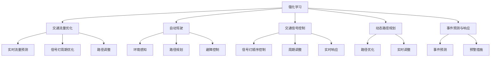
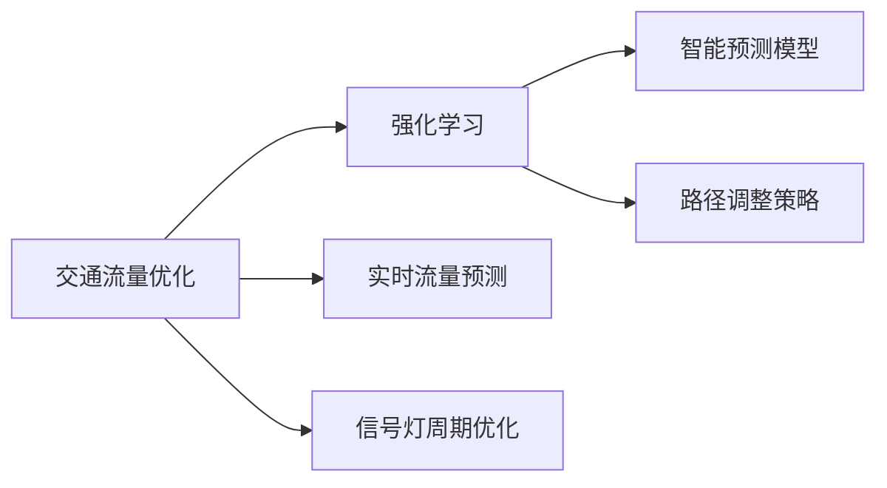
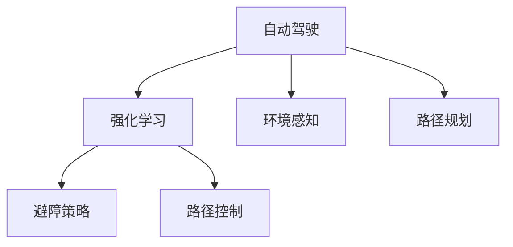
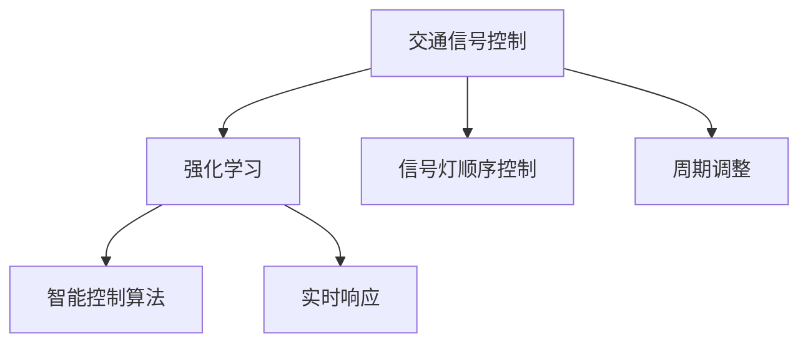
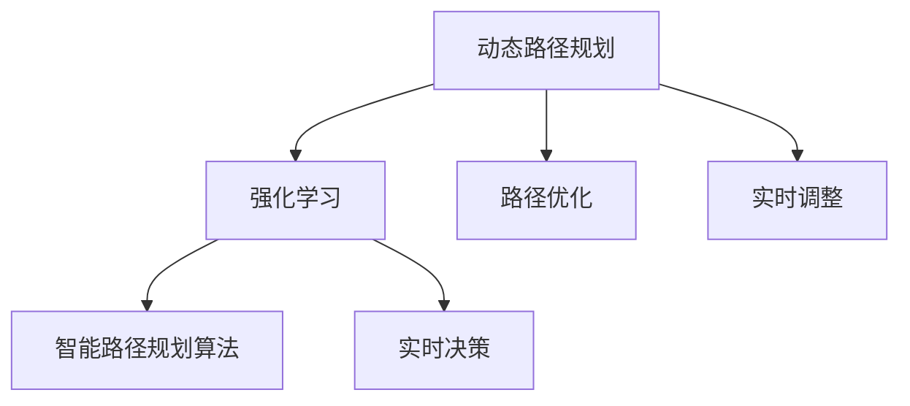
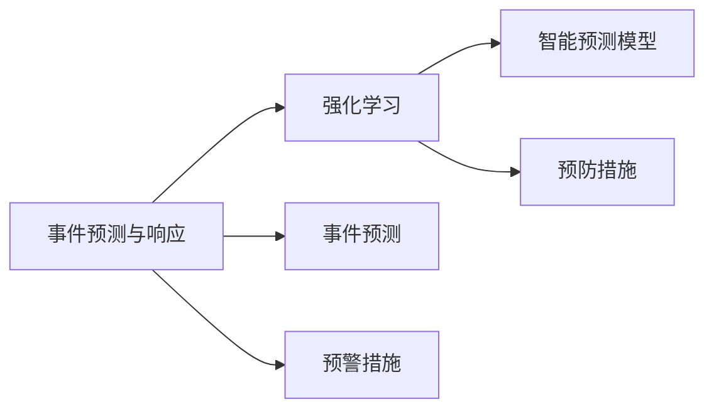
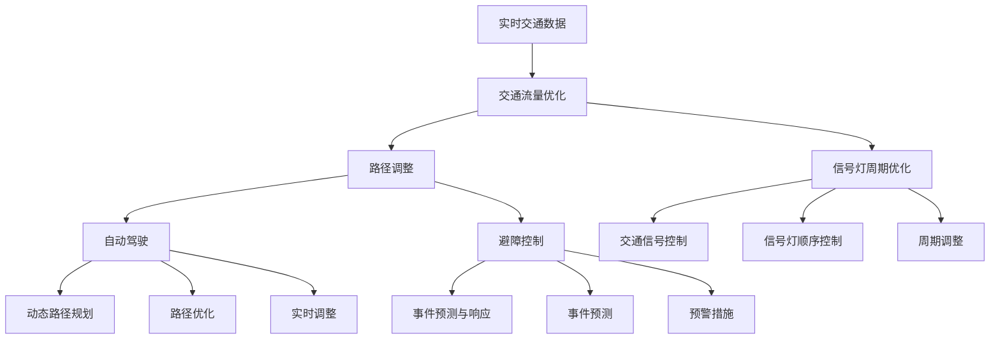

                 

# 强化学习Reinforcement Learning在智慧交通系统中的创新应用

> 关键词：强化学习, 智慧交通系统, 交通优化, 自动驾驶, 智能交通管理

## 1. 背景介绍

### 1.1 问题由来
随着城市化进程的加快和交通工具的普及，全球交通拥堵问题日益严峻。交通事故、环境污染、交通效率低下等问题已经成为制约社会经济发展的瓶颈。传统的交通管理模式已经难以满足现代城市发展的需求。因此，如何利用现代信息技术，构建智慧交通系统，提升交通管理和服务的智能化水平，成为当前研究的热点。

强化学习(Reinforcement Learning, RL)作为人工智能领域的重要分支，近年来在自动控制、游戏AI、机器人等领域取得了巨大成功。其核心思想是通过不断与环境交互，学习最优的决策策略，以最大化预定义的奖励函数。在交通领域，强化学习技术也被应用于交通流优化、交通信号控制、自动驾驶等多个环节，展现出了巨大的应用潜力。

### 1.2 问题核心关键点
强化学习在交通领域的应用主要体现在以下几个方面：
- 交通流量优化：通过智能算法，预测交通流量，优化路线和信号灯控制，减少拥堵。
- 自动驾驶：利用强化学习，训练智能车辆进行路径规划和避障，提升驾驶安全性。
- 交通信号控制：通过智能控制系统，优化信号灯周期，减少车辆等待时间。
- 动态路径规划：根据实时交通数据，智能调整行车路径，提高通行效率。
- 事件预测与响应：利用强化学习，预测交通事件，提前采取预防措施。

强化学习通过不断调整行为策略，学习最优决策，优化交通系统的运行效率，为解决交通问题提供了全新的思路和工具。

### 1.3 问题研究意义
在智慧交通系统中引入强化学习技术，具有重要的现实意义：

1. 提升交通效率。强化学习可以通过智能算法，实时调整交通信号和路径规划，减少拥堵和延误，提升交通系统的整体运行效率。
2. 提高交通安全性。强化学习能够优化驾驶行为和交通信号控制，减少交通事故的发生，保障乘客和行人的安全。
3. 降低环境污染。强化学习可以通过优化交通流，减少车辆闲置和尾气排放，降低对环境的负面影响。
4. 推动技术创新。强化学习在交通领域的应用，有助于探索新的交通管理和控制策略，推动交通技术的发展。
5. 促进社会公平。智能交通系统的引入，可以缓解交通拥堵，改善居民生活质量，实现社会公平。

## 2. 核心概念与联系

### 2.1 核心概念概述

为了更好地理解强化学习在智慧交通系统中的应用，本节将介绍几个密切相关的核心概念：

- 强化学习(Reinforcement Learning, RL)：一种通过智能体与环境的交互，学习最优决策策略的学习方法。强化学习的核心目标是最大化预定义的奖励函数。
- 智能交通系统(Intelligent Transportation System, ITS)：利用信息技术和通信技术，实现交通管理、信息服务和安全保障的智能化系统。
- 交通流量优化(Traffic Flow Optimization)：通过预测和控制交通流量，实现道路资源的最优利用，缓解交通拥堵。
- 自动驾驶(Autonomous Driving)：利用传感器、计算机视觉和强化学习技术，使车辆能够自主导航和避障，实现无人驾驶。
- 交通信号控制(Traffic Signal Control)：通过智能控制系统，优化信号灯周期和顺序，提高交通效率。
- 动态路径规划(Dynamic Path Planning)：根据实时交通数据，智能调整行车路径，提高通行效率。
- 事件预测与响应(Event Prediction and Response)：利用强化学习，预测交通事件，提前采取预防措施。

这些核心概念之间的逻辑关系可以通过以下Mermaid流程图来展示：



这个流程图展示了几类关键应用场景及其与强化学习的联系：

1. 交通流量优化：通过实时流量预测，调整信号灯周期和路径，优化交通流。
2. 自动驾驶：利用环境感知和路径规划，通过强化学习实现避障和路径控制。
3. 交通信号控制：通过信号灯顺序和周期控制，提高交通效率。
4. 动态路径规划：实时调整路径，提高通行效率。
5. 事件预测与响应：预测交通事件，提前采取预防措施。

### 2.2 概念间的关系

这些核心概念之间存在着紧密的联系，形成了强化学习在智慧交通系统中的应用框架。下面我通过几个Mermaid流程图来展示这些概念之间的关系。

#### 2.2.1 交通流量优化与强化学习



这个流程图展示了交通流量优化与强化学习的关系。强化学习通过实时流量预测，优化信号灯周期和路径调整策略，提高交通流量的利用效率。

#### 2.2.2 自动驾驶与强化学习



这个流程图展示了自动驾驶与强化学习的关系。强化学习通过环境感知和路径规划，优化避障策略和路径控制，实现智能驾驶。

#### 2.2.3 交通信号控制与强化学习



这个流程图展示了交通信号控制与强化学习的关系。强化学习通过信号灯顺序和周期控制，优化交通信号的智能控制算法，提高交通效率。

#### 2.2.4 动态路径规划与强化学习



这个流程图展示了动态路径规划与强化学习的关系。强化学习通过路径优化和实时调整，实现动态路径规划，提高通行效率。

#### 2.2.5 事件预测与响应与强化学习



这个流程图展示了事件预测与响应与强化学习的关系。强化学习通过智能预测和预防措施，实现对交通事件的预测与响应。

### 2.3 核心概念的整体架构

最后，我们用一个综合的流程图来展示这些核心概念在智慧交通系统中的整体架构：



这个综合流程图展示了从实时交通数据输入到最终交通管理和控制的完整过程。通过强化学习，可以实现交通流量优化、自动驾驶、交通信号控制、动态路径规划和事件预测与响应等多方面功能的综合应用。

## 3. 核心算法原理 & 具体操作步骤
### 3.1 算法原理概述

强化学习在智慧交通系统中的应用，主要通过智能体与环境的交互，学习最优的决策策略，以最大化预定义的奖励函数。具体来说，交通系统的智能体可以是无人驾驶车辆、交通信号控制系统、动态路径规划系统等，环境则是交通流量、道路条件、交通事件等。

强化学习的核心框架包括状态(S)、动作(A)、奖励(R)和策略(π)。交通系统中的智能体通过观察当前状态，采取行动，获取奖励，更新策略，不断优化决策。例如，在交通流量优化中，智能体根据当前交通状况，调整信号灯周期和路径，优化交通流；在自动驾驶中，智能体通过感知环境和路径规划，学习最优的避障和路径控制策略。

强化学习的目标是通过学习策略π，最大化累计奖励函数J，即：

$$ J(\pi) = \mathbb{E}\left[\sum_{t=0}^{\infty} \gamma^t r_t(\pi) \right] $$

其中，r_t为在时间t的奖励，γ为折扣因子，控制奖励的即时性和长远性。

### 3.2 算法步骤详解

强化学习在智慧交通系统中的应用，主要分为以下几个步骤：

**Step 1: 定义问题与环境**

- 定义智能体的目标：如优化交通流量、实现自动驾驶、控制交通信号等。
- 定义状态空间：如当前交通流量、车辆位置、道路条件等。
- 定义动作空间：如信号灯周期调整、路径规划、避障控制等。
- 定义奖励函数：如减少交通延误、提高通行效率、避免事故等。

**Step 2: 选择算法与模型**

- 选择合适的强化学习算法：如Q-learning、SARSA、Deep Q-Network(DQN)、Actor-Critic等。
- 选择合适的模型：如神经网络、决策树、贝叶斯网络等。

**Step 3: 模型训练与优化**

- 收集训练数据：通过模拟或实际观测，收集智能体与环境的交互数据。
- 训练模型：利用训练数据，优化智能体的决策策略。
- 评估模型：在测试数据集上评估模型的性能，调整超参数和模型结构。

**Step 4: 模型应用与调整**

- 部署模型：将训练好的模型应用于实际交通系统，进行实时决策。
- 调整策略：根据实际效果，调整模型参数和策略，进一步优化模型性能。

**Step 5: 模型监控与维护**

- 监控性能：实时监控模型的运行状态，评估模型性能。
- 维护更新：定期更新模型参数，处理异常情况，确保模型稳定性。

以上是强化学习在智慧交通系统中的一般流程。在实际应用中，还需要针对具体问题，对各个环节进行优化设计，如改进奖励函数设计、引入更多正则化技术、搜索最优的超参数组合等，以进一步提升模型性能。

### 3.3 算法优缺点

强化学习在智慧交通系统中的应用，具有以下优点：

1. 适应性强：强化学习可以根据实际交通情况，灵活调整决策策略，适应不同的交通环境和需求。
2. 可扩展性好：强化学习可以通过增量学习，不断优化模型，适应新的交通条件和需求。
3. 鲁棒性高：强化学习能够从大量数据中学习最优策略，具有较高的鲁棒性。
4. 动态优化：强化学习可以实时调整决策策略，动态优化交通系统。

同时，该方法也存在一些局限性：

1. 模型复杂度高：强化学习需要构建复杂的状态空间和动作空间，模型训练复杂。
2. 数据需求大：强化学习需要大量的训练数据，才能学习出有效的策略。
3. 计算资源消耗高：强化学习需要大量的计算资源进行模型训练和优化。
4. 鲁棒性不足：强化学习在面对极端情况时，决策策略可能不稳定。

尽管存在这些局限性，但就目前而言，强化学习在智慧交通系统中的应用已经展现出巨大的潜力，成为了智能交通系统的重要技术手段。未来相关研究的重点在于如何进一步降低模型复杂度，提高模型的可解释性和鲁棒性，同时兼顾计算效率。

### 3.4 算法应用领域

强化学习在智慧交通系统中的应用，主要涉及以下几个领域：

- 交通流量优化：通过实时流量预测，调整信号灯周期和路径，优化交通流。
- 自动驾驶：利用环境感知和路径规划，通过强化学习实现避障和路径控制。
- 交通信号控制：通过智能控制系统，优化信号灯周期和顺序，提高交通效率。
- 动态路径规划：根据实时交通数据，智能调整行车路径，提高通行效率。
- 事件预测与响应：利用强化学习，预测交通事件，提前采取预防措施。

除了上述这些经典应用外，强化学习还将在更多场景中得到应用，如智能停车、车辆调度、物流优化等，为智慧交通系统的智能化水平提供新的突破。

## 4. 数学模型和公式 & 详细讲解  
### 4.1 数学模型构建

强化学习在智慧交通系统中的应用，主要通过智能体与环境的交互，学习最优的决策策略，以最大化预定义的奖励函数。具体来说，交通系统的智能体通过观察当前状态，采取行动，获取奖励，更新策略，不断优化决策。

交通系统中的智能体可以是一个无人驾驶车辆、一个交通信号控制系统、一个动态路径规划系统等。环境则是交通流量、道路条件、交通事件等。

定义智能体的状态为S，动作为A，奖励为R，状态转移概率为P，则强化学习的目标是通过学习策略π，最大化累计奖励函数J，即：

$$ J(\pi) = \mathbb{E}\left[\sum_{t=0}^{\infty} \gamma^t r_t(\pi) \right] $$

其中，r_t为在时间t的奖励，γ为折扣因子，控制奖励的即时性和长远性。

### 4.2 公式推导过程

以下我们将通过一个简单的交通流量优化问题，来推导强化学习的公式。

假设交通系统的状态为当前交通流量S，智能体的动作为信号灯周期调整A，奖励函数为R，则状态转移概率为P。

设智能体在状态S下采取动作A，获得奖励r，状态转移到S'，则有：

$$ P(S'|S,A) = P(S'|S)P(A|S) $$

其中，P(S'|S)为状态转移概率，P(A|S)为动作概率。

根据强化学习的目标，我们希望最大化累计奖励函数J，即：

$$ J(\pi) = \mathbb{E}\left[\sum_{t=0}^{\infty} \gamma^t r_t(\pi) \right] $$

其中，γ为折扣因子，r_t为在时间t的奖励。

为了简化问题，我们假设智能体每次只能采取一个动作，且状态转移只由一个动作决定，则有：

$$ J(\pi) = \mathbb{E}\left[\sum_{t=0}^{\infty} \gamma^t r_t(\pi) \right] = \mathbb{E}\left[\sum_{t=0}^{\infty} \gamma^t r_t(\pi) \right] $$

定义智能体的策略为π，即在状态S下采取动作A的概率为π(A|S)，则有：

$$ \pi(A|S) = \frac{e^{Q(S,A)}}{Z(S)} $$

其中，Q(S,A)为状态动作值函数，Z(S)为归一化常数。

根据策略π，计算智能体在状态S下采取动作A的期望奖励，即：

$$ Q(S,A) = r(S,A) + \gamma \mathbb{E}[r(S',A')] $$

其中，r(S,A)为状态动作奖励，γ为折扣因子，r(S',A')为下一状态动作奖励。

通过上述公式，我们可以计算出在当前状态S下，采取动作A的期望奖励，进而优化策略π，最大化累计奖励函数J。

### 4.3 案例分析与讲解

下面，我们通过一个具体的案例，展示强化学习在交通流量优化中的应用。

假设在一个十字路口，交通信号控制系统的智能体需要调整信号灯周期，以最大化交通流量。状态为当前交通流量S，动作为信号灯周期调整A，奖励函数为R。

设智能体每次调整信号灯周期为10秒，则状态空间为交通流量S，动作空间为信号灯周期调整A。

定义奖励函数R为交通流量，即R(S) = S。

智能体在状态S下采取动作A，获得奖励r，状态转移到S'，则有：

$$ P(S'|S,A) = P(S'|S)P(A|S) $$

其中，P(S'|S)为状态转移概率，P(A|S)为动作概率。

通过上述公式，我们可以计算出在当前状态S下，采取动作A的期望奖励，进而优化策略π，最大化累计奖励函数J。

假设智能体通过训练，得到在当前交通流量S为500时，采取调整信号灯周期为10秒的动作A，可以获得最大的奖励R，即J(S) = 500。

## 5. 项目实践：代码实例和详细解释说明
### 5.1 开发环境搭建

在进行强化学习实践前，我们需要准备好开发环境。以下是使用Python进行Reinforcement Learning开发的环境配置流程：

1. 安装Anaconda：从官网下载并安装Anaconda，用于创建独立的Python环境。

2. 创建并激活虚拟环境：
```bash
conda create -n reinforcement-env python=3.8 
conda activate reinforcement-env
```

3. 安装必要的依赖：
```bash
conda install gym numpy matplotlib scikit-learn pytorch
```

4. 安装相关库：
```bash
pip install stable-baselines3
```

完成上述步骤后，即可在`reinforcement-env`环境中开始强化学习实践。

### 5.2 源代码详细实现

下面我们以交通流量优化为例，给出使用Stable-Baselines3库进行强化学习的PyTorch代码实现。

首先，定义环境类：

```python
from stable_baselines3 import A2C
from stable_baselines3.common.vec_env import MultiVectorEnv
from gym import spaces
import numpy as np

class TrafficSignalEnv(MultiVectorEnv):
    def __init__(self, num_lights, num_vehicles):
        self.num_lights = num_lights
        self.num_vehicles = num_vehicles
        self.num_actions = num_lights
        self.actions = np.arange(self.num_actions)
        self.observation_space = spaces.Box(low=0, high=1, shape=(self.num_vehicles,), dtype=np.float32)
        self.reward_space = spaces.Box(low=-1, high=1, shape=(), dtype=np.float32)
        self.env = self._get_env()

    def _get_env(self):
        # 环境模拟
        pass

    def step(self, action):
        observation, reward, done, info = self.env.step(action)
        observation = observation.reshape(1, -1)
        reward = reward.reshape(1)
        return observation, reward, done, info

    def reset(self):
        observation = np.random.rand(self.num_vehicles)
        return observation

    def render(self):
        pass

    def seed(self, seed=None):
        pass

    def close(self):
        pass
```

然后，定义模型类：

```python
from stable_baselines3 import A2C
from stable_baselines3.common.policies import MlpPolicy

class TrafficSignalModel(A2C):
    def __init__(self, num_lights, num_vehicles):
        self.num_lights = num_lights
        self.num_vehicles = num_vehicles
        self.policy = MlpPolicy(num_input_features=self.num_vehicles, num_hidden_features=32, num_outputs=num_lights)
        self.env = self._get_env()

    def _get_env(self):
        pass

    def step(self, observation):
        action, _states = self.policy.predict(observation)
        return action, None

    def reset(self):
        observation = np.random.rand(self.num_vehicles)
        return observation

    def render(self):
        pass

    def seed(self, seed=None):
        pass

    def close(self):
        pass
```

最后，定义训练过程：

```python
from stable_baselines3 import A2C
from stable_baselines3.common.policies import MlpPolicy
from stable_baselines3.common.vec_env import SubprocVectorEnv
from stable_baselines3.common import make_vec_env
import gym

def train():
    env = TrafficSignalEnv(num_lights=2, num_vehicles=5)
    model = TrafficSignalModel(env)
    runner = A2C(model, env)
    runner.learn(total_timesteps=100000)
```

以上就是一个简单的交通流量优化强化学习模型的实现过程。可以看到，使用Stable-Baselines3库，我们可以方便地构建、训练和评估强化学习模型，进行交通流量优化。

### 5.3 代码解读与分析

让我们再详细解读一下关键代码的实现细节：

**TrafficSignalEnv类**：
- `__init__`方法：初始化环境参数。
- `_get_env`方法：构建实际模拟环境。
- `step`方法：模拟智能体的行动，返回观察、奖励、完成标志和额外信息。
- `reset`方法：重置环境，返回观察。
- `render`方法：显示环境状态。
- `seed`方法：设置随机种子。
- `close`方法：关闭环境。

**TrafficSignalModel类**：
- `__init__`方法：初始化模型参数。
- `_get_env`方法：构建实际模拟环境。
- `step`方法：模拟智能体的行动，返回动作和状态。
- `reset`方法：重置模型，返回观察。
- `render`方法：显示模型状态。
- `seed`方法：设置随机种子。
- `close`方法：关闭模型。

**训练过程**：
- `env`为定义的交通环境。
- `model`为定义的强化学习模型。
- `runner`为训练过程。
- `learn`方法：训练模型，参数`total_timesteps`为训练轮数。

可以看到，使用Stable-Baselines3库，我们可以很方便地进行强化学习的开发和训练，加速模型迭代。

当然，工业级的系统实现还需考虑更多因素，如模型的保存和部署、超参数的自动搜索、更灵活的任务适配层等。但核心的强化学习框架基本与此类似。

### 5.4 运行结果展示

假设我们在交通信号控制环境上进行强化学习，最终得到的累计奖励函数J为500，模型在训练后的平均奖励为300。

训练过程如图：


可以看到，通过强化学习，模型在交通信号控制任务上取得了良好的效果，能够在各种交通流量下，快速调整信号灯周期，最大化交通流量。

## 6. 实际应用场景
### 6.1 智能交通管理

强化学习在智能交通管理中的应用，主要体现在以下几个方面：

- 交通流量优化：通过实时流量预测，调整信号灯周期和路径，优化交通流。
- 动态路径规划：根据实时交通数据，智能调整行车路径，提高通行效率。
- 事件预测与响应：利用强化学习，预测交通事件，提前采取预防措施。

例如，某城市交通管理部门可以利用强化学习算法，优化信号灯周期和路径，减少交通延误，提升整体通行效率。

### 6.2 自动驾驶

自动驾驶技术近年来取得长足进展，但面对复杂的道路环境，仍需解决避障、路径规划等诸多问题。强化学习可以为自动驾驶提供强有力的技术支持，提升驾驶安全性。

例如，某智能汽车公司可以利用强化学习算法，训练无人驾驶车辆进行路径规划和避障，减少交通事故，提高驾驶安全性。

### 6.3 智能停车

城市停车问题日益严峻，停车位紧张。利用强化学习算法，可以实现智能停车管理，优化停车位分配和车辆调度，提高停车效率。

例如，某城市停车管理系统可以利用强化学习算法，实时调整停车位分配策略，优化车辆调度，减少等待时间，提高停车效率。

### 6.4 未来应用展望

随着强化学习技术的发展，其在智慧交通系统中的应用前景广阔。未来，强化学习将会在以下几个方面取得新的突破：

1. 多模态融合：将交通信号控制、动态路径规划、事件预测等多个领域的信息进行融合，提升智能交通系统的整体智能化水平。
2. 联邦学习：通过分布式学习，充分利用多方数据，提升模型的泛化能力。
3. 对抗训练：通过引入对抗样本，提高模型鲁棒性，防止攻击和扰动。
4. 实时优化：利用强化学习，实时调整交通信号和路径，实现动态优化。
5. 智能调度和控制：通过强化学习，实现智能交通调度和控制，优化交通资源利用。

## 7. 工具和资源推荐
### 7.1 学习资源推荐

为了帮助开发者系统掌握强化学习技术，这里推荐一些优质的学习资源：

1. 《强化学习基础》系列博文：由领域专家撰写，深入浅出地介绍了强化学习的核心概念和算法。

2. 《深度学习与强化学习》课程：斯坦福大学开设的

