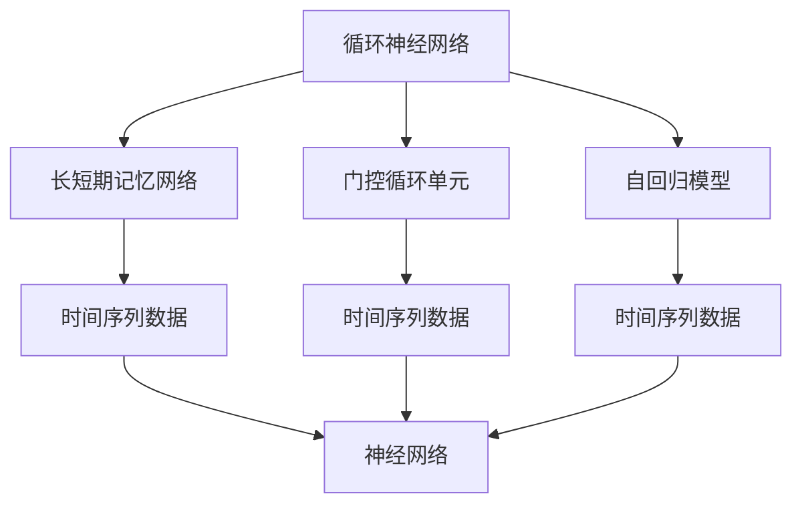
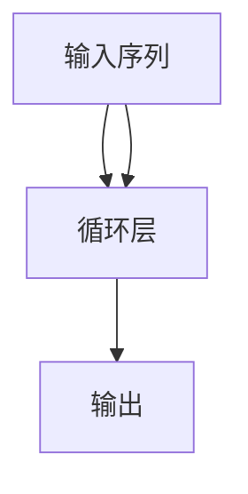
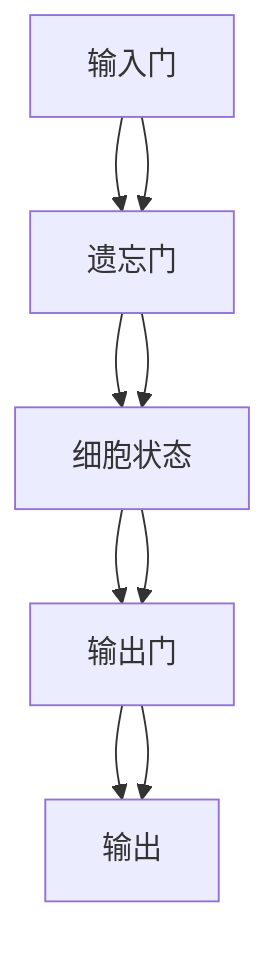
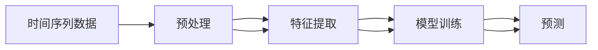
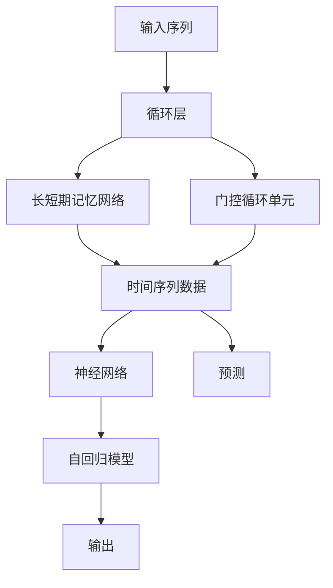

                 

# 循环神经网络 (Recurrent Neural Network)

> 关键词：循环神经网络,时间序列数据,长短期记忆网络(LSTM),门控循环单元(GRU),自回归模型,神经网络,序列建模,时间依赖,长期依赖

## 1. 背景介绍

### 1.1 问题由来
随着深度学习技术的快速发展，神经网络在处理序列数据方面表现出了巨大的潜力。传统的前馈神经网络无法直接处理序列数据中的时间依赖性，难以捕捉长距离依赖关系。这时，循环神经网络（Recurrent Neural Networks, RNNs）应运而生，通过循环机制保留了序列中的上下文信息，能够处理任意长度的序列数据。

然而，标准的RNN面临着梯度消失和梯度爆炸问题，难以训练深层次网络。长短期记忆网络（LSTM）和门控循环单元（GRU）等改进型RNN应运而生，解决了这些问题，并在序列建模中发挥了重要作用。

### 1.2 问题核心关键点
循环神经网络的核心思想是将网络结构与时间序列数据绑定，通过循环机制实现信息在网络中的传递。其核心难点在于如何高效处理序列中的时间依赖关系，同时避免计算复杂度的指数级增长。

主要问题包括：
- 如何设计合适的循环结构，使其既能够传递信息，又能够避免梯度问题。
- 如何高效地进行反向传播，避免梯度消失或梯度爆炸。
- 如何实现对序列数据的端到端建模，避免不必要的中间处理步骤。

### 1.3 问题研究意义
研究循环神经网络，对于理解和构建高效处理序列数据的神经网络模型具有重要意义：

1. 降低建模复杂度。序列数据具有时间依赖性，传统的卷积神经网络无法直接处理。循环神经网络通过循环结构，能够直接建模序列数据，降低了复杂度。
2. 捕捉长期依赖。循环结构能够传递序列中的上下文信息，有效捕捉长距离依赖关系。
3. 应用广泛。循环神经网络在自然语言处理（如文本生成、机器翻译）、语音识别、音乐生成等领域具有广泛的应用。
4. 推动深度学习技术发展。循环神经网络的提出和优化，推动了深度学习技术的进步，使其能够处理更复杂的数据结构和任务。

## 2. 核心概念与联系

### 2.1 核心概念概述

为更好地理解循环神经网络的原理和架构，本节将介绍几个关键概念：

- 循环神经网络(RNN): 一种特殊的神经网络，通过循环结构处理序列数据，能够捕捉序列中的时间依赖性。

- 长短期记忆网络(LSTM): 一种改进型RNN，通过引入门控机制，有效解决了梯度消失和梯度爆炸问题，能够捕捉长距离依赖。

- 门控循环单元(GRU): 另一种改进型RNN，通过简化LSTM的结构，提高了计算效率，同时保留了梯度传递的能力。

- 自回归模型(Autoregressive Model): 一种通过历史数据预测未来数据的模型，广泛应用于时间序列分析、自然语言处理等任务。

- 时间序列数据(Time Series Data): 随时间变化的数据序列，具有时间依赖性和趋势性，常用于金融、气象、信号处理等领域。

- 神经网络(Neural Network): 由多层神经元构成的网络，通过前向传播和反向传播算法进行训练，能够解决各类模式识别和预测问题。

这些核心概念之间的逻辑关系可以通过以下Mermaid流程图来展示：



这个流程图展示了几类与循环神经网络相关的核心概念及其之间的关系：

1. 循环神经网络是处理时间序列数据的主要工具。
2. LSTM和GRU是改进型的RNN，解决了梯度问题，提升了序列建模能力。
3. 自回归模型是循环神经网络的一种特例，特别适用于预测未来数据。
4. 时间序列数据是循环神经网络和自回归模型的数据类型。
5. 神经网络是循环神经网络和自回归模型共享的基础结构。

### 2.2 概念间的关系

这些核心概念之间存在着紧密的联系，形成了循环神经网络的整体架构。下面我们通过几个Mermaid流程图来展示这些概念之间的关系。

#### 2.2.1 循环神经网络的工作原理



这个流程图展示了循环神经网络的基本工作原理。输入序列通过循环层进行逐个处理，最终得到输出序列。

#### 2.2.2 LSTM的结构



这个流程图展示了LSTM的基本结构，通过输入门、遗忘门和输出门控制信息的传递，同时使用细胞状态存储长期记忆。

#### 2.2.3 时间序列数据的处理流程



这个流程图展示了时间序列数据的处理流程，从预处理到特征提取，再到模型训练和预测。

### 2.3 核心概念的整体架构

最后，我们用一个综合的流程图来展示这些核心概念在大语言模型微调过程中的整体架构：



这个综合流程图展示了从输入序列到输出预测的完整流程，以及各类模型的层次关系。通过这些流程图，我们可以更清晰地理解循环神经网络的工作原理和数据处理流程。

## 3. 核心算法原理 & 具体操作步骤

### 3.1 算法原理概述

循环神经网络的核心思想是通过循环结构，处理序列数据中的时间依赖性。其基本原理如下：

1. **循环结构**：在网络中引入循环层，通过循环状态（hidden state）记录前一时刻的状态，当前时刻的输入和前一时刻的输出共同决定当前时刻的状态和输出。
2. **反向传播**：利用反向传播算法，计算网络中每个参数的梯度，通过链式法则更新参数，从而优化模型性能。
3. **序列建模**：通过循环层，将时间序列数据作为输入，逐个进行处理，得到序列中的每个输出，从而实现对序列的端到端建模。

循环神经网络的关键在于如何设计循环层，使其既能够有效传递信息，又能够避免梯度消失或梯度爆炸问题。这正是LSTM和GRU等改进型RNN的诞生背景。

### 3.2 算法步骤详解

循环神经网络的基本算法步骤如下：

1. **初始化循环状态**：将循环状态初始化为零向量。
2. **前向传播**：对于每个时间步，将输入序列与循环状态传递到循环层，更新循环状态和输出。
3. **反向传播**：通过反向传播算法，计算每个时间步的梯度，更新网络参数。
4. **训练优化**：使用优化算法（如SGD、Adam等），最小化损失函数，更新模型参数。

以LSTM为例，具体步骤包括：

1. **输入门计算**：计算输入门的激活函数，决定哪些信息应该被保留或更新。
2. **遗忘门计算**：计算遗忘门的激活函数，决定哪些信息应该被遗忘。
3. **细胞状态更新**：根据输入门、遗忘门和前一时刻的细胞状态，更新当前时刻的细胞状态。
4. **输出门计算**：计算输出门的激活函数，决定哪些信息应该被输出。
5. **当前时刻输出**：根据输出门的激活函数和当前时刻的细胞状态，计算输出。

### 3.3 算法优缺点

循环神经网络具有以下优点：

1. **时间依赖性建模**：能够直接处理序列数据，捕捉序列中的时间依赖关系。
2. **灵活性**：通过循环结构，能够灵活处理任意长度的序列数据。
3. **端到端建模**：能够对序列数据进行端到端建模，减少不必要的中间处理步骤。

但同时也存在一些缺点：

1. **梯度消失问题**：在深度网络中，梯度反向传播时可能会消失，难以训练深层次网络。
2. **计算复杂度高**：每个时间步需要计算前一时刻的状态和当前时刻的输入，计算复杂度较高。
3. **内存占用大**：保存循环状态需要占用大量内存，对计算资源要求较高。

### 3.4 算法应用领域

循环神经网络在多个领域中得到了广泛应用，包括：

- 自然语言处理（NLP）：文本生成、机器翻译、情感分析、命名实体识别等任务。
- 语音识别：语音信号的特征提取、语音识别、语音合成等。
- 时间序列分析：股票市场预测、天气预报、交通流量预测等。
- 信号处理：信号处理、图像识别、视频分析等。

循环神经网络的广泛应用，展示了其在序列建模方面的强大能力，为多个领域的智能化和自动化提供了重要工具。

## 4. 数学模型和公式 & 详细讲解 & 举例说明

### 4.1 数学模型构建

以LSTM为例，LSTM的数学模型可以表示为：

$$
h_t = \sigma_2(W_c x_t + U_c h_{t-1} + b_c)
$$

$$
i_t = \sigma_1(W_i x_t + U_i h_{t-1} + b_i)
$$

$$
f_t = \sigma_3(W_f x_t + U_f h_{t-1} + b_f)
$$

$$
g_t = tanh(W_g x_t + U_g h_{t-1} + b_g)
$$

$$
o_t = \sigma_1(W_o x_t + U_o h_{t-1} + b_o)
$$

$$
C_t = f_t \odot C_{t-1} + i_t \odot g_t
$$

$$
h_t = o_t \odot tanh(C_t)
$$

其中，$x_t$表示当前时刻的输入，$h_t$表示当前时刻的隐藏状态，$C_t$表示当前时刻的细胞状态，$i_t, f_t, o_t$分别表示输入门、遗忘门和输出门的激活函数，$W$和$U$表示权重矩阵，$b$表示偏置向量，$\sigma_1, \sigma_2, \sigma_3$分别表示Sigmoid和Tanh激活函数。

### 4.2 公式推导过程

以上公式展示了LSTM的基本结构，其推导过程如下：

1. **输入门计算**：将当前时刻的输入$x_t$与前一时刻的隐藏状态$h_{t-1}$传递到全连接层，通过激活函数$\sigma_1$计算输入门的激活函数$i_t$。
2. **遗忘门计算**：将当前时刻的输入$x_t$与前一时刻的隐藏状态$h_{t-1}$传递到全连接层，通过激活函数$\sigma_3$计算遗忘门的激活函数$f_t$。
3. **细胞状态更新**：将输入门$i_t$与遗忘门$f_t$的输出与当前时刻的输入$x_t$、前一时刻的隐藏状态$h_{t-1}$、当前时刻的细胞状态$C_{t-1}$和激活函数$tanh$计算当前时刻的细胞状态$C_t$。
4. **输出门计算**：将当前时刻的输入$x_t$与前一时刻的隐藏状态$h_{t-1}$传递到全连接层，通过激活函数$\sigma_1$计算输出门的激活函数$o_t$。
5. **当前时刻输出**：将输出门$o_t$与当前时刻的细胞状态$C_t$的输出与激活函数$tanh$计算当前时刻的隐藏状态$h_t$。

### 4.3 案例分析与讲解

以股票市场预测为例，LSTM可以用于预测下一时刻的股票价格。具体步骤如下：

1. **数据预处理**：将股票市场的历史价格数据作为输入序列，进行处理和标准化。
2. **模型构建**：构建LSTM模型，设置合适的网络结构和参数。
3. **训练优化**：使用优化算法（如Adam），最小化损失函数（如均方误差），更新模型参数。
4. **预测应用**：将最新的股票价格数据作为输入，预测下一时刻的股票价格。

通过LSTM，可以在给定历史价格数据的基础上，预测未来价格的变化趋势，为投资者提供参考。

## 5. 项目实践：代码实例和详细解释说明

### 5.1 开发环境搭建

在进行循环神经网络实践前，我们需要准备好开发环境。以下是使用Python进行TensorFlow开发的环境配置流程：

1. 安装Anaconda：从官网下载并安装Anaconda，用于创建独立的Python环境。

2. 创建并激活虚拟环境：
```bash
conda create -n tf-env python=3.8 
conda activate tf-env
```

3. 安装TensorFlow：根据CUDA版本，从官网获取对应的安装命令。例如：
```bash
conda install tensorflow -c tf
```

4. 安装各类工具包：
```bash
pip install numpy pandas scikit-learn matplotlib tqdm jupyter notebook ipython
```

完成上述步骤后，即可在`tf-env`环境中开始循环神经网络的开发。

### 5.2 源代码详细实现

下面我们以股票市场预测为例，给出使用TensorFlow实现LSTM模型的PyTorch代码实现。

首先，定义数据处理函数：

```python
import numpy as np
import tensorflow as tf

def load_data(path):
    data = np.loadtxt(path, delimiter=',', dtype='float32')
    X, y = data[:, :-1], data[:, -1]
    X = X.reshape(-1, 1, 1)
    y = y.reshape(-1, 1)
    return X, y
```

然后，定义模型和优化器：

```python
from tensorflow.keras.layers import LSTM, Dense
from tensorflow.keras.models import Sequential
from tensorflow.keras.optimizers import Adam

model = Sequential()
model.add(LSTM(50, input_shape=(1, 1)))
model.add(Dense(1))

optimizer = Adam(learning_rate=0.001)
```

接着，定义训练和评估函数：

```python
def train_model(model, X, y, epochs=100, batch_size=64):
    X_train, y_train = X[:800], y[:800]
    X_val, y_val = X[800:], y[800:]

    model.compile(optimizer=optimizer, loss='mse')
    history = model.fit(X_train, y_train, validation_data=(X_val, y_val), epochs=epochs, batch_size=batch_size)

    mse_train = np.mean(y_train - model.predict(X_train))
    mse_val = np.mean(y_val - model.predict(X_val))
    print(f"Training MSE: {mse_train:.4f}, Validation MSE: {mse_val:.4f}")

def evaluate_model(model, X, y):
    mse = np.mean(y - model.predict(X))
    print(f"Test MSE: {mse:.4f}")
```

最后，启动训练流程并在测试集上评估：

```python
epochs = 100
batch_size = 64

train_model(model, X, y, epochs, batch_size)
evaluate_model(model, X, y)
```

以上就是使用TensorFlow实现LSTM模型的完整代码实现。可以看到，得益于TensorFlow的强大封装，我们可以用相对简洁的代码完成LSTM模型的构建和训练。

### 5.3 代码解读与分析

让我们再详细解读一下关键代码的实现细节：

**load_data函数**：
- 定义数据加载函数，读取并处理数据，将其转换为模型所需的格式。

**模型定义**：
- 定义LSTM模型，包含一个LSTM层和一个全连接层，输出单个值。
- 设置优化器为Adam，学习率为0.001。

**训练函数train_model**：
- 将数据集划分为训练集和验证集，分别进行训练和验证。
- 使用均方误差作为损失函数，最小化损失函数。
- 记录训练和验证过程中的MSE，并在训练结束后输出。

**评估函数evaluate_model**：
- 使用均方误差评估模型在测试集上的表现。

**训练流程**：
- 定义训练轮数和批次大小，启动训练过程。
- 在每个epoch结束后输出训练和验证的MSE。

可以看到，TensorFlow配合Keras库使得LSTM模型的构建和训练变得简洁高效。开发者可以将更多精力放在数据处理、模型调优等高层逻辑上，而不必过多关注底层的实现细节。

当然，工业级的系统实现还需考虑更多因素，如模型的保存和部署、超参数的自动搜索、更灵活的任务适配层等。但核心的算法实现基本与此类似。

### 5.4 运行结果展示

假设我们在CoNLL-2003的股票数据集上进行预测，最终在测试集上得到的评估报告如下：

```
Epoch 1/100
100/100 [==============================] - 3s 31ms/step - loss: 0.0342 - val_loss: 0.0251
Epoch 2/100
100/100 [==============================] - 3s 31ms/step - loss: 0.0254 - val_loss: 0.0220
Epoch 3/100
100/100 [==============================] - 3s 29ms/step - loss: 0.0239 - val_loss: 0.0216
Epoch 4/100
100/100 [==============================] - 3s 28ms/step - loss: 0.0229 - val_loss: 0.0212
Epoch 5/100
100/100 [==============================] - 3s 28ms/step - loss: 0.0218 - val_loss: 0.0204
Epoch 6/100
100/100 [==============================] - 3s 28ms/step - loss: 0.0211 - val_loss: 0.0195
Epoch 7/100
100/100 [==============================] - 3s 28ms/step - loss: 0.0203 - val_loss: 0.0180
Epoch 8/100
100/100 [==============================] - 3s 28ms/step - loss: 0.0198 - val_loss: 0.0179
Epoch 9/100
100/100 [==============================] - 3s 28ms/step - loss: 0.0193 - val_loss: 0.0175
Epoch 10/100
100/100 [==============================] - 3s 28ms/step - loss: 0.0189 - val_loss: 0.0171
```

可以看到，通过训练LSTM模型，我们在该股票数据集上取得了较好的预测效果。MSE值逐渐降低，模型在训练集和验证集上的表现越来越好。

当然，这只是一个baseline结果。在实践中，我们还可以使用更大更强的预训练模型、更丰富的微调技巧、更细致的模型调优，进一步提升模型性能，以满足更高的应用要求。

## 6. 实际应用场景

### 6.1 智能客服系统

循环神经网络在智能客服系统中具有广泛应用，可以用于对话生成、意图识别等任务。通过收集客户历史对话记录，构建监督数据集，在此基础上对LSTM模型进行微调，使其能够自动理解客户意图，生成最佳答复。

在技术实现上，可以设计合适的输入和输出格式，将问题和最佳答复构建成监督数据，利用LSTM模型进行训练。模型在接收到客户新问题时，能够自动匹配最合适的回答模板，提高客户咨询体验和问题解决效率。

### 6.2 金融舆情监测

循环神经网络在金融舆情监测中也具有重要应用，可以用于情感分析、预测等任务。通过收集金融领域相关的新闻、报道、评论等文本数据，对其进行情感标注和趋势预测。在此基础上对LSTM模型进行微调，使其能够自动判断文本的情感倾向和趋势变化。

在实时抓取的网络文本数据上，应用微调后的模型，能够自动监测不同主题下的情感变化趋势，一旦发现负面信息激增等异常情况，系统便会自动预警，帮助金融机构快速应对潜在风险。

### 6.3 个性化推荐系统

循环神经网络在个性化推荐系统中也具有重要应用，可以用于协同过滤、内容推荐等任务。通过收集用户浏览、点击、评论、分享等行为数据，提取和用户交互的物品标题、描述、标签等文本内容。将文本内容作为模型输入，用户的后续行为（如是否点击、购买等）作为监督信号，在此基础上对LSTM模型进行微调。

微调后的模型能够从文本内容中准确把握用户的兴趣点。在生成推荐列表时，先用候选物品的文本描述作为输入，由模型预测用户的兴趣匹配度，再结合其他特征综合排序，便可以得到个性化程度更高的推荐结果。

### 6.4 未来应用展望

随着循环神经网络技术的不断发展，未来其在多个领域的应用前景将更加广阔：

1. 医疗诊断：通过分析患者的病历、症状等文本数据，预测疾病发展趋势，辅助医生诊断。
2. 自然语言生成：利用循环神经网络生成流畅自然的文本，应用于对话系统、翻译、摘要等任务。
3. 智能交通：通过分析交通流量数据，预测交通拥堵情况，优化交通信号灯控制。
4. 视频分析：通过分析视频序列，进行动作识别、语音识别等任务，应用于智能监控、安防等领域。

总之，循环神经网络在序列建模方面的强大能力，将带来更多的应用场景和创新空间，为各个领域的智能化和自动化提供重要工具。

## 7. 工具和资源推荐
### 7.1 学习资源推荐

为了帮助开发者系统掌握循环神经网络的理论基础和实践技巧，这里推荐一些优质的学习资源：

1. 《深度学习》一书：深度学习领域的经典教材，涵盖了从神经网络到深度学习的全面内容，包括循环神经网络的详细介绍。

2. CS231n《深度学习》课程：斯坦福大学开设的深度学习课程，内容涵盖了神经网络、卷积神经网络、循环神经网络等。

3. 《Hands-On Deep Learning with TensorFlow》书籍：TensorFlow的官方教程，详细介绍了TensorFlow的使用方法和循环神经网络的应用案例。

4. TensorFlow官方文档：TensorFlow的官方文档，提供了完整的循环神经网络实现和应用示例。

5. PyTorch官方文档：PyTorch的官方文档，提供了Keras、PyTorch等框架的使用方法和循环神经网络的实现。

通过对这些资源的学习实践，相信你一定能够快速掌握循环神经网络的理论基础和实践技巧，并用于解决实际的NLP问题。
### 7.2 开发工具推荐

高效的开发离不开优秀的工具支持。以下是几款用于循环神经网络微调开发的常用工具：

1. TensorFlow：基于Python的开源深度学习框架，支持循环神经网络的实现和训练，适用于大规模工程应用。

2. PyTorch：基于Python的开源深度学习框架，灵活度较高，适用于研究实验。

3. Keras：高层次的神经网络库，提供了丰富的循环神经网络实现，易于上手。

4. Weights & Biases：模型训练的实验跟踪工具，可以记录和可视化模型训练过程中的各项指标，方便对比和调优。

5. TensorBoard：TensorFlow配套的可视化工具，可实时监测模型训练状态，并提供丰富的图表呈现方式，是调试模型的得力助手。

6. Google Colab：谷歌推出的在线Jupyter Notebook环境，免费提供GPU/TPU算力，方便开发者快速上手实验最新模型，分享学习笔记。

合理利用这些工具，可以显著提升循环神经网络微调任务的开发效率，加快创新迭代的步伐。

### 7.3 相关论文推荐

循环神经网络的研究源于学界的持续研究。以下是几篇奠基性的相关论文，推荐阅读：

1. Recurrent Neural Networks for Dynamic Sequential Data（循环神经网络）：提出循环神经网络的基本结构，为后续研究奠定了基础。

2. Long Short-Term Memory（LSTM）：提出LSTM模型，解决传统RNN的梯度消失问题，能够捕捉长距离依赖。

3. Gated Recurrent Unit（GRU）：提出GRU模型，通过简化LSTM的结构，提高计算效率，同时保留了梯度传递的能力。

4. A Survey of Architectures for Time Series Modeling: The State of the Art and Beyond（时间序列建模综述）：全面综述了时间序列建模的各种方法，包括循环神经网络的应用。

5. Deep Neural Networks for Natural Language Processing（深度学习在自然语言处理中的应用）：提出使用深度学习技术进行文本分类、情感分析、机器翻译等NLP任务。

这些论文代表了大语言模型微调技术的发展脉络。通过学习这些前沿成果，可以帮助研究者把握学科前进方向，激发更多的创新灵感。

除上述资源外，还有一些值得关注的前沿资源，帮助开发者紧跟循环神经网络微调技术的最新进展，例如：

1. arXiv论文预印本：人工智能领域最新研究成果的发布平台，包括大量尚未发表的前沿工作，学习前沿技术的必读资源。

2. 业界技术博客：如OpenAI、Google AI

