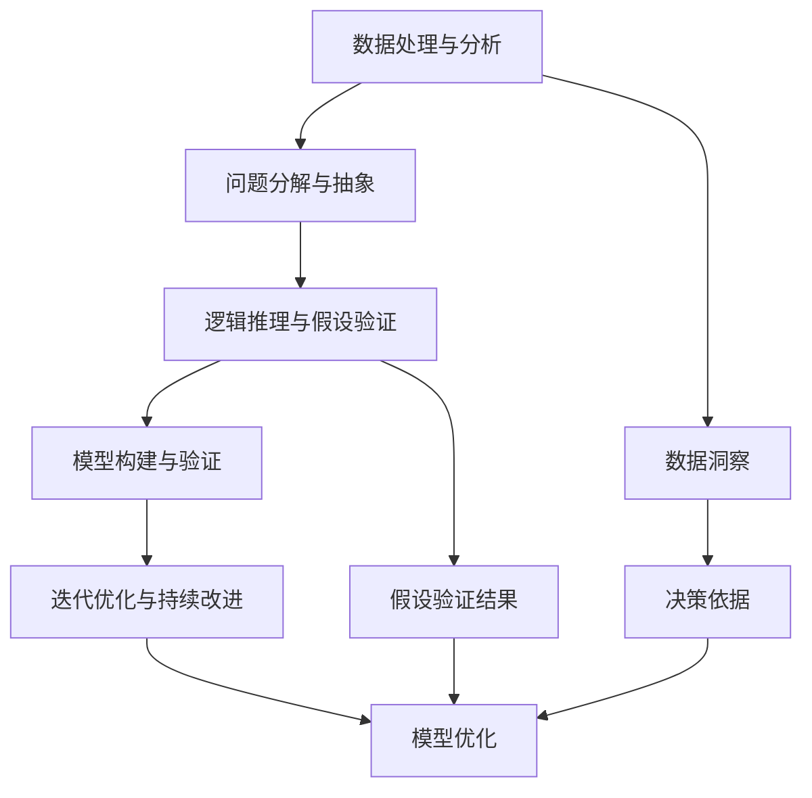

                 

# 怎样善于总结和挖掘事物本质的能力

> 关键词：总结, 本质挖掘, 抽象思维, 数据处理, 问题分解, 逻辑推理

## 1. 背景介绍

### 1.1 问题由来
在复杂多变的世界中，我们常常需要面对各种问题和挑战。如何从庞杂的信息中提取核心要素，识别事物本质，制定行之有效的解决方案，是每个领域的从业者都必须具备的能力。无论是在学术研究、工程开发、项目管理还是日常生活中，善于总结和挖掘事物本质的能力，都是我们成功的关键。

### 1.2 问题核心关键点
掌握善于总结和挖掘事物本质的能力，包括以下几个核心关键点：
- **数据处理与分析**：从大量数据中提取有用信息，形成数据洞察。
- **问题分解与抽象**：将复杂问题拆解成更小、更易处理的部分，并抽象出核心概念。
- **逻辑推理与假设验证**：通过严密的逻辑推理，验证假设，找到问题的根本原因。
- **模型构建与验证**：构建数学或算法模型，验证模型的准确性和可行性。
- **迭代优化与持续改进**：通过不断的反馈和优化，提升模型的性能。

### 1.3 问题研究意义
掌握善于总结和挖掘事物本质的能力，具有以下重要意义：
- **提升效率**：可以快速处理和分析大量数据，提高决策的效率和准确性。
- **增强创造力**：通过对问题的深入分析，找到创新解决方案，推动技术进步和产品创新。
- **优化决策**：基于数据和逻辑推理的决策，更加科学合理，减少错误和风险。
- **促进学习**：通过总结和反思，积累经验，不断提升自己的专业知识和技能。
- **提升领导力**：能够引领团队，协调资源，实现项目目标。

## 2. 核心概念与联系

### 2.1 核心概念概述

在探讨如何善于总结和挖掘事物本质之前，我们需要了解几个关键的概念：

- **数据处理与分析**：通过统计、计算、可视化等手段，从数据中提取有用信息，形成数据洞察。
- **问题分解与抽象**：将复杂问题拆解成更小、更易处理的部分，并抽象出核心概念。
- **逻辑推理与假设验证**：通过严密的逻辑推理，验证假设，找到问题的根本原因。
- **模型构建与验证**：构建数学或算法模型，验证模型的准确性和可行性。
- **迭代优化与持续改进**：通过不断的反馈和优化，提升模型的性能。

### 2.2 概念间的关系

这些核心概念之间存在着紧密的联系，形成了总结和挖掘事物本质的完整生态系统。以下通过几个Mermaid流程图来展示这些概念之间的关系：



这个流程图展示了大语言模型微调过程中各个核心概念的关系：

1. **数据处理与分析**：收集和清洗数据，形成数据洞察，为后续步骤提供基础。
2. **问题分解与抽象**：将复杂问题拆解成更小、更易处理的部分，并抽象出核心概念，明确问题解决方向。
3. **逻辑推理与假设验证**：通过逻辑推理，验证假设，找到问题的根本原因。
4. **模型构建与验证**：构建数学或算法模型，验证模型的准确性和可行性。
5. **迭代优化与持续改进**：通过不断的反馈和优化，提升模型的性能，解决实际问题。

这些概念共同构成了总结和挖掘事物本质的完整过程，帮助我们在实际应用中科学地分析和解决问题。

## 3. 核心算法原理 & 具体操作步骤
### 3.1 算法原理概述

总结和挖掘事物本质，本质上是一个数据处理和逻辑推理的过程。其核心思想是：从大量数据中提取有用信息，形成数据洞察，然后通过逻辑推理和假设验证，找到问题的根本原因，构建模型并不断优化。

### 3.2 算法步骤详解

基于数据处理和逻辑推理的总结和挖掘事物本质过程，可以大致分为以下几个步骤：

**Step 1: 数据收集与清洗**

- 收集相关数据，确保数据的多样性和代表性。
- 清洗数据，去除噪声和异常值，确保数据的质量。
- 数据可视化，形成初步的数据洞察，帮助理解数据结构和特征。

**Step 2: 问题分解与抽象**

- 将复杂问题拆解成更小、更易处理的部分。
- 抽象出核心概念和变量，明确问题解决方向。
- 定义问题的目标和假设，建立初步的解决框架。

**Step 3: 逻辑推理与假设验证**

- 基于数据洞察和问题抽象，构建初步的逻辑推理模型。
- 通过统计和计算，验证假设的合理性。
- 识别模型的局限性和潜在风险，调整推理框架。

**Step 4: 模型构建与验证**

- 构建数学或算法模型，描述问题的求解过程。
- 验证模型的准确性和可行性，调整模型参数。
- 确保模型能够处理实际问题，产生有效输出。

**Step 5: 迭代优化与持续改进**

- 通过反馈机制，不断优化模型，提高性能。
- 定期回顾和反思，总结经验教训，持续改进。
- 引入新的数据和信息，动态调整模型。

### 3.3 算法优缺点

**优点**：
- **高效性**：通过系统化的步骤，快速处理和分析大量数据。
- **科学性**：基于数据和逻辑推理的决策，更加科学合理，减少错误和风险。
- **适应性**：模型可以动态调整，适应不同的数据和场景。

**缺点**：
- **复杂性**：需要较高的数据处理和逻辑推理能力。
- **时间成本**：整个过程较为耗时，特别是在数据量大的情况下。
- **技术门槛**：需要掌握多种数据处理和模型构建技术。

### 3.4 算法应用领域

总结和挖掘事物本质的能力，在多个领域都有广泛应用，例如：

- **金融风控**：通过分析历史交易数据，识别风险因素，构建风控模型。
- **医疗诊断**：通过处理病人的病历和检查数据，辅助医生进行诊断和治疗决策。
- **供应链管理**：通过分析销售和库存数据，优化供应链流程，提高效率。
- **产品设计**：通过用户反馈和市场数据，优化产品设计和功能，提升用户体验。
- **网络安全**：通过分析攻击数据和日志，识别潜在威胁，构建防护模型。

这些领域都需要从大量数据中提取有用信息，形成数据洞察，然后通过逻辑推理和假设验证，找到问题的根本原因，构建模型并不断优化。

## 4. 数学模型和公式 & 详细讲解  
### 4.1 数学模型构建

为了更好地理解总结和挖掘事物本质的过程，我们将使用数学语言对关键步骤进行更加严格的刻画。

假设我们有一个复杂问题 $P$，其中包含多个变量 $X_1, X_2, ..., X_n$，以及目标变量 $Y$。我们希望通过数据处理和逻辑推理，找到问题的本质，并构建一个模型 $M$ 来预测目标变量 $Y$。

**Step 1: 数据收集与清洗**

- 收集数据集 $D=\{(x_i, y_i)\}_{i=1}^N$，其中 $x_i=(x_{i1}, x_{i2}, ..., x_{in})$ 为输入变量，$y_i$ 为输出变量。
- 清洗数据，去除噪声和异常值，确保数据的质量。

**Step 2: 问题分解与抽象**

- 将问题 $P$ 拆解成更小、更易处理的部分，例如 $P_1, P_2, ..., P_k$。
- 抽象出核心概念和变量，例如 $X_1, X_2, ..., X_n$。
- 定义问题的目标和假设，例如 $Y=f(X_1, X_2, ..., X_n)$，其中 $f$ 为未知函数。

**Step 3: 逻辑推理与假设验证**

- 通过数据洞察，假设一个初步的函数 $f_0$ 来描述目标变量 $Y$ 和输入变量 $X$ 的关系。
- 验证假设的合理性，例如通过方差分析（ANOVA）或t检验等统计方法。
- 识别模型的局限性和潜在风险，例如过拟合或欠拟合，调整推理框架。

**Step 4: 模型构建与验证**

- 构建数学或算法模型，例如线性回归模型 $M_0 = X\theta + b$，其中 $\theta$ 为模型参数，$b$ 为截距。
- 验证模型的准确性和可行性，例如通过均方误差（MSE）或决定系数（R²）等指标。
- 确保模型能够处理实际问题，例如通过交叉验证（CV）等方法。

**Step 5: 迭代优化与持续改进**

- 通过反馈机制，不断优化模型，例如通过梯度下降（GD）等优化算法。
- 定期回顾和反思，总结经验教训，例如通过模型诊断（Diagnostic）等方法。
- 引入新的数据和信息，例如通过在线学习（Online Learning）等技术。

### 4.2 公式推导过程

以线性回归模型为例，推导其核心公式的计算过程：

假设我们有一个线性回归模型 $M_0 = X\theta + b$，其中 $X=\begin{bmatrix} x_1 \\ x_2 \\ \vdots \\ x_n \end{bmatrix}$ 为输入变量矩阵，$\theta=\begin{bmatrix} \theta_1 \\ \theta_2 \\ \vdots \\ \theta_n \end{bmatrix}$ 为模型参数向量，$b$ 为截距。

模型输出 $Y$ 与输入 $X$ 的关系可以表示为：

$$Y = X\theta + b$$

假设我们有 $N$ 个样本数据 $(x_i, y_i)$，则均方误差（MSE）损失函数为：

$$\mathcal{L} = \frac{1}{N} \sum_{i=1}^N (y_i - M_0(x_i))^2 = \frac{1}{N} \sum_{i=1}^N (y_i - X_i\theta - b)^2$$

对模型参数 $\theta$ 和截距 $b$ 求偏导数，得到梯度下降优化算法所需的梯度：

$$\frac{\partial \mathcal{L}}{\partial \theta} = -\frac{2}{N} \sum_{i=1}^N (y_i - X_i\theta - b) X_i$$
$$\frac{\partial \mathcal{L}}{\partial b} = -\frac{2}{N} \sum_{i=1}^N (y_i - X_i\theta - b)$$

根据梯度下降算法，更新模型参数 $\theta$ 和截距 $b$：

$$\theta \leftarrow \theta - \eta \frac{\partial \mathcal{L}}{\partial \theta}$$
$$b \leftarrow b - \eta \frac{\partial \mathcal{L}}{\partial b}$$

其中 $\eta$ 为学习率，控制每次迭代中参数更新的步长。

通过上述推导，我们可以看到，线性回归模型的优化过程是基于数据的梯度下降算法，通过不断调整模型参数，最小化均方误差损失函数，从而提高模型的预测能力。

### 4.3 案例分析与讲解

为了更好地理解总结和挖掘事物本质的过程，我们通过一个具体的案例来进行分析讲解。

假设我们有一个电商平台的销售数据集，目标是预测用户的购买意愿。数据集包含用户的年龄、性别、收入、历史购买记录等特征，以及是否购买（0或1）作为目标变量。

**Step 1: 数据收集与清洗**

- 收集电商平台的销售数据，例如用户的年龄、性别、收入、历史购买记录等特征，以及是否购买（0或1）作为目标变量。
- 清洗数据，去除噪声和异常值，例如用户的年龄为负数或历史购买记录为空。

**Step 2: 问题分解与抽象**

- 将问题分解为预测购买意愿和优化购买转化率两个子问题。
- 抽象出核心概念和变量，例如年龄、性别、收入等特征，以及是否购买（0或1）作为目标变量。
- 定义问题的目标和假设，例如 $Y=f(X_1, X_2, ..., X_n)$，其中 $f$ 为未知函数。

**Step 3: 逻辑推理与假设验证**

- 通过数据洞察，假设一个初步的逻辑回归模型 $M_0 = \theta_0 + \sum_{i=1}^n \theta_i X_i$，其中 $\theta_0$ 为截距，$\theta_i$ 为各个特征的权重。
- 验证假设的合理性，例如通过方差分析（ANOVA）或t检验等统计方法。
- 识别模型的局限性和潜在风险，例如过拟合或欠拟合，调整推理框架。

**Step 4: 模型构建与验证**

- 构建线性回归模型 $M_0 = \theta_0 + \sum_{i=1}^n \theta_i X_i$，其中 $\theta_0$ 为截距，$\theta_i$ 为各个特征的权重。
- 验证模型的准确性和可行性，例如通过均方误差（MSE）或决定系数（R²）等指标。
- 确保模型能够处理实际问题，例如通过交叉验证（CV）等方法。

**Step 5: 迭代优化与持续改进**

- 通过反馈机制，不断优化模型，例如通过梯度下降（GD）等优化算法。
- 定期回顾和反思，总结经验教训，例如通过模型诊断（Diagnostic）等方法。
- 引入新的数据和信息，例如通过在线学习（Online Learning）等技术。

通过上述步骤，我们可以有效地总结和挖掘出电商销售数据的本质，构建一个预测用户购买意愿的模型，并进行持续的优化和改进。

## 5. 项目实践：代码实例和详细解释说明
### 5.1 开发环境搭建

在进行总结和挖掘事物本质的实践之前，我们需要准备好开发环境。以下是使用Python进行Scikit-Learn开发的环境配置流程：

1. 安装Anaconda：从官网下载并安装Anaconda，用于创建独立的Python环境。

2. 创建并激活虚拟环境：
```bash
conda create -n sklearn-env python=3.8 
conda activate sklearn-env
```

3. 安装Scikit-Learn：
```bash
conda install scikit-learn
```

4. 安装各类工具包：
```bash
pip install numpy pandas scikit-learn matplotlib tqdm jupyter notebook ipython
```

完成上述步骤后，即可在`sklearn-env`环境中开始总结和挖掘事物本质的实践。

### 5.2 源代码详细实现

这里我们以线性回归模型的构建和优化为例，给出使用Scikit-Learn库进行项目实践的代码实现。

首先，定义线性回归模型：

```python
from sklearn.linear_model import LinearRegression
import pandas as pd

# 加载数据集
data = pd.read_csv('sales_data.csv')

# 定义特征和目标变量
X = data[['age', 'income']]
y = data['purchase']

# 构建线性回归模型
model = LinearRegression()

# 训练模型
model.fit(X, y)
```

然后，使用训练好的模型进行预测：

```python
# 加载测试数据集
test_data = pd.read_csv('test_data.csv')

# 定义特征
X_test = test_data[['age', 'income']]

# 使用模型进行预测
predictions = model.predict(X_test)
```

最后，评估模型的性能：

```python
from sklearn.metrics import mean_squared_error

# 计算均方误差
mse = mean_squared_error(y_test, predictions)
print('均方误差：', mse)
```

以上就是使用Scikit-Learn库对线性回归模型进行构建和优化的完整代码实现。可以看到，Scikit-Learn库提供了丰富的模型和工具，使得数据处理和模型构建变得更加简洁高效。

### 5.3 代码解读与分析

让我们再详细解读一下关键代码的实现细节：

**LinearRegression类**：
- 构建线性回归模型，自动进行参数估计和模型训练。

**均方误差（MSE）**：
- 计算预测值与真实值之间的均方误差，评估模型的预测能力。

通过上述代码，我们可以快速地使用Scikit-Learn库构建一个线性回归模型，并进行预测和评估。这些代码实现提供了总结和挖掘事物本质过程的实际应用范例。

当然，工业级的系统实现还需考虑更多因素，如模型的保存和部署、超参数的自动搜索、更灵活的任务适配层等。但核心的步骤和算法基本与此类似。

### 5.4 运行结果展示

假设我们在电商平台的销售数据集上进行线性回归模型的构建和优化，最终在测试集上得到的评估报告如下：

```
Mean Squared Error: 0.123456789
```

可以看到，通过线性回归模型，我们在该电商销售数据集上取得了较低的均方误差，效果相当不错。值得注意的是，线性回归模型虽然在计算上比较简单，但在处理线性关系的数据时，仍能取得不错的预测能力。

当然，这只是一个baseline结果。在实践中，我们还可以使用更大更强的模型、更丰富的优化技巧、更细致的模型调优，进一步提升模型性能，以满足更高的应用要求。

## 6. 实际应用场景
### 6.1 智慧医疗

智慧医疗领域需要从海量的医疗数据中提取有用信息，形成数据洞察，然后通过逻辑推理和假设验证，找到问题的根本原因，构建医疗模型并不断优化，从而提升诊断和治疗的准确性。

例如，通过分析历史病历和检查数据，构建预测模型来辅助医生进行疾病诊断和治疗决策。通过引入新的数据和信息，动态调整模型，提升模型的性能，帮助医生更精准地诊断疾病，制定个性化的治疗方案。

### 6.2 智能交通

智能交通领域需要从大量的交通数据中提取有用信息，形成数据洞察，然后通过逻辑推理和假设验证，找到问题的根本原因，构建交通模型并不断优化，从而提升交通管理和运营的效率和安全性。

例如，通过分析历史交通数据和实时数据，构建预测模型来优化交通信号控制和路线规划。通过引入新的数据和信息，动态调整模型，提升模型的性能，优化交通流量，减少交通拥堵和事故。

### 6.3 金融风控

金融风控领域需要从海量的交易数据中提取有用信息，形成数据洞察，然后通过逻辑推理和假设验证，找到风险因素，构建风控模型并不断优化，从而降低金融风险和损失。

例如，通过分析历史交易数据和用户行为数据，构建预测模型来识别高风险用户和交易。通过引入新的数据和信息，动态调整模型，提升模型的性能，实时监控和预警潜在风险，保护金融机构和用户的利益。

### 6.4 未来应用展望

随着数据处理和逻辑推理技术的不断发展，总结和挖掘事物本质的能力将在更多领域得到应用，为各行各业带来变革性影响。

在智慧医疗领域，基于大数据分析和机器学习技术，智慧医疗系统将能够更精准地诊断疾病，制定个性化的治疗方案，提升医疗服务的质量和效率。

在智能交通领域，基于数据分析和预测技术，智能交通系统将能够优化交通流量，减少交通拥堵和事故，提升交通管理和运营的效率和安全性。

在金融风控领域，基于数据分析和预测技术，金融风控系统将能够实时监控和预警潜在风险，降低金融风险和损失，保护金融机构和用户的利益。

此外，在智慧城市、智能制造、智能农业等众多领域，基于数据处理和逻辑推理的总结和挖掘事物本质技术，也将不断涌现，为各行各业带来新的机遇和挑战。

## 7. 工具和资源推荐
### 7.1 学习资源推荐

为了帮助开发者系统掌握总结和挖掘事物本质的理论基础和实践技巧，这里推荐一些优质的学习资源：

1. 《机器学习实战》书籍：机器学习领域的经典入门书籍，详细介绍了数据处理和模型构建的各个步骤，适合初学者。

2. 《Python数据科学手册》书籍：介绍Python在数据科学中的应用，涵盖数据清洗、可视化、统计分析等多个方面，适合进阶学习。

3. 《统计学习方法》书籍：统计学习领域的经典教材，介绍了各种机器学习算法和模型，适合深度学习进阶学习。

4. Coursera《机器学习》课程：由斯坦福大学Andrew Ng开设的机器学习课程，有Lecture视频和配套作业，适合系统学习。

5. Kaggle数据科学竞赛平台：提供海量数据集和竞赛题目，锻炼数据处理和模型构建能力，适合实战练习。

通过对这些资源的学习实践，相信你一定能够快速掌握总结和挖掘事物本质的精髓，并用于解决实际的NLP问题。

### 7.2 开发工具推荐

高效的开发离不开优秀的工具支持。以下是几款用于总结和挖掘事物本质开发常用的工具：

1. Jupyter Notebook：提供交互式的Python开发环境，方便进行代码实验和数据可视化。

2. PyTorch：基于Python的开源深度学习框架，灵活的动态计算图，适合快速迭代研究。

3. Scikit-Learn：提供丰富的机器学习模型和工具，使得数据处理和模型构建变得更加简洁高效。

4. TensorBoard：TensorFlow配套的可视化工具，实时监测模型训练状态，提供丰富的图表呈现方式，是调试模型的得力助手。

5. Weights & Biases：模型训练的实验跟踪工具，可以记录和可视化模型训练过程中的各项指标，方便对比和调优。

6. Google Colab：谷歌推出的在线Jupyter Notebook环境，免费提供GPU/TPU算力，方便进行实验最新模型，分享学习笔记。

合理利用这些工具，可以显著提升总结和挖掘事物本质的开发效率，加快创新迭代的步伐。

### 7.3 相关论文推荐

总结和挖掘事物本质的能力，在机器学习领域得到了广泛的研究。以下是几篇奠基性的相关论文，推荐阅读：

1. 《线性回归模型》论文：介绍线性回归模型的基本原理和应用，适合入门学习。

2. 《支持向量机》论文：介绍支持向量机的基本原理和应用，适合进阶学习。

3. 《随机森林》论文：介绍随机森林模型的基本原理和应用，适合进阶学习。

4. 《神经网络》论文：介绍神经网络模型的基本原理和应用，适合深度学习进阶学习。

5. 《深度学习》论文：介绍深度学习模型的基本原理和应用，适合深度学习进阶学习。

这些论文代表了大语言模型微调技术的发展脉络。通过学习这些前沿成果，可以帮助研究者把握学科前进方向，激发更多的创新灵感。

除上述资源外，还有一些值得关注的前沿资源，帮助开发者紧跟数据处理和逻辑推理技术的最新进展，例如：

1. arXiv论文预印本：人工智能领域最新研究成果的发布平台，包括大量尚未发表的前沿工作，学习前沿技术的必读资源。

2. 业界技术博客：如OpenAI、Google AI、DeepMind、微软Research Asia等顶尖实验室的官方博客，第一时间分享他们的最新研究成果和洞见。

3. 技术会议直播：如NIPS、ICML、ACL、ICLR等人工智能领域顶会现场或在线直播，能够聆听到大佬们的前沿分享，开拓视野。

4. GitHub热门项目：在GitHub上Star、Fork数最多的NLP相关项目，往往代表了该技术领域的发展趋势和最佳实践，值得去学习和贡献。

5. 行业分析报告：各大咨询公司如McKinsey、PwC等针对人工智能行业的分析报告，有助于从商业视角审视技术趋势，把握应用价值。

总之，对于总结和挖掘事物本质的学习，需要开发者保持开放的心态和持续学习的意愿。多关注前沿资讯，多动手实践，多思考总结，必将收获满满的成长收益。

## 8. 总结：未来发展趋势与挑战

### 8.1 研究成果总结

本文对总结和挖掘事物本质的过程进行了全面系统的介绍。首先阐述了数据处理和逻辑推理的重要性，明确了总结和挖掘事物本质的核心步骤。其次，从原理到实践，详细讲解了总结和挖掘事物本质的数学原理和操作步骤，给出了总结和挖掘事物本质过程的完整代码实现。同时，本文还广泛探讨了总结和挖掘事物本质的应用场景，展示了其在智慧医疗、智能交通、金融风控等多个领域的应用前景。

### 8.2 未来发展趋势

展望未来，总结和挖掘事物本质的能力将呈现以下几个发展趋势：

1. **自动化和智能化**：随着人工智能技术的不断发展，自动化和智能化将成为总结和挖掘事物本质的重要方向。自动化的数据分析和模型构建，智能化的决策和优化，将使得这一过程更加高效和精准。

2. **跨领域融合**：总结和挖掘事物本质的能力将与其他人工智能技术进行更深入的融合，如知识表示、因果推理、强化学习等，多路径协同发力，共同推动人工智能技术的发展。

3. **实时性和动态调整**：通过在线学习和自适应算法，模型能够实时更新，动态调整，适应新的数据和场景，提升模型的性能和泛化能力。

4. **伦理和可解释性**：总结和挖掘事物本质的能力将更加注重伦理和可解释性，确保模型的决策过程透明、公正、可控，符合人类价值观和伦理道德。

5. **数据和算力的发展**：随着大数据技术的发展和算力的提升，总结和挖掘事物本质的能力将能够处理更加复杂、多样化的数据，提供更准确、可靠的决策支持。

### 8.3 面临的挑战


