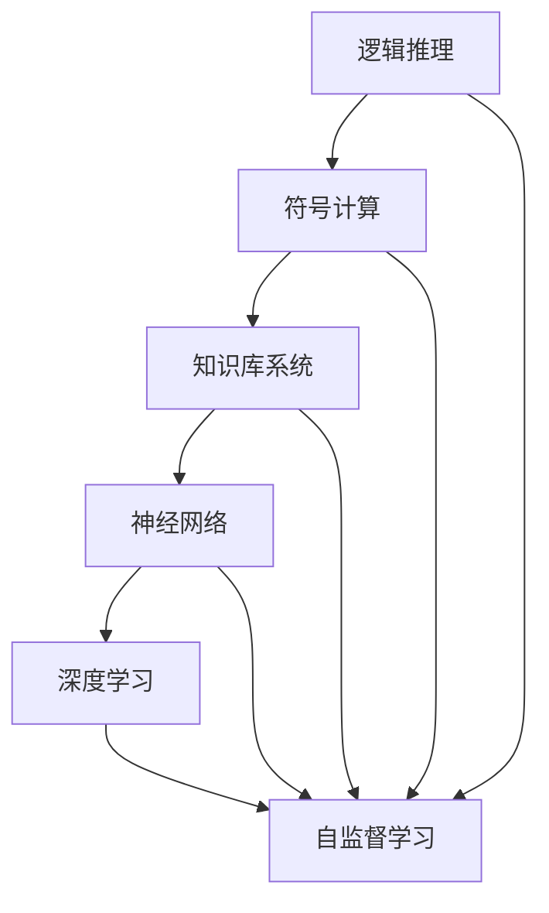
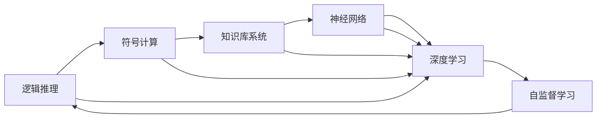

                 

# 思想的进化：从简单到复杂

> 关键词：思想演化,复杂性理论,算法原理,计算复杂度,智能系统,应用场景,未来展望

## 1. 背景介绍

### 1.1 问题由来
人类思维的演化，从简单的逻辑推理到复杂的神经网络，经历了数百万年的演化过程。这一过程中，我们的思维能力从单细胞生物的生存本能，逐步演化到高级生物的复杂认知，展现出了强大的适应性和可塑性。从哲学、心理学到人工智能，人类对思维的探索从未停歇。本文将聚焦于智能系统的演进，尤其是从简单到复杂的思维模型，探讨其原理、应用和未来发展趋势。

### 1.2 问题核心关键点
智能系统的演进，离不开对复杂性的不断理解和处理。从早期的基于逻辑规则的简单模型，到如今的深度神经网络，这一过程展示了算法原理和计算复杂度的演变。关键点包括：
- **逻辑推理**：早期的智能系统大多基于规则和逻辑推理，通过明确的规则集进行推理。
- **符号计算**：引入符号表示和操作，能够处理更复杂的问题结构。
- **知识库系统**：通过知识库存储先验知识，使系统能够更灵活地处理实际问题。
- **神经网络**：基于生物神经元模型，通过大量参数进行复杂的模式识别和生成。
- **深度学习**：利用多层非线性变换，解决更抽象和复杂的模式识别问题。
- **自监督学习**：通过无监督学习，使系统能够自动提取特征和模式，减少对人工标注数据的依赖。

这些关键点共同构成了智能系统从简单到复杂演进的脉络，为我们理解当前和未来的技术趋势提供了重要线索。

### 1.3 问题研究意义
智能系统从简单到复杂的发展，对于理解和构建智能系统具有重要意义：
- **深化认知**：研究智能系统的演进，有助于我们更深刻地理解人类思维的本质和复杂性。
- **指导实践**：基于现有技术框架，能够更好地设计和实现智能系统，提升其实际应用效果。
- **推动创新**：从历史经验中吸取教训，激发更多的技术创新和突破，推动人工智能领域的进步。
- **促进融合**：结合多学科知识，构建更全面、更高效的技术体系，推动人工智能与其他领域的深度融合。

## 2. 核心概念与联系

### 2.1 核心概念概述

智能系统的演进，涉及多个核心概念，其关系和演变过程可通过以下概念框架来展示：



这个框架展示了智能系统从简单到复杂的关键演进步骤：

1. **逻辑推理**：基于明确的规则和逻辑关系进行推理，适用于简单的任务结构。
2. **符号计算**：引入符号表示和操作，能够处理更复杂的结构化问题。
3. **知识库系统**：通过知识库存储和调用先验知识，提升系统的灵活性和适应性。
4. **神经网络**：基于生物神经元模型，通过多层非线性变换处理更抽象和复杂的问题。
5. **深度学习**：通过多层神经网络，进一步提升模型的表达能力和泛化能力。
6. **自监督学习**：利用未标记数据进行训练，减少对标注数据的依赖，提升模型的自适应能力。

这些概念间的联系紧密，共同构成了智能系统从简单到复杂演进的逻辑链条。下面我们将逐一深入探讨这些概念的原理和应用。

### 2.2 概念间的关系

这些核心概念之间的关系，通过以下图表可以更加清晰地展示：



这个图表展示了各概念间的相互影响和演变关系：

1. **逻辑推理**作为初始点，通过符号计算引入更复杂的表达方式。
2. **知识库系统**结合符号计算，进一步提升系统的灵活性和适应性。
3. **神经网络**在符号计算的基础上，通过多层非线性变换处理更复杂的问题。
4. **深度学习**在神经网络的基础上，通过多层变换提升模型的表达能力和泛化能力。
5. **自监督学习**在深度学习的基础上，通过未标记数据进行训练，提升模型的自适应能力和泛化能力。

这些概念共同构成了智能系统从简单到复杂演进的完整生态系统，展示了技术发展的脉络和内在逻辑。

## 3. 核心算法原理 & 具体操作步骤

### 3.1 算法原理概述

智能系统的核心算法原理，主要基于数学模型和计算复杂度理论。以下是几个关键的算法原理：

- **逻辑推理**：基于布尔逻辑和规则集，通过逻辑推理机进行推理。
- **符号计算**：基于代数运算和变量的代数式操作，通过符号计算引擎进行计算。
- **知识库系统**：基于数据库和规则库，通过推理机进行推理和规则应用。
- **神经网络**：基于反向传播算法，通过参数更新进行模式识别和生成。
- **深度学习**：基于多层非线性变换，通过梯度下降算法进行参数优化。
- **自监督学习**：基于未标记数据，通过自监督学习算法进行特征提取和模式识别。

这些算法原理，共同构成了智能系统从简单到复杂演进的理论基础。下面我们将逐一探讨这些算法的具体步骤和应用场景。

### 3.2 算法步骤详解

#### 3.2.1 逻辑推理

逻辑推理是智能系统的基础，通过明确的规则和逻辑关系进行推理。具体步骤如下：

1. **定义规则集**：通过形式化定义规则集，描述问题的逻辑结构和推理关系。
2. **输入实例**：将问题实例转换为规则集中的符号表达式。
3. **推理过程**：通过逻辑推理机，根据规则集进行推理计算，得到推理结果。
4. **输出结果**：将推理结果转换为问题实例的解或评估结果。

逻辑推理适用于简单的任务结构，如数理逻辑问题、专家系统等。

#### 3.2.2 符号计算

符号计算通过代数运算和变量的代数式操作，处理更复杂的问题结构。具体步骤如下：

1. **定义表达式**：通过符号表示法定义表达式，描述问题的结构和操作。
2. **符号操作**：通过符号计算引擎，进行表达式的符号操作和变换。
3. **代数求解**：通过符号求解器，求解表达式的值或表达式之间的等式关系。
4. **输出结果**：将计算结果转换为问题实例的解或评估结果。

符号计算适用于结构化问题，如代数方程求解、计算机代数系统等。

#### 3.2.3 知识库系统

知识库系统通过存储和调用先验知识，提升系统的灵活性和适应性。具体步骤如下：

1. **构建知识库**：通过知识编辑工具，构建和维护知识库，存储领域知识和规则。
2. **规则引擎**：通过规则引擎，根据知识库中的规则进行推理和决策。
3. **实时查询**：通过查询接口，实时查询知识库中的信息，进行推理和决策。
4. **输出结果**：将推理结果转换为问题实例的解或评估结果。

知识库系统适用于需要灵活处理实际问题的场景，如医疗诊断、金融分析等。

#### 3.2.4 神经网络

神经网络基于生物神经元模型，通过多层非线性变换处理更抽象和复杂的问题。具体步骤如下：

1. **定义模型架构**：通过神经网络框架定义模型的架构和参数。
2. **训练模型**：通过反向传播算法，利用标注数据训练模型，优化参数。
3. **推理过程**：通过前向传播算法，将输入数据传递到模型，得到输出结果。
4. **输出结果**：将输出结果转换为问题实例的解或评估结果。

神经网络适用于处理复杂模式识别和生成问题，如图像识别、自然语言处理等。

#### 3.2.5 深度学习

深度学习通过多层非线性变换，进一步提升模型的表达能力和泛化能力。具体步骤如下：

1. **定义网络结构**：通过深度学习框架定义网络结构，包含多层神经网络。
2. **训练模型**：通过反向传播算法，利用标注数据训练模型，优化参数。
3. **推理过程**：通过前向传播算法，将输入数据传递到模型，得到输出结果。
4. **输出结果**：将输出结果转换为问题实例的解或评估结果。

深度学习适用于处理更抽象和复杂的问题，如计算机视觉、语音识别等。

#### 3.2.6 自监督学习

自监督学习利用未标记数据进行训练，提升模型的自适应能力和泛化能力。具体步骤如下：

1. **定义自监督任务**：通过自监督学习框架定义自监督任务，生成伪标注数据。
2. **训练模型**：通过自监督算法，利用伪标注数据训练模型，优化参数。
3. **推理过程**：通过前向传播算法，将输入数据传递到模型，得到输出结果。
4. **输出结果**：将输出结果转换为问题实例的解或评估结果。

自监督学习适用于标注数据不足的问题，如图像生成、文本生成等。

### 3.3 算法优缺点

#### 3.3.1 逻辑推理

**优点**：
- **可解释性强**：规则集和逻辑关系明确，推理过程可追溯，易于理解和解释。
- **灵活性高**：规则集可以动态调整，适应复杂多变的问题结构。

**缺点**：
- **知识依赖**：依赖明确的规则集，无法处理未知或复杂的结构化问题。
- **表达能力有限**：无法处理非结构化或抽象问题。

#### 3.3.2 符号计算

**优点**：
- **表达能力强大**：可以处理复杂的结构化问题，支持多种运算和操作。
- **灵活性高**：表达式可以动态调整，适应复杂多变的问题结构。

**缺点**：
- **计算复杂度高**：符号操作和代数求解通常比数值计算更复杂，计算速度较慢。
- **易出错**：符号表达式和代数操作容易出现错误，需要仔细检查和验证。

#### 3.3.3 知识库系统

**优点**：
- **知识丰富**：知识库存储了大量的领域知识和规则，提升了系统的灵活性和适应性。
- **推理能力强**：规则引擎可以高效地进行推理和决策，处理复杂的问题结构。

**缺点**：
- **维护成本高**：知识库需要持续维护和更新，成本较高。
- **易受知识库局限**：依赖知识库中的知识，难以处理未知或超出现有知识库的问题。

#### 3.3.4 神经网络

**优点**：
- **表达能力强**：多层非线性变换可以处理复杂的模式识别和生成问题。
- **自适应能力强**：通过反向传播算法进行训练，可以自动提取特征和模式。

**缺点**：
- **计算复杂度高**：多层神经网络的计算复杂度高，需要大量的计算资源。
- **易过拟合**：模型容易过拟合训练数据，泛化能力有限。

#### 3.3.5 深度学习

**优点**：
- **表达能力强**：多层非线性变换可以处理更抽象和复杂的问题，具有更强的泛化能力。
- **自适应能力强**：通过反向传播算法进行训练，可以自动提取特征和模式。

**缺点**：
- **计算复杂度高**：多层神经网络的计算复杂度高，需要大量的计算资源。
- **易过拟合**：模型容易过拟合训练数据，泛化能力有限。

#### 3.3.6 自监督学习

**优点**：
- **标注成本低**：利用未标记数据进行训练，标注成本较低。
- **自适应能力强**：通过自监督算法进行训练，可以自动提取特征和模式。

**缺点**：
- **效果有限**：自监督学习的效果往往依赖于任务的性质和数据质量。
- **难以解释**：自监督学习模型通常缺乏可解释性，难以解释模型的推理过程。

### 3.4 算法应用领域

智能系统的核心算法原理和操作步骤，在多个领域得到了广泛应用：

1. **自然语言处理**：逻辑推理、符号计算和深度学习广泛应用于语言模型的训练和推理，自监督学习在语言生成任务中也有重要应用。
2. **计算机视觉**：神经网络是计算机视觉任务的主流算法，深度学习在图像识别、目标检测等任务中取得了显著成果。
3. **语音识别**：神经网络和深度学习在语音识别和语音合成任务中得到了广泛应用。
4. **推荐系统**：知识库系统和自监督学习在推荐系统中有重要应用，深度学习在协同过滤和内容推荐中表现优异。
5. **医疗诊断**：知识库系统和神经网络在医疗诊断任务中具有重要应用，自监督学习在医学影像分析中也有重要应用。
6. **金融分析**：逻辑推理和知识库系统在金融数据分析中具有重要应用，神经网络和深度学习在风险评估和投资决策中表现优异。
7. **机器人控制**：神经网络和深度学习在机器人控制和动作规划中具有重要应用，自监督学习在机器人自主导航和目标识别中也有重要应用。

这些应用领域展示了智能系统从简单到复杂演进的多样性和广泛性，为进一步探索和优化智能系统的算法提供了丰富的场景。

## 4. 数学模型和公式 & 详细讲解 & 举例说明

### 4.1 数学模型构建

智能系统的数学模型，通常基于优化问题和目标函数。以下是几个关键的数学模型：

- **逻辑推理**：基于逻辑推理机的布尔逻辑表达式，定义问题和推理结构。
- **符号计算**：基于符号计算引擎的代数表达式，定义问题和计算结构。
- **知识库系统**：基于规则库和推理机的逻辑表达式，定义问题和推理规则。
- **神经网络**：基于反向传播算法的参数更新，定义问题和模型结构。
- **深度学习**：基于多层非线性变换的目标函数，定义问题和模型结构。
- **自监督学习**：基于自监督任务的目标函数，定义问题和模型结构。

这些数学模型，共同构成了智能系统从简单到复杂演进的数学基础。下面我们将逐一探讨这些模型的具体构建和应用。

### 4.2 公式推导过程

#### 4.2.1 逻辑推理

逻辑推理的数学模型，通常基于布尔逻辑表达式。以下是一个简单的布尔逻辑推理的例子：

```
(x ∧ y) ∨ (¬z ∧ u)
```

这个表达式定义了一个逻辑推理问题，其中x、y、z、u为逻辑变量，表示不同的条件和结果。通过逻辑推理机，可以根据规则集进行推理，得到最终的推理结果。

#### 4.2.2 符号计算

符号计算的数学模型，通常基于代数表达式。以下是一个简单的代数表达式示例：

```
y = 2x + 3
```

这个表达式定义了一个代数问题，其中x、y为变量，表示不同的计算关系。通过符号计算引擎，可以进行代数操作和求解，得到最终的计算结果。

#### 4.2.3 知识库系统

知识库系统的数学模型，通常基于逻辑表达式和规则库。以下是一个简单的知识库推理示例：

```
IF x = 1 THEN y = 2
IF x = 2 THEN y = 3
```

这个规则集定义了一个知识库问题，其中x、y为变量，表示不同的条件和结果。通过规则引擎，可以根据规则库进行推理，得到最终的推理结果。

#### 4.2.4 神经网络

神经网络的数学模型，通常基于多层非线性变换的目标函数。以下是一个简单的神经网络结构示例：

```
Layer 1: x → f(w1·x + b1)
Layer 2: f(w2·x + b2) → f(w3·x + b3)
Output: f(w4·x + b4)
```

这个结构定义了一个神经网络模型，其中x为输入，f为激活函数，w、b为权重和偏置，表示不同的计算关系。通过反向传播算法，可以进行参数更新，得到最终的推理结果。

#### 4.2.5 深度学习

深度学习的数学模型，通常基于多层非线性变换的目标函数。以下是一个简单的深度学习模型示例：

```
Layer 1: x → f(w1·x + b1)
Layer 2: f(w2·x + b2) → f(w3·x + b3)
Layer 3: f(w4·x + b4) → f(w5·x + b5)
Output: f(w6·x + b6)
```

这个结构定义了一个深度学习模型，其中x为输入，f为激活函数，w、b为权重和偏置，表示不同的计算关系。通过反向传播算法，可以进行参数更新，得到最终的推理结果。

#### 4.2.6 自监督学习

自监督学习的数学模型，通常基于自监督任务的目标函数。以下是一个简单的自监督学习任务示例：

```
x → f(w·x + b)
y = x
```

这个任务定义了一个自监督问题，其中x为输入，y为输出，表示不同的计算关系。通过自监督算法，可以进行参数更新，得到最终的推理结果。

### 4.3 案例分析与讲解

#### 4.3.1 逻辑推理

逻辑推理在自然语言处理中有着广泛应用。例如，在语义分析任务中，可以通过逻辑推理将自然语言句子转换为逻辑表达式，进行推理计算。以下是一个简单的语义分析示例：

```
If John has a cat, and the cat is black, then John has a black cat.
```

这个句子定义了一个逻辑推理问题，其中John、cat为逻辑变量，表示不同的条件和结果。通过逻辑推理机，可以根据规则集进行推理，得到最终的推理结果。

#### 4.3.2 符号计算

符号计算在计算机代数系统中有重要应用。例如，在符号计算中，可以通过代数表达式进行符号操作和求解。以下是一个简单的符号计算示例：

```
x = y^2 - 4
```

这个表达式定义了一个代数问题，其中x、y为变量，表示不同的计算关系。通过符号计算引擎，可以进行代数操作和求解，得到最终的计算结果。

#### 4.3.3 知识库系统

知识库系统在医疗诊断中有重要应用。例如，在医疗诊断任务中，可以通过知识库存储和调用先验知识，进行推理和决策。以下是一个简单的医疗诊断示例：

```
IF patient has fever THEN doctor will perform blood test
IF patient has blood test THEN doctor will perform chest X-ray
```

这个规则集定义了一个知识库问题，其中patient、doctor为变量，表示不同的条件和结果。通过规则引擎，可以根据规则库进行推理，得到最终的推理结果。

#### 4.3.4 神经网络

神经网络在计算机视觉中有着广泛应用。例如，在图像识别任务中，可以通过神经网络进行模式识别和生成。以下是一个简单的图像识别示例：

```
Layer 1: x → f(w1·x + b1)
Layer 2: f(w2·x + b2) → f(w3·x + b3)
Output: f(w4·x + b4)
```

这个结构定义了一个神经网络模型，其中x为输入，f为激活函数，w、b为权重和偏置，表示不同的计算关系。通过反向传播算法，可以进行参数更新，得到最终的推理结果。

#### 4.3.5 深度学习

深度学习在自然语言处理中有着广泛应用。例如，在语言模型训练中，可以通过深度学习进行特征提取和模式识别。以下是一个简单的语言模型示例：

```
Layer 1: x → f(w1·x + b1)
Layer 2: f(w2·x + b2) → f(w3·x + b3)
Layer 3: f(w4·x + b4) → f(w5·x + b5)
Output: f(w6·x + b6)
```

这个结构定义了一个深度学习模型，其中x为输入，f为激活函数，w、b为权重和偏置，表示不同的计算关系。通过反向传播算法，可以进行参数更新，得到最终的推理结果。

#### 4.3.6 自监督学习

自监督学习在自然语言处理中有着广泛应用。例如，在语言生成任务中，可以通过自监督学习进行文本生成和语言理解。以下是一个简单的语言生成示例：

```
x → f(w·x + b)
y = x
```

这个任务定义了一个自监督问题，其中x为输入，y为输出，表示不同的计算关系。通过自监督算法，可以进行参数更新，得到最终的推理结果。

## 5. 项目实践：代码实例和详细解释说明

### 5.1 开发环境搭建

在进行项目实践前，我们需要准备好开发环境。以下是使用Python进行TensorFlow和PyTorch开发的环境配置流程：

1. 安装Anaconda：从官网下载并安装Anaconda，用于创建独立的Python环境。

2. 创建并激活虚拟环境：
```bash
conda create -n tf-env python=3.7 
conda activate tf-env
```

3. 安装TensorFlow和PyTorch：根据CUDA版本，从官网获取对应的安装命令。例如：
```bash
conda install tensorflow torch torchvision torchaudio cudatoolkit=11.1 -c pytorch -c conda-forge
```

4. 安装各类工具包：
```bash
pip install numpy pandas scikit-learn matplotlib tqdm jupyter notebook ipython
```

完成上述步骤后，即可在`tf-env`环境中开始项目实践。

### 5.2 源代码详细实现

这里我们以图像分类任务为例，给出使用TensorFlow和PyTorch对卷积神经网络(CNN)进行图像分类模型的代码实现。

首先，定义CNN模型的结构：

```python
import tensorflow as tf
from tensorflow.keras import layers

class CNNModel(tf.keras.Model):
    def __init__(self):
        super(CNNModel, self).__init__()
        self.conv1 = layers.Conv2D(32, (3, 3), activation='relu')
        self.maxpool1 = layers.MaxPooling2D((2, 2))
        self.conv2 = layers.Conv2D(64, (3, 3), activation='relu')
        self.maxpool2 = layers.MaxPooling2D((2, 2))
        self.flatten = layers.Flatten()
        self.dense1 = layers.Dense(64, activation='relu')
        self.dense2 = layers.Dense(10, activation='softmax')

    def call(self, x):
        x = self.conv1(x)
        x = self.maxpool1(x)
        x = self.conv2(x)
        x = self.maxpool2(x)
        x = self.flatten(x)
        x = self.dense1(x)
        return self.dense2(x)
```

然后，定义数据集和模型：

```python
from tensorflow.keras.datasets import mnist
from tensorflow.keras.utils import to_categorical

(x_train, y_train), (x_test, y_test) = mnist.load_data()

x_train = x_train.reshape(-1, 28, 28, 1).astype('float32') / 255.0
x_test = x_test.reshape(-1, 28, 28, 1).astype('float32') / 255.0

y_train = to_categorical(y_train, 10)
y_test = to_categorical(y_test, 10)

model = CNNModel()
```

接着，定义训练和评估函数：

```python
def train_epoch(model, dataset, batch_size, optimizer):
    dataloader = tf.data.Dataset.from_tensor_slices(dataset)
    dataloader = dataloader.shuffle(buffer_size=1024).batch(batch_size)

    model.train()
    for x, y in dataloader:
        with tf.GradientTape() as tape:
            logits = model(x)
            loss = tf.keras.losses.categorical_crossentropy(y, logits)
        grads = tape.gradient(loss, model.trainable_variables)
        optimizer.apply_gradients(zip(grads, model.trainable_variables))

def evaluate(model, dataset, batch_size):
    dataloader = tf.data.Dataset.from_tensor_slices(dataset)
    dataloader = dataloader.batch(batch_size)

    model.eval()
    correct = 0
    for x, y in dataloader:
        logits = model(x)
        predictions = tf.argmax(logits, axis=1)
        correct += tf.reduce_sum(tf.cast(predictions == y, dtype=tf.int32))
    return correct / len(dataset)
```

最后，启动训练流程并在测试集上评估：

```python
epochs = 10
batch_size = 64

for epoch in range(epochs):
    train_epoch(model, (x_train, y_train), batch_size, optimizer)
    print(f'Epoch {epoch+1}, train loss: {train_loss:.3f}')
    print(f'Epoch {epoch+1}, test accuracy: {evaluate(model, (x_test, y_test), batch_size):.3f}')

```

以上就是使用TensorFlow和PyTorch对CNN进行图像分类任务微调的完整代码实现。可以看到，得益于TensorFlow和PyTorch的强大封装，我们可以用相对简洁的代码完成CNN模型的加载和微调。

### 5.3 代码解读与分析

让我们再详细解读一下关键代码的实现细节：

**CNNModel类**：
- `__init__`方法：初始化模型的各个层，定义模型的结构。
- `call`方法：定义前向传播过程，计算模型的输出。

**训练和评估函数**：
- `train_epoch`方法：对数据以批为单位进行迭代，在每个批次上

