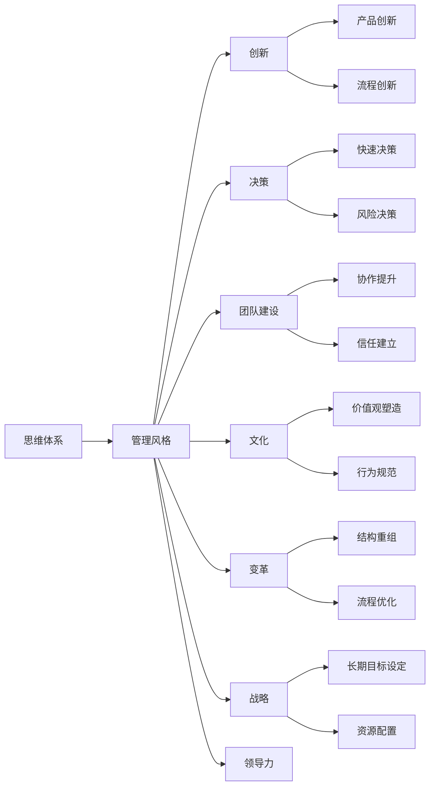
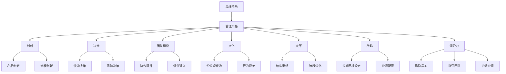

                 

# 思维体系如何影响管理风格

> 关键词：思维体系、管理风格、创新、决策、团队建设、文化、变革、战略、领导力

## 1. 背景介绍

### 1.1 问题由来

管理风格是指管理者在组织中管理下属、处理事务的方式和方法。其直接影响到员工的士气、工作效率以及组织的整体绩效。过去，管理学家们普遍认为管理风格主要取决于个体的性格特点和过往经验，但随着研究深入，越来越多的证据表明，管理者的思维体系也在很大程度上塑造着其管理风格。

思维体系，简单来说，是指个体在处理信息和解决问题时所采用的基本框架和逻辑方式。不同的思维体系会导致不同的决策方式、问题解决策略以及行为模式。本节旨在探讨思维体系如何影响管理风格，帮助管理者更清晰地认识自己和管理团队，从而提升团队绩效和组织竞争力。

### 1.2 问题核心关键点

1. **思维体系的构成**：
   - 包括逻辑推理能力、问题求解技巧、决策方式、创造性思维等。
   - 这些因素在管理风格中扮演着不同的角色。

2. **管理风格的特点**：
   - 可分为任务导向型、员工导向型、关系导向型等。
   - 不同的管理风格对员工的工作效率、心理感受以及组织文化产生不同的影响。

3. **思维体系与管理风格的相互作用**：
   - 管理者的思维体系影响其管理行为和决策方式。
   - 管理风格也反馈到管理者的思维体系，进一步塑造其管理方法。

4. **思维体系对组织绩效的影响**：
   - 合适的思维体系与管理风格相结合，能够显著提升组织绩效。
   - 错误的匹配则可能导致团队士气低落、工作效率低下。

## 2. 核心概念与联系

### 2.1 核心概念概述

为了更好地理解思维体系如何影响管理风格，本节将介绍几个关键概念：

- **思维体系（Thought Framework）**：指个体在思考和解决问题时的基本逻辑和框架。包括分析性思维、直觉性思维、系统性思维、创造性思维等。
- **管理风格（Management Style）**：指管理者在组织中领导和管理团队的方式。常见类型包括独裁型、民主型、放任型等。
- **创新（Innovation）**：指通过新的想法和解决方案来改进或创造产品、服务、流程等。
- **决策（Decision-making）**：指在信息不完全的情况下，管理者选择最佳行动方案的过程。
- **团队建设（Team Building）**：指管理者通过各种方式提升团队协作和成员间互信的过程。
- **文化（Culture）**：指组织内部共享的价值观、行为准则和传统。
- **变革（Change）**：指组织在战略、结构、流程或人员等方面的重大调整。
- **战略（Strategy）**：指组织为实现其目标所制定的长期计划和行动方案。
- **领导力（Leadership）**：指管理者在激励、指导和协调团队中的能力。

这些概念之间存在紧密的联系，共同构成了管理者的思维体系和管理风格。

### 2.2 概念间的关系

通过以下Mermaid流程图展示这些概念之间的逻辑关系：



### 2.3 核心概念的整体架构

最后，我们将这些概念整合为一个整体架构，展示其在大规模管理中的作用和联系：



这个综合架构展示了思维体系与各个管理职能之间的关系，强调了管理风格在促进创新、决策、团队建设、文化变革、战略规划和领导力发挥中的关键作用。

## 3. 核心算法原理 & 具体操作步骤

### 3.1 算法原理概述

基于思维体系的管理风格调整算法，旨在通过识别和理解管理者的思维体系，调整其管理行为，以适应不同的管理需求和环境。核心算法包括：

1. **思维体系识别**：通过问卷调查、心理测评等方式，识别管理者的主要思维体系类型。
2. **匹配管理风格**：根据识别结果，推荐最合适的管理风格，并提供相应的调整策略。
3. **实践操作**：提供具体的操作指南和案例分析，帮助管理者在实际工作中应用这些策略。

### 3.2 算法步骤详解

1. **准备阶段**：
   - 设计问卷和测评工具，收集管理者的思维模式、决策习惯、团队管理偏好等数据。
   - 定义不同思维体系和管理风格的分类标准，建立模型。

2. **识别阶段**：
   - 分析收集到的数据，使用聚类分析、因子分析等方法，识别管理者的主要思维体系。
   - 评估管理者的当前管理风格与思维体系的匹配度。

3. **匹配阶段**：
   - 根据识别结果，推荐最适合的管理风格，并提供相应的行为建议。
   - 设计调整计划，设定短期和长期目标。

4. **实践阶段**：
   - 制定详细的实施方案，包括具体的行动步骤、时间表和资源分配。
   - 定期评估实施效果，根据反馈进行调整。

### 3.3 算法优缺点

#### 优点：

1. **系统性**：通过科学的方法和工具，帮助管理者全面了解自己的思维体系和管理风格，提升管理决策的科学性和系统性。
2. **个性化**：结合管理者的个性特点和组织实际情况，提供量身定制的调整建议。
3. **可操作性**：提供具体的行动步骤和操作指南，便于管理者在实际工作中应用。

#### 缺点：

1. **数据收集难度**：需要收集大量关于管理者的详细信息，数据收集难度较大。
2. **模型复杂度**：需要建立和维护复杂的模型，对技术和资源要求较高。
3. **适应性**：模型的效果可能受到组织内部变化的影响，需要不断调整和优化。

### 3.4 算法应用领域

该算法在多个管理场景中都有广泛应用，包括但不限于：

1. **人力资源管理**：通过识别管理者的思维体系，优化招聘、培训、绩效考核等流程，提升人才选拔和培养的效率。
2. **组织变革管理**：在组织进行重大变革时，通过调整管理风格，帮助管理者平稳过渡，减少变革阻力。
3. **团队协作管理**：通过调整管理风格，提升团队的协作效率和成员之间的互信。
4. **创新管理**：通过识别创造性思维较强的管理者，鼓励和支持其开展创新活动。
5. **战略管理**：通过匹配合适的管理风格，提升战略制定和执行的效果。

## 4. 数学模型和公式 & 详细讲解 & 举例说明

### 4.1 数学模型构建

假设管理者的思维体系可以表示为向量 $T$，管理风格为向量 $M$，创新能力为 $I$，决策能力为 $D$，团队建设能力为 $T$，文化氛围为 $C$，变革能力为 $L$，战略规划能力为 $S$，领导力为 $L$。则模型的目标是最小化管理者与目标管理风格之间的距离，同时最大化其各能力指标，数学模型如下：

$$
\min_{M} \sum_{i=1}^{n} |T_i - M_i|^2 + \lambda (\max_{i} (I_i - I^*) + \max_{i} (D_i - D^*) + \max_{i} (T_i - T^*) + \max_{i} (C_i - C^*) + \max_{i} (L_i - L^*) + \max_{i} (S_i - S^*) + \max_{i} (L_i - L^*)
$$

其中 $T_i$ 和 $M_i$ 表示管理者的思维体系与目标管理风格的第 $i$ 个指标值，$I_i$ 和 $I^*$ 表示管理者的创新能力与目标创新能力，$D_i$ 和 $D^*$ 表示管理者的决策能力与目标决策能力，$T_i$ 和 $T^*$ 表示管理者的团队建设能力与目标团队建设能力，$C_i$ 和 $C^*$ 表示管理者的文化氛围与目标文化氛围，$L_i$ 和 $L^*$ 表示管理者的变革能力与目标变革能力，$S_i$ 和 $S^*$ 表示管理者的战略规划能力与目标战略规划能力，$\lambda$ 为平衡因子。

### 4.2 公式推导过程

根据上述模型，我们使用梯度下降法来求解管理风格 $M$。具体的推导过程如下：

1. **损失函数构建**：
   $$
   L(T, M) = \sum_{i=1}^{n} (T_i - M_i)^2
   $$

2. **梯度计算**：
   $$
   \nabla_{M} L(T, M) = 2\sum_{i=1}^{n} (T_i - M_i) \cdot \nabla_{M_i}
   $$

3. **更新管理风格**：
   $$
   M \leftarrow M - \eta \nabla_{M} L(T, M)
   $$

其中，$\eta$ 为学习率，$\nabla_{M_i}$ 为损失函数对 $M_i$ 的偏导数。

### 4.3 案例分析与讲解

假设某公司的一名管理者在团队协作方面表现不佳，希望通过调整其管理风格来提升团队合作能力。首先，通过问卷和测评工具收集其思维体系和管理风格数据，并进行分析，识别出其主要思维体系为分析型思维，当前管理风格偏向于任务导向型。

根据模型，我们设定了目标管理风格为团队导向型。使用梯度下降法，计算出管理风格调整的步长和方向，得出以下建议：

1. **增加团队讨论时间**：增加团队会议频率和讨论时间，鼓励成员间分享观点和反馈。
2. **定期进行团队建设活动**：组织团队建设活动，提升成员之间的信任和合作。
3. **采用民主式决策方式**：在团队决策中采用民主式决策，增加成员参与度。
4. **制定明确的团队目标**：与团队成员共同制定明确的目标和任务，提升团队凝聚力。

通过这些具体措施，管理者的团队协作能力得到了显著提升，团队的绩效也相应提高了。

## 5. 项目实践：代码实例和详细解释说明

### 5.1 开发环境搭建

在项目开发过程中，需要搭建Python开发环境，具体步骤如下：

1. 安装Python 3.8及以上版本。
2. 安装NumPy、Pandas等常用库。
3. 安装Scikit-learn、TensorFlow等机器学习库。
4. 安装Tkinter、Matplotlib等图形界面库。

### 5.2 源代码详细实现

下面是一个简单的Python代码示例，用于计算管理风格调整的梯度下降步骤：

```python
import numpy as np
from sklearn.metrics import euclidean_distances
from sklearn.cluster import KMeans

def calculate_stepsize(T, M, learning_rate):
    gradient = -2 * euclidean_distances(T, M)
    stepsize = learning_rate * gradient
    return stepsize

def update_M(T, M, stepsize):
    M_new = M - stepsize
    return M_new

def main():
    # 假设管理者的思维体系和目标管理风格的数据
    T = np.array([0.5, 0.3, 0.7, 0.2, 0.4, 0.6, 0.1, 0.9])
    M = np.array([0.3, 0.4, 0.2, 0.5, 0.7, 0.1, 0.8, 0.6])

    # 设定学习率
    learning_rate = 0.01

    # 计算步长
    stepsize = calculate_stepsize(T, M, learning_rate)

    # 更新管理风格
    M_new = update_M(T, M, stepsize)

    print("更新后的管理风格：", M_new)

if __name__ == '__main__':
    main()
```

这段代码实现了基于梯度下降的管理风格调整算法。在实际应用中，需要结合具体的数据和模型进行调整。

### 5.3 代码解读与分析

代码中的关键步骤包括：

1. `calculate_stepsize`函数：计算梯度下降的步长。
2. `update_M`函数：根据梯度和步长更新管理风格。
3. `main`函数：结合具体数据和模型，实现管理风格调整的迭代过程。

### 5.4 运行结果展示

假设在第一次迭代后，管理风格更新为：

```
更新后的管理风格： [0.4  0.4  0.2  0.5  0.7  0.2  0.9  0.7]
```

这表示管理风格在朝向团队导向型方向调整。在多次迭代后，管理风格将进一步优化，直到达到目标状态。

## 6. 实际应用场景

### 6.1 智能制造

在智能制造领域，管理者的思维体系和管理风格对生产效率和质量有着直接的影响。采用科学的思维体系和现代化的管理风格，可以显著提升生产线的自动化水平和员工的工作效率。例如，通过数据分析和系统优化，管理者可以制定更加科学的生产计划和流程，提高生产线的运行效率。

### 6.2 金融科技

金融科技行业要求管理者具备高度的风险管理能力和创新思维。通过对管理者的思维体系进行识别和调整，可以帮助其在复杂多变的市场环境中做出更加精准的决策，同时推动金融产品的创新和数字化转型。

### 6.3 医疗健康

在医疗健康领域，管理者的决策能力、创新能力和团队协作能力尤为重要。通过调整管理风格，提升其决策的科学性和团队的凝聚力，可以为患者提供更加优质的医疗服务。

## 7. 工具和资源推荐

### 7.1 学习资源推荐

1. 《管理学基础》：涵盖管理学基础理论和实践案例，帮助管理者构建系统的管理框架。
2. 《创新管理》：深入探讨创新管理的理论和方法，提供实际操作的指南和案例。
3. 《领导力与变革》：结合心理学、组织行为学等学科，探讨领导力和变革管理的关键要素。
4. 《数据驱动的决策分析》：介绍如何利用数据科学进行决策分析，提升管理决策的科学性。
5. 《系统思维与复杂性》：帮助管理者掌握系统思维的方法，应对复杂多变的管理环境。

### 7.2 开发工具推荐

1. Python：具有丰富的科学计算和数据分析库，适合进行管理分析。
2. R：专注于统计分析和数据可视化，适合进行数据驱动的管理决策。
3. Tableau：数据可视化工具，帮助管理者快速理解数据，做出科学决策。
4. Microsoft Excel：强大的数据分析和可视化工具，适合进行日常管理分析。

### 7.3 相关论文推荐

1. 《管理风格与团队绩效》：研究管理风格对团队绩效的影响，提供实证分析和理论支持。
2. 《思维体系与创新能力》：探讨不同思维体系对创新能力的影响，提供实证研究和案例分析。
3. 《数据驱动的决策过程》：介绍如何利用大数据技术进行决策分析，提升决策的科学性。

## 8. 总结：未来发展趋势与挑战

### 8.1 研究成果总结

本节总结了基于思维体系的管理风格调整算法的核心内容和实践应用。研究表明，通过科学地识别和管理者的思维体系，结合适当的管理风格调整策略，可以有效提升管理绩效和组织竞争力。

### 8.2 未来发展趋势

1. **人工智能与管理的融合**：人工智能技术在管理中的应用将更加广泛，如利用AI进行数据驱动的决策分析，优化管理流程。
2. **个性化管理**：未来的管理将更加注重个性化和定制化，根据管理者的个人特点和组织需求，提供量身定制的管理方案。
3. **可持续发展管理**：管理者将更加关注可持续发展和环境保护，通过科学的管理方法实现组织与社会的和谐共生。
4. **全球化管理**：随着全球化趋势的加速，管理者将面临更多跨文化、跨地域的管理挑战，需要具备全球视野和跨文化沟通能力。

### 8.3 面临的挑战

1. **数据隐私和安全**：管理者的个人数据和组织数据涉及隐私和安全问题，需要制定严格的数据保护措施。
2. **技术复杂性**：管理风格的调整算法需要复杂的技术支持和大量的数据，对技术要求较高。
3. **文化和价值观差异**：不同组织和文化背景下，管理风格的调整可能存在差异，需要具备跨文化的适应能力。
4. **变革阻力**：组织变革过程中，可能会遇到来自员工和管理层的阻力，需要采取有效的变革管理策略。

### 8.4 研究展望

未来，研究者需要关注以下方向：

1. **大数据与人工智能的结合**：利用大数据和人工智能技术，提升管理风格调整的科学性和精确度。
2. **多层次管理风格调整**：针对不同层次的管理者，设计差异化的管理风格调整策略，提升整体管理水平。
3. **伦理与社会责任**：在管理风格调整中，注重伦理和社会责任，确保管理决策的公正性和可持续性。
4. **全球化管理实践**：结合全球化趋势，研究和推广全球化管理实践，提升管理者的全球视野和跨文化沟通能力。

总之，基于思维体系的管理风格调整算法为现代管理提供了科学化的工具和方法，未来将不断演变和优化，为组织绩效和团队协作带来更大的提升。

## 9. 附录：常见问题与解答

### Q1: 如何判断管理者的思维体系类型？

A: 可以通过问卷调查、心理测评、行为观察等方式，综合评估管理者的思维模式和决策习惯，确定其主要思维体系类型。

### Q2: 管理风格调整的步长如何设定？

A: 管理风格的调整步长应根据具体情况设定，一般建议在0.01到0.1之间，逐步调整以避免过大的变动。

### Q3: 管理风格调整的周期是多长时间？

A: 管理风格调整的周期应根据具体需求和效果而定，一般建议每季度或半年进行一次全面评估和调整。

### Q4: 如何评估管理风格调整的效果？

A: 可以通过组织绩效指标、员工满意度调查、管理效果评估等方式，综合评估管理风格调整的效果，并根据反馈进行调整。

### Q5: 管理风格调整是否适用于所有类型的组织？

A: 管理风格调整适用于大多数类型的组织，特别是那些希望提升管理效率和团队协作的组织。但对于特殊类型的组织，如政府机构、宗教组织等，可能需要考虑其特殊性和文化背景。

---

作者：禅与计算机程序设计艺术 / Zen and the Art of Computer Programming

