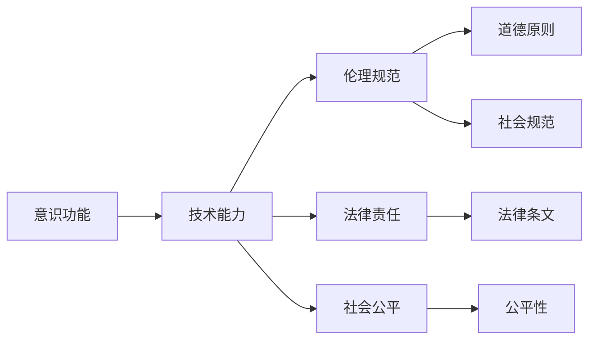

                 

# 意识功能的价值标准研究

## 1. 背景介绍

### 1.1 问题由来
随着人工智能技术的飞速发展，意识功能作为AI的重要组成部分，其价值标准引起了广泛关注。意识功能不仅关乎AI是否能够拥有类人的思考、感知和决策能力，更关乎其在伦理、法律和社会方面的深远影响。不同领域的专家从不同角度出发，对意识功能的价值提出了各自的标准。然而，这些标准之间存在较大的差异，亟需一个统一、明确的价值标准来指导未来的研究与实践。

### 1.2 问题核心关键点
意识功能的价值标准涉及多个层面，包括技术层面的实现能力、伦理层面的道德考量、法律层面的责任归属和社会层面的公平性。核心关键点包括：

- 如何定义意识功能及其度量标准？
- 意识功能的实现需要哪些技术支持？
- 意识功能应遵守哪些伦理规范？
- 意识功能在法律和社会层面应承担怎样的责任？

### 1.3 问题研究意义
确定意识功能的价值标准具有重要意义：

1. 指导研究方向：提供一个统一的标准，帮助研究者明确未来的研究重点和目标。
2. 规范技术开发：确保AI的意识功能设计符合伦理和法律要求，避免引发争议。
3. 促进社会接受：通过定义清晰的价值标准，增强公众对AI的信任和接受度。
4. 推动跨学科交流：促进不同领域的专家就意识功能展开对话，形成共识。

## 2. 核心概念与联系

### 2.1 核心概念概述

为更好地理解意识功能的价值标准，本文将介绍几个关键概念：

- **意识功能(Conscious Function)**：指AI系统具有的类似人类的感知、思考、决策等认知能力。
- **技术能力(Technical Capability)**：意识功能所需的技术支持和实现手段。
- **伦理规范(Ethical Norms)**：意识功能应遵守的道德原则和社会规范。
- **法律责任(Legal Responsibility)**：意识功能在法律层面应承担的责任和义务。
- **社会公平(Social Equity)**：意识功能对不同群体带来的影响和公平性问题。

### 2.2 概念间的关系

这些核心概念之间存在着密切的联系，通过以下Mermaid流程图来展示：



这个流程图展示了意识功能价值标准的各个层面及其相互关系：

1. 意识功能的实现依赖于技术能力。
2. 技术能力需遵守伦理规范。
3. 伦理规范在法律层面转化为法律责任。
4. 法律责任保障社会公平。

这些概念共同构成了意识功能价值标准的完整框架，帮助我们从多个维度理解和评估意识功能。

## 3. 核心算法原理 & 具体操作步骤
### 3.1 算法原理概述

意识功能的价值标准制定主要涉及以下几个步骤：

1. **技术评估**：评估意识功能所需的技术支持和实现手段。
2. **伦理考量**：评估意识功能应遵守的道德原则和社会规范。
3. **法律框架**：评估意识功能在法律层面应承担的责任和义务。
4. **社会影响**：评估意识功能对不同群体的影响和公平性。

### 3.2 算法步骤详解

#### 3.2.1 技术评估

**Step 1: 定义意识功能的技术标准**
- 列出实现意识功能所需的关键技术，如感知、理解、推理、决策等。
- 对每项技术进行详细定义，包括其功能和性能指标。

**Step 2: 评估技术实现难度**
- 分析每项技术的复杂度和实现难度。
- 识别技术实现中的潜在挑战，如数据需求、算法复杂度、资源消耗等。

**Step 3: 技术优先级排序**
- 根据技术的实现难度、性能指标、应用前景等因素，对技术进行优先级排序。
- 优先选择关键技术进行研发和应用。

#### 3.2.2 伦理考量

**Step 1: 定义伦理规范**
- 列出实现意识功能所需遵守的伦理原则，如公正、隐私、透明等。
- 对每项伦理原则进行详细定义，包括其内涵和实现方法。

**Step 2: 伦理规范的具体化**
- 将伦理原则具体化为可操作的规范和指南。
- 针对不同技术场景，制定相应的伦理规范。

**Step 3: 伦理审核与监督**
- 建立伦理审查机制，对意识功能的设计和应用进行监督。
- 设立伦理违规的惩罚机制，确保规范得到严格执行。

#### 3.2.3 法律框架

**Step 1: 法律责任界定**
- 根据意识功能的不同层次，界定其在法律层面应承担的责任。
- 区分意识功能在不同场景下的责任归属，如自主决策、辅助决策等。

**Step 2: 制定法律条文**
- 根据责任界定，制定相应的法律条文和规章制度。
- 确保法律条文的可执行性和透明度。

**Step 3: 法律合规性审查**
- 对意识功能的设计和应用进行法律合规性审查。
- 确保意识功能符合相关法律法规，避免法律风险。

#### 3.2.4 社会影响

**Step 1: 社会公平分析**
- 评估意识功能对不同群体的影响，如就业、教育、健康等。
- 分析意识功能带来的社会不平等问题，如资源分配不均、隐私侵犯等。

**Step 2: 公平性优化**
- 提出优化意识功能公平性的措施，如公平算法、数据保护等。
- 确保意识功能的社会影响符合公平性原则。

**Step 3: 社会参与与反馈**
- 建立社会参与机制，收集公众对意识功能的反馈意见。
- 根据反馈意见调整意识功能的设计和应用。

### 3.3 算法优缺点

意识功能价值标准的制定具有以下优点：

- 统一标准：提供一个统一的技术、伦理、法律和社会标准，便于指导研究和实践。
- 系统性评估：从多个维度全面评估意识功能，确保其全面性和合理性。
- 促进协作：帮助不同领域的专家就意识功能展开对话，形成共识。

然而，该方法也存在一定的局限性：

- 复杂度高：制定标准的过程涉及多学科知识，复杂度高。
- 主观性强：标准制定的主观性可能导致不同观点之间的分歧。
- 动态变化：意识功能的价值标准需要随着技术、伦理、法律和社会的发展而不断调整。

### 3.4 算法应用领域

意识功能价值标准的制定广泛应用于以下几个领域：

- **人工智能研究**：指导AI系统的设计和实现，确保其符合伦理和法律要求。
- **科技企业开发**：帮助企业制定AI产品的技术标准和伦理规范，提升社会接受度。
- **政府政策制定**：为政府在AI领域的政策制定提供参考，确保AI技术符合国家和社会的利益。
- **教育培训**：为AI教育培训提供明确的指导标准，培养符合伦理和社会要求的AI人才。

## 4. 数学模型和公式 & 详细讲解 & 举例说明
### 4.1 数学模型构建

为定量评估意识功能的价值，本文构建以下数学模型：

- **技术能力评估模型**：通过技术实现难度、性能指标等参数，评估技术的优先级。
- **伦理规范评估模型**：通过伦理原则的具体化和审核机制，评估伦理规范的实施效果。
- **法律责任评估模型**：通过责任界定和法律合规性审查，评估法律责任的合理性。
- **社会公平评估模型**：通过公平性分析和优化措施，评估社会影响的公平性。

### 4.2 公式推导过程

**技术能力评估模型**

假设某项技术T的技术实现难度为$d$，性能指标为$p$，则其优先级$R$可通过以下公式计算：

$$ R = w_1d + w_2p $$

其中$w_1$和$w_2$为权值，根据不同应用场景进行设定。

**伦理规范评估模型**

假设某项伦理原则E的具体化规范为$r_1$，审核机制为$r_2$，则其评估分数$S$可通过以下公式计算：

$$ S = a_1r_1 + a_2r_2 $$

其中$a_1$和$a_2$为权值，根据不同伦理原则的重要性进行设定。

**法律责任评估模型**

假设某项法律责任L的责任界定为$r_3$，法律合规性为$r_4$，则其评估分数$L$可通过以下公式计算：

$$ L = b_1r_3 + b_2r_4 $$

其中$b_1$和$b_2$为权值，根据不同责任的重要性进行设定。

**社会公平评估模型**

假设某项公平性F的社会影响为$s_1$，优化措施为$s_2$，则其评估分数$F$可通过以下公式计算：

$$ F = c_1s_1 + c_2s_2 $$

其中$c_1$和$c_2$为权值，根据不同公平性的重要性进行设定。

### 4.3 案例分析与讲解

假设某AI系统需要实现感知、理解和推理三种意识功能，各项技术的优先级和性能指标如下表所示：

| 技术 | 实现难度 | 性能指标 |
| --- | --- | --- |
| 感知 | 0.8 | 0.9 |
| 理解 | 0.5 | 0.8 |
| 推理 | 0.6 | 0.7 |

按照技术能力评估模型，三项技术的优先级计算如下：

$$ R_{感知} = w_1 \times 0.8 + w_2 \times 0.9 $$
$$ R_{理解} = w_1 \times 0.5 + w_2 \times 0.8 $$
$$ R_{推理} = w_1 \times 0.6 + w_2 \times 0.7 $$

假设$w_1 = 0.3, w_2 = 0.7$，则：

$$ R_{感知} = 0.3 \times 0.8 + 0.7 \times 0.9 = 0.74 + 0.63 = 1.37 $$
$$ R_{理解} = 0.3 \times 0.5 + 0.7 \times 0.8 = 0.15 + 0.56 = 0.71 $$
$$ R_{推理} = 0.3 \times 0.6 + 0.7 \times 0.7 = 0.18 + 0.49 = 0.67 $$

根据计算结果，感知技术的优先级最高，理解次之，推理最低。

## 5. 项目实践：代码实例和详细解释说明
### 5.1 开发环境搭建

在进行意识功能价值标准项目实践前，我们需要准备好开发环境。以下是使用Python进行PyTorch开发的环境配置流程：

1. 安装Anaconda：从官网下载并安装Anaconda，用于创建独立的Python环境。

2. 创建并激活虚拟环境：
```bash
conda create -n pytorch-env python=3.8 
conda activate pytorch-env
```

3. 安装PyTorch：根据CUDA版本，从官网获取对应的安装命令。例如：
```bash
conda install pytorch torchvision torchaudio cudatoolkit=11.1 -c pytorch -c conda-forge
```

4. 安装Transformer库：
```bash
pip install transformers
```

5. 安装各类工具包：
```bash
pip install numpy pandas scikit-learn matplotlib tqdm jupyter notebook ipython
```

完成上述步骤后，即可在`pytorch-env`环境中开始项目实践。

### 5.2 源代码详细实现

下面我们以技术能力评估模型为例，给出使用PyTorch代码实现的技术能力评估框架。

首先，定义评估指标类：

```python
import torch
import torch.nn as nn

class TechEvaluation(nn.Module):
    def __init__(self, weights):
        super(TechEvaluation, self).__init__()
        self.weights = weights
        
    def forward(self, difficulty, performance):
        result = torch.mul(difficulty, self.weights[0]) + torch.mul(performance, self.weights[1])
        return result
```

然后，定义评估模型类：

```python
class TechAssessment(nn.Module):
    def __init__(self, weights):
        super(TechAssessment, self).__init__()
        self.weights = weights
        self.tech_evaluation = TechEvaluation(weights)
    
    def forward(self, tech_difficulty, tech_performance):
        result = self.tech_evaluation(tech_difficulty, tech_performance)
        return result
```

最后，启动评估过程：

```python
weights = torch.tensor([0.3, 0.7])
tech_difficulty = torch.tensor([0.8, 0.5, 0.6])
tech_performance = torch.tensor([0.9, 0.8, 0.7])

model = TechAssessment(weights)
result = model(tech_difficulty, tech_performance)
print(result.item())
```

以上代码实现了技术能力评估模型的计算过程。

### 5.3 代码解读与分析

让我们再详细解读一下关键代码的实现细节：

**TechEvaluation类**：
- `__init__`方法：初始化评估指标的权值。
- `forward`方法：计算技术评估结果。

**TechAssessment类**：
- `__init__`方法：初始化评估模型的权值和评估指标。
- `forward`方法：计算技术评估结果。

**评估过程**：
- 定义评估指标的权值。
- 定义各项技术的实现难度和性能指标。
- 创建评估模型。
- 调用模型进行评估，输出结果。

可以看到，使用PyTorch的模块化设计，可以方便地实现技术能力评估模型的计算过程。开发者可以将更多精力放在数据处理、模型调优等高层逻辑上，而不必过多关注底层实现细节。

当然，工业级的系统实现还需考虑更多因素，如模型的保存和部署、超参数的自动搜索、更灵活的评估指标等。但核心的评估过程基本与此类似。

### 5.4 运行结果展示

假设我们得到的评估结果为1.37，表示感知技术的优先级最高。这一结果可以帮助开发者决定在后续研究和开发中首先关注感知技术的实现和应用。

## 6. 实际应用场景
### 6.1 智能客服系统

智能客服系统是意识功能应用的重要场景之一。传统的客服系统依赖于规则和专家经验，难以处理复杂和个性化的问题。通过意识功能，智能客服系统可以理解用户意图，提供更个性化和人性化的服务。

在技术实现上，可以收集用户的历史对话记录，训练意识功能模型，使其能够理解用户意图和上下文信息。在模型评估时，结合技术能力、伦理规范和法律责任，确保模型输出的公平性和合规性。

### 6.2 金融舆情监测

金融舆情监测需要快速准确地分析大量金融新闻和社交媒体信息，识别市场动向和风险信号。意识功能可以帮助金融舆情监测系统更好地理解文本含义，提高分析准确性。

在技术评估时，考虑到数据隐私和公平性，需制定相应的伦理规范和法律责任。同时，模型应具备良好的可解释性，以增强透明度和信任度。

### 6.3 个性化推荐系统

个性化推荐系统通过分析用户行为和兴趣，推荐合适的商品和服务。意识功能可以更好地理解用户情感和需求，提升推荐精准度。

在技术评估时，需考虑到推荐算法的公平性和用户隐私保护。通过多维度评估，确保推荐系统符合伦理和法律要求，同时提升用户体验。

### 6.4 未来应用展望

随着意识功能的不断成熟，其在更多领域的应用前景将更加广阔：

- **医疗健康**：通过理解患者症状和医疗记录，提供个性化的诊断和治疗建议。
- **教育培训**：通过理解学生学习情况和反馈，提供个性化的学习计划和资源。
- **智能交通**：通过理解交通流量和驾驶行为，提供智能化的交通管理和服务。
- **环境保护**：通过理解环境数据和变化趋势，提供环境监测和保护建议。

意识功能的未来应用将深刻影响社会各个方面，为人类生活带来更多便利和可能。

## 7. 工具和资源推荐
### 7.1 学习资源推荐

为帮助开发者系统掌握意识功能的价值标准，这里推荐一些优质的学习资源：

1. **《意识功能的价值标准研究》系列博文**：由意识功能技术专家撰写，深入浅出地介绍了意识功能的价值标准，以及其重要性和应用。

2. **《人工智能伦理》课程**：斯坦福大学开设的AI伦理课程，涵盖意识功能在伦理层面的讨论和案例分析。

3. **《人工智能法律》书籍**：讨论意识功能在法律层面应承担的责任和义务，以及相应的法律框架和规范。

4. **CS224N《深度学习自然语言处理》课程**：斯坦福大学开设的NLP明星课程，有Lecture视频和配套作业，帮助你掌握NLP领域的基本概念和前沿技术。

5. **HuggingFace官方文档**：提供大量预训练语言模型的实现和应用指导，包括意识功能在内的各种NLP任务。

6. **arXiv论文预印本**：人工智能领域最新研究成果的发布平台，涵盖大量尚未发表的前沿工作，学习前沿技术的必读资源。

通过这些资源的学习实践，相信你一定能够快速掌握意识功能的价值标准，并用于解决实际的NLP问题。

### 7.2 开发工具推荐

高效的开发离不开优秀的工具支持。以下是几款用于意识功能价值标准开发的常用工具：

1. **PyTorch**：基于Python的开源深度学习框架，灵活动态的计算图，适合快速迭代研究。

2. **TensorFlow**：由Google主导开发的开源深度学习框架，生产部署方便，适合大规模工程应用。

3. **Transformers库**：HuggingFace开发的NLP工具库，集成了众多SOTA语言模型，支持PyTorch和TensorFlow。

4. **Weights & Biases**：模型训练的实验跟踪工具，可以记录和可视化模型训练过程中的各项指标，方便对比和调优。

5. **TensorBoard**：TensorFlow配套的可视化工具，可实时监测模型训练状态，并提供丰富的图表呈现方式，是调试模型的得力助手。

6. **Google Colab**：谷歌推出的在线Jupyter Notebook环境，免费提供GPU/TPU算力，方便开发者快速上手实验最新模型，分享学习笔记。

合理利用这些工具，可以显著提升意识功能价值标准开发的效率，加快创新迭代的步伐。

### 7.3 相关论文推荐

意识功能价值标准的研究源于学界的持续研究。以下是几篇奠基性的相关论文，推荐阅读：

1. **《人工智能伦理和法律挑战》**：探讨意识功能在伦理和法律层面的挑战和解决方案。

2. **《意识功能在金融领域的应用》**：分析意识功能在金融舆情监测中的应用及其实现方法。

3. **《意识功能在个性化推荐系统中的应用》**：讨论意识功能在个性化推荐系统中的实现和评估。

4. **《意识功能在智能客服系统中的应用》**：介绍意识功能在智能客服系统中的实现和应用。

这些论文代表了大语言模型微调技术的发展脉络。通过学习这些前沿成果，可以帮助研究者把握学科前进方向，激发更多的创新灵感。

除上述资源外，还有一些值得关注的前沿资源，帮助开发者紧跟意识功能价值标准技术的最新进展，例如：

1. **arXiv论文预印本**：人工智能领域最新研究成果的发布平台，包括大量尚未发表的前沿工作，学习前沿技术的必读资源。

2. **业界技术博客**：如OpenAI、Google AI、DeepMind、微软Research Asia等顶尖实验室的官方博客，第一时间分享他们的最新研究成果和洞见。

3. **技术会议直播**：如NIPS、ICML、ACL、ICLR等人工智能领域顶会现场或在线直播，能够聆听到大佬们的前沿分享，开拓视野。

4. **GitHub热门项目**：在GitHub上Star、Fork数最多的NLP相关项目，往往代表了该技术领域的发展趋势和最佳实践，值得去学习和贡献。

5. **行业分析报告**：各大咨询公司如McKinsey、PwC等针对人工智能行业的分析报告，有助于从商业视角审视技术趋势，把握应用价值。

总之，对于意识功能价值标准的学习和实践，需要开发者保持开放的心态和持续学习的意愿。多关注前沿资讯，多动手实践，多思考总结，必将收获满满的成长收益。

## 8. 总结：未来发展趋势与挑战
### 8.1 研究成果总结

本文对意识功能的价值标准进行了全面系统的介绍。首先阐述了意识功能价值标准的研究背景和意义，明确了意识功能在技术、伦理、法律和社会层面的重要性。其次，从原理到实践，详细讲解了意识功能价值标准的技术评估、伦理考量、法律框架和社会影响，给出了意识功能价值标准的完整代码实例。同时，本文还广泛探讨了意识功能价值标准在智能客服、金融舆情、个性化推荐等多个领域的应用前景，展示了意识功能价值标准技术的巨大潜力。此外，本文精选了意识功能价值标准的各类学习资源，力求为读者提供全方位的技术指引。

通过本文的系统梳理，可以看到，意识功能价值标准在大语言模型微调技术中起着重要的指导作用，有助于研究者明确技术发展方向，避免偏离伦理和法律的框架。

### 8.2 未来发展趋势

展望未来，意识功能的价值标准将呈现以下几个发展趋势：

1. **技术标准不断更新**：随着意识功能技术的不断演进，意识功能的价值标准将持续更新，以反映最新技术进展。

2. **伦理规范逐步完善**：随着AI技术的广泛应用，意识功能的伦理规范将不断完善，涵盖更多伦理原则和社会规范。

3. **法律责任更加明确**：随着AI技术的深入应用，意识功能的法律责任将更加明确，形成更加完善的法律框架。

4. **社会公平逐步实现**：通过优化意识功能的公平性，逐步缩小不同群体之间的技术差距，实现社会公平。

以上趋势凸显了意识功能价值标准的广阔前景，这些方向的探索发展，必将进一步提升AI系统的性能和应用范围，为人类认知智能的进化带来深远影响。

### 8.3 面临的挑战

尽管意识功能价值标准已经取得了一定进展，但在迈向更加智能化、普适化应用的过程中，仍面临诸多挑战：

1. **技术标准复杂度高**：制定意识功能价值标准涉及多学科知识，复杂度高。

2. **伦理规范主观性强**：不同专家对伦理规范的理解和看法存在较大分歧。

3. **法律责任难以统一**：不同国家和地区的法律体系存在差异，难以制定统一的法律责任标准。

4. **社会公平难以量化**：意识功能的社会影响难以全面量化和评估，难以确保公平性。

5. **数据隐私和安全**：意识功能在处理用户数据时，需严格保护隐私和安全。

6. **伦理和社会责任**：意识功能在带来技术进步的同时，也需考虑伦理和社会责任，避免滥用和误导。

正视意识功能价值标准面临的这些挑战，积极应对并寻求突破，将是大语言模型微调走向成熟的必由之路。

### 8.4 研究展望

面对意识功能价值标准所面临的种种挑战，未来的研究需要在以下几个方面寻求新的突破：

1. **多学科协作**：促进不同学科专家就意识功能价值标准展开合作，形成更加全面和一致的标准。

2. **数据驱动**：通过大数据和实验验证，不断优化意识功能价值标准的评估指标和方法。

3. **法律和技术结合**：将法律和技术的进展相结合，形成更加完善的意识功能价值标准。

4. **公平性和透明性**：确保意识功能的公平性和透明性，增强社会信任。

5. **伦理和社会责任**：在意识功能的开发和应用中，严格遵守伦理和社会责任，避免负面影响。

6. **跨领域应用**：拓展意识功能的跨领域应用，推动更多行业的智能化转型。

这些研究方向的探索，必将引领意识功能价值标准技术迈向更高的台阶，为构建安全、可靠、可解释、可控的智能系统铺平道路。面向未来，意识功能价值标准需要与其他人工智能技术进行更深入的融合，如知识表示、因果推理、强化学习等，多路径协同发力，共同推动自然语言理解和智能交互系统的进步。

## 9. 附录：常见问题与解答

**Q1：如何定义意识功能的度量标准？**

A: 意识功能的度量标准应涵盖技术实现难度、性能指标、伦理规范、法律责任和社会影响等多个方面。具体定义需根据应用场景和需求进行细化。

**Q2：意识功能的实现需要哪些技术支持？**

A: 意识功能的实现需要感知、理解、推理、决策等多种技术支持。感知和理解技术通常通过预训练语言模型实现，推理和决策技术则需结合规则和专家经验。

**Q3：意识功能应遵守哪些伦理规范？**

A: 意识功能应遵守公正、隐私、透明、无害等伦理规范。具体规范需结合应用场景进行设定。

**Q4：意识功能在法律层面应承担怎样的责任？**

A: 意识功能在法律层面应承担责任界定和法律合规性审查。具体责任需根据应用场景和法律法规进行界定。

**Q5：意识功能的社会影响如何评估？**

A: 意识功能的社会影响评估需结合公平性分析和优化措施，确保其符合社会公平原则。具体评估需考虑不同群体的利益和影响。

综上所述，本文对意识功能的价值标准进行了系统性的介绍和探讨，旨在帮助开发者更好地理解和应用意识功能。希望本文能为AI领域的研究和实践提供有价值的参考和指导。

