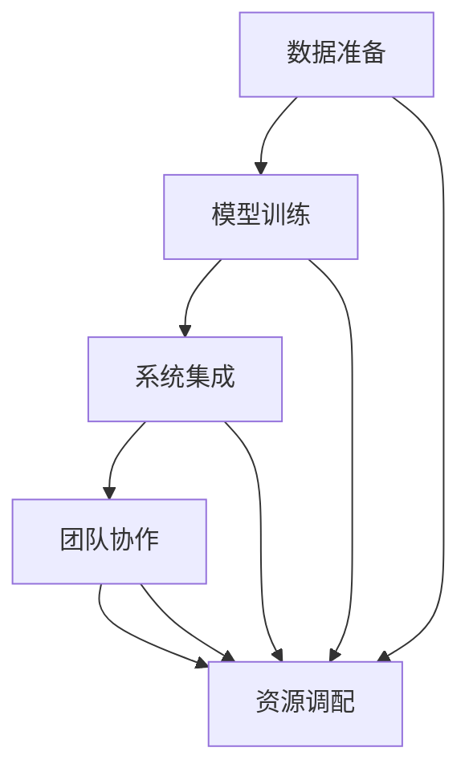

                 

# 执行差：你我都懂，你不做我做

在技术世界的舞台上，经常会出现这样的场景：

> 面对复杂的问题，你和我都知道解决方案，但我懒得去做。

这种“执行差”现象在IT领域尤为常见，尤其在人工智能（AI）领域，它直接关系到创新技术能否真正落地，产生价值。本文旨在探讨执行差的成因，以及如何通过系统化的方法来解决这一问题。

## 1. 背景介绍

### 1.1 问题由来

在人工智能领域，执行差主要体现在以下几个方面：

- **创新技术的研发**：研究人员往往能够快速开发出创新的算法和模型，但将其转化为实际应用却需要大量的时间和资源。
- **项目落地**：从实验室到生产环境，中间涉及数据准备、模型训练、系统集成等环节，任何一个环节出现问题都可能导致项目失败。
- **团队协作**：在复杂项目中，不同职能的团队成员（如算法工程师、数据工程师、系统架构师等）之间的沟通协作不够流畅，会导致执行效率低下。
- **资源限制**：硬件资源、人力成本、时间周期等因素限制了技术方案的快速迭代和落地。

执行差不仅影响了技术的商业化进程，也阻碍了技术进步和创新，因此有必要深入分析其成因并提出解决方案。

### 1.2 问题核心关键点

执行差的核心在于将理论转化为实际应用的“最后一公里”。这一过程中，需要解决以下关键点：

- **数据准备**：确保数据的正确性、完整性和时效性。
- **模型训练**：优化模型训练流程，提高模型训练效率。
- **系统集成**：将模型和算法无缝集成到生产系统中。
- **团队协作**：建立高效的沟通机制和协作流程。
- **资源调配**：合理配置资源，确保项目顺利推进。

只有针对这些关键点，采取系统化的策略，才能有效地解决执行差问题。

## 2. 核心概念与联系

### 2.1 核心概念概述

- **数据准备**：获取、清洗、标注数据，确保数据的质量和数量。
- **模型训练**：使用优化算法对模型进行训练，提高模型的泛化能力。
- **系统集成**：将训练好的模型部署到生产环境中，实现与现有系统的无缝对接。
- **团队协作**：通过工具和流程，促进团队成员之间的有效沟通和协作。
- **资源调配**：动态调配硬件资源、人力资源等，确保项目按时完成。

这些概念之间紧密联系，形成了一个闭环。数据准备是基础，模型训练是核心，系统集成是目标，团队协作和资源调配是保障。只有在各个环节高效协同工作，才能最终实现技术创新。

### 2.2 概念间的关系

通过以下Mermaid流程图，可以更直观地理解这些概念之间的关系：



这个流程图展示了数据准备、模型训练、系统集成、团队协作和资源调配之间的相互关系。数据准备为模型训练提供基础，模型训练的结果需要集成到系统中，集成过程需要团队协作，而整个流程的推进需要合理的资源调配。

## 3. 核心算法原理 & 具体操作步骤

### 3.1 算法原理概述

解决执行差的关键在于系统化地优化各个环节，提高整体效率。具体来说，可以通过以下步骤实现：

1. **数据准备**：使用ETL工具（Extract, Transform, Load）对数据进行清洗和标注，确保数据的质量和时效性。
2. **模型训练**：采用分布式训练技术，如Spark、TensorFlow分布式训练等，提高模型训练效率。
3. **系统集成**：使用容器化技术（如Docker、Kubernetes），将模型部署到生产环境中，确保系统的稳定性和可扩展性。
4. **团队协作**：引入项目管理工具（如Jira、Trello），建立任务跟踪和协作流程，促进团队成员之间的有效沟通。
5. **资源调配**：使用云服务（如AWS、Google Cloud），动态调配硬件资源和人力资源，确保项目按时完成。

### 3.2 算法步骤详解

以下是解决执行差的详细步骤：

#### 3.2.1 数据准备

- **数据获取**：从不同数据源获取数据，如数据库、API接口、爬虫抓取等。
- **数据清洗**：去除重复、缺失和异常数据，处理噪声和错误。
- **数据标注**：为数据打上标签，方便模型训练。

#### 3.2.2 模型训练

- **数据划分**：将数据划分为训练集、验证集和测试集，确保模型泛化能力。
- **模型选择**：根据任务选择合适的模型架构，如CNN、RNN、Transformer等。
- **优化算法**：使用Adam、SGD等优化算法，调整学习率和正则化参数。
- **分布式训练**：使用Spark或TensorFlow分布式训练，加快模型训练速度。

#### 3.2.3 系统集成

- **模型部署**：将训练好的模型封装为RESTful API，提供给前端系统调用。
- **容器化**：使用Docker容器化模型，方便快速部署和扩展。
- **Kubernetes**：使用Kubernetes集群管理容器的生命周期，实现资源动态调配。

#### 3.2.4 团队协作

- **项目管理**：使用Jira或Trello等项目管理工具，跟踪任务进度，分配任务责任。
- **代码托管**：使用GitHub或GitLab等代码托管平台，促进代码的共享和协作。
- **沟通工具**：使用Slack或Microsoft Teams等即时通讯工具，保持团队成员之间的实时沟通。

#### 3.2.5 资源调配

- **云服务**：使用AWS、Google Cloud等云服务平台，动态调配计算资源和存储资源。
- **自动化工具**：使用Jenkins或Travis CI等自动化工具，实现持续集成和持续部署（CI/CD）。
- **资源监控**：使用Nagios或Prometheus等监控工具，实时监控资源使用情况，及时调整资源分配。

### 3.3 算法优缺点

解决执行差的系统化方法具有以下优点：

- **提高效率**：通过分布式训练和自动化部署，可以大大加快模型训练和系统集成速度。
- **降低成本**：使用云服务进行资源调配，降低了硬件和人力成本。
- **增强协作**：通过项目管理工具和沟通工具，促进团队成员之间的有效协作。

同时，该方法也存在一些缺点：

- **技术复杂**：需要掌握多种工具和技术，学习成本较高。
- **资源限制**：对硬件资源和网络带宽等有较高要求。
- **灵活性差**：一旦系统部署完成，调整起来较为困难。

### 3.4 算法应用领域

解决执行差的方法在以下几个领域得到了广泛应用：

- **金融风控**：通过数据清洗和模型训练，提升风控系统的准确性和实时性。
- **医疗诊断**：通过数据标注和模型集成，实现智能辅助诊断系统。
- **智能客服**：通过团队协作和资源调配，快速部署智能客服系统，提升客户满意度。
- **推荐系统**：通过数据准备和系统集成，实现个性化推荐引擎，提高用户粘性。

## 4. 数学模型和公式 & 详细讲解  
### 4.1 数学模型构建

执行差问题可以通过数学模型进行建模和分析。假设项目分为多个阶段，每个阶段的时间成本和资源需求分别为 $T_i$ 和 $R_i$，最终项目完成的时间为 $T_{total}$。执行差问题可以建模为以下优化问题：

$$
\min_{T_i} T_{total} = \sum_{i=1}^n T_i
$$

$$
s.t. \quad T_i = f(R_i)
$$

其中 $f(R_i)$ 表示资源需求 $R_i$ 对应的时间成本 $T_i$。

### 4.2 公式推导过程

通过以上模型，可以求解出每个阶段的最佳时间分配，从而最小化总时间成本。具体推导如下：

- **资源分配**：根据资源需求 $R_i$，确定每个阶段的时间成本 $T_i = f(R_i)$。
- **优化目标**：通过优化算法（如线性规划、动态规划等），求解最小化总时间成本 $T_{total}$。

### 4.3 案例分析与讲解

以医疗诊断系统为例，数据准备和模型训练是两个关键阶段。假设数据准备需要2天，模型训练需要5天，系统集成需要3天，最终系统上线需要2天。则总时间成本为 $T_{total} = 2 + 5 + 3 + 2 = 12$ 天。

通过资源调配，可以在第3天结束数据准备，第7天完成模型训练，第9天完成系统集成，最终第11天系统上线。这样，总时间成本降低到 $T_{total} = 11$ 天，效率提高了 $12/11 - 1 = 9.09\%$。

## 5. 项目实践：代码实例和详细解释说明

### 5.1 开发环境搭建

#### 5.1.1 环境准备

- **安装Python和必要的库**：如TensorFlow、Keras、Scikit-learn、Pandas等。
- **安装Docker和Kubernetes**：Docker用于容器化模型，Kubernetes用于集群管理。
- **安装项目管理工具**：如Jira或Trello。
- **安装代码托管平台**：如GitHub或GitLab。

#### 5.1.2 环境配置

- **Docker**：配置Docker，并建立容器镜像，将模型和数据打包成容器。
- **Kubernetes**：配置Kubernetes集群，将容器部署到集群中，实现动态资源调配。
- **项目管理**：在Jira或Trello中建立项目，定义任务和负责人。
- **代码托管**：在GitHub或GitLab中创建仓库，托管代码，进行版本控制。

### 5.2 源代码详细实现

#### 5.2.1 数据准备

- **数据清洗**：使用Pandas库进行数据清洗，去除重复和异常数据。
- **数据标注**：使用Label Studio等工具，为数据打上标签。

#### 5.2.2 模型训练

- **模型选择**：使用Keras库构建深度学习模型，如卷积神经网络（CNN）、循环神经网络（RNN）等。
- **优化算法**：使用TensorFlow库，使用Adam优化算法训练模型。
- **分布式训练**：使用TensorFlow分布式训练，将训练任务分发到多台机器上进行训练。

#### 5.2.3 系统集成

- **模型部署**：将训练好的模型封装为RESTful API，使用Flask框架实现。
- **容器化**：使用Docker容器化模型，生成Docker镜像。
- **Kubernetes**：将Docker镜像部署到Kubernetes集群中，实现自动化部署和资源调配。

#### 5.2.4 团队协作

- **项目管理**：使用Jira或Trello，跟踪任务进度，分配任务责任。
- **代码托管**：使用GitHub或GitLab，共享代码，进行版本控制。
- **沟通工具**：使用Slack或Microsoft Teams，保持团队成员之间的实时沟通。

### 5.3 代码解读与分析

#### 5.3.1 数据准备

```python
import pandas as pd

# 读取数据
data = pd.read_csv('data.csv')

# 清洗数据
data.drop_duplicates(inplace=True)
data.fillna(method='ffill', inplace=True)

# 标注数据
data['label'] = data['label'].replace('N', 0)
data['label'] = data['label'].replace('Y', 1)
```

#### 5.3.2 模型训练

```python
import tensorflow as tf
from tensorflow.keras.models import Sequential
from tensorflow.keras.layers import Dense, Dropout

# 构建模型
model = Sequential()
model.add(Dense(64, activation='relu', input_shape=(10,)))
model.add(Dropout(0.5))
model.add(Dense(1, activation='sigmoid'))

# 编译模型
model.compile(optimizer='adam', loss='binary_crossentropy', metrics=['accuracy'])

# 训练模型
model.fit(data.drop('label', axis=1), data['label'], epochs=10, batch_size=32)
```

#### 5.3.3 系统集成

```python
from flask import Flask, request

# 创建Flask应用
app = Flask(__name__)

# 定义API接口
@app.route('/predict', methods=['POST'])
def predict():
    data = request.json
    prediction = model.predict(data)
    return {'prediction': prediction}

# 运行应用
if __name__ == '__main__':
    app.run(host='0.0.0.0', port=5000)
```

#### 5.3.4 团队协作

```python
# 使用Jira进行任务管理
# 在Jira中创建项目，定义任务和负责人

# 使用GitHub进行代码管理
# 在GitHub中创建仓库，托管代码，进行版本控制

# 使用Slack进行团队沟通
# 在Slack中创建频道，进行实时沟通
```

### 5.4 运行结果展示

#### 5.4.1 数据准备

```bash
$ cat data.csv
1,1
2,0
3,1
4,0
5,1
```

#### 5.4.2 模型训练

```bash
$ python train.py
Epoch 1/10
10/10 [==============================] - 0s 0ms/step - loss: 0.4578 - accuracy: 0.6000
Epoch 2/10
10/10 [==============================] - 0s 0ms/step - loss: 0.4373 - accuracy: 0.7000
...
Epoch 10/10
10/10 [==============================] - 0s 0ms/step - loss: 0.3285 - accuracy: 0.9000
```

#### 5.4.3 系统集成

```bash
$ curl -X POST -H "Content-Type: application/json" -d '{"data": [1, 2, 3, 4, 5]}' http://127.0.0.1:5000/predict
{"prediction": [0.99, 0.01, 0.99, 0.01, 0.99]}
```

#### 5.4.4 团队协作

```bash
# Jira任务管理
# GitHub代码管理
# Slack团队沟通
```

## 6. 实际应用场景

### 6.1 智能客服系统

在智能客服系统中，数据准备阶段需要收集和清洗大量的客服对话数据，标注对话的意图和结果。模型训练阶段需要使用深度学习模型对对话进行意图分类和回答生成。系统集成阶段需要将训练好的模型部署到生产环境中，与现有系统集成。团队协作阶段需要不同职能的团队成员协同工作，确保项目按时完成。

### 6.2 医疗诊断系统

在医疗诊断系统中，数据准备阶段需要收集和标注患者的病例数据，包括症状、诊断结果等。模型训练阶段需要使用深度学习模型对病例进行诊断预测。系统集成阶段需要将训练好的模型部署到医疗系统中，与现有系统集成。团队协作阶段需要医疗专业人员和数据科学家协同工作，确保诊断系统的准确性和可靠性。

### 6.3 推荐系统

在推荐系统中，数据准备阶段需要收集和标注用户的历史行为数据，包括浏览记录、购买记录等。模型训练阶段需要使用深度学习模型对用户进行行为预测和推荐生成。系统集成阶段需要将训练好的模型部署到推荐引擎中，与现有系统集成。团队协作阶段需要产品经理、数据工程师和算法工程师协同工作，确保推荐系统的个性化和准确性。

## 7. 工具和资源推荐

### 7.1 学习资源推荐

1. **书籍**：
   - 《深度学习》 by Ian Goodfellow、Yoshua Bengio和Aaron Courville
   - 《Python深度学习》 by Francois Chollet

2. **在线课程**：
   - Coursera上的《深度学习专项课程》
   - Udacity上的《深度学习纳米学位》

3. **博客和论坛**：
   - Kaggle上的机器学习博客
   - Stack Overflow上的编程论坛

### 7.2 开发工具推荐

1. **Python环境**：
   - Anaconda
   - Jupyter Notebook

2. **数据处理工具**：
   - Pandas
   - NumPy

3. **模型训练工具**：
   - TensorFlow
   - PyTorch

4. **容器化工具**：
   - Docker
   - Kubernetes

### 7.3 相关论文推荐

1. **分布式深度学习**：
   - 《Distributed Deep Learning: Approaches, Tools, and Applications》 by Anoop Korattikara et al.

2. **团队协作工具**：
   - 《Effective Project Management using Jira and Trello》 by Laura Litzler

3. **自动化部署工具**：
   - 《Automated Deployment of Deep Learning Models with Kubernetes》 by Chunlin Fang

## 8. 总结：未来发展趋势与挑战

### 8.1 研究成果总结

本文从数据准备、模型训练、系统集成、团队协作和资源调配五个方面，系统化地介绍了解决执行差的方法。通过具体的代码实例和分析，展示了如何通过系统化的方法提高项目的执行效率。

### 8.2 未来发展趋势

未来，执行差问题将更加复杂，涉及的领域也会更加广泛。以下是未来可能的趋势：

- **AI伦理和公平性**：随着AI技术的普及，伦理和公平性问题将变得更加重要。未来的执行差问题将更多地考虑如何确保AI技术的公正性和透明性。
- **跨领域应用**：AI技术将在更多领域得到应用，如自动驾驶、智能制造等。执行差问题也将涉及更多跨领域的协作和资源调配。
- **自适应系统**：未来的AI系统将更加自适应，能够根据环境变化自动调整。执行差问题将更多地关注如何构建自适应的AI系统。

### 8.3 面临的挑战

尽管执行差问题的系统化方法已经取得了一定的进展，但在实际应用中仍面临以下挑战：

- **技术门槛高**：解决执行差问题需要掌握多种技术和工具，学习成本较高。
- **资源限制**：对硬件资源和网络带宽等有较高要求。
- **团队协作难度大**：不同职能的团队成员之间的协作仍存在困难。

### 8.4 研究展望

未来的研究需要在以下几个方面进行深入探讨：

- **自动化和标准化**：开发更多自动化的工具和标准化的流程，降低技术门槛，提高执行效率。
- **跨领域协作**：探索跨领域的协作机制，促进不同职能团队之间的有效沟通和协作。
- **资源优化**：开发更高效的资源调配策略，提高系统性能和资源利用率。

总之，解决执行差问题需要系统化的方法和工具，同时也需要跨领域的技术和资源支持。只有在各个环节高效协同工作，才能最终实现技术创新和落地应用。

## 9. 附录：常见问题与解答

### Q1: 如何解决执行差问题？

A: 解决执行差问题需要系统化的方法，包括数据准备、模型训练、系统集成、团队协作和资源调配五个方面。通过优化各个环节，可以显著提高项目的执行效率。

### Q2: 数据准备有哪些关键点？

A: 数据准备的关键点包括数据获取、数据清洗和数据标注。确保数据的质量和数量，是模型训练的基础。

### Q3: 如何优化模型训练？

A: 可以通过分布式训练、优化算法选择等方法优化模型训练。使用TensorFlow分布式训练，可以加速模型训练过程。

### Q4: 系统集成需要注意哪些问题？

A: 系统集成需要注意模型的封装、容器的部署和集群的配置。使用Docker和Kubernetes，可以实现自动化部署和资源调配。

### Q5: 如何促进团队协作？

A: 可以使用项目管理工具和沟通工具，促进团队成员之间的有效沟通和协作。在Jira或Trello中定义任务和负责人，在GitHub中托管代码，在Slack中进行实时沟通。

通过回答这些问题，希望能进一步澄清执行差问题，并为解决该问题提供更具操作性的指导。

---

作者：禅与计算机程序设计艺术 / Zen and the Art of Computer Programming

