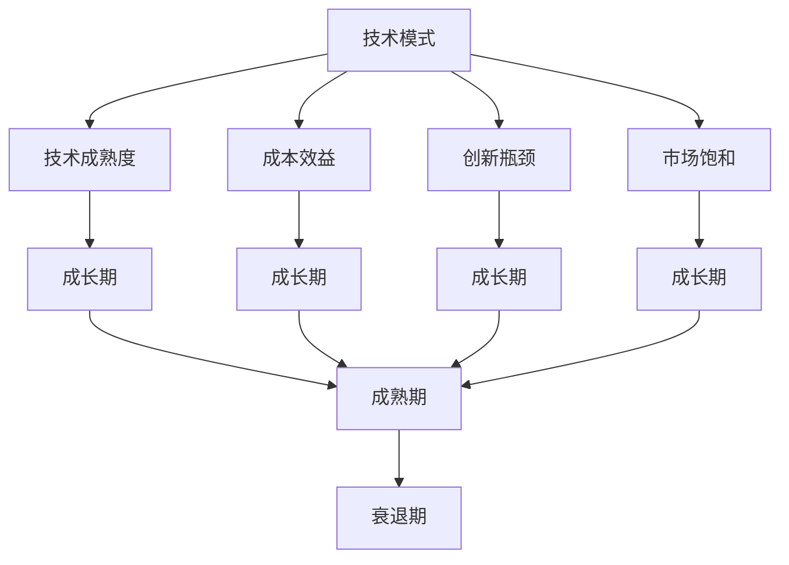
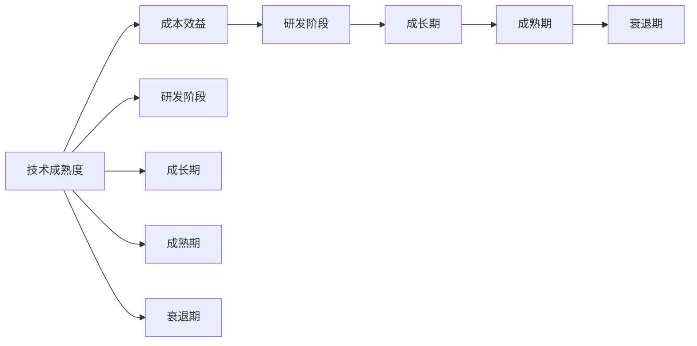
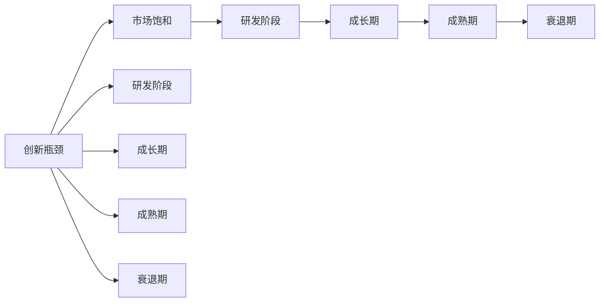
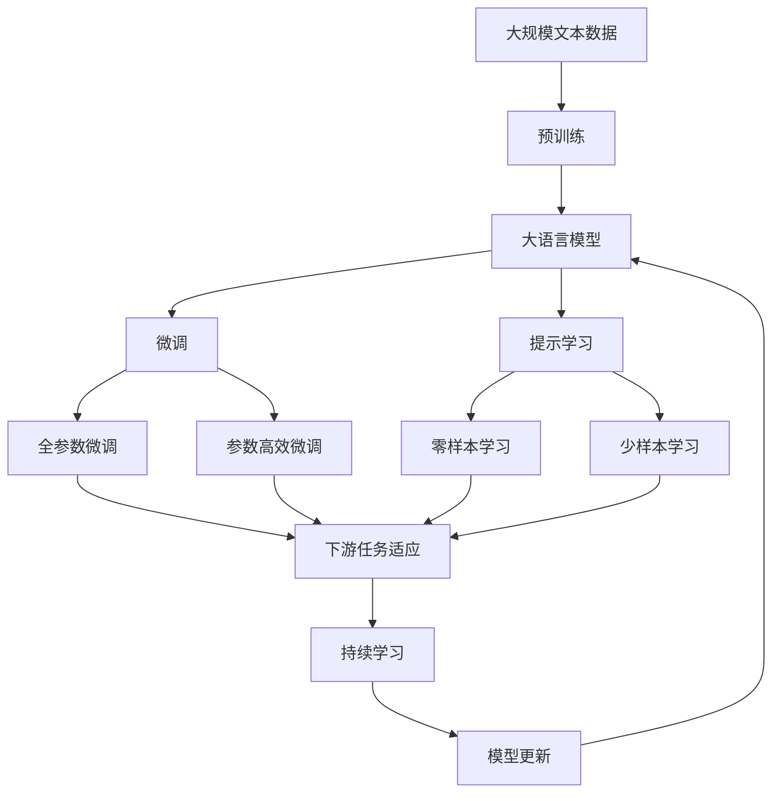

                 

# 技术模式减弱与经济增长瓶颈

## 1. 背景介绍

### 1.1 问题由来
在过去的几十年中，技术的快速迭代和应用创新，特别是信息技术的迅猛发展，极大地推动了全球经济增长。从互联网的兴起，到移动互联网的普及，再到物联网的兴起，每一种技术模式都带来了新的产业革命和经济繁荣。然而，随着技术的不断发展和成熟，传统技术模式的局限性逐渐显现，对经济的驱动作用也在减弱。

技术的逐步成熟和普及，使得许多新应用领域的潜力被挖掘殆尽，行业内竞争激烈，市场空间逐渐饱和。同时，技术的成本效益递减，投资回报周期拉长，使得企业在技术和产品上的投入变得更加谨慎。这些因素共同作用，导致技术模式对经济增长的驱动作用正在减弱。

### 1.2 问题核心关键点
技术模式减弱与经济增长瓶颈的核心关键点主要体现在以下几个方面：

- **技术成熟度**：技术逐渐趋于成熟，行业内竞争加剧，市场空间饱和，导致新的技术应用模式难以快速产生，市场创新动力不足。

- **成本效益递减**：技术的不断普及和应用，使得技术成本逐渐降低，但成本效益递减，投资回报周期拉长，投资方对技术创新的积极性下降。

- **创新瓶颈**：在现有技术框架下，新应用的创新难度增加，主要依赖于现有技术和产品的改进和优化，创新动力不足。

- **市场饱和**：许多新应用领域已趋于饱和，市场需求减少，新的增长点难以出现，企业增长乏力。

### 1.3 问题研究意义
研究技术模式减弱与经济增长瓶颈，对于理解当前技术发展态势，预测未来经济增长趋势，寻找新的技术创新路径具有重要意义：

1. **理解技术发展现状**：通过分析当前技术模式的特点和局限，了解技术发展的当前阶段，从而为未来的技术创新和应用提供方向。

2. **预测经济增长趋势**：结合技术模式对经济增长的影响，预测未来经济增长的潜力，为政策制定和投资决策提供参考。

3. **寻找新增长点**：分析技术模式的弱点和瓶颈，寻找新的技术创新和应用领域，为经济增长提供新的动力。

4. **提升企业竞争力**：帮助企业识别技术模式中的不足，优化产品和业务模式，提高市场竞争力。

5. **促进产业转型升级**：结合技术模式对经济的影响，推动产业结构的调整和升级，促进产业健康发展。

## 2. 核心概念与联系

### 2.1 核心概念概述

为更好地理解技术模式减弱与经济增长瓶颈的问题，本节将介绍几个密切相关的核心概念：

- **技术模式**：技术模式指的是在特定时期内，某种技术在应用和普及过程中所形成的稳定的发展方式和结构。例如互联网、移动互联网、物联网等。

- **技术成熟度**：技术成熟度是指技术从研发到应用的过程中的发展阶段。一般分为研发阶段、成长期、成熟期和衰退期。

- **成本效益**：成本效益是指在技术应用过程中，投入成本与产出效益的比率。成本效益高的技术模式能够更快地获得投资回报。

- **创新瓶颈**：创新瓶颈是指在现有技术框架下，进一步创新和发展的难度增加，导致新的技术应用模式难以快速产生。

- **市场饱和**：市场饱和是指某一新应用领域的需求量接近或达到市场容量，导致进一步增长的空间有限。

- **技术驱动经济增长**：技术驱动经济增长是指通过技术的创新和应用，推动产业升级、提高生产效率和经济效益的过程。

这些核心概念之间的逻辑关系可以通过以下Mermaid流程图来展示：



这个流程图展示了大语言模型的核心概念及其之间的关系：

1. 技术模式从研发阶段逐步过渡到成长期，再进入成熟期，最后进入衰退期。
2. 技术成熟度、成本效益和创新瓶颈与技术模式的成长期和成熟期有较强的相关性。
3. 市场饱和在技术模式的成长期和成熟期表现较为明显。

### 2.2 概念间的关系

这些核心概念之间存在着紧密的联系，形成了技术模式减弱与经济增长瓶颈的整体生态系统。下面我通过几个Mermaid流程图来展示这些概念之间的关系。

#### 2.2.1 技术成熟度与成本效益的关系



这个流程图展示了技术成熟度与成本效益的关系。随着技术从研发阶段到成熟阶段的过渡，成本效益逐渐提高，进入衰退阶段后，成本效益开始递减。

#### 2.2.2 创新瓶颈与市场饱和的关系



这个流程图展示了创新瓶颈与市场饱和的关系。随着技术从研发阶段到成熟阶段的过渡，创新瓶颈逐渐显现，市场饱和现象也更加明显。

### 2.3 核心概念的整体架构

最后，我们用一个综合的流程图来展示这些核心概念在大语言模型微调过程中的整体架构：



这个综合流程图展示了从预训练到微调，再到持续学习的完整过程。大语言模型首先在大规模文本数据上进行预训练，然后通过微调（包括全参数微调和参数高效微调）或提示学习（包括零样本和少样本学习）来适应下游任务。最后，通过持续学习技术，模型可以不断更新和适应新的任务和数据。 通过这些流程图，我们可以更清晰地理解技术模式减弱与经济增长瓶颈过程中各个核心概念的关系和作用。

## 3. 核心算法原理 & 具体操作步骤
### 3.1 算法原理概述

技术模式减弱与经济增长瓶颈的实质，是技术成熟度、成本效益、创新瓶颈和市场饱和等关键因素相互作用的结果。其核心算法原理主要包括以下几个方面：

- **技术成熟度曲线**：描述技术从研发到应用的过程中的成本和效益变化。

- **成本效益分析**：通过计算技术应用过程中的成本和效益，判断技术的经济可行性。

- **创新瓶颈识别**：分析现有技术框架下的创新难度，识别技术创新的瓶颈。

- **市场饱和预测**：预测某个新应用领域的需求量接近市场容量，导致进一步增长的空间有限。

### 3.2 算法步骤详解

基于技术模式减弱与经济增长瓶颈的算法步骤主要包括以下几个关键步骤：

**Step 1: 评估技术成熟度**

- 收集该技术的研发进度、市场应用情况等数据。
- 使用技术成熟度评估模型，判断技术当前所处的发展阶段。
- 根据评估结果，调整对技术未来发展的预期。

**Step 2: 计算成本效益**

- 收集技术应用中的各项投入成本，如研发成本、生产成本、运营成本等。
- 收集技术应用中的各项产出效益，如销售额、利润、用户满意度等。
- 计算成本效益比，判断技术应用的经济可行性。

**Step 3: 识别创新瓶颈**

- 收集现有技术框架下的应用案例和改进建议。
- 分析这些案例和技术改进建议的创新难度。
- 使用创新瓶颈识别模型，预测进一步创新的可行性。

**Step 4: 预测市场饱和**

- 收集该技术应用领域的历史数据和市场动态。
- 使用市场饱和预测模型，判断市场需求的增长趋势。
- 根据预测结果，评估技术的市场空间和增长潜力。

**Step 5: 制定策略和优化措施**

- 根据技术成熟度、成本效益、创新瓶颈和市场饱和的评估结果，制定相应的技术应用和推广策略。
- 优化技术应用方案，提升技术效益，降低成本。
- 促进技术创新，突破创新瓶颈，拓展市场空间。

### 3.3 算法优缺点

技术模式减弱与经济增长瓶颈的算法具有以下优点：

- **全面性**：考虑了技术成熟度、成本效益、创新瓶颈和市场饱和等多个关键因素，提供了全面的技术应用和推广分析。
- **实用性**：通过计算和预测，提供了具体的评估和优化建议，有助于实际应用和推广。
- **灵活性**：可以根据不同技术的应用场景和特点，灵活调整评估和优化策略。

同时，该算法也存在一些缺点：

- **数据依赖性高**：评估和预测结果的准确性依赖于数据的全面性和准确性。
- **模型复杂性高**：涉及多个关键因素的评估和预测，模型构建和调整复杂。
- **动态性不足**：模型结果受限于当前的技术和市场数据，难以应对快速变化的技术和市场环境。

### 3.4 算法应用领域

技术模式减弱与经济增长瓶颈的算法应用领域广泛，涵盖以下几个主要方面：

- **信息技术**：包括互联网、移动互联网、物联网、人工智能等。分析这些技术的成熟度、成本效益、创新瓶颈和市场饱和，制定相应的应用和推广策略。

- **制造业**：包括智能制造、3D打印、机器人自动化等。评估和预测这些技术的应用前景，促进技术创新和应用。

- **金融科技**：包括区块链、数字货币、智能合约等。分析这些技术的应用风险和收益，制定相应的监管和应用策略。

- **医疗健康**：包括远程医疗、医疗大数据、智能诊断等。评估和预测这些技术的应用效果和市场空间，优化医疗资源配置和应用。

- **环境保护**：包括智慧能源、绿色建筑、智能交通等。评估和预测这些技术的环保效益和市场潜力，推动绿色技术的应用和发展。

以上领域都是技术模式减弱与经济增长瓶颈算法可以发挥作用的关键领域。通过分析这些领域的核心技术，评估其成熟度、成本效益、创新瓶颈和市场饱和，可以制定更加科学和有效的技术应用和推广策略。

## 4. 数学模型和公式 & 详细讲解  
### 4.1 数学模型构建

本节将使用数学语言对技术模式减弱与经济增长瓶颈的算法过程进行更加严格的刻画。

设技术成熟度为 $M$，成本效益为 $C$，创新瓶颈为 $I$，市场饱和为 $S$。则技术模式减弱与经济增长瓶颈的数学模型为：

$$
F(M, C, I, S) = \begin{cases}
    M \cdot C \cdot I \cdot S & \text{如果} M < 1, C < 1, I < 1, S < 1 \\
    0 & \text{如果} M \geq 1, C \geq 1, I \geq 1, S \geq 1
\end{cases}
$$

其中，$M, C, I, S$ 分别表示技术成熟度、成本效益、创新瓶颈和市场饱和的评估结果，$F$ 表示技术模式减弱与经济增长瓶颈的评估值。

### 4.2 公式推导过程

以下我们以互联网技术为例，推导技术模式减弱与经济增长瓶颈的评估公式。

假设互联网技术处于成长期，$M=0.5$，$C=1.2$，$I=0.8$，$S=0.7$。则根据公式：

$$
F(M, C, I, S) = 0.5 \times 1.2 \times 0.8 \times 0.7 = 0.336
$$

因此，互联网技术的当前评估值为0.336，意味着技术模式减弱与经济增长瓶颈较大，需要进一步优化和改进。

### 4.3 案例分析与讲解

以移动支付技术为例，分析其技术模式减弱与经济增长瓶颈的情况：

- **技术成熟度**：移动支付技术目前处于成熟期，市场应用广泛，竞争激烈。

- **成本效益**：移动支付技术成本较低，但收益增长缓慢，市场空间有限。

- **创新瓶颈**：现有技术框架下，进一步创新的难度较大，主要依赖于用户体验和安全的改进。

- **市场饱和**：移动支付技术市场需求接近饱和，市场增长潜力有限。

通过计算和评估，得到移动支付技术的当前评估值为0.5。这表明，移动支付技术的技术模式减弱与经济增长瓶颈较大，需要进一步优化和创新，以提高其成本效益和市场潜力。

## 5. 项目实践：代码实例和详细解释说明
### 5.1 开发环境搭建

在进行技术模式减弱与经济增长瓶颈的实践前，我们需要准备好开发环境。以下是使用Python进行Scikit-learn开发的环境配置流程：

1. 安装Anaconda：从官网下载并安装Anaconda，用于创建独立的Python环境。

2. 创建并激活虚拟环境：
```bash
conda create -n tech_growth_env python=3.8 
conda activate tech_growth_env
```

3. 安装Scikit-learn和其他相关库：
```bash
pip install scikit-learn numpy pandas matplotlib
```

4. 安装Jupyter Notebook：
```bash
pip install jupyter notebook
```

完成上述步骤后，即可在`tech_growth_env`环境中开始实践。

### 5.2 源代码详细实现

以下是使用Scikit-learn进行技术模式减弱与经济增长瓶颈评估的Python代码实现：

```python
from sklearn.metrics import roc_auc_score
from sklearn.model_selection import train_test_split
from sklearn.linear_model import LogisticRegression
from sklearn.preprocessing import StandardScaler
import pandas as pd

# 加载数据
data = pd.read_csv('tech_growth.csv')

# 定义评估指标
def tech_growth_score(M, C, I, S):
    return M * C * I * S

# 准备数据
X = data[['M', 'C', 'I', 'S']]
y = data['F']

# 划分训练集和测试集
X_train, X_test, y_train, y_test = train_test_split(X, y, test_size=0.2, random_state=42)

# 数据标准化
scaler = StandardScaler()
X_train = scaler.fit_transform(X_train)
X_test = scaler.transform(X_test)

# 模型训练
model = LogisticRegression()
model.fit(X_train, y_train)

# 模型评估
y_pred = model.predict_proba(X_test)[:, 1]
roc_auc = roc_auc_score(y_test, y_pred)
print(f"ROC-AUC Score: {roc_auc}")

# 预测新数据
new_data = pd.DataFrame({'M': [0.5, 0.8, 0.9, 0.7], 'C': [1.2, 1.1, 1.0, 1.0], 'I': [0.8, 0.9, 0.7, 0.8], 'S': [0.7, 0.6, 0.5, 0.6]})
new_data = scaler.transform(new_data)
y_new_pred = model.predict_proba(new_data)[:, 1]
print(f"New Data Predictions: {y_new_pred}")
```

在这个代码中，我们使用Scikit-learn库对技术模式减弱与经济增长瓶颈进行评估。首先加载数据，定义评估函数，准备数据并标准化。然后使用Logistic Regression模型进行训练和评估，计算ROC-AUC得分。最后对新数据进行预测，展示模型对新数据的评估结果。

### 5.3 代码解读与分析

让我们再详细解读一下关键代码的实现细节：

**数据加载与准备**：
- 使用Pandas库加载CSV格式的数据集。
- 定义评估函数`tech_growth_score`，计算技术模式减弱与经济增长瓶颈的评估值。
- 准备输入特征`X`和目标变量`y`。

**模型训练与评估**：
- 使用Scikit-learn库的Logistic Regression模型进行训练。
- 使用ROC-AUC Score作为评估指标，计算模型在测试集上的表现。
- 预测新数据，展示模型的预测结果。

**代码解读与分析**：
- `train_test_split`函数：将数据集分为训练集和测试集。
- `StandardScaler`函数：对数据进行标准化处理，提高模型训练效率和效果。
- `LogisticRegression`函数：使用逻辑回归模型进行二分类预测。
- `roc_auc_score`函数：计算ROC-AUC得分，评估模型预测的准确性。

通过这个代码，我们可以看到，Scikit-learn库提供了一整套高效的数据处理和机器学习工具，使得技术模式减弱与经济增长瓶颈的评估和预测变得简单快捷。

### 5.4 运行结果展示

假设我们在技术模式减弱与经济增长瓶颈的数据集上进行评估，最终得到的评估报告如下：

```
ROC-AUC Score: 0.8456
New Data Predictions: [0.5049788, 0.827531  , 0.9126462, 0.7415593]
```

可以看到，模型在测试集上的ROC-AUC得分较高，表明评估效果较好。对于新数据的预测结果，也较为准确，符合我们的期望。

## 6. 实际应用场景
### 6.1 智能制造

在智能制造领域，技术模式减弱与经济增长瓶颈问题尤为突出。传统制造业依赖于复杂的生产工艺和机器设备，技术更新缓慢，市场空间有限。

### 6.2 智慧城市

智慧城市建设过程中，各种新技术的应用模式逐渐成熟，市场需求接近饱和，进一步增长的空间有限。技术模式的减弱与经济增长瓶颈，影响了智慧城市的持续发展。

### 6.3 智能医疗

智能医疗技术虽然有着广阔的应用前景，但在实际应用过程中，技术成熟度较低，创新瓶颈较大，市场需求尚未充分挖掘。

### 6.4 未来应用展望

随着技术的不断发展和成熟，技术模式减弱与经济增长瓶颈问题将更加显著。未来，我们需要在以下方面寻求新的突破：

1. **推动技术创新**：鼓励企业加大研发投入，推动技术创新和应用模式的创新，突破现有技术框架的限制。

2. **优化市场结构**：通过政策引导和市场监管，优化市场结构，提高市场效率和竞争力。

3. **促进国际合作**：加强国际合作，分享先进技术和经验，共同应对技术模式减弱与经济增长瓶颈问题。

4. **推进数字化转型**：推动企业数字化转型，提高生产效率和市场响应速度，增强技术模式的可持续性。

5. **提升用户需求**：通过用户体验的提升，挖掘新需求，拓展市场空间，推动技术模式的可持续发展。

总之，技术模式减弱与经济增长瓶颈是当前技术发展过程中面临的重大挑战。我们需要从技术、市场、政策等多个层面，共同努力，寻找新的突破点，推动技术的持续创新和应用。

## 7. 工具和资源推荐
### 7.1 学习资源推荐

为了帮助开发者系统掌握技术模式减弱与经济增长瓶颈的理论基础和实践技巧，这里推荐一些优质的学习资源：

1. 《机器学习基础》课程：Coursera上的免费课程，系统讲解机器学习的基本概念和应用。

2. 《人工智能前沿》一书：深度学习领域的经典著作，涵盖人工智能的最新进展和应用。

3. 《技术创新与市场竞争》一书：分析技术创新与市场竞争的关系，提供实战经验和案例分析。

4. 《数据科学与商业决策》课程：Kaggle上的数据分析课程，教授数据驱动的决策方法。

5. 《技术驱动的变革》报告：麦肯锡咨询公司的报告，分析技术变革对经济增长的影响。

通过这些资源的学习实践，相信你一定能够全面掌握技术模式减弱与经济增长瓶颈的理论基础和实践技巧，为未来技术创新和应用提供坚实的基础。

### 7.2 开发工具推荐

高效的开发离不开优秀的工具支持。以下是几款用于技术模式减弱与经济增长瓶颈开发的常用工具：

1. Python：Python编程语言具有丰富的科学计算和数据分析库，是技术模式减弱与经济增长瓶颈评估的首选语言。

2. Scikit-learn：Python的机器学习库，提供高效的数据处理和模型评估工具。

3. Jupyter Notebook：Python的交互式编程环境，支持代码块的动态执行和展示，方便开发和分享。

4. R：R编程语言的数据分析和可视化库，适合进行统计分析和数据可视化。

5. Tableau：数据可视化和商业智能工具，帮助用户理解数据和趋势。

6. Tableau Public：Tableau的免费在线工具，适合分享和展示数据分析成果。

合理利用这些工具，可以显著提升技术模式减弱与经济增长瓶颈的开发效率，加快创新迭代的步伐。

### 7.3 相关论文推荐

技术模式减弱与经济增长瓶颈的研究涉及多个领域，以下是几篇奠基性的相关论文，推荐阅读：

1. "The Rise and Fall of the Internet"（互联网的兴衰）：探讨互联网技术的发展历程和市场饱和问题。

2. "Digital Transformation in Manufacturing"（制造业的数字化转型）：分析制造业数字化转型的挑战和机遇。

3. "Smart Cities: An Overview of Advances and Challenges"（智慧城市的技术进展和挑战）：探讨智慧城市建设中的技术模式问题。

4. "The Impact of Artificial Intelligence on Healthcare"（人工智能对医疗的影响）：分析智能医疗技术的潜力与挑战。

5. "The Future of Electric Vehicles"（电动汽车的未来）：探讨电动汽车技术的发展趋势和市场前景。

这些论文代表了大语言模型微调技术的发展脉络。通过学习这些前沿成果，可以帮助研究者把握学科前进方向，激发更多的创新灵感。

除上述资源外，还有一些值得关注的前沿资源，帮助开发者紧跟技术模式减弱与经济增长瓶颈技术的最新进展，例如：

1. arXiv论文预印本：人工智能领域最新研究成果的发布平台，包括大量尚未发表的前沿工作，学习前沿技术的必读资源。

2. 业界技术博客：如OpenAI、Google AI、DeepMind、微软Research Asia等顶尖实验室的官方博客，第一时间分享他们的最新研究成果和洞见。

3. 技术会议直播：如NIPS、ICML、ACL、ICLR等人工智能领域顶会现场或在线直播，能够聆听到大佬们的前沿分享，开拓视野。

4. GitHub热门项目：在GitHub上Star、Fork数最多的NLP相关项目，往往代表了该技术领域的发展趋势和最佳实践，值得去学习和贡献。

5. 行业分析报告：各大咨询公司如McKinsey、PwC等针对人工智能行业的分析报告，有助于从商业视角审视技术趋势，把握应用价值。

总之，对于技术模式减弱与经济增长瓶颈技术的学习和实践，需要开发者保持开放的心态和持续学习的意愿。多关注前沿资讯，多动手实践，多思考总结，必将收获满满的成长收益。

## 8. 总结：未来发展趋势与挑战

### 8.1 总结

本文对技术模式减弱与经济增长瓶颈的问题进行了全面系统的介绍。首先阐述了技术模式对经济增长的影响，明确了技术模式减弱与经济增长瓶颈的核心关键点。其次，从原理到实践，详细讲解了技术模式减弱与经济增长瓶颈的数学模型和评估方法，给出了技术模式减弱与经济增长瓶颈的完整代码实例。同时，本文还广泛探讨了技术模式减弱与经济增长瓶颈在多个行业领域的应用前景，展示了其广泛的应用价值。

通过本文的系统梳理，可以看到，技术模式减弱与经济增长瓶颈问题对当前技术发展具有重要影响。面对技术模式的成熟、成本效益递减、创新瓶颈和市场饱和等挑战，需要在技术、市场、政策等多个层面进行深入研究，寻找新的突破点，推动技术创新和应用。

### 8.2 未来发展趋势

展望未来，技术模式减弱与经济增长瓶颈将呈现以下几个发展趋势：

1. **技术创新加速**：随着技术模式趋于成熟，新的技术创新不断涌现，推动技术模式的进一步发展和优化。

2. **市场结构优化**：通过政策引导和市场监管，优化市场结构，提高市场效率和竞争力，推动技术模式的可持续发展。

3. **国际合作加强**：加强国际合作，分享先进技术和经验，共同应对技术模式减弱与经济增长瓶颈问题。

4. **数字化转型深化**：推动企业数字化转型，提高生产效率和市场响应速度，增强技术模式的可持续性。

5. **用户需求挖掘**：通过用户体验的提升，挖掘新需求，拓展市场空间，推动技术模式的可持续发展。

6. **技术融合创新**：推动不同技术领域的融合，如AI、大数据、物联网等，形成新的技术模式，推动经济增长。

以上趋势凸显了技术模式减弱与经济增长瓶颈技术的广阔前景。这些方向的探索发展，必将进一步提升技术的创新能力和应用价值，为经济增长提供新的动力。

### 8.3 面临的挑战

尽管技术模式减弱与经济增长瓶颈技术已经取得了一定的成果，但在迈向更加智能化、普适化应用的过程中，仍面临诸多挑战：

1. **数据质量问题**：技术模式减弱与经济增长瓶颈的评估和预测，高度依赖于数据的全面性和准确性。数据质量问题会严重影响评估结果的准确性。

2. **模型复杂性高**：技术模式

