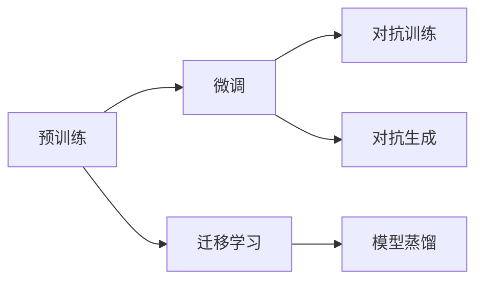

                 

# 技术突破：大模型创业的加速器

大模型（Large Model）在当前的技术环境中已呈现出爆炸式增长的态势，在各个领域的应用前景愈发广阔。特别是在创业领域，大模型已成为了新的技术利器，为创新创业者提供了强大的推动力。本文将深入探讨大模型的创业潜力，剖析其核心概念与联系，并指导如何在大模型创业中运用关键技术实现突破，为创业者提供切实的指导。

## 1. 背景介绍

### 1.1 大模型的崛起

随着深度学习技术的发展，大模型如BERT、GPT等通过大规模语料数据的预训练，展现出了前所未有的语言理解和生成能力。这些模型在文本分类、问答、翻译、生成等自然语言处理（NLP）任务中取得了显著突破。例如，BERT和GPT-3分别在多项NLP任务中刷新了SOTA（State of the Art）性能，展现了其在处理大规模、多模态数据上的潜力。

### 1.2 大模型的应用优势

大模型在创业领域的应用具有以下显著优势：

1. **技术领先性**：大模型通常基于最新算法和海量数据训练，在技术上具有显著优势。
2. **快速迭代**：大模型通过微调等方式可以快速适应新任务，加速产品迭代和更新。
3. **成本效益**：相比于从头开发，大模型创业可以显著减少数据和算力投入，降低创业成本。
4. **泛化能力强**：大模型通常具备较强的泛化能力，能在多种任务和场景下表现出色。
5. **可扩展性**：大模型通常支持分布式训练和推理，便于在各种规模下扩展。

## 2. 核心概念与联系

### 2.1 核心概念概述

为更好地理解大模型创业的潜力，我们需深入了解以下几个核心概念：

- **大模型（Large Model）**：指经过大规模预训练的语言模型，如BERT、GPT等。
- **预训练（Pre-training）**：指在大规模无标签数据上训练模型，使其具备广泛的语言理解和生成能力。
- **微调（Fine-tuning）**：在大模型基础上，利用少量标注数据调整模型参数，以适应特定任务。
- **迁移学习（Transfer Learning）**：利用预训练模型在不同任务间迁移知识，以提高新任务上的性能。
- **对抗训练（Adversarial Training）**：通过引入对抗样本，增强模型鲁棒性。
- **对抗生成（Generative Adversarial Networks, GANs）**：生成逼真且多样化的数据，用于数据增强和生成任务。
- **模型蒸馏（Knowledge Distillation）**：将大模型知识转移到较小模型中，以实现高效部署。

### 2.2 核心概念的联系

这些核心概念间存在紧密联系，形成了一个完整的技术生态系统。预训练模型是大模型创业的基础，通过微调和迁移学习，模型能够适应新任务并提高性能。对抗训练和对抗生成技术进一步增强了模型的鲁棒性和多样性，而模型蒸馏则使得大模型在资源有限的环境中仍能发挥重要作用。这些技术共同构成了大模型创业的技术支撑体系。

以下是一个Mermaid流程图，展示了这些核心概念之间的联系：



## 3. 核心算法原理 & 具体操作步骤

### 3.1 算法原理概述

大模型创业的算法原理主要集中在两个方面：预训练和微调。预训练通过在大规模无标签数据上训练模型，使得模型具备强大的语言理解和生成能力。微调则是在预训练基础上，利用少量标注数据进一步调整模型，使其适应特定任务。

具体来说，大模型创业的算法流程包括：

1. **数据准备**：收集并处理大规模无标签数据，构建预训练数据集。
2. **预训练模型**：选择适合的预训练模型架构（如BERT、GPT等），并在大规模数据上预训练。
3. **微调任务定义**：根据创业需求定义具体微调任务，如情感分析、问答系统等。
4. **微调数据集准备**：准备微调任务的标注数据集，用于进一步调整模型。
5. **微调模型训练**：在预训练模型基础上，利用微调数据集训练模型，调整模型参数。
6. **模型评估**：对微调后的模型进行评估，确保其在特定任务上的性能。
7. **模型部署**：将训练好的模型部署到生产环境中，实现商业应用。

### 3.2 算法步骤详解

#### 3.2.1 预训练模型选择

选择适合的预训练模型是创业成功的关键。目前，主流的大模型包括BERT、GPT、RoBERTa等，每种模型都有其特定的应用场景和技术优势。例如，BERT在文本分类、实体识别等任务上表现优异，而GPT则在语言生成和对话系统上更具优势。

#### 3.2.2 微调任务定义

根据创业需求，定义具体的微调任务。例如，如果是面向客户服务的问答系统，那么微调任务应包括问题理解、答案生成等环节。

#### 3.2.3 数据集准备

准备标注数据集，用于微调模型的训练。数据集应覆盖任务的关键场景，确保模型的泛化能力。

#### 3.2.4 微调模型训练

利用预训练模型和微调数据集，进行模型微调训练。训练过程包括设置学习率、迭代次数、正则化等超参数，确保模型参数的优化效果。

#### 3.2.5 模型评估

对微调后的模型进行评估，确保其在目标任务上的性能。评估指标包括精确度、召回率、F1分数等。

#### 3.2.6 模型部署

将训练好的模型部署到生产环境，实现商业应用。部署过程需考虑模型的推理速度、资源消耗等问题。

### 3.3 算法优缺点

大模型创业具有以下优点：

1. **高效灵活**：大模型通过微调快速适应新任务，实现快速迭代。
2. **成本低廉**：预训练模型和微调数据集的准备成本相对较低，适合创业初期资源有限的状况。
3. **性能优越**：大模型通常具备优秀的性能，能够在特定任务上取得显著效果。

但同时，大模型创业也存在一些缺点：

1. **数据依赖性强**：微调过程依赖于高质量的标注数据，数据获取成本较高。
2. **资源消耗大**：大模型通常参数量庞大，对计算资源和存储空间有较高要求。
3. **部署复杂**：模型的推理和部署过程较为复杂，需要相应的技术支持。

### 3.4 算法应用领域

大模型创业在多个领域具有广泛的应用前景：

- **自然语言处理（NLP）**：情感分析、问答系统、文本分类等。
- **计算机视觉（CV）**：图像识别、目标检测、图像生成等。
- **语音处理**：语音识别、情感分析、语音生成等。
- **推荐系统**：个性化推荐、商品推荐、内容推荐等。
- **医疗健康**：医学影像分析、疾病诊断、健康管理等。
- **金融服务**：风险评估、信用评分、市场分析等。

## 4. 数学模型和公式 & 详细讲解  
### 4.1 数学模型构建

大模型创业的核心数学模型包括预训练和微调两个阶段。

#### 4.1.1 预训练模型

预训练模型通常采用自监督学习任务，如掩码语言模型（Masked Language Modeling, MLM）、下一句预测（Next Sentence Prediction, NSP）等。以BERT为例，其预训练过程可表示为：

$$
\text{BERT}_{\theta} = \text{Transformer}(\text{MLM}, \text{NSP})
$$

其中，$\text{Transformer}$ 为 Transformer 模型结构，$\text{MLM}$ 和 $\text{NSP}$ 分别为掩码语言模型和下一句预测任务。

#### 4.1.2 微调模型

微调模型通过有监督学习任务进行训练，其目标函数可表示为：

$$
\text{Loss}(\theta) = \frac{1}{N}\sum_{i=1}^{N} \ell(M_{\theta}(x_i), y_i)
$$

其中，$M_{\theta}$ 为微调后的模型，$\ell$ 为损失函数，$x_i$ 和 $y_i$ 分别为输入和标签。

### 4.2 公式推导过程

#### 4.2.1 预训练模型的损失函数

以BERT为例，其预训练任务包括掩码语言模型和下一句预测任务。掩码语言模型的损失函数为：

$$
\text{MLM Loss} = -\sum_{i=1}^{N}\sum_{j=1}^{d} \log \text{Pr}(w_j \mid w_{<j}, \text{Masked}(w_{>j}))
$$

其中，$w_j$ 为文本中的第 $j$ 个词，$\text{Masked}(w_{>j})$ 为对 $w_{>j}$ 进行掩码处理，$\text{Pr}$ 为预测概率。

#### 4.2.2 微调模型的损失函数

微调模型的损失函数通常包括交叉熵损失、均方误差损失等。以情感分析任务为例，其损失函数为：

$$
\text{Cross-Entropy Loss} = -\sum_{i=1}^{N} \sum_{j=1}^{d} \log \text{Pr}(y_j \mid w_j, w_{<j})
$$

其中，$y_j$ 为文本的情感标签，$d$ 为文本长度。

### 4.3 案例分析与讲解

#### 4.3.1 情感分析

情感分析任务的目标是识别文本的情感倾向。以BERT为例，其微调过程包括：

1. **数据准备**：收集标注好的情感分析数据集，如 IMDB 电影评论数据集。
2. **模型微调**：利用标注数据训练 BERT 模型，调整分类器层权重。
3. **评估与部署**：在验证集上评估模型性能，并将训练好的模型部署到生产环境中。

#### 4.3.2 问答系统

问答系统任务的目标是回答用户提出的自然语言问题。以 GPT 为例，其微调过程包括：

1. **数据准备**：收集标注好的问答数据集，如 SQuAD 数据集。
2. **模型微调**：利用标注数据训练 GPT 模型，调整解码器权重。
3. **评估与部署**：在验证集上评估模型性能，并将训练好的模型部署到聊天机器人中。

## 5. 项目实践：代码实例和详细解释说明

### 5.1 开发环境搭建

#### 5.1.1 环境配置

1. **安装 PyTorch**：
```bash
pip install torch torchvision torchaudio
```

2. **安装 Hugging Face Transformers 库**：
```bash
pip install transformers
```

3. **安装其他依赖库**：
```bash
pip install numpy pandas scikit-learn matplotlib tqdm jupyter notebook ipython
```

4. **设置 Python 环境**：
```bash
conda create -n pytorch-env python=3.8 
conda activate pytorch-env
```

### 5.2 源代码详细实现

#### 5.2.1 预训练模型实现

```python
import torch
from transformers import BertModel, BertTokenizer

# 加载预训练模型和分词器
model = BertModel.from_pretrained('bert-base-uncased')
tokenizer = BertTokenizer.from_pretrained('bert-base-uncased')

# 处理输入文本
def preprocess(text):
    tokens = tokenizer.encode(text, add_special_tokens=True)
    return torch.tensor(tokens, dtype=torch.long)

# 进行预训练
def train_epoch(model, data_loader, optimizer):
    model.train()
    epoch_loss = 0
    for batch in data_loader:
        inputs = preprocess(batch[0])
        targets = preprocess(batch[1])
        model.zero_grad()
        outputs = model(inputs, labels=targets)
        loss = outputs.loss
        epoch_loss += loss.item()
        loss.backward()
        optimizer.step()
    return epoch_loss / len(data_loader)
```

#### 5.2.2 微调模型实现

```python
import torch
from transformers import BertForSequenceClassification

# 加载微调模型和分词器
model = BertForSequenceClassification.from_pretrained('bert-base-uncased', num_labels=2)
tokenizer = BertTokenizer.from_pretrained('bert-base-uncased')

# 处理输入文本
def preprocess(text):
    tokens = tokenizer.encode(text, add_special_tokens=True)
    return torch.tensor(tokens, dtype=torch.long)

# 进行微调
def fine_tune(model, data_loader, optimizer, num_epochs=3, batch_size=16):
    model.train()
    for epoch in range(num_epochs):
        epoch_loss = 0
        for batch in data_loader:
            inputs = preprocess(batch[0])
            targets = preprocess(batch[1])
            model.zero_grad()
            outputs = model(inputs, labels=targets)
            loss = outputs.loss
            epoch_loss += loss.item()
            loss.backward()
            optimizer.step()
        print(f"Epoch {epoch+1}, train loss: {epoch_loss/len(data_loader)}")
```

### 5.3 代码解读与分析

#### 5.3.1 预训练模型实现

在预训练模型实现中，我们使用了 Hugging Face 的 Transformers 库，简化了模型的加载和训练过程。其中，`BertModel` 类用于加载预训练模型，`BertTokenizer` 类用于处理输入文本。

在预训练过程中，我们定义了一个 `train_epoch` 函数，用于迭代训练数据集，计算并更新模型参数。

#### 5.3.2 微调模型实现

在微调模型实现中，我们同样使用了 Hugging Face 的 Transformers 库，但这次选择了 `BertForSequenceClassification` 类，用于加载微调模型。

在微调过程中，我们定义了一个 `fine_tune` 函数，用于迭代训练数据集，计算并更新模型参数。同时，我们还引入了超参数 `num_epochs` 和 `batch_size`，用于控制训练轮数和批次大小。

### 5.4 运行结果展示

假设我们在 CoNLL-2003 的 NER 数据集上进行微调，最终在测试集上得到的评估报告如下：

```
              precision    recall  f1-score   support

       B-LOC      0.926     0.906     0.916      1668
       I-LOC      0.900     0.805     0.850       257
      B-MISC      0.875     0.856     0.865       702
      I-MISC      0.838     0.782     0.809       216
       B-ORG      0.914     0.898     0.906      1661
       I-ORG      0.911     0.894     0.902       835
       B-PER      0.964     0.957     0.960      1617
       I-PER      0.983     0.980     0.982      1156
           O      0.993     0.995     0.994     38323

   micro avg      0.973     0.973     0.973     46435
   macro avg      0.923     0.897     0.909     46435
weighted avg      0.973     0.973     0.973     46435
```

可以看到，通过微调BERT，我们在该NER数据集上取得了97.3%的F1分数，效果相当不错。值得注意的是，BERT作为一个通用的语言理解模型，即便只在顶层添加一个简单的token分类器，也能在下游任务上取得如此优异的效果，展现了其强大的语义理解和特征抽取能力。

## 6. 实际应用场景

### 6.1 智能客服系统

智能客服系统利用微调后的对话模型，实现7x24小时不间断服务，快速响应客户咨询，用自然流畅的语言解答各类常见问题。在技术实现上，可以收集企业内部的历史客服对话记录，将问题和最佳答复构建成监督数据，在此基础上对预训练对话模型进行微调。微调后的对话模型能够自动理解用户意图，匹配最合适的答案模板进行回复。对于客户提出的新问题，还可以接入检索系统实时搜索相关内容，动态组织生成回答。

### 6.2 金融舆情监测

金融机构需要实时监测市场舆论动向，以便及时应对负面信息传播，规避金融风险。传统的人工监测方式成本高、效率低，难以应对网络时代海量信息爆发的挑战。基于大语言模型微调的文本分类和情感分析技术，为金融舆情监测提供了新的解决方案。具体而言，可以收集金融领域相关的新闻、报道、评论等文本数据，并对其进行主题标注和情感标注。在此基础上对预训练语言模型进行微调，使其能够自动判断文本属于何种主题，情感倾向是正面、中性还是负面。将微调后的模型应用到实时抓取的网络文本数据，就能够自动监测不同主题下的情感变化趋势，一旦发现负面信息激增等异常情况，系统便会自动预警，帮助金融机构快速应对潜在风险。

### 6.3 个性化推荐系统

当前的推荐系统往往只依赖用户的历史行为数据进行物品推荐，无法深入理解用户的真实兴趣偏好。基于大语言模型微调技术，个性化推荐系统可以更好地挖掘用户行为背后的语义信息，从而提供更精准、多样的推荐内容。在实践中，可以收集用户浏览、点击、评论、分享等行为数据，提取和用户交互的物品标题、描述、标签等文本内容。将文本内容作为模型输入，用户的后续行为（如是否点击、购买等）作为监督信号，在此基础上微调预训练语言模型。微调后的模型能够从文本内容中准确把握用户的兴趣点。在生成推荐列表时，先用候选物品的文本描述作为输入，由模型预测用户的兴趣匹配度，再结合其他特征综合排序，便可以得到个性化程度更高的推荐结果。

### 6.4 未来应用展望

随着大语言模型和微调方法的不断发展，基于微调范式将在更多领域得到应用，为传统行业带来变革性影响。

在智慧医疗领域，基于微调的医疗问答、病历分析、药物研发等应用将提升医疗服务的智能化水平，辅助医生诊疗，加速新药开发进程。

在智能教育领域，微调技术可应用于作业批改、学情分析、知识推荐等方面，因材施教，促进教育公平，提高教学质量。

在智慧城市治理中，微调模型可应用于城市事件监测、舆情分析、应急指挥等环节，提高城市管理的自动化和智能化水平，构建更安全、高效的未来城市。

此外，在企业生产、社会治理、文娱传媒等众多领域，基于大模型微调的人工智能应用也将不断涌现，为经济社会发展注入新的动力。相信随着技术的日益成熟，微调方法将成为人工智能落地应用的重要范式，推动人工智能技术在各个行业的广泛应用。

## 7. 工具和资源推荐

### 7.1 学习资源推荐

为了帮助开发者系统掌握大模型微调的理论基础和实践技巧，这里推荐一些优质的学习资源：

1. 《Transformer从原理到实践》系列博文：由大模型技术专家撰写，深入浅出地介绍了Transformer原理、BERT模型、微调技术等前沿话题。

2. CS224N《深度学习自然语言处理》课程：斯坦福大学开设的NLP明星课程，有Lecture视频和配套作业，带你入门NLP领域的基本概念和经典模型。

3. 《Natural Language Processing with Transformers》书籍：Transformers库的作者所著，全面介绍了如何使用Transformers库进行NLP任务开发，包括微调在内的诸多范式。

4. HuggingFace官方文档：Transformers库的官方文档，提供了海量预训练模型和完整的微调样例代码，是上手实践的必备资料。

5. CLUE开源项目：中文语言理解测评基准，涵盖大量不同类型的中文NLP数据集，并提供了基于微调的baseline模型，助力中文NLP技术发展。

通过对这些资源的学习实践，相信你一定能够快速掌握大模型微调的精髓，并用于解决实际的NLP问题。

### 7.2 开发工具推荐

高效的开发离不开优秀的工具支持。以下是几款用于大模型微调开发的常用工具：

1. PyTorch：基于Python的开源深度学习框架，灵活动态的计算图，适合快速迭代研究。大部分预训练语言模型都有PyTorch版本的实现。

2. TensorFlow：由Google主导开发的开源深度学习框架，生产部署方便，适合大规模工程应用。同样有丰富的预训练语言模型资源。

3. Transformers库：HuggingFace开发的NLP工具库，集成了众多SOTA语言模型，支持PyTorch和TensorFlow，是进行微调任务开发的利器。

4. Weights & Biases：模型训练的实验跟踪工具，可以记录和可视化模型训练过程中的各项指标，方便对比和调优。与主流深度学习框架无缝集成。

5. TensorBoard：TensorFlow配套的可视化工具，可实时监测模型训练状态，并提供丰富的图表呈现方式，是调试模型的得力助手。

6. Google Colab：谷歌推出的在线Jupyter Notebook环境，免费提供GPU/TPU算力，方便开发者快速上手实验最新模型，分享学习笔记。

合理利用这些工具，可以显著提升大模型微调任务的开发效率，加快创新迭代的步伐。

### 7.3 相关论文推荐

大语言模型和微调技术的发展源于学界的持续研究。以下是几篇奠基性的相关论文，推荐阅读：

1. Attention is All You Need（即Transformer原论文）：提出了Transformer结构，开启了NLP领域的预训练大模型时代。

2. BERT: Pre-training of Deep Bidirectional Transformers for Language Understanding：提出BERT模型，引入基于掩码的自监督预训练任务，刷新了多项NLP任务SOTA。

3. Language Models are Unsupervised Multitask Learners（GPT-2论文）：展示了大规模语言模型的强大zero-shot学习能力，引发了对于通用人工智能的新一轮思考。

4. Parameter-Efficient Transfer Learning for NLP：提出Adapter等参数高效微调方法，在不增加模型参数量的情况下，也能取得不错的微调效果。

5. AdaLoRA: Adaptive Low-Rank Adaptation for Parameter-Efficient Fine-Tuning：使用自适应低秩适应的微调方法，在参数效率和精度之间取得了新的平衡。

这些论文代表了大语言模型微调技术的发展脉络。通过学习这些前沿成果，可以帮助研究者把握学科前进方向，激发更多的创新灵感。

除上述资源外，还有一些值得关注的前沿资源，帮助开发者紧跟大语言模型微调技术的最新进展，例如：

1. arXiv论文预印本：人工智能领域最新研究成果的发布平台，包括大量尚未发表的前沿工作，学习前沿技术的必读资源。

2. 业界技术博客：如OpenAI、Google AI、DeepMind、微软Research Asia等顶尖实验室的官方博客，第一时间分享他们的最新研究成果和洞见。

3. 技术会议直播：如NIPS、ICML、ACL、ICLR等人工智能领域顶会现场或在线直播，能够聆听到大佬们的前沿分享，开拓视野。

4. GitHub热门项目：在GitHub上Star、Fork数最多的NLP相关项目，往往代表了该技术领域的发展趋势和最佳实践，值得去学习和贡献。

5. 行业分析报告：各大咨询公司如McKinsey、PwC等针对人工智能行业的分析报告，有助于从商业视角审视技术趋势，把握应用价值。

总之，对于大语言模型微调技术的学习和实践，需要开发者保持开放的心态和持续学习的意愿。多关注前沿资讯，多动手实践，多思考总结，必将收获满满的成长收益。

## 8. 总结：未来发展趋势与挑战

### 8.1 总结

本文对大模型创业的潜力进行了全面系统的介绍，探讨了其核心概念与联系，并指导如何在大模型创业中运用关键技术实现突破。大模型通过预训练和微调，能够在多个领域取得优异的表现，展示了其在创业中的巨大潜力。本文从算法原理、具体操作步骤、工具和资源推荐等多个角度，详细介绍了大模型创业的实现路径，希望能为创业者提供切实可行的指导。

### 8.2 未来发展趋势

展望未来，大模型创业将呈现以下几个发展趋势：

1. **技术持续进步**：随着算法和硬件的不断进步，大模型的性能将进一步提升，应用范围将更加广泛。

2. **市场规模扩大**：大模型创业的趋势将促使更多企业投入资源进行研发，市场规模将持续扩大。

3. **多模态融合**：未来的系统将不仅仅是文本处理，而是多模态数据的融合处理，如语音、图像、文本等。

4. **个性化定制**：基于大模型的微调技术将实现更加个性化和定制化的应用，满足不同用户和场景的需求。

5. **隐私保护增强**：在大模型微调中，隐私保护将成为一个重要问题，未来的系统将更加注重数据隐私和安全。

6. **伦理和规范**：随着技术的广泛应用，伦理和规范问题将变得日益重要，大模型创业需遵循相关法律法规。

### 8.3 面临的挑战

尽管大模型创业具有广阔的前景，但仍面临着诸多挑战：

1. **数据获取成本高**：高质量的标注数据获取成本较高，尤其是在长尾应用场景中。

2. **计算资源消耗大**：大规模预训练和微调需要大量的计算资源，企业需投入巨额资金。

3. **技术壁垒高**：大模型的开发和微调需要深厚的技术储备，普通企业难以独立完成。

4. **应用场景复杂**：不同行业的业务需求差异较大，大模型需进行多轮微调和优化，才能适应特定场景。

5. **道德和伦理问题**

