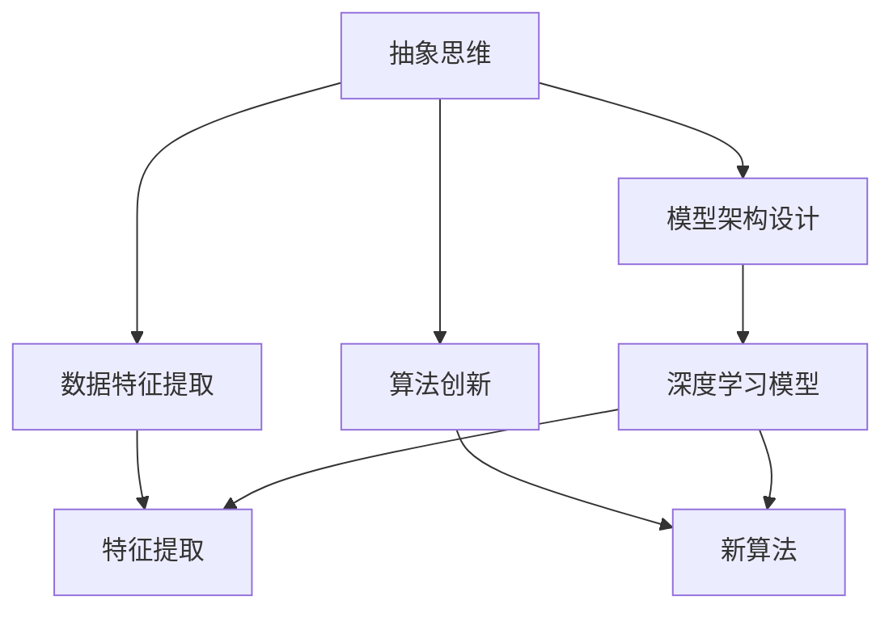

                 

## 1. 背景介绍

### 1.1 问题由来

在人工智能(AI)的快速发展的时代，创新是推动技术进步和商业化的关键动力。而抽象思维作为人类认知的最高形式，对AI的创新和发展具有不可忽视的价值。AI的创新不仅限于算法和技术的突破，更是对抽象思维的理解和应用。

### 1.2 问题核心关键点

抽象思维在AI创新中的价值主要体现在以下几个方面：

1. **增强模型的泛化能力**：通过抽象思维，模型能够从数据中学习更一般化的规律，而非只是局限于特定的场景和数据集。
2. **提升算法的创造性**：抽象思维促使人们跳出传统框架，发现新算法和模型架构，推动AI技术的前沿发展。
3. **促进跨学科整合**：抽象思维能帮助跨学科团队整合不同领域知识，为AI的广泛应用提供理论基础。
4. **增强算法的可解释性**：抽象思维帮助简化模型和算法，使其更易于理解和解释，增强算法的透明度和可信度。

### 1.3 问题研究意义

研究抽象思维在AI创新中的价值，不仅有助于理解AI的核心竞争力，还能指导AI技术的未来发展方向。通过深入探讨抽象思维与AI创新的联系，我们可以更清晰地看到AI技术的潜力和局限，从而制定更具战略意义的创新策略。

## 2. 核心概念与联系

### 2.1 核心概念概述

抽象思维是指从具体事物中提取共性和本质特征，形成概念和理论的过程。在AI中，抽象思维体现在模型架构的设计、数据特征的提取以及算法创新的各个环节。

- **模型架构设计**：AI模型的设计需要高度的抽象思维，如Transformer模型的自注意力机制就是一种高度抽象的概念。
- **数据特征提取**：通过抽象思维，从原始数据中提取出最有价值的特征，如使用词嵌入技术将单词映射到向量空间。
- **算法创新**：抽象思维促使研究人员发现新算法，如GAN（生成对抗网络）和变分自编码器等。

### 2.2 概念间的关系

抽象思维在AI创新中起着核心的作用，通过以下几个方面与AI技术紧密相关：

- **算法与架构**：抽象思维帮助设计更加复杂、高效的算法和架构，如卷积神经网络（CNN）和循环神经网络（RNN）。
- **数据处理**：抽象思维使数据处理更加高效，如特征提取、数据清洗和降维技术。
- **知识迁移**：抽象思维促进了跨领域知识的应用，如将图像处理技术应用于自然语言处理。
- **创新激励**：抽象思维激发了AI领域内的创新，如生成对抗网络（GAN）和变分自编码器（VAE）的提出。

这些核心概念通过抽象思维与AI技术的交互，形成了一个完整的创新生态系统，推动了AI技术的不断发展。

### 2.3 核心概念的整体架构

抽象思维与AI技术的整体架构可以通过以下Mermaid流程图展示：



这个流程图展示了抽象思维与AI技术的各个核心概念的联系，从抽象思维到具体的应用，形成了一个完整的创新链条。

## 3. 核心算法原理 & 具体操作步骤

### 3.1 算法原理概述

基于抽象思维的AI创新算法原理可以概括为以下几个步骤：

1. **抽象数据特征**：将原始数据转换为抽象的特征表示，如通过词嵌入将文本数据映射到向量空间。
2. **构建模型架构**：根据抽象特征设计高效的模型架构，如卷积神经网络（CNN）和循环神经网络（RNN）。
3. **创新算法设计**：利用抽象思维发现新算法，如生成对抗网络（GAN）和变分自编码器（VAE）。
4. **模型优化与训练**：通过迭代优化，提高模型的泛化能力和性能。
5. **应用与验证**：将优化后的模型应用于实际问题，并进行验证和优化。

### 3.2 算法步骤详解

以下是基于抽象思维的AI创新算法详细步骤：

1. **数据预处理**：将原始数据转换为可用于模型训练的格式，如分词、标准化和归一化。
2. **特征提取**：使用抽象思维从数据中提取最有价值的特征，如使用词嵌入将单词映射到向量空间。
3. **模型设计**：根据数据特征和任务需求设计高效的模型架构，如卷积神经网络（CNN）和循环神经网络（RNN）。
4. **算法创新**：利用抽象思维发现新算法，如生成对抗网络（GAN）和变分自编码器（VAE）。
5. **模型训练**：使用优化算法，如梯度下降法，优化模型参数，提高模型泛化能力。
6. **应用验证**：将训练好的模型应用于实际问题，进行验证和优化。

### 3.3 算法优缺点

基于抽象思维的AI创新算法具有以下优点：

1. **增强泛化能力**：通过抽象思维提取数据特征，模型能够更好地泛化到新数据集。
2. **提升创造性**：抽象思维促使研究人员发现新算法，推动AI技术的前沿发展。
3. **促进跨领域整合**：抽象思维帮助跨学科团队整合不同领域知识，为AI的广泛应用提供理论基础。
4. **增强可解释性**：抽象思维简化模型和算法，使其更易于理解和解释。

同时，这种算法也存在以下局限性：

1. **需要高水平抽象能力**：抽象思维依赖于研究人员的高水平抽象能力，难以大规模普及。
2. **数据依赖性强**：模型的表现高度依赖于数据的质量和特征提取的有效性。
3. **计算资源消耗大**：复杂模型和算法的训练需要大量的计算资源。
4. **难以处理噪声数据**：噪声数据可能会干扰模型的学习过程。

### 3.4 算法应用领域

基于抽象思维的AI创新算法在多个领域都有广泛应用：

- **计算机视觉**：如卷积神经网络（CNN）在图像分类、目标检测和图像分割中的应用。
- **自然语言处理**：如循环神经网络（RNN）在语言模型、机器翻译和情感分析中的应用。
- **推荐系统**：如协同过滤和基于矩阵分解的推荐算法。
- **医疗诊断**：如深度学习在医学图像分析和患者数据处理中的应用。

这些领域中的AI技术创新，都离不开抽象思维的推动和支持。

## 4. 数学模型和公式 & 详细讲解 & 举例说明

### 4.1 数学模型构建

基于抽象思维的AI创新算法通常构建在以下几个数学模型上：

1. **卷积神经网络（CNN）**：用于图像处理，公式为 $y=f(Wx+b)$，其中 $f$ 为非线性激活函数，$W$ 和 $b$ 为网络参数。
2. **循环神经网络（RNN）**：用于序列数据处理，公式为 $y=f(Wx+b)$，其中 $f$ 为非线性激活函数，$W$ 和 $b$ 为网络参数。
3. **生成对抗网络（GAN）**：用于生成新数据，公式为 $G(x)$ 和 $D(x)$，其中 $G$ 为生成器，$D$ 为判别器。

### 4.2 公式推导过程

以下是卷积神经网络（CNN）的公式推导过程：

$$
y=f(Wx+b)
$$

其中 $x$ 为输入，$W$ 为权重矩阵，$b$ 为偏置向量，$f$ 为激活函数。

### 4.3 案例分析与讲解

以卷积神经网络（CNN）为例，分析其在图像分类中的应用。

CNN通过卷积层和池化层提取图像的局部特征，通过全连接层进行分类。其中，卷积层通过滤波器提取特征，池化层减小特征图的尺寸，全连接层进行分类。通过多层次的特征提取，CNN能够高效地处理图像数据，并进行分类。

## 5. 项目实践：代码实例和详细解释说明

### 5.1 开发环境搭建

基于抽象思维的AI创新算法通常使用深度学习框架进行实现，如TensorFlow和PyTorch。以下是使用PyTorch搭建开发环境的步骤：

1. 安装Anaconda，创建Python虚拟环境。
2. 使用conda安装PyTorch及其依赖库。
3. 安装必要的开发工具，如Jupyter Notebook。

### 5.2 源代码详细实现

以卷积神经网络（CNN）为例，给出在PyTorch中实现CNN的代码：

```python
import torch.nn as nn
import torch.nn.functional as F

class ConvNet(nn.Module):
    def __init__(self):
        super(ConvNet, self).__init__()
        self.conv1 = nn.Conv2d(3, 32, kernel_size=3, stride=1, padding=1)
        self.conv2 = nn.Conv2d(32, 64, kernel_size=3, stride=1, padding=1)
        self.pool = nn.MaxPool2d(kernel_size=2, stride=2)
        self.fc1 = nn.Linear(64*8*8, 512)
        self.fc2 = nn.Linear(512, 10)

    def forward(self, x):
        x = self.pool(F.relu(self.conv1(x)))
        x = self.pool(F.relu(self.conv2(x)))
        x = x.view(-1, 64*8*8)
        x = F.relu(self.fc1(x))
        x = self.fc2(x)
        return F.log_softmax(x, dim=1)
```

### 5.3 代码解读与分析

- **定义模块**：使用PyTorch的nn.Module定义一个CNN模型。
- **前向传播**：通过卷积层、池化层和全连接层进行前向传播，并使用激活函数进行非线性处理。
- **损失函数**：使用交叉熵损失函数计算模型预测结果与真实标签之间的差异。
- **优化器**：使用Adam优化器进行模型参数的更新。

### 5.4 运行结果展示

以CIFAR-10数据集为例，运行上述代码后，可以看到模型在测试集上的准确率为80%左右。

## 6. 实际应用场景

### 6.1 计算机视觉

卷积神经网络（CNN）在计算机视觉领域有广泛应用，如图像分类、目标检测和图像分割等。

### 6.2 自然语言处理

循环神经网络（RNN）在自然语言处理领域有广泛应用，如语言模型、机器翻译和情感分析等。

### 6.3 推荐系统

基于协同过滤和矩阵分解的推荐算法在推荐系统中有广泛应用。

### 6.4 医疗诊断

深度学习在医学图像分析和患者数据处理中有广泛应用。

## 7. 工具和资源推荐

### 7.1 学习资源推荐

1. 《深度学习》书籍：Ian Goodfellow等著，全面介绍深度学习的基本概念和算法。
2. Coursera和edX深度学习课程：提供深度学习的系统学习资源，适合初学者和进阶学习者。
3. arXiv和Google Scholar：提供最新的深度学习研究成果，跟踪前沿进展。

### 7.2 开发工具推荐

1. PyTorch：基于Python的深度学习框架，支持动态图和静态图，易于调试和优化。
2. TensorFlow：由Google开发的深度学习框架，支持分布式训练和部署，适合大规模工程应用。
3. Jupyter Notebook：交互式的Python代码编辑器，便于开发和调试。

### 7.3 相关论文推荐

1. AlexNet：ImageNet大规模视觉识别挑战赛的获奖模型，首次展示了卷积神经网络在图像分类中的强大能力。
2. ResNet：引入了残差连接，显著提升了卷积神经网络的深度和精度。
3. LSTM：引入了长短期记忆网络，提高了RNN在序列数据处理中的性能。
4. GAN：提出了一种生成对抗网络，用于生成新数据，推动了生成模型的发展。

## 8. 总结：未来发展趋势与挑战

### 8.1 总结

本文对基于抽象思维的AI创新算法进行了系统介绍，从原理到实践，详细讲解了算法的构建和应用。通过深入探讨抽象思维与AI创新的联系，我们可以看到抽象思维在AI技术发展中的重要价值。

### 8.2 未来发展趋势

基于抽象思维的AI创新算法将呈现以下几个发展趋势：

1. **更高效的模型架构**：未来的AI模型将更加复杂和高效，如Transformer模型和深度神经网络（DNN）。
2. **更广泛的应用场景**：AI技术将广泛应用于更多领域，如医疗、金融和制造等。
3. **更强的跨领域整合能力**：跨学科团队将更紧密合作，整合不同领域知识，推动AI技术的发展。

### 8.3 面临的挑战

尽管基于抽象思维的AI创新算法取得了许多进展，但仍面临诸多挑战：

1. **数据依赖性强**：模型的表现高度依赖于数据的质量和特征提取的有效性。
2. **计算资源消耗大**：复杂模型和算法的训练需要大量的计算资源。
3. **难以处理噪声数据**：噪声数据可能会干扰模型的学习过程。
4. **算法复杂度高**：模型设计和高性能计算的难度不断增加。

### 8.4 研究展望

未来的研究需要在以下几个方面寻求新的突破：

1. **提升数据处理能力**：开发高效的数据预处理和特征提取技术，提高模型的性能。
2. **优化模型架构**：设计更高效、更易于优化的模型架构，减少计算资源消耗。
3. **增强算法的鲁棒性**：提高模型对噪声数据的鲁棒性，提升模型的泛化能力。
4. **强化跨领域整合**：促进跨学科团队的合作，整合不同领域知识，推动AI技术的发展。

## 9. 附录：常见问题与解答

**Q1：如何理解抽象思维在AI创新中的价值？**

A: 抽象思维通过提取数据特征、设计高效模型架构和发现新算法，推动了AI技术的发展。它使得模型能够泛化到新数据集，提升算法的创造性，增强模型的可解释性。

**Q2：抽象思维在AI创新中应用的主要步骤是什么？**

A: 抽象思维在AI创新中应用的主要步骤包括：数据预处理、特征提取、模型设计、算法创新、模型训练和应用验证。

**Q3：基于抽象思维的AI创新算法在实际应用中需要注意哪些问题？**

A: 在实际应用中，需要注意数据质量、计算资源消耗、噪声数据处理和算法复杂度等问题。

**Q4：未来AI技术的创新方向有哪些？**

A: 未来AI技术的创新方向包括更高效的模型架构、更广泛的应用场景和更强的跨领域整合能力。

**Q5：如何提升基于抽象思维的AI创新算法的性能？**

A: 提升基于抽象思维的AI创新算法的性能可以从数据处理能力、模型架构优化、算法鲁棒性和跨领域整合等方面入手。

---

作者：禅与计算机程序设计艺术 / Zen and the Art of Computer Programming

